# 一.Java体系结构

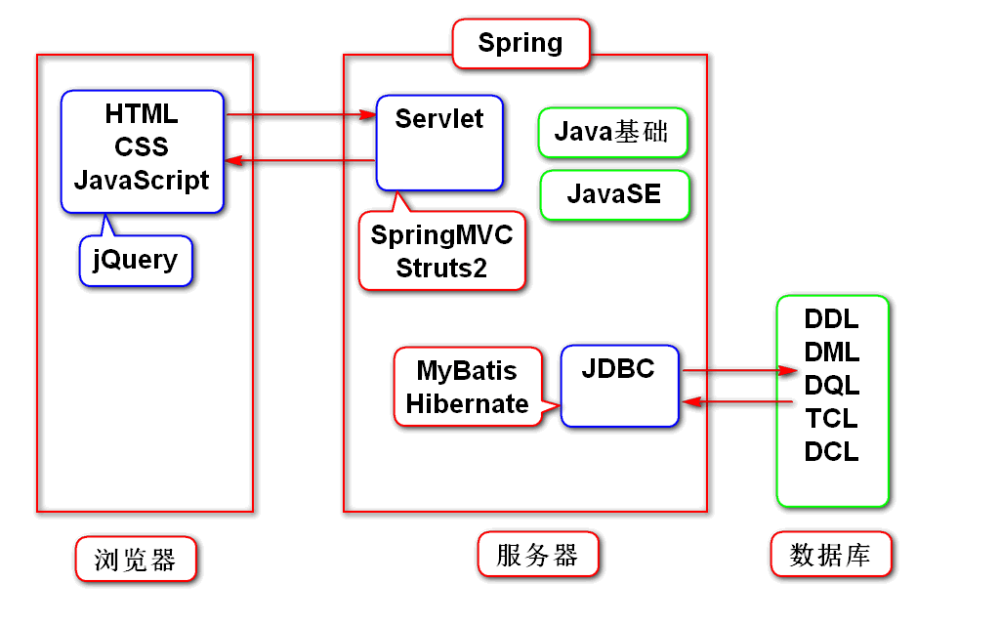

# 二.JDBC简介
## 1.JDBC的要素
**Java Database Connectivity**：Java访问数据库的解决方案。

**JDBC**是Java应用程序访问数据库的里程碑式解决方案。Java研发者希望用相同的方式访问不同的数据库，以实现与具体数据库无关的Java操作界面。

**JDBC**定义了一套标准接口，即访问数据库的通用API，不同的数据库厂商根据各自数据库的特点去实现这些接口。

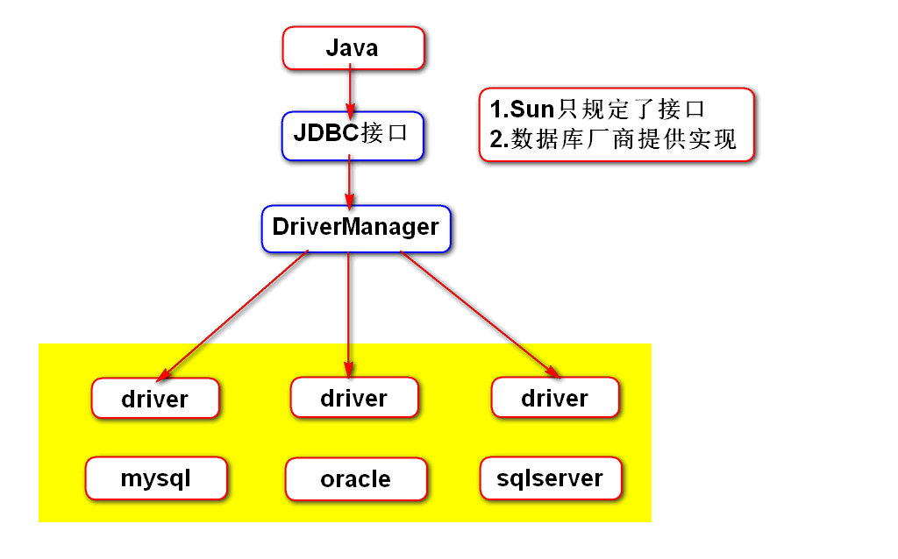

## 2.JDBC的使用步骤
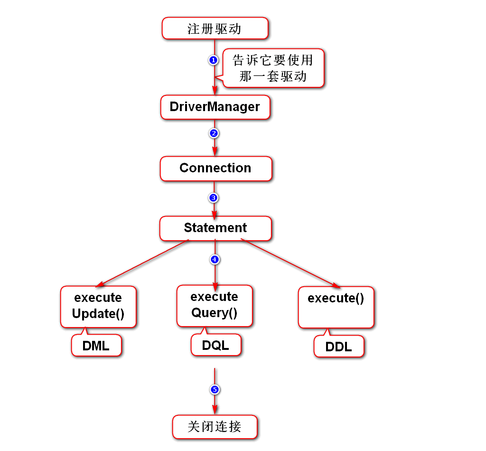

### 2.1. 获取连接

1. 注册驱动
  > Class forName("驱动");

2. 获取连接
  > Connection conn = DriverManager.getConnection("jdbc:oracle:thin:@数据库IP:端口:SID","数据库账号","数据库密码");

3. Statement
  > Statement smt = conn.createStatement();

  1. int executeUpdate(DML) —— 更新记录中的数据
  2. Set executeQuery(DQL) —— 查询数据库中的记录
  3. boolean execute() —— 定义数据表

4. ResultSet

   ResultSet rs = smt.executeQuery(DQL查询语句);

### 2.2. properties配置文件
### 2.3. 关闭连接

## 3.管理连接
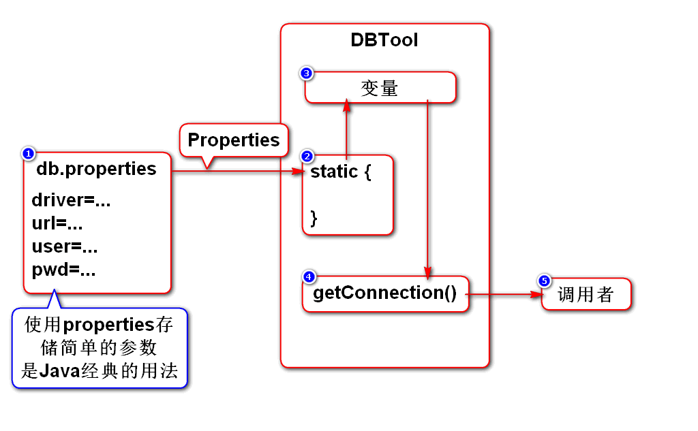


# 三. JDBC 基础编程

## 1. 连接池
### 1.1. 连接池简介
连接池，也叫数据源（datesource）
### 1.2. 
### 1.3. 常见连接池
 - DBCP


### 1.4. 工作原理
 - **新建备用**：当创建连接池后,它会自动创建一批(数量可配置)连接放在池内
 - **标记占用**：当用户调用它时,它会给用户分配一个连接,并将连接标为**占用**
 - **标记空闲**：当用户使用完连接后,将连接归还给连接池,并将连接标为**空闲**
 - **满载扩容**：若连接池发现连接即将满载,它会再创建一批(数量可配置)连接
 - **上限保护**：若占用的连接达到数据库上限(数量可配置)时,连接池会让新用户等待
 - **闲时缩容**：在高峰期过后,连接池会关闭一批(数量可配置)连接

### 1.5. 使用连接池

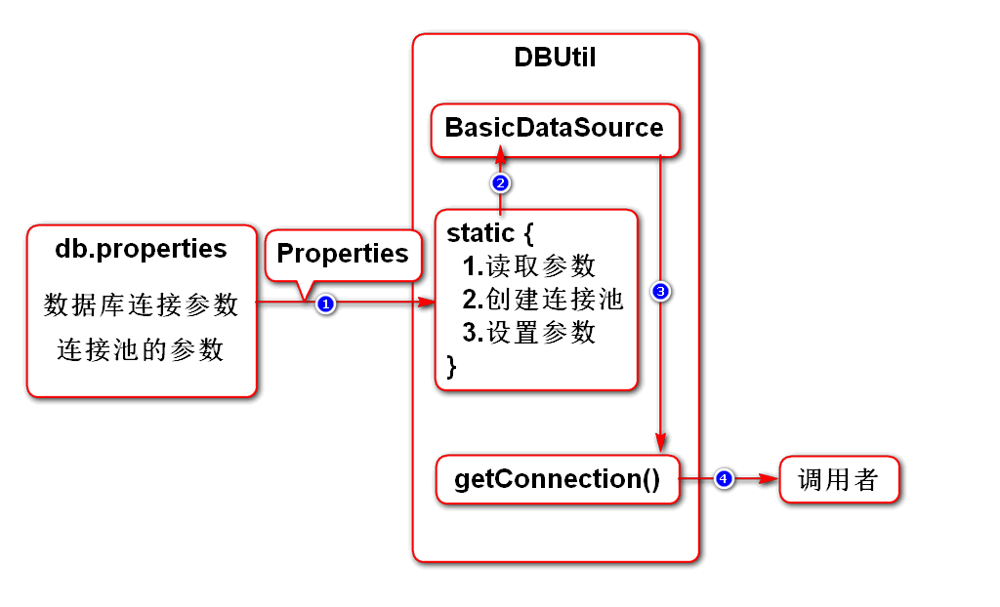

1. 配置连接数
   1.1. 初始连接数 **initsize=1**
   1.2. 最大连接数 **maxsize=2**

2. 初始化连接池
3. 分配连接给用户
4. 根据需要管理连接池 

- 归还连接
  由连接池创建的连接，连接的close方法被重写了，变为了归还连接的逻辑，即：连接池会将连接的状态设置为空闲，并清空连接中所包含的任何数据

## 2. Statement和PreparedStatement
### 2.1. 联系（背）
 - 他们都是用来执行SQL语句的
 - PreparedStatemnt继承自Statement

### 2.2. 区别
 - Statement适合执行静态（无条件）SQL
 - PreparedStatement适合执行动态（有条件）SQL

### 2.3. Statement原理(理解)
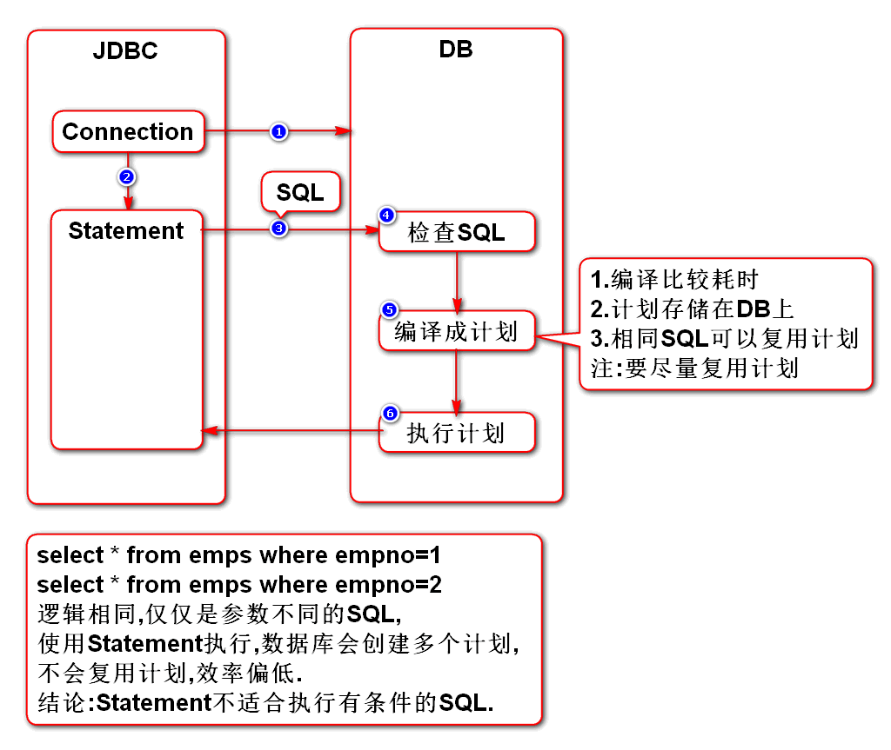

### 2.4. PreparedStatement使用（理解）
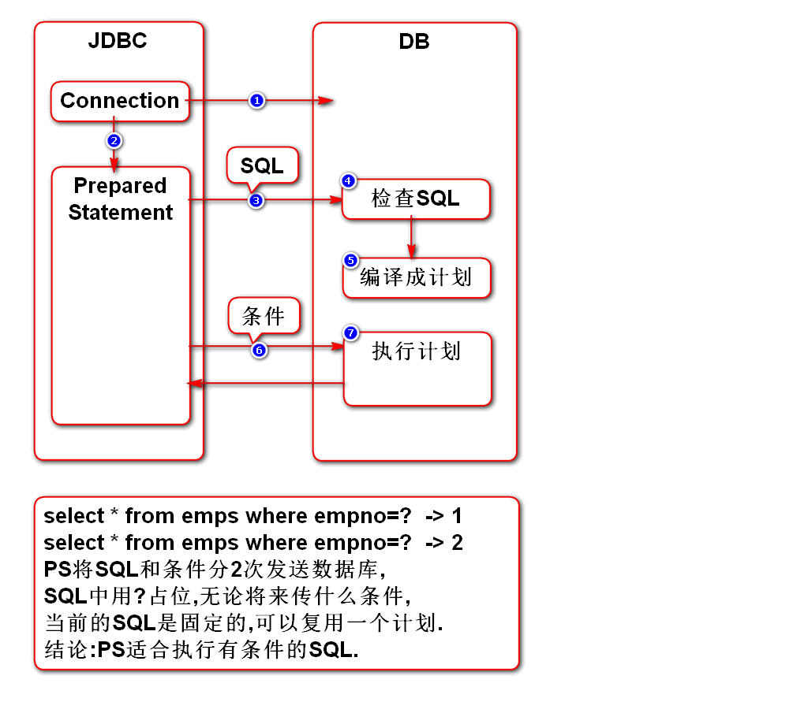


> PreparedStatement ps = conn.prepareStatement(预处理SQL)

此处的SQL语句时只是框架，具体参数用问号 **?** 代替，如：
> String 预处理SQL = "update 表名 set 字段=? where 条件=?" 

给PreparedStatement传递参数
一次传递一个参数，由问号的序号定位，传入后替换该处的问号。
> ps.set类型（问号的序号，问号的值）

设置null值
> ps.setNull(问号的序号, Types.类型常量)

##### 使用PreparedStatement执行DML语句
PreparedStatement把参数提交给数据库执行完整的sql语句，返回值boolean
> ps.execute()

```java
//使用ps执行DML语句
@Test
public void test2(){
	//假设页面传入的修改参数是：
	int empno = 1;
	String ename = "张三丰";
	
	String sql = "update emps set ename=? where empno=?";
	Connection conn=null;
	try {
		conn = DBUtil.getConnection();
		//构造ps对象并传入sql语句给数据库预处理
		PreparedStatement upsmt = conn.prepareStatement(sql);
		//给ps传参数
		upsmt.setString(1,ename);
		upsmt.setInt(2,empno);
		//ps向数据库发送参数，并让数据库执行sql
		upsmt.execute();
	} catch (SQLException e) {
		e.printStackTrace();
	} finally{
		DBUtil.close(conn);
	}
}
```

##### 使用PreparedStatement执行DQL语句

参数传递完全后，调用 **executeQuery()** 方法执行DQL查询语句，返回 **ResultSet** 类型的结果集
> ps.executeQuery()


```java
//使用PS执行DQL语句
@Test
public void test3(){
	Connection conn = null;
	Double sal = 1500.0;
	try {
		conn = DBUtil.getConnection();
		String sql = "select * from emps where sal>?";
		PreparedStatement ps = conn.prepareStatement(sql);
		ps.setDouble(1,sal);
		ResultSet rs = ps.executeQuery();
		while(rs.next()){
			System.out.print(rs.getInt("empno")+"\t");
			System.out.print(rs.getString("ename")+"\t");
			System.out.print(rs.getInt("deptno")+"\t");
			System.out.println(rs.getDouble("sal"));
		}
	} catch (SQLException e) {
		e.printStackTrace();
	} finally{
		DBUtil.close(conn);
	}
}
```

输出

	1	张三		1	18000.0
	2	李四		1	7000.0
	3	王五		1	8000.0
	4	马六		1	6000.0
	5	周七		1	5000.0
	6	冯八		1	4000.0

### 2.5. PreparedStatement防止恶意注入（理解）

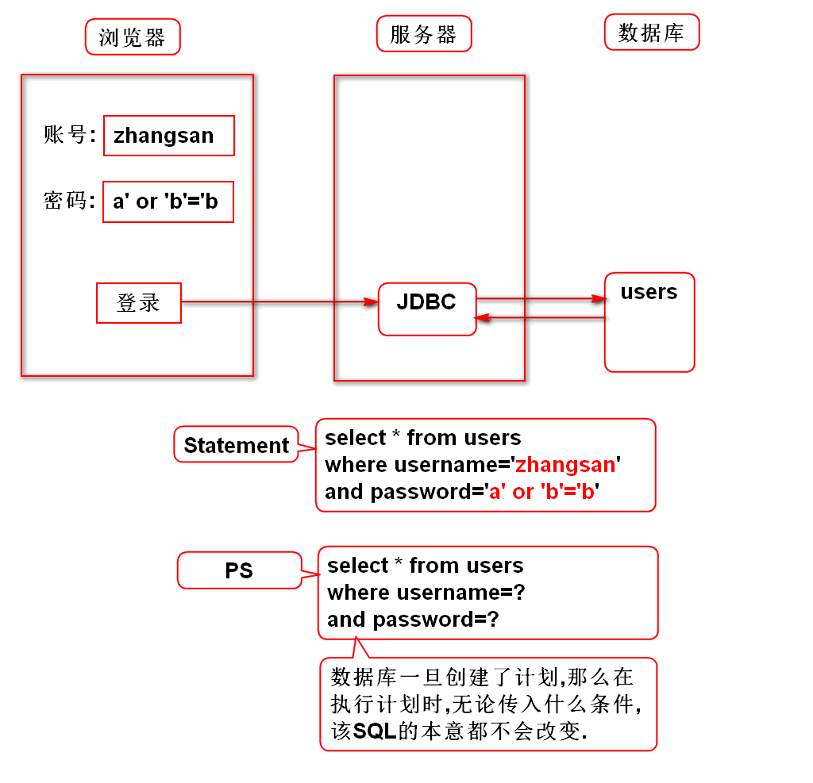
如果单纯地使用字符串与用户输入进行拼接，从而拼凑出sql语句，有可能会有恶意注入从而改变原sql语句的逻辑，带来风险。

正常情况下，用户名和密码用**and**连接，同时成立才能查询成功

	select * from users where username='tarena' and password='123';

恶意注入情况下，密码部分使用特殊结构的语句破解

	select * from users where username='arg1' and password='arg2';

若此时传入参数如下：

 - arg1 = abc
 - arg2 = a' or 'b'='b

则传入参数后完整的SQL语句变成

	select * from users where username='abc' and password='a' or 'b'='b';

注意此时的SQL语句中有恒等式条件 **'b'='b'**，则不论前面用户名和密码是否正确，都将会获得用户表中所有记录

```java
String user = "tarena";
String pwd = "a' or 'b'='b";
Connection conn = null;
String sql = "select * from users where username=? and password=?";
try {
	conn = DBUtil.getConnection();
	
	//测试PreparedStatement
	PreparedStatement ps = conn.prepareStatement(sql);
	ps.setString(1,user);
	ps.setString(2,pwd);
	ResultSet rs = ps.executeQuery();
	if(rs.next()){
		System.out.println("ps登录成功");
	}else{
		System.out.println("ps登录失败");
	}
		
	//测试Statement
	Statement smt = conn.createStatement();
	sql = "select * from users where username='"+user+"' and password='"+pwd+"'";
	rs = smt.executeQuery(sql);
	if(rs.next()){
		System.out.println("smt登录成功");
	}else{
		System.out.println("smt登录失败");
	}
} catch (SQLException e) {
	e.printStackTrace();
} finally{
	DBUtil.close(conn);
}
```

输出结果

	ps登录失败
	smt登录成功

## 3. ResultSet 结果集

使用Statement执行查询方法 **executeQuery()**，会得到一个ResultSet类型的结果集。针对这个结果集，有以下方法	
> boolean next()
> 返回值类型 get类型（字段）

### 3.1. 结果集原理

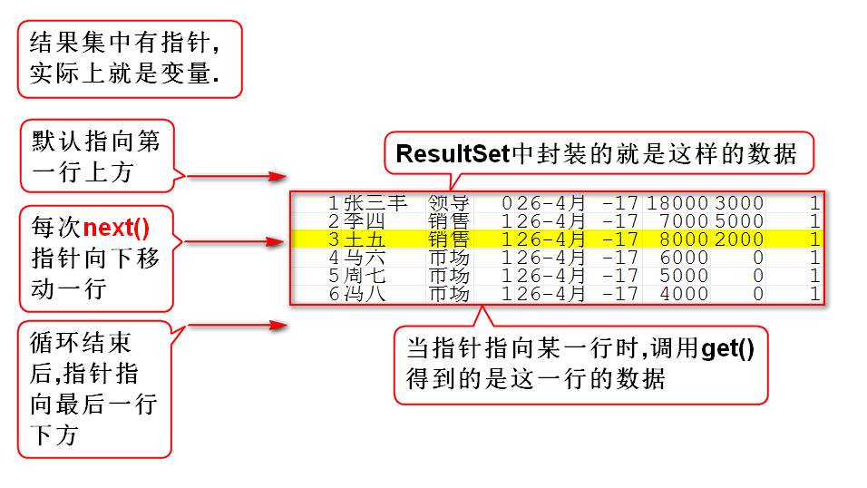

 - 结果集是采用**迭代器模式**实现的，其中有指针（地址变量），结果集指针与迭代器游标类似
 - 结果集的next()方法，相当于集成了迭代器hasNext()与next()的功能，
 - 结果集指针，默认指向第一行记录上方，每次调用next()，返回boolean类型，指示是否还有下一行数据，同时游标向下移动1个位置，使用get方法是获取指针刚才越过那行的数据。
 - 循环结束后，结果集指针（迭代器游标）指向最后一行的下方。

## 元数据
在SQL中，描述数据库或其组成部分的数据称为**元数据**，区别于数据库中的实际数据。
我们可以获取三类元数据

 - 关于数据库的元数据
 - 关于结果集的元数据
 - 关于预备语句参数的元数据

上的

 - Meta：根本、本质
 - MetaDate：数据的根本，即数据的概述信息
 - ResultSetMetaData：


## 4. 异常处理

# 四. 事务

## 1. JDBC对事务的支持

### 1.1. 什么是事务
满足如下四个特征的数据库访问，叫**事务**

-  原子性：事务是一个完整的过程，要么都成功，要么都失败
-  一致性：事务访问前后数据一致，即收支平衡
-  隔离性：事务过程中的数据要隔离，不允许别人访问
-  持久性：事务一旦达成，就永久有效

### 1.2.默认管理方式
- JDBC默认会自动管理事务，每次调用executeUpdate()就会自动commit
- 默认方式适合一个业务内只包含一次DML的情况
  而一个业务内需要进行多次DML语句操作，则需要手动进行管理

### 1.3. 手动管理方式
- 取消自动：
> conn.setAutoCommit( false )

- 手动提交：
> conn.commit()

- 手动回滚：
> conn.rollback() 


## 2. 批量Update
### 2.1. 批处理：
发送到数据库，作为一个单元执行的一组更新语句
批处理降低了应用程序与和数据库之间的网络调用
相比单个SQL语句，批处理更为有效

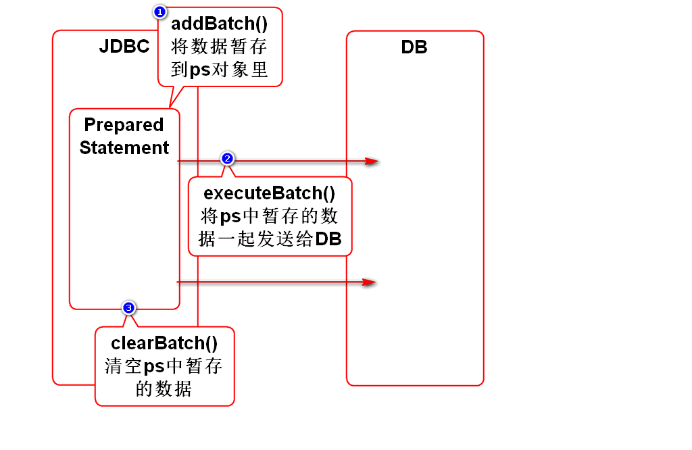

### 2.2. 批处理API
> addBatch(String sql)

Statement类的方法, 可以将多条sql语句添加Statement对象的SQL语句列表中

> addBatch()

PreparedStatement类的方法, 可以将多条预编译的sql语句添加到PreparedStatement对象的SQL语句列表中

> executeBatch()

把Statement对象或PreparedStatement对象语句列表中的所有SQL语句发送给数据库进行处理

> clearBatch()

清空当前SQL语句列表

## 3. 获取自动生成的id
### 3.1. 反查ID，记录ID，

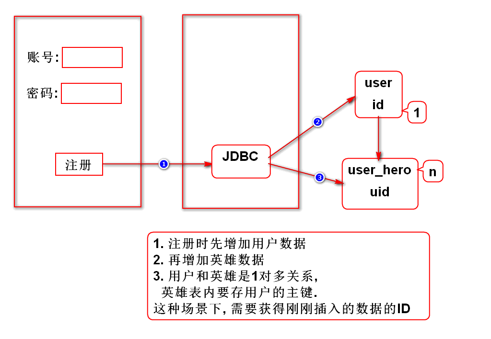

### 3.2.PS 
Connection获取PreparedStatement对象的时候，有第二个工厂方法，需要两个参数，

1. 第一个参数是预处理SQL语句，
2. 第二个参数是一个字符串数组，元素为执行此语句后返回指定字段的值。

> prepareStatement ( 预处理SQL，new String[]{ "需要返回的字段名" } )

## 4. JDBC对分页的支持

### 4.1. 假分页（内存分页）
其实是多层嵌套子查询，分页显示
第一次查询时获取所有数据，并将其存入内存（list）
第N次查询时，不再访问数据库，而是从内存中（list）取数
#### 特点：
第一次查询特别慢，但以后会快，占用大量内存空间
适合数据量小的小项目

### 4.2.  真分页（物理分页）
每次查询都只获取一页的数据
使用分页的SQL进行查询

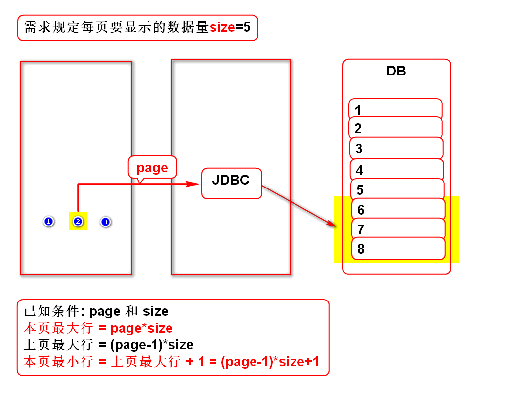

#### 特点：
每次查询速度都一样，不耗内存，适合任意的项目


# 五. DAO
## 1.对JDBC封装的思想
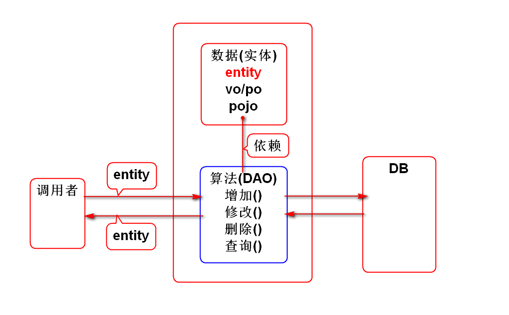

## 2.说明
- 接口,工厂将来再讲
- 当前的案例太简单,也没有完整的项目,不利于阐述这些内容


# 补充1:JDBC中的日期类型

- 在JDBC中要使用java.sql下的日期类型
- java.sql.Date 年月日
- java.sql.Time 时分秒
- java.sql.Timestamp 年月日时分秒

> 上述日期都是java.util.Date的子类

## JavaBean
- 满足如下规范的类：
- 必须有包
- 必须有无参构造器
- 必须实现序列化接口
- 通常会有 **get / set** 方法


