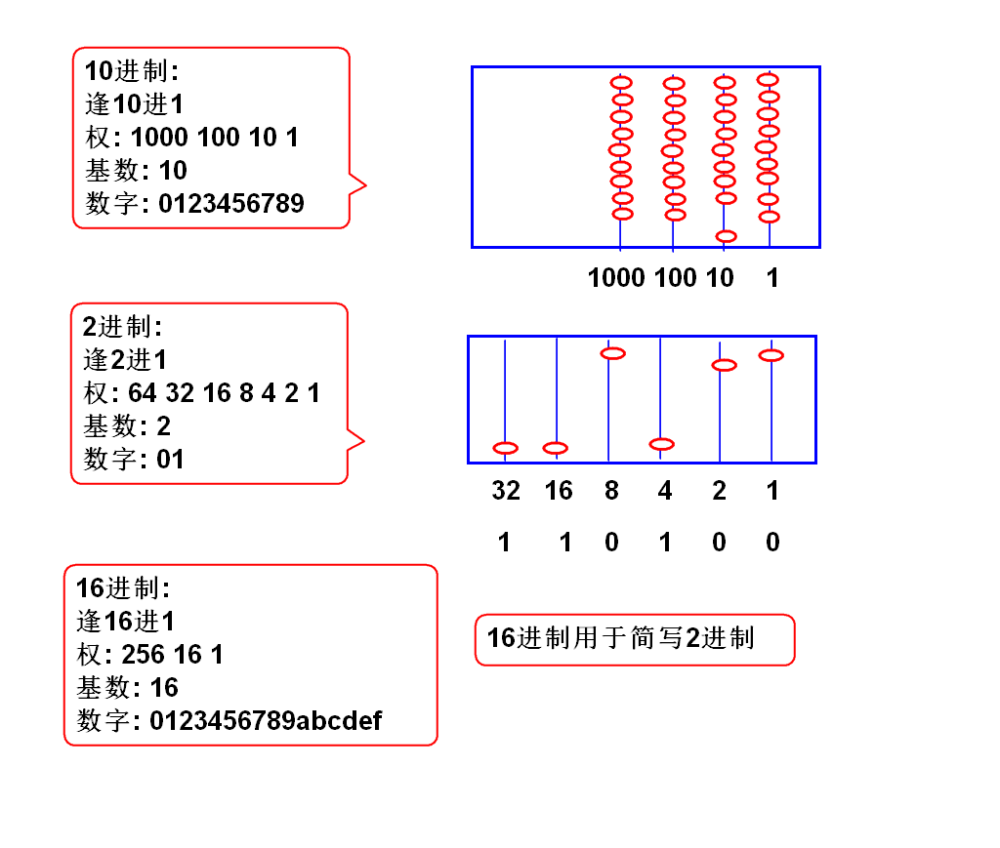
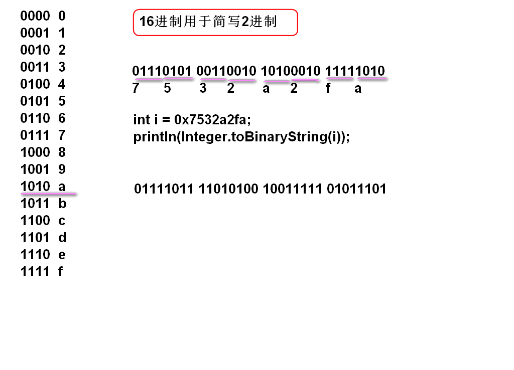
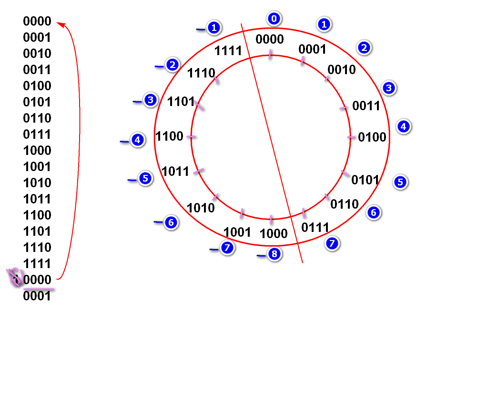
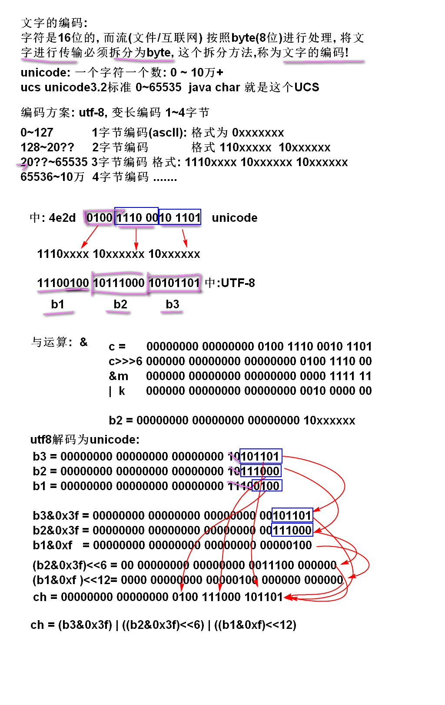

# 补充知识

## JavaBean
- 满足如下规范的类：
- 必须有包
- 必须有无参构造器
- 必须实现序列化接口
- 通常会有 **get / set** 方法


# 补充:maven
## 1.maven的使用方式
- 参考: http://doc.tedu.cn/maven/index.html

## 2.导包失败怎么办?
- 将pom.xml中的代码(<dependency>)删除
- 将下载失败的缓存文件删除(/.m2/repository下)
> 看Eclipse左侧的路径

# 二进制


## 2进制在哪里?

计算机内部 **只有** 2进制数据!

```java
// 变量i是2进制数据!!!
int i = 50;
// 输出i的实际上2进制数据
System.out.println(Integer.toBinaryString(i));
// 输出方法调用了 Integer.toString()将2进制转换为10进制, 然后再输出
System.out.println(i);// "50"
```

Java编程语言, 编程语言利用算法支持10进制, 使用用户感受上可以使用10进制! 


显示2进制数据

```java
int i = 50;// Integer.parseInt();
System.out.println(Integer.toBinaryString(i));
```

- Java 如何接收10进制数据:  Integer.parseInt();

  - 将10进制字符串转换为2进制int

- Java 如何输出10进制数据:  Integer.toString(); 

  - 将2进制int转换为10进制字符串

  Scanner in = new Scanner(System.in);
  int n = in.nextInt();// 底层调用了 Integer.parseInt();

## 什么是2进制

逢2进1的计数规则



## 16进制

```java
// 0111_1111 1111_1111 1111_1111 1111_1111
// 7    f    f    f    f    f    f    f
int max = 0x7fffffff;
System.out.println(max);
System.out.println(Integer.toBinaryString(max));
long m = 0x7fffffffffffffffL;
System.out.println(m);
System.out.println(Long.toBinaryString(m));

// 1000_0000 0000_0000 0000_0000 0000_0000
// 8    0    0    0    0    0    0    0
int min = 0x80000000;
System.out.println(min);
System.out.println(Integer.toBinaryString(min));

int n = Integer.MAX_VALUE;
int k = Integer.MIN_VALUE;
int x = k - n;
System.out.println(x);
```

16进制用于简写2进制

4位2进制可以简写为一位16进制数字



经典面试题:

	int i = 0x32; //0011 0010
	System.out.println(i);
	如上代码输出结果(  ) 
	答案: 50
	
	int i = 0xac;  
	System.out.println(i);
	如上代码输出结果(  ) 
	答案:  


## 补码

计算机处理 **有符号数(负数)** 问题的算法. 

补码算法: 4位数补码

规则:

1. 总的位数是4位数
2. 如果计算结果超过4位自动溢出舍弃



经典面试题目:

	int n = 0xffffffff;
	System.out.println(n);
	如上代码输出结果是:( )
	A.2147483647 B.-2147483648 C.-2147483647 D.-1
	答案: D


	判断对错: 正数相加溢出结果是负数?
	答案: 错!


	System.out.println(~8+1);	
	输出结果是(  )
	答案: -8
	
	System.out.println(~8);	
	输出结果是(  )
	答案: -9
	
	System.out.println(~-8);	
	输出结果是(  )
	答案: 7 

##　2进制运算符

`~`  取反(非)
`&`  与运算
`|`  或运算
`>>>` 逻辑右移动运算
`>>`  数学右移动运算
`<<`  左移动运算


`&`  与运算

	0 & 0 = 0
	0 & 1 = 0
	1 & 0 = 0
	1 & 1 = 1
	
	n = 01001001 01110111 10101010 01010101
	m = 00000000 00000000 00000000 00111111
	 &---------------------------------------
	k =	00000000 00000000 00000000 00010101
	
	int n = '中';
	int m = 0x3f;
	int k = n&m;
	println(Integer.toBinaryString(n));
	println(Integer.toBinaryString(m));
	println(Integer.toBinaryString(k));

`|`  或运算(逻辑+)
	

	0 | 0 = 0
	0 | 1 = 1
	1 | 0 = 1
	1 | 1 = 1
	
	n = 00000000 00000000 00000000 00101101
	m = 00000000 00000000 00000000 10000000
	 | ----------------------------------------
	k = 00000000 00000000 00000000 10101101
	
	int n = 0x2d;
	int m = 0x80;
	int k = n | m;
	println(Integer.toBinaryString(n));
	println(Integer.toBinaryString(m));
	println(Integer.toBinaryString(k));

 

`>>>` 逻辑右移动运算

	n =       00100010 01111010 10101010 10111011
	m = n>>>1 000100010 01111010 10101010 1011101 
	k = n>>>2 0000100010 01111010 10101010 101110
	
	int n = 0x227aaabb;
	int m = n>>>1;
	int k = n>>>2;
	int j = n>>>6;
	//按照2进制输出


	

```java
int c = '中';
int m = 0x3f;
int b3 = (c & m)|0x80;
System.out.println(Integer.toBinaryString(c));
System.out.println(Integer.toBinaryString(m));
System.out.println(Integer.toBinaryString(b3));
int b2 = ((c>>>6) & m)|0x80;
System.out.println(Integer.toBinaryString(b2));

int b1 = (c>>>12) | 0xe0;
System.out.println(Integer.toBinaryString(b1));

// JDK 提供了 utf-8 到char的解码
byte[] bytes={(byte)b1,(byte)b2,(byte)b3};
String s = new String(bytes, "utf-8");
System.out.println(s); // "中"

// 将utf-8 b1 b2 b3 解码为 unicode字符 
int ch =(b3&0x3f) | ((b2&0x3f)<<6) | ((b1&0xf)<<12);
System.out.println((char)ch);
```


## 移位运算的数学意义

移动小数点运算: 

	124238.  小数点向右移动
	1242380. 小数点向右移动 1次, 数值*10
	12423800. 小数点向右移动 2次, 数值*10*10
	
	假设小数点位置不变
	
	  124238. 数字向左移动
	 1242380. 数字向左移动 1次, 数值*10
	12423800. 数字向左移动 2次, 数值*10*10

2进制数字移动, 与10进制数字移动规律相同: 2进制数值向左移动一次, 数值*2

	n    = 00000000 00000000 00000000 00110010. = 50
	n<<1 = 0000000 00000000 00000000 001100100. = 100
	n<<2 = 000000 00000000 00000000 0011001000. = 200

案例:
	

	int n = 50;
	int m = n<<1;
	println(m); //100

`>>` 数学右移位计算:

1. 相当于将原数据进行除法, 结果向小方向取整数.
2. `>>` 数学移位: 正数高位补0, 负数高位补1, 有数学意义
3. `>>>` 逻辑移位: 高位补0, 负时候没有数学意义

案例:

	n    = 11111111 11111111 11111111 11110111  -9
	n>>1 = 111111111 11111111 11111111 1111011  -5
	n>>>1= 011111111 11111111 11111111 1111011  很大

案例:

	...

> 一般情况下单纯的将数字向右移动, 请使用 `>>>` 

面试题:

	优化 n*8 的计算为 (   )
	答案: n<<3
	
	优化 n*16 的计算为 (   )
	答案: n<<4

----------------

## 作业

1. 实现utf-8编码算法:

   public byte[] utf8(char ch){}

2. 实现utf-8编码算法:

   public byte[] utf8(String ch){}

> 必须使用String的解码算法建议编码是否正确


# 一. 二进制编码
## 1. 数值的二进制存储
## 2. 位运算
## 3. unicode 与 UTF-8
# 二. 反射

## 1. 什么是反射
反射是 Java 提供的动态执行机制, 可以动态加载类, 动态创建对象, 是动态访问属性, 动态调用方法

#### 1.1. 静态执行
Java 代码经过编译以后就确定的执行次序, 称为静态执行次序

```java
Foo foo = new Foo();
foo.test();
```

#### 1.2. 动态执行
- 在运行期间才确定创建哪个类的对象, 执行哪个方法, 称为动态执行. Java 反射 API 可以实现动态执行
- 如需要执行某个指定类中全部的以 test 为开头的方法, 必须使用反射实现

### 1.3. 反射的特点
1. 是 Java 提供的 API, 提供了一系列的功能
2. 是 Java 底层的执行机制

## 2. 反射的功能
### 2.1. 动态加载类
将类名对应的类, 加载到方法区, 如果类名错误, 则抛出异常
> Class.forName( 包名.类名 )

### 2.2. 动态创建对象
动态创建对象, 根据动态加载得来的类, 创建其的一个实例

可以创建任何对象, 但要求 cls 创建的类必须有无参构造器( JavaBean ), 如果没有无参构造器, 则会抛出异常.

> Class cls = Class.forName( 包名.类名 )
> Object obj = cls.newInstance();

反射 API 可以利用 Constructer API 支持有参数构造器, 此处略.\

### 2.3. 动态获取类中的方法信息
通过反射, 可以返回类中声明的所有方法的信息
返回值是一个数组, 数组中元素为 java.lang.reflect.Method 类的对象

> Method[] methods = cls.getDeclaredMethods();
> for( Method m : methods ){
> 　　System.out.println( m );
> }

给定方法名, 可以找到指定的方法
> Method m = cls.getDeclaredMethod( 方法名 );
输出:

	public java.lang.String demo.Aoo.getName()
	public void demo.Aoo.setName(java.lang.String)
	public int demo.Aoo.getAge()
	public void demo.Aoo.setAge(int)

### 2.4. 动态获取类中的属性信息
通过反射, 可以获取类中声明的所有属性的信息
返回值是一个数组, 数组中元素为 java.lang.reflect.Field类的对象

> Field[] field = cls.getDeclaredFields();
> for( Field f : field ){
> 　　System.out.println( f );
> }

输出: 

	private java.lang.String demo.Aoo.name
	private int demo.Aoo.age

### 2.5. 动态执行实例方法
1. 必须有对象
2. 找到对象所属类的方法信息

#### 案例:

```java
//在类信息中查找一个方法信息
Method m = cls.getDeclaredMethod("m", args);

//获取类中的一个对象
Object obj = cls.newInstance();

//动态调用方法, val是方法返回值, 还可能抛出各种异常
Object val = m.invoke(obj);
```

1. 实例, 无参方法
2. 实例, 有参方法
3. 静态, 无参方法
4. 静态, 有参方法
5. 实例, 重载的方法
6. 静态, 重载的方法

### 2.6. 利用反射临时修改访问权限
对于受访问权限限制的方法或属性, 如private 修饰的方法, 
可以通过反射访问, 但实际上这样的操作破坏了封装性.
> method.setAccessible(true);

## 3. 反射的用途
1. Eclipse 中的快捷菜单, 以及 Outline 结构解析, 利用反射机制获取类中的属性和方法
2. Spring 利用了反射

	1. 动态加载类
	2. 动态创建Bean
	3. 动态注入属性, 包括私有属性注入
	4. 动态解析注解
3. MyBatis 利用了反射. 将查询结果注入到 Bean 再返回

	1. 动态创建对象
	2. 动态调用 setter 方法注入属性
	3. 动态加入到 list
4. JUnit 使用了反射
5. 注解的解析使用了反射
6. Servlet调用使用了反射


# 三. AOP 面向切面编程
## 1. 概述
### 1.1. 什么是 AOP
Aspect Oriented Programming, 面向切面编程
切面(儿): 事务的横截面

特点: 在不改变软件原有功能情况下, 为软件插入(扩展)横切面功能
spring利用反射机制, 在动态调用业务方法时执行切面组件.

### 1.2. 通知
目标方法: 被 AOP 拦截的业务方法, 称为目标方法
切面方法的执行时机: 在目标方法执行的之前或之后执行, 
## 2. Aspect 的注解
### 2.1. Aspect 注解
在类的前面添加 @Aspect 注解, 声明该类用作切面组件.
若该切面组件要由 Spring 框架统一处理, 还要加上 @Component

> @Component
> **@Aspect**
> public class DemoAspect{...}

### 2.2. Before 注解
在方法前添加 Before 注解, 指定要处理的 BeanID, 
该方法将在 指定的 Bean 的全部方法之前运行
> **@Before**("bean(要处理的BeanID)")
> public void test(){...}


### 2.3. After 注解
在方法前添加 After 注解, 指定要处理的 BeanID, 
该方法将在 指定的 Bean 的全部方法之后运行
> **@After**("bean(要处理的BeanID)")
> public void test2(){...}

### 2.4. AfterReturning 注解
调用的业务方法正常执行后, 执行该方法

### 2.5. AfterThrowing 注解
调用的业务方法抛出异常后, 执行该方法

### 2.6. Around 注解
环绕通知, 可以在业务方法前面进行预处理, 也可以在业务方法后面进行后处理, 甚至可以篡改业务方法的正常返回结果

1. 必须有返回值 Object
2. 必须有参数 ProceedingJoinPoint, 实际上是通过反射获得的业务方法
3. 必须抛出异常
4. 需要在方法中调用 jp.proceed(), 即执行业务方法
5. 返回与业务方法同类型的返回值

		@Around("bean(userService)")
		public Object test5(ProceedingJoinPoint jp) throws Throwable{
			System.out.println("Hello @Around");
			//业务方法前处理
			Object val = jp.proceed();
			//业务方法后处理
			System.out.println(val);
			//还能干预业务方法的返回结果
			//return new User();
			
			//异常也是方法的返回值, 可以只抛异常, 不写return 
			throw new UserNotFoundException("就是不让登录");
		}

#### 2) JoinPoint 
JoinPoint 对象可以获取目标业务方法的详细信息, 方法签名, 调用参数等
> jp.getSin

## 3. 编程步骤
1. 导入依赖的包 aspectj :　aspectjweaver

	 	<dependency>
			<groupId>aspectj</groupId>
			<artifactId>aspectjweaver</artifactId>
			<version>1.5.3</version>
		</dependency>

2. 编写切面组件

		@Component
		@Aspect
		public class DemoAspect {
			//声明 test 方法将在 userService 的全部方法之前运行
			@Before("bean(userService)")
			public void test(){
				System.out.println("Hello World");
			}
		}

3. 配置到spring
	
		<!-- 配置切面组件扫描 -->
		<context:component-scan base-package="cn.tedu.note.aop" />
		<!-- 使 aspect 的 before 注解生效 -->
		<aop:aspectj-autoproxy />

4. spring利用反射机制, 在动态调用业务方法时执行切面组件的方法.


## 4. 切入点表达式
AOP 注解后面使用切入点表达式, 通过 BeanID 指定要切入的 Bean 组件类
### 4.1. Bean组件切入点
通过 BeanID 指定要切入的 Bean 组件类
#### 1) 单点切入
> bean( BeanID )

	@Before("bean(userService)")
	@Before("bean(noteService)")

#### 2) 多点切入
可以使用双竖线表示多个切入点
> bean( BeanID_1 ) || bean( BeanID_2 )

	@Before(" bean(userService) || bean(noteService) ")

#### 3) 通用切入
可以使用通配符 ＊, 切入满足匹配规则的 Bean 组件类
> bean(*匹配字符串)

	@Before(" bean(*Service) ")

### 4.2. 类切入点
通过完整类名, 指定 AOP 的切入点
#### 1) 单类切入
> within(类名)
#### 2) 多类切入
> within(类名1)||within(类名2)
#### 3) 通用切入
一个星号只能匹配一级包名
> within(包名.*.*类名)

### 4.3. 方法切入点
参数类型可以用两个点".."表示
一致统一的类和方法的命名规则, 将有助于编写有效的切入点表达式
> execution(修饰词 类名.方法名(参数类型))


- execution(* cn.tedu.note.service.UserService.login(..)) 
- execution(* cn.tedu.note.*.*Service.get*(..)) 

# 四. 代理
## 1. 概述
代理模式: 在不改变原有功能的前提下, 为其扩展功能
静态代理: 
动态代理: 

客户端 -> 对外接口 -> 代理 -> 目标功能

代理, 具有对外接口中的所有方法, 但没有具体实现, 具体实现仍由目标功能提供

将动态代理具体实现过程封装, 就是 AOP, 提供对外接口功能和更加简便的使用方式

经典面试问题:
AOP 的底层技术是什么? - 使用了动态代理技术, 是反射的一部分.

关键点:

1. Spring AOP 利用了 AspectJ AOP 实现的.
2. AspectJ AOP 的底层用了动态代理
3. 动态代理有两种

	1. 当方法中有时, 使用 JDK 动态代理
	2. 当方法中什么时, 使用CGLib

Spring AOP -> AspectJ AOP -> 动态代理 -> JDK 动态代理/ CGLib

### 2. AOP 拦截器 过滤器
1. 过滤器: 拦截处理 WEB 请求
2. Spring MVC 拦截器: 拦截处理 Spring MVC 的请求流程
3. AOP: 拦截业务层

# 五. 声明式事务处理

## 1. 编程式事务与声明式事务
### 1.1. 编程式事务
通过编写程序执行语句, 控制事务的提交与回退, 保护事务边界内的数据库操作.
缺点: 
### 1.2. 声明式事务

通过 AOP, 使用注解(通知)的声明, 控制事务的提交与回退
@Before 开启事务边界
@Transactional 声明业务方法
@AfterReturning 关闭事务边界,提交事务
@AfterThrowing 回退事务, 只处理 RuntimeException, 其他异常仍会继续提交
@After 释放资源

除了具体的业务方法, 其他事务控制操作都已经封装好, 我们只需要在数据库操作方法前加上 @Transaction, 再添加配置事务管理器 Bean 组件.

# 六. 事务隔离属性
一共有四种 
一般采用默认的 @Transactional(isolation=Isolation.READ_COMMITTED)级别, 是并发性能和安全性能这种的选择, 是

建议所有业务方法都使用 @Transactional, 如果是只读方法, 建议增加 readOnly=true

面试题目: Spring 声明式事务是如何实现的?
	- 声明式事务利用 **AOP 技术**实现, 而 AOP 技术采用了**动态代理**, 动态代理的底层利用**反射机制**实现

## 文件上传与下载

### 1. HTTP 协议中的文件下载


## 单例模式

模式: 解决问题的固定套路

单例: 在软件中永远唯一的对象个体.

单例模式: 解决 在软件中永远唯一的对象个体 固定套路

> 注意: Spring 中的Bean默认情况下是 "单例"的, 但是不能称为单例模式!!

### 饿汉式:

	//"饿汉式" 立即加载模式
	class Girl{
		private static Girl instance = new Girl();
		private Girl(){
		}
		public static Girl getInstance() {
			return instance;
		} 
	}

### 懒汉式 

	//"懒汉式" 按需加载
	class Boy{
		private static Boy instance;
		private Boy(){
		}
		public synchronized static Boy getInstance() {
			if(instance == null){
				instance = new Boy();
			}
			return instance;
		}
	}
# XML 

## 1. 概述

### 1.1. XML 概述

可扩展标记语言
能够表示层次结构, 且重复的元素不会被曲解
与 HTML 类似, 都源于古老的"标准通用标记语言 SGML"

特点:

- 大小写敏感
- 必须有结束标记, 结束标签或结束标记
- 属性值必须用双引号括起来
- 所有属性都必须有属性值

### 1.2. XML 的结构

- 文档头: 声明文件版本以及采用的编码方式
- 文档类型定义: DTD, 用来规定文档结构, 确保文档正确的一种机制0
- 根元素: 有且只有一个根元素, 包含其他的元素

  - 元素: 用 XML 标签确定的最小单元, 有单标签元素和双标签元素
  - 属性: 写在元素标签内, 用来描述元素的属性
  - 内容: 写在双标签元素的两个标签之间的东西, 可以是纯文本, 也可以是子元素, 通常是元素要描述的客体, 或是元素的组成部分\

- 混合式内容
  如果一个元素, 既有子元素, 又有文本内容, 则会为解析带来麻烦, 容易造成错误.
  在设计 XML 文档结构时, 最好时元素要么只包含子元素, 要么只包含文本, 应尽量避免混合式内容的元素.

#### 属性 or 子元素

用来描述一个元素时, 既可以使用元素的属性, 也可以使用元素的子元素, 但属性的灵活性不如子元素
通常, 属性应该只用来修改值的解释, 而不应用来指定值

元素和文本是 XML 文档"主要的支撑要素", 除此之外还有以下标记

- 字符引用
- 实体引用
- CDATA部分
  是字符数据的一种特殊形式, 其中的字符数据按照文本字符串来解读, 而不会被视为是标记, 可以用来囊括还有 < > & 的内容
  但其内容部分不能包括 CDATA 的结束标记, 即 `]]>`

> < ![CDATA[**具体内容**]]>


- 处理指令
  为了在处理 XML 文件的应用程序中使用的指令, 用来限定指令的界限, 如文档头指令

> < ? 指令内容 ?>

- 注释

给文档读者提供的信息, 其中不应包含有隐藏的命令, 命令应该是用处理指令实现的.0

## 2. 解析 XML

## 3. 验证 XML

### 3.1. 文档类型定义 

### 3.2. XML Schema

### 3.3. 使用示例

## 4. 使用XPATH 来定位信息

## 5. 使用命名空间

## 6. 流机制解析器

### 6.1. 使用 SAX 解析器

### 6.2. 使用 StAX 解析器 

## 7. 生成 XML 文档

### 7.1. 不带命名空间的文档

### 7.2. 带命名空间的文档

### 7.3. 写出文档

### 7.4. 示例: 生成 SVG 文件

### 7.5. 使用 StAX 写 XML 文档

## 8. XSL 转换