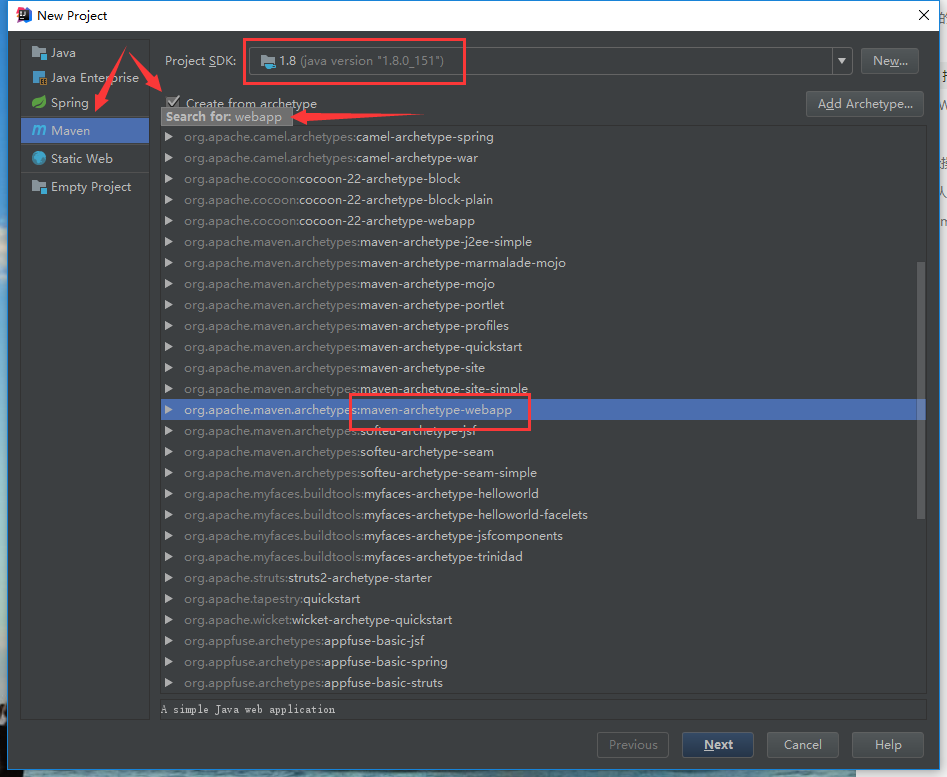
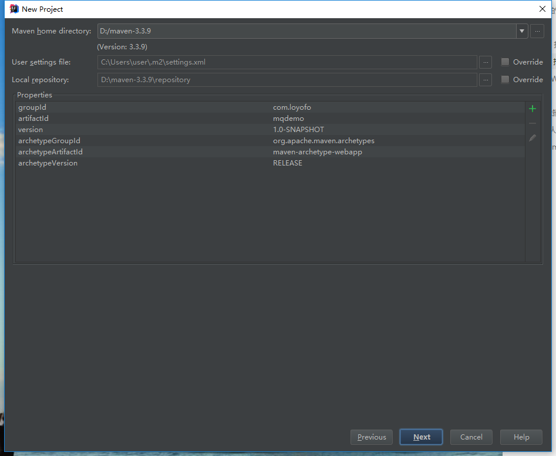
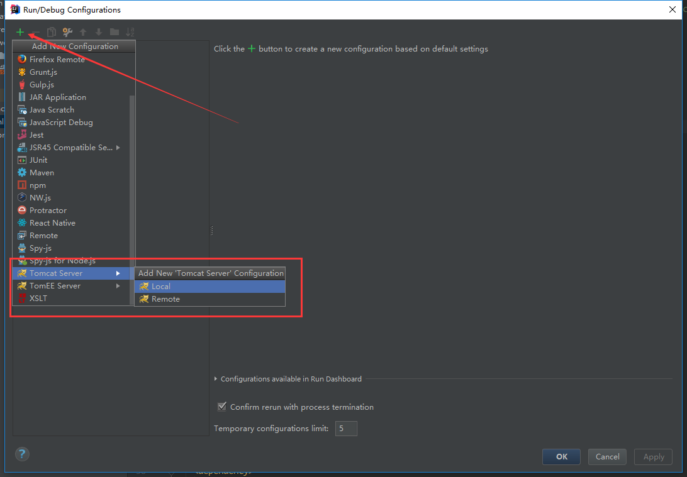
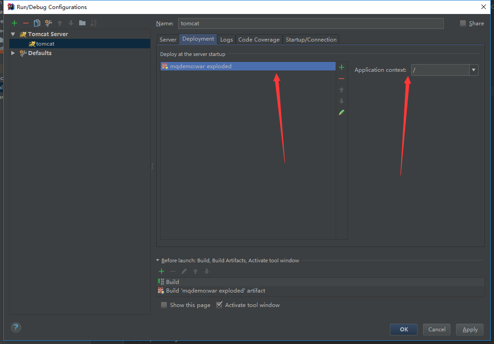
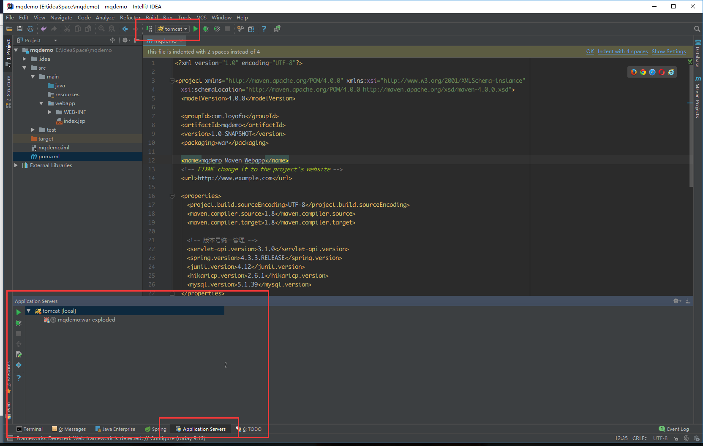
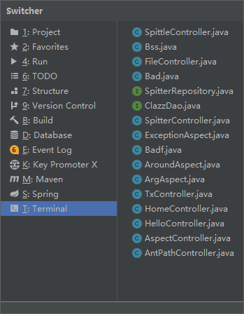

# **█** Idea 搭建 Web 项目

# 一. 创建项目



1. 选择 **create new project**, 创建新项目
2. 选择 **Maven** 项目
3. 勾选 **Create from archetype**, 输入 **webapp**  进行筛选
4. 第一个筛选结果不是我们想要的, 点击一下方向键下, 找到 **maven-archetype-webapp**
5. 选择需要使用的 jdk, 这里默认选 1.8
6. 点击 **next** 进行下一步


填写项目信息, next 下一步



选择 maven 版本和设置, 确认本地仓库路径正确, 点击 next 下一步


设置项目存放路径等信息, Finish 完成项目创建向导

然后idea 会执行一下项目初始化的工作, 创建相关文件, 导入 maven 依赖等


项目创建完成后会自动打开项目的 pom 文件, 其中编译版本默认是 1.7, 这里需要手动修改为 1.8

## 2. 完善项目目录结构

webapp 骨架中, 项目目录结构并不完整, 需要手动补充完整


1. 打开项目结构设置 Project Structure


1. 打开 Mudules. 可以对项目中的每个模块进行设置
2. 点击需要修改的模块, 打开 Sources 选项卡
3. 添加如图所示的文件夹, 完善目录结构
4. 为各个目录设置所属类型


修改输入路径

## 3. 配置 tomcat


点击运行环境按钮, 选择编辑配置文件


也可在菜单栏【run】-【Edit Configurations】打开



1. 点击添加按钮
2. 找到 tomcat server
3. 选择 local


1. 给这个tomcat 运行环境添加一个名字, 
2. 选择合适的 tomcat 版本
3. 如过选项中没有自己想要的tomcat, 点击右边的 Configure 进行配置:


点击添加按钮, 指定 tomcat 路径, 点击 ok 完成


1. 选择好 tomcat 环境后, 点击 Deployment 发布选项卡
2. 点击右侧的添加按钮, 选择 Artifact...


1. 一般开发时选择  war exploded, 点击 ok
2. 测试完成需要发布 war 包时, 再添加 war



添加完成后如图所示, 左侧是需要发布到该tomcat 的项目

右侧是项目路径, 默认为/, 即 tomcat 首页就是项目主页, 若有需要也可以添加项目路径 

确认无误后点击 ok



tomcat 添加完毕后, 主界面后出现图示内容, 表示项目已部署到 tomcat, 

# 二. 添加 Jar 包依赖

现在一般采用 SSM 作为项目的主要框架, 需要导入相关的 jar 包依赖

## 1. 依赖版本统一设置

各个 jar 包都需要添加包版本, 为了方便管理, 应在 pom 文件的 properties 节点下对所有 jar 包版本号进行统一管理, 

```xml
<properties>
    <project.build.sourceEncoding>UTF-8</project.build.sourceEncoding>
    <maven.compiler.source>1.8</maven.compiler.source>
    <maven.compiler.target>1.8</maven.compiler.target>

    <!-- 版本号统一管理 -->
    <servlet-api.version>3.1.0</servlet-api.version>
    <spring.version>4.3.3.RELEASE</spring.version>
    <junit.version>4.12</junit.version>
</properties>
```

在 properties 中进行统一管理后, 后面添加 jar 包时应将版本号使用表达式对版本号进行引用

> `<version>${jar.version}</version>`

如项目创建时自动添加的 junit 依赖, 应改为以下形式

```xml
<dependencies>
    <dependency>
        <groupId>junit</groupId>
        <artifactId>junit</artifactId>
        <!-- 此处用 $表达式 引用设置的版本号 -->
        <version>${junit.version}</version>
        <scope>test</scope>
    </dependency>
</dependencies>
```


## 1. Spring MVC 相关依赖

```xml
<!-- spring MVC -->
<dependency>
    <groupId>org.springframework</groupId>
    <artifactId>spring-core</artifactId>
    <version>${spring.version}</version>
</dependency>
```


## 2. 数据库连接依赖

### 1) spring jdbc

```xml
    <!-- Spring JDBC -->
    <dependency>
      <groupId>org.springframework</groupId>
      <artifactId>spring-jdbc</artifactId>
      <version>${spring.version}</version>
    </dependency>
```


### 2) 连接池

```xml
<!-- 连接池 -->
<dependency>
    <groupId>com.zaxxer</groupId>
    <artifactId>HikariCP</artifactId>
    <version>${hikaricp.version}</version>
</dependency>
```


### 3) 数据库驱动

```xml
<!-- 数据库连接驱动 -->
<dependency>
    <groupId>mysql</groupId>
    <artifactId>mysql-connector-java</artifactId>
    <version>${mysql.version}</version>
</dependency>
```

## 2. Junit 单元测试依赖

## 3. JSON 支持

```xml
<dependency>
    <groupId>com.google.code.gson</groupId>
    <artifactId>gson</artifactId>
    <version>${gson.version}</version>
</dependency>
```

# 三. 添加配置文件

## 1. web.xml -- 项目主配置文件

主配置文件路径:  **/src/main/webapp/WEB-INF/web.xml**

添加 DispatcherServlet 的相关配置, 注意添加启动参数, 指定spring 配置文件的路径

```xml
<servlet>
    <description></description>
    <display-name>DispatcherServlet</display-name>
    <servlet-name>DispatcherServlet</servlet-name>
    <servlet-class>org.springframework.web.servlet.DispatcherServlet</servlet-class>
    <init-param>
        <description></description>
        <param-name>contextConfigLocation</param-name>
        <param-value>classpath:/spring-*.xml</param-value>
    </init-param>
    <load-on-startup>1</load-on-startup>
</servlet>
<servlet-mapping>
    <servlet-name>DispatcherServlet</servlet-name>
    <url-pattern>/</url-pattern>
</servlet-mapping>
```


## 2. spring-*.xml -- spring 相关配置

### 1) MVC结构配置: spring-mvc.xml

```xml
<?xml version="1.0" encoding="UTF-8"?>
<beans xmlns="http://www.springframework.org/schema/beans"
		xmlns:xsi="http://www.w3.org/2001/XMLSchema-instance"
		xmlns:context="http://www.springframework.org/schema/context"
		xmlns:mvc="http://www.springframework.org/schema/mvc"
		xsi:schemaLocation="
		http://www.springframework.org/schema/beans http://www.springframework.org/schema/beans/spring-beans-4.1.xsd
		http://www.springframework.org/schema/context http://www.springframework.org/schema/context/spring-context-4.1.xsd
		http://www.springframework.org/schema/mvc http://www.springframework.org/schema/mvc/spring-mvc-4.1.xsd">

<description>MQ Demo springmvc</description>
	<!-- 配置组件扫描 -->
	<context:component-scan base-package="com.loyofo.mqdemo"/>
	<!-- 配置 MVC 注解扫描 -->
	<mvc:annotation-driven />
</beans>
```

### 2) 数据库连接参数 jdbc.properties

```properties
driver=com.mysql.jdbc.Driver
url=jdbc:mysql://47.106.82.153:3306/activemq
user=activemq_user
password=activemqdemo
maxActive=20
```

### 3) Spring 数据库连接配置 spring-content.xml

```xml
<?xml version="1.0" encoding="UTF-8"?>
<beans xmlns="http://www.springframework.org/schema/beans"
	xmlns:xsi="http://www.w3.org/2001/XMLSchema-instance"
	xmlns:util="http://www.springframework.org/schema/util"
	xsi:schemaLocation="
		http://www.springframework.org/schema/beans         http://www.springframework.org/schema/beans/spring-beans.xsd
        http://www.springframework.org/schema/util 		 http://www.springframework.org/schema/util/spring-util.xsd">

	<description>Spring Configuration</description>

	<!-- 读取配置文件 -->
	<util:properties id="jdbc" location="classpath:jdbc.properties"/>

	<bean id="dataSource" class="com.zaxxer.hikari.HikariDataSource"
		destroy-method="close">
		<property name="driverClassName" value="#{jdbc.driver}" />
		<property name="jdbcUrl" value="#{jdbc.url}" />
		<property name="username" value="#{jdbc.user}" />
		<property name="password" value="#{jdbc.password}" />
		<property name="maximumPoolSize" value="#{jdbc.maximumPoolSize}" />
		<property name="minimumIdle" value="#{jdbc.minimumIdle}" />
		<property name="dataSourceProperties">
			<props>
				<prop key="cachePrepStmts">true</prop>
				<prop key="prepStmtCacheSize">250</prop>
				<prop key="prepStmtCacheSqlLimit">2048</prop>
				<prop key="useServerPrepStmts">true</prop>
			</props>
		</property>
	</bean>

	<bean id="jdbcTemplate" class="org.springframework.jdbc.core.JdbcTemplate">
		<property name="dataSource" ref="dataSource"/>
		<property name="fetchSize" value="#{jdbc.fetchSize}"/>
	</bean>
</beans>
```


# █ idea 功能特性

# 一. 视图与界面

## 新窗口中打开文件

在 project 工具窗中, 选中文件, `shift+enter`

## 自定义快捷键

自定义快捷键, 通过快捷键执行操作

自定义命令缩写别名, 可以通过别名, 在 `Search Everything` 中快速查找

## 自定义浮窗菜单

`quick list`

允许自定义快捷菜单, 设置热键后可以快速调出

## 收藏夹

在包含大量文件的项目中, 找到某个特定文件会很麻烦, idea 提供了收藏夹, 以便快速定位到目标文件. 

默认会有一个与项目同名的收藏列表, 可以添加自己的列表. 书签和断点也会自动加入到收藏夹中. 


## 切换器

默认快捷键 `CTRL+TAB`, 与其他软件不一致, 去掉

与 `CTRL+E` 的最近访问类似, 但只显示当前打开的文件, 并会自动隐藏




## 快速切换菜单

快速切换 快捷键/主题/代码风格 等, 默认 ``CTRL+` `` , 自定义修改为 `CTRL+SHIFT+S`


## 文件对比

打开一个文件A, 然后 view-compare with 选中文件B, 即可高亮对比两个文件的区别

或者在项目结构树中选中文件, `CTRL+D`, 选择要对比的文件

或者在项目结构树中选中两个文件, `CTRL+D`, 直接打开对比框

# 一. 编辑器功能

## 文件编码

默认使用系统编码, windows 为 GBK

- 为没有内置编码声明的文件/目录设置编码

  在设置中指定新建文件时采用的编码, 默认情况下, 控制台输出也采用该处指定的编码. 

- 为内置编码声明的文件设置编码

  在文件内的编码声明处, `ALT+/`打开默认补全浮窗, 选择需要的编码.

- 为控制台输出信息设置编码. 

  默认采用设置中指定的文件编码, 也可以在自定义 vm 参数中指定编码.

- 为已有文件修改编码

  为文件修改编码时,可以选择以不同的编码重新加载文件, 或是以不同的编码重新保存文件.

  若选择的编码需要修改文件, 则该编码前面会有黄色或红色的警告图标.

## 草稿

创建各种临时的草稿文件, 可以测试各种代码, 草稿是跨项目的, 你可以从不同的项目访问.

- **代码草稿** `Scratch File`

  提供完整的代码功能, 语法高亮, 可以运行/调试等, 通过菜单或`CTRL+ALT+SHIFT+INSERT` 创建

- **文本草稿**  `Scratch Buffer`

  纯文本文件, 可以用来作为备注, 或者任务列表等临时记录信息. 通过 `CTRL+ALT+A` 查找命令的方式创建.

  以`buffer1~5.txt` 命名, 默认只保留最近的5个. 如果希望保留某个文件, 可以为其重命名

## 快捷信息

- **查看声明** `CTRL+SHIFT+I`

  在变量/类名上使用, 显示其声明语句

- **查看目标类型** `CTRL+SHIFT+P`

  在变量上使用, 显示其声明的类型, 在表达式上使用, 显示其返回值的类型

  双击时显示其静态分析结果, 可以在不运行代码的情况下产看是否为null, 实际对象类型, 值, 大小等

- **查看参数列表** `CTRL+P`

- **查看javadoc** `CTRL+Q`


## 多光标编辑

- 按着 `ALT`, 按着鼠标左键上下拖动, 在多行插入光标, 以便同时编辑多行

  按着 `ALT`, 按着鼠标左键沿对角线拖动, 在多行插入光标, 并选中多列内容
- 按着 `ALT+SHIFT`, 鼠标点击多个地方, 在多处放置光标
- 按着 `ALT+SHIFT`, 鼠标点击多个地方并拖动/双击, 在多处放置光标, 且选中多处内容
- 多次按 `ALT+J`, 按顺序将选中多个相同语素, 在多处放置光标
- 按下 `CTRL+ALT+SHIFT+J`, 选中文件中所有相同语素, 在多处放置光标
- `双击CTRL`, 第二次按着不放, 按方向键上/下, 在多行放置光标, 左右移动则选中内容
- 按下`ALT+SHIFT+INSERT` 开启列选模式, 按着鼠标拖动选择矩形区域, 放置多个光标

## 查找/替换

### 文件内查找/替换

`CTRL+F` `CTRL+R`

### 全局查找/替换

`CTRL+SHIFT+F` `CTRL+SHIFT+R`

### 多行查找

- 搜索框内点击换行箭头, 或 `ctrl+shift+enter`, 可以换行, 在多行结构中进行搜索
- 使用结构搜索
- 搜索框旁边的漏斗, 可以选择搜索范围

### 结构化搜索

## 代码补全

### 1. 基础补全

根据输入, 提示所有匹配的内容, 默认自动提示, 也可以通过`ALT+/` 调出, 

第一次按键, 只提示当前类可见, 且名称与输入匹配的内容, 不考虑类型.


第二次按键, 会查找间接匹配的内容, 如某些类名与输入不匹配, 但类中的常量与输入匹配的内容

第三次按键, 会在当前项目内查找暂不可见的内容(可以后续修改为public变为可见)


### 2. 智能补全

根据输入, 提示类型满足当前语法的内容, 可以在以下能推断所需类型的地方使用

- 赋值语句的右侧
- 变量初始化
- return 语句
- 方法参数列
- new 语句
- 链式调用表达式


多次按键, 会查找间接符合的记录


### 3. 语句补全

补全当前语句中需要的括号/引号/分号等

### 4. 嬉皮士补全(上下文补全)

根据输入, 在当前文件中遍历查找已有的语素


### 5. 后缀式自动完成

对于`sth`, 可以通过`sth.自定义后缀` 触发自动完成.

具体可用配置详见 `Settings | Editor | General | Postfix Completion`

```java
// 用户输入
List<String> list = new ArrayList<>();
list.for

// 自动完成, 将.for扩展成for循环结构
List<String> list = new ArrayList<>();
for (String s : list) {}
```

### 6. 其他特性

- 自动显示 基础补全的建议

- 显示建议列表时, 自动显示对应条目的 java doc

- 建议列表可按字母顺序排列, 默认按使用关联性/使用频率排列

- 是否限制大小写匹配

- 方法参数列提示, 有重载方法时, 显示全部可能的参数列, 可以通过 `CTRL+P` 调出该参数列提示气泡

  

  - 完整的方法签名, 依赖上面的"方法参数列提示"选项

    

- 自动完成时显示参数名提示, 

  显示参数名称, 按 tab 跳到下一个参数处. 若开启了"方法参数列提示", 会显示该参数类型

  若有重载方法时, 此时显示参数列为应用提示时选择的方法

  

- 使用其他符号应用提示. 如空格, 圆点, 括号等. 该选项可能会在不需要的时候应用自动完成, 默认关闭. 开启时提示框会自动获取焦点, 以便应用其他特性

- 反转布尔值. 当提示中有boolean 类型的结果时, 如果按下`!`, 会应用该提示的反转结果, 即在前面加`!`. 

  ```java
  // 原始输入, 提示 isOk() 方法
  boolean a = isO
  
  // 输入!反转结果
  boolean a = !isOk();
  ```

  但因为输入时自动显示的提示框不会自动获取焦点(或者开启上面的用其他符号应用提示, 会自动获取焦点), 此时按下的 `!` 不能应用反转结果, 需要先按一下方向键使得焦点落到提示列表中才能生效. 又因为`!` 需要按shift 才能输入, 此功能并不实用.

  - 未获取焦点, 输入 `!` 不能反转结果

    

  - 获取了焦点, 输入 `!` 反转结果

    

## 自动生成

`ALT+INSERT` 调出生成菜单, 选择需要生成的内容. 生成的代码将会插入到光标当前位置, 可以在生成代码后再试用代码重排功能整理. 


### 1. 基础方法

可以生成以下常用的基本方法

- 构造器
- getter / setter
- equals / hashCode
- toString

### 2. 重写/实现方法

`ALT+INSERT` 中选择 `implement methodes`, 或直接 `CTRL+I`, 弹框提示需要实现的方法. 


`ALT+INSERT` 中选择 `override methodes`, 或直接 `CTRL+O`, 弹框提示需要重写的方法. 


默认会添加 `@Override` 注解, 还能根据需要选择是否将父类的文档复制到当前类中. 

如下图所示, 重写/实现的接口/类/方法前会有相应的图标显示, 鼠标悬停可以看到相关的信息, 点击则可以跳转到目标位置


### 3. 委托方法

可以快速创建委托方法, 将方法调用委托给当前类的某个域, 或是某个方法返回的对象

- 先选择受托对象, 实例域/静态域/getXXX的方法

  

- 需要的受托方法, 根据上一步选择, 列出受对象的所有实例方法/静态方法, 选择需要的方法以创建委托方法

  

- 创建委托方法, 方法签名与受托方法一样, 而方法体中则是调用受托对象完成该方法

  

### 4. 测试方法

### 5. 调用对象所有 setter

`GenerateAllSetter` 插件提供, 在变量上 `alt+enter`, 菜单中选择添加所有 setter

### 6. 自定义方法模板

idea 允许用户自定义方法模板, 使用 `Velocity` 模板语言进行定义, 并提供了一些预设的变量. 

在实现方法时, idea 默认方法体仅提供返回类型的初始值, 而重写方法则简单调用超类的方法. 在很多时候这是不够的, 为了提醒我们不要忘记编写方法体, 我们希望能在自动生成的重写/实现方法中添加 `TODO` 标记. 

可以在 `File and Code Templates` 中进行编辑`Implement method body`/`Overridden method body`


另一种办法是利用`live Template` 实现创建方法模板. 如用`test` 关键字创建 Junit 的测试方法模板


### 7. json转实体类

`GsonFormat` 插件提供, 可以根据已有的 json 数据, 自动生成合适的实体类. 

默认快捷键`ALT+S`, 也可以在`ALT+INSERT` 浮窗中选择. 

## live template

### 1. 自定义模板

idea 提供了大量的预设模板, 也允许用户添加自定义模板. 


- 模板缩写与描述

  当模板定义的缩写与用户当前输入一致时, 该模板会出现在自动完成的提示列表中, 后面展示模板描述

  

- 模板内容

  定义模板的完整内容, 按需要设置变量占位符

- 模板变量

  使用 `$xxx$` 作为变量占位符, idea 提供了一些固定的预设变量, 非预设变量则可以在 `Edit variables` 对话框中进行设置, idea 提供了一些函数, 以便从上下文中获取相应的值. 如果未能从函数取到值, 则采用默认值. 

  

  如果不对变量进行预定义, 或者预定义内容无法生效, 则需要用户手动输入变量内容, 变量所在位置会用红色方框进行提示. 

  

- 模板作用域

  需要指定模板的作用域, 能用在什么地方, 若不指定则无法应用

### 2. 环绕模板与环绕功能

与普通模板类似, 但关键一点在于模板内使用了预设变量 `$SELECTION$` 

```java
if($var$ != null ){
    $SELECTION$
}
```

定义环绕模板后, 可以通过调用环绕功能 `CTRL+ALT+T` 或调用 liveTemplate `CTRL+ALT+J` 选择合适的环绕模板.

- 环绕功能 `CTRL+ALT+T` 除了自定义的环绕LiveTemplate外, 还提供了预设的 if/while/try-catch 等环绕块, 其中 catch块内的语句可以在 ` Editor|File and Code Templates|code|catch statement body` 中编辑.

  环绕功能还提供了自定义折叠块的注释, 

- liveTemplate `CTRL+ALT+J` 则只会显示自定义的环绕LiveTemplate.

### 3. 预设变量

idea 提供了以下预设变量, 在自定义模板中使用, 会提供一些特定的功能. 

| 预设变量    | 描述                                 |
| ----------- | ------------------------------------ |
| $SELECTION$ | 创建环绕模板时必须, 指代被选中的内容 |
| $END$       | 输入其他变量后光标最后位置           |

### 4. 预设函数

idea 提供的函数可以在定义变量的时候使用, 在上下文环境中获取合适的值. 详见 [官方文档-预设函数](https://www.jetbrains.com/help/idea/2019.2/template-variables.html#predefined_functions)

## 注入语言支持

idea 允许在某种代码使用其他语言的片段, 提供必要的语法检查和高亮, 比如在 java 开发中, 可以用字符串编辑 sql, html, 正则表达式等.

### 临时注入

在代码段中, 通过 `ALT+ENTER` 打开 `Inject language or reference`, 选择注入语言开启临时注入支持. 

这种注入是临时的, 编辑其他代码段的时候会自动取消注入. 


`ALT+ENTER|Edit XXX Fragment` 可以打开一个独立的编辑器窗口, 以该语言的原生语法进行编辑, 不需要考虑在 java 中的转义, 如正则表达式


### 注释标记注入

可以在目标字符串上添加一个单行注释, 指明该字符串需要注入语言支持. 

> // language=注入语言名称

有时候, 在代码中编写的注入语言只是一个片段, 并不满足语言规则, 可能会提示错误. 在这种情况下, 可以在注释中通过前缀`prefix` 和后缀`suffix` 来补全语言结构

> // language=注入语言名称 prefix=前缀 suffix=后缀

如下所示, 通过前缀和后缀补充的部分, 不会添加到 java 代码的字符串中, 只能在独立的语言编辑窗口看见


### 注解标记注入

可以使用 jetbrain 提供的外部注解 `@Language`, 效果与注释标记相同. 

### 1) Emmet 表达式

编写 html/xml 文件时, idea 支持使用 emmet 语法编写: `输入Emmet表达式 + Tab`

### 2) 正则表达式


使用正则表达式时, idea 提供两个方便的的工具

#### 测试工具

Check RegExp: 提供测试工具, 输入被测字符, 测试是否正确


#### 原生编辑器

Edit RegExp Fragment: 原生正则表达式编辑器, 不需考虑在 java 中的转义


idea 还在多处支持使用正则表达式, 如查找/替换工具, 自定义todo等

#### 分组替换

idea 支持在查找/替换工具中使用表达式组, 正则表达式中, `()` 视为一个组, 可以使用`$n` 进行引用, 其中`$0`为整个正则表达式, `$1`及后续表示对应序号的组, 可以按原字符串的一部分进行替换

```html
<!-- 测试1 这是1 -->
<!-- 测试2 这是2 -->
<!-- 测试3 这是3 -->
<!-- 测试4 这是4 -->
<!-- 测试5 这是5 -->
```

使用 `(测试\d) (这是\d)` 进行查找, 并替换为 `<$2-$1>`


会将原字符串中匹配到第一个分组的部分, 放到`$1`的位置, 匹配到第二个分组的部分, 放到`$2` 的位置

```html
<!-- <这是1-测试1> -->
<!-- <这是2-测试2> -->
<!-- <这是3-测试3> -->
<!-- <这是4-测试4> -->
<!-- <这是5-测试5> -->
```


#### 切换大小写

- `\l`, 小写一个
- `\L`, 小写全部, 直到`\E`
- `\u`, 大写一个
- `\U`, 大写全部, 直到`\E`


## 重构

开启重构菜单 `CTRL+ALT+SHIFT+T` , 显示当前可用的所有重构选项. 某些重构可以在修改生效前查看将要被修改的地方, 也可以排除对某些地方的修改.


### 重命名

可以为接口/类/方法/常量/变量/参数/域等元素进行重命名, 同步更新所有引用点

### 提取

可以将选中内容, 提取为常量/变量/参数/域等

#### 提取常量

提取常量可以避免魔法值, 提高代码可读性和可维护性

1. 选中内容, 重构-提取常量 `CTRL+ALT+C`, 双击则打开重构对话框
2. 为常量命名, 是否替换文件内的全部引用点
3. 是否移动到其他类, 若勾选也会打开重构对话框

#### 提取域

添加一个成员域, 并用选中的表达式进行初始化

1. 选中内容, 重构-提取域`CTRL+ALT+F` , 双击则打开重构对话框
2. 为实例域命名, 并选择初始化位置(当前位置/声明处/构造器)

> 打开的对话框多处不可用, 又是bug?

#### 提取方法

将代码段提取到一个新建的方法中, 并将原代码段所在位置替换为方法调用.

1. 选中代码段, 重构-提取方法`CTRL+ALT+M`
2. 设置方法签名, 包括方法名, 参数列表, 返回值类型, 是否static
3. 创建方法并替换为方法调用. 
4. 如有重复代码段, 选择需要替换的地方

注意选中代码段中, "被修改且被后续代码使用"的变量应该只有一个, 该变量会作为新方法的返回值. 若有多个"被修改且被后续代码使用"的变量, 则该项重构无法完成, 给出错误提示. 


#### 提取变量

将同一方法内多次从同一方法获取到的值, 提取到一个局部变量中, 减少代码重复并增加可读性. 

1. 选中表达式, 重构-提取变量`CTRL+ALT+V`
2.  `SHIFT+TAB` 可以修改变量类型, 
3. 设置变量名, 选择替换范围, 是否final

在 java 8 及后续版本, 可以将表达式提取为某个函数式接口的方法体. 在 java 8 之前的版本, 该重构会生成一个匿名内部类

类似于提取一个函数对象, 然后调用该对象的方法完成指定代码块内容. 

```java
// 重构前
System.out.println("add: " + add(a, b));

// 重构后
BiFunction<Integer, Integer, String> addFun = (a1, b1) -> "add: " + add(a1, b1);
System.out.println(addFun.apply(a, b));
```

#### 提取参数

将某个局部变量提取为方法参数, 添加到方法的参数列表中. 该操作会将选中的表达式移动到调用方法中, 以表达式结果作为实参传递到被修改的方法中. 如果不想修改调用方法, 则可以选择创建重载的委托方法. 

1. 选择局部变量/表达式, 重构-提取参数 `CTRL+ALT+P`
2. 设置参数类型和参数名, 是否创建重载的委托方法. 

#### 提取接口

有两种选项, 区别关键在于接口用什么名

- 直接创建接口, **为新建的接口指定名字**, 原文件实现新创建的接口.

  该选项创建接口后, 会提示是否需要将原类的引用点改成使用新接口进行声明.

- 将当前类重命名, 并**以原类名创建一个接口**, 当前类实现该接口, 

  该选项自动将原类的引用点改成使用接口声明.

如果在一个已经实现接口的类上提取接口, 则可以选择新接口是否需要继承原有的接口

```java
// 原代码, Teacher 实现 Person 接口
public interface Person {...}
public class Teacher implements Person {...}
```

- 新接口继承原接口, 则原类只实现新接口

  ```java
  public interface Person {...}
  // 新接口继承原 Person 接口
  public interface EarnMoney extends Person {...}
  // 原类只继承新接口, 不再继承 Person
  public class Teacher implements EarnMoney {...}
  ```

- 新接口不继承原接口, 则原类同时实现两个接口

  ```java
  public interface Person {...}
  // 新接口不继承 Person
  public interface EarnMoney {...}
  // 原类同时实现 Person 和新的 EarnMoney
  public class Teacher implements Person, EarnMoney {...}
  ```

#### 提取超类

有两种选项, 区别关键在于超类用什么名

- 直接创建超类, **为超类指定名字**, 原文件继承新创建的超类.

  该选项创建超类后, 会提示是否需要将原类的引用点改成使用超类进行声明.

- 将当前类重命名, 并**以原类名创建超类**, 当前类继承新创建的超类, 

  该选项自动将原类的引用点改成使用超类声明.

- 在选择将方法移动到超类时, 可以将方法实现上移到超类, 也可以只在超类中添加抽象的方法声明, 若添加抽象方法声明, 则超类自动成为抽象类.  

idea 可以根据选中代码创建一个新建类, 可以简化过大的类或方法, 以满足"高内聚"包括以下三种形式

#### 创建委托类

可以将`类A`中的某些实例域/方法提取到一个`委托类B`中, 并令`委托类B`作为`类A`的一个实例域. 当需要`类A`完成某些工作时, `类A`将工作转交给`委托类B`来完成 

```java
// 重构前
public class A {
    private String info;

    // 在类 A 中完成 getInfo 的具体工作
    public String getInfo() {return ("my info detail: " + info);}
}

// 重构后
public class A {
    // 类A持有类B的引用
    private final B info = new B();
    // 将工作转交给类B完成
    public String getInfo() {return info.getInfo();}
}

public class B {
    // 存储具体信息的实例域, 也被移动到B中
    String info;
    // 在新建的类B中完成 getInfo 的具体工作
    public String getInfo() {return ("my info detail: " + info);}
}
```

#### 提取方法对象

将某个复杂方法, 提取成一个方法对象类, 原方法用到的所有局部变量/实例域, 都转换为方法对象类中的实例域. 然后调用方法对象中的计算方法, 完成原方法的工作内容.

1. 选中代码块, 重构-提取方法对象
2. 默认创建为该类的内部类, 局部变量通过构造器传入, 作为方法对象的实例域

```java
// 重构前, 变量关系复杂, 难以简化
class Before {
    public double calVal(int a, String b, double c) {
        a = (int)(a + c);
        b = b + c;
        c = a + b.length();
        double result = a + b.length() + c;
        return result;
    }
}

// 重构后, 变量均为实例域, 类内所有方法都可直接访问, 无需复杂的传参
class After {
    public double calVal(int a, String b, double c) {
        // 通过构造方法对象, 由方法对象完成计算
        return new CalMethod(a,b,c).invoke();
    }
}

class CalMethod {
    // 方法对象持有原方法的局部变量作为实例域
    private int a;
    private String b;
    private double c;

    public CalMethod(int a, String b, double c) {
        this.a = a;
        this.b = b;
        this.c = c;
    }

    public double invoke() {
        a = (int) (a + c);
        b = b + c;
        c = a + b.length();
        return a + b.length() + c;
    }
}
```

#### 提取参数对象

在过长的参数列中, 提取关联的参数封装成一个对象, 提高语义性

```java
// 重构前
class MutilParam{
    // 太长的参数列, 不便维护
    public void method(int a, int b, int c, double d, double e, double f, String g){
        System.out.println(a);
        System.out.println(b);
        System.out.println(c);
        System.out.println(d);
        System.out.println(e);
        System.out.println(f);
        System.out.println(g);
    }
}

// 重构后
class MutilParam{
    // 传入新建的参数对象
    public void method(Numbers numbers, String g){
        // 通过参数对象获取值
        System.out.println(numbers.getA());
        System.out.println(numbers.getB());
        System.out.println(numbers.getC());
        System.out.println(numbers.getD());
        System.out.println(numbers.getE());
        System.out.println(numbers.getF());
        System.out.println(g);
    }
}

public class Numbers {
    private final int a, b, c;
    private final double d, e, f;

    // 构造器, 传入参数以初始化
    public Numbers(int a, int b, int c, double d, double e, double f) {...}

    // 各个实例域的 getter 方法, 略
}
```

### 移动

可以将选中内容, 如常量/变量/参数/域/方法等内容, 移动到其他类, 也可以在继承树上进行移动

### 修改签名

对于类, 可以将类转换为接口/抽象类/泛型类

对于方法, 可以修改参数/异常等, 还可以直接创建委托的重载方法.

#### 重载方法

如果是通过签名创建的重载方法, 则新签名会得到原来的方法体, 而原签名则是委托调用新签名的方法


即创建新旧签名的两个重载方法, 并以新签名的方法作为本体, 被旧签名的方法所调用. 

#### 使用类型匹配的变量

> 2019.2 版本有bug, 2018.3.6 上是正常的

为方法增加参数时, 可以使用`use any var` 选项, 将在调用方法的方法体中查找合适的变量, 如果与修改方法的新参数类型一致, 则将该变量作为实参传递给修改方法.

#### 参数/异常传递

>  2019.2 版本有bug, 2018.3.6 上是正常的

为方法增加/删除参数/异常, 可以使用`传播 propagate` 功能, 将修改传播到调用方法上去. 

可以根据设置, 相应的修改调用方法的参数和异常. 

### 查找并替换重复代码

在指定范围内查找, 能否用当前方法或常量替换代码段. 

与代码检测中的查找重复代码`Analyze|Run inspection by name|duplicated code fragment`不同, 此项重构功能只查找包含 **当前方法/常量全部内容** 的代码段, 而代码检测中的重复代码则会查找所有重复代码片段

### 泛型化

对于已有的泛型类, 若使用时未指定类型参数, 则可以通过此项重构, 为泛型类指定合适的类型实参. 

若需要将一个普通类转变为泛型了, 请使用`修改签名`方法为类添加类型参数, 并手动编辑该类中需要使用类型参数的地方, 然后再用此项重构为引用点指定类型实参. 

可选配置

| 选项                                 | 说明                                                    |
| ------------------------------------ | ------------------------------------------------------- |
| Drop obsolete casts                  | 丢弃多余的类型转换声明                                  |
| Leave Object-parameterized types raw | 使以`Object`为参数的泛型类对象为raw, 即移除`Object`参数 |
| Perform exhaustive search            | 在所有节点内查找                                        |
| Generify Objects                     | 将声明为`Object`类型的转换为实际使用的类型              |
| Produce wildcard types               | 使用界限通配符                                          |
| Preserve raw arrays                  | 保留raw类型的数组, 否则将数组也泛型化. 默认启用.        |


### 类型转化

可以在重构方法形参类型时, 同步修改实参的类型

#### 反转布尔

允许在反转时为布尔变量重新命名


## 代码风格与格式化

idea 默认支持 ide 级和 项目级的代码风格配置

此外, 也支持通过 `EditorConfig` 文件, 进行目录级别的代码风格管理

### 格式化选中代码

编辑器内选中代码, CTRL+ALT+L

### 格式化文件

编辑器内不选代码, CTRL+ALT+L

编辑器内不选代码, CTRL+ALT+SHIFT+L, 弹框确认后格式化


project 选中文件, CTRL+ALT+L, 弹框确认后格式化


### 格式化模块/目录

project 中选中模块/目录, 按 CTRL+ALT+L, 弹框确认后格式化


### 格式化缩进

编辑器内选中内容, CTRL+ALT+I, 自动缩进选中内容

编辑器内不选中, CTRL+ALT+I, 自动缩进当前行

### 排除scope

可以添加要排除的 scope, 指定需要排除的目录/模块/文件等, 注意scope 的作用域


### 排除代码片段

需要在设置中启用格式化注释, 可以自定义格式化开关注释

然后在需要禁用格式化的代码片段前添加 `off`, 在代码片段后添加 `on`


```java
// @formatter:off
     @RequestMapping("/sendMsgWithPath")
         public String  sendMsgWithPath(String msg,String author)      {...}
// @formatter:on
```

### 保留当前格式

有时候需要手动调整格式, 可以自定义需要保留哪些调整后的代码格式.


### 重排

可以指定java类中重排的规则, 将java 类中的域/构造器/方法等成员按照给定顺序排列. 

通过菜单 `Code | Rearrange Code` 进行重排. 


## 自动导入

### 导入的类型

默认单类型导入, 即类导入 `import 完整包名.类名`, 默认情况下, idea 自动以单类型导入的形式导入需要的包. 


当导入同一个包内的多个类, 达到设定的阈值后, 会将多个类导入替换为包导入, `import 完整包名.*`, 称为按需类型导入. 按需导入不是导入包中所有类, 只会限制编译时查找要导入类的范围. 编译后, class文件中只有单类型导入.


按需类型导入要在更多地方查找所需的类来编译class,因此**会减低编译速度, 但不会降低运行速度**.

如果想要禁用按需类型导入, 确保开启`Use single class import`, 并将替换为包导入的阈值调高.

如果想将单个文件改成单类型导入, 将光标放在包导入语句上, 按下`ALT+ENTER` 可以换回单类型导入


### 排除导入

idea 会根据输入的类名, 查找与之匹配的完整包名+类名, 如果某些类不常用, 可以将其排除, idea 就不会搜索相关的类,  以便消除歧义, 自动导入需要的类型.

排除设置可以是全局的, 也可以是当前项目的.


也可以在import提示框中, 在某个条目按下`方向键右→`, 选择要排除的包, 会自动弹出 `auto-import` 配置对话框


### 优化导入

idea 自动清理无用的 import, 快捷键 `ctrl+alt+o`. 可以为文件/包/目录/模块应用优化导入. 

若项目处于版本控制下, 选择目录/模块时, 会弹框提示是否只处理被修改的文件


- 自动优化, 输入的同时不断检测是否需要优化

  

- 提交前进行优化

  

## 自定义折叠

在环绕功能中, 有两项特殊的环绕注释, 选中代码块并添加环绕注释后, 可以自定义折叠块, 从而实现代码分组.


- `<editor-fold...>` NetBeans 风格
- `region...endregion`  VisualStudio 风格
- 两种注释的效果都一样, 但注意不能在同一个文件中混用, 若混用, idea只能折叠首先使用的一种风格. 

在`structure` 结构中, 也保留了折叠分组信息


# 二. 项目管理与版本控制

## 管理SDK

idea 自带 JRE, 基于 openJDK 11. 自带的 jre 仅用于运行 idea 本身, 不提供编译器等其他工具. 开发项目时仍需要指定独立的 JDK. 

- 全局 JDK `File | Project Structure | Platform Settings | SDKs  `
- 项目 JDK `File | Project Structure | Project Settings | Project`
- 模块 JDK`File | Project Structure | Project Settings | Modules | Dependencies`

## 管理项目


## 管理模块

模块是所有项目必须的部分, 会根据项目自动创建, 可以增删项目, 分组, 排除不需要的项目

每个项目都包括一个内容根目录`content root`, 和一个模块文件`module file`

- 内容根目录是一个文件夹, 放置代码文件等
- 模块描述文件, 是`.iml` 文件, 记录项目配置等信息

### 多模块

项目中可以使用多个模块, 且每个模块都可以使用其特有的技术

- 创建新模块, 选择该模块需要的技术

- 导入已有模块, 可以将其他项目的模块, 导入至当前项目中. (通过相应的模块描述文件, `iml`, `pom` 等)

- 项目分组, 在 `Project Structure` 中, 选中多个模块, 在右键菜单中为模块设置前缀名即可

- 卸载模块, 可以在project 窗口中右键点击模块, 选择`unload` 卸载, 查找/重构等操作时会忽略该模块

  - 如果更新项目时引入了新模块, 且新模块依赖于被卸载模块, 则新模块也会被卸载, 以免带来编译错误

  - 如果新模块被已加载模块依赖, 则新模块会被加载

  - 如果新模块独立于其他模块, 则新模块会被卸载

  - 如果修改了被卸载模块的依赖, 则默认提交修改前会检查是否影响被卸载的模块

    即勾选 ` Compile affected unloaded modules`
  
- 查看 UML 模块依赖 图

  - 蓝色箭头: 类库依赖, 绿色箭头: 测试依赖, 红色箭头: 循环依赖
  - `ALT+滚轮`缩放, `CTRL+F`查找, `Ctrl+Alt+F7`查找引用点
  
- 查看 UML 包/类结构图

  - 

### 根目录

通常一个模块只有一个根目录, 但可以添加多个, 以便满足文件分散在不同位置的情况

- 添加根目录, `Project Settings | Modules | Sources | Add Content Root `

  

- 配置目录类型, 可以为不同的目录设置不同类型, 如 source/test/resources

- 排除文件, 可以通过文件/正则等方式排除文件和文件夹

- 默认将资源 (Resources) 复制到编译输出目录, 可以在右侧修改 resources/TestResources 的输出路径

### 依赖分析/排序

可以分析该依赖在什么地方被使用, 如果没有地方使用, idea 会建议将依赖移除, 但无法检测间接依赖, 应避免误删

可以调整依赖的顺序, 依赖顺序决定了编译器打包以及jvm查找类的顺序, 如果有需要可以手动调整顺序.

### 框架支持

idea 默认会自动检测项目使用到的技术/框架, 并给出相应的提示. 也可以手动为模块指定使用的技术/框架, 以便idea 提供支持


禁用框架检测, 可以完全关闭检测功能, 也可以排除某个特定的框架

### 管理依赖

可以使用 class, jar, 或是本地方法的 dll, so, jnilib 等依赖文件或目录.

- 全局依赖
- 项目依赖
- 模块依赖

## UML 建模

## 任务与上下文管理

### task

tool-task & context-open task, 可以进行task 和上下文的切换. 开启一个新任务时, idea 会关闭所有已经打开的页面, 恢复到初始视图, 并创建全新的 change list 和新的分支. 

完成开发工作后, 可以在 tool-task & context-close active task 关闭任务, 完成提交修改+合并分支+删除分支+修改任务状态等工作.

关闭任务并不会关闭上下文, 不会关闭任务相关的所有文件窗口, 需要手动切换任务.


### 本地task

直接在 idea 中开启的任务就是本地任务

### 远程 task

如果关联了项目管理工具或代码托管平台, 如jira, github, gitlab, 码云等, 可以读取该平台上创建的项目任务, 并可以修改该任务的状态

### 默认任务

初始情况下, 用户没有启动任务, 此时idea 使用默认的 Default Task, 关联的 Change List 为 Default Change List.

如果有版本控制工具, 则在默认任务下提交commit时, 会以commit的信息作为任务名, 自动添加一个历史任务记录, 保留提交时的上下文状态. 以便日后切换回去. 

### 任务计时

可以在 preference 中启用任务计时, 可以统计不同任务的耗时, 以评估工作效率. 该功能默认关闭, 且不能统一设置, 只能在每一个需要的项目中手动开启. 

## 自定义 todo

自定义标签

标签过滤器

## 版本控制

合并到上一次commit: amend commit

提交重排 update project-rebase

### 解决冲突

弹框提示冲突的文件列表, 可以按照目录, 对冲突文件分组显示


选择冲突文件列表中的一个文件, 双击打开边界窗口


- 视图分三块, 左边我的修改, 中间最终版本, 右边远程修改
- 从左右两边, 选取需要的修改, 移到中间部分, 整理成最后要的版本, 确认即可

### 修改暂存 vcs-git-stash

### change list 按文件将修改分组

​	创建多个修改列表, 将修改的文件放到不同的修改列表中, 每次提交时只会操作一个change list中的文件

行号列+annotate, 显示该行的修改人和修改时间, 点击可查看该次提交修改的所有内容. 带星号的为最新一次修改


# 三. 运行/调试

## 运行配置

`Run/Debug Configurations`

直接点击main方法, 或junit 测试类前的绿色三角运行按钮, 会根据默认配置运行指定的内容, 并在运行历史中显示一条最近运行的记录. 

"Run/Debug" 下拉框中会显示两种内容, 

- 显式保存的运行配置, 点亮图标, 不限制数量, 但需要在运行对话框中点击保存按钮进行保存.

  如下图的 Tomcat Server 中的内容

- 最近运行的记录, 半透明图标, 默认只保留5个, 运行的内容超过5个时, 旧的运行记录会被丢弃

  如下图中的 junit 部分运行记录


on update: debug时可用, 执行 update 操作时要应用的操作

on framedeactivation: debug 时可用, idea 失去焦点时应用的操作

before launch: 运行前要执行的操作

- 可以创建文件夹, 将多个相关的运行配置分组管理

## 模板管理

可以为不同类型的应用指定默认的运行配置, 这些配置会在后续新建运行配置时生效, 而不会影响已经存在的运行配置条目. 

## 混合配置

使用 `compound` 运行配置, 实际上是按照顺序运行指定的多个运行配置应用.

## services 工具窗口

services  允许在一个工具窗口中同时对多个应用进行操作,比如在微服务项目中, 需要同时启动或关闭多个应用. 

默认情况下, idea 将 spring boot 应用在 services 中进行管理, 如果有其他类型应用需要在 services 中管理, 可以在`templates` 节点下进行编辑


## Debug

### 断点

- 自定义断点设置, `CTRL+SHIFT+F8`, 双击打开对话框
- 域观察点, 访问实例域时挂起程序
- 不中断断点, 只计算指定的值, 不中断程序执行
- 一次性断点, 触发一次后自动移除
- 停用断点, 只留下记号, 不阻塞, 不进行任何操作

### 断点类型

- 行断点: 圆点, 到达该行就阻塞

  - 添加行断点, `CTRL+F8`, 一次性断点`CTRL+ALT+SHIFT+F8`

    对于 lambda 表达式, 可以指定为哪一部分添加断点

    

  - 移除断点, 可以设为为点击禁用, 拖走才移除断点, 避免不小心移除了添加了其他配置的断点

    还可以在移除条件断点和日志断点弹出确认对话框

- 方法断点: 菱形, 进入和结束方法时阻塞, 以便观察方法执行前后变量的情况

  

  - 默认为模拟断点, 为该方法的所有重写/实现的添加方法断点, 模拟断点不会影响性能.

    但模拟断点不支持本地方法, 也不支持没有行号信息的方法. 对于这类方法, 需要去除模拟选项

  - 添加方法断点, 在方法声明行添加断点

  - 移除断点, 可以设置拖动移除和确认移除.

- 异常断点, 全局的, 不关联某个具体的代码行, 当程序抛出指定异常及其子类时, 挂起程序

  - 添加断点, 在`CTRL+SHIFT+F8` 断点对话框中添加, 指定具体的异常类型
  - 移除断点, 在断点对话框中移除.

- 域观察点: 眼睛形状, 修改指定实例域时会阻塞程序

  - 添加断点, 在实例域上添加断点, 也可以在debug 工具窗口中, 为某个变量添加
  - 移除断点, 同上

- 断点属性
  - 命中断点时的要采取什么动作
  - 命中断点时的阻塞策略
  - 依赖其他缎带你
  - 触发断点的条件
- 其他特性
  - 右键快速编辑断点, 不需打开断点对话框`CTRL+SHIFT+F8`
  - 点击断点旁边的小灯泡, 意图推测
  - 为断点分组
  - 拖拽断点图标, 可以移动断点位置
  - 按着`CTRL` 拖拽复制断点
  - 按着`ALT`点击断点, 将其停用
  - 可以在断点对话框中为断点命名/添加描述, 以方便查找定位
  - 在断点和对话框中选中某个断点, 按`F4` 跳到所在位置.
  - 在 `favourites` 工具窗口中列出了所有断点, 双击跳转

### debug 会话

- 智能步入, 可选择进入该行代码的哪一个方法, `SHIFT+F7`
- 丢弃栈帧, 后退到上一层的状态
- 运行到光标位置, `ALT+F9`
- 标记对象 `F11` ????
- 计算表达式, 可以在某个断点处计算给定的表达式 `ALT+F8`
- 热部署, jvm 的 HotSwap 功能, 限制较多, 不支持静态域/静态方法

### 修改 debug 设置

### 远程 debug

### debug流程

- 启用要debug 的应用

- 暂停: 命中断点, 或手动暂停

- 恢复: `F9` 或点击继续按钮

- 当应用暂停时, 可以分析/测试当前的栈帧, 计算变量/对象等信息

  - 测试线程: 选择要查看的线程-查看线程的栈-查看栈帧中的变量, 可以复制栈的当前状态到剪贴板
  - 栈帧导航: 使用上下方向键, 或鼠标点击某个栈帧, idea 会显示对应的变量以及源代码
  - 导出: 导出当前应用所有线程的状态及栈轨迹, 可以复制到剪贴板或是保存为文本文件

- 栈帧分析, `variables` 面板展示该方法能访问的所有变量, 可以对其进行进一步分析

  - 计算表达式
    - 在编辑器的提示气泡中计算表达式, 鼠标指向变量, 或者选择一个表达式, idea 会显示计算结果
    - 快速计算表达式, `CTRL+ALT+F8` 快捷键冲突
    - 在独立对话框中计算表达式, `ALT+F8`, 对话框不是浮窗, 可以回到编辑器复制内容, 也可以多开
      - 对话框中可以调用方法, 只在程序因断点被阻塞时可用, 若整个程序暂停则不可用
      - 表达式计算是单层的, 如果调用的方法被其他断点挂起, 不能再次调用表达式计算器???
      - 表达式计算器中调用的方法内包含断点, 则该断点会被忽略, 即表达式计算器不会被阻塞
      - 若在其他地方设置了 debug_label, 则可以在表达式计算器内引用
      - 可以计算多行代码, 点击输入框旁的对角箭头打开多行输入模式`SHIFT+ENTER`
      - 查看表达式历史: 单行模式时`上/下`, 多行模式时`ALT+上/下`
      - 可以将单行表达式的计算结果添加到`watches`面板中 `CTRL+SHIFT+ENTER`
  - 添加/编辑/移除监控点: 可以同时显示多个表达式的结果, 并会持久化到项目里
    - 监控点默认与栈帧变量混在一起显示, 也可以在独立的`watches`面板显示
    - 新增监控点
      - 在 `watches` 面板中点击`+`, 输入表达式
      - 将`variables` 面板中的内容拖到 `watches` 面板
      - 编辑其中选中表达式, 右键菜单, `add to watches`
    - 编辑监控点, 右键菜单, `edit`
    - 删除监控点, 右键菜单, `remove`
  - 查看监控的元素, 选中某个变量/监控点, 右键菜单 `inspect`在弹出的对立窗口显示对象详情
  - 设置标签
    - 可以为变量/监控点添加label标签, 以便当成局部变量, 在计算表达式的时候进行引用
    - 选中一个监控点, 右键菜单`mark object` 或`F11`, 还可以为标签设置不同的颜色
    - 在带标签的监控点上, 右键菜单`unmark object` 或 `F11` 移除标签.
  - 从debug 工具窗口跳到源代码
    - 查看变量声明: 选择变量, 右键`jump to source` 或`F4`
    - 查看变量类型的声明: 选择变量, 右键 `jump to type source` 或`SHIFT+F4`
    - 查看对象? 

- 自定义视图, 可以自定义在 `variables` 面板中数据展示的形式

  - 自定义线程视图, 右键菜单`Customize Threads Views`, 选择需要的选项
  - 自定义数据视图, 右键菜单`Customize Data Views`, 选择需要的选项
  - 自定义类型渲染器
    - 渲染对象, 设定渲染器名称, 指定要使用的表达式, 并指定展开子节点的视图形式
    - 禁用渲染器, 去掉渲染器前面的勾即可. 停用的渲染器依旧可以通过`view as`临时使用
    - 切换类型渲染器, 通过 `view as` 切换当前要使用的渲染器

- 回到当前行(蓝色高亮行), 菜单或debug 工具上的`Show Execution Point`按钮, 或`ALT+F10`

- 逐步执行程序, 有以下方式进行

  

  - `Step Over/Force Step Over`

    执行当前行,  在下一行阻塞, force 忽略该行所调用方法的内部断点

  - `Step Into/ Force Step Into/ Smart Step Into`

    进入当前行的方法, 查看方法内部源代码, 默认不进入JDK等类库, 可以在设置中指定忽略的类库

    force 进入所有方法, 包括忽略的类库

    smart 若该行调用了多个方法, 可以选择要进入的方法, 不需挨个进入

  - `Step Out/Step Out Of Code Block`

    执行完当前方法并返回上一层/执行完当前代码块

  - `Run to Cursor/Force Run To Cursor`

    执行程序直到鼠标所在的行, force 表示忽略期间经过的所有断点

  - `Drop Frame`

    丢弃当前栈帧, 后退到该方法调用前的状态

  - `Force Return/Throw Exception`

    强制结束当前方法, 直接返回给定的值或抛出异常

  - `Pause/Resume`

    暂停/恢复程序运行

- 提高 debug 效率的可选配置

  - 避免使用方法/字段断点
  - 禁用 debug 工具窗口的`Watch method return values` (自动为每一行添加监控点)
  - 在设置中关闭集合类的可选视图(仅显示开发者关心的集合大小与内容, 忽略内部字段)
  - 在设置中关闭toString模式
  - 简化断点/监控点的触发条件
  - 使用过滤器
  - 使用显示更少内容的视图

- 监视debug信息

  - console 标签页显示debug信息和应用输出

  - 监视调试器的开销, 使用debug工具窗口的`OverHead` 面板

  - 分析 JVM 堆中的对象, 使用debug工具窗口的`Memory` 面板

    

    - 出于性能考虑, 该面板需要手动刷新
    - 双击查看实例, 可以为某个类设置追踪, 会显示眼镜图标
    - 当追踪的类的实例列表发生变化, 可以点击 diff 栏查看受影响的对象

- 调试 Stream 操作

  - 在 stream 操作所在的行打断点
  - 执行到 stream 所在位置时, 点击debug工具窗口上的`Trace Current Stream Chain `按钮
  - 可以独立查看每个操作的映射情况, 也可以用`Flat Mode`将所有操作的结果整合展示

- 调试异步代码

- 行内显示变量的值, 默认开启, 变量改变时值会高亮, `Show Values Inline`

- 调试外部进程

- 


### 断点状态

- **激活断点**: 实心红色, 断点有效, 可以输出日志户执行指定计算, 阻塞程序
- **条件断点**: 实心红色带问号, 条件满足时断点有效, 可以输出日志或执行指定计算, 并阻塞流程
- **不中断断点**: 实心黄色, 断点有效, 可以输出日志或执行指定计算, 但不阻塞程序流程
- **停用断点**: 空心红色, 断点无效, 不进行任何操作, 不影响程序流程
- **一次性断点**, 实心红点, 与激活断点一致, 但触发一次后自动移除

通过黄色的不中断断点, 可以在不修改程序代码的前提下, 进行某些计算和日志打印, 对于类库或第三方应用时比较有用

### 条件断点

### 计算表达式

### 添加标签

将一个对象/变量添加到watch后, 在 watch 列表中按下 `F11`, 可以为这个变量设置label, 以便在其他地方使用这个值. 比如执行到其他断点的时候, 计算该对象/变量. 


### 自定义数据视图

在 debug 运行时, 通过 `find actions + customize data views` 方式打开

如果对默认数据的展示模式不满意, 可以定义自己的数据视图, 这对于一些没有提供合适的 tostring 方法的第三方依赖对象比较有用. 

### Drop frame

后退功能, 如果不小心错过了某个断点, 想要回去一点, 可以通过这个功能恢复到之前的状态.

被改变的外部对象和全局变量不会被恢复, 只有该帧的局部变量才会被重置. 这可能会带了一些奇怪的问题

该操作不会回到初始状态, 而是会按照方法调用栈的顺序逐渐返回上层

### 执行到某行

如果需要让程序执行到某个地方, 但不想添加断点, 可以使用"执行到某行"的功能, 可以通过以下方式

- 传统方式, 在该行添加断点, 然后恢复执行, 程序自动执行到新断点处暂停
- 鼠标点击目标行的行号
- 光标放在所在行, 通过调试面板上的`Run To Cursor ` 按钮跳转
- 光标放到所在行, 通过快捷键 `ALT+F9`

### 强制返回

在 debug 运行时, 通过 `find actions + force return` 方式打开

强制结束当前方法, 不在执行后续语句. 如果有返回值, 需要指定. 

### 增强热部署

jdk 默认的热部署, 只能修改方法体, 而对于修改方法签名/增删域等操作, 无法完成热部署. 

`Dynamic Code Evolution VM`, 是一个增强的虚拟机运行环境, 支持对方法/域修改的热部署. 

该特性依赖于 `DCEVM integration` 插件, 并需要下载指定的 jvm

### 更新应用

将应用部署到应用服务器, 如 tomcat 中时, 可以通过 update 操作, 更新应用.

# 四. 属性配置

## smart Key

CamelHumps: 光标选择单词时, 是否以驼峰进行分割, 默认关闭

如: goodApp`|`lePie, 光标放在apple中间, 启用CamelHumps时只选中 apple, 关闭时选中 goodApplePie

## 自定义文件类型

可以设置自定义文件类型, 并指定该类型文件的注释语法和高亮关键字

## 作用域

idea 允许自定义作用域, 作用域是项目文件/目录/包的一个 子集, 通过设置作用域, 可以在搜索/代码检查等操作时限制要处理的文件.

在 `Appearance & Behavior | Scopes` 中创建 scope, 本地作用域仅对当前用户有效, 相关配置存储在用户的 `workspace.xml` 中. 共享作用域则可以在团队中进行共享

- 选择需要该 scope 需要包含或排除的文件/目录, idea 会自动创建相应的表达式
- 手动编写作用域的表达式, 详见 [官方文档](https://www.jetbrains.com/help/idea/scope-language-syntax-reference.html)

可以为不同的作用域指定不同的颜色高亮, 这在大项目中更加有用, 在 `Appearance & Behavior | File Colors.` 中进行设置. 如果一个文件同时匹配多个作用域, 此时文件高亮为排在最前面的作用域的颜色

## 共享设置

很多时候, 需要在多个不同设备上共享 idea 的设置项, 有以下三种方式

- 通过 jetBrain 账户同步设置, 在同一用户的多台设备中共享
- 通过 git 仓库, 适合在团队中共享设置
- 通过导入/导出配置 zip 包

## 共享项目配置

多人合作中, 为了将项目级别的配置进行共享, 建议将项目配置也用 VCS 进行管理

idea 将所有配置文件都放置在 `.idea` 目录下, 包括了个人级别的配置和项目级别的配置. 

个人配置通常不建议进行共享, 而项目配置通常需要在团队中共享. 

- workspace.xml: 存放工作目录, 工作区信息, 
- tasks.xml: 存放用户的 task 信息

## 插件

关闭不需要的插件, 可以提高性能, 减少资源占用

如果项目依赖于某个插件, 可以在添加到 `required paugins` 列表中, 并可以指定版本

## 依赖矩阵

Analyze 菜单

## Maven/Gradle 离线

maven 默认在每次启动时会检查依赖, 如果需要, 可以将maven 设为离线工作, 只会从本地仓库中获取依赖.

点击图中的按钮, idea 会在所有maven 命令后加上 `--offline` 选项


# 二. 快捷键

可以安装 `Key Promoter X` 插件, 在通过鼠标实现某项操作时, 给出对应的快捷键提示

- 添加文件/方法/域, ALT+SHIFT+F
- 添加当前打开所有文件, 右键tab-添加全部
- 添加目录到收藏夹, 在 project 中选择目录, 右键添加
- 添加外部文件, 将文件从资源管理器拖到 favourites 窗口

### 视图-窗口类

| 快捷键       | 概述             | 具体说明                                   |
| ------------ | ---------------- | ------------------------------------------ |
| **Esc**      | 回到编辑器       | 焦点在 idea 其他工具窗口, 且有打开的文件时 |
| F12 | 最近使用工具窗口 | 打开最近一次使用的工具窗口 |
| ALT+0 | message工具窗口 |  |
| **ALT+1** | project工具窗口 |                |
| **ALT+2** | favorite工具窗口 |                 |
| ALT+3 | Find工具窗口 | |
| ALT+4 | Run工具窗口 | |
| ALT+5 | Debug工具窗口 | |
| ALT+6 | Todo工具窗口 |                  |
| **ALT+7** | Structure工具窗口 | 在工具窗口中显示当前文件的结构 |
| **ALT+8** | Services工具窗口 | 微服务项目可用 |
| **ALT+9** | VCS工具窗口 |                   |
| CTRL+SHIFT+左右 | 调整工具窗扣大小 | 对两侧的工具窗口有效 |
| CTRL+SHIFT+上下 | 调整工具窗口大小 | 对底部的工具窗口有效 |
| **ALT+F1** | Select In 浮窗 | 在浮窗中选择用什么工具/方式打开当前文件 |
| **CTRL+F12** | **文件结构浮窗** | 在浮窗中显示当前文件的结构                 |
| CTRL+ALT+F12 | 打开所在文件夹   | 打开文件所在目录, 浮窗中选择需要打开的位置 |
| CTRL+SHIFT+F12 | 编辑器最大化 | 关闭所有工具窗口, 编辑器最大化 |
| **ALT+右**         | 右侧创建分屏         | **自定义**, 在右边创建分屏, 标签页右移                   |
| **ALT+左** | 取消分屏        | **自定义**, 取消分屏, 标签页合并到一组 |
| **ALT+SHIFT+[** | 垂直分屏 | **自定义,** 垂直切分, 在左右并排的两个窗口中都显示该文件 |
| **ALT+SHIFT+]** | 水平分屏 | **自定义,** 水平切分, 在上下并排的两个窗口都显示该文件 |
| ~~ALT+左~~ | 激活左侧标签 | **停用**, 与系统操作不一致, 无法用鼠标手势                  |
| ~~ALT+右~~ | 激活右侧标签 | **停用**, 与系统操作不一致, 无法用鼠标手势 |
| CTRL+TAB | 激活右侧标签 | **自定义**, 与鼠标手势同步 |
| CTRL+SHIFT+TAB | 激活左侧标签 | **自定义,** 与鼠标手势同步 |
| **CTRL+E** | 最近的文件 | 双击时只显示被修改的文件 |
| CTRL+SHIFT+E | 最近光标位置 | 显示代码片段, 双击时只显示被修改的 |
| ALT+SHIFT+C | 最近的修改 | 显示最近的修改, 如增删文件,拉取代码等. **跨项目**, 以便恢复 |
| **CTRL+D** | 文件对比 | 比较两文件异同, 焦点在project窗口时可用. *在编辑器时为复制* |
|  |                  |                                            |
| F11 | 添加匿名书签 | 将某行代码加入书签, 该行显示√图标 |
| CTRL+F11 | 添加标号书签 | 标号不可重复, 会被覆盖, 可选0-9, A-Z |
| SHIFT+F11 | 书签列表浮窗 | 浮窗显示当前项目的书签 |
| CTRL+数字 | 打开数字标号书签 | 如果书签标号为数字, 可以用该快捷键打开 |
|  |  |  |
| CTRL+SHIFT+S | 快速切换浮窗 | 快速切换 快捷键/代码风格/高亮风格/视图模式 等 |
| CTRL+ALT+S | 设置对话框 |                                            |
| CTRL+ALT+SHIFT+S | 项目结构对话框 |                                            |
| ALT+HOME | 项目导航栏浮窗 | 项目结构导航栏, 可以跳转到其他文件 |
| ALT+Q | 当前上下文浮窗 | 显示光标所在类名或文件头, 当前视图看不见所属上下文时可用 |
|              |                  |                                            |
| CTRL+H | 继承树工具窗口 | 显示当前类的继承树, 默认视图只显示class, 不显示 interface |
| CTRL+ALT+U | UML继承树浮窗 | 显示当前类的UML继承树, 显示 class 与 interface |
| ALT+SHIFT+F | 添加到收藏夹 | 添加当前文件/方法/域到收藏夹 |
| SHIFT+ENTER | 新窗口中打开文件 | 在project 中选中文件, 按键在新窗口打开文件 |

### 查找-跳转类

| 快捷键       | 概述       | 具体说明                                   |
| ------------ | ---------- | ------------------------------------------ |
| 双击 CTRL | 运行一切 |  |
| **双击 SHIFT** | 查找一切   | `#`开头搜索设置 |
| CTRL+N       | 查找class | 双击 shift 的一个标签页, 限制搜class     |
| CTRL+SHIFT+N | 查找file | 双击 shift 的一个标签页, 限制搜文件/目录, 加`/`表示目录 |
| CTRL+ALT+SHIFT+N  | 查找symbol | 双击 shift 的一个标签页, 限制搜方法/成员变量等 |
| CTRL+SHIFT+A | 查找操作 | 查找idea提供的操作, 并显示相应的快捷键 |
|  |  |  |
|  |  |  |
| **ALT+F7** | 查找引用 | 在 find 工具窗口中显示结果 |
| CTRL+ALT+SHIFT+F7 | 查找引用设置 | 修改"查找引用(ALT+F7)"的设置项 |
| CTRL+ALT+F7 | 查看引用 | 在项目中查找类/方法的引用, 跳转/显示列表, 不如CTRL+B双向 |
| **CTRL+F7** | 类内查找引用 | 在文件中查找变量/方法的引用, F3/SHIFT+F3继续查找 |
| **CTRL+SHIFT+F7** | 类内高亮引用 | 在文件中查找变量/方法的引用, 全部高亮 |
| CTRL+F       | 查找文本 | 在文件中查找文本, F3/SHIFT+F3继续查找 |
| **F3** | 查找下一个 | 根据上次CTRL+F的关键词查找, 跨文件/关闭查找工具后仍有效 |
| **SHIFT+F3** | 查找上一个 | 根据上次CTRL+F的关键词查找, 跨文件/关闭查找工具后仍有效 |
| CTRL+R | 替换文本 | |
| CTRL+SHFT+F  | 全局查找文本 |                                            |
| CTRL+SHIFT+R | 全局替换文本 |                                            |
| ALT+DOWN | 查看搜索历史 | 焦点在搜索框时可用 |
|                  |                  | |
| **CTRL+G**   | 跳到某行   |                                            |
| CTRL+SHIFT+T | 跳到测试类 | 测试类和被测类之间跳转, 通过文件名进行关联 |
| F4 | 跳到声明 | 跳到源码声明处, 不如 CTRL+B 可双向 |
|                  |                  |                                                         |
| **CTRL+B** | 声明-调用跳转 | 声明和调用处跳转, 若多处调用, 浮窗显示调用列表 |
| CTRL+SHIFT+B | 变量跳转到类型 | 直接从变量, 跳到变量所属类型. 不常用 |
| CTRL+ALT+B | 跳到子类 | 光标在类名, 跳到子类; 光标在方法, 跳到子类方法 |
| CTRL+U | 跳到超类 | 光标在类名, 跳到超类; 光标在方法, 跳到超类方法 |
| CTRL+加减 | 逐渐折叠/展开 | 按一次折叠/展开一个级别 |
| CTRL+SHIFT+加减 | 全部折叠/展开 | 全部展开. 若光标落在某个折叠后的块中, 只会展开所在块 |
| CTRL+SHIFT+`.` | 折叠代码块 | 折叠当前代码块 |
| CTRL+ALT+. | 跳到自定义折叠块 |                                                          |
| CTRL+SHIFT+Y     | 翻译             | 插件提供                                                 |
|                  |                  |                                                      |
| **CTRL+P**       | 查看方法参数列 | 显示所有重载方法的参数列, 高亮当前使用的 |
| **CTRL+Q** | 查看 javadoc |  |
| CTRL+SHIFT+I | 查看声明代码 |  |
| **CTRL+SHIFT+P** | 查看目标类型 | 显示目标类型, 如声明类型/方法返回值, 双击显示静态分析结果 |

### 任务管理
| 快捷键| 概述| 具体说明|
| -----| ------ | ----------------- |
| **ALT+SHIFT+N** | 开启任务 | 开启一个任务, 本地任务或远程任务 |
| ALT+SHIFT+T | 切换任务 | 切换到一个已经打开的任务 |
| **ALT+SHIFT+W** | 关闭当前任务 | 关闭当前任务, 提交修改或修改任务状态 |
| ALT+SHIFT+S | 保存上下文 | 在任务上下文之外, 自定义一个上下文 |
| ALT+SHIFT+L | 载入上下文 | 载入一个任务上下文或自定义保存上下文 |
| ALT+SHIFT+X | 清空当前上下文 | 关闭当前打开的所有文件, 恢复初始视图 |

### 重构工具

若需要撤销重构, 将焦点放到`Project` 工具窗口, 再按 `CTRL+Z` 撤销重构

| 快捷键           | 概述         | 具体说明                                         |
| ---------------- | ------------ | ------------------------------------------------ |
| **CTRL+ALT+SHIFT+T** | 重构菜单弹框 | 在弹框中显示所有重构选项                         |
| F5 | 复制类/方法/域 |  |
| F6 | 移动类/方法/域 |  |
| **SHIFT+F6**     | 重命名       | 将类/方法/变量等重命名, 自动修改所有引用到的地方 |
| **CTRL+F6**      | 修改方法签名 | 修改方法签名, 编辑参数列等                       |
| CTRL+ALT+M       | 提取方法     |                                                  |
| CTRL+ALT+V       | 提取变量     |                                                  |
| CTRL+ALT+P       | 提取参数     |                                                  |
| CTRL+ALT+C       | 提取常量 |                                                  |
| CTRL+ALT+F       | 提取域       |                                                  |
| CTRL+ALT+N | 内联方法/变量 | 将方法/变量内联化, 取消不必要的方法/变量声明 |
| CTRL+ALT+SHIFT+P | 函数式方法参数 | 方法添加函数式接口参数, 选中内容通过该参数获取 |
|  | 移动方法/域到超类 |    |
|        | 移动方法/域到子类 |    |

### 运行/调试工具

| 快捷键             | 概述                 | 详细说明                                           |
| ------------------ | -------------------- | -------------------------------------------------- |
| CTRL+F9            | 编译项目             |                                                    |
| CTRL+F10           | 编译运行中项目       | 使用 update 操作, 重新编译运行中的项目             |
| CTRL+SHIFT+F9      | 编译当前文件         |                                                    |
| CTRL+SHIFT+F10     | 正常运行             | 运行鼠标所在区域的内容, 并添加到Run/Debug记录      |
| SHIFT+F10          | 正常运行上次内容     | 运行 Run/Debug 中当前选中的内容                    |
| SHIFT+ALT+F10      | RUN浮窗菜单          | 显示菜单, 从中选择需要的 run/debug 操作            |
|                    |                      |                                                    |
| ALT+F10            | 回到当前行           | 查看其它代码时, 一键回到当前阻塞位置               |
| SHIFT+F9           | Debug上次内容        | debug Run/Debug 中当前选中的内容                   |
| **F8**             | 步进                 | 执行一行. 若该行方法内有断点, 在内部断点阻塞       |
| ALT+SHIFT+F8       | 强制步进             | 执行一行. 忽略该行方法的内部断点                   |
|                    |                      |                                                    |
| **F7**             | 步入, 进入方法       | 按调用顺序进入方法. 不进入忽略代码                 |
| SHIFT+F7           | 智能步入, 进入方法   | 可以选择该行要进入的方法, 可以跳过不需要的调用     |
| ALT+SHIFT+F7       | 强制步入             | 可以进入所有方法, 包括忽略的类库                   |
| CTRL+F8            | 添加/移除断点        |                                                    |
| CTRL+SHIFT+F8      | 编辑断点             | 编辑断点状态, 条件等, 双击打开全部断点的编辑对话框 |
| SHIFT+F8           | 步出, 跳到方法调用点 |                                                    |
| **F9**             | 运行至下一断点       |                                                    |
| ALT+F9             | 运行至光标所在位置   | 若途径代码有断点, 则在图中断点阻塞                 |
| CTRL+ALT+F9        | 强制运行到光标位置   | 忽略中间经过的所有断点, 直到光标位置阻塞           |
| ALT+F8             | 计算表达式           | 弹框, 输入要计算的表达式, 计算其结果               |
| CTRL+ALT+F8        | 手动计算表达式       | 选中表达式, 计算其结果, 与显示器切换冲突           |
| 鼠标点击           | 添加/移除断点        | 红色实心圆点/红色实心菱形                          |
| ALT+鼠标点击       | 启用/禁用断点        | 红色空心圆点, 禁用断点, 但不移除                   |
| SHIFT+鼠标点击     | 添加不中断断点       | 黄色实心圆点, 添加断点, 但不阻塞                   |
| ALT+SHIFT+鼠标点击 | 添加一次性断点       | 红色实心圆点, 触发一次后自动移除                   |

### 光标移动与选择

| 快捷键 | 概述 | 具体说明 |
| ------ | ---- | -------- |
| 左右 | 左右移动光标(字符) | 通用 |
| SHIFT+左右 | 左右扩展选区(字符) | 通用但不常用 |
| **CTRL+左右** | 左右移动光标(语素) | 作用不大, 直接左右就够了 |
| CTRL+SHIFT+左右 | 左右扩展选区(语素) |    |
| CTRL+`[`/`]` | 左右移动光标(块) | 移动光标至当前块的开头/结尾 |
| CTRL+SHIFT+`[`/`]` | 左右扩展选区(块) | 选中当前块光标之前/之后的所有内容 |
| CTRL+SHIFT+M | 移动至代码块头尾 | 让光标在代码块的`{`和`}` 之间跳转; 光标在块内, 先跳到`{` |
| **CTRL+ALT+SHIFT+左右** | 左右移动元素 | 多元素并列时(多参数/运算表达式), 左右移动某个元素 |
| ALT+上下 | 上下移动光标(方法) | 在当前文件中, 移动光标到相邻的方法 |
| CTRL+ALT+SHIFT+上下 | 上下移动光标(修改) | 在当前文件中, 修改光标到相邻的修改处 |
| CTRL+SHIFT+退格 | 移动至上次修改 |  |
| **ALT+SHIFT+上下** | 上下移动代码行 |          |
| **CTRL+SHIFT+上下** | 上下移动代码块 |          |
| **ALT+J** | 增加选区(相同语素) | 每按一次就增加选中下一个相同语素, 到末尾后从头开始 |
| ALT+SHIFT+J | 减少选区(相同语素) | 每按一次就取消选中最后一个相同语素, 到末尾后从头开始 |
| **CTRL+ALT+SHIFT+J** | 全选当前语素 | 选中文件中所有相同语素 |
| ~~CTRL+W~~ | 扩展当前选择 | 按照字符-语素-语句-代码块-文件逐渐扩大选区, 停用 |
| CTRL+SHIFT+W | 缩小当前选择 | 按照字符-语素-语句-代码块-文件逐渐缩小选区 |
| **F2** | 跳到下一个错误 |          |
| SHIFT+F2 | 跳到上一个错误 | |
| **CTRL+F1** | 查看错误描述 | |
| **ALT+ENTER** | 查看纠错方案 |          |
| ALT+SHIFT+ENTER | 应用推荐纠错方案 | |
| CTRL+M | 令光标居中 | 滚动页面, 使光标所在行位于屏幕中间, 光标在头尾时无效 |
| 选中并拖动 | 移动代码块 | 移动选中的代码块到指定位置 |
| CTRL+选中并拖动 | 复制代码块 | 复制选中的代码块到指定位置 |

### 快捷编辑

| 快捷键       | 概述               | 具体说明                             |
| ------------ | ------------------ | ------------------------------ |
| **ALT+INSERT** | 快速插入           | 构造器/get/set/hashcode/equals等方法 |
| ALT+INSERT | 快速新建 | project窗口中, 在选中位置新建文件 |
| CTRL+ALT+INSERT | 快速新建 | 在当前文件所在目录新建文件 |
| CTRL+ALT+SHIFT+INSERT | 快速草稿 | 新建草稿文件 |
| CTRL+SHIFT+I | 自动缩进 | 调整当前行的缩进, 不会影响整个文件 |
| **CTRL+SHIFT+J** | 合并行 | 将多行整合成一行, 省略不必要的换行 |
| **CTRL+SHIFT+L** | 代码格式化         |                                  |
| **CTRL+SHIFT+O** | import 格式化      |                         |
| CTRL+O       | override 重写方法  |                                  |
| CTRL+I       | implement 实现方法 |                        |
| **CTRL+SHIFT+X** | 命名风格转换 | **自定义**, 驼峰转下划线, 单个单词时为大小写, 插件提供 |
| CTRL+SHIFT+U | 大小写转换 | idea 提供, 不够智能 |
| CTRL+D       | 复制整行             | **自定义**, 始终复制整行, 默认无选中时整行, 选中只有选区内容 |
| CTRL+X       | 剪切整行             | **增强**, 剪切选中内容, 无选中则是光标所在行 |
| CTRL+C | 复制选中 | 通用 |
| CTRL+V | 粘贴最近内容 | 通用, 会进行格式化, 注释块内会加 `*` |
| **CTRL+SHIFT+V** | 剪贴板记录 | 显示在 idea 中操作的所有剪贴板记录, 选则需要粘贴的内容 |
| CTRL+ALT+SHIFT+C | 复制引用 | 复制引用路径 |
| CTRL+ALT+SHIFT+V | 粘贴纯文本 | 只粘贴原文, 不进行格式化 |
| **CTRL+ALT+T** | 环绕块 | 环绕选中区域, 在前后插入代码形成代码块 |
| **CTRL+`** | 后退 | **自定义**, 原为ctrl+alt+左箭头 |
| CTRL+ALT+左右 | 前进/后退 |  |
| CTRL+SHIFT+DELETE | 删除环绕快 | 删除for/if 等块结构, 只保留内部语句 |
| ALT+SHIFT+左右 | diff时采纳左右 | 没用 |
| 退格 | 删除一个字符 |                                                        |
| CTRL+退格 | 删除至单词开头 | 光标在中间, 删除该词前半部分; 光标在开头, 删除前一个词 |
| ALT+SHIFT+INSERT | 列选模式 | 多列编辑模式的开关 |

### 自动完成

| 快捷键               | 概述               | 具体说明                                              |
| -------------------- | ------------------ | ----------------------------------------------------- |
| **CTRL+J**           | LiveTemplate提示   | 显示可用的 live template                              |
| ALT+/                | 代码提示(基础)     | 自定义, Eclipse 风格, 解决CTRL+空格与输入法冲突的问题 |
| ~~CTRL+空格~~        | 代码提示(基础)     | 与输入法快捷键冲突                                    |
| CTRL+SHIFT+空格      | 代码提示(类型)     | 只显示类型匹配的代码提示                              |
| **CTRL+SHIFT+ENTER** | 完成当前语句       | 补全当前行缺少的引号/括号/分号等, 并完成格式化        |
| ALT+SHIFT+/          | 嬉皮士补全         | 在当前文件中查找相同语素                              |
| ENTER                | 换行               | 打断当前行, 光标及后面内容都到下一行                  |
| SHIFT+ENTER          | 换行               | 光标移到下一行, 不影响前一行的内容                    |
| CTRL+ALT+ENTER       | 上方插入行         | 上方插入行, 光标落在新行                              |
| **ENTER**            | 应用代码提示       | 将选中的代码提示**插入**到光标所在位置                |
| **TAB**              | 应用代码提示       | 将选中的代码提示**替换光标所在语素**                  |
|                      |                    |                                                       |
| ~~CTRL+.~~           | 应用代码提示并加点 | 应用代码提示, 并增加.以便连续调用, 与输入法冲突       |

### 版本控制

| 快捷键           | 概述         | 具体说明    |
| ---------------- | ------------ | ----------- |
| ALT+`            | VCS操作浮窗  |             |
| CTRL+SHIFT+`     | 分支选择浮窗 |             |
| **CTRL+T**       | 拉取更新代码 | pull/update |
| **CTRL+K**       | 提交代码     | commit      |
| **CTRL+SHIFT+K** | 推送到远程库 | push        |
