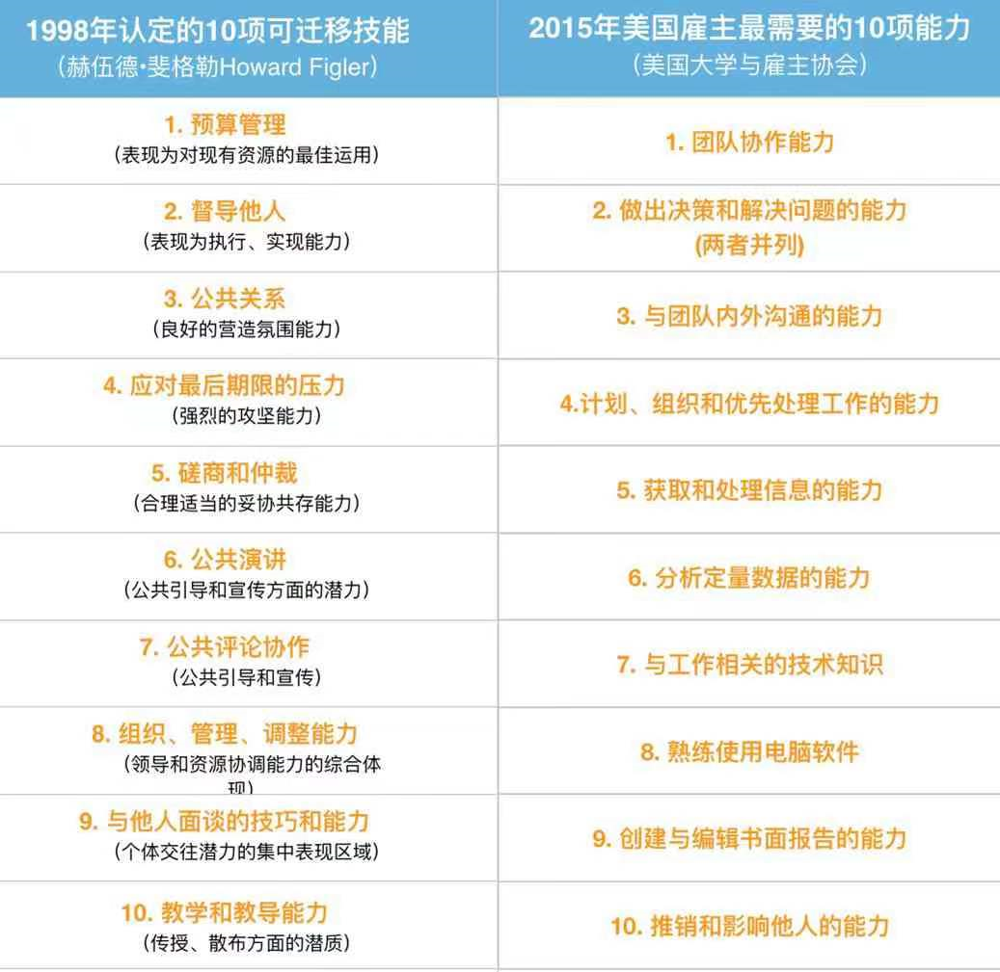
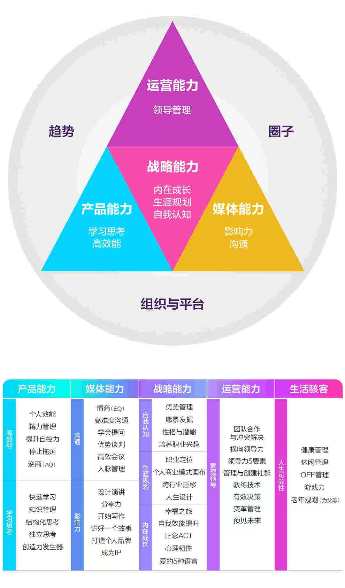
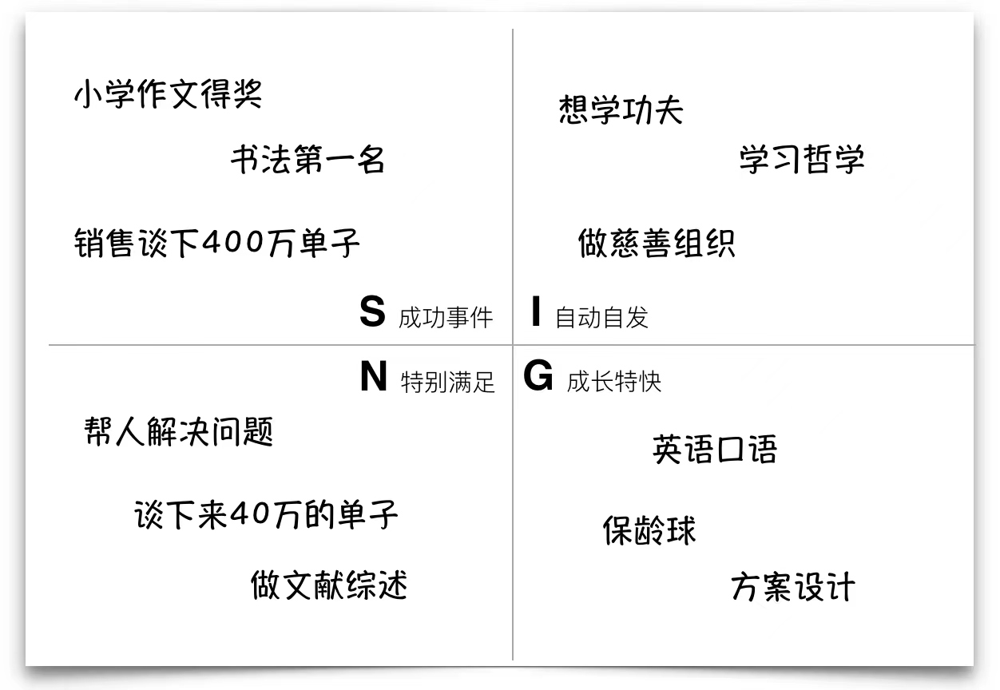

# █ 整体注意事项

1. 放松,不要太紧张
2. 眼神, 不要乱飘, 尽可能与对方有眼神接触
3. 临场发挥的问题, 太难的话, 可以说稍候回来再回答
4. 对不确认的问题, 先跟对方确认一下, 自己是否理解正确再回答

讲故事，要制造悬念，吸引对方的注意力

比如突出“两难”的场景

## 可迁移的能力

雇主最重视的可迁移技能

- 找一件自己确实做得不错的事情

  - 找到自己的优势, sign四要素

    

- 提取出一两个能力的关键词

  - 学习能力, **结构化思考**

- 指出该能力可以应用到新的领域中去

- 技术之内和技术之外的双向迁移

- 以往经历让你学会了什么

  - 解决机械组件之间的干涉问题, 实质上是团队协作问题, 需要跨部门的沟通协作
  - 技术通知单与变更记录, 让工作有迹可循, 可追溯

关于职业规划/完美主义拖延症

- 开始尝试一步到位，但意识到自己的不足
- 开始拆解任务，先从较容易着手的地方出发
- 仍在逐渐接近我的目标

体现好奇心，爱学习

- redis端口的故事

放大做事的结果和带来的价值

- 结果>过程
- 有可交付价值的>无可交付价值的
- 可复制可迁移的>不可复制的
- 要深度挖掘事情的背后逻辑和价值
- 看到任务, 先思考这个任务背后的逻辑和价值, 然后朝着实现该目标的方式努力

如果介绍自己工作的价值

- 先介绍部门和项目的意义
- 我在其中起到的作用
- 在项目之中写文档，介绍清楚业务逻辑和开发框架，以及一些核心技术点，新人过来可以很快上手

参与需求分析的具体实例

- 重复公司 vs 组织机构代码
  - 用户想要在添加客户公司时, 列出所有名字类似的公司, 提醒用户确认是否添加
  - 但是提醒名字类似的公司, 不但技术实现上会增加复杂度, 而且效果不好, 还增大了用户的工作量
  - 经过分析讨论, 用户是希望避免因客户公司改名, 导致重复添加公司
  - 其实是需要找到一个不变的标识, 在公司更名后可以识别: **组织机构代码**
- 

# █ 自我介绍

## 要有亮点

1. 有信息增量, 表达精炼, 体现简历上没有的东西
2. 有吸睛点, 展示自信, 不要平铺直叙
3. 可以引领 HR 的提问

## 只概括过去

我有几年某行业某职能的工作经验, 

核心的成果和业绩

不要讲流水账, 做概括, 突出亮点, 展示工作中的**高光部分**

*多段知名企业的经历/一家公司多次晋升/对行业全链路的全面认知*

- 我有四年多的实际开发经验, 掌握了 Java web 开发的相关技能, 如 Spring、SpringMVC、SpringBoot、MyBaits 等常用框架, 对基于 SpringCloud 的微服务架构也有一定的认识
- 在过去几年的工作中, 我先后做过 小贷管理系统, crm, 采购信息管理系统等项目, 帮助公司完成了信息化, 数字化, 提高了工作效率
- 在业务知识方面, 我对 xxx 有比较深入的认识
- 在通用技能方面, 我认为我具备 xxx 的能力

# █ 职业规划类问题

## 为什么选择这个公司/岗位

> 意愿, 匹配度, 职业生涯规划, 
>
> 要突出与别的公司的区别, 需要提前对公司有了解

从对公司的了解和认可度出发, 吹一波彩虹屁

- 目前, 我正在寻找更好的发展机会, 希望在 xxx 领域有更深入的发展
- 贵司所处的某某行业, 是我感兴趣的领域, 而且贵司在该领域中处于xxx 的领先地位

- 为什么可以胜任这个岗位

  对应岗位的职能和要求, 突出自己对岗位的**高匹配度**

  谈谈自己的职场价值和个人优势

  知识储备,专业技能,工作经验,软性通用能力,性格特质,人脉资源

  - 在岗位招聘 jd 中, 我了解到你们目前希望找到一个具备 xxx 能力的人
  - 在过往的工作经历中, 我掌握了 xxx 技术能力和相关业务知识,
  - 同时, 因为对该领域感兴趣, 在工作之余也会关注这方面的信息, 对xxx 有一定的了解
  - 因此, 我觉得从 专业技能, 工作经验, xx 能力等方面, 我能很好的匹配该岗位

1. 三十秒谈未来

   概括一下对行业发展趋势和公司业务趋势的理解

   强调一下自己对应聘公司岗位的**高兴趣度**

## 离职原因是什么

- 我希望能够在 xx 领域深入发展
- 前司因为业务性质的原因, 在技术领域投入不太, 我希望去到一个技术氛围更浓厚的平台, 继续提高自己的技术能力
- 跟家人一起, 换城市发展

## 你的职业规划是什么

> 可针对公司做一些特定的定制, 强调行业和当前岗位的匹配度

# █ 工作方法/能力类

## 如何解决工作中的分歧

> 要应聘中级岗位, 需要有能力处理冲突, 懂得安排工作的优先级

1. 交流沟通, 说服
2. 背景, 冲突,我的技能, 用我的方法是怎么解决的

- 开发人员跟产品经理之间经常会就一些具体需求产生分歧，开发人员基于自己的认识，可能会觉得这个需求不合理，没有意义，或者操作不方便
- 背后可能是产品经理没有很好挖掘用户需求，出现了xy问题，也可能是开发人员不了解用户实际场景
- 需要深度沟通，了解用户真正的使用场景，找到功能和技术的平衡点，考虑最好的解决方式

## 如何判断工作的优先级

## 怎么与 xxx 更好地合作

- 与产品经理
  - 双方够透明, 相信对方, 比如排期等问题
  - 需求有正常的处理流程, 不能随意变更
  - 开发人员也要对业务有一定的了解, 
- 与测试人员
- 与前端人员

## 作为新人, 怎么快速熟悉公司技术栈

1. 去网上学, 做 demo project
2. **领任务时主动选择相关技术, 但不是特别难的任务进行实战**
3. 在团队成员有空的前提下, 跟别人 one on one 学习

## 怎么带新人

1. 先了解新人对公司现有技术栈的掌握情况
2. 给一些简单的任务
3. code review, one on one
4. senior 要更多的管理和培养新人的能力

## 如何成为好的技术人员

- 对技术抱有热情, 拥抱新技术
- 保持不断学习
- 乐于分享, 拥抱开源社区

## 自己平时怎么学习

## 都在什么平台学习

- 关注业内公众号, 了解行业动态和信息
- 入门基础
- 算法, 书籍, 力扣+牛客
- 工具/框架, 去官网学习, 做demo项目

## 最近学了什么/如何学以致用

# █ 个人相关

## 请谈一下个人优点

> 优点是什么, 怎么在工作中发挥

## 请谈一下个人缺点

> 缺点是什么, 采取了什么方式去克服改进

- 我个人比较内向腼腆, 在公众场合或陌生人面前, 不太敢说活
- 我也意识到这一点, 有意地会用各种机会锻炼自己
- 在同力工作期间, 技术中心会定时组织一些分享培训, 技术中心不同部门的人都会参加学习, 让每个人都对整个公司和行业有更全面的认识
- 到了伟仕佳杰的时候, 我当时加入的团队没有这种制度, 于是我向领导建议, 可以定期组织分享会, 让每个人轮流分享一下自己学到的东西, 即锻炼了技术人员的表达能力, 也增加了同事之前的了解
- 经过一段时间的分享锻炼, 包括我在内的大家都更愿意表达自己. 

## 描述一件最xxx的经历

- 结婚, 筹备婚礼
  - s, 想要筹备一个不一样的婚礼, 别人很多婚礼都是迎亲, 到酒店吃席
  - t, 筹备婚礼
  - a, 
    - 关注公众号, 咨询朋友, 收集信息, 了解婚礼行业
    - 根据自己情况, 找到自己的期望 
    - 安排各种事务, 给合适的人分配合适的工作 
    - 做好预案, 对可能出现的风险点准备解决方案 
  - r 结果
    - 比较成功的完成了我们的婚礼
    - 第一次有完成筹备一个项目的体验, 并从中学到了很多经验 
      - 信息收集, 预算规划, 工作分配, 风险评估, 应急预案, 抓大放小
- 项目管理
  - 工作分配与任务排期
    - 分配工作
    - 任务排期
    - 
  
  - 风险预案
    - 人员风险, 定期提前掌握团队成员的出勤情况, 是否有请假计划
    - 技术方案, 提前讨论, 对不熟悉的技术, 提前安排人员学习熟悉
  
  -  
  

## 过去工作中对你影响比较大的人

> 什么人, 产生了什么影响, 对工作有什么作用

- 产品经理
- 让我在编码之外的工作有了提高, 有利于我的全面发展
  - 分析和解决问题的能力, 开发也要懂业务
  - 项目管理相关, 任务排期, 风险预案等
- 在工作中的影响
  - 更多地参与到需求讨论和分析中, 会思考用户的真实需求, 并结合技术方式去思考如何实现
    - 比如客户识别, 用统一社会信用代码做唯一键
    - 

# █ 宝洁八大问

#### 一、请你举一个具体的例子，说明你给自己确定了一个很高的目标，然后达到这个目标。

> **关键词：目标+执行力**

- 跨专业转行

  - `S` 对信息行业感兴趣，希望从事相关工作

    难点, 非专业背景, 未经过系统训练

  - `T` 掌握软件开发相关技能

  - `A` 有针对性地学习

    参加培训班,  

    根据招聘需求, 学习软件开发需要的技能

    看书, 看视频, 记笔记, 写demo等等

  - `R` 成功转行, 并得到前同事们的认可

#### 二、请举例说明你在一项团队活动中如何团结他人，并且起到领导者的作用，并带领团队最终获得所希望的结果。

> **领导力**

- 筹备婚礼
- 采购系统的管理职能?
  - 分配工作

#### 三、请你描述一种情形，在这种情形中你必须去寻找相关的信息，发现关键的问题事项，并且自己决定依照一些步骤来获得期望的结果。

> **分析+判断+决策能力**

- 同第一题, 为转行做了哪些工作, 

  收集了哪些信息(学校培养计划, 市场上的招聘需求, 向业内人员了解信息)

- 买了带刘海的macbookpro, 用快捷指令生成带黑边的壁纸, 实现隐藏刘海的效果

#### 四、请你举一个例子说明你是怎样通过事实来说服他人的

> **以事实说服他人的能力**

- 在前司团队中推荐大家使用 markdown
  - `S`, 以前大家使用各种不同类型的笔记工具, txt不便排版, 有道云笔记/印象笔记不便分享, word 对代码显示不理想
  - `T`, 找到一种适合技术团队的知识共享工具
  - `A`, 给大家展示 markdown 的便利
    - 纯文本模式, 适合版本控制, 可以添加到代码仓库
    - 对各种语言有高亮展示
    - 各大平台支持, 博客网站, github, gitee等个人使用, 
    - 配合 onedrive 当云笔记
  - `R`, 团队里已经习惯使用 markdown 编写文档

#### 五、请你举一个例子，说明在完成一项重要任务时，你是怎样和他人进行有效合作的。

> **团队合作能力**

#### 六、请你举一个例子，说明你的一个有创意的建议曾经对一项计划的成功起到了重要的作用。

> **创新能力**

- 利用外观模式的思想, 构造 facade 对象, 解决 mockito 不能 mock 静态方法的问题
  - `S`: spring 提供了静态方法, 以便在获取当前线程的用户信息, 但是通过 junit 进行测试时, 测试用例不是真正的用户请求, spring 的这个方法无法获取有效的用户信息, 并且 mockito 不能 mock 静态方法
  - `T`: 找到一个方法, 模拟用户来完成功能测试
  - `A`: 利用外观模式的思想, 构造一个对象, 业务代码中, 用这个外观对象去调 spring 的静态方法; 测试代码中, mock 这个外观对象
  - `R`: 借助这个外观对象, 绕开了 mockito 无法 mock 静态方法的问题, mock 这个对象, 就可以模拟出一个登录用户来完成功能测试

#### 七、请你举一个具体的例子，说明你是怎么评估形势，将注意力集中在最重要的事情上面，从而获得你所期望的结果。

> **分析事情和找到问题关键点的能力**

#### 八、请你举一个具体的例子，说明你是怎样获得一门技能并且将它应用于实际工作中的。

> **学习应用的能力**

- 转行, 学习 java 开发
- 重构, 看书, 熟悉工具中提供的技能
  - 用函数对象取代函数
- 设计模式的应用
  - 外观模式隐藏方法细节, 借助操作者门面可以 mock 用户
  - 模板方法模式解决对接多家供应商的问题, 模板方法+享元模式, 
    - 进一步优化, 利用 spi 机制, 做成插件式, 只需要提供独立的实现类jar包即可, 不用编译整个应用

# █ 提问环节

> 反映候选人对公司有没有了解, 有没有针对该公司的特定问题
>
> 找一个新颖的角度来问
>
> 准备公司黑话

## 工作相关

刚才的沟通过程中, 我注意到你的提问涉及到了以下几方面, 请问你对目前在招的这个岗位有什么期望/期望找到一个什么样的候选人, 你觉得我刚才的回答能否满足你对这个岗位候选人的预想?

主要产品是什么形式: 内网应用/独立交付/SaaS

当前使用的技术栈是什么样的?

系统承载数据量和访问量有多大?

能请您介绍一下您的职位吗, 

当前我们沟通的岗位是属于xxxx部门, 请问这个部门的主要职能和工作重心是什么? 

这个部门在公司中的作用和地位?

目前部门规模有多少人, 组成结构(架构师/前后端/测试),  

具体开发工作流程是什么样的, 敏捷开发? 测试驱动? 前后分离?

对于公司, 您最认可的是哪些点, 

(能否请您谈一下你在公司工作的感受)

对于员工, 您最看重什么品质

可能我对行业的了解不是很深入, 想请问一下公司有没有完善的培训体系, 包括专业技能或是业务领域的培训

## 公司制度

1. 工作制度

   上班时间, 固定工时还是弹性工时(弹性工时一般无加班费)

   周末双休/大小周, 有无补贴

   安排加班有无加班费, 或者调休/补贴

2. 试用期, 

   试用期的时长和薪资, 

   是否正常缴纳五险一金

   转正的标准是什么, 有没有考核

3. 调薪制度, 一年几次调薪, 

   是人人都有的普调, 还是部分优秀员工才有, 人员占比多少

   调薪的幅度和标准是什么样的

   什么时候入职的员工有参与调薪的机会?

4. 评级晋升机制

   有没有明确的职级评定和晋升路径

## 待遇相关

> 固定部分(基本月薪) + 浮动部分(绩效考核) + 福利补贴, 都要体现在offer 

1. 薪资结构是怎么样的, 

   固定底薪是多少, 一年固定几薪, 每月什么时候发放

2. 绩效奖金怎么计算, 怎么考核, 考核形式, 指标, 周期?月考/季考/年考

   如果考核有等级分类, 各级别人员的占比是多少

   有没有360环评?

3. 年终奖, 评定标准和发放时间是怎么样的

   年中入职或离职的人, 年终奖部分怎么计算?

4. 都有什么福利补贴

   餐补, 话费, 交通, 住房, 节假日

   五险一金, 补充公积金/企业年金, 缴纳基数和比例

   年度体检, 补充医疗保险

   团建, 下午茶福利, 疫情期间员工福利

   假期, 全薪年假病假的天数

5. 跳槽签约奖金

6. 异地安家费

7. 探亲假, 探亲路费报销等

## 谈薪技巧

高薪的 offer 与内因外因都有关

- 外因
  - 行业是否处于告诉发展阶段, 是否有行业红利
  - 企业的实力, 是不是行业内高速发展的公司
  - 招聘的急迫程度
  - 人才市场布局, 岗位是否属于高端人才
- 内因
  - 过往背景, 职业经历, 个人能力
  - 未来自身的发展潜力
  - 个人的谈薪能力

反套路技巧

- 一定要自信, 不要不好意思
- 沟通保持弹性, 强加入公司的意愿, 对自己做好工作是有信心的, 多说请您帮忙争取, 不一味强调我要多少
- 不要先说数字, 亮自己的底牌, 也不要给范围, 就是给了低线
- 不要讲个人困难, 也不要装可怜
- 如果有其他offer, 可以适当透露, 给hr施压
- 不要说了之后再跳价, 会给HR造成麻烦

应对涨幅过高

1. 不瞒您说, 目前薪资低于市场水平, 也是我目前求职看新机会的重要原因之一, 我对行业内的薪资情况也做了一些了解, 我在前司的薪资确实是低于行业平均值的
2. 之所以之前没有跳槽,也是想做更多的积累, 更长线地看待自己地职业发展, 而且手头上有比较重要的项目在进行中, 现在我觉得是比较成熟的时机了
3. 我认为自己在xx方面是有非常充足扎实的积累, 我也会投入百分百的努力, 相信可以非常好地胜任岗位的要求, 希望这次跳槽能拿到一个合理满意的薪资, 让我和新公司有更长足的合作机会,
4. 经过前面的面试, 我对贵司的印象很好, 也很愿意加入团队, 目前我也有其他公司的offer, 薪资上是高于贵司目前给到的数字, 如果两者差异不大, 贵司一定是我的首选, 还请您帮忙转达我的意思, 帮忙争取一下