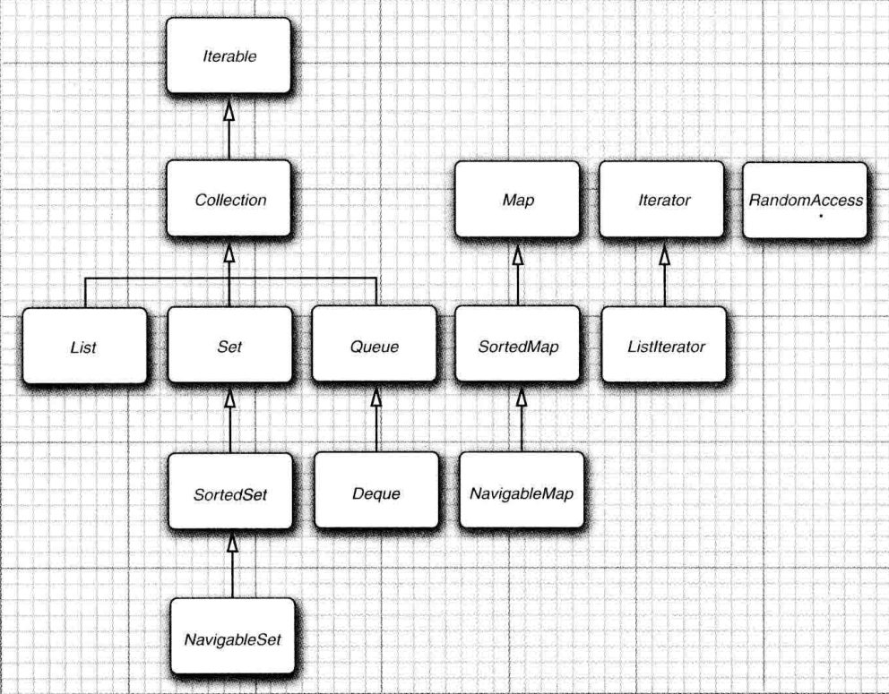
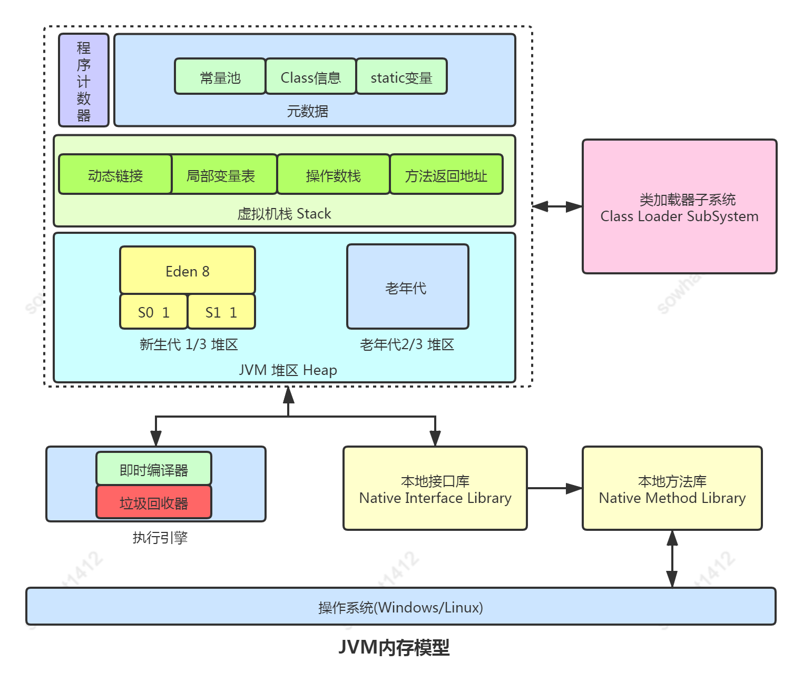
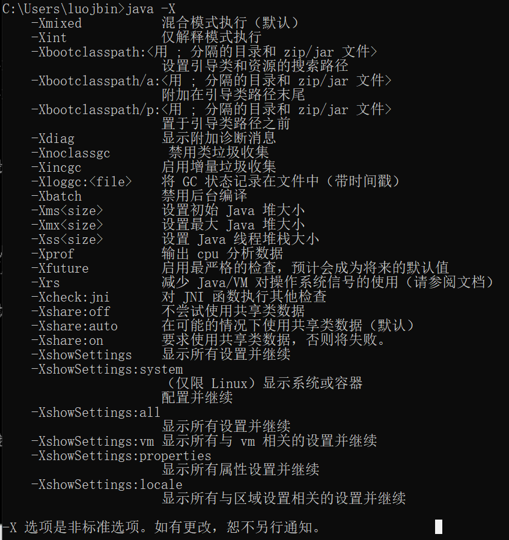
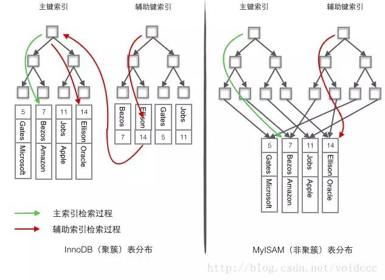

# █ Java 基础

## 常见问题

### 类加载机制

双亲委派模型

### 类初始化顺序

单个类: 静态块 -> 初始化块 -> 构造方法

父子类: **父静态块** -> 子静态块 -> **父初始化块** -> **父构造方法** -> 子初始化块 -> 子构造方法

### 重写 equals 和 hashCode 方法

- 需要保证 equals 和 hashCode 方法的一致性
- 有继承关系时, 应保障父子类之间的 equals 一致
- java 对重写 equals 的几点要求
  - 自反性, 任何非空 x, 有 x.equals(x) == true;
  - 对称性, a.equals(b) 等价于 b.equals(a)
  - 传递性, a.equals(b) 且 b.equals(c), 则有 a.equals(c)
  - 一致性, 当 a, b 未发生变化时, 多次调用 a.equals(b) 结果应该是一样的
  - 非空性, 当 x 不为空时, x.equals(null) == false;

### 单例模式实现

单例模式的三个特点

- 静态变量持有自身对象的引用, 
  - 饿汉: 载入时初始化, 最简单
  - 懒汉: 第一次使用时初始化, 双重检查锁+volatile 
- 私有化构造方法, 避免外部创建对象
- 提供公共方法, 获取唯一实例

```java
// 饿汉单例示例
public class Single{
    // 静态变量持有自身对象的引用, 载入时初始化
    public static Single instance = new Single();
    // 私有化构造方法
    private Single() {}
    // 公共方法获取唯一实例
    public static Single getInstance() {
        return instance;
    }
}

// 懒汉单例示例
public class LazySingle{
    // 静态变量持有自身对象的引用, volatile阻止指令重排, 并保证内存可见性
    public static volatile LazySingle instance;
    // 私有化构造方法
    private LazySingle() {}
    // 公共方法获取唯一实例
    public static LazySingle getInstance() {
        // 第一次判断, 外层不加同步锁
        if (instance == null) {
            synchronize(LazySingle.class){
                // 加锁后再次判断, 避免重复创建实例
                if (instance == null) {
                    instance = new LazySingle();
                }
            }
        }
        return instance;
    }
}
```

## 基本类型与包装类

八种基本类型, 对应八个包装类

- byte, short, int, long, float, double, char, boolean

包装类对象是不可变的, 与 `String `类似, jvm 可能会通过常量池实现包装类对象的复用, 比如 `Integer`, jvm 会对 `-128~127` 之内的 `Integer`对象存到常量池, 此时用双等号判断相等时可能会得到 `true `的结果, 但是对于超过这个范围的数据, 双等号判断相等则会得到 `false` , 因此对包装类的相等判断, 应该使用 `equals`方法

包装类对象是不可变的, 但包装类变量可以改变引用, 且允许为`null`, 在一些可能有空值的场景, 就需要使用包装类

## jvm jre jdk

- jvm 虚拟机

  提供对 class 字节码文件的运行环境支持

  java 是跨平台的, 指的是java 语言编译出来的字节码文件可以跨平台运行, 这个跨平台需要 jvm 的支持. 不同的平台有不同的 jvm, jvm 提供了一个统一的环境, 对具体的 java 程序隐藏了不同平台之间的差异

- jre 运行环境

  是 jvm 加上一些系统类库

- jdk

  在 jre 的基础上增加了一些开发工具, 如编译器, 调试器等等

## 集合框架



两个基本接口 `Collection` 和 `Map`, 

- `Collection` 有 `List`,`Set`,`Queue`三个子接口, 即列表, 集, 队列
- `Map` 是映射, 存储 `key-value` 键值对

比较常用的集合有以下几种

- `ArrayList`

  底层是一个数组, 可以实现自动扩容, 通过下标访问元素, 随机访问速度很快

  但如果需要在中间编辑或插入元素, 需要移动数组中的大量元素, 随机插入/删除性能较低

- `LinkedList`

  底层是链表, 根据需要增删节点, 

  随机读取性能较差: 通过下标访问元素时, 需要一个一个节点地遍历过去, 如果要找的节点在列表中部, 查找性能不如 `ArrayList` 高

  随机写入性能较好: 由于链表的特性, 在链表中间插入/删除元素时, 只需要修改相邻节点, 不需要像`ArrayList`那样移动大量元素, 随机写入的性能较好

- `Queue`/`Deque`

  队列或双端队列, 可以用来实现先入先出的队列结构, 或者先入后出的栈结构, 常用的具体实现类也是 `LinkedList` 

- `HashMap`

  散列表, 存储键值对, 当哈希冲突较少时, 桶中使用链表结构存储, 当哈希冲突较多, 就会转换成红黑树

- `HashSet`

  基于 `HashMap`主要是利用 `HashMap` key 的唯一性来实现`Set` 无重复元素的效果. 

  其中会使用一个虚假的空对象来填充 `HashMap` 中需要的`value`

## 内存模型

### 内存模型

- 栈
- 堆
- 方法区/元空间



### 内存泄漏 vs 内存溢出

- 内存泄漏: 不再使用的内存空间无法释放, 导致系统占用越来越多
- 内存溢出: 可用内存已满, 无法申请到需要的内存空间

## 内存回收GC

### jvm的GC实现

### G1

### ZGC

## 调优

绝大多数情况下, 性能问题都能在架构/代码层面解决

而对 jvm 的调优, 主要是通过启动参数, 修改虚拟机的一些配置, 改变 GC 策略等



```shell
java -Xms1024m -Xmx1024m
# -Xms 最小堆内存
# -Xmx 最大堆内存, 通过设置最大最小内存为同样大小, 避免调整堆空间带来的开销
```

除了上面的参数, jvm 还有一些非稳定参数, 可能会影响系统稳定性

布尔型参数, 用`+`表示启用, `-`表示停用

> java -XX:+enableOption
>
> java -XX:-disableOption

字符串/数值型参数, 用赋值表达式来表示设定值

> java -XX:option=value


## 多线程

线程安全问题

锁

同步器

CountDownLatch

线程池

并发包

## 反射

反射的基本概念

反射的应用

# █ 设计模式

模板方法模式

外观模式

代理模式

适配器模式

# █ 算法与数据结构

## 堆

最大堆/最小堆, 局部有序(获取最值)

java 中通过 优先队列/PriorityQueue 来实现, 默认是最小堆

基于堆, 可以显示快速获取最值, 也可以基于堆的性质实现堆排序


# █ Spring

Spring SpringBoot SpringCloud 的区别

- spring framework 是基础, 负责bean的管理, 另外提供了很多常用的功能组件, 如 springMVC, springAOP 等. 为了满足不同需求, spring 提供很多配置项, 也提供了条件注解来对项目进行更方便的配置
- SpringBoot 就是基于条件注解提供了很多 starter 和自动配置类, 用"约定大于配置"的形式提供了默认配置, 减轻开发人员在项目搭建中的配置管理工作
- SpringCloud 是 Spring 团队推出的一个微服务架构框架, 其中很多组件并不是 Spring 团队自己提供的, spring cloud 的作用相当于一个平台, 通过一些 strarter 实现对组件的快速整合, 将各家优秀组件整合到分布式系统中

Bean 是否线程安全

Bean 的模式, 单例/原型

spring 的事务机制: aop 切面


# █ Redis

基本类型

- String, 字符串, 整数或浮点数
- hash. 哈希, 包含键值对
- list, 列表, 链表形式
- set, 去重列表
- zset, 有序集合, 去重, 且可以为元素设置分值

持久化

淘汰机制

### 分布式锁

原理: 尝试在 redis 中添加一个key, 表示一个锁

- 如果 redis 原来不存在该 key, 添加成功, 表示取到了锁, 
- 如果 redis 已有同名的key, 表示未取得锁, 等待或者直接失败

基本实现

```shell
# 上锁: 增强型的 setnx, 设值的同时指定过期时间, 上锁成功返回 1
set my:lock true ex 30 nx 
# 解锁: 删除锁的key
del my:lock
# 缺陷, 不能重入, 可能A线程的锁超时自动释放,B线程重新上锁后被A线程解锁 
```

redisson实现

- 封装了 lua 脚本, 实现了可重入锁, 锁等待, 防止释放其他线程的锁等功能
- 设置一个 hash, 名称就是锁名，hash里面内容仅包含一条键值对，
  - 键 = redisson客户端唯一标识 + 持有锁线程id
  - 值 = 锁重入计数
  - 给hash设置的过期时间就是锁的过期时间

## 缓存失效问题

- **缓存穿透**

  原因: 反复查询不存在的数据, 每次都要到数据库中查询, 却得不到结果, 浪费数据库资源

  解决: 缓存空结果, 避免短时间内反复执行无效查询

- **缓存击穿**

  原因: **某个热点数据过期**, 大量并发请求都压到数据库, 数据库压力瞬间增大

  解决: 并发查数据库时添加互斥锁, 一个线程查数据库, 其他线程等待

- **缓存雪崩**

  原因: **大量缓存数据同时过期**, 导致请求都压到数据库, 数据库压力瞬间增大

  解决: 过期时间随机化, 添加互斥锁

# █ 消息队列

## activyMQ


## RabbitMQ


## 主要区别

| 区别点   | ActiveMQ/ApolloMQ    | RabbitMQ                       |
| -------- | -------------------- | ------------------------------ |
| 实现协议 | Java消息规范 JMS     | AMQP                           |
| 跨平台性 | 一般, 主要是java生态 | 好, 各种语言都有很好客户端支持 |
| 实现语言 | java                 | erlang                         |
| 工作原理 | 详见各自工作原理     | 详见各自工作原理               |

# █ 数据库

## 事务

### ACID 四大特性

- `Atomicity` 原子性 

  整个事务的所有操作要么全部提交成功, 要么全部失败回滚.

- `Consistency` 一致性

  数据库总从一个一致性状态转换到另一个一致性的状态. 

- `Isolation` 隔离性

  一个事务的修改在最终提交之前, 对其他事务时不可见的.

- `Durability` 持久性

  一旦事务提交, 则其所作的修改就会永久保存到数据库中, 即使系统崩溃, 修改的数据也不会丢失.

### 隔离级别

| 隔离级别 | 脏读 | 不可重复读 | 幻读 | 加锁读 |
| -------- | ---- | ---------- | ---- | ------ |
| 未提交读 | 是   | 是         | 是   | 否     |
| 已提交读 | 否   | 是         | 是   | 否     |
| 可重复读 | 否   | 否         | 是   | 否     |
| 串行化   | 否   | 否         | 否   | 是     |

- 脏读: 读到未提交的数据, 后续可能被回滚
- 不可重复读: 同一事务内多次查询结果不同(其他事务**修改**了数据)
- 幻读: 同一事务内多次查询结果集数量不同(其他事务**插入**了数据)

### 多版本并发控制 MVCC

innoDB 的 MVCC, 实现方式: 在每行记录后保持两个隐藏的列, 通过系统版本号记录行的**创建时间**和**过期时间**

每开启一个事务, 系统版本号递增, 开启事务时的版本号作为该事务的版本号, 

- 查询时, innoDB 只获取早于当前事务版本号的数据行,
- 插入时, 保存当前版本号为该行的版本号
- 删除时,记录当前版本号到该行的过期时间
- 更新时, 原行删除时间为当前版本号, 添加一行以当前版本为创建时间

MVCC 只能在 **可重复读** 和 **已提交读** 这两个隔离级别下工作, 

未提交读每次都取最新的行(不适用), 串行化为所有行都加锁(不需要MVCC)


## 索引

### 索引类型

- B+树索引, 多路查找树, 数据都在叶子节点, 方便范围查询
  - 适合全键值, 键值范围, 键前缀查找
  - 如果不是从数据最左开始, 如全模糊查询, 无法使用索引
- 哈希索引, 基于哈希表, 只能精确匹配

### 聚簇索引



- 聚簇索引

  按照主键构造一个B+树

  将数据存储和索引放到了一块，找到了索引也就找到了数据

- 非聚簇索引

  也叫辅助索引

  将数据存储于索引分开结构，索引结构的叶子节点指向了数据的对应行

  找到索引之后需要会表获取数据

### 索引失效

- 索引列不独立. 独立是指: 列不能是[表达式](https://so.csdn.net/so/search?q=表达式&spm=1001.2101.3001.7020)的一部分, 也不能是函数的参数
- 使用了左模糊
- 使用or查询的部分字段没有索引
- [字符串](https://so.csdn.net/so/search?q=字符串&spm=1001.2101.3001.7020)条件未使用 ’ ’ 引起来
- 不符合最左前缀原则的查询
- 索引字段建议添加 NOT NULL 约束
- 隐式转换导致索引失效
- 索引失效导致行锁升级为表锁

## sql优化

- 对 sql 本身的优化, 如拆分联表, 修改子查询等
- 添加索引
- 使用冗余字段

# █ 分布式架构

## SpringCloud

### 熔断机制

## CAP

指分布式系统中, CAP 三个指标最多只能满足其中2个需求. 

- `Consistency` 一致性 

  同一数据的多个副本是否实时相同。

- `Availability` 可用性

  一定时间内 & 系统返回一个明确的结果 则称为该系统可用。

- `Partition tolerance` 分区容错性

  将同一服务分布在多个系统中，从而保证某一个系统宕机，仍然有其他系统提供相同的服务。

### 酸碱平衡

单数据源的时候, 我们知道事务需要满足 **ACID** 四个特性

- `Atomicity` 原子性 

  整个事务的所有操作要么全部提交成功, 要么全部失败回滚.

- `Consistency` 一致性

  数据库总从一个一致性状态转换到另一个一致性的状态. 

- `Isolation` 隔离性

  一个事务的修改在最终提交之前, 对其他事务时不可见的.

- `Durability` 持久性

  一旦事务提交, 则其所作的修改就会永久保存到数据库中, 即使系统崩溃, 修改的数据也不会丢失.

CAP理论告诉我们一个悲惨但不得不接受的事实——我们只能在C、A、P中选择两个条件。而对于业务系统而言，我们往往选择牺牲一致性来换取系统的可用性和分区容错性。不过这里要指出的是，所谓的“牺牲一致性”并不是完全放弃数据一致性，而是牺牲**强一致性**换取**弱一致性**。下面来介绍下 **BASE** 理论。

- `Basic Available` 基本可用

  整个系统在某些不可抗力的情况下，仍然能够保证“可用性”，即一定时间内仍然能够返回一个明确的结果。只不过“基本可用”和“高可用”的区别是：

  - “一定时间”可以适当延长 当举行大促时，响应时间可以适当延长
  - 给部分用户返回一个降级页面 给部分用户直接返回一个降级页面，从而缓解服务器压力。但要注意，返回降级页面仍然是返回明确结果。

- `Soft State`: 柔性状态

  同一数据的不同副本的状态，可以不需要实时一致。

- `Eventual Consisstency`. 最终一致性

  同一数据的不同副本的状态，可以不需要实时一致，但一定要保证经过一定时间后仍然是一致的。

## 分布式事务

# █ Docker & K8s

# █ 前端

## vue

## JavaScript

# █ 微信生态

## 微信登录

## 微信小程序

4. 
