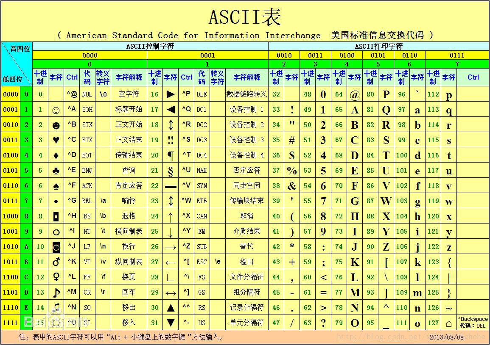

新手程序员在程序开发过程中, 常常会碰到各种各样的乱码问题, 这都是因为对于字符编码理解不清导致的, 这里简单总结一下.

# █ 各种编码详解

## ASCII 

最基本的编码, 占用空间一字节, 共8位, 最高位始终为0, 剩余有效位数7位.

0-31号, 共32个, 为控制码, 控制打印机等设备的行为

31-127, 共96个, 为具体字符编码, 包括数字, 英文字母, 常见标点符号.

## ISO-8859-1

字符集 
作用：扩展ASCII，表示西欧、希腊语等。 
位数：8位， 
范围：从00到FF，兼容ASCII字符集。 

## ANSI

ANSI 原意是指美国国家标准学会(American National Standard Institute), 他们制定了最初的 ASCII 编码. 

但由于各国都有计算机使用要求, 就都在 ASCII 基础上进行了扩展, 形成了各种语言的字符集. 这些在 ASCII 基础上扩展而来的字符集, 统称为 ANSI 字符集. 注意 ANSI 字符集不是具体的某一个字符集, 而是一系列的字符集族. 

在 Windows 系统中, 通常指的是系统默认的本地化编码, 不同语言版本的windows 系统环境下, ANSI 指代的具体字符集也不同. 如简体中文版里指的是 **GBK**, 繁体中文版指的是 **BIG5**, 日文韩文等系统还有其他字符集.

## GB系列

包括 GB2312, GBK, GB18030 等

### GB2312

中国对 ASCII 扩展而来的简体中文字符集.  变长字符集, 用1-2个字节来确定一个字符

前 128 个编码兼容 ASCII, 后续的汉字编码收录了常见的中文字符. 总共收录7445个符号，包括6763个汉字.

- 单字节时, 最高位为0, 即小于等于127, 则这个字节独立表示一个字符, 与 ASCII 兼容;

- 双字节时, 以2个首位为1的字节, 共16位确定一个字符. 高字节在 A1-F7 之间,  低字节在 A1-FE 之间.

可以结合"区位码"来理解, GB2312 对收录的字符进行分区, 从01-94共94个区(0x5E), 每个区有94个位(0x5E), 即区位码的范围为 0101-5E5E, 又因与 ASCII 有冲突, 约定高低字节均加上0xA0作为偏移量, 即得到 GB2312 的实际编码区域落在 A1A1-FEFE, 部分区未被使用, 某些分区内有部分位点作为隔离带, 未定义具体字符. 

GB2312 除了定义汉字, 还将英文字母和数字定义了一遍, 这些新的字母数字字符需要用2个字节来表示, 即为全角字符, 原来 ASCII 的字母和数字, 就是半角字符.

### GBK

GB2312 的扩展, 也是 Windows 简体中文版的 ANSI 真正的字符集. 共收入21886个汉字和图形符号, 增加了繁体字, 中日韩统一汉字以及一些符号..

由于 GB2312 高低字节都偏移0xA0, 低字节首位也是1, 浪费了许多码位, 实际上只要第一个字节的首位为1, 就可以表示是一个汉字编码的一部分, 与后续一个字节共同确定一个字符. 

因此, GBK 就是在这些空闲码位上, 高字节添加了 81-9F 为新增的区, 低字节添加了 40-9F 为新增的位, 然后在这些新增的区位中定义了较少用的汉字和符号(特别的, 低字节7F不使用).

- 单字节同 ASCII
- 双字节时, 总体编码范围为 8140-FEFE 之间，高字节在 81-FE 之间，低字节在 40-FE 之间，剔除 XX7F 一条线

### GB18030

中国还有很多少数民族有自己的语言和文字, GBK 还是不够用, 继续扩展出了 GB18030, 共收录7万多个字符, 而且持续增加中. 

我们知道 GBK 编码规则, 高字节大于81, 低字节大于40, 低字节还有小于40的部分可以用. 于是约定了4字节表示法, 如果第二字节不是 GBK 有效编码, 就再加上后面两个字节, 用四个字节来确定一个字符. 

- 单字节同 ASCII
- 双字节同 GBK
- 四字节第一三字节从81-FE，第二四字节从30-39

## UNICODE

由于不同国家和地区, 出于自己的需要, 各自扩展了 ASCII , 彼此之间互不兼容, 不利于国际间的交流. 

为了解决这个问题, 提出了 unicode, unicode 只是字符集编号, 但不涉及具体在文件中如何存储.

常用的 unicode 标准为 UCS-2, 使用2个字节共16位来给全球字符编号, 

后续提出了 UCS-4, 使用4字节共32位来给全球字符编号

### UTF

UCS Transfer Format

直接将字符以unicode编码存储, 需要占用2个字节共16位, 故称为 UTF-16.

但涉及到一个问题. 由于unicode 需要两个字节来存储, 而不同的系统对于高低字节的读取顺序不一样, 因此需要约定读取顺序, 

UNICODE 规范中约定, 在每个按照 unicode 编码的文件中, 需要添加一个编码顺序的字符, 称为 "零宽度非换行空格", 其十六进制表示为 `FEFF`, 正好是两个字节.

- FF 比 FE 按顺序递增, 为正序, 大头方式, 高字节在前, 低字节在后
- FF 比 FE 按顺序递增, 为逆序, 小头方式, 低字节在前, 高字节在后

比如汉字"中", unicode 编码为 4E2D, 用不同的方式保存到文本文件中, 编码结果如下表所示.

| 编码方式              | 编码标记 | 正文(HEX) | 正文(BIN)                                |
| --------------------- | -------- | --------- | ---------------------------------------- |
| unicode little endian | FF FE    | 2D 4E     | 00101101, 01001110                       |
| unicode big endian    | FE FF    | 4E 2D     | 01001110, 00101101                       |
| UTF-8                 | -        | E4 B8 AD  | 1110**0100**, 10**111000**, 10**101101** |
| UTF-8 with BOM        | EF BB BF | E4 B8 AD  | 1110**0100**, 10**111000**, 10**101101** |
| GB系列                |          | D6 D0     | 1101 0110, 1101 0000                     |

# █ 开发中的乱码问题

由于有多种编码的存在, 如果数据收发双发的编码设置不一致, 就会出现乱码问题. 

要解决乱码问题, 就需要为数据传输的全过程中统一编码方案. 

为了更好的支持跨平台和国际化, 建议将所有地方都统一成 UTF-8 编码方式. 

## 文本文件的编码

## 系统的默认编码

linux 默认 utf-8, windows 简体中文版默认 GBK

## 开发中的编码设置

#### 项目文件乱码

eclipse, 将项目编码, 以及新增文件编码, 都设置为 UTF-8 需要为文件

idea, 将项目编码, 以及新增文件编码, 都设置为 UTF-8

#### idea部分插件乱码

#### tomcat输出控制台乱码

#### jvm 输出

#### get 请求参数乱码

tomcat, 将 URIEncoding 设置为 UTF-8

#### post 请求参数乱码

web.xml, 添加 encoding 的 filter

#### http 返回值乱码

spring, 将字符串返回编码设置为 UTF-8 

数据库

