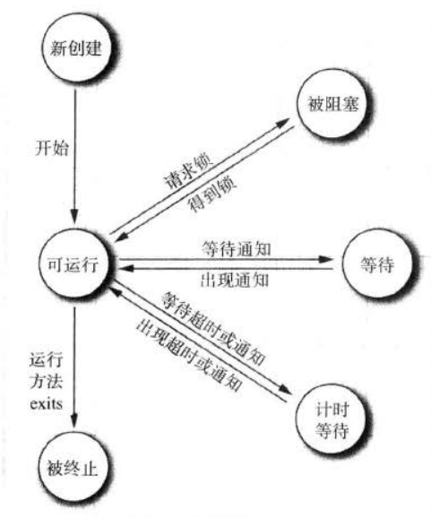

# █ 并发

# 一. 线程

## 1. 任务, 进程, 线程

现代计算机大多支持多任务处理, 用户可以一边用浏览器浏览网页, 一边用播放器播放视频, 一边还在用QQ与朋友聊天

为了处理多任务, 计算机用进程来表示一个任务, 通常运行一个程序就是一个进程, 也有某些程序会启动多个进程. 如下图所示, Idea 有5个进程, Typora 有2个进程, 而 SumatraPDF 和 任务管理器, 只有一个进程. 


操作系统将 cpu 的时间片分配给每个进程, 每个进程都有机会得到 cpu 时间, cpu 快速切换进程, 给人一种所有任务都在同时进行, 并行处理的感觉. 

而多线程程序, 则是在较低的层次上扩展了多任务的概念, 一个程序同时执行多个任务., 每一个任务称为一个线程. 可以同时运行多个线程的程序, 称为多线程程序.

如图形界面程序, 在某些时候可能需要进行着比较耗时的运算, 如果这个程序是单线程的, 它就无法在运算的同时响应用户的操作, 必须等待运算过程结束. 而如果这个程序是多线程的, 它就可以让一个线程在后台进行运算, 另一个线程负责响应用户操作. 

## 2. 线程与进程的区别

每个进程拥有自己的一整套变量,  而线程则是共享数据. 共享数据使得线程之间的通信比进程之间通信更加有效, 更加容易, 但同时也可能带来了一些修改冲突的风险.

与进程相比, 线程更加轻量级, 创建/撤销一个线程, 比启动一个新进程的开销要小得多. 

## 3.  中断/结束线程

### 3.1 自然结束

当线程的 run 方法执行完所有语句后, 并经 return 语句返回时, 线程自然结束.

```java
public static void main(String[] args){
    Thread t = new Thread(() -> {
        try {
            for (int i = 1; i <= 5; i++) {
                System.out.println("第" + i + "次输出;");
                Thread.sleep(1000);
            }
        } catch (InterruptedException e) {
            e.printStackTrace();
        }
        System.out.println("线程自然结束.");
    });

    t.start();
}
```

### 3.2 异常结束

线程的 run 方法不允许抛出受查异常, 而抛出非受查异常则会导致线程的异常终止. 

```java
public static void main(String[] args) {
    Thread t = new Thread(() -> {
        int i = 0;
        while (true) {
            System.out.println("第" + ++i + "次输出;");
            if (i == 3) {
                System.out.println("线程内抛出异常");
                throw new RuntimeException();
            }
        }
    });

    // 安装默认异常处理器
    Thread.setDefaultUncaughtExceptionHandler((thread, e) -> {
        System.out.println("线程:" + thread + "异常结束, 异常: " + e);
    });
    t.start();
}
```

### 3.3 强制结束

有一个 stop() 方法可以强制结束线程, 但可能会造成不可预估的错误, 现已废止该方法.

### 3.4 请求结束

有一个 interrupt() 方法, 可以请求线程自行结束. 每个线程都有一个 boolean 标志, 记录线程的中断状态, 当对一个线程调用 interrupt() 方法时, 该线程的中断状态被置位. 

线程应该自行检查自己的中断状态, 但没有理由要求被中断的线程应该立即终止. 中断只是为了引起线程的注意, 被中断的线程可以自行决定如何处理中断. 某些重要的线程应该处理异常后继续执行, 不理会中断. 但更普遍的情况下, 线程应将中断作为结束的请求, 执行必要的善后工作后结束线程. 

```java
// 线程应通过以下方式判断是否被中断
Thread t = Thread.currentThread();
while(!t.isInterrupted() && otherCondition) {
    // 完成线程相关任务
}
// 如果是被打断的,进行善后操作
```

如果线程被阻塞(暂停等待), 如 sleep 和 wait 方法, 就无法按照以上方式检测中断状态. 如果在被阻塞的线程上调用 interrupt() 方法, 阻塞调用会抛出一个 InterruptedException 以中断阻塞, 线程恢复到可运行状态, 之后线程应自行处理中断.

```java
public static void main(String[] args) throws InterruptedException {
    Thread t = new Thread(() -> {
        Thread c = Thread.currentThread();
        int i = 0, n = 0;
        while (!c.isInterrupted()) {
            i++;
            if (i % 100000000 == 0) {
                n++;
                System.out.println("第" + n + "次输出;");
            }
            if ( i == 1000000000) {
                i = 1;
            }
        }
        if (c.isInterrupted()) {
            System.out.println("线程" + c.getName() + "检测到中断信号, 中断结束");
        }
    });

    t.start();

    Thread.sleep(1000);
    Thread mainThread = Thread.currentThread();
    System.out.println(mainThread + "请求将线程" + t.getName() + "中断");
    t.interrupt();
    System.out.println("中断请求已发出");
}
```

如果需要在每次工作迭代后都调用 sleep 或其他可中断方法, 则没有必要进行 isInterrupt() 检测. 因为若线程的中断状态已被置位,  此时调用 sleep 方法, 线程不会进入休眠状态, 而是直接抛出 InterruptedException, 并清除中断状态. 接下来就需要捕获 InterruptedException 并采取相应的处理

```java
// 有可中断方法的, 不需要进行 isInterrupt() 检测, 捕获 InterruptedException
Thread t = Thread.currentThread();
try{
    while(otherCondition) {
        // 完成线程相关任务
        Thread.sleep();
    }
} catch(InterruptedException e) {
    // 处理异常
} finally {
    // 如果是被打断的,进行善后操作
}
```

```java
public static void main(String[] args) throws InterruptedException {
    Thread t = new Thread(() -> {
        try {
            int i = 0;
            while (true) {
                System.out.println("第" + ++i + "次输出;");
                Thread.sleep(1000);
            }
        } catch (InterruptedException e) {
            e.printStackTrace();
        }
        System.out.println("中断+sleep 产生了 InterruptedException, 打断了 while 循环, 往下执行直至线程结束");
    });

    t.start();

    Thread.sleep(5000);
    Thread mainThread = Thread.currentThread();
    System.out.println(mainThread + "请求将线程" + t.getName() + "中断");
    t.interrupt();
    System.out.println("中断请求已发出");
}
```


尽量不要忽略中断异常, 可以采用以下两种方式:

- 重新为线程设置中断状态, 以便调用者自行检测
- 将异常向调用者抛出, 以便调用者自行处理

# 二. 创建线程

## 1. 继承 Thread 类

继承 Thread 并重写 run 方法. 这种方式通常不建议使用, 具有以下缺点:

1. 继承冲突: 由于java是单继承的，这就导致不能去继承其他类，会存在继承冲突问题。
2. 线程耦合: 由于重写了线程的run方法，这就导致该线程只会运行 run 方法中的任务，存在任务与线程的强耦合关系，不利于线程重用。

```java
class MyThread extends Thread {
    @Override
    public void run() {
        for (int i = 0; i < 1000; i++) {
            System.out.println("1-----Thread 的子类");
        }
    }
}
```


## 2. 实现 Runnable 接口

实现 Runnable 并重写 run 方法, 利用其对象创建新的 thread 对象

```java
class MyRunnable implements Runnable {
    @Override
    public void run() {
        for (int i = 0; i < 1000; i++) {
            System.out.println("2-----Runnable 的实现类");
        }
    }
}
```


## 3. 匿名内部类

通过匿名内部类创建 Thread 子类对象, 或 Runnable 实现类对象

```java
// 方法3-1, 使用匿名内部类的创建 Thread 的子类对象。
Thread t3 = new Thread() {
    @Override
    public void run() {
        for (int i = 0; i < 1000; i++) {
            System.out.println("3.1-----Thread 的匿名子类");
        }
    }
};

// 方法3-2, 使用匿名内部类创建 Runnable 实现类的对象, 再创建相应的 thread 对象
Runnable r2 = new Runnable() {
    @Override
    public void run() {
        for (int i = 0; i < 1000; i++) {
            System.out.println("3.2-----Runnable 的匿名实现类");
        }
    }
};
Thread t4 = new Thread(r2);
```


## 4. lambda 表达式

通过 lambda 表达式创建 Thread 子类对象, 或 Runnable 实现类对象

```java
// 方法4-1, 使用 lambda 表达式创建 Thread 子类对象
Thread t5 = new Thread(() -> {
    for (int i = 0; i < 1000; i++) {
        System.out.println("4.1-----Thread 的匿名子类, lambda 形式");
    }
});

// 方法4-2, 使用 lambda 表达式创建 Runnable 实现类对象, 再创建相应的 thread 对象
Runnable r3 = () -> {
    for (int i = 0; i < 1000; i++) {
        System.out.println("4.2-----Runnable 的匿名实现类, lambda 形式");
    }
};
Thread t6 = new Thread(r3);
```


# 三. 线程状态和属性

## 1. 线程的状态



线程有以下6种状态, 可以通过 getStatus() 方法获取其状态

- new, 新创建
- runnable,  可运行
- blocked, 被阻塞
- waiting, 等待
- timed waiting, 计时等待
- terminated, 被终止

### 1.1 新创建

刚用 new 操作创建的线程, 还未开始运行, 此时线程的状态为 new, 可以在线程开始运行之前执行一些初始化工作

### 1.2 可运行

一旦调用 start() 方法, 线程处于 runnable 状态. 此时线程可能获取了cpu时间正在运行, 也可能正在等待 cpu 时间等待运行.  

### 1.3 阻塞/等待

当线程处于被阻塞或等待状态时, 它暂时不活动, 

- 等待获取内部锁时, 进入阻塞状态
- 已获取锁等待运行时, 处于等待状态
- 有超时参数的方法, 进入计时等待

### 1.4 计时等待

### 1.5 被终止

## 2. 线程的属性

### 2.1 基本信息

### 2.2 优先级

### 2.3 守护线程

### 2.4 异常处理

#### 2.4.1 异常处理器

线程的异常处理器, 要求实现 Thread.UncaughtExceptionHandler 接口, 在 uncaughtException(Thread t, Throwable e) 方法中处理异常.

```java
public class ExHandler implements Thread.UncaughtExceptionHandler {
    @Override
    public void uncaughtException(Thread t, Throwable e) {
        System.out.println(">>>>ExHandler: 捕获线程" + t.getName() + "抛出的异常:" + e);
        e.printStackTrace();
    }
}
```

#### 2.4.2 线程组

线程组可以统一管理所有线程集合, 默认情况下, 创建的新线程与创建它的线程属于同一线程组, 即默认所有线程都与main线程同组. 

#### 2.4.3 异常处理逻辑

由 jvm 调用异常线程的 dispatchUncaughtException 方法, 获取异常处理器以处理异常

- 若该线程配置了自己的异常处理器, 则由异常处理器处理异常
- 若无异常处理器, 则由线程组处理异常
  - 若线程组有父线程组, 交给父线程组处理
  - 若无父线程组, 若 Thread 配置了默认处理器, 由默认处理器处理
  - 若无默认处理器, 异常是 ThreadDeath 的实例, 什么都不做
  - 否则输出到 System.err

# 四. 同步

由于多线程实际上是轮流运行, A线程的工作做到一半, 就切换到B线程, 而B线程恰好需要操作A线程相同的资源, 则由可能出现修改冲突. 

## 1. 锁

### 可重入锁

线程可以重复获得已有的锁, 获取几次就要解锁几次, 锁有一个持有计数器.

由于锁可重入, 被一个锁保护的方法可以调用另一个使用相同锁的方法.

- 公平锁

  偏爱等待时间长的线程, 但受限于线程优先级, 开销更大, 且效果不能保证. 

### 条件对象

线程已经获取了锁, 但缺少某些条件, 不能继续往下执行, 因此放弃持有锁, 以便别的线程使用.

一个锁对象可以有一个或多个相关的条件对象, 通过 newCondition 方法创建.

> lock.newCondition();

在条件对象上调用 await 方法, 则会将线程阻塞, 并放弃锁, 进入该条件的等待集, 直到其他线程调用该条件下的 signAll 方法唤醒等待集中的线程.

等待获取锁的线程, 与进入锁的等待集中的线程有所不同. 当锁重新变成可用时, 等待获取锁的线程解除阻塞, 通过竞争让另一个线程获取锁. 而处在条件等待集中的线程, 并不会接触阻塞.

相当于在两个不同的地方排队, 锁可用并不代表条件满足

条件等待集中的线程, 被 signAll 唤醒后, 会从 await 的地方继续, 但此时不能确定条件已经满足, 需要重新检测, 因此, 条件等待通常被放在 while 循环中, 若重新检查时依旧不满足条件, 就要再次进入等待

```java
while(!conditionMatched){
    condition.await();
}
```

使用条件对象的一个关键问题在于,  当线程调用 await 进入等待集后, 就无法唤醒自身, 必须依赖另外一个线程来唤醒等待集中的线程. 若没有其他线程来唤醒等待集中的线程, 它就永远不再运行. 若程序中其他线程都被阻塞, 最后一个活动线程在唤醒别的线程之前也进入阻塞状态, 就再也没有任何线程能够解除其他线程的阻塞, 程序被挂起, 这种情况被称为死锁. 

为了避免死锁, 我们在对象的状态发生有利于等待线程的改变时, 就应该调用 signAll, 唤醒所有相应的等待线程去重新确认是否满足条件. 

## 2. synchronized

lock 和 condition 

synchronized 的局限性

- 不能中断一个正在试图获得锁的线程
- 试图获得锁时不能设定超时
- 每个对象只有一个内部锁, 锁只有一个条件, 这可能是不够的

# 五. ThreadLocal

> ThreadLocal 作为 key, 到 Thread 内部的 ThreadLocalMap 中存取数据


Thread 类中有一个threadLocals 的实例域  类型是 ThreadLocal.ThreadLocalMap , 是一个定制化的 hashMap

ThreadLocal 泛型类, 他的对象, 提供了一个实例的get方法, 这个方法做了这些事情:

- 获取当前线程
- getMap(当前线程), 得到当前线程的 threadLocals , 即那个定制化的 hashMap (ThreadLocal.ThreadLocalMap)
- 如果该线程还未初始化这个 ThreadLocalMap, 进行初始化工作
  - 初始化工作如下:
  - 初始化指定类型的一个实例, 称为 value
  - 获取当前线程, 获取当前线程的 ThreadLocalMap
  - 如果线程没有map, 创建这个map, 并存入新创建的指定类型实例 value
  - 返回这个新建的value
- 如果线程有这个map, 通过当前ThreadLocal 对象去获取 map中的entry
- 如果entry非空, 则返回这个entry 对应的value
- 如果entry 为空, 则初始化工作
  - **初始化指定类型的实例, value**
  - 获取当前线程, 获取当前线程的 ThreadLocalMap
  - map已存在, 将这个ThreadLocal 对象与指定类型对象 value 作为entry 存入 map 中


线程获取线程局部变量, 有以下三种情况

- 线程已有指定类型变量
  - 获取当前线程
  - 获取当钱现成的 ThreadLocalMap
  - **根据 ThreadLocal 实例, 获取 map 中的entrt,  将 entry 中的 value, 作为结果返回**
- 线程已有 ThreadLocalMap, 但没有指定类型变量
  - 获取当前线程
  - 获取当前线程的 ThreadLocalMap
  - 根据 ThreadLocal 实例, 无法获取 entry, 需要初始化一个
  - **初始化一个指定类型实例, 作为value, 与当前 ThreadLocal 实例组成entry, 存入 ThreadLocalMap**
  - 将初始化的 value 作为结果返回
- 线程没有 ThreadLocalMap
  - 获取当前线程
  - 获取当前线程的 ThreadLocalMap, 没有
  - 初始化指定类型的一个实例, 称为 value
  - 如果线程没有map, 创建这个map, 并存入新创建的指定类型实例 value
  - 返回这个新建的value

综上, 我们能够看出, ThreadLocal的对象是作为一个 key 使用的, 需要通过这个 key, 到线程内部的 ThreadLocalMap 中查找真正需要的变量值, 为此, 我们必须保存好这个 key, 让不同的线程都能访问到.

为了能够让不同的线程都能正确获取对应的值, 就需要这个 key, 也即这个 key 需要让不同的线程获取到

为了都让不同的线程获取到同一个ThreadLocal实例, 通常可以设置一个类, 用类中的静态域来存放这个ThreadLocal 实例, 那么所有线程通过这个类访问这个静态域, 都能获取到同一个的 ThreadLocal 实例


# 六. 并发包

AtomicInteger的保证原子性的原理

```java
public final int addAndGet(int delta) {
    return unsafe.getAndAddInt(this, valueOffset, delta) + delta;
}
```


```java
public final int getAndAddInt(Object target, long offset, int delta) {
    int oldVal;
    do {
        oldVal = this.getIntVolatile(target, offset);
    } while(!this.compareAndSwapInt(target, offset, oldVal, oldVal + delta));

    return oldVal;
}
```

获取旧值, 计算旧值+delta, 然后尝试比较旧值和当前值, 如果旧值等于当前值, 说明在计算旧值+delta的过程中, 该内存位置没有被修改, 可以将旧值替换为 旧值+delta

否则重新获取旧值, 重新计算


