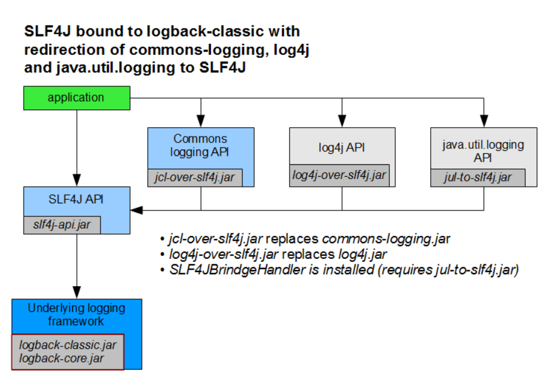
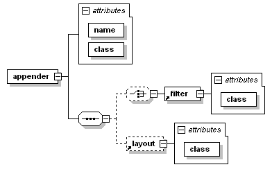

# 一. 异常


# 二. 断言


# █ 日志

# 1. 概述

### 1.1. 常用日志门面

Commons  Logging和Slf4j是日志门面(门面模式是软件工程中常用的一种软件设计模式，也被称为正面模式、外观模式。它为子系统中的一组接口提供一个统一的高层接口，使得子系统更容易使用)。Log4j和Logback则是具体的日志实现方案。可以简单的理解为接口与接口的实现，调用者只需要关注接口而无需关注具体的实现，做到解耦。

- **Commons Logging** 

  Apache基金会所属的项目，是一套Java日志接口，之前叫Jakarta Commons Logging，后更名为Commons Logging。

- **Slf4j** 

  类似于Commons Logging，是一套简易Java日志门面，本身并无日志的实现。（Simple Logging Facade for Java，缩写Slf4j）。

### 1.2. 常用日志实现

**Jul** (Java Util Logging),自Java1.4以来的官方日志实现。

**Log4j** Apache Log4j是一个基于Java的日志记录工具。它是由Ceki Gülcü首创的，现在则是Apache软件基金会的一个项目。 Log4j是几种Java日志框架之一。

**Log4j 2** Apache Log4j 2是apache开发的一款Log4j的升级产品。

**Logback** 一套日志组件的实现(Slf4j阵营)。

### 1.3. 常用组合

比较常用的组合使用方式是Slf4j与Logback组合使用，Commons Logging与Log4j组合使用。

slf4j + logback

commons logging + log4j

## 2. Slf4j


可能项目中用到的某些组件, 依赖于其他的日志框架, 为了统一管理日志, slf4j 提供了不同的桥接模式, 允许将不同日志框架的日志转发到 slf4j, 由 slf4j 的实现类来统一完成日志记录


### jcl -> slf4j



### jul -> slf4j


### log4j -> slf4j


## 3. commons-logging

# 2. jul 日志

### 1.1. 记录器

记录日志信息的工具类, 可以通过 Logger 类的静态方法获取需要的日志记录器. 日志记录器相当于是日志的中转机构, 会将日志信息发送到对应的处理器进行处理. 

- 全局记录器

  > Logger.getGlobal()

  获取一个全局日志记录器

- 自定义记录器

  > Logger.getLogger( 记录器名 )

  ```java
  // 获取一个名为 com.loyofo.log 的日志记录器
  private static final Logger myLogger = Logger.getLogger("com.loyofo.log");
  ```

与包名类似, 日志记录器名具有层级结构, 且在未显式设置的情况下, 子记录器会继承父记录器中的一些设置, 如子记录器会继承父记录器的日志级别.

### 1.2. 处理器

每个日志记录器, 都可以配置多个不同的日志处理器, 可以将日志输出到指定位置, 如 ConsoleHandler 能将日志输出到控制台, FileHandler 能将日志保存到文件. 

默认情况下, 日志记录器不仅将日志发送给自己的所有处理器, 还会发送到父级记录器的处理器, 而最终的记录器(命名为""), 拥有一个 ConsoleHandler, 它将日志信息输出到 System.err 流中.

我们可以为日志记录器添加一个或多个自己的处理器, 以便我们对日志进行更多个性化的处理. 

```java
// 添加一个能处理低级日志的控制台处理器, 将所有级别的日志输出到控制台
Handler handler = new ConsoleHandler();
handler.setLevel(Level.FINEST);
logger.addHandler(handler);

// 添加一个文件日志处理器, 可以指定文件名, 默认以 xml 的形式记录日志
FileHandler fileHandler = new FileHandler("logDemo.txt", true);
logger.addHandler(fileHandler);
```

添加新的处理器后, 日志记录器就能处理 FINEST 级别的日志信息了. 但是, 由于日志记录器默认会将日志继续发送给父级记录器的处理器, 而顶级记录器的处理器, 会将所有等于或高于 INFO 级别的记录发送到控制台, 这就导致日志信息会同时被两个处理器处理, 即相同的日志在控制台中被记录了两次. 为了避免重复记录, 我们可以为当前的日志记录器禁用父级处理器

```java
// 我们已有能处理所有级别日志的处理器, 而默认的父级处理器会处理 INFO 以上级别的日志,
// 若不停用父级处理器, 则 info 以上级别的信息会出现两次
logger.setUseParentHandlers(false);
```

如果觉得 jdk 中提供的处理器不能满足需要, 可以通过扩展 Handler 类或 StreamHandler 类自定义处理器.

### 1.3. 日志级别

日志有七个级别, 默认只开启前面三个级别. 如果需要记录更低级别的日志, 需要同时修改记录器和处理器的级别. 通过调用记录器不同方法, 记录不同级别的日志.

- 严重 **SEVERE**
- 警告 **WARNING** 
- 信息 **INFO**
- 配置 **CONFIG**
- 详细 **FINE**
- 较详细 **FINER**
- 非常详细 **FINEST**

修改记录器级别

```java
// 设置记录器级别为 CONFIG-配置
logger.setLevel(Level.CONFIG);
```

修改处理器级别

```java
// 设置处理器级别为 FINEST-非常详细
handler.setLevel(Level.FINEST);
```

具体示例

```java
public static void main(String[] args) throws IOException {
    // 获取一个全局日志记录器, 设置级别为 FINEST-非常详细
    Logger logger = Logger.getGlobal();
    logger.setLevel(Level.FINEST);

    // 添加一个能处理低级日志的处理器, 关闭默认处理器
    Handler handler = new ConsoleHandler();
    handler.setLevel(Level.FINEST);
    logger.addHandler(handler);
    logger.setUseParentHandlers(false);

    // 默认能显示的日志记录
    logger.severe("这是全局日志 severe-严重");
    logger.warning("这是全局日志 warning-警告");
    logger.info("这是全局日志 info-信息");

    // 默认不显示的日志记录
    logger.config("这是全局日志 config-配置");
    logger.fine("这是全局日志 fine-详细");
    logger.finer("这是全局日志 finer-较详细");
    logger.finest("这是全局日志 finest-非常详细");
}
```

### 1.4. 流程跟踪方法

logger.logp(…)

logger.entering(…)

logger.exiting(…)

logger.throwing(…)

### 1.5. 过滤器

记录器和处理器都可以设置过滤器, 默认根据日志级别进行过滤

可以自定义需要的过滤器, 实现 Filter 接口并重写 isLogable 方法即可

### 1.6.  格式化器

# 2. logback

```java
<dependency>
    <groupId>ch.qos.logback</groupId>
    <artifactId>logback-classic</artifactId>
    <version>1.2.3</version>
</dependency>
```

## 2.1. 组件结构

#### 2.1.1. Logger

位于 classic 包, 根据名字组成继承树, 顶级的 logger 名字为 root

所有的 logger 够能根据名字重复获取

日志级别有5个, trace, debug, info, warn, error, 定义在 Level 类中, 该类不可被继承

如果需要更灵活的方式, 可以使用 Marker

可以为 logger 指定日志级别, 未指定级别的 logger, 其日志级别继承自最近的指定级别的上层 logger

root logger 默认级别为 debug

如果一条日志的级别, 高于或等于 logger 的日志级别, 那么这条日志是有效日志, 会被处理, 否则会被忽略


#### 2.1.2. Appender

位于 core 包

logback 允许将同一条日志发送到多个目的地, 这些目的地被称为 Appender, 可以是控制台, 文件, 远程 socket接口, 数据库等等

每个 logger 可以添加多个 appender, 通过 addAppender 方法实现

每条有效的日志请求, 都会被转发到该  logger 以及所有父级logger 的 appender .

允许禁用 appender 的继承 


#### 2.1.3 Layout

位于 core 包

## 2.2. 配置

logback 提供的配置方式有以下几种：

- 编程式配置
- xml 格式
- groovy 格式

logback 在启动时，根据以下步骤寻找配置文件：

1. 在 classpath 中寻找 logback-test.xml文件
2. 如果找不到 logback-test.xml，则在 classpath 中寻找 logback.groovy 文件
3. 如果找不到 logback.groovy，则在 classpath  中寻找 logback.xml文件
4. 如果上述的文件都找不到，则 logback 会使用 JDK 的 SPI 机制查找 META-INF/services/ch.qos.logback.classic.spi.Configurator 中的 logback 配置实现类，这个实现类必须实现 `Configuration` 接口，使用它的实现来进行配置, 即编程式配置?
5. 如果上述操作都不成功，logback 就会使用它自带的 `BasicConfigurator` 来配置，并将日志输出到 console

如果使用配置文件的形式, xml 或者 groovy, 默认情况下需要将文件命名为 logback.xml, 并放置在 classpath 根目录下, 不能放在下级目录. 

> 

最简单的办法就是让 logback 自动配置, 会进行最基础的默认配置, 提供一个控制台处理器, 且日志级别为 DEBUG

### 2.2.1. 编程式配置

略

### 2.2.2. xml 配置

logback 会自动从 classpath 根目录下查找 logback.xml 配置文件对logback 进行初始化

如果在 xml 解析过程中出现问题, logback 会自动输出警告和错误信息到控制台. 

为了避免信息重复输出, 如果 logback 配置了状态监听器, status listener, 警告信息的自动输出将被关闭, 由状态监听器处理.

在没有错误信息的情况下, 如需要获取 logback 状态信息, 可以用 StatusPrinter.print(loggerContext)方法输出

```java
// 获取 logback 的内部状态信息
LoggerContext lc = (LoggerContext) LoggerFactory.getILoggerFactory();
StatusPrinter.print(lc);
```

除了通过 StatusPrinter 在程序代码中输出日志信息, 还可以在配置文件中要求输出状态信息. 只需要在 configuration 元素中将 debug 属性设为 true

```xml
<!-- 开启 logback 调试模式, 输出状态信息 -->
<configuration debug="true">
```

注意这里的 debug 属性, 与日志的级别无关. 

如果xml 配置文件有问题, logback 无法解析, 则 debug 属性也无法生效. 这种情况下, 配置文件中的问题可能不会输出到日志中, 这种情况下想要定位问题是比较困难的. 为此, 可以在启动参数中通过 logback.statusListenerClass 属性指定状态监听器, 强制要求输出状态信息. 

```sh
java -Dlogback.statusListenerClass=ch.qos.logback.core.status.OnConsoleStatusListener ...
```

在 configuration 元素上设置 debug="true", 与手动安装状态监听器 `OnConsoleStatusListener` 是完全等价的

```xml
<configuration>
  <statusListener class="ch.qos.logback.core.status.OnConsoleStatusListener" />  
</configuration>
```

如果需要指定配置文件的路径, 需要在jvm的启动参数中通过 **logback.configurationFile** 来指定. 所指定的文件名必须以 .xml 或者 .groovy 作为文件后缀，否则 logback 会忽略这些文件。

```sh
# 通过启动参数指定配置文件的路径
java -Dlogback.configurationFile=/path/to/config.xml chapters.configuration.MyApp1
```

如果有需要, logback 可以持续扫描配置文件, 并在修改后重新初始化, 为此, 可以在 configuration 元素中设置 scan 属性

```xml
<!-- 开启 logback 自动刷新, 监控配置文件并自动刷新 -->
<configuration scan="true">
```

logback 默认每分钟检查一次, 如果需要自定义扫描时间, 通过 scanPeriod 属性设置, 单位可以为 milliseconds, seconds, minutes 或 hours, 若不指定单位, 默认单位为milliseconds

```xml
<!-- 开启 logback 自动刷新, 并设置刷新时间为30秒 -->
<configuration scan="true" scanPeriod="30 seconds" > 
```

当设置了 scan 属性, 等价于安装了 `ReconfigureOnChangeTask`, 它会在一个独立的线程中运行, 扫描所有 logback 相关文件的变化.

由于xml 文件的修改容易出错, 如果扫描发现修改后的配置文件引入了错误, 则 logback 会忽略此次修改, 按最近一次准确无误的配置文件对 logback 进行配置. 

打包信息默认被禁用, 如果开启, logback 可以在输出异常的栈轨迹时同时输出该行代码所在的包和行数, 这有助于定位异常以及发现版本冲突等问题, 但是这需要耗费大量的资源, 默认关闭, 可以通过  packagingData 属性开启

```xml
<!-- 开启打包信息 -->
<configuration packagingData="true">
```

也可以在程序中设置

```java
LoggerContext lc = (LoggerContext) LoggerFactory.getILoggerFactory();
lc.setPackagingDataEnabled(true);
```

通过 `LoggerContext` 可以获取到 `StatusManager` 对象, 该对象存储了 logback 的内部状态信息. 为了保证内存占用在一个合理范围内, 默认只保存头尾各150条信息

可以通过 `ViewStatusMessagesServlet` 访问状态信息, 需要添加 servlet 到 web 应用中

```xml
<servlet>
	<servlet-name>ViewStatusMessages</servlet-name>
    <servlet-class>ch.qos.logback.classic.ViewStatusMessagesServlet</servlet-class>
</servlet>

<servlet-mapping>
    <servlet-name>ViewStatusMessages</servlet-name>
    <url-pattern>/lbClassicStatus</url-pattern>
</servlet-mapping>
```

还可以添加一个`StatusListener` 到 `StatusManager` , 以便及时响应状态变化. 

logback 附带一个状态 `StatusListener` 的实现  `OnConsoleStatusListener`, 它会将所有状态信息输出到控制台

可以通过 java 编码方式添加监听器

```java
LoggerContext lc = (LoggerContext) LoggerFactory.getILoggerFactory(); 
StatusManager statusManager = lc.getStatusManager();
OnConsoleStatusListener onConsoleListener = new OnConsoleStatusListener();
statusManager.add(onConsoleListener);
```

状态监听器只能监听它装载后发生的状态信息, 因此通常将其首先装配

可以在配置文件中配置状态监听器

```xml
<statusListener class="ch.qos.logback.core.status.OnConsoleStatusListener" />
```

可以在启动的系统参数中配置状态监听器

```sh
java -Dlogback.statusListenerClass=ch.qos.logback.core.status.OnConsoleStatusListener ...
```

配置状态监听器后, 就会禁用 logback 默认的自动输出错误信息功能, 因此, 可以通过配置 `NopStatusListener`  来关闭 logback 的所有状态信息

```java
java -Dlogback.statusListenerClass=ch.qos.logback.core.status.NopStatusListener ...
```


### xml结构

- configuration(debug, scan, scanPeriod, packagingData)
  - appender(name, class )
    - layout(class)
    - encoder
    - filter
  - logger(name. level, additivity)
    - appender-ref(ref)
  - root(level)
    - appender-ref(ref)

根节点是 configuration，可包含0个或多个 appender，0个或多个 logger，最多一个 root。

 大小写都行, 但开启标签和结束标签要一致, 建议使用小驼峰命名法

## 1. logger

### 1.1. 属性

- name

- level

  TRACE, DEBUG, INFO, WARN, ERROR, ALL, OFF, INHERITED, NULL

  其中 NULL = INHERITED 表示继承上级 logger , 并不是关闭日志

- additivity

  是否继承上级, true / false

### 1.2. appender-ref

允许任意多个, 将 appender 关联到 logger

```xml
<configuration debug="true">
    <logger name="mytest" level="info" additivity="false">
        <appender-ref ref="stdout"/>
    </logger>
    ...
</configuration>
```

## 2. root

用来配置 rootlogger, name 固定为 ROOT, 只支持 level 属性, 且level 不能使用 INHERITED 或 NULL

`<root>` 标签和 `<logger>` 标签的配置类似，只不过 `<root>` 标签只允许一个属性，那就是 level 属性，并且它的取值范围只能取 `TRACE, DEBUG, INFO, WARN, ERROR, ALL, OFF`。
 `<root>` 标签下允许有0个或者多个 `<appender-ref>`。

## 3. appender



### 3.1. 属性

- name

  通常是完整类名或包名

- class

  使用的具体 appender 类的完整类名

### 3.2. layout

0个或1个, 

必填属性 class, 指定具体类型, 若不填, 则默认为`PatternLayout` 

每个 appender 有其自己的 layout, 通常是不可被多个 appender 共享的

### 3.3. encoder

0个或多个

必填属性 class, 指定具体类型, 若不填, 则默认为 `PatternLayoutEncoder`

每个 appender 有其自己的 encoder, 通常是不可被多个 appender 共享的

### 3.4. filter

0个或多个

```xml
<root level="debug">
    <appender-ref ref="FILE" />
    <appender-ref ref="STDOUT" />
</root>
```


`<appender>` 标签有两个必须填的属性，分别是 name 和 class，class 用来指定具体的实现类。`<appender>` 标签下可以包含至多一个 `<layout>`，0个或多个 `<encoder>`，0个或多个 `<filter>`，除了这些标签外，`<appender>` 下可以包含一些类似于 JavaBean 的配置标签。

`<layout>` 包含了一个必须填写的属性 class，用来指定具体的实现类，不过，如果该实现类的类型是 `PatternLayout` 时，那么可以不用填写。`<layout>` 也和 `<appender>` 一样，可以包含类似于 JavaBean 的配置标签。
 `<encoder>` 标签包含一个必须填写的属性 class，用来指定具体的实现类，如果该类的类型是 `PatternLayoutEncoder` ，那么 class 属性可以不填。
 如果想要往一个 logger 上绑定 appender，则使用以下方式：

### 3.5. 累积

默认情况下, appender 是可累积的, 如果一个 logger 和他的祖先都关联的同样的 appender , 那么日志信息将会被重复记录

如果默认的appender 累积策略不符合需求, 可以将 logger 的 additivity 设为 false 来关闭向上累积

## 4. logger context

所有的logger 都关联到一个 logger Context 中, 默认名为 default

可以通过 contextName 元素进行修改, 以便在都多个应用输出到同一目的地时区分来源

```xml
<configuration>
  <contextName>myAppName</contextName>
</configuration>
```

在输出时, 可以在格式字符串中带上 contextName

```xml
<appender name="STDOUT" class="ch.qos.logback.core.ConsoleAppender">
    <encoder>
        <pattern>%d %contextName [%t] %level %logger{36} - %msg%n</pattern>
    </encoder>
</appender>

```

## 5. 变量

logback 允许定义变量, 在后续解析配置文件时进行替换, 且变量具有作用域的限制

调用时, 使用 `${xxx}` 获取变量的值

变量可以在配置文件本身内定义, 也可以在外部文件定义, 甚至通过特定的表达式进行计算

定义变量时, 可以通过 `<property>` 或 `<variable>` 标签定义, 两者等价, 可互换

### 5.1. 配置文件内部定义

```xml
<configuration>
    <property name="USER_HOME" value="/home/sebastien" />
    <appender name="FILE" class="ch.qos.logback.core.FileAppender">
        <file>${USER_HOME}/myApp.log</file>
        ...
    </appender>
    ...
</configuration>
```

### 5.2.  系统参数定义

```sh
java -DUSER_HOME="/home/sebastien" MyApp2
```

```xml
<appender name="FILE" class="ch.qos.logback.core.FileAppender">
    <file>${USER_HOME}/myApp.log</file>
</appender>
```

### 5.3. 外部文件定义

如果变量很多, 可以通过一个外部的 properties 文件进行定义

在 logback 配置文件中, 通过 property 元素的 file 属性引入 properties 文件

```properties
USER_HOME=/home/sebastien
```

```xml
<property file="src/main/java/chapters/configuration/variables1.properties" />
```

也可以通过 property 元素的 resource 属性从 classpath 中引入文件

```xml
<property resource="resource1.properties" />
```

### 5.4. 作用域

作用域有 local, context, system 三种, 默认是 local

虽然可以从系统的环境变量中获取变量, 但不能将变量添加到系统环境变量中

- local 只在配置文件内有效, 配置文件解析结束后就被清楚
- context 会被记录在 context 中, 所有 logging event 都可使用, 直到context 被清除
- system, 记录到jvm 的系统参数中, 直到 jvm 被关闭

查找顺序 `local > context > system > environment`

**scope** 属性, 可以用在 `property`, `define`, `insertFromJNDI` 三个元素中, 有效值为上述三个, 默认为 local

```xml
<property scope="context" name="nodeId" value="firstNode" />
```

### 5.5. 默认值

如果某个变量可能未定义, 则调用者需要为此变量设置一个默认值, 调用时, 通过 `:-` 表示默认值

```xml
<!-- 若变量 aName 未定义, 则取后面的默认值 defaultValue -->
<file>${aName:-defaultValue}/myApp.log</file>
```

变量嵌套

logback 支持变量嵌套, 各种地方各种嵌套

值嵌套

```properties
USER_HOME=/home/sebastien
fileName=myApp.log
# 在定义变量时, 值引用其他变量
destination=${USER_HOME}/${fileName}
```

```xml
<!-- 使用时与普通变量完全一样 -->
<file>${destination}</file>
```

变量名嵌套

`${${userid}.password}</tag>`

默认值嵌套, 设置默认值为另外一个变量

`${id:-${userid}}`

常量

logback 预先定义了一些常用的变量,

`HOSTNAME`, 自动获取当前主机名

`CONTEXT_NAME`, 与 contextName 元素定义的值一致

时间戳

可以通过 `timestamp` 元素定义时间戳, 当成变量使用

```xml
<timestamp key="bySecond" datePattern="yyyyMMdd'T'HHmmss"/>
<appender name="FILE" class="ch.qos.logback.core.FileAppender">
    <file>log-${bySecond}.txt</file>
    ...
</appender>
```

动态变量

可以通过 `define` 元素, 在程序运行时动态定义变量, 该元素有两个必要属性:

`name` 指定变量名, `class` 指定具体的 `PropertyDefiner` 的实现类, 其中`getPropertyValue()` 方法的返回值就是变量的值.

`define` 元素中也可以使用 `scope` 属性指定作用域

```xml
<define name="rootLevel" class="a.class.implementing.PropertyDefiner">
    <!-- 这几个属性是 class 类中定义的实例域, logback 会自动将值注入 -->
    <shape>round</shape>
    <color>brown</color>
    <size>24</size>
</define>
```

logback 提供了三个 `PropertyDefiner` 的实现类:

- `CanonicalHostNamePropertyDefiner` : 获取标准主机名
- `FileExistsPropertyDefiner`: 检查 `path` 元素指定的文件是否存在
- `ResourceExistsPropertyDefiner` : 检查 `resource` 元素指定的文件是否存在 

条件配置

为了满足不同条件, 如开发/生产环境需要采用不同内容的配置, 可以使用 `if` 元素根据条件进行配置. 此功能依赖于 `janino` 包, 需要另外引入

```xml
<dependency>
  <groupId>org.codehaus.janino</groupId>
  <artifactId>janino</artifactId>
  <version>3.0.6</version>
</dependency>
```

在配置文件中使用条件配置, 如下所示

其中的条件表达式, 是对 context 或 system 属性进行判断, 语法同 java 方法调用

`property("k")` 或 `p("k")` 获取变量 `k` 的值, String 类型. 如果变量未定义, 则返回空字符串.

`isDefined("k")` 检查 `k` 是否已定义, `isNull("k")` 检查 `k` 是否为null

```xml
<if condition="some conditional expression">
    <then>
        ...
    </then>
    <!-- else 元素可省略 -->
    <else>
        ...
    </else>    
</if>
```

```xml
<if condition='property("HOSTNAME").contains("torino")'>
    <then>
        <appender name="CON" class="ch.qos.logback.core.ConsoleAppender">
            <encoder>
                <pattern>%d %-5level %logger{35} - %msg %n</pattern>
            </encoder>
        </appender>
        <root>
            <appender-ref ref="CON" />
        </root>
    </then>
</if>
```

`if` 条件块可用在 `configuration` 元素内的任务地方, 并允许嵌套使用. 但由于 xml 天然的复杂性, 过多使用 `if` 条件块会导致配置文件的可读性下降, 慎用. 

从 JNDI 获取变量

某些情况下你可能需要从 jndi 获取变量, `<insertFromJNDI>` 可以从 JNDI 中获取变量, 并通过 `as` 属性创建一个变量, `scope` 属性可以指定作用域

```xml
<insertFromJNDI env-entry-name="java:comp/env/appName" as="appName" />
<contextName>${appName}</contextName>
```

文件导入

可以在配置文件内导入另一文件的配置内容. 在主文件中, 使用 `include` 元素指定要导入的文件, 而被导入的文件, 则要求其根节点为 `included`

```xml
<configuration>
    <!-- 主配置文件, 通过 include 元素导入文件 -->
    <include file="src/main/java/chapters/configuration/includedConfig.xml"/>
</configuration>
```

```xml
<!-- 被导入的文件, 根节点为 included -->
<included>
    <appender name="includedConsole" class="ch.qos.logback.core.ConsoleAppender">
        <encoder>
            <pattern>"%d - %m%n"</pattern>
        </encoder>
    </appender>
</included>
```

被导入的文件, 可以通过以下三种方式指定

 file 指定文件路径, 绝对路径或相对路径均可, 注意相对路径是相对于应用, 而不是相对于该配置文件

```xml
<include file="src/main/java/chapters/configuration/includedConfig.xml"/>
```

resource 指定资源路径

```xml
<include resource="includedConfig.xml"/>
```

URL 指定网络路径

```xml
<include url="http://some.host.com/includedConfig.xml"/>
```

默认情况下, logback 找不到指定文件后会输出状态信息以报告错误, 若该文件是可选的, 可以通过`optional="true"` 属性抑制该错误信息.

```xml
<include optional="true" ..../>
```

## 6. appender


logback 将记录日志的任务委托给一些称为 appender 的组件. 这些组件都实现了 `Appender` 接口.

### 6.1. ConsoleAppender

它在用户指定的 encoder 的帮助下, 将日志格式化, 然后输出到控制台, 更精确地说, 是输出到  `System.out` 或 `System.err`. 有以下三个子元素

- **encoder**

  编码器, 实际上是格式化工具, 指定输出的格式

- **target**

  输出到哪里, 可选值为  `System.out` 或 `System.err`, 默认   `System.out` 

- **withJansi**

  布尔类型, 是否需要 ANSI 颜色输出, 默认 false 

### 6.2. FileAppender

将日志记录到文件中, 有以下子元素

- **encoder**

  编码器, 格式化工具 

- **append**

  布尔类型, 是否追加到文件末尾, 若为否, 则每次启动时会清空文件. 默认 true

- **file**

  指定输出的日志文件路径, 注意分割符, 建议使用 `/`, 因为`\`可能会与后续字符组成转义字符

  若文件或目录不存在, fileAppender 会递归地创建目录

- **prudent**

  谨慎模式, 会排他地获取文件锁, 更安全, 但速度慢. 默认关闭

- **immediateFlush**

  立即写入. 为了避免应用异常关闭而日志丢失, 默认开启. 若需要更大的日志吞吐量, 可以将其关闭

有时候可能需要每次运行应用都创建一个全新的日志文件, 如一些短时间就能完成的批处理, 这可以借助 `timestamp` 变量实现

```xml
<!-- 创建一个时间戳变量 -->
<timestamp key="bySecond" datePattern="yyyyMMdd'T'HHmmss"/>
<appender name="FILE" class="ch.qos.logback.core.FileAppender">
    <!-- 使用时间戳指定日志文件名 -->
    <file>log-${bySecond}.txt</file>
    <encoder>
        <pattern>%logger{35} - %msg%n</pattern>
    </encoder>
</appender>
```


### 6.3. RollingFileAppender

滚动日志记录, 当日志文件满足某个指定条件后, 会自动切换到新的日志文件, 避免日志文件过于庞大

有两个子组件

-    `RollingPolicy` 滚动策略, 如何切换日志文件
-    `TriggeringPolicy` 触发策略, 何时切换日志文件

RollingFileAppender 使用时需要配合上述两个组件. 如果提供的 `RollingPolicy` 实现类同时也实现了`TriggeringPolicy`  接口, 那么只需要显式指定`RollingPolicy`, 触发策略可以省略. 

有以下子元素

- **encoder**

  编码器, 格式化工具 

- **append**

  布尔类型, 是否追加到文件末尾, 若为否, 则每次启动时会清空文件. 默认 true

- **file**

  指定输出的日志文件路径, 注意分割符, 建议使用 `/`, 因为`\`可能会与后续字符组成转义字符

  若文件或目录不存在, fileAppender 会递归地创建目录

- **prudent**

  谨慎模式, 会排他地获取文件锁, 更安全, 允许多个程序写入同一个文件, 但速度慢. 默认关闭. 不同的`RollingPolicy` 对此模式的支持度不同.

  `TimeBasedRollingPolicy`支持谨慎模式, 但有限制

  - 不能启用压缩, 即存档日志文件名不能以`.gz`或`.zip`结尾
  - `file` 属性必须为空 

- **immediateFlush**

  立即写入. 为了避免应用异常关闭而日志丢失, 默认开启. 若需要更大的日志吞吐量, 可以将其关闭

- **rollingPolicy**

  滚动策略, 如何切换日志文件

- **triggeringPolicy**

  触发策略, 何时切换日志文件

#### 6.3.1 rollingPolicy

`RollingPolicy` 接口规定了日志滚动策略的相关方法, `rollover()` 的实现负责主要的日志滚动切换操作. `getActiveFileName()` 获取当前使用的日志文件

##### 1) TimeBasedRollingPolicy

可能是最常用的滚动策略. 定义了基于时间的滚动策略. 它同时实现了 `RollingPolicy` 和 `TriggeringPolicy` 接口

- **fileNamePattern**

  必要参数, 定义日志文件名规则, 需要包含一个 `%d` 的格式占位符, 默认为 `yyyy-MM-dd`, 并且会根据这个占位符的格式, 推断需要日志切换的频率.  

  注意到 `FileAppender` 的 `file` 属性也能指定文件路径, 如果指定了, 则可以将当前使用的日志(由file属性确定)和存档日志(由fileNamePattern确定)分开. 如果省略 file 属性, 则当前日志会根据 fileNamePattern 推断出来.

  日期时间占位符的格式为 `%d{pattern}`, 所有的斜杠`/`和反斜杠`\`都会作为目录分割符

  如果有多个日期时间占位符, 则只有一个是主格式能用来推断滚动周期, 其他的占位符都需要标记为辅助格式, 

  ```sh
  /var/log/%d{yyyy/MM, aux}/myapplication.%d{yyyy-MM-dd}.log
  # 如上所示, %d{yyyy/MM, aux} 通过 aux 标记表示他是一个辅助格式
  # %d{yyyy-MM-dd} 则是主要格式, 推断出应该每天一个日志文件
  ```

  如果格式占位符中包含时间, 则默认采用当前主机所在时区, 如果需要指定时区, 可以在占位符后致命

  ```sh
  # 指定时区
  aFolder/test.%d{yyyy-MM-dd-HH, UTC}.log
  ```

  如果指定的文件名后缀为 `.gz` 或 `.zip`, 会自动将存档日志文件压缩

  日志文件的滚动, 是由日志事件触发的, 而不是定时触发. 日志事件发生时, 若判断为需要切换日志文件, 才会触发日志滚动. 若一直没有日志事件, 则不会修改任何日志文件

- **maxHistory**

  可选参数, 需要存档的日志文件数量

- **totalSizeCap**

  可选参数, 指定所有日志文件总的空间大小, 优先级低于 maxHistory 属性

- **cleanHistoryOnStart**

  可选参数, 启动时是否删除旧日志, 默认 false

```xml
<configuration>
    <appender name="FILE" class="ch.qos.logback.core.rolling.RollingFileAppender">
        <file>logFile.log</file>
        <rollingPolicy class="ch.qos.logback.core.rolling.TimeBasedRollingPolicy">
            <!-- 每天一个日志文件 -->
            <fileNamePattern>logFile.%d{yyyy-MM-dd}.log</fileNamePattern>
            <!-- 保留30天的日志, 总大小3GB -->
            <maxHistory>30</maxHistory>
            <totalSizeCap>3GB</totalSizeCap>
        </rollingPolicy>
        <!-- TimeBasedRollingPolicy 也实现了 triggeringPolicy, 可以省略  -->
        <encoder>
            <pattern>%-4relative [%thread] %-5level %logger{35} - %msg%n</pattern>
        </encoder>
    </appender> 
    <root level="DEBUG">
        <appender-ref ref="FILE" />
    </root>
</configuration>
```

第二个例子, 启用了 prudent 模式

```xml
<configuration>
    <appender name="FILE" class="ch.qos.logback.core.rolling.RollingFileAppender">
        <!-- 启用 prudent 模式, 不能指定 file 元素 -->
        <prudent>true</prudent>
        <rollingPolicy class="ch.qos.logback.core.rolling.TimeBasedRollingPolicy">
            <fileNamePattern>logFile.%d{yyyy-MM-dd}.log</fileNamePattern>
            <maxHistory>30</maxHistory> 
            <totalSizeCap>3GB</totalSizeCap>
        </rollingPolicy>
        <encoder>
            <pattern>%-4relative [%thread] %-5level %logger{35} - %msg%n</pattern>
        </encoder>
    </appender> 
    <root level="DEBUG">
        <appender-ref ref="FILE" />
    </root>
</configuration>
```

##### 2) SizeAndTimeBasedRollingPolicy

如果需要按日期归档日志, 但又要限制单个日志文件的大小, 可以采用此策略, 通过 `maxFileSize` 属性设置单个文件大小.

与 `TimeBasedRollingPolicy`类似, 需要指定一个 `fileNamePattern`, 但区别在于此策略必须包含流水号占位符 `%i`, 流水号从0开始, 递增

```xml

<rollingPolicy class="ch.qos.logback.core.rolling.SizeAndTimeBasedRollingPolicy">
    <!-- %d 和 %i 两个占位符都是必须的 -->
    <fileNamePattern>mylog-%d{yyyy-MM-dd}.%i.txt</fileNamePattern>
    <!-- 限制每个文件不超过100MB -->
    <maxFileSize>100MB</maxFileSize>    
    <maxHistory>60</maxHistory>
    <totalSizeCap>20GB</totalSizeCap>
</rollingPolicy>

```

##### 3) FixedWindowRollingPolicy

固定滚动策略, 在符合条件时, 将日志文件归档. 要求归档文件名必须包含流水号占位符`%i`

归档时会将所有日志文件重命名, 流水号越大, 表示日志文件越旧, 最小号的日志文件为最新的日志文件. 如果用户指定的总日志文件数量(maxIndex-minIndex)过大, 会造成大量的日志文件需要重命名, 影响性能. 因此, 若用户设置了过大的数值, 会自动将窗口数减少到20

- **minIndex**

  流水号最小值

- **maxIndex**

  流水号最大值

- **fileNamePattern**

  归档日志文件名, 可以根据后缀决定是否开启压缩功能

```xml
<configuration>
    <appender name="FILE" class="ch.qos.logback.core.rolling.RollingFileAppender">
        <file>test.log</file>
        <rollingPolicy class="ch.qos.logback.core.rolling.FixedWindowRollingPolicy">
            <!-- 设为日志归档文件名, 序号从1到3 -->
            <fileNamePattern>tests.%i.log.zip</fileNamePattern>
            <minIndex>1</minIndex>
            <maxIndex>3</maxIndex>
        </rollingPolicy>
        <!-- FixedWindowRollingPolicy 没有实现触发策略, 需要单独指定 -->
        <triggeringPolicy class="ch.qos.logback.core.rolling.SizeBasedTriggeringPolicy">
            <maxFileSize>5MB</maxFileSize>
        </triggeringPolicy>
        <encoder>
            <pattern>%-4relative [%thread] %-5level %logger{35} - %msg%n</pattern>
        </encoder>
    </appender>
    <root level="DEBUG">
        <appender-ref ref="FILE" />
    </root>
</configuration>
```

#### 6.3.2 triggeringPolicy

##### 1) SizeBasedTriggeringPolicy

检测当前日志文件的大小, 当达到指定大小时, 触发归档操作

只有一个 `maxFileSize` 属性, 指定日志文件的大小, 默认 10MB. 支持 B, KB, MB, GB 等单位, 若只写数值不写单位, 则采用 B 为单位. 

```xml
<configuration>
    <appender name="FILE" class="ch.qos.logback.core.rolling.RollingFileAppender">
        <file>test.log</file>
        <rollingPolicy class="ch.qos.logback.core.rolling.FixedWindowRollingPolicy">
            <fileNamePattern>test.%i.log.zip</fileNamePattern>
            <minIndex>1</minIndex>
            <maxIndex>3</maxIndex>
        </rollingPolicy>
        <triggeringPolicy class="ch.qos.logback.core.rolling.SizeBasedTriggeringPolicy">
            <maxFileSize>5MB</maxFileSize>
        </triggeringPolicy>
        <encoder>
            <pattern>%-4relative [%thread] %-5level %logger{35} - %msg%n</pattern>
        </encoder>
    </appender>
    <root level="DEBUG">
        <appender-ref ref="FILE" />
    </root>
</configuration>
```

## 7. Encoder

`Encoder`, 编码器, 将日志事件编码成 `byte` 数组, 并通过 `OutputStream` 输出. 在旧版本的 logback 中, `appender` 通过 `Layout` 将日志事件格式化成 String, 并通过 `java.io.Writer` 输出. 旧版本 的用户通常需要在 `FileAppender` 中添加 `PatternLayout`, 而在现在的新版本 logback, `FileAppender` 使用`encoder`代替`layout`

与 layout 相比, encoder 显得更加灵活

- layout 只能输出 String, 但无法控制控制何时写出, 也就无法将日志事件整合批处理
- encoder 能完全控制字节格式, 也能控制何时/是否写出

到目前为止, `PatternLayoutEncoder` 是唯一真正有用的 encoder, 它实际上就是`PatternLayout`的包装类. 

### 7.1. LayoutWrappingEncoder

由于旧版本中, appender 依赖于 layout 完成格式化工作, 而新版中采用了 encoder. 为了兼容旧应用中的 layout, 提供了这个 layout -> encoder 的包装类. 它会将相关的工作, 委托给已经存在的 layout 来完成. 

```xml
<appender name="STDOUT" class="ch.qos.logback.core.ConsoleAppender">
    <!-- 将自定义的 layout 添加到 LayoutWrappingEncoder -->
    <encoder class="ch.qos.logback.core.encoder.LayoutWrappingEncoder">
        <layout class="chapters.layouts.MySampleLayout" />
    </encoder>
</appender>
```

### 7.2. PatternLayoutEncoder

由于 PatternLayout 是最通用的, logback 基于它扩展了 LayoutWrappingEncoder 得到了 PatternLayoutEncoder.

- outputPatternAsHeader

  为了帮助开发人员解析日志文件, logback 允许将格式字符串输出到日志文件中作为参考. 默认 false, 关闭.

  ```xml
  <encoder>
      <pattern>%d %-5level [%thread] %logger{0}: %msg%n</pattern>
      <outputPatternAsHeader>true</outputPatternAsHeader>
  </encoder>
  ```

## 8. Layout

layout 是个泛型接口, 允许处理任意类型的具体事例, 将其格式化成需要的格式. Logback-classic 只处理了 `ch.qos.logback.classic.spi.ILoggingEvent`, 如果需要处理其他类型, 用户可以自行提供实现类.

自定义layout 时, 可以继承 `LayoutBase` , 这样就只需关注具体格式化的 `doLayout` 方法. 自定义layout 后需要包装成 encoder 才能给 appender 使用. 

### 8.1. PatternLayout

logback 提供了一个灵活的格式化 layout, 能根据指定的格式字符串, 将日志事件转换成 String

与 c 语言的 `printf()` 方法类似, 模板字符串由字面文本和格式控制表达式组成, 其中格式控制表达式由 `%` 开头, 跟着一些格式修饰字符, 以及用`{}` 括起来的可选参数, 如日期格式字符串 `%d{yyyy-MM-dd}`

可以用括号对模板字符串进行分组, 因此括号`()` 具有特殊含义, 如果需要作为字面文本输出, 需要进行转义

[格式修饰字符详见官方文档](https://logback.qos.ch/manual/layouts.html#conversionWord)

一般情况下, 我们要求格式修饰字符与字面文本之间有分隔符, 以便正确识别修饰字符. 但如果需要在修饰符后面直接跟字面文本, 可以在格式字符后面加上空的`{}`

```sh
# 无法识别 %nHello
%date%nHello
# 可以正确识别 %n 与字面文本 Hello
%date%n{}Hello
```

格式修饰

为了对齐多条日志记录中的同一部分, 可以对格式进行修饰, 指定某一部分的宽度和对齐方式

格式修饰符放置在`%` 和具体的格式字符之间

- 最小宽度+右对齐

  `%`后面跟十进制整数, 如 `%20logger`

  若数据小于指定宽度, 则左边补空格, 直至等于指定宽度

  若数据大于指定宽度, 则按实际宽度输出, 不会截取

- 最小宽度+左对齐

  `-`后面跟着十进制整数, 如 `%-20logger`

  若数据小于指定宽度, 则右侧补空格, 直至等于指定宽度

  若数据大于指定宽度, 则按实际宽度输出, 不会截取

- 最大宽度+去头

  `.`后面跟着十进制整数, 如 `%.30logger`

  若数据大于指定宽度, 则截取后面的内容, 最前面的内容被丢弃

- 最大宽度+去尾

  `.-`后面跟着十进制整数, 如 `%.-30logger`

  若数据大于指定宽度, 则截取前面的内容, 最后面的内容被丢弃

如果想要只用一个字母表示日志级别, 可以按最大宽度+去尾的方式指定日志级别, 即 `%.-1level`

括号分组

小括号`()`可以将模板字符串进行分组, 可以对整组进行统一的修饰, 如指定整组的字符宽度, 或是指定颜色

```sh
# 指定分组宽度
%-30(%d{HH:mm:ss.SSS} [%thread])

# 指定颜色
%highlight(%-5level) %cyan(%logger{15})
```

## 9. Filter

Filter 接口规定了对日志事件进行筛选的方法

`decide()` 方法返回 `FilterReply` 中定义的三个枚举常量, 决定如何处理该条日志

- `DENY`, 拒绝, 立即丢弃该日志事件, 不作任何处理
- `NEUTRAL`, 中立, 交给下一个filter 继续判断, 若无其他filter, 则记录这条日志
- `ACCEPT`, 接受, 跳过剩下的 filter, 记录这条日志

使用 filter 时, 在 appender 元素中添加 filter 元素, 通过 class 属性指定具体的 filter 实现类

```xml
<appender name="STDOUT" class="ch.qos.logback.core.ConsoleAppender">
    <filter class="chapters.filters.SampleFilter" />
    <encoder>
        <pattern>
            %-4relative [%thread] %-5level %logger - %msg%n
        </pattern>
    </encoder>
</appender>
```

### LevelFilter

按日志级别是否匹配进行过滤, 根据匹配结果, 返回 `onMatch` 和`onMismatch` 指定的结果

```xml
<filter class="ch.qos.logback.classic.filter.LevelFilter">
    <level>INFO</level>
    <onMatch>ACCEPT</onMatch>
    <onMismatch>DENY</onMismatch>
</filter>

```

### ThresholdFilter

按照指定的日志级别阈值进行过滤, 高于或等于指定级别的日志, 返回 `NEUTRAL`, 低于指定级别的返回 `DENY`

```XML
<filter class="ch.qos.logback.classic.filter.ThresholdFilter">
    <level>INFO</level>
</filter>
```