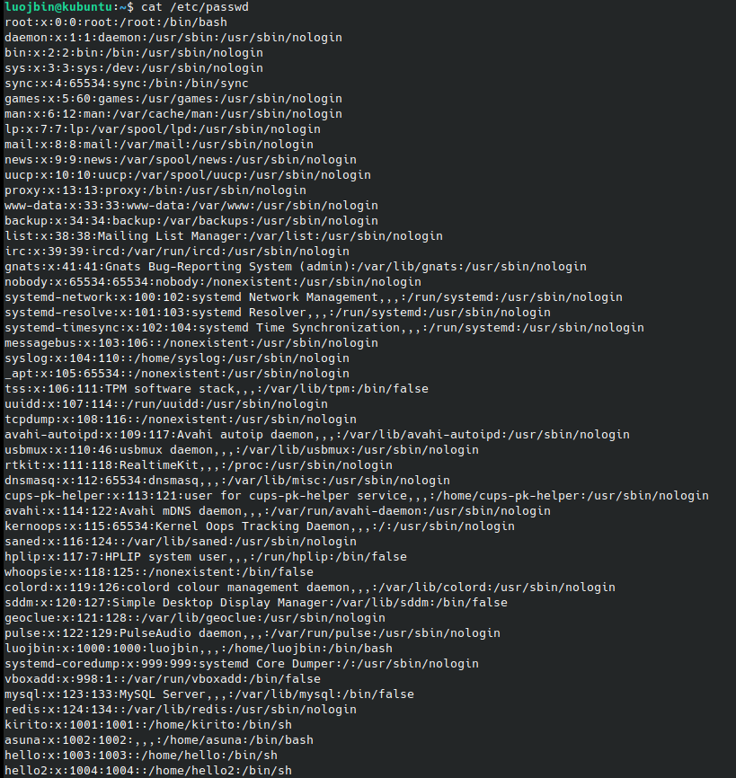
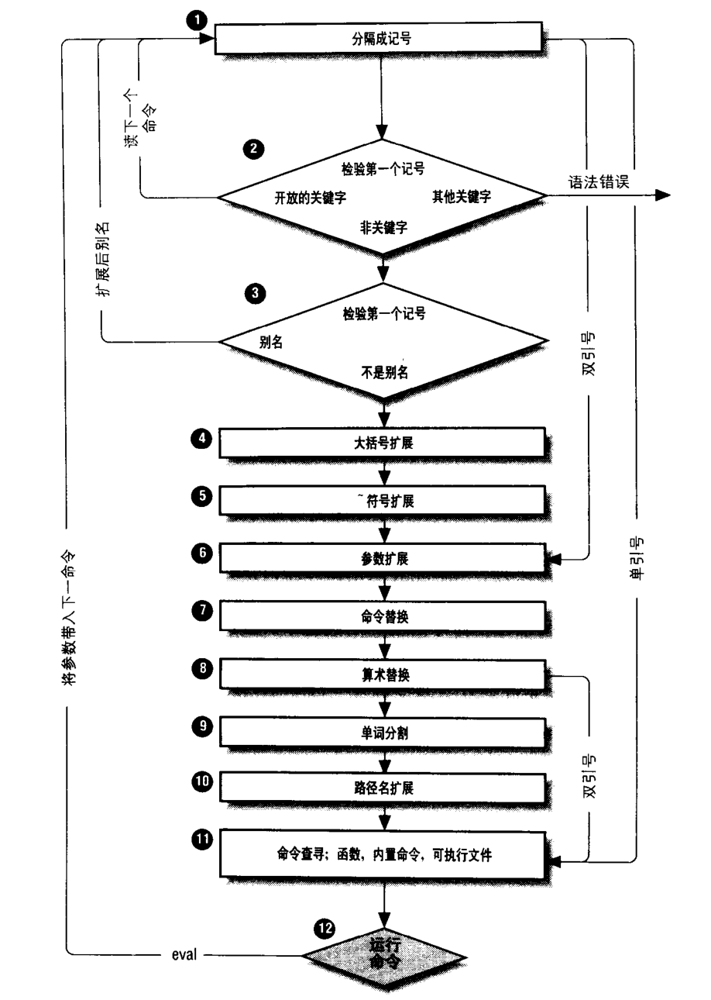

# 一. 目录结构

## 1. FHS 规范

[规范文档](https://www.pathname.com/fhs/)

`FHS`是 Linux 的文件系统目录规范, 规范了每个特定的目录下应该放置什么内容的数据

根据文件系统的使用是否频繁, 以及是否允许用户自行改动, 分成了以下几类

- 可分享的: 可以分享给其他系统挂载使用的目录, 包括可执行文件/用户数据等
- 不可分享的: 自己机器上的设备文件, 或者程序运行相关的 socket 和 lock 等文件 
- 不变的: 不会经常变动的文件, 如函数库, 说明文档, 配置文件等
- 可变的:  用户数据, 如邮件/新闻订阅等

|                      | 可分享的                   | 不可分享的          |
| -------------------- | -------------------------- | ------------------- |
| **不变的(static)**   | /usr, /opt                 | /etc, /boot         |
| **可变的(variable)** | /var/mail, /var/spool/news | /var/run, /var/lock |

`FHS` 对目录树架构的定义最深到了三层

### 1.1. 根目录

| 目录     | 说明                                                         | 建议分区 |
| -------- | ------------------------------------------------------------ | -------- |
| `/`      | 根目录, 系统最重要的目录, 所在分区应尽可能小, 仅包含系统内核以及底层的函数库, 其他应用软件和用户数据应该放在其他分区 | 1        |
| `/boot`  | 开机相关的文件, 包括 linux 内核, 启动配置, 引导器等          | 1        |
| `/bin`   | 可执行文件的目录, 主要是在单用户维护模式下仍可用的基础软件, 所有用户可用 | 1        |
| `/sbin`  | 可执行文件的目录, 主要是root 用来修改系统配置的应用, 一般用户无权执行 | 1        |
| `/lib`   | 开机会用到的函数库, 以及`/bin`和`/sbin` 中命令会用到的函数库 | 1        |
| `/etc`   | 系统主要配置文件, 通常是一般用户可读, 只有 root 能修改       | 1        |
| `/dev`   | linux 中, 所有设备和接口设备都以文件形式放置在这里           | 1        |
| `/media` | 可移除的设备, 如光盘, 软盘等外部设备                         | 1        |
| `/mnt`   | 临时挂在设备的目录, 与`/media` 类似                          | 1        |
| `/root`  | root 用户的家目录, 以便单用户维护模式仅挂在根目录分区时, root 用户仍有家目录 | 1        |
| `/srv`   | 某些网络服务的数据目录, 如 www, ftp 等                       | 1        |
| `/usr`   | unix software resource, 软件安装目录, 某些发行版中, bin, sbin, lib 等目录实际也在这里 | 1        |
| `/opt`   | 第三方软件目录, 即非发行版自带的软件, 与`/usr/local` 类似    | 2        |
| `/home`  | 用户数据, 各个用户的家目录都放在这里, 建议单独一个分区, 以便保留用户数据 | 3        |
| `/tmp`   | 临时目录, 用户或程序放置临时文件的地方, FHS 建议开机时清空该目录 | 4        |

 底下是几个在 Linux 当中也是非常重要的目录, 但 `FHS` 未作要求

| 目录          | 说明                                                        |
| ------------- | ----------------------------------------------------------- |
| `/lost+found` | 当文件系统发生错误时， 将一些丢失的文件片段放置到这个目录下 |
| `/proc`       | 虚拟文件系统, 实际数据存放在内存中, 主要是系统运行数据      |
| `/sys`        | 虚拟文件系统, 实际数据存放在内存中, 主要是内核相关数据      |

### 1.2. /usr 目录

`Unix Software Resource`, 是软件的安装目录, 为了统一包含二进制文件的各种目录, 现代 Linux 系统上大多数程序的二进制文件保存在 `/usr` 目录中, 根目录下的 `/bin`、`/sbin` 和 `/lib` 均通过软链接指向了`/usr` 的对应目录, 因此 `/usr` 应与根目录处在同一分区, 以便单用户维护模式时相关应用能正常使用. 

`/usr` 下的主要目录如下

| 目录           | 说明                                            |
| -------------- | ----------------------------------------------- |
| `/usr/bin`     | 绝大部分的用户可使用命令都放在这里              |
| `/usr/include` | c/c++等程序的头文件(header)和包含文件(include)  |
| `/usr/lib`     | 各种应用需要的函数库                            |
| `/usr/local`   | 用户自行安装的软件                              |
| `/usr/sbin`    | 非系统正常运行所需要的系统命令                  |
| `/usr/share`   | 放置共享文件的地方, 如帮助文档等                |
| `/usr/src`     | 放置源码的地方, 如`/usr/src/linux` 放了内核源码 |

### 1.3. /var 目录


## 2. 目录操作

### 文件的时间

- `mtime` modify time, 文件编辑时间, 当文件的内容被修改时, 会更新这个时间
- `ctime` change time, 文件修改时间, 当文件的状态(如权限和属性)被修改时, 这个时间会被更新
- `atime` access time, 文件的最后访问时间, 如 `cat` 获取文件内容

```shell
#!/bin/bash

echo '创建文件, 并显示 mtime...'
touch newFile
ls -il --full-time newFile
sleep 5

echo '编辑权限, 更新 ctime....'
chmod 666 newFile
sleep 5

echo '读取文件, 更新 atime...'
cat newFile
sleep 5

echo '显示不同的时间'
echo '默认, mtime...'
ls -il --full-time newFile

echo '-c ctime...'
ls -ilc --full-time newFile

echo '-u atime...'
ls -ilu --full-time newFile           
```

`cd`

`pwd`

`ls`

`mkdir`

`rmdir`

## 3. 文件操作

`cp`

`mv`

`rm`

## 4. 查找

`which`

`whereis`

`locate`

`find`

`find path -option optionVal`

`find . -name *.jsp`


## 5. 压缩/解压

### 5.1. compress

### 5.2. gzip

### 5.3. bzip2

### 5.4. tar

### 5.5. zip

## 6. 文件上传下载

### 6.1. 使用 ftp 工具

### 6.2. 使用 sz/rz 命令

`sz` 将远程服务器上的文件下载到本地计算机

1. 打开服务器上的目录
2. 输入 `sz [filename]`, 回车
3. 弹出对话框, 选择本地路径即可

`rz` 将本地计算机上的本地上传到远程服务器

1. 打开服务器上的目标目录
2. 输入 `rz` 回车
3. 在弹出对话框中选择要上传的文件

# 二. 用户及权限

# 二. 用户和群组

使用者登录系统时, 会取得一个用户账号, 但其实 linux 系统并不直接识别账号的名称, 而是通过`UID` 来识别用户.

使用者进入系统时, 至少会取得两个 ID, 即用户ID(UID) 和群组ID(GID)

每个文件, 都会通过记录 UID 和 GID, 来记录该文件属于哪个用户/群组, 并在查询文件信息的时候, 通过`/etc/passwd`获取所属用户名, 通过 `/etc/group` 获取群组名, 如果文件中记录的 UID 和 GID 找不到对应的用户/群组, 则会直接显示 UID/GID

## 1. 基本概念

### 用户信息

#### /etc/passwd

记录系统内所有账号的基本信息, 所有人可读

每一行是一个账号, 其中有一部分是系统账号

各列字段的含义如下

1. 用户名
2. 保留字段, 早期用来存放密码, 改用 `/etc/shadow` 存密码后废弃, 标记为 `x`
3. 用户 UID
   1. 0=系统管理员
   2. 1~999=系统账号, 不可登录, 通常关联了 `/sbin/nologin`
   3. 1000以上=可登录的用户账号
4. 用户主群组 GID, 与 `/etc/group` 相关
5. 用户信息说明栏, 与 `finger`, `chfn` 相关, 如联系方式
6. 家目录路径
7. 登录系统时取得的 shell



#### 用户功能

可以通过以下命令, 读取或修改 `/etc/passwd` 的内容

- `id`, 显示当前用户的用户和群组信息

  ```shell
  # id, 显示当前用户的用户和群组信息
  id
  > 用户id=1000(luojbin) 组id=1000(luojbin) 组=1000(luojbin),4(adm),24(cdrom),27(sudo)
  
  # 查看指定用户的信息
  id luffy
  > 用户id=1004(luffy) 组id=1004(luffy) 组=1004(luffy)
  ```

- `finger`, 查看基本信息, 主要是`/etc/passwd` 的内容

- `chfn`, 修改用户联系方式, 即`/etc/passwd` 中第五段

- `chsh`, 修改使用的 shell, 即 `/etc/passwd` 中第七段

### 用户密码

### 群组信息文件

1. 

#### /etc/gshadow

记录群组管理密码和管理员, 每一行是一个群组, 分成4段

1. 群组名称
2. 密码, `!` 表示无密码, 则没有群组管理员
3. 群组管理员的账号
4. 群组成员列表, 逗号分隔, 不会记录以该组为初始群组的用户

### 用户登录流程

1. 在 tty 输入账号密码
2. 系统在 `/etc/passwd` 中查找用户记录, 如果找到就获取用户 UID 和 GID, 以及 家目录和 shell 设定
3. 核对密码, 检查 `/etc/shadow`, 找到用户 UID 对应的密码
4. 获取指定的 shell

### 初始群组

`/etc/passwd` 中每行用户记录里有一个群组 GID 字段, 则该群组是用户的初始群组, 即主群组

### 有效群组

一个用户可以加入多个群组

`groups` 查询当前用户的所有群组, 其中第一个为有效群组, 当用户新建文件时, 取得 GID 就是这里第一个有效群组

`newgrp`, 将当前用户的有效群组切换为指定群组, 要求切换的这个群组是当前用户已有的群组, 

并且该操作会启动一个子进程 shell, 使用时要注意变量的传递, 可以`exit` 来退出子 shell, 并重置有效群组


```shell
# 设置一个变量, 记录当前的进程 id 和有效群组
bashId=$$'-luojbin'
echo $bashId
> 1362-luojbin

# 查看当前的群组
groups
> luojbin adm cdrom sudo dip plugdev lpadmin lxd sambashare
# 创建新文件, 新文件的所属群组为初始群组 luojbin
touch group-1362
ll group-1362 
> -rw-rw-r-- 1 luojbin luojbin 0 7月  23 20:39 group-1362

# 切换到新的群组, dip
newgrp dip
# 可以看到切换后 dip 排在最前面
groups
> dip adm cdrom sudo plugdev lpadmin lxd sambashare luojbin
# 尝试输出之前设置的变量, 返回空, 即未取到原进程的变量
echo $bashId
> 
# 查看当前进程id, 与原进程不同
echo $$
> 48971
# 创建新文件, 新文件的所属群组已变成 dip
touch group-48971
ll group-48971 
> -rw-rw-r-- 1 luojbin dip 0 7月  23 20:40 group-48971

# 退出子进程, 回到原始进程, 可以输出之前定义的变量
exit
> exit
echo $bashId 
> 1362-luojbin
```


## 3. 管理用户

### 新建用户 useradd

`useradd` 可以新建用户, 但新建的用户由于未设置密码, 处于不可登录的状态, 需要配合 `passwd` 设置密码后才可正常登录使用

- 默认设置文件, 
  - `/etc/login.defs`, 配置如 umask, 是否创建家目录, 密码有效期等
    - `umask`, 新建文件的默认权限
    -  `CREATE_HOME` , 是否默认创建家目录
  - `/etc/default/useradd`, 来自如家目录基准, 家目录模板, 默认shell 等
- 家目录模板, `/etc/skel`, 若需创建家目录, 会复制这个模板内的所有文件
- 常用参数
  - -g, 指定初始群组, 默认为与用户同名的群组
  - -G, 指定初始群组外的其他群组
  - -d, 指定目录为家目录
    - 若文件夹不存在, 会给出一个路径不存在的警告, 然后递归创建, 并以 skel 为模板复制文件
    - 若文件夹已存在, 不会从 skel 复制文件user'a
  - -M, 忽略 `CREATE_HOME` 设置, 强制不创建家目录
  - -m, 忽略 `CREATE_HOME` 设置, 指定需要创建家目录
  - -D, 查看 `/etc/default/useradd` 中的默认设置

也可以用 `adduser` , 用交互式的过程来来创建用户


### 设置密码 passwd

`useradd` 创建用户后, 默认没有密码, 账户处于不可登录, 需要通过 `passwd` 为用户创建密码

```shell
# 设置他人的密码, 需要root 权限, 不需验证旧密码, 没有限制规则
passwd 用户名

# 修改自己的密码, 直接使用 passwd, 不带参数, 需要先验证旧密码, 并对密码有限制规则
passwd
```

如果忘记密码, 需要重置密码时

- root 用户忘记密码: 
  - 进入单人维护模式, 自动以 root 权限取得 bash 后用 `passwd` 修改
  - liveCD 进入系统, 挂载根目录后删除 `/etc/shadow` 中 root 的密码, 然后重新以 root 免密码进入系统
- 普通用户忘记密码, 让 root 账号帮忙用 `passwd 用户名` 重置密码

#### /etc/shadow

记录系统内用户的密码信息, 只有 root 可读写

1. 用户名, 与 `/etc/passwd` 中的用户对应

2. 密文密码, 非用户账号通常记为 `!` 或 `*`, 以标记该字段无效

3. 最近改动密码的日期, 从 1970.1.1 起算天数

4. 密码不可变天数, 为0则随时可以改, 非0表示在一定期限内不可再改密码

5. 密码过期天数, 隔一段时间后要求用户修改密码, 默认 99999, 相当于不限制,

6. 密码过期前提醒天数, 在密码过期前, 给出提醒, 默认7天

7. 密码过期宽限天数, 到期一段时间内未修改密码, 也能正常登录系统, 登录后强制修改密码

   如果密码到期后的宽限天数内没有进入系统修改密码, 则该账号会失效, 无法登录

8. 账号失效日期, 到期了账号就失效, 无法使用

9. 保留字段


#### 密码规则

针对 `/etc/shadow` 中的密码规则, 可以通过 `passwd` 或 `chage` 进行设置

```shell
# passwd -S 查看指定用户的密码规则
passwd -S lobin
> lobin P 07/23/2021 0 99999 7 -1

# chage -l 查看指定用户的密码规则
chage -l lobin
> 最近一次密码修改时间                       ： 7月 23, 2021
> 密码过期时间                              ： 从不
> 密码失效时间                              ： 从不
> 帐户过期时间                              ： 从不
> 两次改变密码之间相距的最小天数          	  	：0
> 两次改变密码之间相距的最大天数          	  	：99999
> 在密码过期之前警告的天数        			  ：7

# 强制用户登录后修改密码
chage -d 0 lobin
chage -l lobin
> 最近一次密码修改时间                       ： 密码必须更改
> 密码过期时间                              ： 密码必须更改
> 密码失效时间                              ： 密码必须更改
> 帐户过期时间                              ： 从不
> 两次改变密码之间相距的最小天数          	  	：0
> 两次改变密码之间相距的最大天数          	  	：99999
> 在密码过期之前警告的天数        			  ：7
```

### 修改用户 usermod

如果用户配置错误, 可以手动修改 `/etc/passwd` 或 `/etc/shadow`, 也可以使用 `usermod`

```shell
# 修改用户名 -l
usermod -l robin lobin

# 修改家目录, 但不会自动创建, 也不会自动将原来的家目录改名
usermod -d '/home/robin' robin

# 修改初始群组
usermod -g robin robin

# 修改次要群组, 会取消原来的次要群组, 仅保留当前设置的
usermod -G luffy robin
groups robin
> robin : lobin luffy

# 追加次要群组, 在原有次要群组的基础上, 增加一个群组
usermod -aG nami robin
groups robin
> robin : lobin luffy nami
```

### 删除用户 userdel

`userdel` 会在系统内删除用户相关数据, 如同名群组

```shell
# 仅删除用户
userdel zs

# 删除用户及其家目录, 但其他地方的文件不会删除
userdel -r ls
```

### 停用/启用

`passwd`和 `usermod` 都可实现, 实际上都是在 `/etc/shadow` 的密码字段添加 `!`, 导致无法解密而登录失败

```shell
# 使用 usermod, -L锁定, -U解锁
usermod -L kirito 
usermod -U kirito 

# 使用 passwd, -l锁定, -u解锁
passwd -l kirito
passwd -u kirito
```


## 4. 管理群组

### 增删改查

#### /etc/group

记录系统内所有群组的基本信息, 每一行是一个群组, 各列字段的含义如下

1. 群组名
2. 保留字段, 原为群组密码, 后改用 `/etc/gshadow` 记录 
3. 群组 GID
   1. 0 root, 系统管理员
   2. 1-999, 系统群组
   3. 1000 以上, 用户群组
4. 群组成员列表, 逗号分隔, 不会记录以该组为初始群组的用户

```shell
# groupadd 新建群组, -r新建系统群组(GID<1000)
groupadd mygroup
groupadd -r sysgroup

# groupdel 删除群组, 要求该组未作为任何用户的初始群组
groupdel mygroup

# groupmod 修改群组, -n修改组名, -g修改GID
groupmod -n mygroup2 mygroup
groupmod -g 1088 mygroup2
```

### 群组管理员

默认情况下, 只有 root 有权修改 /etc/group, 也即只有 root 有权为群组增删成员. 

也可以先给群组设置管理密码, 然后指定一个 root 以外的用户作为群组管理员

`gpasswd`

root 对群组的维护

```shell
# 为群组设置密码, 不需额外参数
gpasswd op

# -A, 为群组设置管理员, 多个管理员用逗号隔开, 覆盖原有设置
gpasswd -A luffy,zoro op

# -M, 为群组设置成员, 多个成员逗号隔开, 覆盖原有设置
gpasswd -M nami,sanji op
```

群组管理员维护成员

```shell
# -a 添加成员, 以 luffy 用户操作
gpasswd -a sanji op  # luffy 有 op 群组管理权限, 操作成功
gpasswd -a sanji sao # luffy 没有 sao 群组管理权限, 操作失败

# -d 移除成员
gpasswd -d sanji op  # luffy 有 op 群组管理权限, 操作成功
gpasswd -d asuna sao # luffy 没有 sao 群组管理权限, 操作失败
```


- root 系统管理员为群组添加成员: `usermod`

# 三. 文件权限

## 2. 文件权限

文件权限的格式如下所示, 分成了4部分

> 文件类型+所属用户操作权限+所属用户组操作权限+其他人的操作权限


- 文件类型
  - `-` 普通文件
  - `d` 目录文件
  - `l` 软连接文件, 相当于一个快捷方式
- 操作权限, 以三个为一组
  - user-所属用户的操作权限
  - group-所属用户组的操作权限一组`rwx`
  - other-其他用户的操作权限

比如一个文件的权限是这样的:` -rwxr-xr--`, 则有

- `-`, 普通文件
- `rwx`, 所属用户的权限, 可读可写可执行
- `r-x`, 所属用户组成员的权限, 可读,可执行, 但不可编辑
- `r--`, 其他人的权限, 可读, 但不可编辑,不可执行

### 修改所属用户组

```shell
# 修改目录/文件的所属用户组
chgrp 文件名 新的用户组

# 递归修改目录及下级文件的用户组
chgrp -R 目录 新的用户组
```

### 修改所属用户

```shell
# 修改目录/文件的所属用户
chown 文件名 新的所属用户

# 递归修改目录及下级文件的所属用户
chown -R 目录 新的所属用户
```

`chown` 还可以按`用户名:群组名` 或`用户名.群组名`同时修改文件的所属用户组, 但由于 linux 允许用户名中包含 `.`, 部分用户可能会在用户名中使用, 从而导致系统误判, 因此更建议使用`用户名:群组名`

```shell
# 按 用户名:群组名 的格式同时指定新的用户和用户组
chown -R 目录 用户名:群组名

# 按 用户名.群组名 的格式同时指定, 不建议
chown -R 目录 用户名.群组名
```


### 修改文件权限

使用权限分值

将`rwx`权限看成三位二进制, 可以认为 `rwx` 对应不同的数值, 即

r=4, w=2, x=1, 将三项相加得到的和, 即是该身份的权限分值,

```shell
# 使用权限分值
chmod 755 文件名

# 使用权限分值, 递归地修改下级文件和目录
chmod -R 755 文件名
```

使用权限符号

前面提到文件权限按照所属用户, 所属群组, 其他人三种身份分成了三个部分, 则可以按以下规则来为不同身份设置权限


```shell
# 为所有人添加可执行权限
chmod +x 文件名
chmod a+x 文件名

# 去掉其他人的写入权限
chmod o-w 文件名

# 重新设置文件权限，不同身份的权限之间没有空格
chmod u=rwx,g=rx,0=r 文件名
```

使用权限分值修改时, 会覆盖原来的权限属性, 而使用权限符号, 则可以在原有权限配置的基础上进行调整, 更加灵活

## 3. umask

### umask 与默认权限

前面学习用户和群组的时候， 我们知道了新建一个文件的时候，该文件的所属用户是当前用户，所属群组是当前用户的有效群组， 但默认权限应该怎么确定呢？

在建立文件的时候, 普通文件和目录文件的默认完整权限是不一样的

- 普通文件, 默认完整权限是 `rw-rw-rw-`
- 目录文件, 默认完整权限是 `rwxrwxrwx`

而 umask , 则是要从默认权限中拿走的权限

```shell
# 查看 umask, 默认按分值显示
umask
> 0022

# 查看 umask, 按权限符号显示
umask -S
> u=rwx,g=rx,o=rx
```

如上所示, 若一个用户登录系统后, umask 的值是 `0022`, 即拿走了群组或其他人的写入权限, 则

- 普通文件,  `rw- rw- rw-` 去掉 `--- -w- -w-`, 即实际为`rw- r-- r--`
- 目录文件, `rwx rwx rwx` 去掉 `--- -w- -w-`, 即实际为 `rwx r-x r-x`

### 修改 umask

每个用户登录系统的时候, 会通过 `/etc/login.defs` 获取所有用户的默认 umask

可以通过 `umask` 命令修改, 但仅在本次登录中有效

```shell
# umask 可以修改当前登录环境的 umask
umask 0033
```

如果需要修改在以后都有效, 可以将 `umask` 命令添加到 `/etc/profile` 或 `/etc/bashrc` 中, 登录时自动执行 umask 的设置

## 4. 特殊权限

除了`rwx`三类基本权限, 有时候我们会在文件权限`x`的位置看到 `s` 或 `t` 的符号标记, 这是一类特殊权限

- 当 `s` 出现在所有者的 `x` 位置时, 如 `-rwsr--r--`, 称为 `SUID`
- 当 `s` 出现在所属群组的 `x` 位置时, 如 `-rwxr-sr--`, 称为 `SGID`
- 

### SUID

`SUID` 是一个仅适用于应用程序的特殊权限，它允许用户在执行该程序期间, 临时取得该程序所有者的权限, 以程序所有者的身份完成后续操作

比如 `/usr/bin/passwd` 程序, 所有者是`root`, 且带有`SUID`, 则普通用户在执行 `passwd`时, 临时取得`root`用户的身份和权限, 以`root`的身份修改了`/etc/shadow` 文件


`SUID` 有以下几点限制

- 仅对二进制程序有效, 对普通文件, 或 shell 脚本没有作用
- 执行者需要有该程序的 X 权限
- 执行者在执行该程序的过程中, 取得该程序所有者的权限

### SGID

`SGID` 是一个仅适用于应用程序的特殊权限，它允许用户在执行该程序期间, 临时取得该程序所属群组的支持, 以该群组成员的身份完成后续操作

`SGID` 可以用在文件或目录上, 有以下几点特点

- 用在文件上时
  - 对二进制程序有效, 或 shell 脚本没有作用
  - 执行者需要有该程序的 X 权限
  - 执行者在执行该程序的过程中, 取得该程序所属群组的权限

- 用在目录上时
  - 用户对目录具有 rx 权限时, 该用户可以进入目录
  - 用户在该目录下的有效群组, 将会变成目录所属群组
  - 若用户在该目录有 w 权限, 即可增删文件时, 新建文件的所属群组就是该目录的群组

`SGID` 在项目开发时非常常用, 指定在项目目录下新文件的群组, 以便文件在项目组范围内共享

### SBIT

`SBIT`, sticky bit, 只对目录有效, 限制了该目录下的文件只有文件所有者或root 能删除

比如 `/tmp` 目录, 每个用户都有权限往里面添加新文件, 但只能删除自己的文件, 而不能删除别人的文件

- 用户需要对目录有 wx 的权限, 即可以对目录的文件进行新增/删除/改名等操作
- 当用户在目录下新建文件后, 只有自己 (文件所有者) 和 root (拥有无限权力) 能删除该文件

### 特殊权限的设置

修改文件的特殊权限, 需要使用前面的 `chmod` 命令

使用权限分值设置

使用4位的权限分值标识, 第一个是特殊权限的分值, 后面3个是基本权限的分值

> SUID=4, SGID=2, SBIT=1

```shell
# 添加 SUID SGID
chmod 6755 test1
> -rwsr-sr-x

# 添加 SBIT
chmod 1755 test1
> -rwxr-xr-t
```

使用权限符号设置

> SUID=u+s, SGID=g+s,  SBIT=o+t

```shell

```

### 空权限的问题

特殊权限都依赖于指定身份的 `x` 权限, 如果指定身份的人本身没有 `x` 权限, 则执行者即便取得了该身份, 也无法完成相关操作, 此时该特殊权限是无效的, 会用将权限符号改成用大写字母的形式表示

```shell
# 无效的 SUID, 在文件所有者的x权限位置出现大写 S
chmod 4644 test
> -rwSr--r-- test

# 无效的 SGID, 在文件所属群组的x权限位置出现大写 S
chmod 2644 test
> -rw-r-Sr-- test

# 无效的 SBIT, 在文件其他用户的x权限位置出现大写 T
chmod 1644 test
> -rw-r--r-T test

# 无效的 SUID, SGID, SBIT
chmod 7666 test
> -rwSrwSrwT test
```


## 5. 资源限制

`ulimit` 可以限制用户的某些系统资源, 避免某个用户占用过多系统资源, 影响其他用户使用或导致系统宕机

> ulimit -限制类型 限额

```shell
# -a 查看当前用户的资源限制
$ ulimit -a
core file size          (blocks, -c) 0
data seg size           (kbytes, -d) unlimited
scheduling priority             (-e) 0
file size               (blocks, -f) unlimited
pending signals                 (-i) 15508
max locked memory       (kbytes, -l) 65536
max memory size         (kbytes, -m) unlimited
open files                      (-n) 1024
pipe size            (512 bytes, -p) 8
POSIX message queues     (bytes, -q) 819200
real-time priority              (-r) 0
stack size              (kbytes, -s) 8192
cpu time               (seconds, -t) unlimited
max user processes              (-u) 15508
virtual memory          (kbytes, -v) unlimited
file locks                      (-x) unlimited

# 添加限制时, -H硬性限制, 不可超过; -S软性限制, 会有警告
```


# 四. 应用进程管理

## 进程

在 shell 中执行程序时, 会按照 `fork-and-exec` 规则新建一个进程, 然后在新进程中执行目标程序

1. 父进程以`fork`复制的方式产生一个一摸一样的子进程(含父进程中的环境变量, 不含全局变量)
2. 子进程以 `exec`执行目标程序


每个进程有一个 `pid`(process id), 还有一个 `ppid`(parent process id), 指示了该进程是由哪个进程创建的. 

系统在运行一个程序时, 会将程序代码和数据加载到内存中, 同时会记录运行该程序的操作者的权限.

## 多人多任务环境

linux支持多个用户同时登录, 也支持多任务同时运行

许多桌面发行版, 默认提供6个文字登录界面和1个图形登录界面, 即 tty1-tty7, 可以通过 CTRL+ALT+F1~F7 进行切换

## 工作管理

在图形界面下操作时, 可以开启多个终端窗口, 取得多个不同的shell

但如果系统限制了可用连接数量时, 如果想要实现多任务并行处理, 就需要使用工作管理 (job control).

进行工作管理时, 每个工作都是登录取得的那个 shell 的子进程, 彼此之间有相关性, 不能以 job control 的方式在 tty1 管理 tty2 的 bash.

工作管理有以下特点/限制

- 只能管理当前 bash 进程的子进程
- 前景/前台任务: 占用命令提示符, 可以操作和交互的程序
- 背景/后台任务: 可以自动运行, 不需与用户在命令提示符交互的程序, 可以通过 `bg`/`fg` 呼叫调出该任务
- 后台任务可分成 `暂停stopped` 与 `运行中running` 两种状态

当我们需要执行一些耗时较长, 且能自动运行无需交互的程序时, 就可以将其放入后台中运行, 而终端窗口则可以腾出来处理一些需要与用户交互的任务.

### 后台运行 &

可以在命令后面添加 `&` 符号将任务添加到后台中运行. 任务完成后, 会显示

如果该任务有标准输出, 仍会显示在当前命令行窗口中, 但不影响前景中的命令行操作

```shell
# 直接添加一个后台任务, 会显示当前后台任务个数, 以及该任务的 pid
$ tar -zcf ./mytar ./* &
[2] 13596
# 如果后台任务有输出信息, 仍会显示到前景中, 如果不希望显示前景工作, 可将输出重定向到指定的文件中
./sh04_case_plus
./sh05_func
...

# 将输出信息重定向到文件, 并后台运行
$ tar -zcf ./mytar ./* > /tmp/log 2>&1 &

...
# 后台任务完成后, 会在命令提示行中显示 Done 的提示, 并告知完成的任务是什么
[2]-  Done                    tar -zcf ./mytar ./*
```

### 将前台程序放到后台 ctrl+z

除了在任务发起时直接用`&`声明为后台任务, 也可以通过 `CTRL+Z` 将一个前台处理中的任务暂时放入后台, 以便腾出命令行做一些临时性的操作

```shell
$ vim
# 先启动 vim, 然后在一般模式中按下 ctrl+z, 将 vim 暂时放入后台运行
[1]+  Stopped                 vim
```

### 查看后台中的程序 jobs

`jobs` 可以查看当前shell有多少任务被放在了后台中

```shell
# 直接使用 jobs 即可查看任务列表
$ jobs
[1]  15496 Stopped                 vim
[2]  16213 Stopped                 vim
[3]  16223 Stopped                 vim
[4]- 16289 Stopped                 vim ./a
[5]+ 16305 Stopped                 vim ./b


# 添加 -l 参数会显示任务的 pid, 
# -r 只显示运行中 running 的任务
# -s 只显示暂停的 stopped 的任务
$ jobs -l
[1]  16223 Stopped                 vim
[2]- 16289 Stopped                 vim ./a
[3]+ 16305 Stopped                 vim ./b
```

其中, `+/-` 表示最近两个放到后台中的任务, 其中`+`表示最近一个后台任务, 也是`bg`/`fg` 命令默认操作的任务

### 将后台程序恢复运行 bg

前面说使用 CTRL+Z 放入后台中的任务, 默认都是暂停(Stopped) 的状态,

`bg` 可以让指定的后台任务恢复运行

```shell
# 不加参数时, 操作最近一个任务, 即 jobs 返回结果中带 + 的任务
$ bg
# 使用 %n 或 n 指定要操作的任务号, 其中 n 是 jobs 列表中最前面的编号
$ bg %2
```

### 将后台程序移到前台 fg

如果需要将后台任务拿到前台运行, 可以使用 `fg`

```shell
# 不加参数时, 操作最近一个任务, 即 jobs 返回结果中带 + 的任务
$ fg
# 使用 %n 或 n 指定要操作的任务号, 其中 n 是 jobs 列表中最前面的编号
$ fg %3
```

### 不中断运行 nohup

前面说的工作管理有个限制, 就是只能操作当前shell的子进程, 而且如果当前shell 结束, 则子进程也会全部结束

如果需要让程序在脱机之后继续运行, 可以用 `nohup`  

```shell
# 让 myapp.jar 在脱机后继续运行
nohup java -jar myapp.jar &
```

注意 `nohup` 不支持 shell 内建命令, 只能用来执行外部程序

## 进程管理

### 静态查询 `ps`

获取当前时刻进程信息的快照, `ps` 命令支持不同风格的选项参数

- UNIX 风格参数, 可以合并, 并需要前导 `-`
- BSD 风格参数, 可以合并, 没有前导 `-`
- GNU 风格长参数, 前导双横杠 `--`

```shell
# 只看当前用户的进程
ps -l

# 查看所有用户的进程, 标准格式 
ps -ef

# 查看所有用户的进程, bsd 格式
ps aux
```


### 动态查询 `top`

### 结束进程 `kill`


## 服务与守护进程


# Shell

## 概述

由于历史原因, unix 世界中存在着多种不同的 shell, 基础功能大同小异, 但不同的 shell 可能会提供一些特殊的功能和语法.

系统中可用的shell , 记录在 `/etc/shells` 文件内, 根据需要,可以添加一个特殊的 shell 以限制用户操作

```shell
# /etc/shells: valid login shells
# bash
/bin/sh
/bin/bash
/usr/bin/bash
# rbash, 严格的 shell
/bin/rbash
/usr/bin/rbash
# dash
/bin/dash
/usr/bin/dash
```

用户登录系统时默认使用的 shell, `/etc/passwd`, 可以为不同的用户指定要使用的 shell

`bash` 是 linux 的标准 shell, 基于`sh`做了一些增强, 有一些命令是 shell 提供的, 如 `cd`,  

- 命令记忆 `~/.bash_history`
  - 只有以前会话的记录, 当前会话的历史在内存中,注销后才写入该文件
  - 好处, 可以查询历史操作以排查错误
  - 坏处, 可能会被别人查看敏感信息(控制权限为600, 记录条数不宜过大)
- 命令/文件名补全 `tab键`
- 命令别名 `alias`
- 进程控制
- 程序脚本 `shell script`
- 通配符

### 查看当前使用的 shell

```shell
# 查看当前用户的默认 shell, 但不一定是当前进程中的 shell
echo $SHELL
- /bin/bash

# 通过 $0 变量来显示当前进程的 shell, 但不是所有的 shell 都支持(bash,dash,zsh均支持)
echo $0
- bash

# 通过当前进程的 pid, 确定当前进程是什么 shell
ps -ef | grep `echo $$` | grep -v grep | grep -v ps
```

## 生命周期

- 登录获取 login-shell
- 登录后获取 non-login shell
- 注销操作`~/.bash_logout`, 记录了注销 bash 时, 系统需要完成什么操作, 这部分操作不会记录到`.bash_history`

一般情况下, 在 shell 中修改的变量仅在当前进程内有效, 如果需要修改在以后登录系统时自动生效, 就需要了解环境变量的初始化, 在初始化过程中设置我们需要的变量.

如果对于没有父shell, 用户直接登录获取到的shell, 环境变量从哪里来的呢? 

取得 shell 有两种方式

- `login shell`: 全新登录系统, 获取shell需要完整的登录流程

  - 读取全局配置 `/etc/profile`

  - 读取用户配置, `~/.bash_profile`或`~/.bash_login`或`~/.profile`

    (按优先级查找, 找到了就不载入其他的)

- `non-login shell`: 登录系统之后获取shell, 不需要重新登录

  - 仅读取 `~/.bashrc`

login shell 会加载系统全局配置和用户配置, 具体流程如下:


### 全局配置

`/etc/profile`, 系统整体的配置文件, 一般不轻易修改. `/etc/profile` 之后还会加载其他外部配置,man

```shell
# /etc/profile: system-wide .profile file for the Bourne shell (sh(1))
# and Bourne compatible shells (bash(1), ksh(1), ash(1), ...).

# 初始化命令行提示符(变量PS1)
if [ "${PS1-}" ]; then
  if [ "${BASH-}" ] && [ "$BASH" != "/bin/sh" ]; then
    # The file bash.bashrc already sets the default PS1.
    # PS1='\h:\w\$ '
    if [ -f /etc/bash.bashrc ]; then
      . /etc/bash.bashrc
    fi
  else
    if [ "`id -u`" -eq 0 ]; then
      PS1='# '
    else
      PS1='$ '
    fi
  fi
fi

# 执行 /etc/profile.d 目录下的所有脚本
if [ -d /etc/profile.d ]; then
  for i in /etc/profile.d/*.sh; do
    if [ -r $i ]; then
      . $i
    fi
  done
  unset i
fi

# 定义全局变量
export JAVA_HOME=/usr/local/jdk1.8.0_131
export JRE_HOME=$JAVA_HOME/jre
export CLASSPATH=.:$JAVA_HOME/lib:$JRE_HOME/lib
export PATH=$JAVA_HOME/bin:$JRE_HOME/bin:$PATH
```

- `/etc/inputrc`: bash 的热键/按键音效等输入配置
- `/etc/profile.d/*.sh`: 目录下所有用户有权读取的`.sh`文件, 主要是 bash 需要的配置内容和命令别名
- `/etc/sysconfig/i18n`: 语言相关的配置

### 用户配置

login shell 还会加载用户配置, 可能存在以下文件中, 按优先级依次查找, 找到了前者就不再加载后者

- `~/.bash_profile`
- `~/.bash_login`
- `~/.profile`

```shell
# ~/.profile: executed by the command interpreter for login shells.
# This file is not read by bash(1), if ~/.bash_profile or ~/.bash_login
# exists.
# see /usr/share/doc/bash/examples/startup-files for examples.
# the files are located in the bash-doc package.

# the default umask is set in /etc/profile; for setting the umask
# for ssh logins, install and configure the libpam-umask package.
#umask 022

# if running bash
if [ -n "$BASH_VERSION" ]; then
    # include .bashrc if it exists
    if [ -f "$HOME/.bashrc" ]; then
        . "$HOME/.bashrc"
    fi
fi

# set PATH so it includes user's private bin if it exists
if [ -d "$HOME/bin" ] ; then
    PATH="$HOME/bin:$PATH"
fi

# set PATH so it includes user's private bin if it exists
if [ -d "$HOME/.local/bin" ] ; then
    PATH="$HOME/.local/bin:$PATH"
fi
```

用户配置默认会干两件事情

- 加载`~/.bashrc`, 加载 bash 的用户配置, 命令提示符, 命令别名, 颜色主题等
- 将当前用户的 `bin` 目录添加到 `PATH` 变量

### 应用配置文件

由于以上的配置文件只在 login shell 时读取, 如果想配置文件的修改立马生效, 需要重新读入配置文件

> source 配置文件
>
> . 配置文件

可以用 `source` 命令或 `.` 读入配置文件, 注意 `.` 后面有空格, 此时与 `source` 等价, 而不是当前目录的意思

利用 `source` 读入配置文件, 还可以实现在不同工作场景使用不同环境变量的效果, 当工作需要使用不同的环境变量配置时, 提前将不同的环境变量写到不同的配置文件中, 然后就可以通过 `source` 来快速切换

1. 编写多个`env_x` 文件, 提供该工作环境需要的变量
2. 将上述文件放置到一个便于查找的地方, 比如 `~` 
3. 需要切换工作环境时, 通过 `. ~/env_x` 来切换

## 命令基础

命令行模式下, 命令的大致格式如下

> 命令 [-选项] [参数1] [参数2] …

具体说明如下

- **命令开头**: 第一部分是命令或者是可执行文件

- **空格隔开**: 每个部分用空格隔开, 可以有任意多个空格, 都视为一个空格

- **选项参数**: 使用选项时, 可以用选项全名, 前面用双横杠, 如 `java --version`

  也可以用选项缩写, 前面用单横杠, 如 `ls -a`, `ls -l`

  多个选项缩写时, 可以合并, 共用一个横杠, 如`ls -ailF`, 大多数情况下不用考虑顺序

  个别命令有额外的选项格式, 如参数前使用`+`

- **分大小写**

- **转义换行**: 如果命令太长, 可以通过`\`+`enter`的方式换行, 在下一行继续输入命令

命令的执行过程有以下两种

1. 直接输出执行结果, 执行完还在 shell 中
2. 进入软件环境, 在软件环境内操作, 需要手动退出软件环境


常用快捷键, 详见 `stty`

1. 命令补全 `tab`
2. 强制结束程序 `ctrl+c`
3. 结束输入`ctrl+d` 实际上是`EOF`, 表示用户已完成输入, 在很多软件内相当于 exit

## 命令别名

```shell
# 查看当前shell的命令别名设置, 后面不加参数
alias

# 设置一个命令别名, 使用单引号或双引号将命令括起来
alias lll="sl"

# 取消一个命令别名
unalias lll
```

## 查阅帮助

### man

软件提供的帮助文档, 详细版, 纯文本, 需要翻页查看

man 文件一般放置在`/usr/share/man`, 软件开发者需要将软件的文档放到这个目录之下.  

不同发行版可能有所不同, 具体可查看 `/etc/man.config` 或 `/etc/manpath.config` 文件中的配置

man 页面会显示命令的类型, 具体含义如下

| 代号 | 含义                                                         |
| ---- | ------------------------------------------------------------ |
| 1    | 用户在 shell 环境中可以操作的命令或可执行文件                |
| 2    | 系统内核可调用的函数与工具等                                 |
| 3    | 一些常用的函数(function)与函数库(library)，大部分为 C 的函数库(libc) |
| 4    | 设备文件的说明，通常在`/dev` 下的文件                        |
| 5    | 配置文件或者是某些文件的格式                                 |
| 6    | 游戏(games)                                                  |
| 7    | 惯例与协议等，例如 Linux 文件系统、网络协议、ASCII code 等等的说明 |
| 8    | 系统管理员可用的管理命令                                     |
| 9    | 跟 kernel 有关的文件                                         |

### info

软件提供的帮助文档, 详细版, 支持超链接跳转

```shell
$ info info
```

也可以用来查看 man 文件, 但效果与 man 命令相同, 不能提供超链接跳转

info 文件一般放在 `/usr/share/info` 中

### doc文档

还有一些其他的文档, 会放在 `/usr/share/doc` 目录下(ubuntu 没有这个目录)

### help属性

提供命令的概述和用法, 大多数软件都提供 `--help` 属性来快速查阅命令用法

```shell
$ bash --help
GNU bash，版本 5.0.17(1)-release-(x86_64-pc-linux-gnu)
用法：	bash [GNU 长选项] [选项] ...
	bash [GNU 长选项] [选项] 脚本文件 ...
GNU 长选项:
	--debug
	--debugger
	--dump-po-strings
	--dump-strings
	--help
	--init-file
	--login
	--noediting
	--noprofile
	--norc
	--posix
	--pretty-print
	--rcfile
	--restricted
	--verbose
	--version
Shell 选项:
	-irsD 或 -c <命令> 或 -O <shopt 选项>		(仅适合调用)
	-abefhkmnptuvxBCHP 或 -o <选项>
请输入`bash -c "help set"' 以获得关于 shell 选项的更多信息
请输入 `bash -c help' 以获得关于 shell 内建命令的更多信息.
请使用“bashbug”命令来报告程序错误。
请将翻译错误报告到 <i18n-zh@googlegroups.com>。
```

### help

查看 bash 的内置命令和语法格式


## 历史记录

### 查阅历史

用户注销以后, 会将当前命令记录到 `~/.bash_history` 文件中

用户未注销时, 可以通过`history`查看命令执行历史

```shell
# 不带参数, 显示最近1000条记录
$ history
 ...
 1102  echo ${#hello}
 1103  clear
 1104  clear --help
 1105  help
 1106  clear
 1107  history

# 数字参数, 显示最近n条记录
$ history 3
 1111  echo 'hello world'
 1112  clear
 1113  history 3
```

### 执行历史命令

`history` 的结果, 前面的数字表示该命令在当前shell环境中的编号

`!!` 再次执行上一条命令

`!数字编号` 再次执行指定的命令

```shell
# 执行 1111 号命令, 即 echo 'hello world', 输出该行命令并执行
$ !1111
echo 'hello world'
hello world
```

`!非数字字符串`, 则会向上查找最近一次以给定字符串开头的命令

```shell
# 在历史中查找最近一条以 ec 开头的那行命令, 输出该行命令并执行
$ !ec
echo 'hello world'
hello world
```

### 单用户多进程的问题

每个 shell , 在注销的时候会将该shell 执行的命令都记录到 `~/.bash_history` 中, 但是如果同一个用户开启了多个 shell 进程, 并且交替地在不同shell进程中操作时, `~/.bash_history` 记录的命令顺序可能与实际情况不符.

```shell
# 打开tty3, 在tty3中执行命令
$ echo "this is tty3"

# 打开tty4, 在tty4中执行命令
$ echo "this is tty4"

# 打开tty3, 退出shell
$ exit

# 打开tty4, 退出shell
$ exit
```

如果按照时间顺序, 命令的执行顺序应该是

```shell
echo "this is tty3"
echo "this is tty4"
exit
exit
```

但由于 tty3 和 tty4 先后注销, tty3注销时, 先在 `~/.bash_history` 中记录在tty3中执行的命令, 然后 tty4 注销时在`~/.bash_history` 中记录tty4中执行的命令, 于是实际结果为

```shell
# tty3 中执行的历史记录
echo "this is tty3"
exit
# tty4 中执行的历史记录
echo "this is tty4"
exit
```

因此, 为了完整记录命令的执行历史, 建议使用单一shell登录, 再使用作业控制来切换不同工作, 详见“作业控制”部分内容

### 历史记录中添加时间

默认情况下, 历史记录中只会记录命令的内容, 不会记录命令的执行时间, 通过设置 `HISTTIMEFORMAT`, 可以在记录命令历史的同时记录命令执行时间

```shell

```


## 终端设置

### 工作模式 set

bash 在不同的工作模式下, 对命令行的执行处理会有所不同, 可以通过 `set` 命令来修改 bash 的工作模式.

每个模式有一个标志位, `-`表示启用, `+`关闭对应模式, 当前的标志位设定可以在 `$-` 变量中找到

```shell
# 启用一项配置, 使用-表示启用
set -b

# 关闭一项配置, 使用+表示取消
set +b

# 查看当前启动的配置
echo $-
=> himBHs
```

可以通过 `set --help` 查看可用的配置项, 另外 shell 根据创建方式的不同, 会设置一些状态位, 具体说明可以在`man bash` 的开头的 `OPTIONS` 部分查看


### 输入设置 stty

bash 的输入控制, 主要是快捷键的设置. 

通过 `stty -a` 查看, `^` 表示 `CTRL` 键

```shell
speed 38400 baud; rows 50; columns 120; line = 0;
intr = ^C; # 发送中断信号, 中断程序的执行
quit = ^\; # 发送 quit 信号
erase = ^?; #向后删除字符
kill = ^U; #清空命令行的内容
eof = ^D; #输入结束, EOF
eol = <undef>; 
eol2 = <undef>; 
swtch = <undef>; 
start = ^Q;  #恢复屏幕输出
stop = ^S; #暂停屏幕输出
susp = ^Z; #发送terminal stop信号给当前进程, 可用来退出应用
rprnt = ^R; 
werase = ^W; 
lnext = ^V; 
discard = ^O; 
min = 1; 
time = 0;
-parenb -parodd -cmspar cs8 -hupcl -cstopb cread -clocal -crtscts
-ignbrk -brkint -ignpar -parmrk -inpck -istrip -inlcr -igncr icrnl ixon -ixoff -iuclc -ixany -imaxbel iutf8
opost -olcuc -ocrnl onlcr -onocr -onlret -ofill -ofdel nl0 cr0 tab0 bs0 vt0 ff0
isig icanon iexten echo echoe echok -echonl -noflsh -xcase -tostop -echoprt echoctl echoke -flusho -extproc
```

修改输入设置 `stty 选项 值`

### 快捷键

| 功能             | linux    | macOS    |
| ---------------- | -------- | -------- |
| 跳到命令开头     | Ctrl + a | Ctrl + a |
| 跳到命令结尾     | Ctrl + e | Ctrl + e |
| 删除光标前的内容 | ctrl + u | ?        |
| 删除光标后的内容 | Ctrl + k | Ctrl + k |
|                  |          |          |
|                  |          |          |
|                  |          |          |
|                  |          |          |
|                  |          |          |


# 变量

## 引用, 声明与取消

### 引用变量

使用 `$变量名` 或 `${变量名}` 的格式来使用一个变量

```sh
# 输出一个变量, 显示到屏幕上
echo $LANG
echo ${LANG}
# 查看所有变量
export
declare
env
typeset
set
```

### 赋值

```shell
# 用 = 赋值, 不加空格, 区分大小写
myName=luojbin
# 若变量的值含空格, 用单引号/双引号括起来, 也可以使用\将空格转义
myFriend='tom john mary'
myFriend=tom\ john\ mary
# 双引号时, 可以嵌套变量, 使用目标变量的值, 若不嵌套, 使用\转义
myNote="\$LANG is $LANG"
# 单引号时, 不能嵌套变量, 也不需要额外转义
myNote='\$LANG is $LANG'
# 可以将命令执行结果赋值给变量, 使用反引号或 $()
version=$(uname -r)
version=`uname -r`
# 为变量追加内容, 注意使用双引号
myName="$myName"isGood
myName="$myName is Good"
# 一般来说, 系统变量使用全大写, 用户变量使用小写名称
```

### 读取输入作为变量

```shell
# 直接将用户输入赋值给变量
read myVar
# 给出提示信息, 并将用户输入赋值给变量
read -p "please input your name:" name
# 指定等待用户输入的时间(秒), 未输入的话就给变量赋空字符串
read -t 10 tlimit
```

### 取消变量

```sh
unset myName
```

## 作用域

### 自定义变量

- 在 bash 环境下新声明的变量, 默认都是自定义变量, 仅在当前线程内可见

- 为了与自定义变量区分, 环境变量常用大写, 如`PATH`, `LANG`
- 访问变量

  - 使用前导`$`符, 如 `echo $LANG`, 
  - 使用`${}`包裹, 如 `echo ${LANG}`
- 设置变量
- 使用 `set` 查看, 会返回系统环境变量, 以及 bash 中使用的一些变量

### 环境变量

环境变量, 是指在当前作业环境下可用的变量, 可以在当前进程及子进程中使用

linux 系统中很多配置选项, 都是用环境变量来实现的

#### 查看环境变量

使用 `env` 或 `export` 查看

- env, 直接显示变量的名称和值

  ```shell
  $ env
  SHELL=/bin/bash
  QT_ACCESSIBILITY=1
  COLORTERM=truecolor
  XDG_CONFIG_DIRS=/etc/xdg/xdg-ubuntu:/etc/xdg
  XDG_MENU_PREFIX=gnome-
  GNOME_DESKTOP_SESSION_ID=this-is-deprecated
  GTK_IM_MODULE=fcitx
  LANGUAGE=zh_CN:en
  QT4_IM_MODULE=fcitx
  LC_ADDRESS=zh_CN.UTF-8
  JAVA_HOME=/home/luojbin/test
  ...
  ```

- export, 显示环境变量, 会显示变量的类型

  ```shell
  $ export
  declare -x CLUTTER_IM_MODULE="fcitx"
  declare -x COLORTERM="truecolor"
  declare -x DBUS_SESSION_BUS_ADDRESS="unix:path=/run/user/1000/bus"
  declare -x DESKTOP_SESSION="ubuntu"
  declare -x DISPLAY=":0"
  declare -x GDMSESSION="ubuntu"
  declare -x GNOME_DESKTOP_SESSION_ID="this-is-deprecated"
  declare -x GNOME_SHELL_SESSION_MODE="ubuntu"
  declare -x GNOME_TERMINAL_SERVICE=":1.89"
  declare -x GPG_AGENT_INFO="/run/user/1000/gnupg/S.gpg-agent:0:1"
  declare -x GTK_IM_MODULE="fcitx"
  declare -x GTK_MODULES="gail:atk-bridge"
  declare -x HOME="/home/luojbin"
  declare -x IM_CONFIG_PHASE="1"
  declare -x INVOCATION_ID="97ee916151124448b1a675a9811463f2"
  ...
  ```

- set, 显示环境变量, 以及当前 shell 内置的一些变量

  ```shell
  $ set
  BASH=/usr/bin/bash
  BASH_ALIASES=()
  BASH_ARGC=([0]="0")
  BASH_ARGV=()
  BASH_CMDS=()
  BASH_COMPLETION_VERSINFO=([0]="2" [1]="10")
  BASH_LINENO=()
  BASH_SOURCE=()
  BASH_VERSION='5.0.17(1)-release'
  ...
  ```

- declare/typeset 显示所有变量, 包括环境变量和局部变量

| 命令   | 环境变量 | 自定义变量 | 描述 |
| ------ | -------- | ---------- | ---- |
| env    |          |            |      |
| export |          |            |      |
| set    |          |            |      |
|        |          |            |      |


#### 转换为环境变量

默认情况下, 赋值语句声明的变量只在当前shell进程/窗口下有效, 

如果想将进程内定义的变量给子进程使用, 需要转为进程环境变量, 

`export 变量名`

如果要将一个环境变量转变为局部变量, 可以使用 `declare`


#### 环境变量的继承

- 启动一个shell进程时, 系统会为shell分配一块内存区域, 用来存储该shell的环境变量
- 当在 shell 中创建一个子 shell 时, 子 shell 会将父 shell 的环境变量复制到自己的环境变量存储区中
- 因此, 子 shell 可以继承父 shell 的所有环境变量, 并且子 shell 后续对环境变量的修改都不会影响父 shell

```shell
msg='this is parent shell: '    # 父shell声明变量msg, 输出msg与pid
echo $msg$$
=> this is parent shell: 10629

bash							# 开启子shell
echo $msg$$						# 尝试输出msg与pid,子shell没有父shell中定义的msg变量
=> 10636
exit							# 退出第一个子shell, 回到了父shell
=> exit

export msg						# 在父 shell 中将msg输出为环境变量

bash							# 开启子shell 
echo $msg$$						# 在子 shell 输出msg与pid
=> this is parent shell: 10643	# 返回了父shell中定义的msg, 但pid与父shell不一样, 说明子shell确实继承了父shell的msg变量

msg='this is son shell: '		# 子shell重新为 msg 变量赋值, 
echo $msg$$						# 重新输出 msg与pid
=> this is son shell: 10643		# 返回结果使用了新的msg内容

exit							# 退出子shell, 回到父shell
=> exit

echo $msg$$						# 父shell输出msg与pid 
=> this is parent shell: 10629	# msg未被子shell修改
```

## 变量类型

通过赋值语句声明变量时, 变量的默认类型是**字符串**, 不会进行数值计算等处理

如果需要使用其他类型, 需要使用`declare`或`typeset`进行声明, 两个命令是等价的

> declare|typeset -[类型参数] 变量名=表达式

```shell
# 简单赋值语句, 字符串类型
sumStr=1+2+3
echo $sumStr 
=> 1+2+3

# declare 声明类型为整数
declare -i sumInt=1+2+3
echo $sumInt 
=> 6

# typeset 声明类型, 与 declare 等价 
typeset -i sumIntSet=1+2+3+4
echo $sumIntSet 
=> 10

# 声明一个环境变量, 等价于 export
declare -x newVar="123"

# 取消一个环境变量, 转变成局部变量, declare +选项 可以取消对应的功能
declare +x newVar

# 查看一个变量的类型属性
declare -p varName

# 将一个变量设为只读, 设为只读之后不能修改, 只能重新登录shell
declare -r readOnlyVar
```

## 数组变量

bash 支持定义一维数组, 可以是索引型数组(数字下标), 也可以是关联型数组(键值对)

数组用括号来表示，元素用"空格"符号分割开，语法格式如下：

```shell
# 索引型数组, 数字下标
index_array=(1 3 5 "a" b "cd")

# 关联型数组, 键值对
map=([one]=1 [two]=2 [three]=3)
```


### 索引型数组

> 数组名=(值1 值2 值3)
>
> declare -a 数组名=(值1 值2 值3)

直接用括号`( )` 多个值括起来, 赋值给数组名, 也可以通过 `declare -a` 声明数组

### 关联型数组 

> declare -A 数组名


## 变量的应用

### 系统设置

linux 系统中, 很多设置选项都是用环境变量来实现的, 因此, 修改了环境变量, 就是修改了系统设置

### 语言设置

查看支持的语言和编码 `locale -a`

查看当前使用的语言和编码 `locale`, 指示在不同环境下使用什么语言

如果`locale`中的其他变量都没设置, 会取 `LANG` 或 `LC_LANG`变量的值, 因此一般只设这两个

```shell
LANG=en_Us.utf8;
export LC_ALL=en_US.utf8;
```


系统默认的语言设置在 `/etc/sysconfig/i18n` (centos, ubuntu 没有这个文件)

### 特殊的变量

- `$PS1` 命令提示符的格式

  ```shell
  # ubuntu bash
  
  # macOS zsh
  %n@%m %1~ %
  ```

- `$$` 当前shell 的线程号, PID

- `$?` 前一条命令的返回码, 一般0表示成功

- 脚本编写中的变量

  - `$0, $1, $2…` 命令行的第几个部分, 一般第一个`$0`是要执行的命令, 后续的为具体参数, 主要用在脚本编写中

    在 shell 环境中, 直接输出`$0`可以查看当前shell的类型

  - `$#` 命令行参数的个数, 不含`$0`

  - `$@` 列出所有参数, 等价于`“$1” "$2" "$3"...` 每个变量都独立一个双引号

  - `$*` 列出所有参数, 等价于 `“$1 $2 $3...”` 所有变量共有一个双引号

  - `shift n` 可以移除前面的n个参数

- `$-` bash当前的工作模式, 详见 `set` 命令

- `$PATH` 可执行文件的查找路径, 用冒号`:` 隔开

- `$RANDOM` 随机数生成器, 在 0  ~ 32767 之间

  ```shell
  # 获取 0 - 9 之间的随机数
  declare -i number=$RANDOM*10/32767
  echo $number
  ```

- `$OSTYPE`, `$HOSTTYPE`, `$MACHTYPE` 系统类型

  ```shell
  # linux
  $ echo $OSTYPE
  linux-gnu
  $ echo $HOSTTYPE
  x86_64
  $ echo $MACHTYPE
  x86_64-pc-linux-gnu
  
  # MacOS
  $ echo $OSTYPE
  darwin21.0
  $ echo $HOSTTYPE # 这里返回空
  						
  $ echo $MACHTYPE # 为了兼容?
  x86_64
  ```

# IO

## 输出到屏幕

## 键盘输入

`read` 可以读取用户的键盘输入的内容, 并赋值给一个变量, 以便后续操作, 特别适合用来编写交互式脚本

- 如果需要文字提示, 可以用 `-p` 选项指定提示消息

  ```shell
  $ read -p "please input a name:" name
  please input a name:luojbin   	# 前面是read命令中指定的提示语, 后面的luojbin是用户输入
  $ echo $name
  luojbin							# 输出了read命令定义的name变量
  ```

- 如果要限制用户输入的等待时间, 可以用 `-t` 选项指定等待时间(秒), 超时了则会为变量赋值为空

  ```shell
  $ read -t 5 -p "please input a number, quickly" number
  please input a number, quickly:	# 等待5秒不输入
  $ echo $number
  								# 输出number变量, 为空
  ```

- 如果需要输入密码等敏感内容, 不想将字符显示在屏幕上, 使用 `-s` 

  ```shell
  $ read -s -p "password:" password
  password:							<=输入内容不会显示在屏幕上
  $ echo $password
  123456								<=输出变量, password已正常赋值
  ```

## 数据流重定向

- 标准输入, 编码为**0**, 使用`<` 或 `<<`
- 标准输出, 编码为**1**, 使用`1>` 或 `1>>`(可省略1, 即`>` 和 `>>`)
- 标准错误输入, 编码为**2**, 使用`2>` 或 `2>>`

### 输出 `>`, `>>`

使用场景

- 屏幕输入内容很重要, 需要保存起来
- 程序在后台执行, 不希望干扰屏幕正常内容的显示
- 系统例行任务的执行结果, 需要保存起来
- 一些不重要的错误提示, 希望忽略掉
- 希望将正确输出和错误输出分开

如果某个命令的执行信息比较重要, 你希望将这些内容保存起来, 就可以使用数据流重定向, 将命令执行后要输出到控制台/屏幕上的内容, 转移到指定的地方去

- 若文件不存在, 则系统会自动创建
- `>` 覆盖, 若文件已存在, 则会删除, 只保留新内容
- `>>` 追加, 若文件已存在, 则保留旧内容, 新内容追加到文件末尾

```shell
# > 只处理正确执行的信息, 错误的信息仍会输出到屏幕中
$ ./task.sh > stdout.log 

# 1> 处理正确的信息, 2> 处理错误的信息, 其中1可以省略, 写成>即可
$ ./task.sh > stdout.log 2> stderr.log

# 如果要将正确和错误的信息都输出到同一个文件, 使用 2>&1, 或 &>
$ ./task.sh > task.log 2>&1
$ ./task.sh &> task.log
```

#### 黑洞设备

若某些信息你想忽略, 不想显示到屏幕上, 也不希望保存到文件, 则可以将其重定向至 linux 的黑洞设备`/dev/null`, 这是一个虚拟的设备, 将会吃掉任何导向它的信息

### 输入 `<`, `<<`

`<` 指将原本需要用户通过键盘输入的内容, 改成从文件中读入.

```shell
# 使用 cat 创建文件, 内容为用户的后续输入
$ cat > catfile
test
hello cat file

# 使用 cat 创建文件, 内容从文件中读入
$ cat > newCatFile < ~/.bashrccat
```

`<<` 用来指定用户输入的结束符号, 不需要使用 `CTRL+D` 来结束输入

```shell
# 指定结束符为myeof, 输入两行后输入myeof
$ cat > catFile2 << "myeof"
> hello
> good
> myeof

# 读取刚才的文件, 没有前面指定的结束符
$ cat catFile2
hello
good
```

#### 写0设备

`/dev/zero` 是一个可以无限输入0的设备, 通常配合`dd`命令创建有指定大小的空文件, 以便彻底覆写硬盘等.

### 双重重定向 `tee`

前面介绍的`>`和`>>` 可以将输出内容保存到文件, 但不再显示到屏幕上, 也不能通过管道被其他命令处理。

`tee` 这个命令, 它会在保存数据到文件的同时, 将数据以 `stdout` 的形式输出, 以便显示到屏幕上, 或是通过管道给其他命令继续处理


```shell
# 保存last结果的同时, 通过管道统计登录次数
$ last | tee last.log | cut -d ' ' -f 1 | sort | uniq -c
      1 
     33 luojbin
     32 reboot
      1 wtmp

# -a 指示将数据内容追加到文件, 而不覆盖
$ last | tee -a last.log | cut -d ' ' -f 1 | sort -u
luojbin
reboot
wtmp

# 查看实时日志, 并另存为到独立的日志文件
tailf app.log | tee log.bak
```

# 命令执行

## 命令的执行过程

输入一行命令时, bash 会对其中的字符串进行解析预处理, 然后再执行. 具体处理流程如下




bash 将读入的命令分割成多个管道行, 然后对每个管道行按以下流程处理: 

1. 将输入的命令行分隔成词素和操作符, 遵循引号规则([Quoting](https://www.gnu.org/software/bash/manual/bash.html#Quoting))中的描述, 按元字符将之分成多个 token(可能是单词, 操作符等)

   元字符集: `空格`, `制表符\t`, `换行符\n`, `|`, `&`, `;`, `(`, `)`, `<`, `>`

2. **复合命令检查**: 检查每个命令的第一个token，是否是不带引号或反斜杠的关键字。

   1. 如果它是一个开头关键字, 则该命令实际上是一个复合命令。shell在内部为复合命令设置内容，读取下一个命令并从步骤1开始处理
      - 控制结构的开头符: `if`, `case`, `while`, `until` 等
      - 复合命令标记符: `function`, `{`, `(`
   2. 如果关键字不是复合命令打开器, shell提示语法错误, 停止命令处理与执行
      - 控制结构的内部关键字, 如`then`, `else`, `do`; 
      - 控制流程的结束标记, 如`fi`, `done`; 
      - 逻辑运算符

3. **命令别名替换**: 检查每个命令的第一个token, 是否命令别名

   1. 如果是命令别名，替换为别名的原始定义形式), 并返回到步骤1重新处理
   2. 否则，将继续执行步骤4(花括号扩展)。
   3. 允许使用递归别名, 允许定义关键字的别名

4. **花括号扩展**: 如果命令中包含花括号, 且不在`$`后面, 进行花括号扩展. (`${...}`在后面进行变量扩展)

   例如，`a{b,c}`变为`ab ac`

5. **波浪号扩展**: 如果波浪号在单词的开头，执行波浪号扩展, 通常是替换成用户家目录的绝对路径

6. **参数扩展**: 如果有`$...`形式的表达式, 执行参数/变量扩展

7. **命令替换**: 如果有 `$(...)` 或反引号`` `...` ``形式的表达式, 执行命令替换。

8. **算术扩展**: 如果有 `$((...))`形式的算术表达式, 执行算术表达式扩展

9. 分词: 获取行中由参数、命令和算术替换产生的部分，并将它们再次拆分为单词。这一次它使用$IFS中的字符作为分隔符，而不是步骤1中的元字符集。(`$IFS`: `空格`, `tab`, `换行`)

10. **文件名扩展**: 对出现的`*`, `?`, `[`, `]`执行文件名扩展，即通配符扩展

11. **查找命令**: 把第一个词作为命令, 按优先级查找执行依据

    1. 查找函数命令，
    2. 查找内置命令，
    3. 在`$PATH`中的任何目录中的脚本和可执行文件。

12. **重定向**: 设置I/O重定向和其他类似事情, 运行该命令。

### 内容扩展

bash 会对命令的内容进行以下扩展, 扩展仅在字面上进行操作, 不处理语义信息

如果表达式不正确, 或者处理后没有预期的结果, bash 将保留原始内容

可以使用转义符号`\`或引号来干预内容扩展

#### 花括号扩展

将花括号内的内容, 分别与前后缀组合, 拼成完整形式, 按照给定内容输出, 不会排序

> 前缀{备选1,备选2,备选3}后缀
>
> 前缀{起始值..结束值}后缀
>
> 前缀{起始值..结束值..步长}后缀

```shell
# 按花括号内顺序输出, 不会排序
$ echo a-{c,b,ak,d}-z
a-c-z a-b-z a-ak-z a-d-z

# 用双原点..表示省略中间连续部分, 如果双圆点前后是整数, 或者单个字母, 就会被展开
$ echo a-{a..d}-z
a-a-z a-b-z a-c-z a-d-z

# 第二个双圆点..后是步长, 表示前面连续部分的间隔
$ echo a-{0..9..2}-z
a-0-z a-2-z a-4-z a-6-z a-8-z

$ echo he-{a..k..2}-ld
he-a-ld he-c-ld he-e-ld he-g-ld he-i-ld he-k-ld

# 如果用数字提供起止范围, 可以添加前导0, 以指定需要的位数
$ echo a-{001..100..7}-z
a-001-z a-008-z a-015-z a-022-z a-029-z a-036-z a-043-z a-050-z 
a-057-z a-064-z a-071-z a-078-z a-085-z a-092-z a-099-z

# 花括号扩展可以嵌套使用
$ echo a-{a,b{x,y,z},c}-z
a-a-z a-bx-z a-by-z a-bz-z a-c-z
$ echo a-{a,b{1..5},c}-z
a-a-z a-b1-z a-b2-z a-b3-z a-b4-z a-b5-z a-c-z
```

#### 波浪号扩展

`~`开头的会被视为波浪号表达式, `~`后的字符串被认为的用户登录名, 然后将表达式替换成指定用户的家目录

- `~字符串`, 将字符串视为一个用户的登录名, 替换成该用户的家目录
- `~`, 视为当前用户, 换成`$HOME` 的值, 若`$HOME`是空字符串, 则使用当前用户的家目录
- `~+`, 换成`$PWD` 
- `~-`, 换成`$OLDPWD`
- `~数字`或 `~+数字`, 换成 `dirs +数字`
- `~-数字`, 换成`dirs -数字`
- 跟在`:`或`=`后的波浪号表达式仍会生效, 以便在PATH等变量中使用

#### 变量/参数扩展

##### 引用变量/参数

`$变量名`或`${变量名}`, 最基础的变量引用, 替换成变量的值

除了最基础的引用变量/参数的值之外, bash 还可以对变量/参数进行一些简单的处理扩展

##### 获取长度

`${#变量名}` 获取变量内容的长度

```shell
hello=world
echo ${#hello}
=> 5
```

##### 删除前缀

`${变量名#前缀}`或`${变量名##前缀}`, 删除指定前缀(`#`最短匹配, `##`最长匹配), 无匹配就不做处理

```shell
a=a:b:c:d:e:f:g 
echo ${a#a*:} 
=> b:c:d:e:f:g		# 原变量从a开头, 能匹配 a*:, 删除最短匹配的 a:
echo ${a##a*:} 
=> g				# 原变量从a开头, 能匹配 a*:, 删除最长匹配的 a:b:c:d:e:f:
echo ${a#b*:} 
=> a:b:c:d:e:f:g	# 原变量从a开头, 不能匹配 b*:, 不做处理
```

##### 删除后缀

`${变量名%后缀}`或`${变量名%%后缀}`, 删除指定后缀(`%`最短匹配, `%%`最长匹配), 无匹配就不做处理

```shell
a=a:b:c:d:e:f:g
echo ${a%:*g}
=> a:b:c:d:e:f		# 原变量以g结尾, 能匹配 :*g, 删除最短匹配的 :g
echo ${a%%:*g}
=> a				# 原变量以g结尾, 能匹配 :*g, 删除最长短匹配的 :b:c:d:e:f:g
echo ${a%:*f}
=> a:b:c:d:e:f:g	# 原变量以g结尾, 不能匹配 :*f, 不做处理
```

##### 替换

`${变量名/关键字/新值}` 或 `${变量名//关键字/新值}`, 将关键字替换成新值(`/`替换一次, `//`全部替换)

```shell
b=helloworld
echo ${b/l/_}
=> he_loworld 	# 将 b 内的字母 l 替换成下划线, 替换一个
echo ${b//l/_}
=> he__owor_d	# 将 b 内的字母 l 替换成下划线, 全部替换
```

`#` 与 `%` 的前后缀删除, 要求从头或从尾删除内容, 如果需要删除中间的部分内容, 需要使用 `/` 的替换操作, 将目标内容替换成空字符串即可

```shell
echo ${b//l/''}
=> heoword
```

##### 截取

根据下标截取内容, 下标从0开始

- `${变量名:起始下标}`, 从指定下标开始, 截取后续内容
- `${变量名:起始下标:长度}`, 从指定下标开始, 截取指定长度的内容

```shell
b=helloworld
echo ${b:5}
=> world
echo ${b:3:3}
=> low
```

##### 默认值

如果需要根据一个变量A的内容,  可以使用以下方式操作

- 当变量A满足条件时, 取变量A的值, 否则取给定默认值
  - 带`:`时, A=空字符串视为有值
  - 不带`:`时, A=空字符串视为无值
- `-`, 若A有值, 取A, 否则取默认值 `isNotNull($A) ? $A : val`
- `+`, 若A无值, 取A
- `=`, 若A无值, 更新A
- `?`, 若A无值, 提示错误

| 法          | 描述                                | A 未设置 | A=空字符串 | A=非空的值 |
| ----------- | ----------------------------------- | -------- | ---------- | ---------- |
| `${A?err}`  | 如果A为null, 报错, 否则令B=A        | err错误  | $A         | $A         |
| `${A:?err}` | 如果A为null或空, 报错, 否则令B=A    | err错误  | err错误    | $A         |
| `${A-val}`  | B = **isNotNull**($A) ? $A : val    | val      | $A         | $A         |
| `${A:-val}` | B = **isNotEmpty**($A) ? $A : val   | val      | val        | $A         |
| `${A+val}`  | B = **isNull**($A) ? 空字符串 : val | $A       | val        | val        |
| `${A:+val}` | B = **isEmpty**($A) ? 空字符串: val | $A       | $A         | val        |
| `${A=val}`  | 如果A为null, 令B=A=val, 否则B=A     | A=val    | $A         | $A         |
| `${A:=val}` | 如果A为null或空, 令B=A=val, 否则B=A | A=val    | A=val      | $A         |

#### 命令替换

使用 `` `命令` ``或 `${命令}` 将内部`命令`括起来, 执行时会将内部命令的结果作为外部命令的输入

```shell
# 先执行 uname -r, 将结果作为外部命令的输入
cd /lib/modules/`uname -r`/kernel
cd /lib/modules/$(uname -r)/kernel
```

#### 算术扩展

`$((算术表达式))`

#### 词的拆分

#### 路径扩展/通配符

通配符, `*`, `?`, `[备选]`

类似于正则表达式, 可以在查找等场景中使用

| 通配符          | 描述                                 | 对应正则表达式  |
| --------------- | ------------------------------------ | --------------- |
| `*`             | 0到无穷多个任意字符                  | `.*`            |
| `?`             | 一个任意字符                         | `.`             |
| `[可选字符]`    | 可选字符的其中一个                   | `[可选字符]`    |
| `[起始-结束]`   | 表示在编码范围内的其中一个           | `[起始-结束]`   |
| `[^不可选字符]` | 表示除了给定不可选字符之外的任意一个 | `[^不可选字符]` |


### 引号的处理

#### 单引号

单引号内的内容会跳过步骤1-10, 其内的内容均保持不变.

不能在单引号内嵌套使用单引号, 转义符号在单引号内不会起作用.

```shell
# 这种写法可以在输出中加入单引号, 但实际上, 这里由 【'abc'】 + 【\'】 + 【'def'】 三部分组成, 中间的 【\'】其实是在单引号之外， 并不是单引号内的内容
echo 'abc'\''def'
abc'def
```

#### 双引号

双引号会跳过步骤1到步骤4，以及步骤9和步骤10。

也就是忽略了管道字符、别名、波浪号替换、通配符展开，并通过双引号内的分隔符(例如空格)将单词分割成单词。

双引号内的单引号仅作为普通字符, 不能让内部的内容保持原样 。

```shell
$ echo "'$hello'"
world
```

双引号内允许参数替换、命令替换和算术表达式计算。

双引号允许使用某些特殊符号, 需要在内部的双引号前添加反斜杠`\`进行转义. 如嵌套使用双引号, `$`, `` ` ``(古老的命令替换分隔符)和 `\` 本身。

| 表达式        | 结果(person=hatter, 用户alice) | 解释                                     |
| ------------- | ------------------------------ | ---------------------------------------- |
| `$person`     | hatter                         | `$变量`, 执行变量展开                    |
| `"$person"`   | hatter                         | 双引号内能执行变量展开                   |
| `\$person`    | $person                        | 将`$`转义, 不再执行变量展开              |
| `'$person'`   | $person                        | 单引号的内容不做处理, 保持原样           |
| `"'$person'"` | 'hatter'                       | 双引号内的单引号不起作用, 仍执行变量展开 |
| `~alice`      | /home/alice                    | 波浪号展开                               |
| `"~alice"`    | ~alice                         | 双引号跳过了波浪号展开                   |
| `'~alice'`    | ~alice                         | 单引号的内容不做处理, 保持原样           |

#### 转义符号`\`

- 除了换行符外，它保留后面一个字符的文字值, 不再使用其对bash的特殊含义。
- 如果出现`\`+换行符时, 并且反斜杠本身没有加引号，则`\`被视为续行符(也就是说，它将从输入流中删除，实际上被忽略)。

### 查找顺序

命令行经过处理后，会按照以下顺序查找要执行的命令

- 自定义函数
- bash内置命令
- `$PATH`指定目录下的脚本和可执行代码(以下简称为外部命令)

在必要时, 可以通过以下方式改变查找范围, 以便指定要执行的内容

- `command`

  将会跳过命令别名和函数查找, 仅执行内置命令或在`$PATH` 路径下找到的命令

  *command 跳过别名处理其实是一个副作用. 由于命令行以 command 开头, 原命令不再是命令行中的第一个词, 就无法执行别名替换*

  如果你需要创建一个与内置命令或外部命令同名的函数, 并需要从函数内调用原来的内部命令/外部命令时, 就需要使用 `command` , 避免同名命令的递归调用.

  ```shell
  cd ( ) {
      # 先执行自定义操作, 然后调用bash内置命令 cd
      command cd
  }
  ```

  command 可以使用 `-p` 参数, 此时 bash 会忽略当前定义的`$PATH`, 而使用bash事先编译好的默认查找路径以保证在标准 unix 程序中查找命令

- `builtin`, 仅在  bash 内置命令中查找

- `enable`

  禁用指定的内置命令, 以便在不给出绝对路径的情况下, 让与内置命令同名的脚本或可执行文件得以执行. 

  *即便禁用了内置命令, 基于`$PATH`进行命令查找可能仍会出现问题, 要注意待执行的命令所在目录在`$PATH`目录列表中的位置*

  | 语法                 | 说明                         |
  | -------------------- | ---------------------------- |
  | `enable -a`          | 显示所有命令, 以及是否可用   |
  | `enable -p`          | 显示所有启用的内置命令, 默认 |
  | `enable -n`          | 显示所有被屏蔽的内置命令     |
  | `enable -n 内置命令` | 屏蔽一个命令                 |
  | `enable 内置命令`    | 启用一个命令                 |
  | `enable -f 文件名`   | 从指定文件名中加载一个新命令 |
  | `enable -d`          | 删除 -f 载入的命令           |
  | `enable -s`          | 限制输出为 POSIX 特定命令    |

前面说过引号内的内容会跳过一些预处理步骤, 而 `eval` 则可以让引号内的内容重新走一遍命令预处理流程.

借助 `eval`, 可以让你在脚本中动态构造命令行内容, 然后让 shell 执行, 这给 shell 脚本编写带来了很大的灵活性.

```shell
listpage="ls | grep luojbin"
$listpage
# 变量展开后, 管道符|未能正确处理, 被当成 ls 的参数, 于是报错
ls: cannot access '|': No such file or directory
ls: cannot access 'grep': No such file or directory
ls: cannot access 'luojbin': No such file or directory

# 使用 eval, 让变量展开后的内容重新走一遍命令处理流程, 管道符号被正确处理
eval $listpage
=> log_luojbin.log
```

### 命令类型与查找顺序

由于我们需要在 shell 内操作命令, 而 shell 本身也提供了一些命令, 可能会让人困惑, 某个命令是 shell 内置命令还是外部程序, 可以用 `type xxx` 来查看

`type` 找出可执行命令的执行依据, 如果是外部程序, 则给出文件路径, 这能起到类似`which`的查找功能.

```shell
$ type echo
echo 是 shell 内建
$ type ls
ls 是“ls --color=auto”的别名
$ type chmod
chmod 是 /usr/bin/chmod
~$ type if
if 是 shell 关键字
```

bash 的内置命令可以在 `man bash` 中的 `shell builtin commands` 一节中查看 

执行一个命令的时候, 会按以下顺序查找执行依据

1. 以绝对路径/相对路径的形式指定可执行文件的, 从指定路径执行
2. 在 alias 中查找命令
3. 在 bash 内置命令中查找
4. 通过 `$PATH` 环境变量, 在指定路径中查找

可以通过 `type` 来查看某一命令的查找顺序, 或真正执行时的依据

```shell
# -a 显示所有备选的依据
$ type -a ls
ls 是“ls --color=auto”的别名
ls 是 /usr/bin/ls
ls 是 /bin/ls

# -t 显示真正执行时的依据
$ type -t ls
alias
```

## 连续执行

- `;` 无条件连续, 多条命令依次执行
- `&&` 短路与, 前一命令成功才会执行后一命令, 若前一条失败, 则后一命令被短路, 不会执行
- `||` 短路或, 前一命令失败才会执行后一命令, 若前一条成功, 则后一命令被短路, 不会执行

`&&`, `||` 的短路逻辑与Java等编程语言的布尔运算类似. 将命令执行视为布尔表达式, 执行成功(`$?=0`)为`true`, 则

- A && B:

  ```shell
  # 当A执行失败(false)时, 不需执行B, 也能确定 A && B 为 false, 因此 B 被短路, 不执行
  $ lj && ll
  lj：未找到命令
  $ echo $?
  127
  
  # 当A执行成功(true)时, 需要继续执行B才能知道 A && B 这一整体的结果
  $ ll && lj
  总用量 8
  drwxrwxr-x  2 luojbin luojbin 4096 4月  19 22:34 ./
  drwxr-xr-x 22 luojbin luojbin 4096 4月  19 22:34 ../
  lj：未找到命令
  $ echo $?
  127
  ```

- A || B:

  ```shell
  # 当A执行成功(true)时, 不需要执行B, 也能确定 A || B 为true(成功), 因此B被短路, 不执行
  $ ll || lj
  总用量 8
  drwxrwxr-x  2 luojbin luojbin 4096 4月  19 22:34 ./
  drwxr-xr-x 22 luojbin luojbin 4096 4月  19 22:34 ../
  $ echo $?
  0
  
  # 当A执行失败(false)时, 需要继续执行B才能知道 A || B 这一整体的结果
  $ lj || ll
  lj：未找到命令
  总用量 8
  drwxrwxr-x  2 luojbin luojbin 4096 4月  19 22:34 ./
  drwxr-xr-x 22 luojbin luojbin 4096 4月  19 22:34 ../
  $ echo $?
  0
  ```

我们可以根据布尔表达式的运算规则, 编写多条命令的连续执行规则, 也可以使用括号`()`, 但一般不建议编写过于复杂的条件

```shell
# 已知有a, b目录存在, c不存在
# 未使用括号, ls a 成功后, 仅跳过 ls b, 尝试执行ls c
$ ls a || ls b && ls c
a.jpg  a.txt
ls: 无法访问 'c': 没有那个文件或目录
# 使用括号, 因 ls a 成功, (ls b && ls c) 整体被短路
$ ls a || (ls b && ls c)
a.jpg  a.txt
```

可以通过 `&&` + `||` 实现三目运算符的效果

```shell
$ ls a && echo 'success' || echo 'fail'
a.jpg  a.txt
success

$ ls c && echo 'success' || echo 'fail'
ls: 无法访问 'c': 没有那个文件或目录
fail
```

## 管道

管道的符号为竖线`|`, 用来将两个命令连接起来执行. 但与命令的连续执行不同, 管道会将前一个命令的标准输出`stdout` 作为后一个命令的标准输入`stdin`, 以便后一命令对前一命令的输出结果进一步处理.


使用管道时, 应注意以下事项

- 管道只能处理标准输出`stdout`, 无法处理错误输出`stderr`, 错误输出会被丢弃

  如果想让前一个命令的 `stderr`也作为后一个命令的输入, 则可以在前一个命令中加入重定向`2>&1`, 这样前一个命令的`stdout`和`stderr`都会成为后一个命令的输入

  ```shell
  # 默认情况下, 管道后方的命令无法处理 stderr 的数据, 这里 cut 命令无法执行
  $ lss | cut -d ':' -f 2
  -bash: lss: command not found
  
  # 使用重定向将 stderr 加入到 stdout, cut命令正确截取了错误信息中的第2段
  $ lss 2>&1 | cut -d ':' -f 2
   lss
  ```

- 管道后面的命令必须能接受标准输入`stdin` 的内容, 如`less`, `more`, `grep`, `tail` 等

在某些命令的语法中, 需要指定输入或输出文件, 但是该命令也支持标准输入/标准输出, 此时需要使用`-`来占位, 以满足命令语法, 但`-`指代的是标准输入`stdin` 或标准输出`stdout`

```shell
# 使用stdin作为 split 的输入, 每10行一个文件
$ ls -al / | split -l 10 - lsroot
```

## xargs

有一些命令并不支持管道, 但是我们想将前面命令得到的 stdout , 用这些不支持管道的命令来处理, 这时候就需要使用 `xargs`

> xargs [-0epn] 目标命令

xargs 会将 stdin 处理成一组数据, 再将这组数据作为目标命令的参数

xargs 的参数说明

- `-0`: 如果输入的 stdin 有特殊字符, 这个参数会将其还原成一般字符?
- `-e`: EOF, 后面接一个字符串, 当 xargs 读取到这个字符串时, 结束处理
- `-p`: 执行每个目标指令前显示生成的命令, 并询问是否继续执行
- `-n`: 后面接一个数字, 指每次要取几个参数作为目标指令的参数

```shell
# 后面不接命令时, 默认按 echo 处理
$ echo 'apple boy cat dog egg' | xargs
apple boy cat dog egg

# -p, 执行前会显示将要执行的完整命令, 并询问是否执行(输入y后继续执行)
$ echo 'apple boy cat dog egg' | xargs -p
/bin/echo apple boy cat dog egg?...y
apple boy cat dog egg

# -n 表示每次给目标指令提供几个参数, 执行一次后若有多余的参数, 则会继续执行
$ echo 'apple boy cat dog egg' | xargs -p -n 2
/bin/echo apple boy?...y
apple boy
/bin/echo cat dog?...y
cat dog
/bin/echo egg?...y
egg

# -E 结束符号, 识别到 cat 后停止执行
$ echo 'apple boy cat dog egg' | xargs -E cat -n 2 -p 
/bin/echo apple boy?...y
apple boy
```

# 数据处理

## 筛选与截取

### cut

`cut` 用来将一行数据切分成多个数据列, 根据需要获取指定的**列**.

按指定字符分割

```shell
# -d 与 -f 配合使用, -d指定符号切分一行内容, -f指定要截取的部分, 多段使用逗号连接
$ echo hello.linux.cut.and.pipe | cut -d '.' -f 3
cut
# -f指定多段时使用逗号连接, 默认使用-d指定的分割符, 也可以用 --outputdelimiter 指定新的分隔符
$ echo hello.linux.cut.and.pipe | cut -d '.' -f 3,5
cut.pipe
$ echo hello.linux.cut.and.pipe | cut -d '.' -f 3,5 --output-delimiter=@
cut@pipe
```

按位置截取内容

```shell
# -c 用来指定要截取的范围, 可以使用 n-, -m, n-m 等形式
$ echo hello.linux.cut.and.pipe | cut -c -11
hello.linux
$ echo hello.linux.cut.and.pipe | cut -c 13-
cut.and.pipe
$ echo hello.linux.cut.and.pipe | cut -c 13-19
cut.and
```

### grep

`grep` 用来在全文中过滤出满足条件的**行**, 注意查找字符串要使用单引号, 否则可能经过路径展开(详见<命令执行过程>一节)后得到错误的结果

```shell
# 处理文件 grep [-acinv] [--color=auto] '查找字符串' 文件名
$ grep 'sh' a.sh
#! /bin/bash
echo "pid: $$ 引入 b.sh"
source ./b.sh

# 处理管道数据, 不需要指定文件名
$ ll | grep 'sh'
-rwxr-xr-x  1 luojbin luojbin  108 4月  24 23:33 a.sh*
-rw-rw-r--  1 luojbin luojbin  127 4月  24 23:27 b.sh
-rw-rw-r--  1 luojbin luojbin  111 4月  27 22:55 myfunction.sh
-rwxr-xr-x  1 luojbin luojbin  365 4月  22 21:09 shellGame.sh*
-rw-rw-r--  1 luojbin luojbin   15 5月   9 17:12 testhimBHs.sh

# -a 某些特殊文件会被识别为非文本, 然后grep失败, 需要指定以文本形式处理
```

`grep` 非常灵活, 支持以下参数操作

- `-n` 添加行号

  ```shell
  $ ll | grep -n 'sh'
  5:-rwxr-xr-x  1 luojbin luojbin  108 4月  24 23:33 a.sh*
  7:-rw-rw-r--  1 luojbin luojbin  127 4月  24 23:27 b.sh
  8:-rw-rw-r--  1 luojbin luojbin  111 4月  27 22:55 myfunction.sh
  ```

- `-v` 反向选择, 筛出"不含"关键字的行

  ```shell
  $ ll | grep -v 'sh'
  总用量 36
  drwxrwxr-x  4 luojbin luojbin 4096 5月   9 17:12 ./
  drwxr-xr-x 23 luojbin luojbin 4096 5月   9 17:12 ../
  ```

- `-i` 忽略大小写

  ```shell
  # 未使用 -i, 区分大小写, 没找到匹配行
  $ grep 'bug' /etc/passwd 
  # 使用 -i, 忽略大小写, 找到一个 Bug 的匹配行
  $ grep -i 'bug' /etc/passwd 
  gnats:x:41:41:Gnats Bug-Reporting System (admin):/var/lib/gnats:/usr/sbin/nologin
  ```

- `-c` 统计匹配行数

  ```shell
  $ ll | grep -c 'sh'
  5
  ```

- `-A` `-B` 获取上下文

  - `-A` 即 after, 后跟一个数字参数, 获取目标行后续的行
  - `-B` 即 before, 后跟一个数字参数, 获取目标行前面的行
  - 如果使用`-n`标记行号, 可发现匹配行的行号后是冒号`:`, 上下文行的行号后是`-`
  - 另外, 如果匹配行间隔较远, 则会用` -- `分段显示

  ```shell
  # 只获取满足条件的行
  $ cat /etc/passwd | grep -n '00'
  19:network:x:100:102:systemd Network Management,,,:/run/systemd:/usr/sbin/nologin
  45:luojbin:x:1000:1000:luojbin,,,:/home/luojbin:/bin/bash
  
  # 获取前1行+后2行
  $ cat /etc/passwd | grep -A2 -B1 -n '00'
  18-nobody:x:65534:65534:nobody:/nonexistent:/usr/sbin/nologin
  19:network:x:100:102:systemd Network Management,,,:/run/systemd:/usr/sbin/nologin
  20-sysresolve:x:101:103:systemd Resolver,,,:/run/systemd:/usr/sbin/nologin
  21-systimesync:x:102:104:systemd Time Synchronization,,,:/run/systemd:/usr/sbin/nologin
  --
  44-gdm:x:125:130:Gnome Display Manager:/var/lib/gdm3:/bin/false
  45:luojbin:x:1000:1000:luojbin,,,:/home/luojbin:/bin/bash
  46-systemd-coredump:x:999:999:systemd Core Dumper:/:/usr/sbin/nologin
  47-vboxadd:x:998:1::/var/run/vboxadd:/bin/false
  ```

`grep` 支持正则表达式, 使用时需要用单引号将正则表达式括起来, 否则 shell 会对表达式进行扩展处理, 导致结果不正确

```shell
$ ll | grep '[abc]'
drwxrwxr-x  7 luojbin luojbin  4096 5月  23 13:37 ./
drwxr-xr-x 23 luojbin luojbin  4096 5月  23 14:52 ../
drwxrwxr-x  2 luojbin luojbin  4096 4月  19 22:49 a/
-rwxr-xr-x  1 luojbin luojbin   108 4月  24 23:33 a.sh*
drwxrwxr-x  2 luojbin luojbin  4096 4月  19 22:49 b/
-rw-rw-r--  1 luojbin luojbin   127 4月  24 23:27 b.sh
-rw-rw-r--  1 luojbin luojbin    47 4月  18 23:10 catfile2
-rw-rw-r--  1 luojbin luojbin    23 4月  18 23:07 helloCat
drwxrwxr-x  2 luojbin luojbin  4096 5月  23 13:37 history/
-rw-rw-r--  1 luojbin luojbin    56 5月  11 22:29 join1.txt


```

## 排序,去重,统计

### sort

多行数据时, 可以对数据进行排序

```shell
# 默认该行全文进行排序
$ cat /etc/passwd | sort
_apt:x:105:65534::/nonexistent:/usr/sbin/nologin
avahi-autoipd:x:109:116:Avahi autoip daemon,,,:/var/lib/avahi-autoipd:/usr/sbin/nologin
avahi:x:115:121:Avahi mDNS daemon,,,:/var/run/avahi-daemon:/usr/sbin/nologin
backup:x:34:34:backup:/var/backups:/usr/sbin/nologin
bin:x:2:2:bin:/bin:/usr/sbin/nologin
colord:x:121:126:colord colour management daemon,,,:/var/lib/colord:/usr/sbin/nologin
daemon:x:1:1:daemon:/usr/sbin:/usr/sbin/nologin
```

可以将一行分割成多列后, 按指定的列排序, `-t`指定分隔符(默认为`tab`), `-k`指定排序列

```shell
# 以冒号为分隔符, 取第3列来排序
$ cat /etc/passwd | sort -t ':' -k 3
root:x:【0】:0:root:/root:/bin/bash
luojbin:x:【1000】:1000:luojbin,,,:/home/luojbin:/bin/bash
systemd-network:x:【100】:102:systemd Network Management,,,:/run/systemd:/usr/sbin/nologin
uucp:x:【10】:10:uucp:/var/spool/uucp:/usr/sbin/nologin
systemd-resolve:x:【101】:103:systemd Resolver,,,:/run/systemd:/usr/sbin/nologin
proxy:x:【13】:13:proxy:/bin:/usr/sbin/nologin
bin:x:【2】:2:bin:/bin:/usr/sbin/nologin
www-data:x:【33】:33:www-data:/var/www:/usr/sbin/nologin
sys:x:【3】:3:sys:/dev:/usr/sbin/nologin
backup:x:【34】:34:backup:/var/backups:/usr/sbin/nologin
list:x:【38】:38:Mailing List Manager:/var/list:/usr/sbin/nologin
```

`-k` 后面如果只有一个参数, 表示**从该列开始到行尾的内容**为依据排序, 如果需要限定只按第 n 列为依据排序, 则需要是用 `-k m,m` 的形式

```shell
# -k 后面只有一个参数, 这两个的排列顺序不一样
$ cat /etc/passwd | sort -t ':' -k 3 | cut -d ':' -f 3 
$ cat /etc/passwd | cut -d ':' -f 3 | sort

# 使用 -k m,m 的方式限定排序内容列, 结果正确
$ cat /etc/passwd | sort -t ':' -k 3,3 | cut -d ':' -f 3 
$ cat /etc/passwd | cut -d ':' -f 3 | sort
```


`sort` 默认按文本来排序,  可以使用`-n`指定按数字排序

```shell
~$ cat /etc/passwd | sort -t ':' -k 3 -n
root:x:【0】:0:root:/root:/bin/bash
daemon:x:【1】:1:daemon:/usr/sbin:/usr/sbin/nologin
bin:x:【2】:2:bin:/bin:/usr/sbin/nologin
sys:x:【3】:3:sys:/dev:/usr/sbin/nologin
uucp:x:【10】:10:uucp:/var/spool/uucp:/usr/sbin/nologin
proxy:x:【13】:13:proxy:/bin:/usr/sbin/nologin
www-data:x:【33】:33:www-data:/var/www:/usr/sbin/nologin
backup:x:【34】:34:backup:/var/backups:/usr/sbin/nologin
list:x:【38】:38:Mailing List Manager:/var/list:/usr/sbin/nologin
irc:x:【39】:39:ircd:/var/run/ircd:/usr/sbin/nologin
gnats:x:【41】:41:Gnats Bug-Reporting System (admin):/var/lib/gnats:/usr/sbin/nologin
systemd-network:x:【100】:102:systemd Network Management,,,:/run/
```

如果某列的数据相同, 还可以使用多个`-k ?`指定下一个排序依据列?

```shell
$ cat /etc/passwd | sort -t ':' -k 3n -k 4n -k 5n

# 这里逗号是什么意思? https://blog.csdn.net/feeltouch/article/details/52664899
$ sort -t $'\t' -k 1n,1 -k 2n,2 -k4rn,4 -k3,3 <my-file>
```

#### 问题

`sort -t ':' -k 3`, 默认排序有点奇怪, 排序规则有点奇怪, 以@作为结束符参与排序的话,

-  0@<100@<10@<101@<119@<1@<120@<13@<2@
  - 由 100@<10@<101@, 有 0<@<1
  - 由 119@<1@<120@, 有 1<@<2uniq

### uniq

排序之后, 可以用 `uniq` 去掉重复行, 但是注意, `uniq` 只能去掉相邻的重复行, 因此必须配合 `sort` 使用

```shell
# 先排序, 后去重
$ last | cut -d ' ' -f 1 | sort | uniq
luojbin
reboot
wtmp

# 与 sort -u 效果相同
$ last | cut -d ' ' -f 1 | sort -u
luojbin
reboot
wtmp

# -c 参数进行计数
~$ last | cut -d ' ' -f 1 | sort | uniq -c
      1 
     33 luojbin
     32 reboot
      1 wtmp
```

### wc

统计文件内的行数/词数/字符数/字节数

```shell
# l行数, w词数, m字符数, c字节数
$ wc -lwmc a.sh
 11  17 104 108 a.sh
 
# 默认统计 行数/词数/字节数, 即-lwc
$ wc a.sh
 11  17 108 a.sh
```

## 字符转换

### 换行符转换

不同的操作系统中, 默认的换行符是不一样的

- windows/dos, CRLF(`\r\n`)
- unix/新mac, LF(`\n`)
- 旧mac, CR(`\r`)

需要安装 `dos2unix` 工具

```shell
$ apt-get install dos2unix
```

提供了 unix, dos, mac 系统换行符之间的转换工具

```shell
# UNIX2dos, 将 LF(\n) 换行符转为 CRLF(\r\n)
$ unix2dos linuxFile.txt

# dos2UNIX, 将 CRLF(\r\n) 换行符转为 LF(\n)
$ dos2unix winFile.txt
```

### tr

`translate characters`, 字符转换

删除, 或替换一段信息中的文本

```shell
# -d 删除指定字符集
$ echo 'hello linux' | tr -d 'aeiou'
hll lnx

# -s 去除连续重复的字符, 常用来去除重复的空格, 以便配合 cut 做切分
$echo 'hello linux' | tr -s 'l'
helo linux

# 替换字符 hate -> love
$ echo i hate you | tr hate love
i love you

# 大小写转换
$ echo hello good tr | tr [a-z] [A-Z]
HELLO GOOD TR
$ echo HELLO GOOD TR | tr [A-Z] [a-z] 
hello good tr
```

### col

将 tab 键转换成对等的空格键

### expand

将 `tab` 替换成合适数量的空格

```shell
# 用 cat -A 显示 tab(^I) 的位置
$ grep '^MANPATH' /etc/manpath.config | head -n 3 | cat -A
MANPATH_MAP^I/bin^I^I^I/usr/share/man$
MANPATH_MAP^I/usr/bin^I^I/usr/share/man$
MANPATH_MAP^I/sbin^I^I^I/usr/share/man$

# 用 expand 将 tab 展开成合适数量的空格, -t n 指定一个tab最多为n个空格
$ grep '^MANPATH' /etc/manpath.config | head -n 3 |expand -t 8 | cat -A
MANPATH_MAP     /bin                    /usr/share/man$
MANPATH_MAP     /usr/bin                /usr/share/man$
MANPATH_MAP     /sbin                   /usr/share/man$
```

## 文件处理

### join

将两个文件中, 根据指定字段, 关联的行合并成一行, 未能匹配的行, 则会被丢弃(类似 sql 的 `inner join`)

待处理的两个文件需要先排序, 否则某些数据不能正常匹配

```shell
# join1.txt
luojbin:dog:13
yanfu:cat:15
yanfu:pig:18
song:monkey:12

# join2.txt
guangzhou:luojbin:apple
shenzhen:yanfu:banana
huizhou:yanfu:orange

# -t 指定分隔符
# -1 m -2 n 表示关联字段的位置, 取第一个文件的m列, 与第二个文件的n列做关联
$ join -t ':' -1 1  join1.txt -2 2 join2.txt 
luojbin:dog:13:guangzhou:apple
# join1 和 join2 中各有2行yanfu, 两两关联得到4行
yanfu:cat:15:shenzhen:banana
yanfu:cat:15:huizhou:orange
yanfu:pig:18:shenzhen:banana
yanfu:pig:18:huizhou:orange
# join2 中没有 song 的行, 被忽略了
```

### paste

将两个文件, 按对应行号合并在一起

```shell
$ paste join1.txt join2.txt 
luojbin:dog:13	guangzhou:luojbin:apple
yanfu:cat:15	shenzhen:yanfu:banana
yanfu:pig:18	huizhou:yanfu:orange
song:monkey:12	

# 如果使用 - 替代文件名, 则表示从标准输入stdin中获取数据
$ cat /etc/passwd | paste - join2.txt | head -n 5
root:x:0:0:root:/root:/bin/bash			guangzhou:luojbin:apple
daemon:x:1:1:daemon:/usr/sbin			shenzhen:yanfu:banana
bin:x:2:2:bin:/bin:/usr/sbin/nologin	huizhou:yanfu:orange
sys:x:3:3:sys:/dev:/usr/sbin/nologin	
sync:x:4:65534:sync:/bin:/bin/sync
```

### split

将大文件分割成多个小文件, 可以指定分割后的文件名前缀, 

> sprlig [-bl] 文件名 分隔后的文件名前缀

-  如果不指定分割后的文件名前缀, 则使用 `x`
- 分割后的文件名, 按照`给定前缀+序号` 的格式, 默认前缀为2位字母

```shell
# -b 根据文件大小来分割, 可以带k, m 等单位, 分割后文件为 smallFileaa, smallFileab...
$ split -b 10k bigFile smallFile

# -l 根据行数来分割, 分割后文件为 FileByLineaa, FileByLineab...
$ split -l 500 bigFile FileByLine

# 不指定文件名前缀, 分割后文件为 xaa, xab, xac...
$ split -l 500 bigFile

# -x 使用十六进制作为序号, file00, file01...file09, file0a...fileff
$ split -xl 5 bigFile file

# -d 使用十进制数字为序号, file00, file01...file09, file10...file99
$ split -dl 5 bigFile file
```

如果需要将分隔后的文件合并成一个, 用`>>`数据流重定向即可

```shell
# 使用通配符选择所有文件, 重定向到同一个文件中
$ cat file* >> bigFile2
```

## 正则表达式

linux 中, 很多工具都支持正则表达式 如`vi`,`grep`, `awk`, `sed`, 这些工具中都可以使用正则表达式来处理字符

但像 `cp`, `ls` 等不支持正则表达式的工具, 就只能使用 shell 自带的通配符

### 正则表达式基础

- `[…]` 可选字符, 匹配指定的字符

- `[^…]` 排除字符, 匹配指定字符以外的任意字符

- `[a-z]` 按照字符集顺序, 匹配 a-z 之间的任意字符, 常用的用 `[a-z]`, `[A-Z]`, `[0-9]`

  ```shell
  $ touch sas sbs scs
  # 匹配 abc 中的任意字符的文件
  $ ll | grep 's[abc]s'
  -rw-r--r--   1 luojbin  staff     0 12 29 21:16 sas
  -rw-r--r--   1 luojbin  staff     0 12 29 21:16 sbs
  -rw-r--r--   1 luojbin  staff     0 12 29 21:16 scs
  
  # 匹配不为 b 的文件
  $ ll | grep 's[^b]s'
  -rw-r--r--   1 luojbin  staff     0 12 29 21:16 sas
  -rw-r--r--   1 luojbin  staff     0 12 29 21:16 scs
  ```

- `.` 匹配任意字符

- `^` 行首标记

- `$` 结尾标记, 注意不同系统中换行符不同, 对文件处理时可能会出现不同的结果

- `\` 转义符号, 如果要匹配在正则表达式中有特殊含义的字符, 需要用 `\`进行转义

  ```shell
  $ touch .bab bab bab. baba
  # 匹配 bab 结尾的行
  $ ll | grep 'bab$'
  -rw-r--r--   1 luojbin  staff     0 12 29 21:55 .bab
  -rw-r--r--   1 luojbin  staff     0 12 29 21:55 bab
  
  # 未转义.符号, 表示以任意字符结尾的文件
  $ ll | grep 'bab.'
  -rw-r--r--   1 luojbin  staff     0 12 29 21:55 bab.
  -rw-r--r--   1 luojbin  staff     0 12 29 21:55 baba
  # 转义了.符号, 表示以.结尾的文件
  $ ll | grep 'bab\.'
  -rw-r--r--   1 luojbin  staff     0 12 29 21:55 bab.
  ```

- `{m}` 前面的规则匹配 m 次, 在 shell 中大括号需要转义

- `{m,}` 前面的规则匹配 m 次以上, 在 shell 中大括号需要转义

- `{m,n}` 前面的规则匹配 m-n 次, 在 shell 中大括号需要转义

  ```shell
  $ touch good goood goooood
  # 使用 {m,n} 指定匹配次数, 大括号未转义, 没有得到期望的结果
  $ ll | grep 'go{3,6}d'
  # 使用 {m,n} 指定匹配次数, 大括号需要转义
  $ ll | grep 'go\{3,6\}d'
  -rw-r--r--   1 luojbin  staff     0 12 29 21:39 goood
  -rw-r--r--   1 luojbin  staff     0 12 29 21:39 goooood
  ```

### 扩展表达式

- `?` 前面的规则匹配 0 或 1 次
- `+` 前面的规则匹配 1 次以上
- `*` 前面的规则匹配任意多次
- `|` 或 匹配
- `()` 群组匹配

```shell
# grep 默认情况下仅支持正则表达式的基础规则, grep -E 或者 egrep 才支持扩展规则
# grep 不支持 + 表达式
$ ll | grep 'go+d'

# 使用 egrep, 支持 + 扩展规则
$ ll | egrep 'go+d'
-rw-r--r--   1 luojbin  staff     0 12 29 23:49 god
-rw-r--r--   1 luojbin  staff     0 12 29 23:49 good
-rw-r--r--   1 luojbin  staff     0 12 29 23:49 goood
-rw-r--r--   1 luojbin  staff     0 12 29 23:49 gooood
-rw-r--r--   1 luojbin  staff     0 12 29 23:49 goooooood
```


### 特殊符号

与普通正则表达式一样, 另有以下特殊字符

| 特殊符号     | 代表意义                                              |
| ------------ | ----------------------------------------------------- |
| `[:alnum:]`  | 英文大小写字符及数字，即 0-9, A-Z, a-z                |
| `[:alpha:]`  | 任何英文大小写字符，即 A-Z, a-z                       |
| `[:upper:]`  | 大写字符，即 A-Z                                      |
| `[:lower:]`  | 小写字符，即 a-z                                      |
| `[:digit:]`  | 10 进制数字，即 0-9                                   |
| `[:xdigit:]` | 16 进制的数字，即 0-9, A-F, a-f                       |
| `[:print:]`  | 任何可以被打印出来的字符                              |
| `[:space:]`  | 任何会产生空白的字符，包括空格键, [Tab], CR 等等      |
| `[:blank:]`  | 空格与 tab 键                                         |
| `[:graph:]`  | 除了空格键与[Tab] 按键 外的其他所有按键               |
| `[:cntrl:]`  | 键盘上面的控制按键，即包括 CR, LF, Tab, Del.. 等等    |
| `[:punct:]`  | 标点符号 (punctuation symbol)，即：" ' ? ! ; : # $... |


## sed

**sed** – stream editor, 流式编辑器, 对输入内容逐行处理

```shell
# 为了方便演示, 先准备一个有多行内容的文本文件, ~/test
1 hello
2 apple
3 boy
4 cat
5 dog
6 egg
```

`d` 删除功能, 删除 3-5 行

```shell
$ cat test | sed '3,5d'
1 hello
2 apple
6 egg
```

`a` 添加, 添加内容到第 2 行后面, 在 macos 中, 目标内容的前面和后面都要指定加入换行

```shell
$ cat test | sed '2a\
> sed add line\
> '
1 hello
2 apple
sed add line
3 boy
4 cat
5 dog
6 egg
```

`i` 插入, 插入内容到第 2 行前面, 在 macos 中, 目标内容的前面和后面都要指定加入换行

```shell
$ cat test | sed '2i\
sed insert line\
> '
1 hello
sed insert line
2 apple
3 boy
4 cat
5 dog
6 egg
```

`c` 替换

```shell
n$ cat test | sed '2c\
> sed replace line\
> '
1 hello
sed replace line
3 boy
4 cat
5 dog
6 egg
```

`n` + `p` 实现内容截取

```shell
# 默认情况下,sed 会逐行输出收到的内容, 因此配合 p 输出命令时, 目标行会重复输出
$ cat test | sed '3,5p'
1 hello
2 apple
3 boy
3 boy
4 cat
4 cat
5 dog
5 dog
6 egg

# 使用 -n 静默模式后, sed 不再逐行输出, 仅输出 p 参数指定的行
$ cat test | sed -n '3,5p'
3 boy
4 cat
5 dog
```

查找并替换

直接修改文件

## awk

AWK 是一种处理文本文件的语言，是一个强大的文本分析工具。

之所以叫 AWK 是因为其取了三位创始人 Alfred Aho，Peter Weinberger, 和 Brian Kernighan 的 Family Name 的首字符。

# shell 脚本

## 一般规范

一个完整的 shell 脚本应尽量包括以下几块的内容

1. shebang

   在 shell 脚本的第一行, 通常会声明该文件使用的执行器, 即要使用的 shell

   该声明以`#!` 开头, 后面接要使用的 shell 的绝对路径

   ```shell
   #!/bin/bash
   echo 'hello shell script'
   ```

2. 脚本说明

   一般建议在脚本文件的开头编写必要的说明, 包括

   - 脚本的内容与功能
   - 版本信息
   - 作者与联系方式
   - 更新历史

   养成良好的注释习惯有利于脚本的交流共享以及后续的debug和修改

3. 设置变量

   如果脚本功能比较复杂, 需要多次调用外部应用或文件时, 可通过变量来简化脚本, 也方便后续统一修改

4. 程序主体

5. 返回结果, 输出语句以及 `exit` 返回码 

## 执行脚本

### 1. 作为可执行文件

如果 shell 脚本具有可执行的权限(rx), 可以直接通过路径执行该脚本.

此时, 如果文件开头有 shebang 声明, 会用指定的 shell 来执行, 否则会使用当前 shell 来执行

```shell
# 使用绝对路径
/home/luojbin/myshell.sh

# 相对路径
./myshell.sh

# 如果 PATH 变量中指定目录下的脚本, 比如假设存在 /bin/scriptInPath, 可直接执行
scriptInPath
```

### 2. 作为 shell 的目标参数

如果脚本文件本身未添加可执行权限, 就需要将该文件作为参数, 传递给 shell 程序, 此时会忽略脚本文件中的 shebang 声明, 只使用执行命令中指定的 shell

```shell
# 使用 bash 执行
bash ./shellExe.sh
# 使用 sh 执行(ubuntu 中 sh 是 dash 的软连接)
sh ./shellExe.sh
# 使用 zsh 执行
zsh ./shellExe.sh
```

### 3. 在当前 shell 执行脚本

前面两种方式, 都会开启一个新的 shell 进程, 其中定义的变量和函数, 在脚本执行完毕后就会被释放而失效


而使用 `source` 或`.` 执行脚本文件, 则会在当前 shell 进程中执行, 因而可以复用变量或函数


```shell
#!/bin/sh
. ./other.sh
```

不同的 shell 中调用外部文件的命令可能有所不同

为了兼容性考虑, **尽量使用`.`符号并指定具体路径**

```shell
# bash中, source 与 . 等价
source ./other.sh

# dash 中只支持.符号, 不支持 source 命令
. ./other.sh

# 在 zsh 中, 同时支持 source 和.符号, 但行为不同
# 只提供文件名而未提供完整路径(不含/符号)时, 符号.只会在 PATH 变量指定的路径下查找目标文件, 但 source 会先在当前目录查找, 再从 PATH 路径中查找目标文件
source hello.sh # 会在当前路径下查找 hello.sh 文件, 正常执行
. hello.sh # PATH 未指定当前目录, 可能找不到文件
. ./hello.sh # 指定了文件的具体路径, 可以找到文件并正常执行
```

## 脚本的调试

一般我们会通过 `sh 脚本文件` 来执行一个脚本, 可以通过参数控制脚本要怎么执行

- `-n` 不执行脚本, 只检查语法是否正确, 输出错误内容, 如果正确则没有任何输出
- `-v` 执行 script 前, 先将脚本内容输出到屏幕上
- `-x` 将脚本内真正执行到的内容输出到屏幕上, 用`+`表示, 同时输出脚本输出的内容(无`+`)

```shell
$ bash -n myfunction.sh 
myfunction.sh: 行 3: 未预期的符号“:”附近有语法错误
myfunction.sh: 行 3: `function myFunc(): {'

$ bash -v myfunction.sh 
#!/bin/bash
function myFunc() {
	echo '你输入的内容是：$1='$1', $2='$2', $3='$3
}
myFunc hello world
你输入的内容是：$1=hello, $2=world, $3=

$ bash -x myfunction.sh 
+ myFunc hello world
+ echo '你输入的内容是：$1=hello, $2=world, $3='
你输入的内容是：$1=hello, $2=world, $3=
```

## 流程控制

### 条件检测

#### test

`test` 用来检测文件/属性是否满足某个条件, 单独使用时不论结果如何, 都不会显示信息, 但可以通过 `$?` 来配合其他命令

```shell
# 检查文件是否存在, 没有反馈结果
test -e filename

# test 配合 && 或 || 返回结果
test -e filename && echo 'yes' || echo 'no'
```

- 针对文件类型的检查
  - `-e` : 是否存在
  - `-s` : 是否存在且为非空白文件
  - `-f` : 是否文件
  - `-d` : 是否目录
  - `-L` : 是否软连接文件
- 针对文件权限的检查
  - `-r`, `-w`, `-x` : 是否可读/可写/可执行
  - `-u` : 是否具有 SUID 属性
  - `-g` : 是否具有 SGID 属性
  - `-k` : 是否具有 Sticky Bit 属性
- 两个文件的比较
  - `-nt` : newer than, f1是否比f2新
  - `-ot` : older than, f1是否比f2旧
  - `-ef` : equal file, f1与f2是否同一文件(相同的 inode)
- 两个数之间的比较
  - `-eq`, `-ne`,  `-gt`, `-lt`, `-ge`, `-le`
- 两个字符串的判断
  - `-z` : 是否空字符串, 空为 true
  - `-n` : 是否非空字符串, 非空为 true
  - `==` , `!=` : 判断是否相等
- 多条件的逻辑运算
  - `-a` : 逻辑与, 两边都成立时为 true
  - `-o` : 逻辑或, 两边任意一个成立时为 true
  - `!` : 逻辑非, 原判断式不成立时为 true

#### 单中括号

通常也可以使用中括号`[]`来替代`test`命令, 但有几个注意事项, 否则可能会出现意外的结果

- `[]`中括号内每个元素需要空格分隔

  ```shell
  # 原本的 test 表达式
  test -e newFile && echo 'exist' || echo 'not found'
  > exist
  
  # 改成中括号表达式, 注意添加空格
  [ -e newFile ] && echo 'exist' || echo 'not found'
  > exist
  # 未添加空格, 提示错误
  [-e newFile] && echo 'exist' || echo 'not found'
  > [-e: command not found
  > not found
  ```

- 中括号内的变量都用双引号括起来

- 中括号内的常量都用单引号或双引号括起来

多个条件时, 可以使用两种写法

```shell
# 一个中括号表达式, 内含多个判断条件, 通过 -a 或 -o 连接
[ "${input}" == 'y' -o "${input}" == 'Y' ]

# 多个中括号表达式, 每个中括号包含一个条件, 中括号之间通过 && 或 || 连接
[ "${input}" == 'y' ] || [ "${input}" == 'Y' ]
```

#### 双中括号

与单个中括号类似, 双中括号也可以用来表达条件表达式

```shell
type test [ [[
> test is a shell builtin
> [ is a shell builtin
> [[ is a shell keyword
```

`[ ` 和` test` 是 Shell 的内部命令, 会和参数组合为一体被 shell 解释，比如 `>`, `<` 会被 shell 解释为重定向符号, 而非数值比较的大于小于号。因此, 在`test`或`[]`中, 特殊的符号要使用转义后的表达方式, 如`-gt`, `-lt`替代`>`, `<`号

而`[[`是Shell的关键字, shell 把双中括号中的表达式看作一个整体，并返回一个退出状态码, 内部可以直接使用 `&&`, `||`, `>`, `<` 等符号, 还支持模式匹配, 使用`=~`操作符时支持正则表达式

```shell
# 单中括号不支持模式匹配和正则表达式
$ [ 'abcd' == a*d ] && echo True || echo False
False

# 支持模式匹配, *为通配符
$ [[ 'abcd' == a*d ]] && echo True || echo False
True

# 使用 =~ 操作符, 支持正则表达式
$ [[ 'hello' =~ hel{2}o ]] && echo True || echo False
True
$ [[ 'hello' =~ he..o ]] && echo True || echo False
True
```

虽然双括号内支持直接使用 `>` `<` 号进行比较, 但它是通过字典序进行比较, 并不是数值大小的比较, 针对数字大小的比较仍需要使用`-lt`, `-gt` 等替代

```shell
# 使用字典序比较, '2' > '100'
$ [[ 1 < 100 ]] && echo 'true' || echo 'false'
true
$ [[ 2 < 100 ]] && echo 'true' || echo 'false'
false

# 使用数值比较, 2 < 100
$ [[ 1 -lt 100 ]] && echo 'true' || echo 'false'
true
$ [[ 2 -lt 100 ]] && echo 'true' || echo 'false'
true
$ [[ 92 -lt 100 ]] && echo 'true' || echo 'false'
true
```

### 条件结构 if

shell 脚本中, 条件结构结构如下

- 以 `if` 开始
- 每个布尔表达式后后面需要分号结尾, 并添加 `then` 关键字
- 多分支时使用 `elif`, 即 `else if` 的缩写
- 默认分支使用 `else`, 不需要 `then`
- 最后以 `fi` (`if` 反过来) 结束

单分支

```shell
if [布尔表达式]; then 
	# 满足条件时执行
fi
```

双分支, 使用 `else`

```shell
if [布尔表达式]; then
	# 满足条件时执行
else
	# 不满足时执行
fi
```

多分支, 使用 `elif`, 即 `else if` 的缩写

```shell
if [布尔表达式1]; then
	# 满足条件1时执行
elif [布尔表达式2]; then
	# 满足条件2时执行
else
	# 不满足时执行
fi
```

### 选择结构 case

与 Java 中的 switch 类似, 是对一个变量的取值进行判断的结构. 与 Java 中 switch 中 case 只能是具体值不同, shell 的 case 结构的每个分支判断条件是一个字符串模式, 支持 shell 内建的通配符, 包括`*`, `[可选字符]`, `[起-止]`, `|` 等

```shell
# 以 case 变量 in 开始
case $变量 in
 # 括号括起具体选项, 其中左括号可省略
 (模式1)
 	# 模式1的执行内容 
 	# 用;; ;& ;;& 结束该分支
 	;;
 模式2)
 	# 模式2的执行内容 
 	# 最后一个分支可不加结束符号
# 最后以反写的 case 结束
esac 
```

shell 的case 结构中的每个分支的条件非常灵活, 支持模式匹配, 在检查是否满足前, 会经过一系列的扩展替换(波浪号扩展, 参数和变量扩展, 算术扩展, 命令替换, 过程替代/重定向,去除引号详见命令执行过程), 然后再进行匹配检查, 

另外, 每次匹配结束后, 可以使用不同的方式结束当前分支

- `;;` 结束当前分支, 并结束 case 结构
- `;&` 结束当前分支, 无条件执行下一个分支的语句
- `;;&` 结束当前分支, 继续检查是否满足其他分支, 如果有则继续执行

```shell
# sh04_case_plus
myname=luojbin
read -p '请输入你的名字: ' name
case $name in 
	# 直接匹配成功
	lu[aeiou]jbin) # 分支1, 使用通配符匹配
		echo '可选字符匹配成功, lu[aeiou]jbin'
		;&
	asdfg) # 分支2, 使用直接量匹配
		echo '不论条件是什么, 都会执行本分支'
		;;&
	$myname) # 分支3, 使用变量匹配
		echo '也能匹配luojbin这个条件, 继续执行'
		;;
	*)	# 分支4
		echo '匹配所有内容'
esac
```

第一次执行, 输入 `luojbin`

```shell
$ bash ./sh04_case_plus 
请输入你的名字: luojbin		
# 分支1匹配成功
可选字符匹配成功, lu[aeiou]jbin
# 由于分支1匹配成功, 且分支1以 ;& 结尾, 无条件执行下一分支, 即分支2被执行
不论条件是什么, 都会执行本分支
# 分支2以 ;;& 结束, 检查后续分支是否匹配成功, 由于分支3满足, 执行分支3的内容
也能匹配luojbin这个条件, 继续执行
# 分支3以 ;; 结尾, 结束了 case 结构, 不再尝试匹配分支4, 分支4不执行
```

第二次执行, 输入 `luajbin`

```shell
$ bash ./sh04_case_plus 
请输入你的名字: luajbin
# 分支1匹配成功
可选字符匹配成功, lu[aeiou]jbin
# 由于分支1匹配成功, 且分支1以 ;& 结尾, 无条件执行下一分支, 即分支2被执行
不论条件是什么, 都会执行本分支
# 分支2以 ;;& 结束, 检查后续分支是否匹配成功, 由于分支3未满足而分支4满足, 执行分支4的内容
匹配所有内容
```

### 不定循环 while

满足条件时进行循环, 直到条件不满足时结束

先判断, 后执行

满足条件后开始执行, 直到条件不满足时结束

以 `while` 开始, `do` 指定循环体, `done` 表示结束

```shell
while [布尔表达式]
do
	# 循环体
done 
```

不满足条件时进行循环, 直到条件满足时结束

```shell
until [布尔表达式]
do 
	# 循环体
done
```

### 固定循环 for

#### 遍历一个集合

```shell
# 显式指定待处理的多个值
for 循环变量 in 备选值1 备选值2 备选值3 ...
do
	# 循环体
done
```

示例

```shell
# 通过直接量给出集合
for f in apple boy cat dog egg
do
	echo "this is a/an $f"
done

# 通过命令获取集合
for i in $(seq 1 10)
do
	echo "this is $i"
done

# 通过变量获取集合(按空白字符分成多个元素)
users=$(cut -d ':' -f1 /etc/passwd)
for m in $users
do
	echo "hello $m"
done
```

#### 满足条件时循环

```shell
for ((初始化循环变量; 循环条件; 更新循环变量))
do
	# 循环体
done
```

示例

```shell
for (( i=0 ; i < 10 ; i++ ))
do
	echo 'i='$i
done              
```

## 封装函数 function

可以将需要复用的代码段封装成函数, 以便复用

因为脚本是解释执行, 因此要将函数声明放在前面, 后面才可以使用

```shell
function 函数名() {
	# 函数的具体代码段
}
```

函数有内置的变量, 用 `$n` 表示, n从0开始. 且函数内的 `$n` 与函数外的内置变量`$n`(即 shell 脚本本身的 ) 无关.

调用时, 将函数当作一个命令, 根据`函数名 参数列表` 的格式调用即可.

```shell
function printf() {
	echo "$1"
}

printf "hello"
printf "my new function"
```

### 局部变量

- 默认操作全局变量, 在方法内对同名变量赋值, 会影响方法外的变量
- 通过 `local` 关键字声明变量为局部变量
- 声明为局部变量后, 会屏蔽全局变量, 对变量操作时只会影响局部变量, 不会影响方法外的变量
- `unset` 取消局部变量后, 被屏蔽的全局变量仍不可见, 直到方法结束, 全局变量才会重新可见

```shell
#!/bin/bash

function func1() {
        echo '进入 func1'
        echo "方法内获取全局变量 toEdit=$toEdit"
        echo "方法内获取全局变量 toUnset=$toUnset"

        echo "默认操作全局变量， 对同名变量赋值会影响方法外的变量"
        echo "修改前 editInFunc=$editInFunc"
        editInFunc=funcEditVar
        echo "修改后 editInFunc=$editInFunc"

        echo "通过 local 关键字设置局部变量"
        local toEdit=localEdit
        local toUnset=localUnset

        echo
        echo "定义局部变量后，全局变量就被屏蔽:"
        echo "toEdit=$toEdit"
        echo "toUnset=$toUnset"

        echo
        echo '取消局部变量toUnset'
        unset toUnset
        echo "取消局部变量后， 全局变量仍不可见"
        echo "toEdit=$toEdit"
        echo "toUnset=$toUnset"
}

editInFunc=fromGlobal
toEdit=globalToEdit
toUnset=globalToUnset
echo "全局变量toEdit=$toEdit"
echo "全局变量toUnset=$toUnset"
echo "全局变量editInFunc=$editInFunc"
echo
echo '调用方法 func1....'
echo
func1
echo
echo '方法 func1 结束'
echo
echo "看看方法外的变量是否变化"
echo "toEdit=$toEdit"
echo "toUnset=$toUnset"
echo "被修改的editInFunc=$editInFunc"
```

执行结果

```shell
全局变量toEdit=globalToEdit
全局变量toUnset=globalToUnset
全局变量editInFunc=fromGlobal

调用方法 func1....

进入 func1
方法内获取全局变量 toEdit=globalToEdit
方法内获取全局变量 toUnset=globalToUnset
默认操作全局变量， 对同名变量赋值会影响方法外的变量
修改前 editInFunc=fromGlobal
修改后 editInFunc=funcEditVar
通过 local 关键字设置局部变量

定义局部变量后，全局变量就被屏蔽:
toEdit=localEdit
toUnset=localUnset

取消局部变量toUnset
取消局部变量后， 全局变量仍不可见
toEdit=localEdit
toUnset=

方法 func1 结束

看看方法外的变量是否变化
toEdit=globalToEdit
toUnset=globalToUnset
被修改的editInFunc=funcEditVar
```

### 返回状态码

由于默认情况下函数内部可以操作全局变量, 因此可以直接通过修改全局变量达到返回函数结果的效果

`return n` 语句可以提前结束函数, 如果提供一个数字参数, 会作为状态码返回, 调用者可以通过 `$?` 获取. 如果不提供n, 则会返回前一条语句的状态码

```shell
function funcReturn() {
        echo 'in func...'$FUNCNAME
        echo '$@='$@
        return 100
}

echo '$@='$@
funcReturn hello good boy
result=$?
echo 'result='$result
```

执行结果

```shell
$@=
in func...funcReturn
$@=hello good boy
result=100
```

### 导出函数

默认情况下, 函数作用域仅在当前shell 进程, 在子进程中无法使用父进程中定义的函数.

与导出变量类似, 函数可以通过 `export` 指定导出到shell 环境, 以便子进程使用

注意添加 `-f` 参数表示导出的是函数, 否则会导出变量

```shell
# 初次执行, 未声明 func1
$ func1
func1：未找到命令
# 从文件中加载 func1
$ . ./func1
# 输出当前 shell pid 并执行func1
$ echo $$ ; func1
5149
echo in func1

# 开启子进程, 输出子进程 pid 并执行func1
$ bash
$ echo $$; func1
5175
func1：未找到命令 # 未导出func1, 子进程无法执行func1

# 退出子进程, 回到父进程导出func1
$ exit
exit
$ echo $$; export -f func1
5149
# 开启新的子进程, 并尝试执行
$ bash
$ echo $$; func1
5195
echo in func1 # 子进程成功执行func1
```

## 案例

### 根据给定前缀创建文件

```shell
#!/bin/bash
echo '将会根据用户输入创建三个文件...'
read -p '请输入文件名前缀:      ' prefix

# 如果未输入任何内容, 使用 file 作为默认值
prefix=${prefix:-"file"}

# 计算最近三天的日期
date1=$(date +%Y%m%d)
date2=$(date --date='2 days ago' +%Y%m%d)
date3=$(date --date='1 days ago' +%Y%m%d)

# 创建最近三天的文件
touch "$prefix$date1"
touch "$prefix$date2"
touch "$prefix$date3"
```

### 计算

可以使用 `$((算术表达式))` 来计算简单的整数运算

如果是浮点运算, 需要借助`bc`程序

```shell
# 简单的整数运算
echo $((12345679*27))
333333333

# 浮点运算, 借助 bc 实现
echo "12345.679*3.6" | bc
44444.444
```

### 计算圆周率

```shell
#!/bin/bash
read -p ' 输入计算精度: ' num

num=${num:-"10"}

echo "scale=${num}; 4*a(1)" | bc -lq
```


### 列出当前目录下所有文件

### 从日志文件中筛选内容

### 统计文件中某关键字出现的次数

# 系统配置

`/etc/man.config` 指定 man page 的查找路径(CentOS)

`/etc/manpath.config` 指定 man page 的查找路径 (Ubuntu)

`~/.bash_history` 当前用户的命令操作历史

`~/.bash_logout` 当前用户注销前的操作, 默认只有清除屏幕内容

`sudo hostname 主机名` 修改主机名, 如命令提示符中显示的


## 外部应用命令

有一些命令是专门的应用软件提供的, 要求这些软件能在环境变量 `path` 中找到

如 `java` `javac` `make` 等


其他

| 命令            | 说明                                                         |
| --------------- | ------------------------------------------------------------ |
| `date [+格式]`  | 显示当前日期                                                 |
| `cal [[月] 年]` | 显示月历                                                     |
| `bc`            | 简单计算器, 支持加减乘除, 指数, 求余, 默认整数, 需要 `scale=n`指定精度 |

# 正则表达式

# █ 软件的使用

## 网络相关

### 防火墙

```shell
# iptables
    # 查看防火墙状态
    service iptables status 
    # 停止防火墙
    service iptables stop 
    # 启动防火墙
    service iptables start
    # 重启防火墙
    service iptables restart 
    # 永久关闭防火墙
    chkconfig iptables off 
    # 永久关闭后重启
    chkconfig iptables on 
# firewall
    #查看firewall服务状态
    systemctl status firewalld
    firewall-cmd --state
    # 开启
    service firewalld start
    # 重启
    service firewalld restart
    # 关闭
    service firewalld stop
    # 查看防火墙规则
    firewall-cmd --list-all 
```

### 查看端口是否被占用

```shell
#查看8080端口是否被占用, 需要root才能看全部
netstat -apn | grep 8080

# 使用 lsof -i 查看端口
lsof -i:8080
```

### 开放系统端口

```shell
vim /etc/sysconfig/iptables
#打开8080端口
-A INPUT -m state --state NEW -m tcp -p tcp --dport 8080 -j ACCEPT
#保存后，执行相应的重启防火墙
```

##### 

## 系统操作

##### linux版本查看

```shell
cat /proc/version
cat /etc/redhat-release（仅适用Redhat系统）
```


##### 查看磁盘信息

``` shell
#查看磁盘空间情况
df -lk
#查看磁盘空闲空间
free
#查看占用内存最高的5个进程
ps aux | sort -k4nr | head -n 5

ps p 916 -L -o pcpu,pmem,pid,tid,time,tname,cmd

printf "%x\n" 9731

#生成dump文件
jmap -dump:format=b,file=/home/app/dump.out 17740

```

## java相关

##### 内存分析，堆快照文件(dump)生成

```shell
-dump:[live,] format=b, file=filename
示例：jmap -dump:format=b,file=/opt/dumps/jmap.hprof 21060 其中PID=20160
```

##### 指定进程，堆栈信息（线程）生成

```shell
#将PID转为16进制
printf "%x\n" 9731 其中PID=9731
jstack -l 31845 > /opt/stacks/jstack.log
```

#### top

# 五. 软件管理

## 1. yum 管理器

`yum install 软件名`

## 2. rpm 包

## 3. apt 管理器

### 3.1. 源管理

#### 文件管理

`/etc/apt/sources.list`

#### 命令管理

```shell
# 添加公钥, 其中xxx.key 是下载的密钥文件
sudo apt-key add xxx.key

# 添加deb源, 该命令会将源添加到 前面说的 sources.list 文件中
sudo add-apt-repository 'deb https://dl.winehq.org/wine-builds/ubuntu/ focal main'

# 添加ppa源
sudo add-apt-repository ppa:peterlevi/ppa

# 更新软件列表
sudo apt update
```


### 3.2. 系统更新

```shell
# 获取最新软件目录
apt-get update
apt update
# 根据最新软件目录, 更新本机安装的所有软件
apt-get upgrade
apt upgrade
```

### 3.3 软件查找

`apt search xxxx`

搜索包含关键字的软件

### 3.3. apt 安装

`apt-get install 软件名`

### 3.4. apt 卸载

## 4. dpkg 与 deb 包

```shell
$ dpkg -i xxx
```

## 5. 软件中心

### 5.1. Synaptic

### 5.2. Muno


#### 6. 应用启动

``` shell
#redis
cd /usr/local/redis-3.2.9/ src
./redis-server ../redis.conf

#fastdfs
#启动
/usr/bin/fdfs_storaged /etc/fdfs/storage.conf
/usr/bin/fdfs_trackerd /etc/fdfs/tracker.conf
#停止/重启
/usr/bin/fdfs_storaged /etc/fdfs/storage.conf stop/restart
/usr/bin/fdfs_trackerd /etc/fdfs/tracker.conf stop/restart

#nginx
#启动
./nginx -c /etc/nginx/nginx.conf 
#验证nginx配置文件是否正确，进入nginx可执行目录sbin下
./nginx -t
# 重启nginx，进入nginx可执行目录sbin下
./nginx -s reload

#rabbitmq
#查看进程  
ps -ef | grep rabbitmq
#启动
nohup rabbitmq-server start &
#停止
rabbitmqctl stop
#查看状态  
rabbitmqctl status
#列出所有用户
rabbitmqctl list_users
#修改用户密码
rabbitmqctl change_password admin vst123456
#添加用户
rabbitmqctl add_user username password
#设置用户标签
rabbitmqctl set_user_tags username administrator
#设置用户全部操作权限
rabbitmqctl set_permissions -p / username ".*" ".*" ".*"
```

## 6.依赖管理

如果提示缺少某个依赖，可以通过 `locate` 找到类似的包, 比如更新的版本, 将其链接到原始的依赖上

```sh
# 查找依赖关系?
ldd

# 更新依赖数据库
sudo updatedb

# 找到缺少的包的替代
locate libexpat.so
> /usr/lib/i386-linux-gnu/libexpat.so.1
> /usr/lib/i386-linux-gnu/libexpat.so.1.6.11
> /usr/lib/x86_64-linux-gnu/libexpat.so.1
> /usr/lib/x86_64-linux-gnu/libexpat.so.1.6.11

# 创建软连接, 缺少的依赖 指向替代依赖
sudo ln -s /usr/lib/i386-linux-gnu/libexpat.so /usr/lib/i386-linux-
gnu/libexpat.so.0


```

# █ 实际问题

R7000P 实体机安装 ubuntun 20.04 后, 屏幕亮度始终最大, 无法调整屏幕亮度

解决: 禁用 ideapad_laptop


安装 nvidia 显卡


secure boot 会限制驱动程序的运行, 在 bios 中关闭 secure boot, 然后再安装 nvidia 显卡驱动


开机一段时间后, 整个系统崩溃, 图形界面无法工作, 且所有tty 都提示 readOnly, 磁盘变成只读模式


 https://qastack.cn/ubuntu/905710/ext4-fs-error-after-ubuntu-17-04-upgrade

尝试了 第一个参数, 效果有待观察

n~0~f

