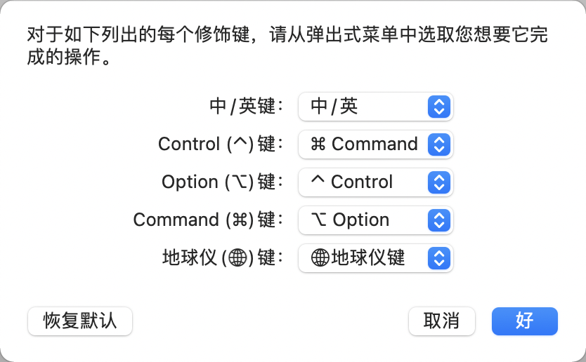

# MacOs

# 快捷键

## 设置快捷键

为了减少跨平台的适应成本, 将 maxOS 的修饰键进行了替换, 修饰键的替换




## 常用快捷键

| 功能与描述               | 默认键                        | 按 win风格改键后 |
| ------------------------ | ----------------------------- | ---------------- |
| 切换 tty                 | command+T                     | control+T        |
| 隐藏程序窗口             | Command + H                   |                  |
| 最小化当前窗口           | Command + M                   |                  |
| 退出当前软件             | Command + Q                   |                  |
| 多选文件                 | 按住 Command + 鼠标点击       |                  |
| 选择连续的文件           | 按住 Shift + 鼠标点击首尾文件 |                  |
| 删除文件                 | Command + Backspace           |                  |
| 删除光标后的字符         | fn + backspace                |                  |
| 删除该行光标前的全部内容 | Command + Backspace           |                  |
| 向上翻页(PageUp)         | Fn + 方向键上                 |                  |
| 向下翻页(PageDown)       | Fn + 方向键下                 |                  |
| 到头部(Home)             | Fn + 方向键左                 |                  |
| 到底部(End)              | Fn + 方向键右                 |                  |
| 插入 insert              |                               |                  |

## 环境变量

```shell
$echo $PATH
# 自定义的 maven
/Users/luojbin/develop/apache-maven-3.8.4/bin:
# brew 安装的软件
/opt/homebrew/bin:
/opt/homebrew/sbin:
# 用户安装的软件
/usr/local/bin:
/usr/bin:
# 系统自带的软件
/bin:
/usr/sbin:
/sbin:
# 其他苹果系统中的软件
/Library/Apple/usr/bin
```


# MacOS 的 shell

MacOS 可以使用以下的 shell, 记录在 `/etc/shells` 文件中

```shell
# List of acceptable shells for chpass(1).
# Ftpd will not allow users to connect who are not using one of these shells.

/bin/bash
/bin/csh
/bin/dash
/bin/ksh
/bin/sh
/bin/tcsh
/bin/zsh
```

默认使用 `zsh`

## Bash, Sh

MacOS 默认使用 zsh, 如果需要切换 Bash 为默认 shell, 可以通过以下命令进行设置

```shell
# 修改默认 shell 为 bash
chsh -s /bin/bash
```

修改之后, 可能会提示切换回 zsh, 如果想要忽略 zsh 的提示信息, 可以在 `~/.bash_profile` 中关闭提醒

```shell
# ~/.bash_profile 中关闭切换到 zsh 的提醒
export BASH_SILENCE_DEPRECATION_WARNING=1
```


### /etc/profile

系统级的配置文件

```shell
# System-wide .profile for sh(1)

if [ -x /usr/libexec/path_helper ]; then
	eval `/usr/libexec/path_helper -s`
fi

if [ "${BASH-no}" != "no" ]; then
	[ -r /etc/bashrc ] && . /etc/bashrc
fi
```

### /etc/bashrc

```shell
# System-wide .bashrc file for interactive bash(1) shells.
if [ -z "$PS1" ]; then
   return
fi

PS1='\h:\W \u\$ '
# Make bash check its window size after a process completes
shopt -s checkwinsize

# 为终端程序添加一些支持, $TERM_PROGRAM=Apple_Terminal, 因此会加载 /etc/bashrc_Apple_Terminal
[ -r "/etc/bashrc_$TERM_PROGRAM" ] && . "/etc/bashrc_$TERM_PROGRAM"
```

### /etc/bashrc_Apple_Terminal

```shell
# bash support for Terminal.


# Working Directory
#
# Tell the terminal about the current working directory at each prompt.

if [ -z "$INSIDE_EMACS" ]; then
    update_terminal_cwd() {
	# Identify the directory using a "file:" scheme URL, including
	# the host name to disambiguate local vs. remote paths.
	
	# Percent-encode the pathname.
	local url_path=''
	{
	    # Use LC_CTYPE=C to process text byte-by-byte and
	    # LC_COLLATE=C to compare byte-for-byte. Ensure that
	    # LC_ALL and LANG are not set so they don't interfere.
	    local i ch hexch LC_CTYPE=C LC_COLLATE=C LC_ALL= LANG=
	    for ((i = 0; i < ${#PWD}; ++i)); do
		ch="${PWD:i:1}"
		if [[ "$ch" =~ [/._~A-Za-z0-9-] ]]; then
		    url_path+="$ch"
		else
		    printf -v hexch "%02X" "'$ch"
		    # printf treats values greater than 127 as
		    # negative and pads with "FF", so truncate.
		    url_path+="%${hexch: -2:2}"
		fi
	    done
	}
	
	printf '\e]7;%s\a' "file://$HOSTNAME$url_path"
    }
    PROMPT_COMMAND="update_terminal_cwd${PROMPT_COMMAND:+; $PROMPT_COMMAND}"
fi


# Resume Support: Save/Restore Shell State
#
# Terminal assigns each terminal session a unique identifier and
# communicates it via the TERM_SESSION_ID environment variable so that
# programs running in a terminal can save/restore application-specific
# state when quitting and restarting Terminal with Resume enabled.
#
# The following code defines a shell save/restore mechanism. Users can
# add custom state by defining a shell_session_save_user_state function
# that writes restoration commands to the session file at exit. e.g.,
# to save a variable:
#
#   shell_session_save_user_state() { echo MY_VAR="'$MY_VAR'" >> "$SHELL_SESSION_FILE"; }
#
# During shell startup the session file is executed. Old files are
# periodically deleted.
#
# The default behavior arranges to save and restore the bash command
# history independently for each restored terminal session. It also
# merges commands into the global history for new sessions. Because
# of this it is recommended that you set HISTSIZE and HISTFILESIZE to
# larger values.
#
# You may disable this behavior and share a single history by setting
# SHELL_SESSION_HISTORY to 0. There are some common user customizations
# that arrange to share new commands among running shells by
# manipulating the history at each prompt, and they typically include
# 'shopt -s histappend'; therefore, if the histappend shell option is
# enabled, per-session history is disabled by default. You may
# explicitly enable it by setting SHELL_SESSION_HISTORY to 1.
#
# The implementation of per-session command histories in combination
# with a shared global command history is incompatible with the
# HISTTIMEFORMAT variable--the timestamps are applied inconsistently
# to different parts of the history; therefore, if HISTTIMEFORMAT is
# defined, per-session history is disabled by default.
#
# Note that this uses PROMPT_COMMAND to enable per-session history
# the first time for each new session. If you customize PROMPT_COMMAND
# be sure to include the previous value. e.g.,
#
#   PROMPT_COMMAND="${PROMPT_COMMAND:+$PROMPT_COMMAND; }your_code_here"
#
# Otherwise, the per-session history won't take effect until the first
# restore.
#
# The save/restore mechanism is disabled if the following file exists:
#
#   ~/.bash_sessions_disable

if [ ${SHELL_SESSION_DID_INIT:-0} -eq 0 ] && [ -n "$TERM_SESSION_ID" ] && [ ! -e "$HOME/.bash_sessions_disable" ]; then
    
    # Do not perform this setup more than once (which shouldn't occur
    # unless the user's ~/.bash_profile executes /etc/profile, which
    # is normally redundant).
    SHELL_SESSION_DID_INIT=1
    
    # Set up the session directory/file.
    SHELL_SESSION_DIR="$HOME/.bash_sessions"
    SHELL_SESSION_FILE="$SHELL_SESSION_DIR/$TERM_SESSION_ID.session"
    mkdir -m 700 -p "$SHELL_SESSION_DIR"
    
    #
    # Restore previous session state.
    #
    
    if [ -r "$SHELL_SESSION_FILE" ]; then
	. "$SHELL_SESSION_FILE"
	rm "$SHELL_SESSION_FILE"
    fi
    
    #
    # Note: Use absolute paths to invoke commands in the exit code and
    # anything else that runs after user startup files, because the
    # search path may have been modified.
    #
    
    #
    # Arrange for per-session shell command history.
    #
    
    shell_session_history_allowed() {
	# Return whether per-session history should be enabled.
	if [ -n "$HISTFILE" ]; then
	    # If this defaults to off, leave it unset so that we can
	    # check again later. If it defaults to on, make it stick.
	    local allowed=0
	    if shopt -q histappend || [ -n "$HISTTIMEFORMAT" ]; then
		allowed=${SHELL_SESSION_HISTORY:-0}
	    else
		allowed=${SHELL_SESSION_HISTORY:=1}
	    fi
	    if [ $allowed -eq 1 ]; then
		return 0
	    fi
	fi
	return 1
    }
    
    if [ ${SHELL_SESSION_HISTORY:-1} -eq 1 ]; then
	SHELL_SESSION_HISTFILE="$SHELL_SESSION_DIR/$TERM_SESSION_ID.history"
	SHELL_SESSION_HISTFILE_NEW="$SHELL_SESSION_DIR/$TERM_SESSION_ID.historynew"
	SHELL_SESSION_HISTFILE_SHARED="$HISTFILE"
	
	shell_session_history_enable() {
	    (umask 077; /usr/bin/touch "$SHELL_SESSION_HISTFILE_NEW")
	    HISTFILE="$SHELL_SESSION_HISTFILE_NEW"
	    SHELL_SESSION_HISTORY=1
	}
	
	# If the session history already exists and isn't empty, start
	# using it now; otherwise, we'll use the shared history until
	# we've determined whether users have enabled/disabled this.
	if [ -s "$SHELL_SESSION_HISTFILE" ]; then
	    history -r "$SHELL_SESSION_HISTFILE"
	    shell_session_history_enable
	else
	    # At the first prompt, check whether per-session history should
	    # be enabled. Delaying until after user scripts have run allows
	    # users to opt in or out. If this doesn't get executed (because
	    # the user has replaced PROMPT_COMMAND instead of concatenating
	    # it), we'll check at shell exit; that works, but doesn't start
	    # the per-session history until the first restore.
	    
	    shell_session_history_check() {
		if [ ${SHELL_SESSION_DID_HISTORY_CHECK:-0} -eq 0 ]; then
		    SHELL_SESSION_DID_HISTORY_CHECK=1
		    if shell_session_history_allowed; then
			shell_session_history_enable
		    fi
		    # Remove this check if we can; otherwise, we rely on the
		    # variable above to prevent checking more than once.
		    if [ "$PROMPT_COMMAND" = "shell_session_history_check" ]; then
			unset PROMPT_COMMAND
		    elif [[ $PROMPT_COMMAND =~ (.*)(; *shell_session_history_check *| *shell_session_history_check *; *)(.*) ]]; then
			PROMPT_COMMAND="${BASH_REMATCH[1]}${BASH_REMATCH[3]}"
		    fi
		fi
	    }
	    PROMPT_COMMAND="shell_session_history_check${PROMPT_COMMAND:+; $PROMPT_COMMAND}"
	fi
	
	shell_session_save_history() {
	    # Save new history to an intermediate file so we can copy it.
	    shell_session_history_enable
	    history -a
	    # If the session history doesn't exist yet, copy the shared history.
	    if [ -f "$SHELL_SESSION_HISTFILE_SHARED" ] && [ ! -s "$SHELL_SESSION_HISTFILE" ]; then
		echo -ne '\n...copying shared history...' >&2
		(umask 077; /bin/cp "$SHELL_SESSION_HISTFILE_SHARED" "$SHELL_SESSION_HISTFILE")
	    fi
	    # Save new history to the per-session and shared files.
	    echo -ne '\n...saving history...' >&2
	    (umask 077; /bin/cat "$SHELL_SESSION_HISTFILE_NEW" >> "$SHELL_SESSION_HISTFILE_SHARED")
	    (umask 077; /bin/cat "$SHELL_SESSION_HISTFILE_NEW" >> "$SHELL_SESSION_HISTFILE")
	    : >| "$SHELL_SESSION_HISTFILE_NEW"
	    # If there is a history file size limit, apply it to the files.
	    if [ -n "$HISTFILESIZE" ]; then
		echo -n 'truncating history files...' >&2
		HISTFILE="$SHELL_SESSION_HISTFILE_SHARED"
		HISTFILESIZE="$HISTFILESIZE"
		HISTFILE="$SHELL_SESSION_HISTFILE"
		HISTFILESIZE="$size"
		HISTFILE="$SHELL_SESSION_HISTFILE_NEW"
	    fi
	    echo -ne '\n...' >&2
	}
    fi
    
    #
    # Arrange to save session state when exiting the shell.
    #
    
    shell_session_save() {
	# Save the current state.
	if [ -n "$SHELL_SESSION_FILE" ]; then
	    echo -ne '\nSaving session...' >&2
	    (umask 077; echo 'echo Restored session: "$(/bin/date -r '$(/bin/date +%s)')"' >| "$SHELL_SESSION_FILE")
	    declare -F shell_session_save_user_state >/dev/null && shell_session_save_user_state
	    shell_session_history_allowed && shell_session_save_history
	    echo 'completed.' >&2
	fi
    }
    
    # Delete old session files. (Not more than once a day.)
    SHELL_SESSION_TIMESTAMP_FILE="$SHELL_SESSION_DIR/_expiration_check_timestamp"
    shell_session_delete_expired() {
	if ([ ! -e "$SHELL_SESSION_TIMESTAMP_FILE" ] || [ -z "$(/usr/bin/find "$SHELL_SESSION_TIMESTAMP_FILE" -mtime -1d)" ]); then
	    local expiration_lock_file="$SHELL_SESSION_DIR/_expiration_lockfile"
	    if /usr/bin/shlock -f "$expiration_lock_file" -p $$; then
		echo -n 'Deleting expired sessions...' >&2
		local delete_count=$(/usr/bin/find "$SHELL_SESSION_DIR" -type f -mtime +2w -print -delete | /usr/bin/wc -l)
		[ "$delete_count" -gt 0 ] && echo $delete_count' completed.' >&2 || echo 'none found.' >&2
		(umask 077; /usr/bin/touch "$SHELL_SESSION_TIMESTAMP_FILE")
		/bin/rm "$expiration_lock_file"
	    fi
	fi
    }
    
    # Update saved session state when exiting.
    shell_session_update() {
	shell_session_save && shell_session_delete_expired
    }
    trap shell_session_update EXIT
fi
```


## Zsh

### /etc/zprofile

```shell
# System-wide profile for interactive zsh(1) login shells.

# Setup user specific overrides for this in ~/.zprofile. See zshbuiltins(1)
# and zshoptions(1) for more details.

if [ -x /usr/libexec/path_helper ]; then
	eval `/usr/libexec/path_helper -s`
fi
```

### /etc/zshrc

```shell
# System-wide profile for interactive zsh(1) shells.

# Setup user specific overrides for this in ~/.zshrc. See zshbuiltins(1) and zshoptions(1) for more details.

# Correctly display UTF-8 with combining characters.
if [[ "$(locale LC_CTYPE)" == "UTF-8" ]]; then
    setopt COMBINING_CHARS
fi

# Disable the log builtin, so we don't conflict with /usr/bin/log
disable log

# Save command history
HISTFILE=${ZDOTDIR:-$HOME}/.zsh_history
HISTSIZE=2000
SAVEHIST=1000

# Beep on error
# 出错时发出提示音
setopt BEEP

# Use keycodes (generated via zkbd) if present, otherwise fallback on values from terminfo
if [[ -r ${ZDOTDIR:-$HOME}/.zkbd/${TERM}-${VENDOR} ]] ; then
    source ${ZDOTDIR:-$HOME}/.zkbd/${TERM}-${VENDOR}
else
    typeset -g -A key

    [[ -n "$terminfo[kf1]" ]] && key[F1]=$terminfo[kf1]
    [[ -n "$terminfo[kf2]" ]] && key[F2]=$terminfo[kf2]
    [[ -n "$terminfo[kf3]" ]] && key[F3]=$terminfo[kf3]
    [[ -n "$terminfo[kf4]" ]] && key[F4]=$terminfo[kf4]
    [[ -n "$terminfo[kf5]" ]] && key[F5]=$terminfo[kf5]
    [[ -n "$terminfo[kf6]" ]] && key[F6]=$terminfo[kf6]
    [[ -n "$terminfo[kf7]" ]] && key[F7]=$terminfo[kf7]
    [[ -n "$terminfo[kf8]" ]] && key[F8]=$terminfo[kf8]
    [[ -n "$terminfo[kf9]" ]] && key[F9]=$terminfo[kf9]
    [[ -n "$terminfo[kf10]" ]] && key[F10]=$terminfo[kf10]
    [[ -n "$terminfo[kf11]" ]] && key[F11]=$terminfo[kf11]
    [[ -n "$terminfo[kf12]" ]] && key[F12]=$terminfo[kf12]
    [[ -n "$terminfo[kf13]" ]] && key[F13]=$terminfo[kf13]
    [[ -n "$terminfo[kf14]" ]] && key[F14]=$terminfo[kf14]
    [[ -n "$terminfo[kf15]" ]] && key[F15]=$terminfo[kf15]
    [[ -n "$terminfo[kf16]" ]] && key[F16]=$terminfo[kf16]
    [[ -n "$terminfo[kf17]" ]] && key[F17]=$terminfo[kf17]
    [[ -n "$terminfo[kf18]" ]] && key[F18]=$terminfo[kf18]
    [[ -n "$terminfo[kf19]" ]] && key[F19]=$terminfo[kf19]
    [[ -n "$terminfo[kf20]" ]] && key[F20]=$terminfo[kf20]
    [[ -n "$terminfo[kbs]" ]] && key[Backspace]=$terminfo[kbs]
    [[ -n "$terminfo[kich1]" ]] && key[Insert]=$terminfo[kich1]
    [[ -n "$terminfo[kdch1]" ]] && key[Delete]=$terminfo[kdch1]
    [[ -n "$terminfo[khome]" ]] && key[Home]=$terminfo[khome]
    [[ -n "$terminfo[kend]" ]] && key[End]=$terminfo[kend]
    [[ -n "$terminfo[kpp]" ]] && key[PageUp]=$terminfo[kpp]
    [[ -n "$terminfo[knp]" ]] && key[PageDown]=$terminfo[knp]
    [[ -n "$terminfo[kcuu1]" ]] && key[Up]=$terminfo[kcuu1]
    [[ -n "$terminfo[kcub1]" ]] && key[Left]=$terminfo[kcub1]
    [[ -n "$terminfo[kcud1]" ]] && key[Down]=$terminfo[kcud1]
    [[ -n "$terminfo[kcuf1]" ]] && key[Right]=$terminfo[kcuf1]
fi

# Default key bindings
[[ -n ${key[Delete]} ]] && bindkey "${key[Delete]}" delete-char
[[ -n ${key[Home]} ]] && bindkey "${key[Home]}" beginning-of-line
[[ -n ${key[End]} ]] && bindkey "${key[End]}" end-of-line
[[ -n ${key[Up]} ]] && bindkey "${key[Up]}" up-line-or-search
[[ -n ${key[Down]} ]] && bindkey "${key[Down]}" down-line-or-search

# Default prompt
# 默认提示行
PS1="%n@%m %1~ %# "

# Useful support for interacting with Terminal.app or other terminal programs
# 为终端程序添加一些支持, $TERM_PROGRAM=Apple_Terminal, 因此会加载 /etc/zshrc_Apple_Terminal
[ -r "/etc/zshrc_$TERM_PROGRAM" ] && . "/etc/zshrc_$TERM_PROGRAM"
```

### /etc/zshrc_Apple_Terminal

```shell
# Zsh support for Terminal.

# Working Directory
#
# Tell the terminal about the current working directory at each prompt.
#
# Terminal uses this to display the directory in the window title bar
# and tab bar, and for behaviors including creating a new terminal with
# the same working directory and restoring the working directory when
# restoring a terminal for Resume. See Terminal > Preferences for
# additional information.

if [ -z "$INSIDE_EMACS" ]; then

    update_terminal_cwd() {
	# Identify the directory using a "file:" scheme URL, including
	# the host name to disambiguate local vs. remote paths.

	# Percent-encode the pathname.
	local url_path=''
	{
	    # Use LC_CTYPE=C to process text byte-by-byte and
	    # LC_COLLATE=C to compare byte-for-byte. Ensure that
	    # LC_ALL and LANG are not set so they don't interfere.
	    local i ch hexch LC_CTYPE=C LC_COLLATE=C LC_ALL= LANG=
	    for ((i = 1; i <= ${#PWD}; ++i)); do
		ch="$PWD[i]"
		if [[ "$ch" =~ [/._~A-Za-z0-9-] ]]; then
		    url_path+="$ch"
		else
		    printf -v hexch "%02X" "'$ch"
		    url_path+="%$hexch"
		fi
	    done
	}

	printf '\e]7;%s\a' "file://$HOST$url_path"
    }

    # Register the function so it is called at each prompt.
    autoload -Uz add-zsh-hook
    add-zsh-hook precmd update_terminal_cwd
fi


# Resume Support: Save/Restore Shell State
#
# Terminal assigns each terminal session a unique identifier and
# communicates it via the TERM_SESSION_ID environment variable so that
# programs running in a terminal can save/restore application-specific
# state when quitting and restarting Terminal with Resume enabled.
#
# The following code defines a shell save/restore mechanism. Users can
# add custom state by defining a `shell_session_save_user_state` function
# or an array of functions `shell_session_save_user_state_functions` that
# write restoration commands to the session state file at exit. The first
# argument of the function is the pathname of the session state file in
# which to store state. e.g., to save a variable:
#
#   shell_session_save_user_state() { echo MY_VAR="'$MY_VAR'" >> "$1"; }
#
# or:
#
#   save_my_var() { echo MY_VAR="'$MY_VAR'" >> "$1"; }
#   shell_session_save_user_state_functions+=(save_my_var)
#
# During shell startup the session file is executed and then deleted.
# You may save/restore arbitrarily complex/large state by writing it
# to some other file(s) and writing command(s) to the state file that
# restore that data. You should typically use the TERM_SESSION_ID
# as part of your file or directory names.
#
# The default behavior arranges to save and restore the shell command
# history independently for each restored terminal session. It also
# merges commands into the global history for new sessions. Because of
# this it is recommended that you set HISTSIZE and SAVEHIST to larger
# values.
#
# You may disable this behavior and share a single history by setting
# SHELL_SESSION_HISTORY to 0. The shell options INC_APPEND_HISTORY,
# INC_APPEND_HISTORY_TIME and SHARE_HISTORY are used to share new
# commands among running shells; therefore, if any of these is enabled,
# per-session history is disabled by default. You may explicitly enable
# it by setting SHELL_SESSION_HISTORY to 1.
#
# Note that this uses the precmd hook to enable per-session history the
# first time for each new session; if that doesn't run, the per-session
# history won't take effect until the first restore.
#
# The save/restore mechanism as a whole can be disabled by setting an
# environment variable (typically in `${ZDOTDIR:-$HOME}/.zshenv`):
#
#   SHELL_SESSIONS_DISABLE=1

if [ ${SHELL_SESSION_DID_INIT:-0} -eq 0 ] && [ -n "$TERM_SESSION_ID" ] && [ ${SHELL_SESSIONS_DISABLE:-0} -eq 0 ]; then

    # Do not perform this setup more than once.
    SHELL_SESSION_DID_INIT=1

    # Set up the session directory/file.
    SHELL_SESSION_DIR="${ZDOTDIR:-$HOME}/.zsh_sessions"
    SHELL_SESSION_FILE="$SHELL_SESSION_DIR/$TERM_SESSION_ID.session"
    mkdir -m 700 -p "$SHELL_SESSION_DIR"

    #
    # Restore previous session state.
    #

    if [ -r "$SHELL_SESSION_FILE" ]; then
	. "$SHELL_SESSION_FILE"
	/bin/rm "$SHELL_SESSION_FILE"
    fi

    #
    # Note: Use absolute paths to invoke commands in the exit code and
    # anything else that runs after user startup files, because the
    # search path may have been modified.
    #

    #
    # Arrange for per-session shell command history.
    #

    shell_session_history_allowed() {
	# Return whether per-session history should be enabled.
	if [ -n "$HISTFILE" ]; then
	    # If this defaults to off, leave it unset so that we can
	    # check again later. If it defaults to on, make it stick.
	    local allowed=0
	    if [[ -o INC_APPEND_HISTORY ]] || [[ -o INC_APPEND_HISTORY_TIME ]] || [[ -o SHARE_HISTORY ]]; then
		allowed=${SHELL_SESSION_HISTORY:-0}
	    else
		allowed=${SHELL_SESSION_HISTORY:=1}
	    fi
	    if [ $allowed -eq 1 ]; then
		return 0
	    fi
	fi
	return 1
    }
    
    if [ ${SHELL_SESSION_HISTORY:-1} -eq 1 ]; then
	SHELL_SESSION_HISTFILE="$SHELL_SESSION_DIR/$TERM_SESSION_ID.history"
	SHELL_SESSION_HISTFILE_NEW="$SHELL_SESSION_DIR/$TERM_SESSION_ID.historynew"
	SHELL_SESSION_HISTFILE_SHARED="$HISTFILE"

	shell_session_history_enable() {
	    (umask 077; /usr/bin/touch "$SHELL_SESSION_HISTFILE_NEW")
	    HISTFILE="$SHELL_SESSION_HISTFILE_NEW"
	    SHELL_SESSION_HISTORY=1
	}

	# If the session history already exists and isn't empty, start
	# using it now; otherwise, we'll use the shared history until
	# we've determined whether users have enabled/disabled this.
	if [ -s "$SHELL_SESSION_HISTFILE" ]; then
	    fc -R "$SHELL_SESSION_HISTFILE"
	    shell_session_history_enable
	else
	    # At the first prompt, check whether per-session history should
	    # be enabled. Delaying until after user scripts have run allows
	    # users to opt in or out. If this doesn't get executed (probably
	    # because a user script inadvertently removed the hook), we'll
	    # check at shell exit; that works, but doesn't start the per-
	    # session history until the first restore.

	    shell_session_history_check() {
		if [ ${SHELL_SESSION_DID_HISTORY_CHECK:-0} -eq 0 ]; then
		    SHELL_SESSION_DID_HISTORY_CHECK=1
		    shell_session_history_allowed && shell_session_history_enable
		    # Uninstall this check.
		    autoload -Uz add-zsh-hook
		    add-zsh-hook -d precmd shell_session_history_check
		fi
	    }
	    autoload -Uz add-zsh-hook
	    add-zsh-hook precmd shell_session_history_check
	fi

	shell_session_save_history() {
	    shell_session_history_enable
	    
	    # Save new history to an intermediate file so we can copy it.
	    fc -AI
	    
	    # If the session history doesn't exist yet, copy the shared history.
	    if [ -f "$SHELL_SESSION_HISTFILE_SHARED" ] && [ ! -s "$SHELL_SESSION_HISTFILE" ]; then
		echo -ne '\n...copying shared history...' >&2
		(umask 077; /bin/cp "$SHELL_SESSION_HISTFILE_SHARED" "$SHELL_SESSION_HISTFILE")
	    fi
	    
	    # Save new history to the per-session and shared files.
	    echo -ne '\n...saving history...' >&2
	    (umask 077; /bin/cat "$SHELL_SESSION_HISTFILE_NEW" >> "$SHELL_SESSION_HISTFILE_SHARED")
	    (umask 077; /bin/cat "$SHELL_SESSION_HISTFILE_NEW" >> "$SHELL_SESSION_HISTFILE")
	    /bin/rm "$SHELL_SESSION_HISTFILE_NEW"
	    
	    # If there is a history file size limit, apply it to the files.
	    if [ -n "$SAVEHIST" ]; then
		echo -n 'truncating history files...' >&2
		fc -p "$SHELL_SESSION_HISTFILE_SHARED" && fc -P
		fc -p "$SHELL_SESSION_HISTFILE" && fc -P
	    fi
	    echo -ne '\n...' >&2
	}
    fi

    #
    # Arrange to save session state when exiting the shell.
    #

    shell_session_save() {
	# Save the current state.
	if [ -n "$SHELL_SESSION_FILE" ]; then
	    echo -ne '\nSaving session...' >&2
	    (umask 077; echo 'echo Restored session: "$(/bin/date -r '$(/bin/date +%s)')"' >| "$SHELL_SESSION_FILE")
	    
	    # Call user-supplied hook functions to let them save state.
	    whence shell_session_save_user_state >/dev/null && shell_session_save_user_state "$SHELL_SESSION_FILE"
	    local f
	    for f in $shell_session_save_user_state_functions; do
		$f "$SHELL_SESSION_FILE"
	    done
	    
	    shell_session_history_allowed && shell_session_save_history
	    echo 'completed.' >&2
	fi
    }

    # Delete old session files. (Not more than once a day.)
    SHELL_SESSION_TIMESTAMP_FILE="$SHELL_SESSION_DIR/_expiration_check_timestamp"
    shell_session_delete_expired() {
	if [ ! -e "$SHELL_SESSION_TIMESTAMP_FILE" ] || [ -z "$(/usr/bin/find "$SHELL_SESSION_TIMESTAMP_FILE" -mtime -1d)" ]; then
	    local expiration_lock_file="$SHELL_SESSION_DIR/_expiration_lockfile"
	    if /usr/bin/shlock -f "$expiration_lock_file" -p $$; then
		echo -n 'Deleting expired sessions...' >&2
		local delete_count=$(/usr/bin/find "$SHELL_SESSION_DIR" -type f -mtime +2w -print -delete | /usr/bin/wc -l)
		[ "$delete_count" -gt 0 ] && echo $delete_count' completed.' >&2 || echo 'none found.' >&2
		(umask 077; /usr/bin/touch "$SHELL_SESSION_TIMESTAMP_FILE")
		/bin/rm "$expiration_lock_file"
	    fi
	fi
    }
    
    # Update saved session state when exiting.
    shell_session_update() {
	shell_session_save && shell_session_delete_expired
    }
    autoload -Uz add-zsh-hook
    add-zsh-hook zshexit shell_session_update
fi
```

# 软件与包管理

## App Store

## 第三方安装包

#### dmg

## brew

```shell
# 安装 brew, 有别人写好的一键安装脚本 https://zhuanlan.zhihu.com/p/111014448
/bin/zsh -c "$(curl -fsSL https://gitee.com/cunkai/HomebrewCN/raw/master/Homebrew.sh)"

# 查看 brew 版本
brew -v

#列出已安装的软件
brew list
brew ls

# 搜索软件
brew search <关键字>

# 安装软件
brew install <软件名>

# 显示包依赖
brew deps <软件名>

# 更新brew
brew update

# 更新软件
brew upgrade

# 卸载
brew uninstall <软件名>
   
# 查看那些包需要更新
brew outdated
```

