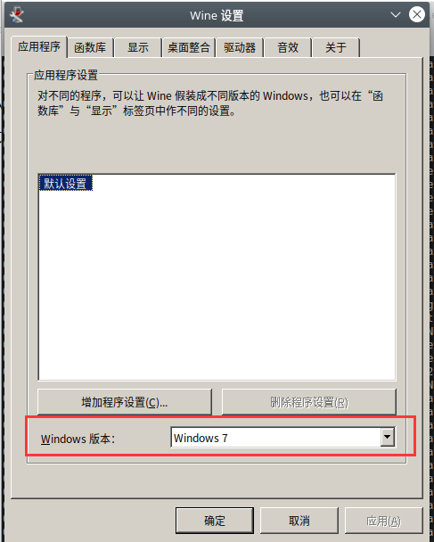
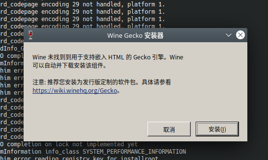

# █ wine

## 概述

[官网地址](https://www.winehq.org/)

wine 是一个兼容层, 能让 linux 系统安装并运行 windows 软件

## 安装

### ubuntu

[官方安装说明](https://wiki.winehq.org/Ubuntu_zhcn)

#### 安装 wine 基础框架

```shell
# 开启 32 bit 架构支持
sudo dpkg --add-architecture i386 

# 下载添加仓库密钥
wget -nc https://dl.winehq.org/wine-builds/winehq.key
sudo apt-key add winehq.key

# 添加仓库
sudo add-apt-repository 'deb https://dl.winehq.org/wine-builds/ubuntu/ focal main 

# 更新软件目录
sudo apt update

# 安装稳定版本
sudo apt install --install-recommends winehq-stable
```

#### 安装 winetricks

winetricks 是 wine 的扩展工具, 协助安装 wine 本身未提供, 但 windows 系列软件需要的一些依赖类库

ubuntu 官方源中的 winetricks 版本较旧, 可能会有问题, 建议手动安装

```sh
# 如果之前通过apt安装过, 卸载已安装的旧版
sudo apt-get remove winetricks

# 获取新版
wget  https://raw.githubusercontent.com/Winetricks/winetricks/master/src/winetricks

# 修改权限为可执行
chmod +x winetricks

# 将可执行文件放置于terminal可调用的目录下
sudo mv -v winetricks /usr/local/bin
```

#### 配置 wine bottle

wine bottle 相当于一个微型的虚拟机, 可以为不同的软件提供不同的容器

建议使用 win32 架构, 兼容性会比较好 

因此我们可以将 默认的 `~/.wine` 设置成 win32 的

```
WINEARCH=win32 WINEPREFIX=/home/luojbin/.wine/ winecfg
```

会启动 wine 的配置界面, 一般选择默认 windows7 环境即可



如果是第一次使用 winecfg, 可能会提示安装 mono  和 Gecko, 按提示安装即可



### 安装必要DLL

通过 winetricks 来添加必要的 dll

其中有一部分依赖链接过期, 已经下不到了, 

要手动添加到`~/.cache` 里面

- riched20
- riched30
- richtx32

### 安装中文字体

- cjkfonts
- corefonts

# █ deepin-wine

deepin 为国内的应用做了很多优化, 但是仅在 deepin 自己的发行版中能一键安装, 其他发行版可能会有一些问题

优秀的胖兔兔做了一个在其他发行版安装 deepin-wine 的脚本, [gitee仓库地址](https://gitee.com/q1320553934/deepin-wine-installer), [详细教程](https://zhuanlan.zhihu.com/p/379415477)


在 虚拟机 kubuntu 安装后, 商店花屏打不开, 兔兔提供了用命令行安装的方式

```shell
# 进入deepin-wine 容器环境
machinectl shell deepin-wine

# 更新 deepin 软件目录
apt update

apt install pcmanfm
export DISPLAY=:0
pcmanfm

# 安装qq
apt install com.qq.im.deepin

# 安装微信
apt install com.qq.weixin.deepin
```

安装完成后, 可以在容器的 /usr/share/applications 里面找到应用

