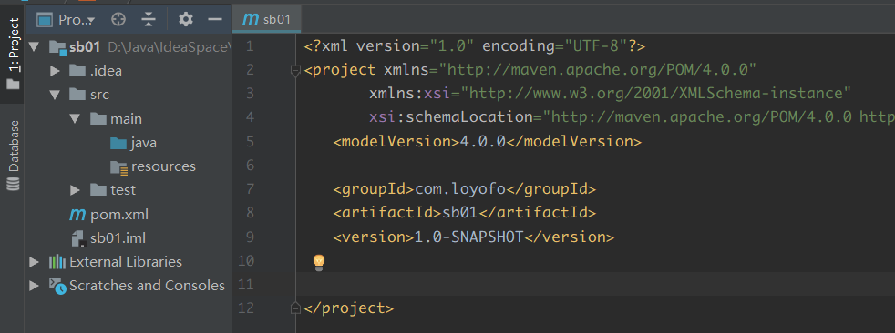
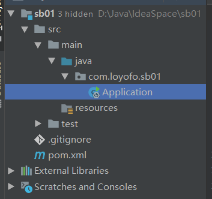
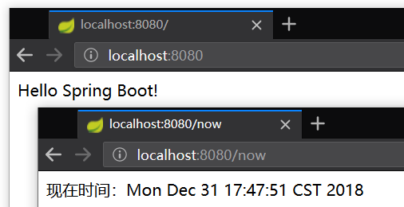
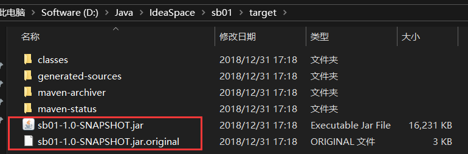

# █ Spring Boot


# 一. 简介

- 解决什么问题
- 包含哪些模块
- 基本使用方法

springboot 是 spring 系列最新的框架, springboot 的目标不在于为已解决的问题提供新的额解决方案, 而是为平台带来一种全新的开发体验, 简化对这些已有技术的使用.

springboot 使用特定的方式, (继承特定的 starter, 约定优先于配置) 来进行配置, 从而开发者不需要进行一些模板化的配置, 

springboot 基于 spring 4, 继承了原有 spring 框架的优秀基因, 它并不是一个框架, 从根本上说, 它就是一些库的集合, 通过 maven 或 gradle 导入相应的依赖即可使用 spring boot, 并且不需自行管理这些库的版本

## 2. 为什么使用 springBoot

spring boot 是为了简化 spring 项目配置而生, 它使得 jar 依赖管理和应用编译/部署变得更加简单. spring boot 还提供自动化配置, 使用 spring boot, 开发者只需要配置少量的属性, 编写很少的代码即可完成项目配置.

使用 spring boot , 只需要很少的代码和配置, 即可构建一个可用的 web 应用, 并且内置了 tomcat, 构建的 fat jar 包可以通过 `java -jar a.jar` 一键启动, 这种特性非常契合微服务的概念, 并可以结合 spring cloud 和 docker 技术来构建微服务并部署到云端:

- 一个 jar 包就是一个独立的服务
- 很容易加载到容器, 每个服务可以在自己的容器, 如 docker 中运行
- 可以通过脚本实现配置与部署, 适合云端部署, 并且自动扩展也很容易

## 3. spring boot 的特性

### 1) starter 集成 jar

spring boot 提供了一系列的 starter, 已经对一些功能性的 jar 包进行了集成. 通过引入这些 starter, 就能方便地引入相应地依赖, 并且不需开发者去手动管理依赖 jar 包的版本, 比如:

| starter                      | 作用                                                         |
| ---------------------------- | ------------------------------------------------------------ |
| spring-boot-starter          | 核心Spring Boot starter, 包括自动配置支持，日志和YAML        |
| spring-boot-starter-actuator | 生产准备的特性，用于帮你监控和  管理应用                     |
| spring-boot-starter-web      | 对全栈web开发的支持，包括Tomcat和   spring-webmvc            |
| spring-boot-starter-aop      | 对面向切面编程的支持，包括 spring-aop             和AspectJ  |
| spring-boot-starter-jdbc     | 对JDBC数据库的支持                                           |
| spring-boot-starter-security | 对 spring-security 的支持                                    |
| spring-boot-starter-amqp     | 通过spring-rabbit来支持AMQP协议（Advanced Message Queuing Protocol） |
| spring-boot-starter-ws       | 支持Spring Web Services                                      |
| spring-boot-starter-redis    | 支持Redis键值存储数据库，包括spring-redis                    |
| spring-boot-starter-test     | 支持常规的测试依赖，包括JUnit、Hamcrest、Mockito以及spring-test模块 |

### 2) 独立运行

spring boot 默认将项目打包成一个 fat jar, 即独立的可执行的 jar 包文件. 构建成功后, 使用 `java -jar x.jar` 命令即可运行应用. 由于内置了 tomcat, 也不需要预先部署一个外部的 web 应用容器

当然, spring boot 也允许开发者将项目部署到任何兼容 servlet 3.0+ 的容器

### 3) 自动配置 无需 xml

spring boot 的一大目标就是要尽可能消除 xml 配置文件的使用, 因此提供了自动配置功能.

spring boot 会尝试根据你添加的 jar 依赖自动配置你的应用,  如添加了 hsqldb 依赖, 但不配置任何连接 bean, 则 spring boot 会自动配置一个内存 db

spring boot 的自动配置是非侵入式的, 开发者还可以定义自己的配置或使用 bean 来替代自动配置.

要使用自动配置, 需要使用 `@EnableAutoConfiguration` 或者 `@SpringBootApplication` 注解，配合`@Configuration` 注解类

### 4) 外部化配置

springboot 可以使用 properties 文件, yaml 文件, 环境变量, 命令行参数等外部化配置.

### 5) 嵌入式 servlet 容器

springboot 的 web 模块内置嵌入的 servlet 容器, web 应用打包成可执行 jar 时, 相应的 servlet 容器也会被嵌入到应用 jar 中, 并且 servlet, filter, listener 等都可以通过声明为 bean 来被容器注册. 容器可以通过外部化配置来设置相关属性

# 二. 基本 Demo

spring boot 建议使用 maven 或 gradle, 本文以 maven 为例

## 1. 最简单的 spring boot 项目

### 1) 新建 maven 项目

创建一个一般的 maven 项目, 有一个 pom.xml 和基本的 src/main/java 结构



### 2) 添加 spring boot 依赖

pring boot 通过继承 starter 的方式来简化项目配置, 只需要在 maven 项目中设置父 pom 为 `spring-boot-starter-parent`, 即可继承 spring 项目的基本配置

```xml
<parent>
    <groupId>org.springframework.boot</groupId>
    <artifactId>spring-boot-starter-parent</artifactId>
    <version>2.1.0.RELEASE</version>
</parent>
```

这是引入 spring boot 最简单的方法, 但是有时候可能项目中已经有一个父 pom 需要继承, 不能直接添加 `parent` 时, 还可以通过如下方式引入, 但使用这种方式时需要进行更多配置, 才能打包成可执行 jar:

```xml
<dependencyManagement>
    <dependencies>
        <dependency>
            <!-- 导入 spring boot 的依赖 -->
            <groupId>org.springframework.boot</groupId>
            <artifactId>spring-boot-dependencies</artifactId>
            <version>1.2.3.RELEASE</version>
            <type>pom</type>
            <!-- 这个地方 -->
            <scope>import</scope>
        </dependency>
    </dependencies>
</dependencyManagement>
```

### 3) 添加 web 支持

spring boot 通过各种 starter 来实现对不同功能的支持, 如需要创建一个 web 项目, 则可以添加 `spring-boot-starter-web` 依赖

```xml
<dependencies>
    <dependency>
        <groupId>org.springframework.boot</groupId>
        <artifactId>spring-boot-starter-web</artifactId>
    </dependency>
</dependencies>
```

由于 `spring-boot-starter-parent` 中已经预设了大量常用依赖的版本号, 在此我们不需要指定 starter 的版本号.

### 4) 创建启动配置类

创建一个启动配置类, 并且提供一个 main 方法作为程序的入口.

springboot 建议我们将这个启动配置类放置在项目的根包名下, 如示例中的 sb01 项目, 项目根包名为 `com.loyofo.sb01`.

因为默认和包有关的注解, 默认包名都是当前类所在的包, 例如 `@ComponentScan`, `@EntityScan`, `@SpringBootApplication` 注解, 这些注解都是按当前 `Application.java` 所在包作为扫描起始路径, 扫描当前包以及子包.



启动配置类中的 main 方法, 可以用以下三种方式启动应用:

1. 使用 SpringApplication.run()

   ```java
   public static void main(String[] args) {
       // 通过静态方法直接启动
       SpringApplication.run(Application.class, args);
   }
   ```

   SpringApplication 类提供了一个静态方法, 只需将当前类以及启动参数传入即可

2. 构造当前应用的实例并启动

   ```java
   public static void main(String[] args) {
       // 构造当前应用的实例
       SpringApplication application = new SpringApplication(Application.class);
       application.setBannerMode(Banner.Mode.OFF);
       application.run();
   }
   ```

   通过这种方式, 可以在应用启动前进行一些必要的设置, 如添加默认启动参数等

3. 通过 builder 创建应用实例并启动

   ```java
   public static void main(String[] args) {
       // 通过 builder 构造当前应用对象
       new SpringApplicationBuilder()
           .bannerMode(Banner.Mode.OFF)
           .sources(Application.class)
           .run(args);
   }
   ```

   与方法2类似, 可以在启动前进行一些必要的设置. 

启动配置类简单实例如下:

```java
@RestController
@SpringBootApplication
public class Application {
    @RequestMapping("/")
    String home() {
        return "Hello Spring Boot!";
    }

    @RequestMapping("/now")
    String now() {
        return "现在时间：" + new Date();
    }

    public static void main(String[] args) {
        SpringApplication.run(Application.class, args);
    }
}
```

其中用到了三个注解, 后面再详细解释.

- **@RestController**, 相当于同时添加 `@Controller` 和 `@ResponseBody` 注解
- **@SpringBootApplication**, 必须. springboot 建议一个应用只有一个带有该注解的类, 
- **@RequestMapping**, 请求路径映射

启动应用后, 即可通过浏览器访问 spring boot 项目.



### 5) 启动 spring boot 应用

执行启动类中的 main 方法, 即可启动 springboot 应用

### 6) 添加 spring boot 编译插件

spring boot 需要将项目打包成一个可执行的 fat jar, 与maven 默认的打包行为有所区别, 一个简单的方式就是添加 `spring-boot-maven-plugin` 插件, 通过这个插件对项目进行打包.

 ```xml
<build>
    <plugins>
        <plugin>
            <groupId>org.springframework.boot</groupId>
            <artifactId>spring-boot-maven-plugin</artifactId>
        </plugin>
    </plugins>
</build>
 ```

该插件支持多种功能，常用的有三种:

1. 打包项目为可执行的jar包。

   在项目根目录下执行 `mvn package` 将会生成一个可执行的 jar 包，包含了所有的依赖.

   该命令执行后还会保留一个 `XXX.jar.original` 的jar包, 不含依赖, 仅包含当前项目部分。

   

2. 直接使用内置 tomcat（默认）启动项目

   执行 `mvn spring-boot:run`，可以直接使用内置 tomcat 启动项目

3. 开启热部署

   在我们开发过程中，我们需要经常修改，为了避免重复启动项目, 可以利用这个插件支持热部署。

   要想启用热部署, 需要在插件下再添加一个依赖, 如:

   ```xml
   <plugin>
       <groupId>org.springframework.boot</groupId>
       <artifactId>spring-boot-maven-plugin</artifactId>
       <!-- springloaded 支持热部署, 但需要先编译 -->
       <dependencies>
           <dependency>
               <groupId>org.springframework</groupId>
               <artifactId>springloaded</artifactId>
               <version>1.2.8.RELEASE</version>
           </dependency>
       </dependencies>
   </plugin>
   ```

   添加 `springloaded` 之后, 通过 `mvn spring-boot:run` 启动的项目就支持了热部署.

   idea 默认关闭自动编译, 可以在需要时 ctrl+f9 手动编译, 即可完成热部署

### 7) jar 包启动与关闭

使用 `spring-boot-maven-plugin` 生成可执行 jar 包后, 可以通过一下方式运行:

1. 直接启动 jar 包

   > **java -jar** xxx.jar

   这种方式启动的 jar 包, 是一个前台程序, 会占用当前的终端窗口, 并且关闭终端后应用也会停止

   适合短时间内的调试使用. 

2. 后台启动

   > java -jar xxx.jar **&**

   命令中的 `&` 表示后台启动, 应用启动后会在后台运行, 不占用终端窗口, 当前终端仍可继续执行其他命令.

   但若关闭了终端, 应用也会停止.

3. 后台启动成服务

   > **nohup** java -jar xxx.jar **&**

   `nohup` 表示不挂断的任务, 相当于将应用启动成服务, 不仅不占用当前终端, 并且当前终端关闭之后不会停止该应用. 实际生产中都是采用这种方式启动. 

4. 停止应用程序

   使用前两种方式启动的应用程序, 关闭终端即可停止, 若是通过第三种方式运行的, 则可以通过 `ps` 找到应用的 PID, 然后通过 `kill` 命令停止. 

### 9) 完整 pom 参考

经过上述配置, pom 文件将变成如下所示

```xml
<?xml version="1.0" encoding="UTF-8"?>
<project xmlns="http://maven.apache.org/POM/4.0.0"
         xmlns:xsi="http://www.w3.org/2001/XMLSchema-instance"
         xsi:schemaLocation="http://maven.apache.org/POM/4.0.0 http://maven.apache.org/xsd/maven-4.0.0.xsd">
    <modelVersion>4.0.0</modelVersion>

    <groupId>com.loyofo</groupId>
    <artifactId>sb01</artifactId>
    <version>1.0-SNAPSHOT</version>

    <!-- 添加 spring boot -->
    <parent>
        <groupId>org.springframework.boot</groupId>
        <artifactId>spring-boot-starter-parent</artifactId>
        <version>2.1.0.RELEASE</version>
    </parent>

    <dependencies>
        <!-- 添加 web 支持 -->
        <dependency>
            <groupId>org.springframework.boot</groupId>
            <artifactId>spring-boot-starter-web</artifactId>
        </dependency>
    </dependencies>

    <!-- springboot 插件 -->
    <build>
        <plugins>
            <plugin>
                <groupId>org.springframework.boot</groupId>
                <artifactId>spring-boot-maven-plugin</artifactId>
                <!-- springloaded 支持热部署, 但需要先编译 -->
                <dependencies>
                    <dependency>
                        <groupId>org.springframework</groupId>
                        <artifactId>springloaded</artifactId>
                        <version>1.2.8.RELEASE</version>
                    </dependency>
                </dependencies>
            </plugin>
        </plugins>
    </build>
</project>
```

# 二. 注解详解

## 1. @SpringBootApplication

`org.springframework.boot.autoconfigure.SpringBootApplication` 

申明让 spring boot 自动给程序进行必要的配置.

由于大量的项目都会在主要配置类上添加以下三个注解, 因此 spring boot 提供了 @SpringBootApplication 注解, 可以替代下面的三个注解(通过 spring 注解继承实现的)

### 1) @EnableAutoConfiguration

`org.springframework.boot.autoconfigure.EnableAutoConfiguration`

spring boot 自动配置, 尝试根据你添加的jar依赖自动配置你的Spring应用。

你可以将 `@EnableAutoConfiguration` 或者 `@SpringBootApplication` 注解添加到一个 `@Configuration` 类上来选择自动配置。如果发现应用了你不想要的特定自动配置类，你可以使用 `@EnableAutoConfiguration` 注解的排除属性来禁用它们。


### 2) @ComponentScan

`org.springframework.context.annotation.ComponentScan`

spring 提供的组件扫描功能, 定义了扫描路径, 并从中找出标识了需要装配的类, 自动添加到 spring 的 bean 容器中, 会扫描并自动注册带以下注解的 bean

- @Component
- @Controller
- @Service
- @Repository

### 3) @Configuration

`org.springframework.context.annotation.Configuration` 


## 2. spring 基本注解


# 三. 具体配置

Spring Boot 允许通过外部配置让你在不同的环境使用同一应用程序的代码，简单说就是可以通过配置文件来注入属性或者修改默认的配置。

这些方式优先级如下：

1. 命令行参数
2. 来自java:comp/env的JNDI属性
3. Java系统属性（System.getProperties()）
4. 操作系统环境变量
5. RandomValuePropertySource配置的random.*属性值
6. jar包外部的application-{profile}.properties或application.yml(带spring.profile)配置文件
7. jar包内部的application-{profile}.properties或application.yml(带spring.profile)配置文件
8. jar包外部的application.properties或application.yml(不带spring.profile)配置文件
9. jar包内部的application.properties或application.yml(不带spring.profile)配置文件
10. @Configuration注解类上的@PropertySource
11. 通过SpringApplication.setDefaultProperties指定的默认属性


spring boot [默认参数](https://docs.spring.io/spring-boot/docs/1.2.3.RELEASE/reference/html/common-application-properties.html)

通过命令行参数指定端口

```sh
$ java -jar app.jar --server.port=8100
```


默认配置文件路径, 其中 config 目录下的优先级更高

**classpath/config/application.properties**

**classpath/application.properties**


在代码中设置默认值, 优先级较低

```java
public static void main(String[] args) {
    Map<String, Object> defaultMap = new HashMap<>();
    defaultMap.put("server.port", "8103");

    SpringApplication application = new SpringApplication(Application.class);
    application.setDefaultProperties(defaultMap);
    application.run();
}
```


可以在配置文件中使用属性占位符, 可以缩短命令参数 

比如设置 tomcat 端口, 可以通过 `severt.port` 来设置, 如下

```sh
$ java -jar demo.jar --severt.port=8100
```

如果在配置文件中使用了属性占位符, 则可以使用自定义的属性来设置, 其中属性占位符格式为

> ${参数名:默认值}

```properties
severt.port=${port:8100}
```

如果配置文件中存在上述设置, 那么我们可以用 `port` 来设置 tomcat 的端口号

```properties
$ java -jar demo.jar --port=8101
```

# 四. springBoot 注解

#  关于事务

默认情况下, springboot 会配置 dataSourceTransactionManager 作为默认的事务管理器. beanId=transactionManager. 

但当系统内有其他的事务管理器, 比如使用了 JmsTransactionManager, spring 就不再自动配置  dataSourceTransactionManager为transactionManager, 需要手动再次声明 dsTransactionManager 的bean

