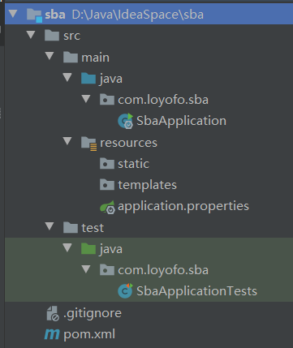

# █ Spring Boot 项目特点:

- 约定优于配置, 使用 Spring Boot 只需很少的配置, 大部分时候可以使用默认配置
- 项目快速搭建, 可以无配置整合第三方框架
- 可以完全使用 javaConfig, 不需使用可读性差的 xml 文件
- 内嵌 servlet 容器 tomcat, 可以以 jar 包形式运行
- 运行中应用状态的监控

spring boot 没有特殊的新技术, 完全是一个基于 spring 的应用, 自动配置是通过 spring 4 的 `@Condition` 注解实现的, 因此, 学习使用 spring boot 之前, 应该先对 spring 和 spring mvc 有一定的了解

# █ Spring 点睛

# 一. Spring 基础

spring 框架本身的四大原则, 所有功能设计和实现都是基于此

- 使用 POJO 进行轻量级和最小侵入式开发
- 通过依赖注入和基于接口编程实现松耦合
- 通过 AOP 和默认习惯进行声明式编程
- 使用 AOP 和模板 template 减少模式化代码

## 1. 依赖注入

在 spring 环境下, 控制反转和依赖注入是等同的概念, 控制反转是目的, 依赖注入是实现手段,

依赖注入的主要目的是为了解耦, 体现一种组合的理念.

spring 提供了 xml配置, java 配置, 注解等方式实现 Bean 的创建和注入

无论是什么配置方式, 都成为`配置元数据`, 所谓元数据就是描述数据的数据. 元数据本身不具备可执行能力, 只能通过其他代码对这些元数据进行解析后采取指定的操作. spring 容器就通过解析这些元数据, 对 bean 进行初始化, 配置和管理依赖. 

声明 bean 组件的组件有以下4个, 作为组件扫描时是等效的

- `@Component`, 声明 bean 组件, 没有明确的角色
- `@Service`, 在业务逻辑层使用
- `@Repository`, 在数据访问层使用
- `@Controller`, 在展现层使用

注入注解有以下三个, 可以自行选择, 可以用在构造器/setter/实例域上, 建议通过构造器注入

- `@Autowired`, spring 提供
- `@Inject`, JSR-330 提供
- `@Resource`, JSR-250 提供

配置类

- `@Configuration`, 声明当前类是一个配置类, 等价于 spring 的 xml 配置文件
- `@ComponentScan`, 启动组件扫描, 扫描指定包下带指定注解的类, 注册为 bean
- `@Bean`, 注解在方法上, 声明该方法的返回值需要注册为 bean, beanID 为方法名

使用 java 配置方式显式指定注入关系时, 可以在 @Bean 方法指定需要注入的参数类型, spring 会自动发现满足要求的 bean 进行注入

```java
@Bean
public A a(){ return new A(); }

// 通过参数注入 A 类型的 bean
@Bean
public B b(A a){ return new B(a); }
```

也可以在 @Bean 方法中显式调用另一个 @Bean 方法, spring 会拦截该调用并直接注入对应的 bean

```java
@Bean
public A a(){ return new A(); }

// 通过调用 @Bean 方法注入 A 类型的 bean
@Bean
public B b(){ return new B(a()); }
```

## 2. AOP

面向切面编程, 也是为了解耦. 可以让一组类共享相同的行为.

spring 支持 AspectJ 的注解式切面编程

- `@Aspect`, 声明该类是一个切面
- `@Before`, `@After`, `@AfterReturning`, `@AfterThrowing` 声明一个切点通知
- `@Around`, 声明一个环绕通知
- `@Pointcut`, 声明一个切点, 允许通过多种方式指定, 如指定 bean, 方法, 注解等. 依附在一个空方法上.
- `@EnableAspectJAutoProxy`, 开启 spring 对 AspectJ 注解支持的自动代理

# 二. Spring 配置

## 1. 作用域 Scope

可以通过 `@Scope` 注解指定 Bean 实例的作用域

- 单例, Singleton, 一个容器中只有一个该类的 Bean 实例, spring 默认
- 原型, Prototype, 每次调用都新建一个 Bean 实例
- 会话, Session, web 应用中, 每个会话共享一个 Bean 实例
- 请求, Request, web 应用中, 每个请求新建一个 Bean 实例
- 全局会话, GlobalSession, 只在 potral 应用中使用.

## 2. SpEL

spring 表达式, 支持在 xml 和注解中使用, 类似 jsp 中的  EL 表达式

## 3. Bean 的生命周期

实际开发中, 可能需要在 bean 的使用之前或之后采取某些必要的操作, spring 允许通过 java 或 xml 方式进行配置

### 1) java

使用 @Bean 注解的 initMethod 和 destroyMethod 属性

```java
public class BeanLife{
    @Bean(initMethod="init", destroyMethod ="destroy")
    public BeanLife beanLife(){}
}
```

### 2) xml

使用 bean 元素的 init-method 和 destroy-method 属性

### 3) 注解

使用 JSR-250 的 @PostConstruct 和 @PreDestroy, 需要另外引入 JSR-250 的依赖

```java
public class BeanLife{
    public BeanLife(){}
    @PostConstruct  public void init(){}
    @PreDestroy public void destroy(){}
}
```

## 4. profile


## 5. 事件

# 三. Spring 高级话题

## 1. Spring Aware

### 2. 多线程

### 3. 计划任务

### 4. 条件注解

### 5. 组合注解

### 6. Enable* 注解的原理

### 7. 集成测试

# 四. Spring MVC 基础

# █ Spring Boot

# 一. Spring Boot 入门

### 1. 概述

与逐渐流行的动态语言相比, Java EE 的开发过程非常笨重, 配置复杂, 开发效率地下, 复杂的部署流程以及第三方技术集成难度大

### 1.1. 发展历史

Spring诞生时是Java企业版（Java Enterprise Edition， JEE，也称J2EE）的轻量级代替品.

虽然Spring的组件代码是轻量级的，但它的配置却是重量级的 .

一开始, spring 使用 XML 配置, Spring 3.0 引入了基于 java 的配置, 可以取代 XML, 但很多功能仍需要显式配置


### 1.2. 核心特性

- **自动配置**

  针对很多Spring应用程序常见的应用功能， Spring Boot能自动提供相关配置 

- **起步依赖**

  告诉Spring Boot需要什么功能，它就能引入需要的库 , 简化 maven 依赖管理, 同时避免了依赖冲突等常见的问题

- **命令行界面**

  可选功能, 借此你只需写代码就能完成完整的应用程序，
  无需传统项目构建 

- **Actuator**

  深入运行中的Spring Boot应用程序 , 上下文中的 bean, 路径映射等

从本质上说, Spring Boot 就是 Spring, 只是借助 Spring 4 的条件化配置特性, 以及 Maven/Gradle 提供的传递依赖解析, 以此实现了Spring 应用程序上下文的自动配置, 完成了那些在传统 Spring 应用中由应用开发者自己完成的各种 Bean 配置. 借助 Spring Boot , 应用开发者不用再些那些样板配置, 只需专注于应用程序的逻辑. 

# 二. 创建 Spring Boot 项目 

## 1. 新建 Spring Boot 项目

### 1.1. 项目目录结构



 基本目录结构如上图所示. 基本上是遵循传统 Maven 项目的布局. 其中几个约定的目录含义如下:

- src/main/java: 存放项目的 java 代码
  - *应用名* + Application: Spring Boot 应用的启动类
- src/main/resources: 存放项目相关资源
  - static: web 应用程序的静态内容, 图片, JavaScript 等
  - templates: 页面模板文件
  - application.properties: 项目配置文件
- src/test/java: 存放项目的测试代码
  - *应用名* + ApplicationTests: 空的 JUnit 测试类, 用来进行集成 测试

### 1.2. 启动类

```java
@SpringBootApplication
public class SbaApplication {
    public static void main(String[] args) {
        SpringApplication.run(SbaApplication.class, args);
    }
}
```

启动类有两个作用, 配置和启动引导:

作为主要的配置类, `@SpringBootApplication` 注解开启了 Spring 的组件扫描和 Spring Boot 的自动配置功能, 实际上它是一个组合注解, 包括以下三个部分:

- Spring 的提供了一个 `main` 方法, 它允许我们将应用以可执行 jar 包来启动. 表明该类使用 Sprng 基于 Java 的配置
- Spring 的 `@ComponentScan`, 启用组件扫描
- Spring Boot 的 `@EnableAutoConfiguration`, 启用自动配置

作为启动类, 它提供了一个 `main` 方法, 它允许我们将应用以可执行 jar 包来启动.

通常情况下, 不需要对启动类进行任何修改. 如果需要添加其他配置, 建议使用一个单独的 `@Configuration ` 的配置类, 组件扫描将会发现并使用这些配置类.

### 1.3. 测试类

Spring Boot 默认提供了一个测试类的骨架, 同时它还是一个例子, 告诉开发者如何为 Spring Boot 应用编写测试. 

```java
@RunWith(SpringRunner.class)
@SpringBootTest
public class SbaApplicationTests {
    @Test
    public void contextLoads() {
    }
}
```

`@RunWith`

`@SpringBootTest`

`contextLoads()` 这是一个空的测试方法, 可以用来测试 spring Boot 项目配置是否正确, 项目能否正常启动并加载应用上下文. 

###  1.4. 配置属性

Spring Boot 通过一个 properties 文件或 yaml 文件来配置应用属性.

根据约定大于配置的原则, 开发者不需显示指定配置文件的路径, spring boot 默认会在以下路径查找配置文件

- src/main/resources/application.properties
- src/main/resources/application.yaml
- src/main/resources/config/application.properties
- src/main/resources/config/application.yaml

### 1.5. 构建插件

spring Boot 为 maven 和 gradle 提供了构建插件, 其主要功能有以下几个:

- **直接运行**

  通过构建插件的 `spring-boot:run ` 目标, 直接运行 spring boot 项目

- **构建超级 JAR**

  把项目打包成一个可执行的超级 JAR, 包括应用的所有依赖, 并为 Jar 添加一个描述文件, 以允许通过 `java -jar` 来运行应用程序.

### 1.6. 起步依赖

传统的 spring 项目, 开发前我们需要为项目添加依赖, 指定各个依赖的 GAV 坐标. 但是, 记住所需依赖的 GAV 坐标很麻烦, 并且很难保证彼此之间兼容不冲突. 

Spring Boot 的起步依赖就是为了解决依赖管理问题而存在. 开发者只需要选择自己需要的功能, 起步依赖就能自动选择需要的依赖, 并确保兼容不冲突. 

Spring Boot起步依赖基本都以spring-boot-starter打头，随后是直接代表其功能的名字. 起步依赖本质上是一个Maven项目对象模型（Project Object Model， POM），定义了对其他库的传递依赖，这些东西加在一起即支持某项功能。 

引入起步依赖时, 不需要指定版本号, 其版本号是由 Spring Boot 版本决定的, 选择需要的 Spring Boot 版本, 就决定了以起步依赖引入的一系列依赖的版本. Spring Boot 已经对这些依赖进行了充分测试, 确保兼容. 这对开发者而言是一种解脱, 无需关心项目需要维护哪些依赖库, 也不必担心其版本. 

如果需要手动指定某些依赖的版本, 或是排除某些传递依赖, 只需像传统的 Maven 项目一样, 在 pom 中显式声明所需版本号, 或添加 `exclusions` 元素排除.

## 2. 自动配置

spring boot 的自动配置是在应用程序启动时完成的过程. 在应用的启动过程中, spring boot 会检测相关条件是否满足, 然后根据实际情况动态决定需要配置什么内容.

Spring Boot 的自动配置, 是基于 Spring 4 引入的条件化配置实现的, 我们先来回顾一下条件化配置. 

### 2.1. 条件化配置

spring 4 提供了一个 `@Conditional` 注解, 可以用在 `@Bean` 方法上, 如果给定的条件计算结果为 `true`, 就会创建这个 bean, 否则忽略这个 bean

```java
@Bean
@Conditional(MyCondition.class)
public MyBean myBean() {
    ...
}
```

注意到 `@Conditional` 注解要求一个 `Condition` 类型的参数, `Condition` 是一个接口, 规定了 `matches()` 方法, 这个方法就是需要判断的条件. 

```java
public interface Condition {
	boolean matches(ConditionContext context, AnnotatedTypeMetadata metadata);
}
```

`matches()` 方法很简单但功能强大, 它通过传入的 `ConditionContext` 和 `AnnotatedTypeMetadata` 对象, 获取需要的信息, 从而判断是否需要满足指定条件.

- `ConditionContext` 
  - 获取并查看应用上下文中的bean
  - 获取并查看环境变量
  - 通过 ResourceLoader 探查加载的资源
  - 通过 ClassLoader  探查 classpath 下是否存在某类
- `AnnotatedTypeMetadata` 
  - 获取 @Bean 方法上的其他注解

### 2.2. spring Boot 自动配置

Spring Boot 定义多个特殊的条件化注解，并将它们用到配置类上 

在向应用程序加入Spring Boot时，有个名为 `spring-boot-autoconfigure` 的 JAR，其中包含了很多配置类. 这些配置类, 根据事先定义好的条件, 自动地配置一些模板 bean. 从而, Spring Boot 自动配置承担起配置 Spring 的任务, 应用开发者可以专注于编写业务代码. 

# 三. 自定义配置

虽然 spring boot 的自动配置非常方便, 但有时候默认配置可能不完全符合实际需求, 开发者可能会希望对应用有一些自定义的配置.

## 1. 显式配置覆盖

想要覆盖 spring boot 的自动配置非常简单, 就当自动配置不存在, 直接显式编写一段自定义的配置即可. 可以用不同的方式声明配置, java/xml/groovy 形式均可. 

spring boot 自带了很多的配置类, 而这些配置类上, `@ConditionalOnMissingBean` 注解是覆盖自动配置的关键。 

如 `jdbcTemplate()` 方法, `@ConditionalOnMissingBean` 要求当前不存在 `JdbcOperations` 的 bean 时才会生效. 

Spring Boot 的设计是先加载应用级配置(即用户的显式配置)，随后再考虑自动配置类 .若开发者在自己的配置文件中配置了一个 `JdbcOperations` , 则 spring boot 不会执行自动配置的 `jdbcTemplate()` 方法, 即忽略自动配置 jdbcTemplate bean.

```java
@Bean
@Primary
@ConditionalOnMissingBean(JdbcOperations.class)
public JdbcTemplate jdbcTemplate() {
    JdbcTemplate jdbcTemplate = new JdbcTemplate(this.dataSource);
    ...
    return jdbcTemplate;
}
```

## 2. 通过属性修改配置

虽然 spring boot 的 `@ConditionalOnMissingBean` 允许我们显示覆盖自动配置, 但很多时候我们不必这么麻烦. 如果只是修改某些具体参数, 而不是彻底放弃指定类型的 bean, spring boot 允许开发者通过外部属性对自动配置的 bean 进行配置. 

spring boot 自动配置的 bean, 提供了300多个可自定义的属性, 需要修改时, 只需在环境变量, java 系统属性, jndi, 命令行参数, 或者属性文件里进行指定就好了. 

### 2.1. 配置属性的位置

spring boot 允许多种设置方式, 按优先级排列如下, 高优先级的属性会覆盖低优先级的:

-  命令行参数
- JNDI 属性
- JVM 系统属性
- 操作系统环境变量
- 随机生成的带 `random.*` 前缀的属性(设置其他属性时可以引用)
- application.properties 或 application.yml
- 通过 `@PropertySource` 标注的属性源
- 默认属性

其中, application.properties 和 application.yml 可以放置在以下位置, 相同位置下的 yml 优先

- 外置, 相对于应用程序运行目录的 /config 子目录
- 外置, 应用程序运行目录里
- 内置, 在 classpath/config 目录下
- 内置, 在 classpath 目录下

### 2.2. 常用配置属性

#### 1) 模板缓存

Thymeleaf, FreeMarker, Groovy, velocity 等页面模板技术, 默认情况下都开启了模板缓存, 在生产环境下可以提高性能, 但在开发环境下不能及时看见更改. 为此, 可以在开发环境下关闭模板缓存, 可以将以下属性设置设为 `false`

- spring.thymeleaf.cache
- spring.freemarker.cache
- spring.groovy.template.cache
- spring.velocity.cache

#### 2) 嵌入式服务器

spring boot 的 web 应用默认嵌入了一个 tomcat, 使用 8080 端口. 如果需要对这个嵌入的 tomcat 进行配置, 可以修改以下属性

- server.port , 设置嵌入式服务器的端口
- server.ssl.key-store, 设置 https 密钥文件路径
- server.ssl.key-store-password , https 密钥文件密码
- server.ssl.key-password , https 密钥文件密码

#### 3) 日志记录

大多数应用程序都提供了某种形式的日志, 即使应用程序没有直接记录日志, 依赖的库可能也会记录它们的活动. 

默认情况下, Spring Boot 使用 Slf4j + LogBack 记录日志, 并采用 `INFO` 级别输出到控制台. 

*如果需要使用其他日志框架, 需要显式引入需要的日志框架, 并在起步依赖里排除 `spring-boot-starter-logging`* 

要完全控制 logback 配置, 可以在 classpath 下添加一个 `logback.xml` 的配置文件, 具体配置方式参考 logback 相关文档. 而 spring boot 因为使用了 logback 的扩展, 建议使用 `logback-spring.xml`, 以便充分利用 spring 对 logback 的增强配置. 

开发者对日志记录最常做的修改就是修改日志级别和指定日志文件路径, 使用 spring boot 的配置属性, 则可以在不创建 logback.xml 文件的情况下修改那些配置. 

```yml
logging:
	path: /var/logs/
	file: myapp.log
	config:
		classpath: logging-config.xml
	level:
		root: WARN
		org.springframework.security: DEBUG
```

如上例所示

- logging.path, 指定日志文件路径
- logging.file, 指定日志文件文件名
- logging.level.<logger名>, 指定 logger 的日志级别
- logging.config.classpath, 指定日志配置文件名, 这在不同环境使用不同日志配置时很有用

#### 4) 数据源

开发时可以使用 H2 嵌入式数据库, 但在生产环境, 通常会使用 mysql 或 oracle 等外部数据库

```yaml
spring:
	datasource:
		type: com.zaxxer.hikari.HikariDataSource
		driver-class-name: com.mysql.jdbc.Driver
		url: jdbc:mysql://localhost/test
		username: dbuser
		password: dbpass
```

不通过 `spring.datasource.type` 指定数据源连接池时, spring 按照以下顺序在 classpath 下寻找合适的连接池. 其中 HikariCP 是 spring Boot 默认引入的依赖, 而 tomcat 需要手动添加, 因此通常情况下, spring boot 项目默认使用 HIkariCP 作为数据源连接池. 

- tomcat
- HikariCP
- DBCP 2

通常无需指定 JDBC 驱动, spring boot 会根据数据库 URL 识别出需要的驱动, 但是如果识别结果不满足需要, 可以通过 `spring.datasource.driver-class-name ` 指定

Spring Boot 还支持通过 `spring.datasource.jndi-name ` 在 jndi 中获取数据源, 一旦指定该属性, 其他的数据源连接属性都会被忽略. 

#### 5) 自定义属性

应用程序中常常需要设置一些不宜硬编码的变量, spring boot 允许在配置文件中添加自定义属性作为变量的值, 以便在程序启动时自动注入. 

Spring Boot的属性解析器非常智能，它允许使用不同的命名风格, 小驼峰/连字符/下划线等命名方式都是等效的, 通常情况下可以自由选择自己喜欢的命名风格. 只有极个别的属性, 可能会作为 map 中的 key, 这种情况下必须使用指定的命名风格( 如 spring cloud eureka 的 defaultZone 必须使用小驼峰式).

1. 定义一个类, 包含需要的属性作为实例域, 并提供 set 方法

2. 添加 `@ConfigurationProperties` 注解, 通过 `prefix` 指定需要的配置属性前缀

   ```java
   @ConfigurationProperties(prefix="myapp")
   public class MyProperties {
       private String value;
   
       public void setValue(String value) {
           this.value = value;
       }
   }
   ```

3. 在 `application.properties`文件中添加 `myapp.value` 属性

   ```yaml
   myapp.value=自定义的属性
   ```

4. 开启配置属性. 从技术上说, `@ConfigurationProperties` 默认不会生效, 它依赖于 `@EnableConfigurationProperties` 注解, 只有添加该注解后, 属性注入才会生效. 但实际上, spring boot 的自动配置类中已经提供了该注解, 因此应用开发者不需要自行显式添加 `@EnableConfigurationProperties`

## 3. profile

将应用部署到不同的运行环境时, 一些具体的配置参数通常会有所不同. 

spring 3 开始支持通过指定不同的 profile 来为不同环境指定配置. profile 是一种条件化配置, 基于运行时激活的 profile, 会使用或忽略不同的 Bean 或配置类.

`spring.profiles.active` 属性用来激活指定的 profile, 可以通过任意一种设置属性的方式选择计划的 profile. 如 jvm 参数, 环境变量,  `application.properties` 或 `application.yml`等.

为了在激活指定 profile 时使得指定配置内容生效, 就需要为每个环境分别创建配置. 可以采用以下几种方式

### 3.1. @Profile 注解

可以在 `@Configuration` 配置类或 `@Bean` 方法上使用 `@Profile` 注解, 通过其 `value` 属性指定需要的 profile. 当注解指定的 profile 被激活时, 该配置生效. 否则被忽略.

如下代码所示, 在激活不同 profile 时, 创建不同的 DataSource bean.

```java
@Profile("mysql")
@Bean
public DataSource mysqlDs() {...}

@Profile("h2")
@Bean
public DataSource h2Ds() {...}
```

### 3.2. properties 文件

如果选择使用 `application.properties` 文件为 spring boot 指定配置属性, 可以创建额外的属性文件, 文件名为 `applicati-{profile}.properties`, 在不同的 properties 文件中提供特定的属性值, 这些属性会在激活对应的 profile 时使用.

而对于不特定于某个 profile, 或是所有环境共用的配置内容, 则可以继续放在原来的 `application.properties` 文件中.  

即应用可能会拥有这样多个 properties 文件:

- application.properties, 记录通用的配置内容
- application-dev.properties, 记录开发环境专用的配置内容
- application-test.properties, 记录测试环境专用的配置内容
- application-prod.properties, 记录生产环境专用的配置内容

### 3.3. yaml 文件

如果选择使用 `application.yml` 文件的方式进行属性配置, 则可以遵循与 `properties` 文件相同的命名规则创建多个 yaml 配置文件, 如

- application.yml, 记录通用的配置内容
- application-dev.yml, 记录开发环境专用的配置内容
- application-test.yml, 记录测试环境专用的配置内容
- application-prod.yml, 记录生产环境专用的配置内容

但 `yaml` 配置还提供了另外一种方式, 可以将所有 profile 的配置属性都放在同一个 `application.yml` 中. 多 profile 的 yaml 文件遵循以下规则:

- 使用三个横杠 `---` 将配置文件分成多个段
- 通用配置放在 yaml 文件的第一段
- 后续段落分别对应一个 profile, 该段的开头用 `spring.profiles` 属性声明所属的 profile
- 每个 profile 的段中定义该 profile 要使用的属性

```yaml
# 通用的配置内容
logging:
	level:
		root: INFO
---
# 开发环境专用的配置内容
spring:
	profiles: development
	
logging:
	level:
		root: DEBUG
---
# 生产环境专用的配置内容
spring:
	profiles: production
	
logging:
	path: /tmp/
	file: myapp.log
	level:
		root: WARN
```

## 4. 自定义错误页

spring boot 默认提供一个 whitelabel 的错误页, 是自动配置的一部分. 为了让错误页面更加友好, 可以为应用指定一个自定义的错误页. 

默认情况下, Spring Boot 自动配置的默认错误处理器, 会查找名为 `error` 的视图, 如果找不到就使用默认的白标视图, 如下所示.


自定义错误页的最简方式, 就是创建一个自定义视图, 让其视图名为 `error`, 即将自定义错误页放置在 src/main/resources/templates 目录下

- Thymeleaf: src/main/resources/templates/error.html
- FreeMarker : src/main/resources/templates/error.ftl
- Velocity : src/main/resources/templates/error.vm

# 四. 测试

软件开发过程中, 良好的测试体系非常重要. spirng 鼓励松耦合, 接口驱动的设计, 在进行单元测试的时候, spring 通常不需要介入, 需要的依赖可以通过 mock 方式创建. 但是, 集成测试需要用到 Spring, 如果生产应用通过 spring 来配置并组装组件, 那么集成测试也应该借助 spring 来完成这些工作. 

## 1. spring 集成测试

```java
@RunWith(SpringJUnit4ClassRunner.class)
@ContextConfiguration(classes = {RootConfig.class})
public class SpringTest {

    @Autowired
    private HelloService helloService;

    @Test
    public void testGetAll() {
        Clazz expected = new Clazz();
        expected.setClassName("终极一班");
        expected.setId(1);
        expected.setStudentAmount(5);

        Clazz actual = helloService.getClazz("1");
        Assert.assertEquals(expected, actual);
    }
}
```

以上例子关键说明如下

- `@RunWith`

  junit 提供的这个注解, 可以通过参数指定运行器, 而 spring 的`SpringJUnit4ClassRunner.class` 开启了 Spring 集成测试支持. 

  Spring 4.2 起, 可以选择基于规则的 `SpringClassRule` 和 `SpringMethodRule`. 

  Spring 4.3 起, 提供了`SpringRunner.class`, 与 `SpringJUnit4ClassRunner.class` 完全等效, 只是名字更短.

- `@ContextConfiguration`

  Spring 提供的这个注解, 可以通过参数指定应用上下文的配置文件.

  `value/location` 参数指定 xml 配置文件, `classes` 属性指定 javaconfig 配置文件. 

- junit + spring 集成测试配置完成后, 就可以按 spring 的依赖注入的方式, 通过 `@Autowired` 注入需要测试的组件, 然后在具体的测试方法中编写测试代码.

## 2. spring Boot 集成测试

虽然 `@ContextConfiguration` 可以加载 spring 应用上下文, 但是并没有加载完整的 Spring Boot 应用. Spring Boot 应用最终是由 `SpringApplication` 加载的, 它不仅加载了应用上下文, 还会开启日志, 加载外部属性, 以及其他的 Spring Boot 特性. 

为了获取完整的 Spring Boot 特性, 可以将 Spring 的 `@ContextConfiguration` 替换为 Spring Boot 提供的 `@SpringApplicationConfiguration`, 其用法与前者基本一致. 在 Spring Boot 1.4 及后续版本中, 该注解被 `@SpringBootTest` 注解取代, 因此我们采用 `@SpringBootTest` 注解来加载完整的 Spring Boot 应用.

`@SpringBootTest` 提供以下功能:

- 未使用 `@ContextConfiguration` 指定应用上下文时, 默认使用 `SpringBootContextLoader` 加载 Spring Boot 应用上下文.
- 当不使用 `@Configuration` (含组合注解), 且不使用`classes` 属性指定配置类时，自动搜索带`@SpringBootConfiguration` 注解的配置类
- 使用 `properties/value` 属性定义自定义环境属性
-  `webEnvironment` 属性指定对不同测试模式的支持, 包括能够启动一个完全运行的容器，侦听一个定义的或随机端口. 默认为 MOCK 方式, 不启动 web 容器.
- 注册用于 web 测试的 `TestRestTemplate` bean

```java
@RunWith(SpringRunner.class)
@SpringBootTest
public class BootTest {

    // 注入 srping boot 应用上下文
    @Autowired
    private WebApplicationContext webContext;
    private MockMvc mockMvc;

    // 构造 mockmvc
    @Before
    public void setupMockMvc() {
        mockMvc = MockMvcBuilders
                .webAppContextSetup(webContext)
                .build();
    }

    // mockmvc 测试
    @Test
    public void homePage() throws Exception {
        mockMvc.perform(get("/hello/hello"))
                .andExpect(status().isOk())
                .andExpect(view().name("hello2"))
                .andExpect(model().attributeExists("msg"))
                .andExpect(model().attribute("msg", "测试获取信息"));
    }
}
```

如上所示, 通过 `@SpringBootTest` 注解开启 spring boot 集成测试, 自动搜索相应的配置类加载 spring boot 应用上下文, 并使用默认的 mock 方式进行测试. 

进行 mock 测试之前, 需要将应用上下文注入, 并在 junit 的 `@Beafore` 初始化方法通过 `MockMvcBuilders` 构造一个 mockMvc 的实例, 后续的 `@Test` 方法通过这个 mockMvc 实例进行 mockMvc 测试.

**注意**: *构造 mockMvc 时, 要求注入的上下文类型为 `WebApplicationContext`, 在 spring boot 1.4 以前, 需要通过 `@WebAppConfiguration` 声明, 才能保证 SpringJUnit4ClassRunner 创建的应用程序上下
文是一个 WebApplicationContext.*

*而在 1.4 及后续版本中, `@SpringBootTest` 注解的 `webEnvironment` 属性默认值为MOCK, 会在 classpath 存在 `servlet-api` 时自动创建 webApplicationContext, 故可以省略 `@WebAppConfiguration`*

## 3. spring boot 容器测试

前面的测试都是 mock 测试, 并没有像生产环境一样真正的将应用部署到 servlet 容器中. 而 Spring Boot 支持将 Tomcat 或 Jetty 等嵌入式容器作为运行中的应用程序的一部分, 从而允许通过真正的 http 请求来测试应用. 

`@SpringBootTest` 注解有一个 `webEnvironment` 属性, 通过这个属性, 就可以启动一个嵌入式的 servlet 容器, 通过真正的 http 请求来进行测试.

`webEnvironment` 有四个可选的值

- MOCK, 默认, 使用 web 应用上下文, 不使用嵌入式容器, 通过 mock 方式进行测试
- NONE, 使用普通应用上下文, 不能进行 web 测试
- RANDOM_PORT, 使用 web 应用上下文, 启动嵌入式容器, 在随机端口上进行真实 http 请求测试
- DEFINED_PORT, 使用 web 应用上下文, 启动嵌入式容器, 在指定端口上进行真实 http 请求测试

如果需要启动嵌入式容器 tomcat, 只需要将 `webEnvironment`  修改为 `DEFINED_PORT` 即可, 其端口为 `server.port` 属性指定的值, 若未指定则使用 tomcat 默认端口 8080.

```java
@RunWith(SpringRunner.class)
@SpringBootTest(webEnvironment = SpringBootTest.WebEnvironment.DEFINED_PORT)
public class BootTest {
    @Test(expected = HttpClientErrorException.class)
    public void pageNotFound() {
        try {
            RestTemplate rest = new RestTemplate();
            rest.getForObject(
                "http://localhost:8083/noPage", String.class);
            Assert.fail("Should result in HTTP 404");
        } catch (HttpClientErrorException e) {
            Assert.assertEquals(HttpStatus.NOT_FOUND, e.getStatusCode());
            throw e;
        }
    }
}
```

若需要使用随机端口, 则将 `webEnvironment`  修改为 `RANDOM_PORT`, 并在测试类中注入该端口. 为了方便, spring 提供了 `local.server.port` 属性, 值为 servler 容器当前使用的端口.

然后在发起请求时, 指定占位符`{port}`, 并提供具体参数

```java
@RunWith(SpringRunner.class)
@SpringBootTest(webEnvironment = SpringBootTest.WebEnvironment.RANDOM_PORT)
public class RandomTomcatTest {

    // 注入当前容器端口
    @Value("${local.server.port}")
    private int port;

    @Test(expected = HttpClientErrorException.class)
    public void pageNotFound() {
        try {
            System.out.println("当前随机端口为: " + port);
            RestTemplate rest = new RestTemplate();
            // 使用占位符{port}, 并在最后提供具体参数值
            rest.getForObject("http://localhost:{port}/noPage", String.class, port);
            Assert.fail("Should result in HTTP 404");
        } catch (HttpClientErrorException e) {
            Assert.assertEquals(HttpStatus.NOT_FOUND, e.getStatusCode());
            throw e;
        }
    }
}
```

启动容器的集成测试, 是测试 REST 端点的理想工具, 但是对于返回 html 页面的 URL, 想要判断其结果是否符合预期非常困难,  通常需要借助 `Selenium `, 详情参考相关文档, 在此不做讨论.

# 五. Actuator 监控

# 六. 项目部署

spring boot 项目可以通过以下4种方式启动

- 在开发工具 IDE 中启动
- 使用 maven 插件 spring-boot:run, 在命令行里运行
- 使用 maven 生成可运行的 JAR 文件, 然后通过 `java -jar` 命令启动
- 在 spring boot CLI 在命令行中运行 groovy 脚本
- 在 Spring boot CLI 来生成 JAR 文件, 然后通过 `java -jar` 命令启动

以上的几种方式, 只有 IDE 启动无法应用到生产, 其他方式都可以用来部署生产环境应用. 

如果希望将应用部署到更加传统的应用服务器环境里, 比如独立的 tomcat, 这时可运行的 JAR 和 spring boot CLI 都不合适, 因为应用服务器需要一个 `war` 包. 而想要将 spring boot 应用打包成 war 包, 只需要在 maven 的 pom.xml 中将 `<packaging> ` 指定为 `war` 即可. 

同时, 这个 war 包保留了 `main()` 方法, 说明它依旧可以通过 `java -jar` 命令启动.

