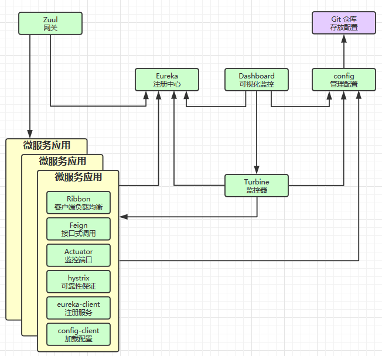

# █ Spring Cloud █ 

# 一. 概述

Spring Cloud 是微服务架构一套完整解决方法, 包含了多个组件, 是一个整体, 不是特指某一个软件(类似于Microsoft Office, 是一套软件包), 常用的组件包括以下几个

| 名称     | 功能                  | 特点                                             |
| -------- | --------------------- | ------------------------------------------------ |
| eureka   | 服务注册与发现        | 分服务端与客户端                                 |
| Actuator | 服务状态监控          | 提供许多监控端点, 通过端点可以了解服务的运行状态 |
| Ribbon   | 客户端侧的负载均衡    |                                                  |
| Feign    | 声明式的Rest 接口调用 |                                                  |
| Hystrix  | 服务容错与监控        |                                                  |
| Config   | 统一管理服务配置      |                                                  |
| Zuul     | 微服务网关            |                                                  |

# 二. Eureka

## 1. 服务端

### 1) 高可用

### 2) 心跳保持

### 3) 自我保护模式

## 2. 客户端

## 3. 元数据

# 三. Actuaor

提供了许多监控端点(访问接口), 通过这些端点, 可以了解服务的运行情况

# 四. Ribbon

客户端侧的负载均衡

## 1. 自定义配置

### 1) 通过 java 代码自定义

### 2) 通过配置属性自定义

### 3) 饥饿加载

## 2. 脱离 eureka 使用 ribbon

# 五. Feign

提供声明式的 Rest 调用方式

## 1. 基本使用

### 1.1. 基本类型参数

### 1.2. 对象参数

### 1.3. Map 封装参数

## 2. 自定义配置

### 2.1. 通过 java 代码自定义

### 2.2. 通过配置属性自定义

## 3. 进阶使用

### 3.1. 继承

### 3.2. 压缩

### 3.3. 文件上传

### 3.4. 日志

# 六. Hystrix

