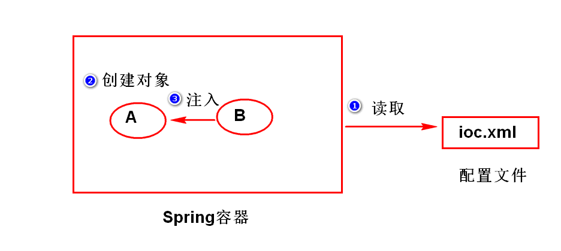
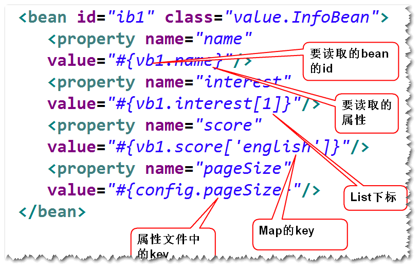

# █ Spring 核心

# 一. 概述

Spring 是一个开源的, 轻量级的开源框架, 最早由 Rod Johnson 创建, 致力于简化 java 开发, 而且是全方位的简化 java 开发. Spring 提供了 **IOC** 和 **AOP** 功能, 能降低项目组件间的耦合度, 便于日后维护与升级. 其本质是管理软件中的对象, 即创建并维护对象之间的关系

Spring 为系统提供了一个整体的解决方案, 开发者可以利用它本身提供的功能, 也可以与第三方框架和技术整合应用.

- 基于**POJO**的轻量级和**最小侵入式**编程
- 通过依赖注入和面向接口实现**松耦合**
- 基于切面和惯例进行**声明式编程**
- 通过切面和模板减少样板式代码

## 1. POJO 最小侵入式

许多框架, 要求应用代码继承框架的某些类, 或是实现框架提供的某些接口, 从而导致应用和框架的绑定.

而 Spring 尽量避免应用代码与框架 API 发生耦合, 不需要继承 spring 的类或实现 spring 的接口. 大多数应用组件都只需要使用 spring 提供的注解, 但组件本质上仍是一个 POJO.

## 2. 依赖注入

处理实际业务的应用, 都会由多个类组成, 这些类相互协作来完成特定的业务逻辑.

耦合具有两面性: 

- 一方面, 紧密耦合的代码难以测试, 难以复用, 难以理解. 
- 另一方面, 一定程度的耦合又是必须的, 不同的类需要以适当的方式进行交互

传统做法中, 每个类需要管理与自己相互协作的对象 (即它所依赖的对象) 的引用. 会导致两个类的高度耦合. 而通过**依赖注入 (Dependency Injection, DI**), 对象的依赖关系将由系统中的专门组件负责协调, 在创建对象的时候进行设定.

创建应用组件之间协作的行为称为**装配 (wiring)**, Spring 通过**应用上下文 (Application Context)**全权负责对象的创建和组装, 装载 bean 的定义. Spring 提供了多种应用上下文的实现, 区别在于如何加载配置. 

## 3. 面向切面编程

DI 依赖注入让相互协作的软件组件保持松散耦合, 而**面向切面编程 AOP**则允许开发者把遍布应用各处的功能分离出来, 形成可重用的组件.

在一个完整的系统中, 除了实现自身核心的业务功能之外, 还需要许多诸如日志, 事务管理, 安全校验等系统服务的功能, 这些系统服务常常融入到自身具有核心业务逻辑的组件中去. 这样的系统服务通常被称为横切关注点, 因为他们会跨越系统的多个组件, 可能会带来额外的复杂性 

- 实现系统关注点功能的代码会重复出现在多个组件中
- 业务功能组件会因为那些与业务逻辑无关的代码而变得混乱

AOP 能够使这些服务模块化, 并以声明的方式将它们应用到需要影响的组件中去. 

## 4. 通过模板消除样板代码

spring 为了消除样板代码, 封装了多个模板. 通过使用 spring 提供的 jdbcTemplate, jmsTemplate 等模板, 可以大大减少样板代码的出现.

# 二. bean 与容器

## 1. Spring 容器

在 Spring 应用中, 对象存在于 spring **容器 (container)**中. 容器是 spring 框架的核心, 负责创建对象, 装配对象, 配置并管理它们的整个生命周期. spring 容器使用 DI 管理构成应用的组件, 它会创建相互协作的组件之间的关联. 

spring 自带多个容器实现, 分成两种类型

- **bean 工厂 (BeanFactory)**, 最简单的容器, 提供基本的 DI 支持.
- **应用上下文 (ApplicationContext)**, 基于工厂构建, 并提供应用框架级别的服务.

通常使用应用上下文. 不同的应用上下文作用类似, 区别在于其配置方式的不同

- **Annotation**ConfigApplicationmContext: 通过 java 配置的 spring 应用上下文

- **Annotation**Config**Web**ApplicationContext: 通过 java 配置的 spring web 应用上下文

- **ClassPathXml**ApplicationContext: 通过 `classpath` 下的 xml 配置

- **FileSystemXml**ApplicationContext: 通过文件系统中的 xml 配置

- **XmlWeb**ApplicationContext: 由 xml 配置的 web 应用上下文

```java
// 通过文件系统中的 xml 配置文件创建应用上下文
ApplicationContext context1 = new FileSystemXmlApplicationContext("c:/fileSystem.xml");

// 通过 classpath 下的 xml 配置文件创建应用上下文
ApplicationContext context2 = new ClassPathXmlApplicationContext("classpath.xml");

// 通过 java 配置类创建应用上下文
ApplicationContext context3 = new AnnotationConfigApplicationmContext("Config.class");
```

## 2. bean

由 spring 管理的这些组件/对象, 被称为 **bean**. 不论从什么方式装载的应用上下文, 通过应用上下文获取 bean 对象的过程是相似的: 先获取相应的应用上下文, 然后就可以通过应用上下文的 `getBean()` 方法从 spring 容器中获取 bean.

1. 首先在容器配置文件中添加 Bean 定义

   ```xml
   <bean id="BeanId" class="包名.类名" />
   ```

2. 在创建容器实例后, 调用 getBean() 方法获取 Bean 的实例. 

   其中`类名.class` 是通过反射, 获取方法区中的 class 对象, 用于指定获取对象的类型

   ```java
   // 通过 classpath 下的 xml 配置文件创建应用上下文
   ApplicationContext ac = new ClassPathXmlApplicationContext("classpath.xml");
   ac.getBean("BeanId", 类名.class)
   // 如果一个类只有一个对应的 BeanId, 则 BeanId 可以省略, 即
   // ac.getBean(类名.class)
   ```

# 三. bean 的生命周期

## 1. Bean 的创建

Spring 采用了工厂模式. 

从本质上讲, Spring 的容器是一个维护 Bean 定义以及相互依赖关系的高级工厂接口, 通过指定 beanID, 并给定相应的类型, BF 或 AC 可以访问 Bean 定义, 获取 bean 对象.

- 工厂模式 : 采用工厂方法去获取对象, 而不使用常规的 new
- 工厂方法 : 一类特殊的方法, 可以根据要求返回一个对象

  - 静态工厂方法 : 由 static 修饰, 调用时不需创建所在类的对象
  - 实例工厂方法 : 需要先创建所在类的一个对象, 再由对象去调用方法

Spring 可以通过以下三种方式配置并获取 Bean 对象

```xml
<!-- 1.指定bean类型, 通过构造器获取对象, 默认使用无参构造, 提供参数时使用有参构造 -->
<bean id="stu1" class="day01.Demo2_Student" />
<bean id="date" class="java.util.Date" />	
 
<!-- 2.指定工厂类和静态工厂方法, 通过静态工厂方法获取对象 -->
<bean id="cal" class="java.util.Calendar" factory-method="getInstance" />

<!-- 3.指定工厂bean和实例工厂方法, 通过实例工厂方法获取对象 -->
<bean id="time" factory-bean="cal" factory-method="getTime" />
```

执行类:

```java
ApplicationContext ac = new ClassPathXmlApplicationContext("applicationContext.xml");

// 采用无参构造获取的 bean, 实际调用的是 new Date()
Date d = ac.getBean("date", Date.class);

// 采用静态工厂方法获取 bean, 实际调用的是 Calendar.getInstance()
Calendar c = ac.getBean("cal", Calendar.class);

// 采用实例工厂方法获取 bean, 实际调用的是 cal1.getTime()
Date t = ac.getBean("time", Date.class);
```

## 2. Bean 的命名

在 Spring 容器中, 每个 Bean 都有自己的名字( 即 ID, 唯一的标识符 ), 该名字可以用 bean 元素的`id`或`name`属性指定.

在给 bean 定义好 ID 后, 可以通过 `<alias>` 元素指定别名, 可以通过别名访问到同一个 bean

```xml
<bean id="beanID" class="包名.类名" />
<alias name="beanID" alias="bean别名">
```

## 3. 作用域

可以通过 bean 元素的 `scope` 属性指定作用域, 默认采用单例模式创建对象,

```xml
<bean id="bean名" class="包名.类名" scope="作用域" />
```

- **singleton** : 单例模式, 无论执行 getBean 多少次, 都返回同一个对象
- **prototype** : 原型模式, 每执行一次 getBean, 就创建一个 bean 对象
- request : 在一次HTTP请求中, 一个bean定义对应一个实例, 仅限于WEB环境
- session : 在一个HTTP Session中,一个bean定义对应一个实例, 仅限于WEB环境
- global Session : 在全局的 HTTP Session中, 一个bean对应一个实例, 仅在基于portlet的WEB应用中

单例模式的具体说明

- 一个类对应一个 BeanID, 则无论调用几次 getBean, 只有一个实例
- 一个类拥有多个 BeanID, 则该类每个 BeanId 可以拥有一个实例
- 一个类拥有一个 BeanID, 并通过 alias 获取别名, 共用一个实例

## 4. 延迟加载 (懒汉/饿汉)

默认情况下, 容器启动之后, 会将作用域为 singleton 的 bean 对象创建好 (饿汉模式)

延迟加载时, 容器启动之后, 不会自动创建 bean 对象, 调用 `getBean()` 方法才会创建 (懒汉模式)

```xml
<bean id="bean名" class="包名.类名" lazy-init="true" />
```

## 5. 生命周期回调

Spring 容器会管理对象的生命周期, 包括对象的创建, 初始化, 销毁等过程

### 5.1. 初始化方法

容器创建好 bean 的实例后, 会立即调用初始化方法

支持单例与多例的 bean, 每创建一个对象, 就会调用一次

```xml
<bean id="bean名" class="包名.类名" init-method="方法名" />
```

### 5.2. 销毁方法

容器关闭的时候, 要销毁对象, 在此之前还要先执行销毁方法, 只能作用于单例模式的 bean, 否则失效

```xml
<bean id="bean名" class="包名.类名" destroy-method="方法名" />
```

ApplicationContext 接口未提供关闭的方法, 由其子类 AbstractApplicationContext 提供

```java
AbstractApplicationContext aac = (AbstractApplicationContext) ac;
aac.close();
```

### 5.3. 默认方法

在顶级的 `<beans>` 元素中, 可以通过 `default-init-method` 属性, 或 `default-destroy-method` 属性对容器中所有 bean 指定初始化回调方法和销毁回调方法

```xml
<beans default-init-method="初始化方法"　default-destroy-method="销毁方法" >
　　< bean id="bean名" class="包名.类名"/>
</beans>
```

# 四. Spring IOC

## 1. IOC 与 DI

### 1.1. IOC 

- Inversion of Control 控制反转
- IOC 是一种思想, 指程序中获取对象的方式发生反转, 不是传统的new. 而是由第三方框架创建, 由容器注入成员 Bean, 外部注入依赖关系( DI ), 以降低耦合度
- Spring 采用 DI 方式实现 IOC, IOC 是 Spring 框架的基础和核心.
- IOC 是目标, DI 是手段.



### 1.2. DI

Dependency Injection  依赖注入

将成员 Bean 对象, 以构造/方法参数方式, 注入主对象, 建立依赖关系

容器的工作就是创建 bean 时注入这些依赖关系

DI 是实现 IOC 的主要技术途径, 有两种注入方式 :

1. Setter 注入
2. 构造器注入

## 2. 手动装配

### 2.1. Setter 注入

容器先通过无参构造创建了主 Bean, 再根据`<property>`元素的`name`属性调用 setter 方法注入成员 Bean.

```xml
<bean id="主BeanID" class="主bean类名">
　　<property name="bean属性" ref="成员beanID" />
</bean>
```

### 2.2. 构造器注入

在创建主 bean 的时候, 通过`<constructor-arg> `元素注入成员 bean, 再调用含参构造方法

```xml
<bean id="主BeanID" class="主Bean类名" >
    <!-- 可以通过构造参数下标(index)确定注入目标, 下标从0开始 -->
    <constructor-arg index="构造参数下标" ref="成员BeanID"/>
    <!-- 可以通过构造参数名(name)确定注入目标 -->
    <constructor-arg name="构造参数名" ref="成员BeanID"/>
</bean>
```

### 2.3. 直接量注入

#### 1) 基本类型

可以通过字符串, 指定`<value>` 元素或者`value`属性属性或构造器参数的值. 容器将字符串从 String 类型转换为实际类型后注入

```xml
<bean id="beanID" class="包名.类型" >
    <property name="成员变量">
        <!-- 使用 value 元素指定值 -->
        <value>基本类型值</value>
    </property>
</bean>

<bean id="beanID" class="包名.类型" >
    <!-- 使用 value 属性指定值 -->
    <property name="成员变量" value="基本类型值" />
</bean>
```

#### 2) 集合类型

通过`<list>`, `<set>`, `<map>`, `<props>`等元素, 可以定义或设置与 Java 中对应的 List, Set, Map, Properties 类型的属性值, 给 bean 注入一个集合.

```xml
<Bean id="主beanID" class="包名.类型" >
　　<property name="成员变量名">
　　　　<!-- 通过 list/set/map/props 等元素声明的集合 -->
　　</property>
</bean>
```

- 最外层 bean 元素是主 Bean 定义, 指定主 BeanID 和 类型
- 第二层`<property>`元素是主 Bean 对象的各个成员属性, 用`name`属性指定成员变量名
- 最内层是具体的集合具体数据, 其格式根据集合类型决定

具体示例如下

- 实体类

  ```java
  public class ValueBean {
  	private String name;
  	private int age;
  	private List<String> interest;
  	private Set<String> city;
  	private Map<String,Double> score;
  	private Properties db;
      // 省略基本方法
  }
  ```

- bean配置

  ```xml
  <bean id="vb" class="day02.D7_zValueBean" >
      <!-- List 和 Set 类型用 value 元素指定具体的值 -->
      <property name="interest">
          <list>
              <value>唱歌</value>
              <value>跳舞</value>
              <value>撩妹子</value>
          </list>
      </property>
      <property name="city">
          <set>
              <value>北京</value>
              <value>南京</value>
              <value>南京</value>
          </set>
      </property>
      
      <!-- Map 使用 entry 元素的 key 属性指定键, 用 value 属性指定值 -->
      <property name="score">
          <map>
              <entry key="英语" value="90"/>
              <entry key="数学" value="85"/>
          </map>
      </property>
      
      <!-- Properties 使用 prop 元素的 key 属性指定键, 由标签的内容指定值 -->
      <property name="db">
          <props>
              <prop key="username">luojbin</prop>
              <prop key="password">lucky</prop>
          </props>
      </property>
  </bean>
  ```

#### 3) 注入集合的引用

除了以元素直接量的方式将集合注入, 也可以先将集合封装成 Bean, 再将 Bean 的引用注入
注: 封装集合 Bean 时, 其外层标签要加上 util: 命名空间前缀

##### a) ListBean 和 SetBean

list 和 set 采用 value 标签指定集合元素的值
定义 ListBean

```xml
<util:list id="ListBean">
　　 < value> 元素 < /value>
</util:list>
```

定义 SetBean

```xml
<util:set id="SetBean">
　　 < value> 元素 < /value>
</util:set>
```

##### b) mapBean 和 propsBean

Map 使用 entry 元素的 key 属性指定键, 用 value 属性指定值
Properties 使用 prop 元素的 key 属性指定键, 由标签的内容指定值
定义 mapBean

```xml
<util:map id="mapBean">
　　 <entry key="键" value="值" />
</util:map>
```

定义 propsBean

```xml
<util:properties id="propsBean">
　　 < prop key="键"> 值 < /prop>
</util:properies>
```

##### c) 引用方式注入集合bean

定义了集合 Bean 后, 使用主 Bean 的 property 标签将集合 bean 的引用注入.
其中的 ref 属性用来指定要注入的集合的 BeanID

```xml
<bean id="主beanID" class="包名.类型" >
　　< property name="成员变量名" ref="集合BeanID" />
</bean>
```

4) 案例: 注入集合的引用

先定义集合 Bean

```xml
<util:list id="interestBean">
    <value> 吃酒 </value>
    <value> 喝烟 </value>
</util:list>
<util:set id="cityBean">
    <value> 北京 </value>
    <value> 南京 </value>
    <value> 南京 </value>
</util:set>
<util:map id="scoreBean">
    <entry key="English" value="90" />
    <entry key="Math" value="85" />
</util:map>
<util:properties id="dbBean">
    <prop key="username">luojbin</prop>
    <prop key="password">lucky</prop>
</util:properties>
```

注入集合Bean的引用

```xml
<bean id="zvb" class="day02.D7_zValueBean" >
    <property name="interest" ref="interestBean" />
    <property name="city" ref="cityBean" />
    <property name="score" ref="scoreBean" />
    <property name="db" ref="dbBean" />
</bean>
```

#### 4) 注入 properties 文件内容

##### 1) 什么是 properties 文件

properties 文件是一个纯文本文件, 里面以键值对形式存储项目参数
使用 properties 文件可以避免把参数都在代码中写死, 以便在后期修改项目参数
properties 格式要求:

1. 以键值对形式编写, 每行一个键值对, 用 等号 隔开
2. 不随意空格, 行首, 等号两侧, 结尾, 均不能添加空格
3. key, value 都不用加引号
4. 使用 # 开头的行是注释行

2) 配置 properties bean


使用 < util:properties> 标签配置, location:指定属性文件的位置
注：classpath, 表示让容器依据类路径去查找属性文件。
容器会读取指定位置的文件的内容并且将这些内容存放到 Properties 对象里面

```xml
<util:properties id="config" location="classpath:文件路径"/>
```

## 3. 自动装配

Spring IOC 容器可以自动装配 bean 之间的关联关系, 减少 xml 注入配置工作

可以通过 `autowire` 属性启用自动装配, 默认为`no`, 建议采用 `byName` 方式, 避免冲突

```xml
<bean id="beanID" class="包名.类名" autowire="自动装配方式" />
```

| 属性值        | 说明                                                         |
| ------------- | ------------------------------------------------------------ |
| `no`          | **默认值**, 不进行自动装配                                   |
| `autodetect`  | 自动选择 byType 或 constructor 方式, 有无参构造则采用 ByType |
| `byName`      | 通过成员变量的变量名, 查找 BeanID, 没找到则为null            |
| `byType`      | 通过成员变量的类型, 查找相应的 Bean, 没找到则为null, 多个则报错 |
| `constructor` | 通过构造器参数类型, 查找 Bean                                |

#### Spring 表达式

Spring 提供了 Spring 表达式, 类似于 EL 表达式, 可以方便地获取一个 Bean 对象中封装的数据.



1) 获取属性的值
当要读取的数据, 是 Bean 对象的属性值时( 包括基本类型和引用类型 ), 使用以下方式读取
＃{ BeanID.属性名 }
2) 获取集合的一个元素
当要获取的数据, 是集合中的一个元素时, 通过集合下标指定要获取的值
＃{ BeanID.集合属性名[下标] }
3) 获取映射的值
当要获取的数据, 是映射中的一个键值对的值时, 通过键指定要获取的值
＃{ BeanID.映射属性名[键] }
4) Properties
当要获取的数据, 是 Properties 配置文件中的一个键值对的值时, 通过键指定要获取的值
＃{ PropsID.键 }
6. 注入 null 或空字符串
6.1. null
如果需要注入 null, 要采用 < null /> 元素
`< property name="键"> < null /> < /property>`
6.2. 空字符串
Spring 将属性的空参数当做空字符串
`< property name="键" value="" />`

三. 基于注解的组件扫描
1. 组件扫描
1.1. 什么是组件扫描
指定一个包路径, Spring 启动以后, 就会扫描指定的包及其子包中的所有组件类, 如果组件类有特定的注解, 如 @Component,
就会将该组件类作为一个 bean 纳入容器中管理.
组件扫描相当于在配置文件中批量定义 bean 元素
1.2. 配置组件扫描
使用组件扫描, 首先要在 xml 配置中指定要扫描的包名.

```xml
< context:component-scan base-package="要扫描的包名" />
```

组件类的注解
指定了扫描类路径后, 并不是该路径下的所有组件类都被视为 Bean 纳入到 Spring 容器中统一管理, 还要在组件类上添加特定
的注解.
支持 Component, Controller, Repository, Service, 其效果都一样, 为了提高程序可读性而设置多个.
通过组件类的注解, 可以对 bean 进行设置, 等价于在 xml 配置文件中设置.
2.1. BeanID
组件扫描时, 默认的 beanID 为将首字母小写后的类名, 也可以在该类的注解后指定 BeanID.
Component, Controller, Repository, Service注解都可以这样设置.
@Component
@Component("beanID")
2.2. 作用域
Spring 的默认作用域是 singleton, 如果需要其他作用域, 可以通过 @Scope 注解设置
@Scope("singleton")
@Scope("prototype")
2.3. 延迟加载
通过 @Lazy 注解, 可以设置是否采用延迟加载
@Lazy(true)
2.4. 初始化方法与销毁方法
可以在类的方法前添加注解, 将其作为初始化方法或销毁方法.
初始化方法与销毁方法的注解由 JavaEE 提供, 需要导入相关的包.
如果是 web 项目, 可以依赖容器 tomcat 的包
1) 初始化方法
@PostConstruct
2) 销毁方法
@PreDestroy

通过注解注入依赖
可以通过注解给 bean 注入依赖关系
具有依赖关系的 Bean 对象, 可以利用一下三种注解实现依赖注入:
3.1. @Autowired + @Qualifier
支持 构造器注入, setter 注入, 通常只用在构造器
Autowired 写在构造器或set方法前, 声明需要为其注入Bean
Qualifier 写在参数前面, 声明要被注入的 BeanID, 被注入的对象为单例时可省略.
1) 在构造器注入
可以在构造器前添加注解
@Autowired
public 类名( @Qualifier("注入的beanID") 参数类型 参数名 )
2) 在 Setter 方法注入
可以在 Setter 方法前添加注解
@Autowired
public void set方法( @Qualifier("注入的beanID") 参数类型 参数名 ){...}
3) 在成员属性声明处注入
也可以在声明成员变量时添加注解, 相当于在声明时赋值, 只执行 this. 属性 = bean 这一句
@Autowired
@Qualifier("注入的beanID")
private 属性类型 属性名;
3.2. @Inject + @Named
Spring 3.0 开始增加的对 JSR-330标准的支持, 使用前要添加 JSR-330 的包 javax.inject-1.jar
和 @Autowired + @Qualifier 用法一致, 但需要额外导包, 仅作了解
3.3. @Resource
Resource 注解只支持 Setter 方式, 实际上大多数情况都是采用 setter 方式注入, 这种方式应用广泛, 重点掌握.
如果要注入的对象是单例, 可以省略 name="注入的beanID"
1) 在 setter 方法注入
@Resource(name="注入的beanID")
public void set方法( 参数类型 参数名 ){...}
2) 在成员属性声明处注入
也可以在声明成员变量时添加注解, 相当于在声明时赋值, 只执行 this. 属性 = bean 这一句
@Resource(name="注入的beanID")
private 属性类型 属性名;

通过注解注入基本类型
4.1. value
使用 Value 注解, 给 bean 对象注入基本类型的属性值, 也可以注入 Spring 表达式的值.
@Value("基本类型值") 或 @Value("#{ Spring表达式 }")
private 属性类型 属性名;
Value 注解可以用在 set 方法之前.
@Value("基本类型值") 或 @Value("#{ Spring表达式 }")
public void set方法( 参数类型 参数名 ){...}

## 二. 装配

### 1. 概述

### 2. 自动装配

### 3. JavaConfig 装配

### 4. XML 装配

## 三. 高级装配

profile

条件化的 bean


## 四. 切面 AOP

spring aop 使用 aspectJ 的切点表达式语言

aop与事务

rootConfig 扫描controller 以外的所有, 包括切面和service, config

webConfig 扫描controller

|                          | controller切面 | service切面 | 事务切面 |
| ------------------------ | -------------- | ----------- | -------- |
| rootConfig+ EnableAspect | 无             | 有          | 有       |
| webConfig+ EnableAspect  | 有             | 无          | 无       |
| 都加EnableAspect         | 有             | 有          | 有       |
|                          |                |             |          |

rootConfig, 管理controller 切面, service 切面, 事务切面, service bean

rootConfig+EnableAspect 可以启用service 切面切入 service bean, 事务切面切入 service bean

webConfig, 只管理 controller bean

webConfig+enableAspect 可以启动 controller 切面切入controlelr bean


总结, 关键在于被切组件, 而切面则可以在别的上下文中声明

Note: @EnableAspectJAutoProxy applies to its local application context only, allowing for selective proxying of beans at different levels. 

Please redeclare @EnableAspectJAutoProxy in each individual context, e.g. the common root web application context and any separate DispatcherServlet application contexts, if you need to apply its behavior at multiple levels.

# █ Spring Web

## 一. Spring MVC

## 二. 视图技术

## 三. MVC 进阶

## 四. Spring Web Flow

## 五. Spring Security

# █ Spring 后端

## 一. Spring JDBC

## 二. Spring 与 ORM

## 三. NoSQL

## 四. 缓存

## 五. 保护方法

# █ Spring 集成

## 一. 远程服务

## 二. REST 服务

## 三. 消息队列

### 1. 概述

### 2. JMS 与 ActiveMQ

### 3. AMQP 与 RabbitMQ

## 四. WebSocket

## 五. JMX

## 六. Spring Boot


