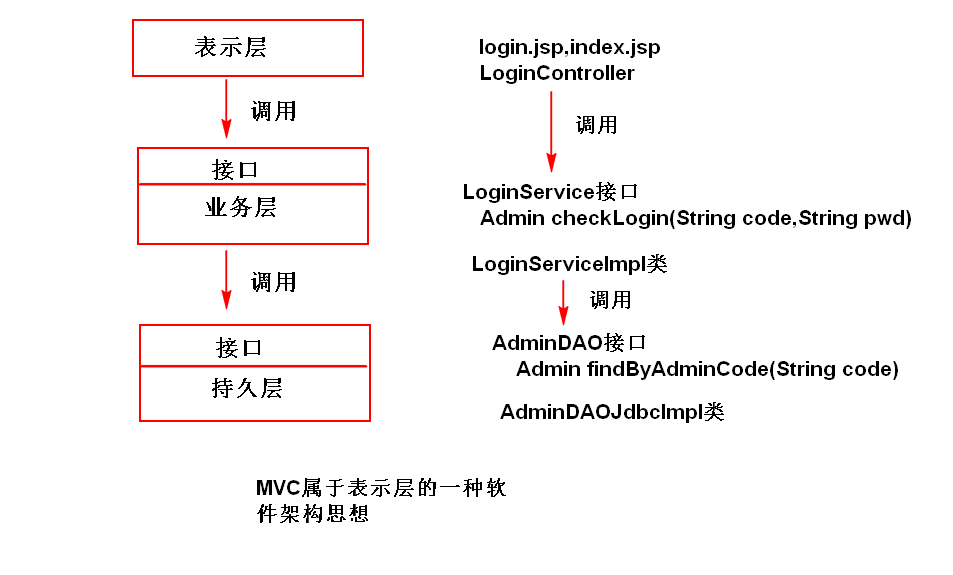
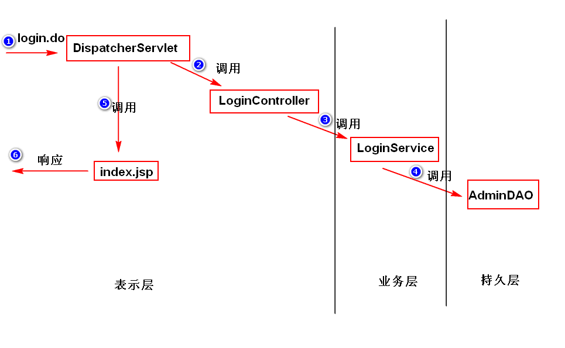
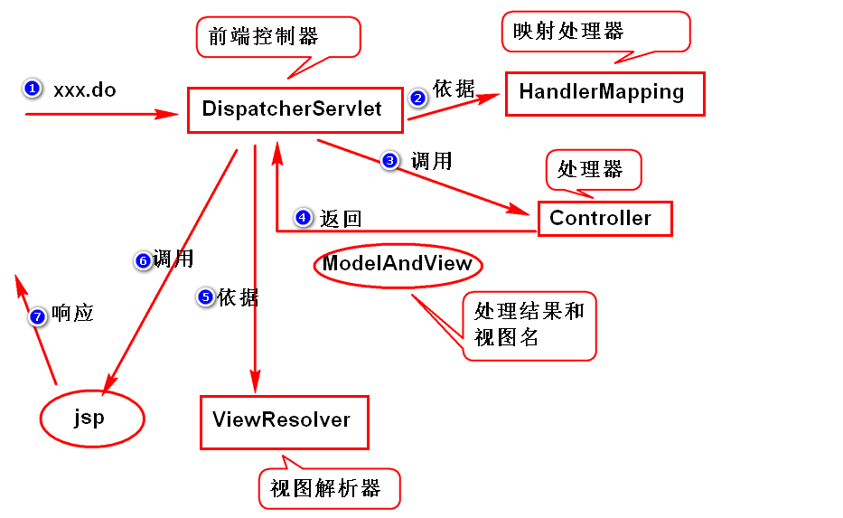
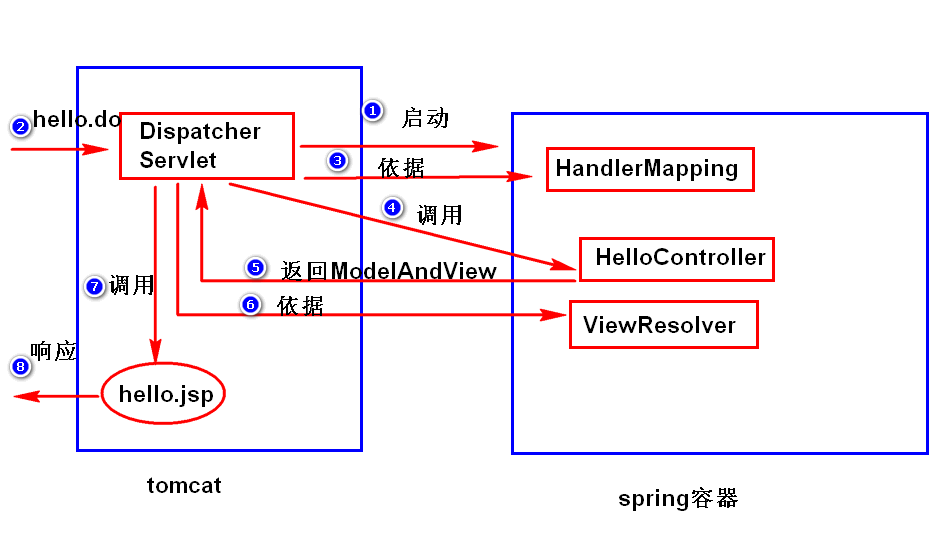
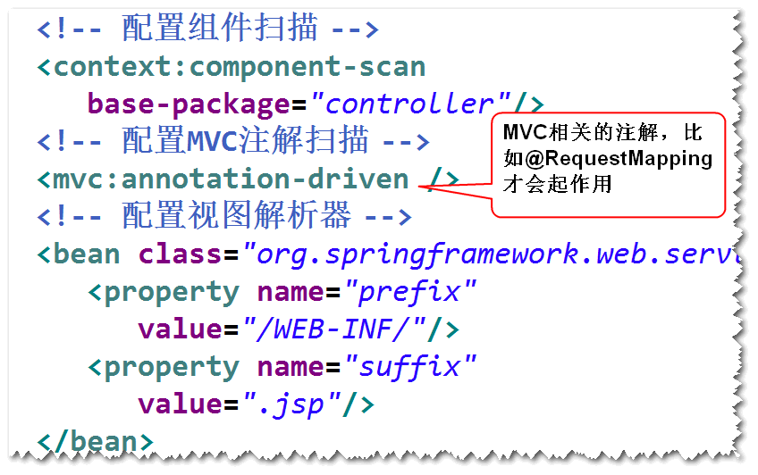
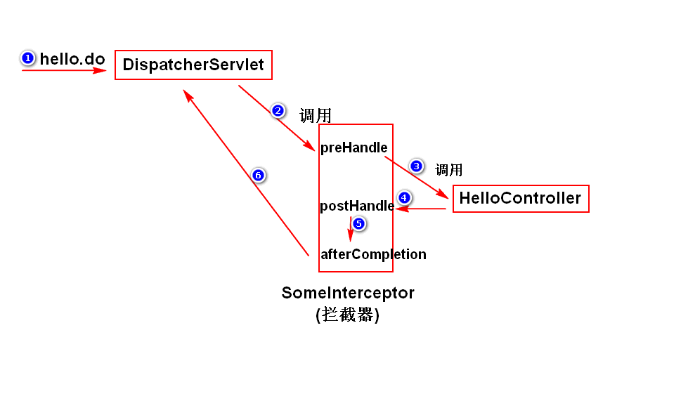
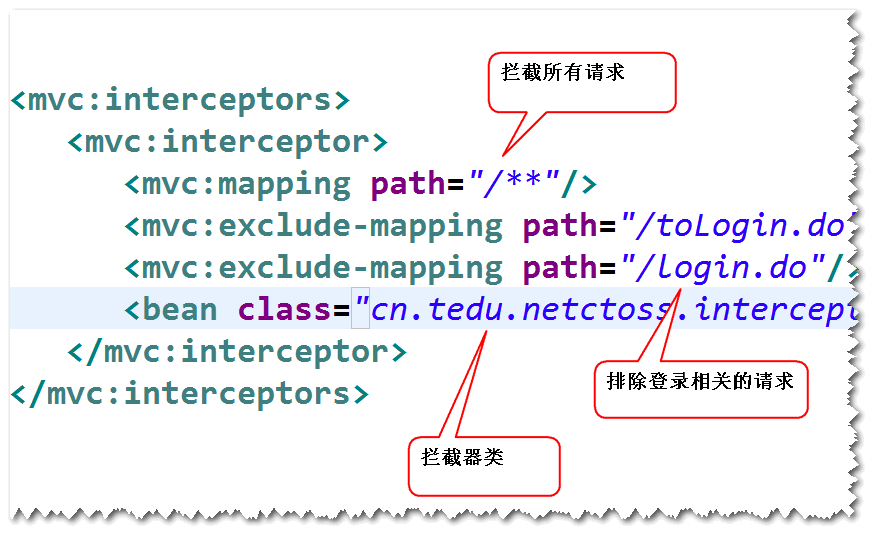

# █ Spring 核心

# 一. 概述

Spring 是一个开源的, 轻量级的开源框架, 最早由 Rod Johnson 创建, 致力于简化 java 开发, 而且是全方位的简化 java 开发. Spring 提供了 **IOC** 和 **AOP** 功能, 能降低项目组件间的耦合度, 便于日后维护与升级. 其本质是管理软件中的对象, 即创建并维护对象之间的关系

Spring 为系统提供了一个整体的解决方案, 开发者可以利用它本身提供的功能, 也可以与第三方框架和技术整合应用.

- 基于**POJO**的轻量级和**最小侵入式**编程
- 通过依赖注入和面向接口实现**松耦合**
- 基于切面和惯例进行**声明式编程**
- 通过切面和模板减少样板式代码

## 1. POJO 最小侵入式

许多框架, 要求应用代码继承框架的某些类, 或是实现框架提供的某些接口, 从而导致应用和框架的绑定.

而 Spring 尽量避免应用代码与框架 API 发生耦合, 不需要继承 spring 的类或实现 spring 的接口. 大多数应用组件都只需要使用 spring 提供的注解, 但组件本质上仍是一个 POJO.

## 2. 依赖注入

处理实际业务的应用, 都会由多个类组成, 这些类相互协作来完成特定的业务逻辑.

耦合具有两面性: 

- 一方面, 紧密耦合的代码难以测试, 难以复用, 难以理解. 
- 另一方面, 一定程度的耦合又是必须的, 不同的类需要以适当的方式进行交互

传统做法中, 每个类需要管理与自己相互协作的对象 (即它所依赖的对象) 的引用. 会导致两个类的高度耦合. 而通过**依赖注入 (Dependency Injection, DI**), 对象的依赖关系将由系统中的专门组件负责协调, 在创建对象的时候进行设定.

创建应用组件之间协作的行为称为**装配 (wiring)**, Spring 通过**应用上下文 (Application Context)**全权负责对象的创建和组装, 装载 bean 的定义. Spring 提供了多种应用上下文的实现, 区别在于如何加载配置. 

## 3. 面向切面编程

DI 依赖注入让相互协作的软件组件保持松散耦合, 而**面向切面编程 AOP**则允许开发者把遍布应用各处的功能分离出来, 形成可重用的组件.

在一个完整的系统中, 除了实现自身核心的业务功能之外, 还需要许多诸如日志, 事务管理, 安全校验等系统服务的功能, 这些系统服务常常融入到自身具有核心业务逻辑的组件中去. 这样的系统服务通常被称为横切关注点, 因为他们会跨越系统的多个组件, 可能会带来额外的复杂性 

- 实现系统关注点功能的代码会重复出现在多个组件中
- 业务功能组件会因为那些与业务逻辑无关的代码而变得混乱

AOP 能够使这些服务模块化, 并以声明的方式将它们应用到需要影响的组件中去. 

## 4. 通过模板消除样板代码

spring 为了消除样板代码, 封装了多个模板. 通过使用 spring 提供的 jdbcTemplate, jmsTemplate 等模板, 可以大大减少样板代码的出现.

# 二. 容器与 Bean

## 1.容器

### 1.1. 容器的分类

在 Spring 应用中, 对象存在于 spring **容器 (container)**中. 容器是 spring 框架的核心, 负责创建对象, 装配对象, 配置并管理它们的整个生命周期. spring 容器使用 DI 管理构成应用的组件, 它会创建相互协作的组件之间的关联. 

spring 自带多个容器实现, 分成两种类型

- **bean 工厂 (BeanFactory)**, 最简单的容器, 提供基本的 DI 支持.
- **应用上下文 (ApplicationContext)**, 基于工厂构建, 并提供应用框架级别的服务.

### 1.2. 应用上下文

通常使用应用上下文. 不同的应用上下文作用类似, 区别在于其配置方式的不同

- **Annotation**ConfigApplicationmContext: 通过 java 配置的 spring 应用上下文

- **Annotation**Config**Web**ApplicationContext: 通过 java 配置的 spring web 应用上下文

- **ClassPathXml**ApplicationContext: 通过 `classpath` 下的 xml 配置

- **FileSystemXml**ApplicationContext: 通过文件系统中的 xml 配置

- **XmlWeb**ApplicationContext: 由 xml 配置的 web 应用上下文

```java
// 通过文件系统中的 xml 配置文件创建应用上下文
ApplicationContext context1 = new FileSystemXmlApplicationContext("c:/fileSystem.xml");

// 通过 classpath 下的 xml 配置文件创建应用上下文
ApplicationContext context2 = new ClassPathXmlApplicationContext("classpath.xml");

// 通过 java 配置类创建应用上下文
ApplicationContext context3 = new AnnotationConfigApplicationmContext("Config.class");
```

不论使用什么形式的应用上下文, 其主要目的有两个

- 对应用上下文本身进行设置, 开启哪些功能, 如声明式事务, 组件扫描, 切面支持等
- 声明需要注册到该应用上下文的 bean

java 配置方式由于更接近 java 编码方式, 并能提供类型检查, 更加安全, **推荐使用 java 配置方式**.

#### 1) xml 配置

```xml
<beans xmlns="http://www.springframework.org/schema/beans"
       xmlns:context="http://www.springframework.org/schema/context"
       xsi:schemaLocation="
            http://www.springframework.org/schema/beans
            		http://www.springframework.org/schema/beans/spring-beans.xsd
            http://www.springframework.org/schema/context
            		http://www.springframework.org/schema/context/spring-context.xsd">
    <!-- 应用上下文配置 -->
    <context:component-scan base-package="com.luojbin.spring.demo" />
    
    <!-- bean 声明 -->
    <bean id="date" class="java.util.Date"/>
</beans>
```

spring 应用上下文的 xml 配置文件如上所示, 主要包括以下几个部分

- `<beans>`: 表示该 xml 是spring 应用上下文配置文件, 并声明该配置文件要使用的命名空间
- `<context:component-scan>`: 应用上下文的配置内容之一, 指定组件扫描的包路径
- `<bean>`: 注册到该应用上下文的 bean

#### 2) java 配置

```java
@Configuration
@ComponentScan(basePackages = {"com.luojbin.spring.demo"})
public class RootConfig {
    @Bean
    public Date date() {
        return new Date();
    }
}
```

应用上下文的java 配置类, 与普通的 java 类区别不大, 但多了几个注解

- `@Configuration`: 表示该类是 spring 应用上下文的配置类
- `@ComponentScan`: 应用上下文配置内容之一, 指定组件扫描的包路径.
- `@Bean` 表示该方法的返回值要注册到该应用上下文中.

## 2. Bean

由 Spring 管理的这些组件/对象, 被称为 **Bean**. 不论从什么方式装载的应用上下文, 通过应用上下文获取 bean 对象的过程是相似的: 先获取相应的应用上下文, 然后就可以通过应用上下文的 `getBean()` 方法从 spring 容器中获取 bean.

1. 首先在容器配置文件中添加 Bean 定义

   ```xml
   <bean id="BeanId" class="包名.类名" />
   ```

2. 在创建容器实例后, 调用 getBean() 方法获取 Bean 的实例. 

   其中`类名.class` 是通过反射, 获取方法区中的 class 对象, 用于指定获取对象的类型

   ```java
   // 通过 classpath 下的 xml 配置文件创建应用上下文
   ApplicationContext ac = new ClassPathXmlApplicationContext("classpath.xml");
   ac.getBean("BeanId", ClassA.class)
   // 如果一个类只有一个对应的 BeanId, 则 BeanId 可以省略, 即
   ac.getBean(ClassB.class)
   ```

### 2.1. Bean 的创建

Spring 采用了工厂模式. 

从本质上讲, Spring 的容器是一个维护 Bean 定义以及相互依赖关系的高级工厂接口, 通过指定 beanID, 并给定相应的类型, BF 或 AC 可以访问 Bean 定义, 获取 Bean 对象.

- 工厂模式 : 采用工厂方法去获取对象, 而不使用常规的 new
- 工厂方法 : 一类特殊的方法, 可以根据要求返回一个对象

  - 静态工厂方法 : 由 static 修饰, 调用时不需创建所在类的对象
  - 实例工厂方法 : 需要先创建所在类的一个对象, 再由对象去调用方法

Spring 可以通过以下三种方式配置并获取 Bean 对象

```xml
<!-- 1.指定 Bean 类型, 通过构造器获取对象, 默认使用无参构造, 提供参数时使用有参构造 -->
<bean id="date" class="java.util.Date" />	
 
<!-- 2.指定工厂类和静态工厂方法, 通过静态工厂方法获取对象 -->
<bean id="cal" class="java.util.Calendar" factory-method="getInstance" />

<!-- 3.指定工厂bean和实例工厂方法, 通过实例工厂方法获取对象 -->
<bean id="time" factory-bean="cal" factory-method="getTime" />
```

java配置

```java
@Configuration
public class SpringConfig{
    // 1.指定 Bean 类型, 通过构造器获取对象, 默认使用无参构造, 提供参数时使用有参构造
    @Bean
    public Date date(){
        return new Date();
    }

    // 2.指定工厂类和静态工厂方法, 通过静态工厂方法获取对象
    @Bean
    public Calendar cal(){
        return Calendar.getInstance();
    }

    // 3.指定工厂bean和实例工厂方法, 通过实例工厂方法获取对象
    @Bean
    public Time time(Calendar cal){
        return cal.getTime();
    }
}
```

执行类:

```java
ApplicationContext ac = new ClassPathXmlApplicationContext("applicationContext.xml");

// 采用无参构造获取的 bean, 实际调用的是 new Date()
Date d = ac.getBean("date", Date.class);

// 采用静态工厂方法获取 bean, 实际调用的是 Calendar.getInstance()
Calendar c = ac.getBean("cal", Calendar.class);

// 采用实例工厂方法获取 bean, 实际调用的是 cal1.getTime()
Time t = ac.getBean("time", Date.class);
```

### 2.2. Bean 的命名

在 Spring 容器中, 每个 Bean 都有自己的名字( 即 ID, 唯一的标识符 ), 该名字可以用 bean 元素的`id`或`name`属性指定.

在给 bean 定义好 ID 后, 可以通过 `<alias>` 元素指定别名, 可以通过别名访问到同一个 bean

```xml
<bean id="beanID" class="包名.类名" />
<alias name="beanID" alias="bean别名">
```

使用`@Bean`注解声明 bean 时, 默认以该方法名为 beanID, 也可以在`@Bean`注解的`value`属性中指定 beanID

```java
@Bean
public Bean methodNameBean(){...}

@Bean(value = "valueName")
public Bean valueNameBean(){...}
```

### 2.3. Bean 的配置

#### 1) 作用域

Spring 默认采用单例模式创建对象, 具体说明如下

- 若一个类对应一个 BeanID, 则无论调用几次`getBean()`, 都只有一个实例
- 若一个类拥有多个 BeanID, 则该类每个 BeanId 可以拥有一个实例
- 若一个类拥有一个 BeanID, 并通过 `alias` 获取别名, 共用一个实例

可以通过 bean 元素的 `scope` 属性指定作用域, 默认采用单例模式创建对象,

```xml
<bean id="bean名" class="包名.类名" scope="作用域" />
```

java 配置方式使用 `@Scope` 注解

```java
@Bean
@Scope("prototype")
public ScopeBean scopeBean(){...}
```

Spring 支持以下几种作用域, 通常使用`singleton`或`prototype`.

| 作用域         | 说明                                                         |
| -------------- | ------------------------------------------------------------ |
| **singleton**  | 单例模式, 无论执行 getBean 多少次, 都返回同一个对象          |
| **prototype**  | 原型模式, 每执行一次 getBean, 就创建一个 bean 对象           |
| request        | 在一次HTTP请求中, 一个bean定义对应一个实例, 仅限于WEB环境    |
| session        | 在一个HTTP Session中,一个bean定义对应一个实例, 仅限于WEB环境 |
| global Session | 在全局的 HTTP Session中, 一个bean对应一个实例, 仅在基于portlet的WEB应用中 |

#### 2) 延迟加载 (懒汉/饿汉)

默认情况下, 容器启动之后, 会将作用域为 singleton 的 bean 对象创建好 (饿汉模式)

延迟加载时, 容器启动之后, 不会自动创建 bean 对象, 调用 `getBean()` 方法才会创建 (懒汉模式)

```xml
<bean id="bean名" class="包名.类名" lazy-init="true" />
```

java 配置使用`@Lazy`注解启用延迟加载, `value=true`属性可以省略

```java
@Bean
@Lazy
public LazyMan lazyMan(){...}
```

#### 3) 生命周期回调

Spring 容器会管理对象的生命周期, 包括对象的创建, 初始化, 销毁等过程

##### a) 初始化/销毁方法

容器创建好 bean 的实例后, 会立即调用初始化方法, 每创建一个对象, 就会调用一次

容器关闭的时候, 要销毁对象, 在此之前还要先执行销毁方法, 只能作用于单例模式的 bean, 否则失效

```xml
<bean id="bean名" class="包名.类名" init-method="方法名" destroy-method="方法名" />
```

java 配置的 `@Bean` 注解同样提供了`initMethod`和`destroyMethod`, 以指定初始化/销毁方法

```java
@Bean(intiMethod="init", destroyMethod="destroy")
public LifeBean lifeBean(){...}
```

为了展示单例 bean 的销毁方法, 需要手动关闭应用上下文. 但 ApplicationContext 接口未提供关闭的方法, 由其子类 AbstractApplicationContext 提供

```java
AbstractApplicationContext aac = (AbstractApplicationContext) ac;
aac.close();
```

##### c) 默认方法

在顶级的 `<beans>` 元素中, 可以通过 `default-init-method` 属性, 或 `default-destroy-method` 属性对容器中所有 bean 指定初始化回调方法和销毁回调方法

```xml
<beans default-init-method="初始化方法"　default-destroy-method="销毁方法" >
　　< bean id="bean名" class="包名.类名"/>
</beans>
```

- `@PostConstruct`: 初始化方法, 需要 JavaEE 的依赖, 比如 tomcat
- `@PreDestroy:`: 销毁方法, 需要 JavaEE 的依赖, 比如 tomcat

# 三. Spring IOC

## 1. IOC 与 DI

### 1.1. IOC 

- Inversion of Control 控制反转
- IOC 是一种思想, 指程序中获取对象的方式发生反转, 由第三方框架/容器注入依赖的对象, 由外部注入依赖关系(*DI*), 而不是传统的调用方自行维护要调用的组件对象. 从而降低组件间的耦合度
- Spring 采用 DI 方式实现 IOC, IOC 是 Spring 框架的基础和核心. IOC 是目标, DI 是手段.


### 1.2. DI

Dependency Injection  依赖注入

将成员 Bean 对象, 以构造/方法参数方式, 注入主对象, 建立依赖关系

容器的工作就是创建 bean 时注入这些依赖关系

DI 是实现 IOC 的主要技术途径

创建应用对象之间写作关系的行为通常称为**装配(wiring)**, 这也是依赖注入的本质.

## 2. xml 装配

### 2.1. 注入方式

#### 1) 构造器注入

在创建主 bean 的时候, 通过`<constructor-arg> `元素注入成员 bean, 再调用含参构造方法

```xml
<bean id="主BeanID" class="主Bean类名" >
    <!-- 可以通过构造参数下标(index)确定注入目标, 下标从0开始 -->
    <constructor-arg index="构造参数下标" ref="成员BeanID"/>
    <!-- 可以通过构造参数名(name)确定注入目标 -->
    <constructor-arg name="构造参数名" ref="成员BeanID"/>
</bean>
```

#### 2) Setter 注入

容器先通过无参构造创建了主 Bean, 再根据`<property>`元素的`name`属性调用 setter 方法注入成员 Bean.

```xml
<bean id="主BeanID" class="主bean类名">
　　<property name="bean属性" ref="成员beanID" />
</bean>
```

### 2.1. 注入类型

#### 1) 基本类型

可以通过字符串, 指定`<value>` 元素或者`value`属性属性或构造器参数的值. 容器将字符串从 String 类型转换为实际类型后注入

```xml
<bean id="beanID" class="包名.类型" >
    <!-- 使用 value 属性指定值 -->
    <property name="成员变量" value="基本类型值" />
    <!-- 使用 value 元素指定值 -->
    <property name="成员变量">
        <value>基本类型值</value>
    </property>
</bean>
```

#### 2) 引用类型

使用`ref`属性指定beanID, spring 会将指定的 bean 注入到当前构造的 bean 中. 

```xml
<bean id="主BeanID" class="主bean类名">
　　<property name="属性" ref="otherBeanID" />
</bean>
```

#### 3) 集合类型

通过`<list>`, `<set>`, `<map>`, `<props>`等元素, 可以定义或设置与 Java 中对应的 List, Set, Map, Properties 类型的属性值, 给 bean 注入一个集合.

```xml
<Bean id="主beanID" class="包名.类型" >
　　<property name="成员变量名">
　　　　<!-- 通过 list/set/map/props 等元素声明的集合 -->
　　</property>
</bean>
```

- 最外层 bean 元素是主 Bean 定义, 指定主 BeanID 和 类型
- 第二层`<property>`元素是主 Bean 对象的各个成员属性, 用`name`属性指定成员变量名
- 最内层是具体的集合具体数据, 其格式根据集合类型决定

具体示例如下

- 实体类

  ```java
  public class ValueBean {
  	private String name;
  	private int age;
  	private List<String> interest;
  	private Set<String> city;
  	private Map<String,Double> score;
  	private Properties db;
      // 省略基本方法
  }
  ```

- bean配置

  ```xml
  <bean id="vb" class="day02.D7_zValueBean" >
      <!-- List 和 Set 类型用 value 元素指定具体的值 -->
      <property name="interest">
          <list>
              <value>唱歌</value>
              <value>跳舞</value>
          </list>
      </property>
      <property name="city">
          <set>
              <value>北京</value>
              <value>南京</value>
          </set>
      </property>
      
      <!-- Map 使用 entry 元素的 key 属性指定键, 用 value 属性指定值 -->
      <property name="score">
          <map>
              <entry key="英语" value="90"/>
              <entry key="数学" value="85"/>
          </map>
      </property>
      
      <!-- Properties 使用 prop 元素的 key 属性指定键, 由标签的内容指定值 -->
      <property name="db">
          <props>
              <prop key="username">luojbin</prop>
              <prop key="password">lucky</prop>
          </props>
      </property>
  </bean>
  ```

#### 4) 空数据

可以为 bean 注入 null 或空字符串

```xml
<!-- 使用 null 元素注入 null 值 -->
<property name="nullVal">
    <null/>
</property>
<!-- 使用空值value注入空字符串 -->
<property name="emptyVal" value="" />
```

### 2.3. 命名空间

#### 1) 命名空间

xml 的文件头如下所示, 需要指定命名空间和对应的规范文件, `xsd`或`dtd`

```xml
<beans xmlns="默认命名空间"
       xmlns:前缀A="命名空间A"
       xmlns:前缀B="命名空间B"
       xsi:schemaLocation="命名空间A路径 具体文件A
                           命名空间B路径 具体文件B">
</beans>
```

spring 已经将需要的命名空间和schema 都放在了包内, 可以通过包内的`spring.handlers`和`spring.schemas`文件中找到具体的路径和映射文件

```xml
<beans xmlns="http://www.springframework.org/schema/beans"
       xmlns:xsi="http://www.w3.org/2001/XMLSchema-instance"
       xmlns:util="http://www.springframework.org/schema/util"
       xsi:schemaLocation="
       http://www.springframework.org/schema/beans http://www.springframework.org/schema/beans/spring-beans.xsd
       http://www.springframework.org/schema/util http://www.springframework.org/schema/util/spring-util.xsd">
```

#### 2) c 命名空间

需要先在文件头声明使用 c 命名空间

`xmlns:p="http://www.springframework.org/schema/p"`

#### 3) p 命名空间

需要先在文件头声明使用 p 命名空间

`xmlns:p="http://www.springframework.org/schema/p"`

#### 4) util 命名空间

需要先在文件头声明使用 util 命名空间, 并指定 xsd

```xml
<beans xmlns="http://www.springframework.org/schema/beans"
       xmlns:xsi="http://www.w3.org/2001/XMLSchema-instance"
       xmlns:util="http://www.springframework.org/schema/util"
       
       xsi:schemaLocation="
       http://www.springframework.org/schema/beans 	
       http://www.springframework.org/schema/beans/spring-beans.xsd
                           
       http://www.springframework.org/schema/util 
       http://www.springframework.org/schema/util/spring-util.xsd">
```

`<util:list>`, `<util:set>`, `<util:map>`, `<util:props>`等元素可以利用直接量构造集合bean, 并可以通过 setter 或构造器注入到其他bean 中.

```xml
<!-- 声明集合 bean 的格式与直接注入集合类似, 注意添加 util 命名空间 -->
<util:list id="interestBean">
    <value>吃酒</value>
    <value>喝烟</value>
</util:list>
<util:set id="cityBean">
    <value>北京</value>
    <value>南京</value>
    <value>西安</value>
</util:set>
<util:map id="scoreBean">
    <entry key="English" value="90" />
    <entry key="Math" value="85" />
</util:map>
<util:properties id="dbBean">
    <prop key="username">luojbin</prop>
    <prop key="password">lucky</prop>
</util:properties>
```

`<util:properties>` 元素可以通过读取`location`属性指定`properties`文件, 将内容存放到 `Properties` 对象里面, 以便在应用中读取配置使用.

```xml
<util:properties id="config" location="classpath:文件路径"/>
```

### 2.4. Spring 表达式

Spring 提供了 **Spring 表达式,** 类似于 EL 表达式, 可以方便地获取一个 Bean 对象中封装的数据.

- 实例域值: `#{bean.实例域}`
- 集合元素: `#{集合[下标]}`
- 映射的值: `#{映射['key']}`
- properties: `#{props.key}`


### 2.6. 自动装配

Spring IOC 容器可以自动装配 bean 之间的关联关系, 减少 xml 注入配置工作

可以通过 `autowire` 属性启用自动装配, 默认为`no`, 建议采用 `byName` 方式以避免冲突

```xml
<bean id="beanID" class="包名.类名" autowire="自动装配方式" />
```

| 属性值        | 说明                                                         |
| ------------- | ------------------------------------------------------------ |
| `no`          | **默认值**, 不进行自动装配                                   |
| `autodetect`  | 自动选择 byType 或 constructor 方式, 有无参构造则采用 ByType |
| `byName`      | 通过成员变量的变量名, 查找 BeanID, 没找到则为null            |
| `byType`      | 通过成员变量的类型, 查找相应的 Bean, 没找到则为null, 多个则报错 |
| `constructor` | 通过构造器参数类型, 查找 Bean                                |

## 3. java 装配

java 配置通过`@Bean`注解修饰的方法来声明. 而对于bean的各种依赖的注入, 则如同普通 java 对象一般, 在方法体内对 bean 进行各种set即可.

与xml各种繁杂的标签相比, java 配置方式要简单得多, 而且可以通过代码执行各种操作, 更加灵活和强大. 

需要为bean 注入依赖时, 有以下两种办法

1. 在 bean2 的方法体内调用其他的`@Bean`方法, spring会拦截该方法的调用, 直接返回该方法注册到容器中的bean, 而不会重复执行方法体. 

   ```java
   @Bean
   public Bean bean2(){
       Bean bean2 = new Bean("bean-2");
       // 在方法体中调用 bean1() 方法, 作为 bean2 的依赖
       bean2.setContent(bean1());
       return bean2;
   }
   ```

2. 在 bean3 的参数列表中声明需要传入指定类型的 bean, spring 将会在容器内寻找合适的对象传入方法中.

   ```java
   // 在参数列表中传入 bean1, 作为 bean3 的依赖
   @Bean
   public Bean bean3(@Qualifier("bean1")Bean bean1){
       Bean bean3 = new Bean("bean-3");
       bean3.setContent(bean1);
       return bean3;
   }
   ```

可以注入基本类型或


## 4. 组件扫描与注解

### 3.1. 组件注解与扫描

Spring 启动以后, 可以扫描指定的包下所有类, 如果类含有特定的注解, 如 `@Component`, Spring 就会将该类作为一个 bean 纳入容器中管理. 组件扫描相当于在配置文件中批量定义 bean 元素

1. 在应用上下文配置文件中启用组件扫描

   ```xml
   <context:component-scan base-package="要扫描的包名" />
   ```

2. 在组件类中添加组件注解, spring提供了多个等效注解, 效果基本一样, 仅为丰富语义而设置了多个.

   - `@Component`: 普通组件, 没有特殊含义
   - `@Controller`: web应用中的 controller 层组件
   - `@Service`: web 应用中的 service 层组件
   - `@Repository`: web 应用中的 dao 层组件
   - `@Configuration`: 配置类组件, 对应用上下文进行设置, 并注册手动声明的bean

组件扫描时, 默认以首字母小写的类名作为 beanID, 也可以在该类的注解后指定 BeanID.

```java
// 通过 value 属性指定 beanID, 也可以省略 value 或不指定
@Component(value = "beanID")
@Component("beanID")
@Component
```

### 3.2. 依赖注入

spring 可以自动为扫描得到 bean 注入依赖关系, 可以采用以下注解实现依赖注入:

#### 1) @Autowired + @Qualifier

`@Autowired` 可以在**构造器**, **setter**, **实例域**上使用, 默认以类型匹配 bean. 若类型匹配的 bean 不只一个, 则需要配合 `@Qualifier`注解指定 beanID

`@Qualifier` 写在方法参数或实例域前面, 声明要被注入的 BeanID, 只有一个类型匹配的 bean时可省略.

```java
// 在构造器上使用
@Autowired
public 类名(@Qualifier("beanID") 参数类型 参数名 ){...}

// 在 setter 方法上使用
@Autowired
public void set方法(@Qualifier("beanID") 参数类型 参数名 ){...}

// 在实例域上使用, 通过反射注入
@Autowired
@Qualifier("beanID")
private 属性类型 属性名;
```

#### 2) @Resource

`@Resource` 可以在 setter 方法或实例域上使用. 默认以实例域名称匹配 beanID, 若 beanID 与实例域名称不同, 则可以通过`name`属性指定 beanID

```java
// 在 setter 方法上使用
@Resource(name="注入的beanID")
public void set方法( 参数类型 参数名 ){...}

// 在实例域上使用, 通过反射注入
@Resource(name="注入的beanID")
private 属性类型 属性名;
```

#### 3) @Inject + @Named

Spring 3.0 开始增加的对**JSR-330**标准的支持, 使用前要添加 JSR-330 的 jar 包 `javax.inject-1.jar`

和 `@Autowired` + `@Qualifier` 用法一致, 但需要额外添加依赖, 仅作了解

#### 4) @Value

`@Value`, 给 bean 注入**基本类型**或 **spring 表达式**的值, 可以在 setter 或实例域上使用.

```java
// 在 setter 上使用
@Value("基本类型值")
public void set方法(参数类型 参数名 ){...}

@Value("#{Spring表达式}")
public void set方法(参数类型 参数名 ){...}

// 在实例域上使用, 通过反射注入
@Value("基本类型值")
private 属性类型 属性名;

@Value("#{Spring表达式}")
private 属性类型 属性名;
```

# 四. 高级装配

profile

条件化的 bean

# 五. 切面 AOP

spring aop 使用 aspectJ 的切点表达式语言

aop与事务

rootConfig 扫描controller 以外的所有, 包括切面和service, config

webConfig 扫描controller

|                          | controller切面 | service切面 | 事务切面 |
| ------------------------ | -------------- | ----------- | -------- |
| rootConfig+ EnableAspect | 无             | 有          | 有       |
| webConfig+ EnableAspect  | 有             | 无          | 无       |
| 都加EnableAspect         | 有             | 有          | 有       |
|                          |                |             |          |

rootConfig, 管理controller 切面, service 切面, 事务切面, service bean

rootConfig+EnableAspect 可以启用service 切面切入 service bean, 事务切面切入 service bean

webConfig, 只管理 controller bean

webConfig+enableAspect 可以启动 controller 切面切入controlelr bean


总结, 关键在于被切组件, 而切面则可以在别的上下文中声明

Note: @EnableAspectJAutoProxy applies to its local application context only, allowing for selective proxying of beans at different levels. 

Please redeclare @EnableAspectJAutoProxy in each individual context, e.g. the common root web application context and any separate DispatcherServlet application contexts, if you need to apply its behavior at multiple levels.

# █ Spring Web

# 一. 分层理论

## 1. 目的

为了系统好维护，系统的设计应该要做到“高内聚，低耦合”。

**高内聚**：指的是类的职责要单一，这样，一个类就可以会拆分成多个类（比如 AccountService 拆分成了AccountService 和 AccountDAO）,这样，就形成了分层的概念。

**低耦合**：指的是类与类之间不要直接依赖。（ AccountService 要调用 AccountDAO，应该使用依赖注入）。

## 2. 三层结构

1. 表示层：也叫视图层, 是数据展现和操作的界面，以及请求分发。
2. 业务层：封装了业务逻辑。
3. 持久层: 封装了数据访问逻辑。
注：
表示层调用业务层，业务层调用持久层。
上一层通过接口来调用下一层提供的服务
下一层的具体实现发生了改变，不影响上一层






## 3. MVC模式

MVC 属于表示层的一种软件架构思想.

### 3.1. M-MODEL

模型的职责是负责业务逻辑, 包括两层:

业务数据, 以及业务处理逻辑.

比如实体类, DAO, Service 都属于模型层.

### 3.2. V-View

视图的职责是负责显示界面和用户交互, 收集用户信息

视图层主要是不包含业务逻辑和控制逻辑的 JSP

### 3.3. C-Controller

控制器是模型层和视图层之间的桥梁, 用于控制流程

比如在 Servlet 项目中的单一控制器 ActionServlet

## 4. Spring MVC

3.1. 什么是 Spring MVC?

用来简化基于MVC架构的web应用程序开发的框架。

注：SpringMVC是spring中的一个模块。

3.2. Spring MVC 五大组件

1) DispatcherServlet 前端控制器

org.springframework.web.servlet. DispatcherServlet

将浏览器发来的请求进行分发, 控制调用各个处理器或组件来响应不同的请求

在 web.xml 项目配置文件中配置

2) HandlerMapping 映射处理器

org.springframework.web.servlet.handler. SimpleUrlHandlerMapping

前端控制器分发请求的依据, 规定了哪些请求应该由哪个处理器来处理

在 spring.xml 配置文件中配置, 使用 @RequestMapping 注解则不需在配置文件中配置.

3) Controller 处理器

org.springframework.web.servlet.mvc. Controller

处理具体的业务逻辑, 将处理结果封装成 ModelAndView 对象传回

新编写的 controller 应实现这一接口, 使用 @Controller 注解的话, 则不需要实现接口.

4) ModelAndView 模型与视图名

org.springframework.web.servlet. ModelAndView

用于封装处理器处理后的数据, 并包含用于定位下一个视图的视图名

5) ViewResolver 视图解析器

org.springframework.web.servlet.view. InternalResourceViewResolver

处理器返回视图名字符串, 视图解析器根据处理器返回的视图名, 解析出真正要使用的视图对象的路径

在 spring.xml 配置文件中配置


3.3. Spring MVC 工作原理




1. 服务器收到请求后, 将请求发送给 DispatcherServlet, 准备进行分发;
2. DispatcherServlet 获取 HandlerMapping 的配置;
3. 根据配置信息, 调用对应的 Controller 来处理请求;
4. Controller 将处理结果封装成 ModelAndView，返回给 DispatcherServlet.
5. DispatcherServlet 依据 ViewResolver, 解析出要使用的视图对象;
6. 调用对应的视图对象（比如jsp）来生成相应的页面;
7. 服务器将生成的响应页面发送给浏览器.
注：视图部分可以使用 jsp, 也可以使用其它的视图技术，比如freemarker, velocity等。

# 二. Spring MVC 的应用

## 1. 基于 xml 的 Spring MVC 应用

1. 导包 spring-webmvc
2. 添加配置文件 spring-mvc.xml 。
3. 在项目的 web.xml 配置 DispatcherServlet。
4. 写 Controller, 必须实现 org.springframework.web.servlet.mvc.Controller 接口。
5. 写 jsp。
6. 在配置文件 spring-mvc.xml 当中，添加 HandlerMapping, ViewResolver 的配置。

1.2. 案例. Hello请求



1) web.xml

```xml
<servlet>
    <description></description>
    <display-name>DispatcherServlet</display-name>
    <servlet-name>DispatcherServlet</servlet-name>
    <servlet-class>org.springframework.web.servlet.DispatcherServlet</servlet-class>
    <init-param>
        <description></description>
        <param-name>contextConfigLocation</param-name>
        <param-value>classpath:*.xml</param-value>
    </init-param>
    <load-on-startup>1</load-on-startup>
</servlet>
<servlet-mapping>
    <servlet-name>DispatcherServlet</servlet-name>
    <url-pattern>*.do</url-pattern>
</servlet-mapping>
```

2) controller

```java
public class HelloController implements Controller{
    @Override
    public ModelAndView handleRequest(HttpServletRequest arg0, HttpServletResponse arg1)
        throws Exception {
        System.out.println("handleRequest()");
        /*
* ModelAndView 有两个常用构造器 :
* ModelAndView(String viewName)
* ModelAndView(String viewName, Map data)
* 注：
* viewName: 视图名
* data: 处理结果
*/
        return new ModelAndView("hello");
        return new ModelAndView("hello");
    }
}
```

3) hello.jsp

```html
<h1>hello spring mvc</h1>
```

4) spring-mvc.xml

```xml
<!-- 配置 HandlerMapping -->
<bean class="org.springframework.web.servlet.handler.SimpleUrlHandlerMapping">
    <property name="mappings">
        <props>
            <!-- 指定访问名和与之对应的 controllerBean -->
            <prop key="/hello.do">helloController</prop>
        </props>
    </property>
</bean>
<!-- 配置 Controller -->
<bean id="helloController" class="controller.HelloController"/>
<!-- 配置视图解析器 -->
<bean class="org.springframework.web.servlet.view.InternalResourceViewResolver">
    <!-- 指定视图名对应的前缀 -->
    <property name="prefix" value="/WEB-INF/"/>
    <!-- 指定视图名对应的后缀 -->
    <property name="suffix" value=".jsp"/>
</bean>
```

## 2. 基于注解的 Spring MVC 应用

2.1. 编程步骤
1. 导包 spring-webmvc
2. 添加配置文件。
3. 配置 DispatcherServlet。
4. 写 Controller。
5. 写 jsp。
6. 在配置文件当中，添加 ViewResolver 的配置, 组件扫描, 添加 mvc 注解扫描。



2.2. 使用注解编辑 Controller
处理器类
1. 不需要实现 Controller 接口
2. 可以添加多个方法, 处理多种请求
3. 返回值可以是 ModelAndView, 也可以是 String, 返回的 String 就是视图名
4. 使用 @Controller 注解, 则可使用组件扫描添加控制器
5. 方法名不作要求, 可以在方法前或类前添加 @RequestMapping 注解,
相当于在xml 中配置 HandlerMapping
类前的注解相当于模块名, 方法前的注解作为具体页面的访问路径

2.3. 案例: 注解 hello.do

1) web.xml

```shell
配置 dispatcherServlet, 同上 , 略
```

2) spring.xml

```xml
<!-- 配置组件扫描 , 启用 @Controller 注解 , 不需在 xml 中配置 bean -->
<context:component-scan base-package="controller" />
<!-- 配置 MVC 注解扫描 , 启用 @RequestMapping, 不需在 xml 中配置 HandlerMapping -->
<mvc:annotation-driven />
<!-- 配置视图解析器 -->
<bean class="org.springframework.web.servlet.view.InternalResourceViewResolver">
    <property name="prefix" value="/WEB-INF/"/>
    <property name="suffix" value=".jsp"/>
</bean>
```

3) HelloController

```java
@Controller
public class HelloController2{
    @RequestMapping("/hello.do")
    public String hello2(){
        System.out.println(" 这是我重新写的一个 hello.do");
        return "hello";
    }
}
```

4) hello.jsp

```html
<h1>hello spring mvc</h1>
```

# 三. 接收与发送数据

## 1. 接收请求参数

1.1. 传入请求对象 Request
DispatcherServlet调用处理器的方法之前, 会根据 Java 反射机制, 分析方法的结构.
如果方法规定了参数以及返回值, 则Spring 会自动注入相关参数.
Spring 可以直接将 HttpServletRequest 对象作为参数注入到处理器类中,
优点: 直接, 与传统方式操作类似
缺点: 从 request 对象获取参数后, 需要自行进行类型转换

```java
@RequestMapping("/login.do")
public String login(HttpServletRequest request) {
    String adminCode = request.getParameter("adminCode");
    System.out.println("adminCode:" + adminCode);
    return "index";
}
```

## 1.2. 传入请求参数 RequestParam

DispatcherServlet调用处理器的方法之前, 会根据 Java 反射机制, 分析方法的结构.
如果方法中定义了参数, 且与 requuest 对象传回的参数同名,
Spring 会自动调用request对象的方法, 先获得其中的参数值, 然后赋给方法对应的形参。
如果方法参数与请求属性的名称不一致，要使用 @RequestParam 注解, 以映射不一样的名称。
优点: 参数类型自动转换
缺点: 可能会出现类型转换异常
如果参数太多, 则方法变得特别复杂, 实际中很少使用
@RequestParam("请求参数名")

```java
@RequestMapping("/login2.do")
public String login2(String adminCode, @RequestParam("pwd") String password) {
    System.out.println("login2()");
    System.out.println("adminCode:" + adminCode + " pwd:" + password);
    return "index";
}
```

## 1.3. 封装成对象后传入

定义一个实体类 Bean, 用于封装参数值, Spring 自动将请求参数封装成对象
再将该类对象作为方法参数传入, 建议采用这种方式
名称一致 : 该类中的成员属性, 要与网页的请求参数名一致
自动转换 : 容器会自动将请求参数的字符串值转换为对应的类型, 可能会转换异常
读写方法 : 该类要提供getter setter方法

```java
@RequestMapping("/login3.do")
public String login3(AdminParam ap) {
    System.out.println("login3()");
    String adminCode = ap.getAdminCode();
    System.out.println("adminCode:" + adminCode);
    return "index";
}
```

## 2. 向页面传值

当controller 组件处理请求后, 需要向 JSP 传递数据时, 可以采用以下方式
在满足需求的情况下, 应尽量选择生命周期短的, 以节约服务器资源

2.1. 使用 HttpServletRequest
默认情况下, DispatcherServlet 会使用转发进行页面的跳转, 地址不变,
并将 request 对象传递给下一个页面, 下一个页面可以从中获取数据

```java
@RequestMapping("/login4.do")
public String login4(AdminParam ap, HttpServletRequest req){
    System.out.println(" 访问 login4, 参数绑定 request 后写出 ");
    String adminCode = ap.getAdminCode();
    req.setAttribute("admin", adminCode);
    return "index";
}
```

2.2. 使用 ModelAndView 对象
在 Controller 处理方法完成后, 将模型数据封装到一个 Map 里,
再将模型数据 Map 与视图名一同打包, 返回一个 ModelAndView 对象

```java
@RequestMapping("/login5.do")
public ModelAndView login5(AdminParam ap) {
    System.out.println("login5()");
    String adminCode = ap.getAdminCode();
    // step1. 将数据添加到 Map 对象里面
    Map<String, Object> data = new HashMap<String, Object>();
    // 相当于执行了 request.setAttribute
    data.put("admin", adminCode);
    // step2. 将 Map 对象添加到 ModelAndView
    ModelAndView mav = new ModelAndView("index", data);
    return mav;
}
```

2.3. 使用 ModelMap 对象
在 Controller 处理方法中声明一个 ModelMap 参数, 容器会将该对象传入
可以给该 ModelMap 对象添加键值对数据, 从而传递给下一个页面

```java
@RequestMapping("/login6.do")
public String login6(AdminParam ap, ModelMap mm) {
    System.out.println("login6()");
    String adminCode = ap.getAdminCode();
    // 相当于执行了 request.setAttribute
    mm.addAttribute("adminCode", adminCode);
    return "index";
}
```

2.4. 使用 HttpSession 对象

session 与 request 类似, 但存活时间更长.
可以在session 对象上绑定数据, 向页面传值

```java
@RequestMapping("/login7.do")
public String login7(AdminParam ap, HttpSession session){
    System.out.println("login7, 使用 Session 传值 ");
    String adminCode = ap.getAdminCode();
    session.setAttribute("adminCode", adminCode);
    return "index";
}
```

2.5. 使用 @ModelAttribute 注解
1) 在传入参数前使用
如果在传入参数面前使用 @ModelAttribute 标注, 则该参数会被传递到下一个页面
但要求传入参数的页面, 与传出参数的页面, 两个页面对该参数的命名一致, 此条件不一定满足, 因而较少用

```java
@RequestMapping("/login11.do")
public String login11(
    @ModelAttribute("adminCode") String admin,
    @RequestParam("pwd") String password){
    System.out.println(" 访问 login6");
    System.out.println(admin +":"+ password);
    return "index";
}
```

2) 在 controller 的 bean 属性方法前使用

也可以在 controller 类中, 将bean 属性作为 modelAttribute 传递到下一个页面

```java
private String testMA= "test ModelAttribute";
@ModelAttribute("testMA")
public String getTestMA() {
    return testMA;
}
```

2.6. 案例: BMI 指数计算
1) 要求:
计算一个人的 BMI 指数
BMI = 体重(kg) / 身高(m) / 身高(m)
BMI < 19, 过轻; BMI > 24 过重; 否则正常
2) 输入页面.jsp

```html
<body style="font-size:30px;">
    <form action="bmi.do" method="post">
        身高 (m):<input type="text" name="height" /><br />
        体重 (kg)):<input type="text" name="weight" /><br />
        <input type="submit" value=" 计算 "/>
    </form>
</body>
```

3) Controller 代码

```java
@Controller
public class BmiController {
    @RequestMapping("tobmi.do")
    public String tobmi(){
        System.out.println(" 访问 tobmi.do");
        return "bmi";
    }
    @RequestMapping("bmi.do")
    public String calbmi(BmiParam bp, ModelMap mm){
        double bmi = bp.getWeight()/bp.getHeight()/bp.getHeight();
        String status=" 正常 ";
        if(bmi<19){
            status=" 过轻 ";
        }
        if(bmi>24){
            status=" 过重 ";
        }
        mm.addAttribute("status", status);
        mm.addAttribute("bmi",bmi);
        return "view";
    }
}
```

4) 响应页面.jsp

```jsp
<body>
    <h2>result</h2>
    <p> 你的 BMI 指数的是 ,${bmi} , 属于 :${status }</p>
</body>
```

### 3. 重定向视图

3.1. 使用 String 重定向
返回值是字符串时, 视图解析器默认会根据这个字符串解析要以 转发方式 访问的页面.
若想以 重定向 的方式跳转, 则要返回特殊的字符串:
return "redirect:重定向地址"
3.2. 使用 ModelAndView 重定向
若处理器方法的返回值是 ModelAndView, 需要先创建一个 RedirectView 类的对象,
再根据这个对象创建新的 ModelAndView, 从而实现重定向.
这种方法比较麻烦, 实际中较少使用.
RedirectView rv = new RedirectView('重定向地址');
return new ModelAndView(rv);

### 4. 中文乱码问题

4.1. 乱码原因
在表单提交时, 对于中文等非 ASCII 字符, 浏览器会根据当前页面的编码方式, 对表单数据进行编码
而服务器默认采用 ISO-8859-1 进行解码, 若不进行编码方式声明, 则会出现乱码
4.2. 解决方式
此前解决中文乱码时, 在servlet中添加了 request 的编码方式声明.
而在 Spring 框架中, request 已由容器采用默认编码方式声明, 用户不易自行修改
Springmvc 提供了一个过滤器(CharacterEncodingFilter), 只需要配置该过滤器即可解决表单中文乱码。
1. 表单数据以 post 方式提交
2. 在 web.xml 中配置 CharacterEncodingFilter 过滤器
3. 过滤器的编码方式, 要与表单页面编码保持一致

```xml
<filter>
    <filter-name> encodingFilter </filter-name>
    <filter-class>
        org.springframework.web.filter.CharacterEncodingFilter
    </filter-class>
    <!-- 配置采用的编码方式 -->
    <init-param>
        <param-name> encoding </param-name>
        <param-value> UTF-8 </param-value>
    </init-param>
</filter>
<!-- 配置要过滤的页面请求 -->
<filter-mapping>
    <filter-name> encodingFilter </ filter-name>
    <url-pattern> /* </url-pattern>
</filter-mapping>
```

1. 异常处理
1.1. Spring 处理异常
默认情况下, Spring 框架会将异常输出放到浏览器, 直接抛给最终用户
1) 配置简单异常处理器
org.springframework.web.servlet.handler. SimpleMappingExceptionResolver
Spring 捕获到了指定的异常, 就跳转到指定的页面
直接跳转到新页面, 不能执行复杂的操作, 只适合简单的异常处理
在 Spring-mvc.xml文件中配置简单异常处理器

```xml
<bean class=" 包名 .SimpleMappingExceptionResolver">
    <property name=" 异常映射名 ">
        <props>
            <prop key=" 异常类型 "> 视图名 </prop>
        </props>
    </property>
</bean>
```

2) 自定义异常处理方法
定义一个方法, 添加 @ExceptionHandler 注解
在方法内定义异常处理逻辑
该方法只处理所在类抛出的异常, 不处理其他类的异常

```java
@ExceptionHandler
// 这是一个异常处理方法 , 参数 e 是处理器方法所抛出的异常
public String HandleEx(Exception e, HttpServletRequest request){
    System.out.println(" 这是一个异常处理方法 ");
    if(e instanceof NumberFormatException){
        e.printStackTrace();
        System.out.println(" 哟 , 数字格式化异常啊 ");
        request.setAttribute("msg", " 亲 , 请输入正确的数字 ");
        System.out.println(" 想干什么干什么 ");
        return "error3";
    }
    if (e instanceof StringIndexOutOfBoundsException){
        e.printStackTrace();
        System.out.println(" 哟 , 下标越界异常啊 ");
        request.setAttribute("msg", " 亲 , 你的下标越界了哟 ");
        System.out.println(" 想干什么干什么 ");
        return "error3";
    }
    return "error";
}
```

`@ControllerAdvice`

1.2. 扩展, 异常处理原则
1. 记录日志, 通常保存到日志文件
2. 看异常能否恢复, 如果能够恢复, 则立刻恢复
如果不能恢复, 如数据库服务暂停, 网络中断,
这样的异常一般称为系统异常, 提示用户稍后重试
底层的异常不可抛出给最终用户
1. 用户体验不好
2. 异常信息会给黑客提供分析漏洞的材料, 带来安全风险
1.3. 扩展, 自定义异常类
通常使用 RumtimeException 作为父类
创建两个构造器, 一个无参构造, 一个字符串参数构造
2. 拦截器
2.1. 什么是拦截器
DispatcherServlet 收到请求之后，如果有拦截器，会先调用拦截器，然后再调用 Controller。
Spring 的 HandlerMapping 处理器支持拦截器应用.
过滤器是 servlet 规范, 拦截器是 Spring 框架的组件.



2.2. 拦截器接口
拦截器必须实现 HandlerInterceptor 接口, 实现三个方法;
如果只使用其中一个方法, 可以继承 HandlerInterceptorAdaptor 类;
1) preHandle()
前处理, 执行处理器之前被调用
DispatcherServlet 收到请求后, 如果有拦截器, 会先调用拦截器, 满足条件后再放行, 继续调用Control 处理器. 否则流程中
止, 不再执行后续操作.
DispatcherServlet, 拦截器, controller 会共享request 和response
返回 true 表示会继续调用其他拦截器和处理器
返回 false 表示中断流程, 不再执行后续拦截器和处理器
案例:

```java
public boolean preHandle(HttpServletRequest request,
                         HttpServletResponse response, Object handler)
    throws Exception {
    System.out.println(" 前处理方法 ");
    return true;
}
```

2) postHandle()
处理器执行后, 视图处理前调用
controller 处理器已执行完, 正准备将 ModelAndView 返回给 DispatcherServlet 时调用
此时可以通过 ModelAndView 对象, 对模型数据或视图进行处理
public void postHandle(HttpServletRequest request, HttpServletResponse response, Object handler,
ModelAndView modelAndView) throws Exception {
System.out.println("后处理方法");
}
3) afterCompletion()
整个请求处理完毕后调用, 如性能监控等
只有在 preHandle 方法返回 true 时才会执行

```java
public void afterCompletion(HttpServletRequest request, HttpServletResponse response, Object handler, Exception ex)
    throws Exception {
    System.out.println(" 最后的方法 ");
}
```

2.3. 拦截器的使用
1. 写一个java类, 实现 HandlerInterceptor 接口
2. 在接口方法里, 实现拦截处理逻辑
3. 配置拦截器



## 二. 视图技术

## 三. MVC 进阶

## 四. Spring Web Flow

## 五. Spring Security

# █ Spring 后端

## 一. Spring JDBC

## 二. Spring 与 ORM

## 三. NoSQL

## 四. 缓存

## 五. 保护方法

# █ Spring 集成

## 一. 远程服务

## 二. REST 服务

## 三. 消息队列

### 1. 概述

### 2. JMS 与 ActiveMQ

### 3. AMQP 与 RabbitMQ

## 四. WebSocket

## 五. JMX

## 六. Spring Boot


