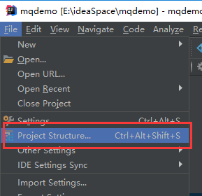
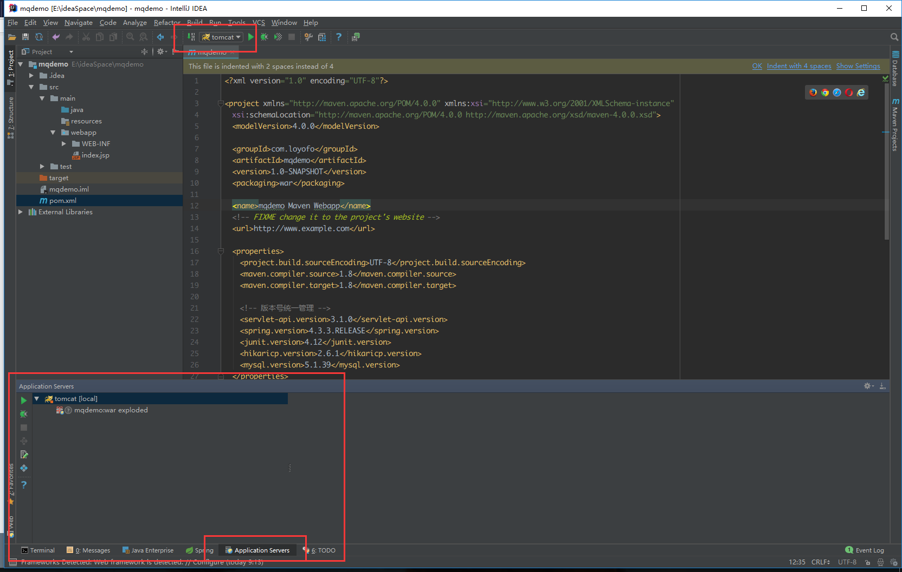

# █ Idea 搭建 Web 项目

# 一. 创建项目


1. 选择 **create new project**, 创建新项目
2. 选择 **Maven** 项目
3. 勾选 **Create from archetype**, 输入 **webapp**  进行筛选
4. 第一个筛选结果不是我们想要的, 点击一下方向键下, 找到 **maven-archetype-webapp**
5. 选择需要使用的 jdk, 这里默认选 1.8
6. 点击 **next** 进行下一步


填写项目信息, next 下一步


选择 maven 版本和设置, 确认本地仓库路径正确, 点击 next 下一步


设置项目存放路径等信息, Finish 完成项目创建向导

然后idea 会执行一下项目初始化的工作, 创建相关文件, 导入 maven 依赖等


项目创建完成后会自动打开项目的 pom 文件, 其中编译版本默认是 1.7, 这里需要手动修改为 1.8

## 2. 完善项目目录结构

webapp 骨架中, 项目目录结构并不完整, 需要手动补充完整



1. 打开项目结构设置 Project Structure


1. 打开 Modules. 可以对项目中的每个模块进行设置
2. 点击需要修改的模块, 打开 Sources 选项卡
3. 添加如图所示的文件夹, 完善目录结构
4. 为各个目录设置所属类型


修改输入路径

## 3. 配置 tomcat


点击运行环境按钮, 选择编辑配置文件


也可在菜单栏【run】-【Edit Configurations】打开


1. 点击添加按钮
2. 找到 tomcat server
3. 选择 local


1. 给这个tomcat 运行环境添加一个名字, 
2. 选择合适的 tomcat 版本
3. 如过选项中没有自己想要的tomcat, 点击右边的 Configure 进行配置:


点击添加按钮, 指定 tomcat 路径, 点击 ok 完成


1. 选择好 tomcat 环境后, 点击 Deployment 发布选项卡
2. 点击右侧的添加按钮, 选择 Artifact...


1. 一般开发时选择  war exploded, 点击 ok
2. 测试完成需要发布 war 包时, 再添加 war


添加完成后如图所示, 左侧是需要发布到该tomcat 的项目

右侧是项目路径, 默认为/, 即 tomcat 首页就是项目主页, 若有需要也可以添加项目路径 

确认无误后点击 ok



tomcat 添加完毕后, 主界面后出现图示内容, 表示项目已部署到 tomcat, 

点击旁边的 **绿色三角** 正常启动, 或旁边的**绿色小虫** debug模式启动

# 二. 添加 Jar 包依赖

现在一般采用 SSM 作为项目的主要框架, 需要导入相关的 jar 包依赖

## 1. 依赖版本统一设置

各个 jar 包都需要添加包版本, 为了方便管理, 应在 pom 文件的 properties 节点下对所有 jar 包版本号进行统一管理, 

```xml
<properties>
    <project.build.sourceEncoding>UTF-8</project.build.sourceEncoding>
    <maven.compiler.source>1.8</maven.compiler.source>
    <maven.compiler.target>1.8</maven.compiler.target>

    <!-- 版本号统一管理 -->
    <servlet-api.version>3.1.0</servlet-api.version>
    <spring.version>4.3.3.RELEASE</spring.version>
    <junit.version>4.12</junit.version>
</properties>
```

在 properties 中进行统一管理后, 后面添加 jar 包时应将版本号使用表达式对版本号进行引用

> `<version>${jar.version}</version>`

如项目创建时自动添加的 junit 依赖, 应改为以下形式

```xml
<dependencies>
    <dependency>
        <groupId>junit</groupId>
        <artifactId>junit</artifactId>
        <!-- 此处用 $表达式 引用设置的版本号 -->
        <version>${junit.version}</version>
        <scope>test</scope>
    </dependency>
</dependencies>
```


## 1. Spring MVC 相关依赖

```xml
<!-- spring MVC -->
<dependency>
    <groupId>org.springframework</groupId>
    <artifactId>spring-core</artifactId>
    <version>${spring.version}</version>
</dependency>
```


## 2. 数据库连接依赖

### 1) spring jdbc

```xml
    <!-- Spring JDBC -->
    <dependency>
      <groupId>org.springframework</groupId>
      <artifactId>spring-jdbc</artifactId>
      <version>${spring.version}</version>
    </dependency>
```


### 2) 连接池

```xml
<!-- 连接池 -->
<dependency>
    <groupId>com.zaxxer</groupId>
    <artifactId>HikariCP</artifactId>
    <version>${hikaricp.version}</version>
</dependency>
```


### 3) 数据库驱动

```xml
<!-- 数据库连接驱动 -->
<dependency>
    <groupId>mysql</groupId>
    <artifactId>mysql-connector-java</artifactId>
    <version>${mysql.version}</version>
</dependency>
```

## 2. Junit 单元测试依赖

## 3. JSON 支持

```xml
<dependency>
    <groupId>com.google.code.gson</groupId>
    <artifactId>gson</artifactId>
    <version>${gson.version}</version>
</dependency>
```

# 三. 添加配置文件

## 1. web.xml -- 项目主配置文件

主配置文件路径:  **/src/main/webapp/WEB-INF/web.xml**

添加 DispatcherServlet 的相关配置, 注意添加启动参数, 指定spring 配置文件的路径

```xml
<servlet>
    <description></description>
    <display-name>DispatcherServlet</display-name>
    <servlet-name>DispatcherServlet</servlet-name>
    <servlet-class>org.springframework.web.servlet.DispatcherServlet</servlet-class>
    <init-param>
        <description></description>
        <param-name>contextConfigLocation</param-name>
        <param-value>classpath:/spring-*.xml</param-value>
    </init-param>
    <load-on-startup>1</load-on-startup>
</servlet>
<servlet-mapping>
    <servlet-name>DispatcherServlet</servlet-name>
    <url-pattern>/</url-pattern>
</servlet-mapping>
```


## 2. spring-*.xml -- spring 相关配置

### 1) MVC结构配置: spring-mvc.xml

```xml
<?xml version="1.0" encoding="UTF-8"?>
<beans xmlns="http://www.springframework.org/schema/beans"
		xmlns:xsi="http://www.w3.org/2001/XMLSchema-instance"
		xmlns:context="http://www.springframework.org/schema/context"
		xmlns:mvc="http://www.springframework.org/schema/mvc"
		xsi:schemaLocation="
		http://www.springframework.org/schema/beans http://www.springframework.org/schema/beans/spring-beans-4.1.xsd
		http://www.springframework.org/schema/context http://www.springframework.org/schema/context/spring-context-4.1.xsd
		http://www.springframework.org/schema/mvc http://www.springframework.org/schema/mvc/spring-mvc-4.1.xsd">

<description>MQ Demo springmvc</description>
	<!-- 配置组件扫描 -->
	<context:component-scan base-package="com.loyofo.mqdemo"/>
	<!-- 配置 MVC 注解扫描 -->
	<mvc:annotation-driven />
</beans>
```

### 2) 数据库连接参数 jdbc.properties

```properties
driver=com.mysql.jdbc.Driver
url=jdbc:mysql://47.106.82.153:3306/activemq
user=activemq_user
password=activemqdemo
maxActive=20
```

### 3) Spring 数据库连接配置 spring-content.xml

```xml
<?xml version="1.0" encoding="UTF-8"?>
<beans xmlns="http://www.springframework.org/schema/beans"
	xmlns:xsi="http://www.w3.org/2001/XMLSchema-instance"
	xmlns:util="http://www.springframework.org/schema/util"
	xsi:schemaLocation="
		http://www.springframework.org/schema/beans         http://www.springframework.org/schema/beans/spring-beans.xsd
        http://www.springframework.org/schema/util 		 http://www.springframework.org/schema/util/spring-util.xsd">

	<description>Spring Configuration</description>

	<!-- 读取配置文件 -->
	<util:properties id="jdbc" location="classpath:jdbc.properties"/>

	<bean id="dataSource" class="com.zaxxer.hikari.HikariDataSource"
		destroy-method="close">
		<property name="driverClassName" value="#{jdbc.driver}" />
		<property name="jdbcUrl" value="#{jdbc.url}" />
		<property name="username" value="#{jdbc.user}" />
		<property name="password" value="#{jdbc.password}" />
		<property name="maximumPoolSize" value="#{jdbc.maximumPoolSize}" />
		<property name="minimumIdle" value="#{jdbc.minimumIdle}" />
		<property name="dataSourceProperties">
			<props>
				<prop key="cachePrepStmts">true</prop>
				<prop key="prepStmtCacheSize">250</prop>
				<prop key="prepStmtCacheSqlLimit">2048</prop>
				<prop key="useServerPrepStmts">true</prop>
			</props>
		</property>
	</bean>

	<bean id="jdbcTemplate" class="org.springframework.jdbc.core.JdbcTemplate">
		<property name="dataSource" ref="dataSource"/>
		<property name="fetchSize" value="#{jdbc.fetchSize}"/>
	</bean>
</beans>
```
