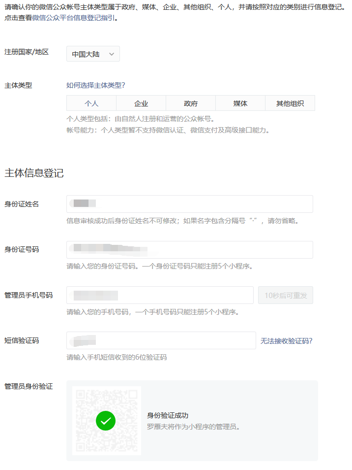

# █ 微信小程序

# 一. 注册小程序账号

每个邮箱只能申请一个小程序, 且不能微信订阅号/服务号相同


填写邮箱信息后, 会收到验证邮件, 打开邮件中的地址完成小程序账户的激活


激活后, 需要完成用户信息登记



# 二. 管理

## 1. 开发者管理

在开发设置中, 可以生成 AppSecret, 并且今后将不能在平台上查询该 AppSecret

```sh
Appid: wx68e9f4ee836b41fa
AppSecret:  b8dce830ec328517aa7d3721c516a028
```


# 三. 开发

使用微信小程序开发工具进行开发

前后分离


# 四. 发布

