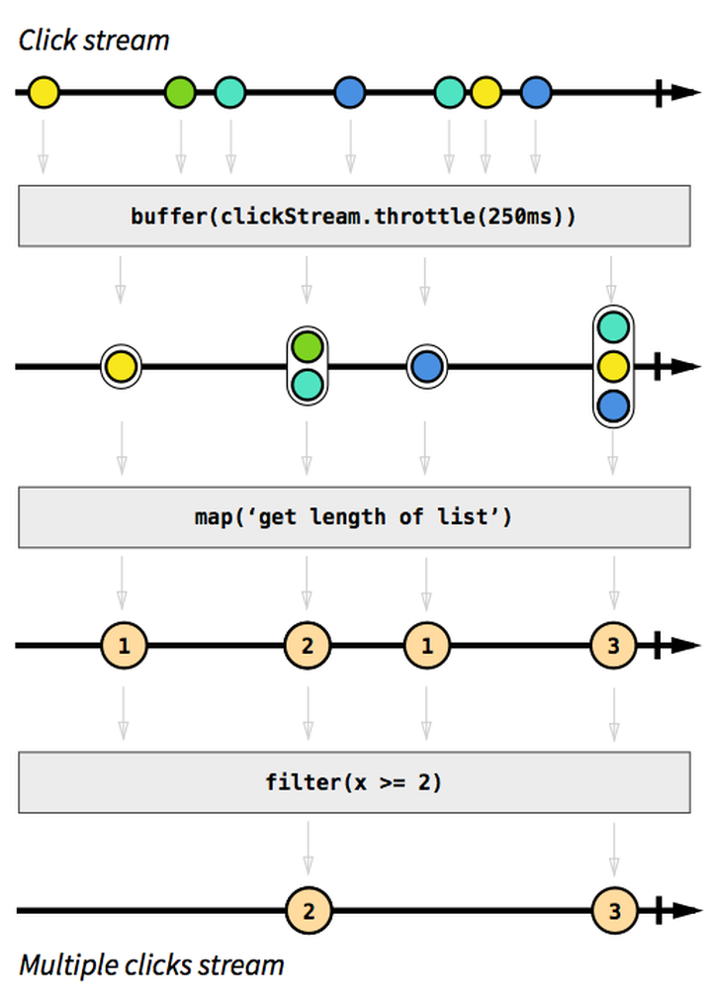
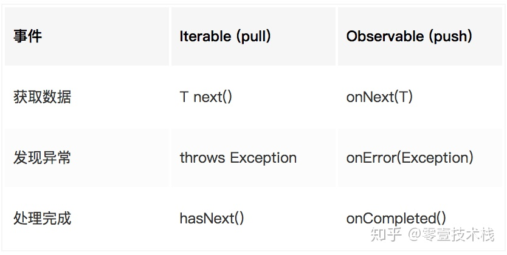
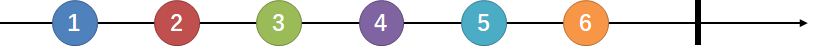
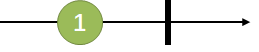
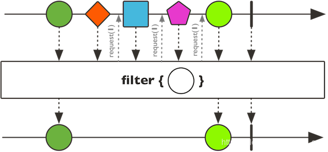
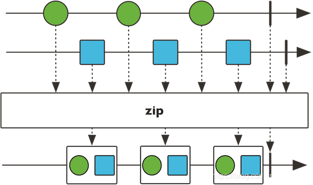

# █ 响应式编程

响应式编程 `(reactive programming)` 是一种基于 **数据流** `(data stream)` 和 **变化传递** `(propagation of change)` 的 **声明式** `(declarative)` 的编程范式。

- 数据流
- 变化传递
- 声明式

响应式编程的思路大概如下：你可以用包括 Click 和 Hover 事件在内的任何东西创建 Data stream。Stream 廉价且常见，任何东西都可以是一个 Stream：变量、用户输入、属性、Cache、数据结构等等

Stream 就是一个按时间排序的 Events 序列,它可以放射三种不同的 Events：(某种类型的)Value、Error  或者一个" Completed" Signal。考虑一下"Completed"发生的时机，例如，当包含这个按钮的窗口或者视图被关闭时。


通过分别为 Value、Error、Completed定义事件处理函数，我们将会异步地捕获这些 Events。有时可以忽略 Error  与Completed，你只需要定义 Value 的事件处理函数就行。

监听一个 Stream 也被称作是订阅  ，而我们所定义的函数就是观察者，Stream则是被观察者，其实就是**观察者模式**.

在常见的响应式编程库中，每个Stream都会有多个方法，如 map, filter, scan, 等等。当你调用其中一个方法时，例如  clickStream.map(f)，它就会基于原来的 Click stream 返回一个新的 Stream 。它不会对原来的 Click  steam 作任何修改。这个特性称为**不可变性**.

```
clickStream:	---c----c--c----c------c-->
			  	vvvvv map(c becomes 1) vvvv
			  	---1----1--1----1------1-->
			  	vvvvvvvvv scan(+) vvvvvvvvv
counterStream: 	---1----2--3----4------5--> 
```

map(f) 会根据你提供的 f 函数把原 Stream 中的 Value 分别映射到新的 Stream 中。在我们的例子中，我们把每一次  Click 都映射为数字 1。scan(g) 会根据你提供的 g 函数把 Stream 中的所有 Value 聚合成一个 Value x =  g(accumulated, current) ，这个示例中 g 只是一个简单的添加函数。然后，每 Click 一次，  counterStream 就会把点击的总次数发给它的观察者。


为了展示响应式编程真正的实力，让我们假设你想得到一个包含“双击”事件的 Stream。为了让它更加有趣，假设我们想要的这个 Stream  要同时考虑三击(Triple  clicks)，或者更加宽泛，连击(两次或更多)。深呼吸一下，然后想像一下在传统的命令式且带状态的方式中你会怎么实现。我敢打赌代码会像一堆乱麻，并且会使用一些变量保存状态，同时也有一些计算时间间隔的代码。

而在响应式编程中，这个功能的实现就非常简单。事实上，这逻辑只有 [4 行代码](https://link.zhihu.com/?target=http%3A//jsfiddle.net/staltz/4gGgs/27/)。但现在我们先不管那些代码。用图表的方式思考是理解怎样构建Stream的最好方法，无论你是初学者还是专家。




在启动的时候，我们发出一个请求，所以如果我们把它转为一个Data stream的话，那就是一个只有一个Value的Stream。稍后，我们知道将会有多个请求发生，但现在，就只有一个请求

这是一个我们想向其发出请求的 URL 的  Stream。每当一个请求事件发生时，它会告诉我们两件事："什么时候"与"什么东西"。"什么时候"这个请求会被执行，就是什么时候这个 Event 会被映射。"什么东西"会被请求，就是这个映射出来的值：一个包含 URL 的 String。

官方把一个 Stream 称作`Observable`，因为它可以被观察(对应观察者模式)。

```java
Mono<String> strMono = Mono.just("Hello reactor")
```

但是现在，那只是一个包含了String的Stream，并没有其他操作，所以我们需要以某种方式使那个值被映射。就是让观察者订阅`subscribe`这个 Stream。

```java
strMono.subscribe();
```


## 反应式编程的特点

### 1. 事件驱动

在一个 **事件驱动** 的应用程序中，组件之间的交互是通过松耦合的 **生产者** `(production)`和 **消费者** `(consumption)` 来实现的。这些事件是以 **异步** 和 **非阻塞** 的方式发送和接收的。

**事件驱动** 的系统依靠 **推模式** 而不是 **拉模式** 或 **投票表决**，即 **生产者** 是在有消息时才推送数据给 **消费者**，而不是通过一种浪费资源方式：让 **消费者** 不断地 **轮询** 或 **等待数据**。

### 2. 实时响应

程序发起执行以后，应该 **快速** 返回存储 **结果的上下文**，把具体执行交给 **后台线程**。待处理完成以后，异步地将 **真实返回值** 封装在此 **上下文** 中，而不是 **阻塞** 程序的执行。实时响应是通过 **异步** 编程实现的，例如：发起调用后，快速返回类似 `java8` 中 `CompletableFuture` 对象。

### 3. 弹性机制

事件驱动的 **松散耦合** 提供了组件在失败下，可以抓获 **完全隔离** 的上下文场景，作为 **消息封装**，发送到下游组件。在具体编程时可以 **检查错误** ，比如：是否接收到，接收的命令是否可执行等，并决定如何应对。


## 1. Reactive Programming

`Reactive Programming`，中文称 **反应式编程**。`Reactive Programming` 是一种 **非阻塞**、**事件驱动数据流** 的开发方案，使用 **函数式编程** 的概念来操作数据流，系统中某部分的数据变动后会自动更新其他部分，而且成本极低。

>  其最早是由微软提出并引入到 .NET 平台中，随后 ES6 也引入了类似的技术。在 Java 平台上，较早采用反应式编程技术的是 Netflix 公司开源的 RxJava 框架。Hystrix 就是以 RxJava 为基础开发的。

反应式编程其实并不神秘，通过与我们熟悉的 **迭代器模式** 对比，便可了解其基本思想：



上面表格的中的 `Observable` 那一列便代表 **反应式编程** 的 `API` 的使用方式。它其实是 **观察者模式** 的一种延伸。

如果将 **迭代器模式** 看作是 **拉模式**，那 **观察者模式** 便是 **推模式**。

1. **被订阅者** `(Publisher)` 主动推送数据给 **订阅者** `(Subscriber)`，触发 `onNext()` 方法。异常和完成时触发另外两个方法。
2. **被订阅者** `(Publisher)` 发生异常，则触发 **订阅者** `(Subscriber)` 的 `onError()` 方法进行异常捕获处理。
3. **被订阅者** `(Publisher)` 每次推送都会触发一次 `onNext()` 方法。所有的推送完成且无异常时，`onCompleted()` 方法将 **在最后** 触发一次。

如果 `Publisher` 发布消息太快了，超过了 `Subscriber` 的处理速度，那怎么办？这就是 `Backpressure` 的由来。`Reactive Programming` 框架需要提供 **背压机制**，使得 `Subscriber` 能够控制 **消费消息** 的速度。


## 2. Reactive Streams

在 `Java` 平台上，`Netflix`（开发了 `RxJava`）、`TypeSafe`（开发了 `Scala`、`Akka`）、`Pivatol`（开发了 `Spring`、`Reactor`）共同制定了一个被称为 `Reactive Streams` 项目（规范），用于制定反应式编程相关的规范以及接口。

`Reactive Streams` 由以下几个组件组成：

- **发布者**：发布元素到订阅者
- **订阅者**：消费元素
- **订阅**：在发布者中，订阅被创建时，将与订阅者共享
- **处理器**：发布者与订阅者之间处理数据

其主要的接口有这三个：

- `Publisher`

- `Subscriber`

  包含了上面表格提到的 `onNext`、`onError`、`onCompleted` 这三个方法

- `Subcription`

对于 `Reactive Streams`，只需要理解其思想就可以，包括基本思想以及 `Backpressure` 等思想即可。

## WebFlux

`Spring 5` 引入了一个基于 `Netty` 而不是 `Servlet` 的高性能的 `Web` 框架: `Spring WebFlux` ，但是使用方式并没有同传统的基于 `Servlet` 的 `Spring MVC` 有什么大的区别。

`WebFlux` 中 `MVC` 接口的示例：

```java
@RequestMapping("/webflux")
@RestController
public class WebFluxTestController {
    @GetMapping("/mono")
    public Mono<Foobar> foobar() {
        return Mono.just(new Foobar());
    }
}
```

最大的变化就是返回值从 `Foobar` 所表示的一个对象变为 `Mono<T>` 或 `Flux<T>`。

## Reactive Streams、Reactor和WebFlux

上面介绍了 **反应式编程** 的一些概念。可能读者看到这里有些乱，梳理一下三者的关系：

1. `Reactive Streams` 是一套反应式编程标准和规范；
2. `Reactor` 是基于 `Reactive Streams` 一套 **反应式编程框架**, 是 `Reactive Streams` 的一种实现；
3. `WebFlux` 以 `Reactor` 为基础，实现 `Web` 领域的 **反应式编程框架**。

其实，对于业务开发人员来说，当编写反应式代码时，通常只会接触到 `Publisher` 这个接口，对应到 `Reactor` 便是 `Mono` 和 `Flux`。

对于 `Subscriber` 和 `Subcription` 这两个接口，`Reactor` 也有相应的实现。这些都是 `Spring WebFlux` 和 `Spring Data Reactive` 这样的框架用到的。如果 **不开发中间件**，开发人员是不会接触到的。

## **响应式中的背压**

用一个不算很恰当的中国的成语来讲，就是承上启下。为了更好的解释，我们来看一个场景，大坝，在洪水时期，下游没有办法一下子消耗那么多水，大坝在此的作用就是拦截洪水，并根据下游的消耗情况酌情排放。再者，父亲的背，我们小时候，社会上很多的事情首先由父亲用自己的背来帮我们来扛起，然后根据我们自身的能力来适当的下发给我们压力，也就是说，背压应该写在连接元素生产者和消费者的一个地方，即生产者和消费者的连线者。然后，通过这里的描述，背压应该具有承载元素的能力，也就是其必须是一个容器的，而且元素的存储与下发应该具有先后的，那么使用队列则是最适合不过了。

## 冷流与热流


# █ Reactor

# Reactor介绍

`Reactor` 框架是 `Pivotal` 基于 `Reactive Programming` 思想实现的。它符合 `Reactive Streams` 规范 (`Reactive Streams` 是由 `Netflix`、`TypeSafe`、`Pivotal` 等公司发起的) 的一项技术。其名字有 **反应堆** 之意，反映了其背后的强大的 **性能**。

## 主要模块

`Reactor` 框架主要有两个主要的模块：

- `reactor-core`: 负责响应式编程相关的 **核心** `API` 的实现，
- `reactor-ipc`: 负责 **高性能网络通信** 的实现，目前是基于 `Netty` 实现的。

# 入门使用

如同 `Java 8` 所引入的 `Stream` 一样，`Reactor` 的使用方式基本上也是分三步：

- 获取数据流/发布者
- 操作数据流
- 得到最终结果

## 1. 发布者

`Reactor`中的发布者(*Publisher*)由`Flux`和`Mono`两个类定义，它们都提供了丰富的操作符(*operator*)。

- `Flux`: 代表一个包含0…N个元素的数据流

  下图所示是一个 `flux` 类型的数据流, 连续发出“1” - “6”共6个元素值，以及一个完成信号

  

- `Mono`: 代表一个包含零/一个（0…1）元素的数据流

  下图所示是一个Mono类型的数据流，它发出一个元素值后，又发出一个完成信号。

  

```java
Flux具有发布一个数据元素的能力，为什么还要专门定义一个Mono类呢？

举个例子，一个HTTP请求产生一个响应，所以对其进行“count”操作是没有多大意义的。表示这样一个结果的话，应该用Mono<HttpResponse>而不是 Flux<HttpResponse>，对于的操作通常只用于处理 0/1 个元素。它们从语义上就原生包含着元素个数的信息，从而避免了对Mono对象进行多元素场景下的处理。

有些操作可以改变基数，从而需要切换类型。比如，count操作用于Flux，但是操作返回的结果是Mono<Long>。
```

既然是“数据流”的发布者，`Flux`和`Mono`都可以发出三种“数据信号”：

- 元素值
- 错误信号: 终止信号, 用于告知下游订阅者该数据流正常结束
- 完成信号: 终止信号, 终止数据流的同时将错误传递给下游订阅者

这三种信号都不是一定要具备的：

- 错误信号和完成信号都是终止信号，二者不能共存
- 如果没有发出任何一个元素值，而是直接发出完成/错误信号，表示这是一个**空数据流**
- 如果没有错误信号和完成信号，那么就是一个**无限数据流**

### 基于已知对象创建

Flux和Mono提供了多种创建数据流的方法, `just`是最基础的创建方法, 其参数就是数据元素。

这样的创建方式在什么时候用呢？一般是用在经过一系列 **非I/O型** 操作之后，得到了一个/一组对象。接下来要基于这些对象运用 `Reactor` 进行高性能的 **I/O** 操作时，可以用这种方式将之前得到的对象转换为 `Mono` 或 `Flux`。

```java
// 创建 mono 对象
Mono<String> strMono = Mono.just("hello reactor");

// 创建 flux 对象
Flux<String> stringFlux = Flux.just("apple", "pear", "orange");
```

对于`Flux`，还可以通过数组/列表/Stream/范围等方式创建数据流

```java
// 基于数组
Integer[] array = new Integer[]{1,2,3,4,5,6};
Flux.fromArray(array);

// 基于集合
List<Integer> list = Arrays.asList(array);
Flux.fromIterable(list);

// 基于 stream
Stream<Integer> stream = list.stream();
Flux.fromStream(stream);

// 创建一定范围的元素
Flux<Integer> numbersFromFiveToSeven = Flux.range(5, 3);
```

除了上述包含具体数据元素的数据流, 还可以创建以下特殊的数据流. 

比如, 当我们从响应式的DB中获取结果的时候, 可能为空. 无论是空还是发生异常，都需要通过完成/错误信号告知订阅者，已经查询完毕，但是没有得到值

- 没有数据元素, 只有**完成信号**的空数据流

  ```java
  Flux.just();
  Flux.empty();
  Mono.empty();
  Mono.justOrEmpty(Optional.empty());
  ```
  
- 没有数据元素, 只有**错误信号**的数据流

  ```java
  Flux.error(new Exception("some error"));
  Mono.error(new Exception("some error"));
  ```

### 异步创建

上面的例子, 是通过同步方法调用的结果对象, 来创建 `Mono` 或 `Flux`，但有时候需要从一个非响应式的 **异步调用** 的结果创建出 `Mono` 或 `Flux`。

- 如果异步方法返回一个 `CompletableFuture`，那可以基于这个  `CompletableFuture` 创建一个 `Mono`：

  ```java
  Mono.fromFuture(completableFuture);
  ```

- 如果这个异步方法不会返回   `CompletableFuture`，而是有自己的 **回调方法**，那怎么创建 `Mono` 呢？可以使用 `static <T> Mono<T> create(Consumer<MonoSink<T>> callback)` 方法：

  ```java
  // 注: 使用 WebFlux 之后，AsyncRestTemplate 已经不推荐使用，这里只是做演示
  Mono.create(sink -> {
      ListenableFuture<ResponseEntity<String>> entity = asyncRestTemplate.getForEntity(url, String.class);
      entity.addCallback(new ListenableFutureCallback<ResponseEntity<String>>() {
          @Override
          public void onSuccess(ResponseEntity<String> result) {
              sink.success(result.getBody());
          }
  
          @Override
          public void onFailure(Throwable ex) {
              sink.error(ex);
          }
      });
  });
  ```

### 从框架中获取

有时候, 我们会通过像 `Spring 5` 这样框架来创建发布者, 例如 `WebFlux` 中的 `WebClient` 或 `Spring Data Reactive` 得到一个 `Mono` 或 `Flux`。

- 使用 WebFlux WebClient 调用 HTTP 接口

```java
WebClient webClient = WebClient.create("http://localhost:8080");
public Mono<User> findById(Long userId) {
    return webClient
            .get()
            .uri("/users/" + userId)
            .accept(MediaType.APPLICATION_JSON)
            .exchange()
            .flatMap(cr -> cr.bodyToMono(User.class));
}
```

- 使用 ReactiveMongoRepository 查询 User

```java
public interface UserRepository extends ReactiveMongoRepository<User, Long> {
    Mono<User> findByUsername(String username);
}
```

## 2. 处理数据

有了发布者，我们需要对发布者发出的原始数据流进行多个阶段的处理，并最终得到我们需要的数据。

这种感觉就像是一条流水线，从流水线的源头进入传送带的是原料，经过流水线上各个工位的处理，逐渐由原料变成半成品、零件、组件、成品，最终成为消费者需要的包装品。这其中，流水线源头的下料机就相当于源发布者，消费者就相当于订阅者，流水线上的一道道工序就相当于一个一个的操作符`Operator`。


### then()-后续操作

`then()` 看上去是下一步的意思，但它只表示上一步完成后需要完成某些操作, 但要做的事情并不依赖于上一步, `then()` 方法的参数只是一个 `Mono`，无法接受上一步的执行结果。

```java
public Mono<Void> filter(ServerWebExchange exchange, GatewayFilterChain chain) {
    // 先完成 pre filter 链, 发送到目标服务器并拿到响应
    Mono<Void> result = chain.filter(exchange)
        // 拿到响应之后, 对响应进行处理
        .then(Mono.fromRunnable(() -> {
            // 从 exchange 中拿到 response 对象
            ServerHttpResponse response = exchange.getResponse();
            // todo 操作 response 对象
            System.out.println("post filter: " + response.getStatusCode());
        }));
    return result;
}
```

### map-映射元素

`map`操作可以将数据元素进行转换/映射，得到一个新元素。


```java
public final <V> Flux<V> map(Function<? super T,? extends V> mapper)
public final <R> Mono<R> map(Function<? super T, ? extends R> mapper) 
```

`map`接受一个`Function`的函数式接口为参数，这个函数式的作用是定义转换操作的策略。举例说明：

```java
StepVerifier.create(Flux.range(1, 6)    // 生成从“1”开始的，自增为1的“6”个整型数据；
            .map(i -> i * i))   // 对每个数据进行平方计算
            .expectNext(1, 4, 9, 16, 25, 36)    //验证新的序列的数据
            .expectComplete();  // verifyComplete()相当于expectComplete().verify()
```

### flatmap-映射流再合并

`flatMap`操作可以将每个数据元素转换/映射为一个流，然后将这些流合并为一个大的数据流。

```java
public final <R> Flux<R> flatMap(Function<? super T, ? extends Publisher<? extends R>> mapper)
public final <R> Mono<R> flatMap(Function<? super T, ? extends Mono<? extends R>> transformer) 
```


注意到，流的合并是异步的，先来先到，并非是严格按照原始序列的顺序（如图蓝色和红色方块是交叉的）。

`flatMap`也是接收一个`Function`的函数式接口为参数，这个函数式的输入为一个T类型数据值，输出为一个`Publish`对象

- 对于Flux, 输出可以是Flux或Mono，
- 对于Mono, 输出只能是Mono。

```java
StepVerifier.create(
    Flux.just("flux", "mono")
    .flatMap(s -> Flux.fromArray(s.split("\\s*"))   // 将长字符串拆分成单个字符的字符串
    				  .delayElements(Duration.ofMillis(100))) // 对每个元素延迟100ms
    .doOnNext(System.out::print)) // 对每个元素进行打印
    .expectNextCount(8) // 验证是否发出了8个元素
    .verifyComplete();
// 打印结果为 "mfolnuox"，由于各个拆分后的小字符串都是间隔100ms发出的，因此会交叉
```

`flatMap`通常用于每个元素又会引入数据流的情况，比如我们有一串url数据流，需要请求每个url并收集response数据。假设响应式的请求方法如下：

```java
Mono<HttpResponse> requestUrl(String url) {...}
```

而url数据流为一个`Flux<String> urlFlux`，那么为了得到所有的HttpResponse，就需要用到flatMap：

```java
urlFlux.flatMap(url -> requestUrl(url));
```

其返回内容为`Flux<HttpResponse>`类型的HttpResponse流。

#### flatMap() 和 map()

`flatMap()` 和 `map()` 的区别在于，

- `flatMap()` 中的入参 `Function` 的返回值要求是一个 `Publish` 对象, 可以引入新的流
- `map` 的入参 `Function` 只要求返回一个 **普通对象**。

在业务处理中常需要调用 `WebClient` 或 `ReactiveXxxRepository` 中的方法，这些方法的 **返回值** 都是 `Mono`（或 `Flux`）。所以要将这些调用串联为一个整体 **链式调用**，就必须使用 `flatMap()`，而不是 `map()`。

### filter-过滤

`filter`操作可以对数据元素进行筛选



`filter`接受一个`Predicate`的函数式接口为参数，满足条件的元素才能进入后续操作.

```java
StepVerifier.create(Flux.range(1, 6)
            .filter(i -> i % 2 == 1) // 过滤操作, 只要奇数
            .map(i -> i * i))
            .expectNext(1, 9, 25) // 验证仅得到奇数的平方
            .verifyComplete();
```

### zip-合并

**线程协作/并发执行**(多线程执行不同任务, 最后整合成一个结果) 是常见的一个需求, 在传统的命令式编程中, 可以通过 `Future` 来实现。

```java
Future<Result1> result1Future = threadPoolExecutor.submit(() -> doStep1(params));
Future<Result2> result2Future = threadPoolExecutor.submit(() -> doStep2(params));
// Retrive result
Result1 result1 = result1Future.get();
Result2 result2 = result2Future.get();
// Do merge;
return mergeResult;
```

上面的代码虽然实现了异步调用, 但主线程上 `Future.get()` 方法是阻塞的。使用 `Reactor` 开发有并发执行场景的响应式代码时，不建议用上面的方式。

这时应该使用 `zip()` 方法, 它能够将多个流**一对一**地合并起来, 在异步条件下, 数据流的流速不同, 使用`zip`能够一对一地将多个数据流的元素**对齐**发出。



以 `Mono` 为例，代码如下：

```java
// zip 方法签名
static Mono<R> zip(Function<? super Object[], ? extends R> combinator, Mono<?>... monos)

// 示例
Mono<CustomType1> item1Mono = ...;
Mono<CustomType2> item2Mono = ...;
// items 是后续参数 item1Mono, item2Mono... 的内容所组成的Object[]数组
Mono.zip(items -> {
    CustomType1 item1 = CustomType1.class.cast(items[0]);
    CustomType2 item2 = CustomType2.class.cast(items[1]);
    // Do merge
    return mergeResult;
}, item1Mono, item2Mono);
```

上述代码中，产生 `item1Mono` 和 `item2Mono` 的过程是并行的, 但由于各流元素组合后的 `items` 是一个`Object[]`, 从中获取不同类型的元素需要**强制类型转换**, 而强制类型转换是不安全的。

为此, Reactor 提供了`zip()`的多种重载形式. 对于不超过8个元素的合并操作，都有类型安全的 `zip()` 方法可选, 产生对应的`Tuple`泛型类, 保留了原始流的数据类型。

```java
Flux<Tuple2<T1, T2>> zip(Publisher<T1> s1, Publisher<T2> s2)
Flux<Tuple3<T1, T2, T3>> zip(Publisher<T1> s1, Publisher<T2> s2, Publisher<T3> s3)
	...
Flux<Tuple8<T1, T2, T3, T4, T5, T6, T7, T8>> 
    zip(Publisher<T1> s1,Publisher<T2> s2,Publisher<T3> s3,Publisher<T4> s4,
    	Publisher<T5> s5,Publisher<T6> s6,Publisher<T7> s7,Publisher<T8> s8)
```

下面以两个元素的合并为例, 它对两个流每次各取一个元素，合并为一个二元组`Tuple2`. 类似的, 多个流的合并会产生 `Tuple3`、`Tuple4` 等。

```java
// 定义CountDownLatch，以便让主线程等待数据流处理完毕
CountDownLatch countDownLatch = new CountDownLatch(1);

Flux<String> nameFlux = Flux.just("Tom", "Jerry", "Eddie");
// 第二个流, 慢速流, 一秒一个元素
// 因为zip要从两个流一对一地获取元素，zip后的tuple流会被较慢的流拖慢, 也是一秒一个
Flux<String> animalFlux = Flux.just("cat", "mouse", "bear")
    .delayElements(Duration.ofMillis(1000));
Flux.zip(nameFlux, animalFlux)
    // zip后的元素类型为Tuple2，使用 getT1 和 getT2 方法拿到指定目标类型的元素
    .map(tuple -> tuple.getT1() + " is a " + tuple.getT2())
    .subscribe(System.out::println, null, countDownLatch::countDown);// 完成后countDown
// 主线程等待数据流处理完成
countDownLatch.await();
```

除了`zip`静态方法之外，还有`zipWith`等非静态方法，效果与之类似：

```java
nameFlux.zipWith(animalFlux)...
```

对于两个流的合并，还可以通过在 `zip()`方法内提供合并方法`BiFunction`, 直接将结果合并

```java
CountDownLatch countDownLatch = new CountDownLatch(1);
Flux<String> nameFlux = Flux.just("Tom", "Jerry", "Eddie");
Flux<String> animalFlux = Flux.just("cat", "mouse", "bear")
    .delayElements(Duration.ofMillis(1000));
// 直接在 zip 方法内提供合并方法
Flux.zip(nameFlux, animalFlux, (name, animal) -> name + " is a " + animal)
    .subscribe(System.out::println, null, countDownLatch::countDown);
countDownLatch.await();
```

### reduce-聚合

`reduce`是一种用于从整个流中计算某个值的操作, 可以将一个 `Flux` **聚合** 成一个 `Mono`

#### 流自身的聚合

`reduce()`最简单的形式就是接受一个`BiFunction<T, T, T>`, 并从流的前两个元素开始持续地应用这个`BiFunction`, 比如数列的求和操作.

```java
Flux.range(1, 4)
    .reduce((a, b) -> a + b)
    .subscribe(System.out::println);
```

#### 与其他数据聚合

如果有一个独立的初始对象, 要与一个集合内的所有元素进行聚合处理, 比如拼接字符串, 使用 **迭代器模式** 的代码很容易编写：

```java
String data = "平方数序列: ";
List<Integer> list = Arrays.asList(1,4,9,16,25);
for (Integer item : list) {
    data = data + item + ", ";
}
System.out.println(data);// 平方数序列: 1, 4, 9, 16, 25, 
```

当我们要用 `Reactive` 风格的代码实现上述逻辑时, 可以用`Flux` 的另一个 `reduce()` 方法, 。

```java
<A> Mono<A> reduce(A initial, BiFunction<A, ? super T, A> accumulator)
```

- **第一个参数**: 聚合操作的初始值

- **第二个参数**: 是一个 `BiFunction`, 聚合操作实现方法

  其中泛型参数 `<A, ? super T, A>` ：

  - 前一个 `A`: 每次聚合操作之后的结果的类型, 也是 `BiFunction.apply()` 方法的第一个入参；
  - `? super T`: 集合中的元素的类型, 是 `BiFunction.apply()` 方法的第二个入参；
  - 后一个 `A`: 聚合操作的结果，它作为 `BiFunction.apply()` 方法的返回值。

示例如下, `prefix` 和 `tmp` 的类型相同，`reduce()` 方法会返回  `Mono<String>`。

```java
String prefix = "平方数序列: ";
Mono<String> resultMono = Flux.just(1,4,9,16,25)
    .reduce(prefix, (tmp, item) -> {
        tmp = tmp + item + ", ";
        return tmp;
    });
resultMono.subscribe(System.out::println);// 平方数序列: 1, 4, 9, 16, 25, 
```

### doOnXxx-事件监听

当发生指定事件时, 会执行指定的操作

### 其他

Reactor中提供了非常丰富的操作符，除了以上几个常见的，还有：

- 用于编程方式自定义生成数据流的create和generate等及其变体方法；
- 用于“无副作用的peek”场景的doOnNext、doOnError、doOncomplete、doOnSubscribe、doOnCancel等及其变体方法；
- 用于数据流转换的when、and/or、merge、concat、collect、count、repeat等及其变体方法；
- 用于过滤/拣选的take、first、last、sample、skip、limitRequest等及其变体方法；
- 用于错误处理的timeout、onErrorReturn、onErrorResume、doFinally、retryWhen等及其变体方法；
- 用于分批的window、buffer、group等及其变体方法；
- 用于线程调度的publishOn和subscribeOn方法。

使用这些操作符，你几乎可以搭建出能够进行任何业务需求的数据处理管道/流水线。

## 3. 消费流

前面介绍 响应式编程时, 提到了 冷流与热流的概念, Reactor 中的流, 绝大部分都是冷流, 即在被消费者订阅之前, 发布者不会发出任何信号, 也即后续的流水线操作都不会触发.

这里需要注意的一点是，`Flux.just(1, 2, 3, 4, 5, 6)`仅仅声明了这个数据流，此时数据元素并未发出，只有`subscribe()`方法调用的时候才会触发数据流。所以，**订阅前什么都不会发生**。

为了让我们装配好的流水线开工, 我们需要进行订阅操作

直接消费的 `Mono` 或 `Flux` 的方式就是调用 `subscribe()` 方法

```java
// 假设我们想把每个数据元素原封不动地打印出来：
Flux.just(1, 2, 3, 4, 5, 6).subscribe(System.out::print);
System.out.println();
Mono.just(1).subscribe(System.out::println);
```

输出如下

```java
123456
1
```

可见，`subscribe`方法中的lambda表达式作用在了每一个数据元素上。此外，Flux和Mono还提供了多个`subscribe`重载方法：

```java
// 订阅并触发数据流
subscribe(); 

// 订阅并指定对正常数据元素如何处理
subscribe(Consumer<? super T> consumer); 

// 订阅并定义对正常数据元素和错误信号的处理
subscribe(Consumer<? super T> consumer,
          Consumer<? super Throwable> errorConsumer); 

// 订阅并定义对正常数据元素、错误信号和完成信号的处理
subscribe(Consumer<? super T> consumer,
          Consumer<? super Throwable> errorConsumer,
          Runnable completeConsumer); 

// 订阅并定义对正常数据元素、错误信号和完成信号的处理，以及订阅发生时的处理逻辑
subscribe(Consumer<? super T> consumer,
          Consumer<? super Throwable> errorConsumer,
          Runnable completeConsumer,
          Consumer<? super Subscription> subscriptionConsumer); 
```

如果是订阅上边声明的Flux：

```java
Flux.just(1, 2, 3, 4, 5, 6).subscribe(
    System.out::println,
    System.err::println,
    () -> System.out.println("Completed!"));
```

结果如下

```
1
2
3
4
5
6
Completed!
```

如果是有错误信号的例子

```java
Mono.error(new Exception("some error")).subscribe(
        System.out::println,
        System.err::println,
        () -> System.out.println("Completed!")
);
```

结果: 打印出了错误信号，没有输出`Completed!`表明没有发出完成信号。

```
java.lang.Exception: some error
```

如果在 `WebFlux` 框架中开发，直接返回 `Mono` 或 `Flux` 即可, `WebFlux` 框架会完成最后的订阅和 `Response` 输出的工作。

# 重要特性

## 线程调度

在以往的多线程开发场景中，我们通常使用`Executors`工具类来创建线程池，通常有如下几种类型：

| Executors 方法            | 描述                                                         |
| ------------------------- | ------------------------------------------------------------ |
| `newCachedThreadPool`     | 弹性大小缓存线程池, 根据需要自动新建/回收线程;               |
| `newFixedThreadPool`      | 大小固定的线程池, 可控制线程最大并发数, 超出的线程会在队列中等待； |
| `newScheduledThreadPool`  | 大小固定的线程池，支持定时及周期性的任务执行；               |
| `newSingleThreadExecutor` | 单线程的线程池, 所有任务按指定顺序(FIFO, LIFO, 优先级)执行   |
| `newWorkStealingPool`     | 支持work-stealing的线程池                                    |

而`Reactor` 通过调度器`Scheduler`让线程管理和任务调度的处理变得非常简单。 

`Scheduler` 是一个抽象接口, `Schedulers`类是对应的工具类, 提供的静态方法可搭建以下几种线程执行环境：

| Schedulers 方法       | 描述                                                         |
| --------------------- | ------------------------------------------------------------ |
| `immediate`           | 使用当前线程                                                 |
| `single`              | 重用的单线程, 对所有调用者都提供同一个线程来使用, 直到该调度器被废弃 |
| `newSingle`           | 独占的单线程, 对调用者提供一个新的单线程 Scheduler           |
| `elastic`             | 可重用的弹性线程池, 对于 I/O 阻塞的场景比较适用。能够方便地给一个阻塞 的任务分配它自己的线程，不影响其他任务和资源； |
| `newElastic`          | 独占的弹性线程池, 对调用者提供一个新的弹性线程池             |
| `parallel`            | 固定大小线程池, 大小与CPU个数等同, 每次调用返回同一个线程池  |
| `newParallel`         | 固定大小线程池, 大小与CPU个数等同                            |
| `fromExecutorService` | 自定义线程池, 基于自定义的ExecutorService创建 Scheduler（虽然不太建议，不过你也可以使用Executor来创建）。 |

Executors提供的几种线程池在Reactor中都支持：

- `single` 和 `newSingle`对应 `Executors.newSingleThreadExecutor()`
- `elastic` 和 `newElastic`对应 `Executors.newCachedThreadPool()`
- `parallel` 和 `newParallel`对应 `Executors.newFixedThreadPool()`

    Schedulers提供的以上三种调度器底层都是基于ScheduledExecutorService的，都支持任务定时和周期性执行的；
    Flux和Mono的调度操作符subscribeOn和publishOn支持work-stealing。

### 将同步阻塞调用变为异步

前面介绍到Schedulers.elastic()能够方便地给一个阻塞的任务分配专门的线程，从而不会妨碍其他任务和资源。我们就可以利用这一点将一个同步阻塞的调用调度到一个自己的线程中，并利用订阅机制，待调用结束后异步返回。

假设我们有一个同步阻塞的调用方法：

```java
private String getStringSync() {
    try {
        TimeUnit.SECONDS.sleep(2);
    } catch (InterruptedException e) {
        e.printStackTrace();
    }
    return "Hello, Reactor!";
}
```

正常情况下，调用这个方法会被阻塞2秒钟，然后同步地返回结果。我们借助elastic调度器将其变为异步，由于是异步的，为了保证测试方法所在的线程能够等待结果的返回，我们使用CountDownLatch：

```java
@Test
public void testSyncToAsync() throws InterruptedException {
    CountDownLatch countDownLatch = new CountDownLatch(1);
    Mono.fromCallable(() -> getStringSync())    // 声明一个基于Callable的Mono
        .subscribeOn(Schedulers.elastic())  // 将任务调度到内置弹性线程池,分配单独的线程
        .subscribe(System.out::println, null, countDownLatch::countDown);
    countDownLatch.await(10, TimeUnit.SECONDS);
}
```

### 切换调度器

Reactor 提供了两种在响应式链中调整调度器 Scheduler的方法：`publishOn`和`subscribeOn`。它们都接受一个 `Scheduler` 作为参数，从而可以改变调度器。

但是`publishOn`在链中出现的位置是有讲究的，而`subscribeOn` 则无所谓。


假设与上图对应的代码是：

```java
Flux.range(1, 1000)
    .map(…)
    .publishOn(Schedulers.elastic()).filter(…)
    .publishOn(Schedulers.parallel()).flatMap(…)
    .subscribeOn(Schedulers.single())
```

如图所示，

- `publishOn`影响链中后续的操作符

  - `filter`在`elastic`弹性线程池中执行
  - `flatMap` 在`parallel`固定大小的线程池中执行

- `subscribeOn`只影响源头的执行环境

  也就是`range`方法是执行在单线程中的，直至被第一个`publishOn`切换调度器之前，所以`range`后的`map`也在单线程中执行。

## 错误处理

在响应式流中，错误（error）是终止信号。当有错误发生时，它会导致流序列停止，并且错误信号会沿着操作链条向下传递，直至遇到``subscribe`中的错误处理方法。

这类错误建议在``subscribe时``通过错误处理方法妥善解决. 否则, 你可能会将错误信息显示在用户界面, 或者通过某个REST endpoint发出. 

```java
@Test
public void testErrorHandling() {
    Flux.range(1, 6)
        .map(i -> 10/(i-3)) // 当i为3时会导致异常。
        .map(i -> i*i)
        .subscribe(System.out::println, System.err::println);
}
```

输出为：

```java
25
100
java.lang.ArithmeticException: / by zero    //注：这一行是红色，表示标准错误输出
```

`subscribe`方法的第二个参数定义了对错误信号的处理，因此测试方法可以正常退出, 错误没有蔓延出去。

此外，Reactor还提供了其他的用于**在链中处理错误**的操作符（error-handling operators），使得对于错误信号的处理更加及时，处理方式更加多样化。

在讨论错误处理操作符的时候，我们借助命令式编程风格的 try 代码块来作比较。我们都很熟悉在 try-catch 代码块中处理异常的几种方法。常见的包括如下几种：

1. 捕获并返回一个静态的缺省值。
2. 捕获并执行一个异常处理方法或动态计算一个候补值来顶替。
3. 捕获，并包装为一个业务相关的异常，然后再抛出业务异常。
4. 捕获，记录错误日志，然后继续抛出。
5. 使用 finally 来清理资源，或使用 Java 7 引入的 “try-with-resource”。

以上所有这些在 Reactor 都有相应的基于 error-handling 操作符处理方式。

### 提供默认值

`onErrorReturn`方法能够在收到错误信号的时候提供一个缺省值：

```java
Flux.range(1, 6)
    .map(i -> 10/(i-3))
    .onErrorReturn(0)   // 当发生异常时提供一个缺省值0
    .map(i -> i*i)
    .subscribe(System.out::println, System.err::println);
```

输出如下：

```java
25
100
0
```

### 执行异常处理方法

`onErrorResume` 方法能够在收到错误信号的时候提供一个新的数据流：

```java
Flux.range(1, 6)
    .map(i -> 10/(i-3))
    .onErrorResume(e -> Mono.just(new Random().nextInt(6))) // 提供新的数据流
    .map(i -> i*i)
    .subscribe(System.out::println, System.err::println);
```

输出如下

    25
    100
    16

举一个更有业务含义的例子：

```java
Flux.just(endpoint1, endpoint2)
    .flatMap(k -> callExternalService(k))   // 调用外部服务
    .onErrorResume(e -> getFromCache(k));   // 如果外部服务异常，则从缓存中取值代替
```

### 包装为业务异常, 再抛出

有时候，我们收到异常后并不想立即处理，而是会包装成一个业务相关的异常交给后续的逻辑处理，可以使用`onErrorMap`方法

```java
Flux.just("timeout1")
    .flatMap(k -> callExternalService(k))   // 调用外部服务
    .onErrorMap(original -> 
                new BusinessException("SLA exceeded", original)); // 包装为业务异常再抛出
```

这一功能其实也可以用`onErrorResume`实现，略麻烦一点：

```java
Flux.just("timeout1")
    .flatMap(k -> callExternalService(k))
    .onErrorResume(original -> Flux.error(
        new BusinessException("SLA exceeded", original)
    );
```

### 记录错误日志, 再抛出

如果对于错误你只是想在不改变它的情况下做出响应, 如记录日志, 然后让错误继续传递下去, 那么可以用`doOnError` 方法。前面提到，形如`doOnXxx`是只读的，对数据流不会造成影响：

```java
Flux.just(endpoint1, endpoint2)
    .flatMap(k -> callExternalService(k)) 
    .doOnError(e -> {   // 只读地拿到错误信息，错误信号会继续向下游传递
        log("service failed for key " + k); // 记录日志。
    })
    .onErrorResume(e -> getFromCache(k)); 
```

### finally 清理资源，或"try-with-resource"

```java
Flux.using(
    () -> getResource(),    // 获取资源
    resource -> Flux.just(resource.getAll()),   // 利用资源生成数据流
    MyResource::clean   // 最终清理资源
);
```

另一方面， `doFinally`在序列终止（无论是 `onComplete`、`onError`还是取消）的时候被执行， 并且能够判断是什么类型的终止事件（完成、错误还是取消），以便进行针对性的清理。如：

```java
LongAdder statsCancel = new LongAdder();    // 用LongAdder进行统计

Flux<String> flux =
    Flux.just("foo", "bar")
    .doFinally(type -> {
        if (type == SignalType.CANCEL)  // doFinally用SignalType检查了终止信号的类型
            statsCancel.increment();  // 如果是取消，那么统计数据自增
    })
    .take(1);   // take(1)能够在发出1个元素后取消流
```

### 重试

`retry`可以对出现错误的序列进行重试, 

`retry`对于上游Flux是采取的重订阅（re-subscribing）的方式，因此重试之后实际上已经一个全新的序列了， 发出错误信号的序列仍然是终止了的。举例如下：

```java
Flux.range(1, 6)
    .map(i -> 10 / (3 - i))
    .retry(1)
    .subscribe(System.out::println, System.err::println);
```

输出如下, 其中第二次由于异常再次出现, 便将异常传递到下游了

```java
5
10
5 // 第二次订阅的结果
10
java.lang.ArithmeticException: / by zero // 这一行是红色，表示标准错误输出
```

## 回压

前边的例子并没有进行**流量控制**，也就是，当执行`.subscribe(System.out::println)`这样的订阅的时候，直接发起了一个无限制的请求, 就是对于数据流中的元素无论快慢都“照单全收”。

`subscribe`方法有一个重载方法, 接收一个``Subscriber`为参数，该`Subscriber`可以进行灵活的自定义

```java
subscribe(Subscriber subscriber)
```

这才是最根本的`subscribe`方法, 前边介绍到的可以接收0~4个函数式接口为参数的`subscribe`最终都是拼装为这个方法。

我们可以通过自定义具有流量控制能力的`Subscriber`进行订阅。Reactor提供了一个`BaseSubscriber`，我们可以通过扩展它来定义自己的`Subscriber`。

假设，我们现在有一个非常快的`Publisher`——`Flux.range(1, 6)`，然后自定义一个每秒处理一个数据元素的慢的`Subscriber`，`Subscriber`就需要通过`request(n)`的方法来告知上游它的需求速度。代码如下：

```java
@Test
public void testBackpressure() {
    Flux.range(1, 6) // 一个快的Publisher
        .doOnRequest(n -> System.out.println("get " + n)) //每次request时打印个数
        .subscribe(new BaseSubscriber<Integer>() {  // 自定义Subscriber
            @Override
            protected void hookOnSubscribe(Subscription subscription) { 
                // hookOnSubscribe 定义在订阅的时候执行的操作；
                System.out.println("Subscribed and make a request...");
                request(1); // 订阅时首先向上游请求1个元素；
            }

            @Override
            protected void hookOnNext(Integer value) {  
                // hookOnNext 定义每次在收到一个元素的时候的操作
                try {
                    TimeUnit.SECONDS.sleep(1);  // sleep 1秒钟来模拟慢的Subscriber
                } catch (InterruptedException e) {
                    e.printStackTrace();
                }
                System.out.println("Get value [" + value + "]"); // 打印收到的元素
                request(1); // 每次处理完1个元素后再请求1个
            }
        });
}
```

输出如下（我们也可以使用`log()`来打印类似下边的输出，以代替上边代码中的`System.out.println`）：

```java
Subscribed and make a request...
Request 1 values...
Get value [1]
Request 1 values...
Get value [2]
Request 1 values...
Get value [3]
Request 1 values...
Get value [4]
Request 1 values...
Get value [5]
Request 1 values...
Get value [6]
Request 1 values...
```

这6个元素是以每秒1个的速度被处理的。由此可见`range`方法生成的Flux采用的是缓存的回压策略，能够缓存下游暂时来不及处理的元素。

# 测试与调试

从命令式和同步式编程切换到响应式和异步式编程有时候是令人生畏的。学习曲线中最陡峭的地方就是出错时如何分析和调试。

在传统的命令式编程中，调试通常都是非常直观的：直接看栈轨迹就可以定位到问题出现的位置, 以及其他信息. 但在响应式的异步编程里，事情就变得复杂了。

我们先了解一个基本的单元测试工具——`StepVerifier`。

最常见的测试 Reactor 序列的场景就是定义一个 Flux 或 Mono，然后在订阅它的时候测试它的行为。

当你的测试关注于每一个数据元素的时候，就非常贴近使用 StepVerifier 的测试场景： 下一个期望的数据或信号是什么？你是否期望使用 Flux 来发出某一个特别的值？或者是否接下来 300ms 什么都不做？——所有这些都可以使用 `StepVerifier` API 来表示。

还是以那个1-6的Flux以及会发出错误信号的Mono为例

```java
private Flux<Integer> generateFluxFrom1To6() {
    return Flux.just(1, 2, 3, 4, 5, 6);
}
private Mono<Integer> generateMonoWithError() {
    return Mono.error(new Exception("some error"));
}
@Test
public void testViaStepVerifier() {
    StepVerifier.create(generateFluxFrom1To6())
        .expectNext(1, 2, 3, 4, 5, 6)
        .expectComplete()
        .verify();
    StepVerifier.create(generateMonoWithError())
        .expectErrorMessage("some error")
        .verify();
}
```

其中，`expectNext`用于测试下一个期望的数据元素，`expectErrorMessage`用于校验下一个元素是否为错误信号，`expectComplete`用于测试下一个元素是否为完成信号。

`StepVerifier`还提供了其他丰富的测试方法，我们会在后续的介绍中陆续接触到。

# 总结

以上关于Reactor的介绍主要是概念层面和使用层面的介绍，不过应该也足以应对常见的业务环境了。

从命令式编程到响应式编程的切换并不是一件容易的事，需要一个适应的过程。不过相信你通过本节的了解和实操，已经可以体会到使用 Reactor 编程的一些特点：

1. 相对于传统的基于回调和 Future 的异步开发方式，响应式编程更加具有**可编排性和可读性**，配合lambda表达式，代码更加简洁，处理逻辑的表达**就像装配“流水线”**，适用于对数据流的处理；
2. 在**订阅（subscribe）时才触发数据流**，这种数据流叫做“冷”数据流，就像插座插上电器才会有电流一样，还有一种数据流不管是否有订阅者订阅它都会一直发出数据，称之为“热”数据流，Reactor中几乎都是“冷”数据流；
3. **调度器对线程管理进行更高层次的抽象**，使得我们可以非常容易地切换线程执行环境；
4. 灵活的错误处理机制有利于编写健壮的程序；
5. **回压机制**使得订阅者可以无限接受数据并让它的源头“满负荷”推送所有的数据，也可以通过使用request方法来告知源头它一次最多能够处理 n 个元素，从而将“推送”模式转换为“**推送+拉取**”混合的模式。

