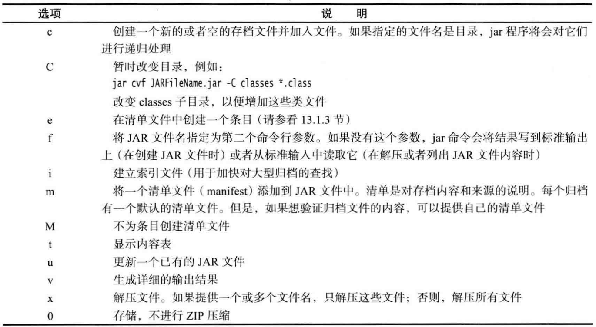
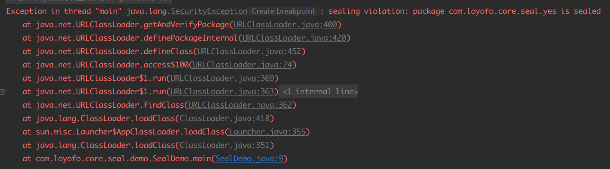

# █ 部署 java 应用

# 一. JAR 文件

在软件交付时, 我们通常会希望仅提供一个单独的文件, 而不是一个包含大量类文件的目录, 这种时候就可以将项目打包成 `jar` 文件. `jar` 同时也对文件进行了压缩, 采用了 `zip` 压缩格式. 

## 1. 创建 jar

jdk 中提供了 jar 工具制作 jar 文件, 放在`jdk/bin`中. 

> jar 选项参数 文件名列表/目录名

jar 命令格式如上, jar 提供了一些与 tar 相似的选项参数, 如下所示



```shell
# 将所有 class 文件和 icon.gif 放到一个 MyJar.jar 中
jar cvf MyJar.jar *.class icon.gif
```

实际项目开发中, 一般不会直接使用 jdk 中的 `jar` 工具打包, 而会借助 maven, gradle 或者是 ide 对项目进行打包.

## 2. 清单文件

除了显式指定的 class 文件和资源文件, 每个 jar 包的 `/META-INF` 目录中还有一个记录 jar 包必要信息的清单文件 `MANIFEST.MF`.

- 清单文件中可能包含多个节, 节与节之间用**空行隔开**
- 每个节中包含多个条目, 一个条目是以冒号`: `隔开的**键值对**, 如 `Manifest-version: 1.0`
- 第一节称为主节, 记录关于整个 jar 包的信息. 
- 后续的节的首行用 `NAME` 指定该节的**作用范围**, 比如某个包或某个文件, 或者是 url
- 清单文件的最后一行必须以**换行符结束**(即最后需要一个空行), 否则无法正确读取

```shell
# 自定义清单文件: 准备一个文本文件, 写好内容, 然后用 m 选项指定文件名
jar cfm MyArchive.jar manifest.mf com/mycompany/mypkg/*.class

# 更新已有jar中的清单文件: 准备一个文件写好需新增的内容, 使用 u+m 指定文件名
jar ufm MyArchive.jar manifest-additions.mf
```

## 3. 可执行的 jar

可执行的 jar 与普通 jar 的区别在于清单文件中指定了程序的入口(main方法所在类), 因此, 要创建可执行jar 可以通过以下方式

- 在 jar 命令中用 `e` 选项指定入口类(不需要 `.class` 后缀)

  ```shell
  jar cvfe HyPrograni.jar com.myconipany.iiiypkg.MainAppClass 其他文件
  ```

- 在 `MANIFEST.MF` 中声明主类(不需要 `.class` 后缀)

  ```
  Main-Class: com.myconipany.iiiypkg.MainAppClass
  ```

可以通过以下方式运行可执行的 jar

- 双击运行(windows)

- 通过命令运行

  ```shell
  java -jar myJar.jar
  ```

## 4. 资源文件

程序通常还需要访问一些数据文件, 如图片, 配置文件, 文本文件或其他二进制数据文件, 这些文件被称为 **资源**.

可以通过`class`对象 或 `classLoader` 来加载这些资源文件

```java
// 获取 class 文件
Class c = ResourceLoaderDemo.class;
// class.getResource() 会以当前类的路径为起点查找资源
System.out.println(c.getResource(""));
// class.getClassLoader().getResource() 会以项目 classpath 为起点查找资源
System.out.println(c.getClassLoader().getResource(""));
```

## 5. 密封

通常情况下, java 通过包名来确定类是否在同一个包内, 实现包可见性控制. 但默认情况下, 任何开发者可以为已存在的包添加新的类, 这就绕开了包可见的限制. 

为了保证包可见性, Java 提供了包密封的功能, 要想实现包密封, 需要做到:

-  将包内所有类放到同一个 jar 内
- 在清单文件中添加密封包的指令 `Sealed: true`
  - 如果添加在主节中, 则密封该 jar 下的所有包
  - 如果添加到 `Name: xxx` 的子节中, 则只密封指定的包

将一个包密封之后, 其他使用这个 jar 的开发者就不能通过使用相同的包名来为该包添加新类, 保证同一个包下的所有类都来自同一个 jar 中. 

如果尝试为密封包添加新类, 则程序运行时会抛出`sealing violation` 的错误 



# 二. 应用选项的存储

## 1. Properties

### properties 文件

`propertie map` 是存储键值对的数据结构，常用来存储程序的配置参数，记录到`.properties`文件中。

- 键和值都是字符串格式
- 用`=`分隔键和值，且`=`两侧无空格
- `#` 开头的行为注释行

### Properties 类

在 java 中，常用 `Properties` 类来操作property map，可以很容易地读写`properties`文件，并有一个二级表可以保存默认值

- 读写 property 键值对

  由于历史原因, `Properties`类实现了`Map<Object, Object>`, 因此也提供了`put/get`方法, 但应使用`getProperty`/`setProperty`方法来操作配置项

  ```java
  // setProperty 写入配置
  Properties properties = new Properties();
  properties.setProperty("intVal", "123");
  properties.setProperty("strVal", "luojbin");
  properties.setProperty("listVal", "Collections.singletonList");
  
  // getProperty 获取指定项的值
  String value = props.getProperty("intVal"));
  
  // 如果配置项不存在, 则 getProperty 返回 null
  String nullVal = props.getProperty("str"));
  assertNull(nullVal);
  ```

- 读写 properties 文件

  ```java
  // store, 将配置键值对写到输出流 
  OutputStream out = new FileOutputStream("src/main/resources/s13/prop.properties");
  properties.store(out, "test save properties");
  
  // load, , 从输入流中读取配置
  Properties props = new Properties();
  props.load(new FileInputStream("src/main/resources/s13/prop.properties"));
  props.forEach((k,v) -> System.out.println(k + "=" + v));
  ```

- 默认值

  ```java
  // 每次获取配置的时候, 可以指定默认值
  String defaultVal = props.getProperty("author", "luojbin");
  assertEquals("luojbin", defaultVal);
  
  // 也可以事先指定默认值, 在 getProperties 时就不需要单独指定默认值了
  // 先创建一个默认配置，设置各项的默认值
  Properties defaultProp = new Properties();
  defaultProp.setProperty("author", "luojbin");
  defaultProp.setProperty("address", "guangzhou");
  
  // 以一个已有的 properties 作为参数创建， 则原 properties 会作为默认值, 然后加载外部配置
  Properties props = new Properties(defaultProp);
  props.load(new FileInputStream("src/main/resources/s13/prop.properties"));
  
  // 从外部文件获取到的配置
  assertEquals("123", props.getProperty("intVal"));
  // 外部文件中没有的，会取默认值的配置
  assertEquals("luojbin", props.getProperty("author"));
  assertEquals("guangzhou", props.getProperty("address"));
  ```


## 2. Preferences

很多操作系统都提供了一个存储各种配置的中央存储库, 比如 windows 的注册表, `Preferences` 类以一种平台无关的方式提供了这个中央存储库的操作API.

`Preferences` 有一个树状结构, 每个节点是一个键值对映射表(map), 可以存储数值/字符串/字节数组. 为了增加灵活性, 每个用户有自己的树, 另外还有一个会影响所有用户的系统树.

如果应用中使用中央存储库来保存配置数据, 建议提供导入导出的功能, 以便用户进行跨设备的数据迁移.

- 选择需要的树, 用户树或系统树

  ```java
  // 获取用户树
  Preferences userRoot = Preferences.userRoot();
  // 获取系统树, 由于权限原因, 获取系统树可能会失败
  Preferences systemRoot = Preferences.systemRoot();
  ```

- 获取节点, 使用`/`进行路径分隔, 可以使用相对路径或绝对路径. 如果该节点不存在, 则会自动创建

  ```java
  // 如果节点路径等于包名, 可以通过 class 获取该节点
  Preferences userPackageNode = Preferences.userNodeForPackage(PreferenceDemo.class);
  
  // 相对路径, 获取下级节点
  Preferences node = userRoot.node("com/loyofo/pref");
  Preferences sonNode = node.node("son");		// /com/loyofo/pref/son
  
  // 绝对路径, 获取任意节点
  Preferences sonNode2 = node.node("/son");	// /son
  
  // 获取当前节点的所有子节点名称
  String[] children = node.childrenNames();
  
  // 不需要的节点, 需要先获取节点, 然后移除自身, 下级节点也会被直接移除
  node.removeNode();
  ```

- 读写节点, 读取信息时一定要提供默认值

  - 读写数据的时候, 需要指定数据的类型
  - 读取数据时要注意类型, 类型不正确时会被忽略, 直接使用默认值, 且无法事先判断一个数据项的类型

  ```java
  Preferences userRoot = Preferences.userRoot();
  Preferences node = userRoot.node("com/loyofo/data");
  
  // 往节点的映射表中添加数据, 字符串或数值
  node.put("strVal", "hello Pref");
  node.putInt("intVal", 123);
  node.putBoolean("boolVal", true);
  node.putByteArray("byteArray", "byte Array".getBytes(StandardCharsets.UTF_8));
  
  // 获取节点下所有 keys
  System.out.println(Arrays.toString(node.keys()));
  
  // 获取某个key的值
  System.out.println(node.get("strVal", "--empty--"));
  System.out.println(node.getInt("intVal", 0));
  System.out.println(node.getBoolean("boolVal", false));
  System.out.println(new String(node.getByteArray("byteArray", new byte[]{})));
  
  // 如果类型不正确, 不会抛出异常, 而是会用默认值替代
  System.out.println(node.getInt("strVal", -1));			// -1
  System.out.println(node.getBoolean("strVal", false));	// false
  System.out.println(node.get("strVal", ""));				// hello Pref 正确的数据
  System.out.println(node.getFloat("strVal", -1.0));		// -1.0
  ```

- 导入数据, 使用 xml 格式

  ```java
  Preferences userRoot = Preferences.userRoot();
  
  // 导出数据
  OutputStream treeOut = new FileOutputStream("target/subTree.xml");
  Preferences treeNode = userRoot.node("com");
  treeNode.exportSubtree(treeOut);
  
  OutputStream nodeOut = new FileOutputStream("target/node.xml");
  Preferences node = userRoot.node("com/loyofo/data");
  node.exportNode(nodeOut);
  ```

  导出的xml文件结构如下

  ```xml
  <?xml version="1.0" encoding="UTF-8" standalone="no"?>
  <!DOCTYPE preferences SYSTEM "http://java.sun.com/dtd/preferences.dtd">
  <preferences EXTERNAL_XML_VERSION="1.0">
    <root type="user">
      <map/>
      <node name="com">
        <map/>
        <node name="loyofo">
          <map/>
          <node name="data">
            <map>
              <entry key="strVal" value="hello Pref"/>
              <entry key="intVal" value="123"/>
              <entry key="boolVal" value="true"/>
              <entry key="byteArray" value="Ynl0ZSBBcnJheQ=="/>
            </map>
          </node>
        </node>
      </node>
    </root>
  </preferences>
  ```

- 导入数据

  ```java
  Preferences userRoot = Preferences.userRoot();
  Preferences node = userRoot.node("com/loyofo/data");
  node.removeNode();
  
  // 重新获取节点, 确认已清空
  node = userRoot.node("com/loyofo/data");
  System.out.println(Arrays.toString(node.keys()));	// []
  
  // 导入数据
  InputStream in = new FileInputStream("target/node.xml");
  Preferences.importPreferences(in);
  
  // 检查是否成功导入
  System.out.println(Arrays.toString(node.keys()));	// [strVal, intVal, boolVal]
  ```

# 三. 服务加载器 SPI

如果需要开发插件体系结构的应用, 实现可插拔的功能配置, Java 提供了一个加载插件的机制, 即`Service Provider Interface`.

为了保证插件能满足需求, 需要有一个规范, 即需要声明一个接口(*interface*), 并由插件实现这个接口, Java 利用 `ServiceLoader` 类来加载符合指定接口`interface` 的实现类.

- 定义一个接口(或超类)

  ```java
  public interface PetAnimal {
      /** 叫唤 **/
      void say();
  }
  ```

- 实现这个接口(或超类)

  ```java
  public class Cat implements PetAnimal {
      @Override
      public void say() {
          System.out.println("猫咪在叫 喵喵喵");
      }
  }
  ```

- 在`META-INF/services`目录下添加一个以接口全限定名为名称的文本文件, 内容为实现类的全限定名

  ```shell
  # META-INF/services/com.loyofo.core.spi.PetAnimal
  com.loyofo.core.spi.Cat
  ```

- 将描述文件和实现类打包成jar

- 客户端应用中, 添加实现类的jar, 并通过`ServiceLoader` 加载服务, 会返回一个迭代器, 然后在循环中选择合适的服务来完成服务

  ```java
  public class Zoo {
      public static ServiceLoader<PetAnimal> pets = ServiceLoader.load(PetAnimal.class);
      public static void main(String[] args) {
          System.out.println("动物园开门了");
          for (PetAnimal pet : pets) {
              pet.say();
          }
          System.out.println("动物园关门了");
      }
  }
  ```

  

