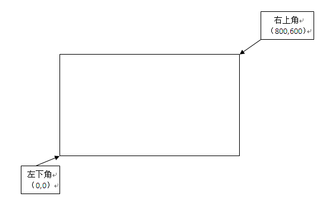

# █ OpenPdf 

# 一. 简介

## 1. OpenPdf 与 iText

在 java 程序中编辑 pdf, 很多人会推荐使用 iText, iText 虽然也是开源类库, 但是采用的是最严格的开源协议 AGPL, 该协议要求使用该类库的项目都必须继续采用 AGPL 协议进行开源, 否则需要购买商业许可.

由于这个协议的要求严格, 很多时候并不适合商业闭源项目采用, 为此, 推荐使用更为宽松的 OpenPdf, 采用的是 LGPL 协议, 允许在项目中引用该类库而不需将整个项目开源. 

OpenPDF, 其实是 iText 的衍生品, iText 在发布之初也是采用的 LGPL 协议, 后来 5.x 版本开始改用了严格的 AGPL. OpenPDF, 就是基于 iText 的最后一个 LGPL 版本 (4.2.0) 发展而来. 因此操作方式与 itext 相差无几, 网上大多数 iText 教程同样适用于 OpenPdf

[openPDF 的项目地址](https://github.com/LibrePDF/OpenPDF)

# 二. API 概述

## 1. 五步概述

1) 创建 Document

2) 创建文档 Writer

3) 打开文档

4) 编辑文档

5) 关闭文档

## 2. 文档对象

### 1) Document

pdf 文档对象, 有三个构造函数, 根据文档页面尺寸参数构造文档对象

```java
public Document();
public Document(Rectangle pageSize);
public Document(Rectangle pageSize, float marginLeft, float marginRight, float marginTop, float marginBottom);
```

其中参数列表为: 纸张大小, 四边页边距, 默认纸张大小为 A4, 默认边距为 36 磅

### 2) Rectangle

页面尺寸, 通过指定页面大小创建页面, 并旋转指定的角度

```java
// 指定尺寸创建页面
public Rectangle(float urx, float ury);
public Rectangle(float llx, float lly, float urx, float ury);

// 指定尺寸创建页面, 并旋转指定角度
public Rectangle(float urx, float ury, int rotation);
public Rectangle(float llx, float lly, float urx, float ury, int rotation);

// 根据已有页面复制
public Rectangle(Rectangle rect);
```

其中 llx, lly, urx, ury 四个参数表示矩形的左下角与右上角的坐标, 即页面大小等于以 (llx, lly) 和 (urx, ury) 两点为对角顶点的矩形区域大小, (llx, lly) 默认为 (0,0)



## 3) PageSize

PageSize 封装了许多常见页面尺寸的 Rectangle, 相当于 Rectangle 的枚举集合, 因此, 实际应用中不需要自己新建 Rectangle, 只需要在 PageSize 中选择合适的页面尺寸即可.

页面默认竖向放置, 如需横向页面, 可调用 `rotate()` 方法

```java
// 创建一个 A4 页面的文档对象
Document document = new Document(PageSize.A4);

// 创建一个 A4 页面的文档对象, 横向页面
Document document2 = new Document(PageSize.A4.rotate());
```

## 3. 内容对象

### 1) 中文支持 (字体设置)

主要是设置字体, 只要使用的字体支持中文, 那么就可以在 pdf 文档中使用中文. 因此中文设置, 其实就是字体设置

设置字体时, 首先需要通过 BaseFont, 选择字体类型, 再根据 BaseFont 创建新的 Font 对象, 设置字号, 颜色等更丰富的字体设置

```java
BaseFont bfSong = BaseFont.createFont("STSong-Light", "UniGB-UCS2-H", BaseFont.EMBEDDED);
Font song = new Font(bfSong);
```

支持三种方式设置字体:

- 使用内置设置的 CJK (chinese/japanese/korean)  字体, 但支持的字体数量较少

  支持的字体以及编码方式参考`com/lowagie/text/pdf/fonts/cjkfonts.properties` ,

  其中编码方式取 `UniCNS-UCS2-*`, H 表示水平排列, V 表示垂直排列

  ```java
  BaseFont bfSong = BaseFont.createFont("STSong-Light", "UniGB-UCS2-H", BaseFont.EMBEDDED);
  Font song = new Font(bfSong);
  document.add(new Paragraph("hello openpdf, 内置宋体测试, ok??", song));
  ```

- 使用 TTF 字体

  使用非内置字体时, 需要外部提供字体文件, 需要在创建 BaseFont 的时候指定字体文件路径

  ```java
  BaseFont bfYaHei0 = BaseFont.createFont("fonts/simkai.ttf", BaseFont.IDENTITY_H, BaseFont.NOT_EMBEDDED);
  Font yahei0 = new Font(bfYaHei0);
  document.add(new Paragraph("hello openpdf, 楷体中文测试, ok??", yahei0));
  ```

- 使用 TTC 字体组

  ttc 类型的文件是一个字体组, 其中包含多个字体, 因此使用 ttc 字体时需要指定字体文件路径, 并选择字体组中具体的字体

  如下例子中, `fonts/msyh.ttc,0`, 前面的 ``fonts/msyh.ttc` 是字体文件路径, `,0` 为字体组中字体序号, 序号从0开始

  ```java
  BaseFont bfYaHei1 = BaseFont.createFont("fonts/msyh.ttc,0", BaseFont.IDENTITY_H, BaseFont.NOT_EMBEDDED);
  Font yahei1 = new Font(bfYaHei1);
  document.add(new Paragraph("hello openpdf, 雅黑中文测试, ok??", yahei1));
  ```


### 2) Element 接口

内容对象基本都实现了这个接口, 如 Chunk, Phrase, Paragraph

该接口提供了各种内容对象公用的一些常量, 如定位参数, 内容类型等

### 3) Chunk 块对象

块( Chunk ) 是能被添加到文档的最小的文本单位, 可以用来构建其他的内容对象, 如短句, 段落, 锚点等

将块添加到文档之前, 必须先将块的布局属性设置好, 如背景色, 斜体, 字号等等

- 设置背景色
- 设置下划线/删除线
- 设置斜体
- 设置上浮或下标

### 4) Phrase 短语对象

### 5) **Paragraph** 段落对象

### 6) Image 图像对象

### 7) Anchor 锚点 

## 4. 表格与表单


# 三. 具体操作

