# 一. Junit

一个正式的编写好的单元测试用例的特点是：已知输入和预期输出，即在测试执行前就已知。已知输入需要测试的先决条件，预期输出需要测试后置条件。

每一项需求至少需要两个单元测试用例：一个正检验，一个负检验。如果一个需求有子需求，每一个子需求必须至少有正检验和负检验两个测试用例。

## 1. IDE 支持

### 1.1. Eclipse

#### 1) 运行测试

Eclipse 中, 如果检测到某类含有 `@Test` 方法, 则右键菜单中的 `Run As`/`Debug As`/`Coverage As` 项会提供 `JUnit Test` 的选项, 点击即可运行测试. 

- 如果想要运行某个特定的测试方法, 需要将光标放置在该方法的方法名上, 右键运行 `junit Test`
- 如果光标未放置在 `@Test` 方法的方法名上, 则会运行整个类中的所有测试.
- 如果在项目目录树中右键运行 `Junit Test`, 则会运行该目录下的所有测试.

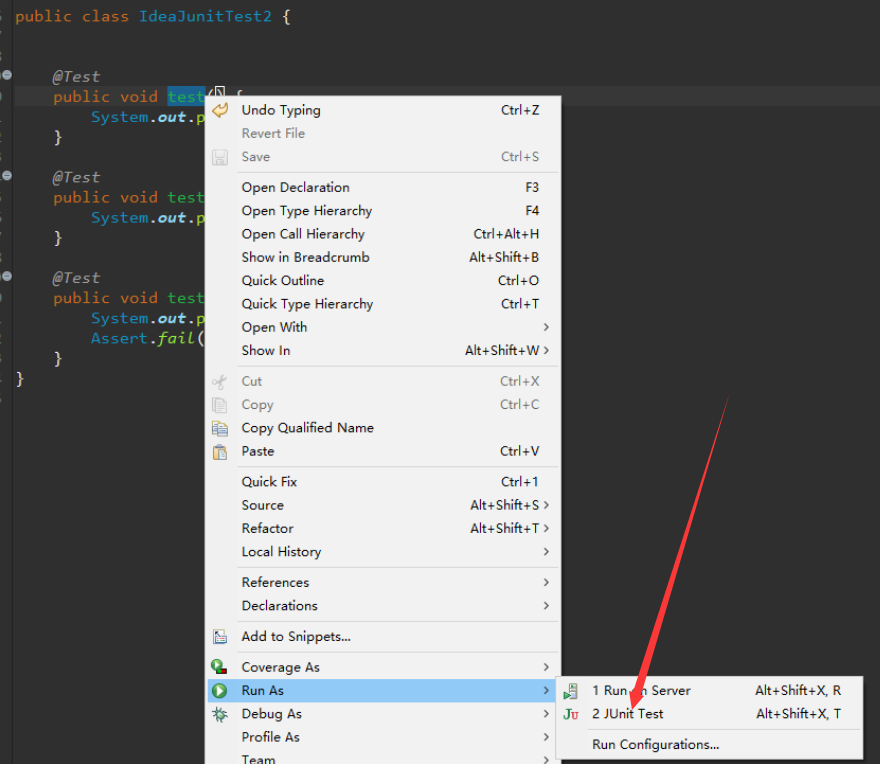

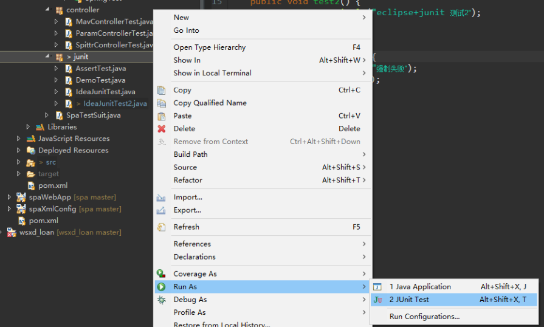

#### 2) 测试结果

Eclipse 提供了一个 Junit 的测试结果窗口, 有一个明显的指示条, 指示该次测试是否通过. 测试通过显示为绿色, 测试失败显示为红色. 

测试窗口主体分成两部分, 左边是测试方法列表, 右边是测试方法的失败信息. 对于测试通过的方法, 不会有任何的提示, 而对于失败的方法, 则会显示异常的栈轨迹. 

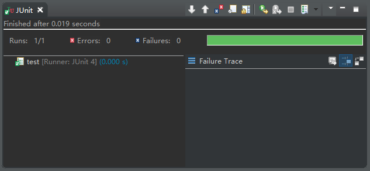

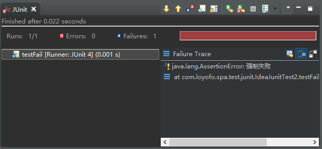

如果测试方法中包含任何输出到控制台的信息, 可以在 `console` 窗口中查看

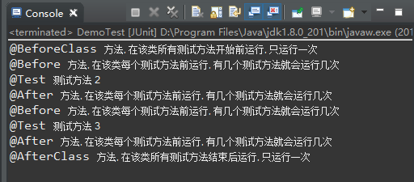

#### 3) 创建测试类

选中一个普通类, 右键菜单 - `New` - `Other…`, 在弹出的对话框中选择 `Junit Test Case`, 

 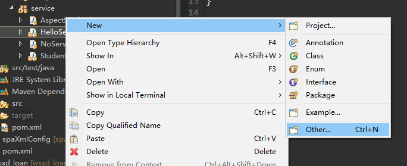

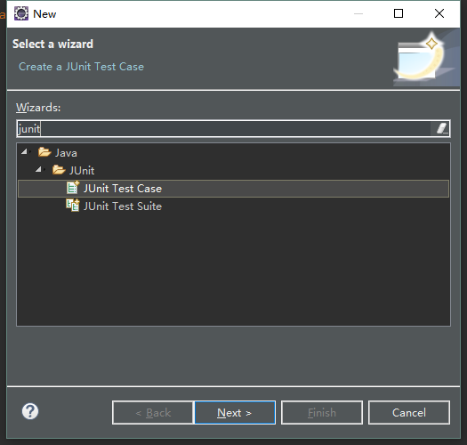

选择需要的测试框架, 设置文件路径和文件名

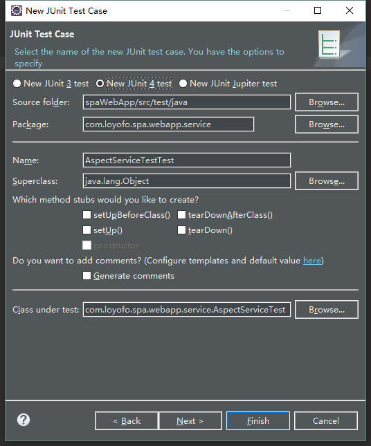

若点击 `Finish`, 则直接创建一个不含具体被测方法的空测试类, 仅包含一个示例的 `test()` 方法. 内容如下

```java
public class AspectServiceTest {
	@Test
	public void test() {
		fail("Not yet implemented");
	}
}
```

若点击 `Next`, 则会进入方法选择对话框, 选择需要的待测方法

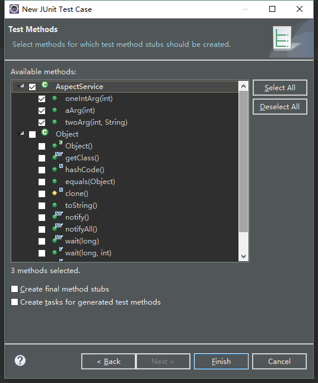

生成的测试类如下

```java
public class AspectServiceTest {
	@Test
	public void testOneIntArg() {
		fail("Not yet implemented");
	}

	@Test
	public void testAArg() {
		fail("Not yet implemented");
	}

	@Test
	public void testTwoArg() {
		fail("Not yet implemented");
	}
}
```

Eclipse 创建的测试方法, 都会调用 `Assert.fail()` 方法, 引发测试失败, 避免开发者忘记编写具体的测试代码.

### 1.2. Idea

#### 1) 测试方法提示图标

Idea 也提供了 Junit 测试插件, 可以方便的管理测试.

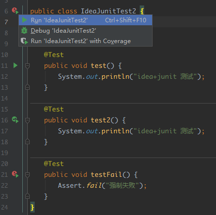

在检测到 `@Test` 注解后, 该类就成为一个 Juni t测试类, 在类声明及测试方法的声明前面, 会有提示图标, 并且该图标能根据最近一次测试结果变化, 未运行的测试是绿色三角形, 成功的测试带绿色对勾, 失败的测试带红色感叹号, 根据图标即可判断该测试方法的最近一次测试结果. 如果该类中有任意测试方法失败, 则类上显示的图标为红色感叹号.

#### 2) 运行测试

点击提示图标就能运行测试方法, 可以以 `Run`, `Debug`, `Run with Coverage` 三种方式运行测试.  

- 点击**类**上面的图标, 可以批量测试该类的所有方法, 

- 点击**方法**上的图标, 则仅运行指定的测试方法(`@Ignore` 方法只能这样运行). 

- 在项目目录树中, 右键点击目录, 还可以批量运行该目录下的所有测试, 如下图所示

  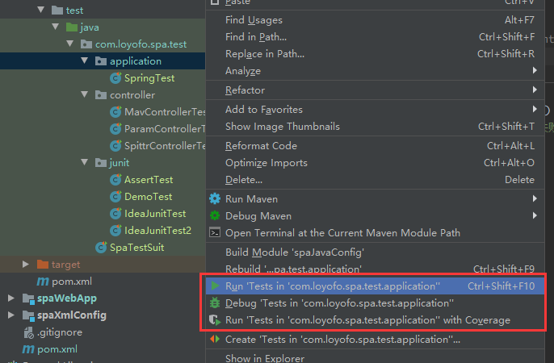

#### 3) 测试结果

与 Eclipse 不同, Idea 的 Junit 测试结果与 main 方法启动的程序一样, 在 `Run` 或 `Debug` 窗口中显示, 并未提供独立的 Junit 窗口. 测试结果分成两部分, 一部分是运行的测试方法列表, 另一部分为控制台输出信息.

在测试方法列表中, 成功的测试前面有绿色对勾, 失败的测试前面有黄色的叉.

控制台输出信息, 默认显示所有测试方法的输出内容, 不同测试方法之间有空行隔开. 点击测试方法列表中的某个方法, 则会隐藏其他测试的输出, 仅显示选中测试的输出.

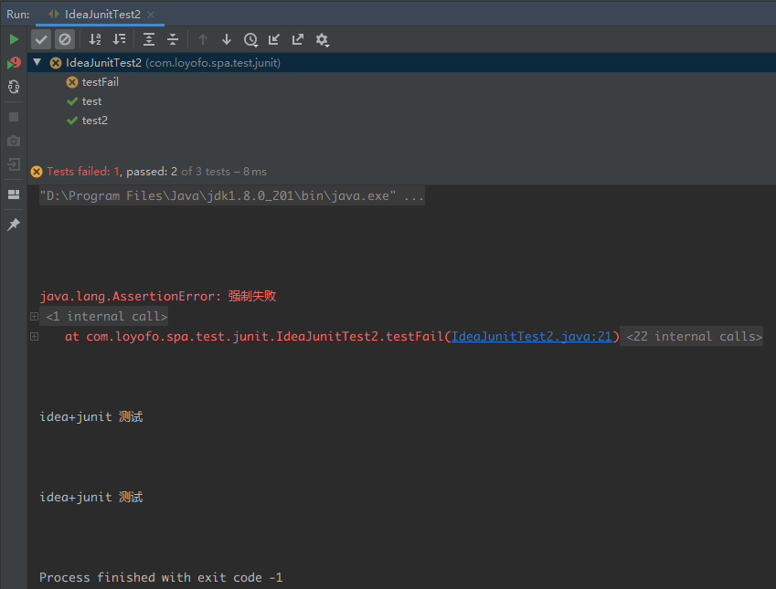

#### 4) 导航/创建测试类

Idea 通过文件名关联**待测类**和**测试类**, 若测试类以待测类名开头, 如下图所示的 `HelloService` 与 `HelloServiceTest`, 则将两者关联, 可以用快捷键 `Ctrl + Shift + T` 在两者之间跳转. 也可以在菜单栏 `Navigate - Test` 中调出.


若该类无对应的测试类, 则可以用`Create New Test` 选项快速创建单元测试类模板. 点击 `Create New Test` 后, 会打开一个创建测试类的配置对话框, 如下所示

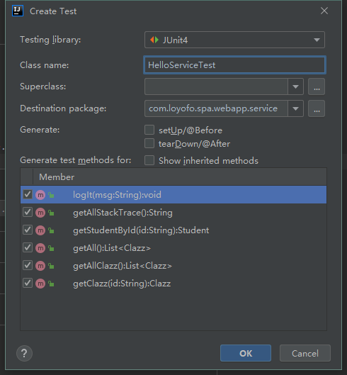

在创建对话框中, 可以选择需要的测试框架, 为测试类命名, 指定包名, 超类, 待测方法等, 点击 `OK` 即可完成测试类的创建. 创建的测试类为每个选中方法提供了一个测试方法, 方法体为空, 需要开发者自己编写测试代码.

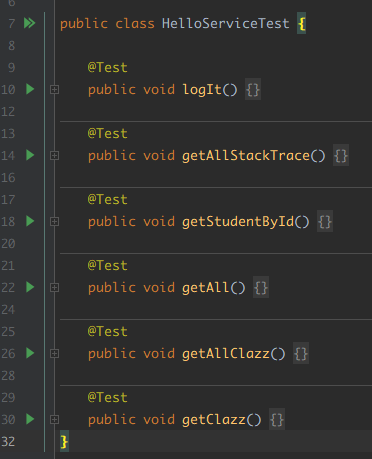

## 2. 注解

Junit 提供了很多有用的注解, 支持声明式的测试方法

- `@Test` 声明是一个测试方法, 只能用在 public void 的实例方法上
  - `expected` 属性, 可以指定测试方法抛出的异常类型, 满足则通过测试
  - `timeout` 属性, 可以指定测试方法的执行用时, 若超时则触发失败
- `@Ignore` 声明忽略该测试方法, 批量测试的时候会跳过, 只能单独运行
- `@Before` 需要在每个测试前运行, 如果类中有多个测试方法, 就会运行多次
- `@After` 需要在每个测试后运行, 如果类中有多个测试方法, 就会运行多次
- `@BeforeClass` 需要在整个测试类的所有测试方法之前运行, 只会运行一次
- `@AfterClass` 需要在这个测试类的所有测试方法之后运行, 只会运行一次

Junit 主要注解的测试如下:

```java
public class DemoTest {
    @BeforeClass
    public static void initMethod(){
        System.out.println("@BeforeClass 方法, 在该类所有测试方法开始前运行, 只运行一次");
    }
    @AfterClass
    public static void afterClass(){
        System.out.println("@AfterClass 方法, 在该类所有测试方法结束后运行, 只运行一次");
    }

    @Before
    public void beforeMethod(){
        System.out.println("@Before 方法, 在该类每个测试方法前运行, 有几个测试方法就会运行几次");
    }

    @After
    public void afterMethod(){
        System.out.println("@After 方法, 在该类每个测试方法前运行, 有几个测试方法就会运行几次");
    }

    @Test
    @Ignore
    public void test1() {
        System.out.println("@Test 测试方法 1, 批量测试时被忽略, 只能单独运行");
    }
    @Test
    public void test2() {
        System.out.println("@Test 测试方法 2");
    }
    @Test
    public void test3() {
        System.out.println("@Test 测试方法 3");
    }
}
```

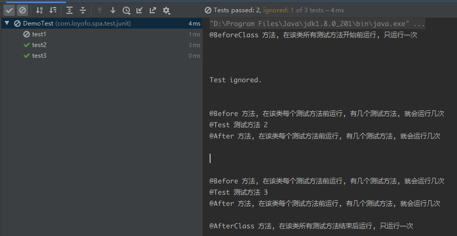

注意上图, 在整个类上运行测试时, `@Ignore` 标记的 `test1()` 会被跳过, 只输出一句 `Test ignored`. 如果需要运行该测试, 需要单独运行该测试方法, 结果如下


## 3. 断言

为了实现测试结果的自检验, Junit 提供了一个断言类 `org.junit.Assert`, 如果被测方法的返回结果不满足预期, 就会抛出 `AssertionError`, 触发测试失败.

`Assert` 类提供了以下方法, 均提供重载方法, 允许指定错误时的提示信息

| 方法                                                         | 描述                             |
| ------------------------------------------------------------ | -------------------------------- |
| **assertEquals**( *[String message]*, 期望值, 实际值)        | 两个值相等(equals), 支持各种类型 |
| **assertTrue**( *[String message]*, boolean condition)       | 条件为真                         |
| **assertFalse**( *[String message]*,boolean condition)       | 条件为假                         |
| **assertNotNull**( *[String message]*, Object object)        | 对象不为空( != null)             |
| **assertNull**( *[String message]*, Object object)           | 对象为空( == null)               |
| **assertSame**( *[String message]*, Object 期望值, Object 实际值) | 两个引用指向同一个对象( == )     |
| **assertNotSame**( *[String message]*, Object 不期望值, Object 实际值) | 两个引用指向不同对象( != )       |
| **assertArrayEquals**( *[String message]*, expectedArray, resultArray) | 预期数组和结果数组相等           |
| **assertThat**( *[String reason]*, T actual, Matcher matcher) | 结果值满足 Matcher               |

```java
public class AssertTest {

    @Test
    public void testEquals() {
        assertEquals("123", "456");
    }

    @Test
    public void testEquals2() {
        assertEquals("自定义错误信息", "123", "456");
    }

    @Test
    public void testArrayEquals2() {
        assertArrayEquals(new int[]{1, 2, 3}, new int[]{1, 2, 4});
    }
}
```

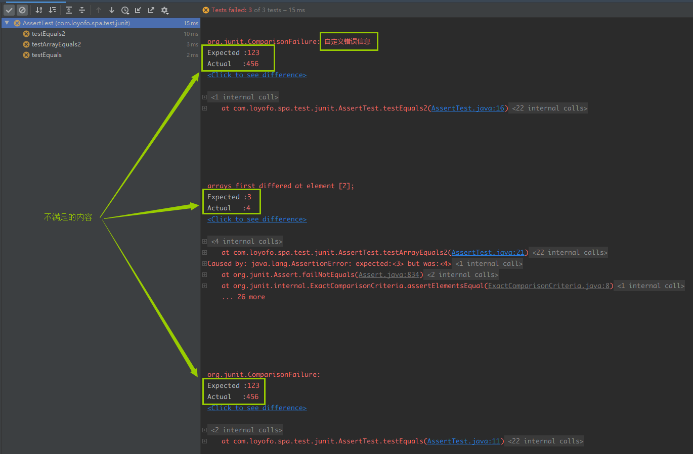

如上图所示, 通过 Junit 提供的断言类实现测试方法的自检验, 若测试失败, 会将自定义错误信息以及不满足的内容都输出到控制台中.

## 4. 测试套件

测试套件允许开发者整合多个测试类, 以便同时测试多个测试类. 构造测试套件, 需要借助以下两个注解

- `@RunWith`, 指定运行类为 `Suite.class`, 它支持将多个测试类组合成一次测试, 在一次测试中运行指定多个测试类中的所有测试. 需要配合下面一个注解
- `@Suite.SuiteClass`, 指定需要组合在一起的多个测试类, 运行测试套件的时候, 会按这里给定的顺序运行指定的测试类.

```java
@RunWith(Suite.class)
@Suite.SuiteClasses({
        MavControllerTest.class, 
        ParamControllerTest.class, 
        SpittrControllerTest.class})
public class SpaTestSuit {
}
```

虽然 Junit 提供了测试套件的功能, 但在实际开发工作中, 现代 IDE 已经对 Junit 提供了完善的支持, 如需要同时运行多个测试类时, 只需在测试类所在包上运行测试即可, 测试套件功能在此仅供了解.

## 5. 参数化测试

前面说过, 一个需求的完整测试应该包含两个方面:

- 正检验: 满足所有业务条件, 顺利通过测试
- 负检验: 在不满足业务条件时, 反馈恰当的错误信息

因此, 我们可能需要对同一个业务功能编写多个不同参数的测试方法, 复制粘贴虽然能够满足需求, 但是增加了工作量, 且不便日后的维护. 为了解决这种问题, Junit 提供了参数化测试.

#### 5.1. 参数化测试类

一个参数化的测试类, 需要满足以下几点要求

- 使用注解 `@RunWith(Parameterized.class)`, `Parameterized` 是 Junit 提供的运行类, 专门负责处理参数化测试
- 测试类提供一个`@Parameters` 的静态方法, 提供 `Collection<Object[]>` 类型的多组测试数据, 通常每组数据均包含输入数据和期望输出
- 测试类提供一个构造器, 使用一组测试数据进行初始化
- 测试类中含有 `@Test` 测试方法

```java
@RunWith(Parameterized.class)
public class ParameterTest {
    private int expected;
    private int first;
    private int second;

    public ParameterTest(int firstNumber, int secondNumber, int expectedResult) {
        this.expected = expectedResult;
        this.first = firstNumber;
        this.second = secondNumber;
    }

    @Parameters
    public static Collection addedNumbers() {
        return Arrays.asList(new Integer[][]{
            {1, 2, 3}, {2, 3, 5}, {3, 4, 7}, {4, 5, 9}
        });
    }

    @Test
    public void testSum() {
        assertEquals("求和方法计算错误", expected, sum(first, second));
    }

    @Test
    public void testOther() {
        System.out.println("其他测试");
    }

    public int sum(int a, int b){
        return a + b;
    }
}
```

运行测试, 会发现创建了4个测试类的实例, 且每个实例都运行了测试类中的所有方法.

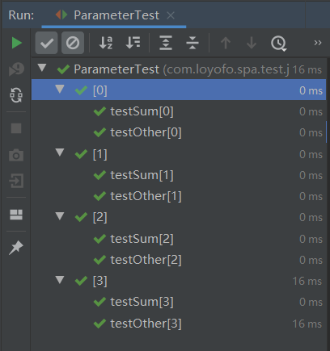

#### 5.2. 实例域参数注入

可以通过 `@Parameter` 注解进行实例域注入, 而不需提供构造器, 但要求实例域是 `public`, 否则无法注入. 如果有多个参数, 需要用下标指定需要注入的参数.

```java
@RunWith(Parameterized.class)
public class ParameterTest2 {
    // 实例域注入参数
    @Parameter
    public int first;
    @Parameter(1)
    public int second;
    @Parameter(2)
    public int expected;

    // @Parameters 的静态方法提供测试数据
    @Parameters
    public static Collection addedNumbers() {
        return Arrays.asList(new Integer[][]{
            {1, 2, 3}, {2, 3, 5}, {3, 4, 7}, {4, 5, 9}
        });
    }

    // 测试方法, 用测试类实例的实例域完成测试
    @Test
    public void testSum() {
        assertEquals("求和方法计算错误", expected, sum(first, second));
    }

    public int sum(int a, int b){
        return a + b;
    }
}
```

#### 5.3. 单参数测试类

从 4.12 起, 如果每组测试数据只有一个参数, 可以不用 Object[] 进行包装, `@Parameters` 方法可以直接返回 `Object[]` 或 `Iterable` 类型.

```java
@Parameters
public static Object[] data() {
    return new Object[] { "first test", "second test" };
}
```

或

```java
@Parameters
public static Iterable<? extends Object> data() {
    return Arrays.asList("first test", "second test");
}
```

#### 5.4. 为测试实例命名

为了更好的识别每个测试类实例, 用 `@Parameters` 注解的`name` 属性可以为测试类实例命名, 通过占位符可以指定与参数相关的名字.

- `{indea}`, 表示测试实例的下标
- `{0}`, `{1}`...`{n}`, 表示一个参数组中的第n个参数

```java
@RunWith(Parameterized.class)
public class ParameterTest2 {
    @Parameter
    public int first;
    @Parameter(1)
    public int second;
    @Parameter(2)
    public int expected;

    // @Parameters 的 name 属性为测试实例命名
    @Parameters(name = "{index}: {0} + {1} = {2}")
    public static Collection addedNumbers() {
        return Arrays.asList(new Integer[][]{
            {1, 2, 3}, {2, 3, 5}, {3, 4, 7}, {4, 5, 9}
        });
    }

    @Test
    public void testSum() {
        assertEquals("求和方法计算错误", expected, sum(first, second));
    }

    public int sum(int a, int b){
        return a + b;
    }
}
```

通过指定命名格式 `{index}: {0} + {1} = {2}`, 测试效果如下

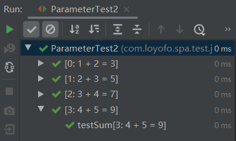

#### 5.5. 局限性

由于 Junit 的 `@RunWith` 注解只能指定一个运行类, 使用`Parameterized.class` 后就无法使用 `SpringRunner.class` 等其他运行类, 不便于与其他框架整合测试.

同时由于参数是通过测试类的实例域来提供, 也就是要求每个需要参数化测试的方法都用一个独立的测试类, 在实际项目中需要参数化测试的方法可能会非常多, 这会导致创建大量的测试类.

通常情况下, 可以通过循环的方式进行参数化测试.

```java
public class ParameterTest3 {
    @Test
    public void testMutilAssert() {
        String[] params = new String[]{
            "abcd1234",
            "abc",
            "测试失败",
            "12345678901234567890"
        };
        for (String str : params) {
            // testStr() 方法, 参数合法时直接通过, 参数不合法时抛出 RegexException
            try {
                // 正常参数顺利通过, 返回 true
                assertTrue(testStr(str));
            } catch (Exception e) {
                // 异常参数抛出 RegexException, 并返回指定消息
                assertEquals(RegexException.class, e.getClass());
                assertEquals("不符合正则规则: " + str, e.getMessage());
            }
        }
    }
    
    private boolean testStr(String str) {
        String regex = "[0-9a-zA-Z]{8,12}";
        if (str.matches(regex)) {
            return true;
        }
        throw new RegexException("不符合正则规则: " + str);
    }
}
```


## 6. 规则测试

JUnit中叫做规则的新功能，它允许非常灵活在测试类重新定义每个测试方法的行为。

- 测试类中提供`@Rule` 注解的 `TestRule` 类型的 `public` 实例域
- 在测试方法中指定期望规则, 然后调用待测方法, 若返回结果不满足规则, 则测试失败.

```java
public class RuleTest {
    @Rule
    public ExpectedException thrown = ExpectedException.none();

    @Test
    public void shouldTestExceptionMessage() throws IndexOutOfBoundsException {
        // 设置期望的异常信息
        thrown.expect(IndexOutOfBoundsException.class);
        thrown.expectMessage("Index: 0, Size: 0");
        List<Object> list = new ArrayList<>();
        list.get(0);
    }
}
```

# 二. Mockito

## 1. 概述

测试驱动的开发(TDD)要求我们先写单元测试，再写实现代码。在写单元测试的过程中，我们往往会遇到要测试的类有很多依赖，这些依赖的类/对象/资源又有别的依赖，从而形成一个大的依赖树，要在单元测试的环境中完整地构建这样的依赖，是一件很困难的事情。如下图所示： 


Mock 测试的核心目的, 就是要在**依赖不完备**的情况下完成待测组件的单元测试. 

比如需要测试 `A` 组件的功能, 但 `A` 需要依赖 `B`, 那么在 `B` 不可用的时候,  就没法进行 `A` 的单元测试. 开发团队需要先完成 `B` 的开发后, 才能进行 `A` 的开发. 这种情况下, 开发任务不能并行推进, 影响开发效率. 

Mockito 是优秀的 mocking 框架, 可以构造一个模拟对象 `B'`, 替代真实对象 `B` 参与到 `A` 组件的测试中去. Mockito 可以指定 Mock 对象 `B'` 的行为, 并验证其方法是否被正常调用.

为了方便测试类A，我们可以通过Mock, 模拟出一个B类和C类的实例（用虚拟对象来代替）如下图所示：

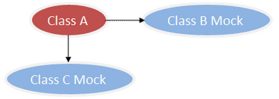

参考链接

[Mockito 官网]( http://mockito.org)

Mockito 通常与 JUnit 配合完成测试, 需要在项目中添加依赖

```xml
<dependency>
    <groupId>org.mockito</groupId>
    <artifactId>mockito-all</artifactId>
    <version>1.9.5</version>
    <scope>test</scope>
</dependency>
<dependency>
    <groupId>junit</groupId>
    <artifactId>junit</artifactId>
    <version>4.11</version>
    <scope>test</scope>
</dependency>
```

## 2. 基本使用

`Mockito.class` 是最主要的一个类, 提供了大量的静态方法, 为了方便使用, 通常会使用静态导入, 调用时只需写方法名而不需重复类名. 

```java
import static org.mockito.Mockito.*;
```

### 2.1. 构造对象

Mockito 可以通过多种方式构造模拟对象, 为了方便描述, 先定义一个接口和对应的实现类, 以便后续演示使用.

```java
// 声明一个 interface, 提供多个不同参数和返回值的方法
public interface MockInterface {
    String strMethod(String s);
    int intMethod(int n);
    boolean booleanMethod(boolean b);

    // 声明一个静态方法, 使用接口实例作为形参
    static void useInstance(MockInterface instance){
        System.out.println("正常传入 MockInterface 的实例");
    }
}

// 声明一个普通类, 实现上述接口的方法
public class MockObject implements MockInterface{
    @Override
    public String strMethod(String s) {
        System.out.println("真实对象调用 strMethod: " + s);
        return "真实对象返回内容";
    }
    @Override
    public int intMethod(int n) {
        System.out.println("真实对象调用 intMethod: " + n);
        return 2 * n;
    }
    @Override
    public boolean booleanMethod(boolean b) {
        System.out.println("真实对象调用 booleanMethod: " + b);
        return !b;
    }
}
```

Mockito 提供两种类型的模拟对象:

- `mock()` 方法构造一个目标类型的虚拟对象, 其行为与目标类型实例一致, 可作实参, 可调方法. 

  但模拟对象只是用目标类型的 class 文件创建一个空实例, 其所有方法都是空实现, 可以设置对象的行为

  ```java
  @Test
  public void testMock() {
      // mock() 方法可以通过 interface/class 构造模拟对象
      MockInterface mockByInterface = mock(MockInterface.class);
      MockObject mockByClass = mock(MockObject.class);
  
      // 行为与普通的 MockInterface 实例一致, 可作实参, 可调方法
      MockInterface.useInstance(mockByInterface);
      MockInterface.useInstance(mockByClass);
      mockByInterface.strMethod("mockByInterface 调用 String 方法");
      mockByClass.strMethod("mockByClass 调用 String 方法");
  }
  ```

  

- `spy()` 方法基于一个真实存在的对象创建代理对象, 是原对象的扩展, 原对象的真实方法会被调用, 但代理对象提供了验证功能, 并支持方法 stub 替换. 

  但与 `mock()` 方式创建的模拟对象不同,  通过具体实现类或普通实例创建的 spy 模拟对象, 相当于普通实例的一个包装类, 在调用模拟对象的方法时, 会调用普通实例的真实方法.

  - 对于未存根的方法调用, spy 会调用真实的方法, 返回真实的返回值
  - 对于已存根的方法调用, spy 仍会调用真实的方法, 但返回存根指定的返回值. 
  
  ```java
  @Test
  public void testSpys() {
      // spy() 方法可以通过 interface/class/已有对象 构造模拟对象
      MockInterface spyByInterface = spy(MockInterface.class);
      MockObject spyByClass = spy(MockObject.class);
      MockObject spyByRealObj = spy(new MockObject());
  
      // 行为与普通的 MockInterface 实例一致, 可作实参, 可调方法
      MockInterface.useInstance(spyByInterface);
      MockInterface.useInstance(spyByClass);
      MockInterface.useInstance(spyByRealObj);
      spyByInterface.strMethod("spyByInterface 调用 String 方法");
      spyByClass.strMethod("spyByClass 调用 String 方法");
      spyByRealObj.strMethod("spyByRealObj 调用 String 方法");
  
      when(spyByRealObj.intMethod(1)).thenReturn(100);
      assertEquals(spyByRealObj.intMethod(1), 100);// 存根方法
      assertEquals(spyByRealObj.intMethod(2), 4);// 未存根方法
  }
  ```
  
  另外应当注意, spy 虽然是基于一个真实对象创建, 但底层并未将方法调用委托给原对象, 而是创建了一个原对象的副本. 因此, 对 spy 对象进行的各项操作, 都不会影响原来的真实对象, 两者相互独立, 互不影响.
  
  ```java
  @Test
  public void testSpy() {
      List<Integer> list = new ArrayList<>();
      List<Integer> spyList = spy(list);
  
      list.add(1);
      list.add(2);
  
      spyList.add(3);
      spyList.add(4);
      spyList.add(5);
  
      assertEquals(list.size(), 2);
      assertEquals(spyList.size(), 3);
  }
  ```
  
- Mockito 不支持 final 类, 无法为 final 类创建 mock/spy 模拟对象. 如 String .

  另外, 对于 final 方法, mock/spy 对象也无法对 final 方法进行方法存根或扩展, 也无法提供调用验证. 

#### 3) 注解

可以通过注解创建模拟对象, 简化创建模拟对象的代码, 以便对模拟对象进行重用.

- 在测试类的实例域上使用 `@Mock`/`@Spy` 注解
- 在测试类构造函数中声明启用 mock 注解 `MockitoAnnotations.initMocks(this)`, 或使用`@RunWith(MockitoJUnitRunner.class)`
- 在测试方法中直接使用模拟对象

```java
public class MockAnnotationTest {
    @Mock private MockInterface mock;
    @Spy private MockObject spy;

    public MockAnnotationTest(){
        MockitoAnnotations.initMocks(this);
    }

    @Test
    public void testMockAnnotation() {
        when(mock.strMethod("@Mock")).thenReturn("注入成功, 可以调用");
        assertEquals(mock.strMethod("@Mock"), "注入成功, 可以调用");

        when(spy.strMethod("@Mock")).thenReturn("注入成功, 可以调用");
        assertEquals(spy.strMethod("@Mock"), "注入成功, 可以调用");
    }
}
```

### 2.2. 模拟行为(方法存根)

默认情况下, `mock()` 方法创建的模拟对象, 以及 `spy()` 方法通过 interface 的模拟对象, 都不提供真实的方法体和真实的返回值. 当这些方法被调用时, 引用类型方法会返回 null, 基本类型方法会返回相应的初始化值.

```java
@Test
public void testEmptyReturn() {
    MockInterface mockByInterface = mock(MockInterface.class);
    assertNull(mockByInterface.strMethod("mockByInterface 调用 String 方法"));
    assertEquals(mockByInterface.intMethod(1), 0);
    assertFalse(mockByInterface.booleanMethod(false));
}
```

mockito 允许为模拟对象指定行为, 称为**方法存根**, 可以规定指定入参调用指定方法时, 返回指定内容.

- 方法存根指方法**调用三要素**(对象+方法+参数)与**返回结果**的映射关系, 不同参数对应不同的返回结果
- 方法存根一旦创建, 就会一直存在, 不论调用多少次, 都能得到指定的结果
- 方法存根允许被覆盖, 但不常见, 如果需要用到存根覆盖, 往往表示存根太多
- 方法存根的顺序很重要, 指定多个返回结果时, 重复相同的方法调用会依次返回指定的结果, 若调用次数超过指定结果数量, 则后续调用都会返回最后一个指定结果.
- 方法存根不支持 final 方法, 也无法添加调用验证等功能. 

#### 1) when...then…

`when()`指定需要模拟的方法及入参, `thenReturn()` 指定返回值, `thenThrow()` 指定要抛出的异常

```java
@Test
public void testStubMethod() {
    MockObject mockObject = mock(MockObject.class);
    when(mockObject.intMethod(1)).thenReturn(100);
    assertEquals(mockObject.intMethod(1), 100);
}
```

可以用 `thenThrow()` 方法指定在特定入参时抛出异常

- 若仅指定异常类型, 无法设置异常信息
- 若指定异常对象, 则可以携带异常信息
- 若指定多个异常, 则会在重复调用时依次抛出, 最后一个异常会重复抛出

```java
@Test
public void testThrow() {
    boolean catchedCce = false;
    boolean catchedNpe = false;
    MockObject mockObject = mock(MockObject.class);

    // 可以指定抛出的异常类型, 但无法指定异常信息
    when(mockObject.strMethod("cce")).thenThrow(ClassCastException.class);
    try {
        mockObject.strMethod("cce");
    } catch (Exception e) {
        catchedCce = true;
        assertEquals(e.getClass(), ClassCastException.class);
    }
    assertTrue(catchedCce);

    // 可以指定抛出的异常对象, 可以指定具体异常信息
    NullPointerException npe = new NullPointerException("带信息的自定义异常");
    when(mockObject.strMethod("npe")).thenThrow(npe);
    try {
        mockObject.strMethod("npe");
    } catch (Exception e) {
        catchedNpe = true;
        assertEquals(e.getClass(), npe.getClass());
        assertEquals(e.getMessage(), npe.getMessage());
    }
    assertTrue(catchedNpe);
}
```

#### 2) do...when…

对于无返回值的方法, 编译器不允许在某方法调用的括号内调用无返回值方法, 因为无法满足参数要求. 针对此类情况, mockito 提供了另外一种模拟方法的语法结构, 但会比 `when(...).thenReturn(...)` 结构稍微复杂一点点.

> doAnswer(Answer).when(模拟对象).void方法(参数)

`doAnswer()` 方法中需要传入一个 Answer 的实现类, 这是一个函数式接口, 也可以用 lambda 表达式提供, 注意要模拟的 void 方法此处可以返回任何内容, 一般建议返回 `null`.

实际上 `doAnswer(Answer)` 这种方式适用于所有类型的方法调用, 但由于结构复杂, 对于有返回值的方法, 还是建议使用 `when(...).thenReturn(...)` 结构, 可读性更好. 

```java
@Test
public void testVoid() {
    MockObject mockObject = mock(MockObject.class);
    List<String> list = new ArrayList<>();
    list.add("列表原有元素");

    doAnswer(new Answer() {
        @Override
        public Object answer(InvocationOnMock invocation) throws Throwable {
            List<String> list = invocation.getArgument(0);
            list.add("模拟对象添加元素");
            return null;
        }
    }).when(mockObject).voidMethod(list);
    assertEquals(list.size(), 1);
    mockObject.voidMethod(list);
    assertEquals(list.size(), 2);

    doAnswer(i -> {
        String param = i.getArgument(0);
        return param + " 也是没问题的";
    }).when(mockObject).strMethod("strMethod");
    assertEquals(mockObject.strMethod("strMethod"), "strMethod 也是没问题的");
}
```

#### 3) 无法 when.then 

还有一些时候, 可能无法使用 `when.then` 结构, 这时候可以选择使用`doReturn`/`doThrow`/`doAnswer` 等方法

- spy对象的真实方法会被调用, 可能会抛出异常
- mock对象事先设置为抛出异常, 后面需要取消异常抛出

```java
@Test
public void testWhenFail() {
    List<String> list = spy(new ArrayList<>());

    // 真实的 list 对象会被调用, 此时会抛出异常, 改用 doReturn 处理
    // when(list.get(0)).thenReturn("空列表");
    doReturn("空列表").when(list).get(0);
    assertEquals(list.get(0), "空列表");

    MockObject mockObject = mock(MockObject.class);
    when(mockObject.intMethod(1)).thenThrow(ClassCastException.class);

    // 此处会抛出事先设置的异常, 改用 doReturn
    // when(mockObject.intMethod(1)).thenReturn(100);
    doReturn(100).when(mockObject).intMethod(1);
    assertEquals(mockObject.intMethod(1), 100);
}
```

- doReturn
- doThrow
- doAnswer
- doNothing
- doCallRealMethod

#### 4) 连续调用

某些情况下, 可能要求在相同方法多次调用时获取不同的值, 比如弹栈, 或是迭代器操作. Mockito 支持此类方法的存根. 只需在同一个 `when()` 后连续使用 `thenReturn()` 即可. 但应注意, 若多次进行 `when...then...` 创建方法存根, 后面的会覆盖前一次的存根, 无法以相同方法调用获取不同结果. 

```java
@Test
public void testStubMethod() {
    MockObject mockObject = mock(MockObject.class);
    String param = "指定入参";
    String return1 = "返回值-1";
    String return2 = "返回值-2";
    String return3 = "返回值-3";
    when(mockObject.strMethod(param))
        // 指定返回值, 重复调用时按给定顺序返回不同的值, 最后一个返回值会重复返回
        .thenReturn(return1)
        .thenReturn(return2)
        .thenReturn(return3);
    // 连续调用, 按顺序返回结果
    assertEquals(mockObject.strMethod(param), return1);
    assertEquals(mockObject.strMethod(param), return2);
    assertEquals(mockObject.strMethod(param), return3);
    assertEquals(mockObject.strMethod(param), return3);
}
```

#### 5) 覆盖

方法存根可以覆盖, 重新为方法调用指定结果

```java
@Test
public void testOverrideStub() {
    MockObject mockObject = mock(MockObject.class);
    when(mockObject.intMethod(1)).thenReturn(1);
    assertEquals(mockObject.intMethod(1), 1);
    assertEquals(mockObject.intMethod(1), 1);
    assertEquals(mockObject.intMethod(1), 1);

    // 覆盖存根
    when(mockObject.intMethod(1)).thenReturn(100);
    assertEquals(mockObject.intMethod(1), 100);
    assertEquals(mockObject.intMethod(1), 100);
    assertEquals(mockObject.intMethod(1), 100);
}
```

#### 6) 回调

通常情况下, `thenReturn()` 和 `thenThrow()` 用来指定返回结果, 在测试场景中已经够用的, 但 mockito 也提供了更灵活的方法回调, 允许用 `then()` 方法需要的回调方法. 

这是通过 `Answer` 这个泛型类来实现的. 这是一个函数式接口, 支持 lambda 表达式.

```java
@Test
public void testAnswer() {
    MockObject mockObject = mock(MockObject.class);
    when(mockObject.intMethod(1)).then(new Answer<Integer>() {
        @Override
        public Integer answer(InvocationOnMock invocationOnMock) throws Throwable {
            return (Integer) invocationOnMock.getArgument(0) + 10;
        }
    });
    // 使用 lambda
    when(mockObject.intMethod(2)).then(call -> (Integer)call.getArgument(0) * 100);
    assertEquals(mockObject.intMethod(1), 11);
    assertEquals(mockObject.intMethod(2), 200);
}
```

#### 7) final 方法

不支持对 final 方法的扩展, 因此无法完成方法存根/调用验证等功能. 

```java
@Test
public void testFinal() {
    MockObject mock = mock(MockObject.class);
    MockObject spy = spy(MockObject.class);

    // 无法覆盖 final 方法, 始终会返回 10
    assertEquals(mock.finalInt(1), 10);
    assertEquals(spy.finalInt(1), 10);

    // 无法完成方法存根
    // when(mock.finalInt(1)).thenReturn(2);
    // when(spy.finalInt(1)).thenReturn(3);

    // 无法验证方法调用
    // verify(mock).finalInt(1);
    // verify(spy).finalInt(1);
}
```

#### 8) 默认返回值

默认情况下, 未存根的方法会返回 null 值或初始化值, 但也可以手动指定默认值

Mockito 提供了 `RETURNS_SMART_NULL`, 可以避免返回 null 值

```java
@Test
public void testReturnValue() {
    MockObject mock = mock(MockObject.class);
    MockObject smartMock = mock(MockObject.class, RETURNS_SMART_NULLS);
    // 普通 mock 返回null, smartMock 返回空字符串
    assertNull(mock.strMethod(""));
    assertEquals(smartMock.strMethod(""), "");
}
```

Mockito `Anwsers` 是一个枚举类, 提供了多个预设的返回值策略, 开发者也可以实现 `Answer` 接口, 提供自定义的默认返回值.

#### 9) 参数捕获

可以对模拟对象的方法调用参数进行捕获以进行后续校验

通常只推荐将ArgumentCaptor 用作校验, 但不要用来存根

自定义的参数匹配器更适合于方法存根

```java
@Test
public void testCaptureArg() {
    MockObject mock = mock(MockObject.class);
    mock.intMethod(123);
    mock.strMethod("参数捕获");
    mock.add(100,50);

    // 获取方法被调用时的参数
    ArgumentCaptor<Integer> intArg1 = ArgumentCaptor.forClass(Integer.class);
    ArgumentCaptor<Integer> intArg2 = ArgumentCaptor.forClass(Integer.class);
    verify(mock).add(intArg1.capture(), intArg2.capture());

    ArgumentCaptor<String> strArg = ArgumentCaptor.forClass(String.class);
    verify(mock).strMethod(strArg.capture());

    // 对捕获的参数进行校验
    assertEquals((int)intArg1.getValue(), 100);
    assertEquals((int)intArg2.getValue(), 50);
    assertEquals(strArg.getValue(), "参数捕获");
}
```

某种意义上, 参数捕获器`ArgumentCaptor` 与自定义的参数匹配器类似, 都可以用来确定方法以特定参数调用, 参数捕获器在以下场景更加合适

- 自定义参数匹配器不会被重用, 若仅使用一次, 参数捕获器更加方便
- 只需要对参数进行断言校验

参数匹配器通常用与设置方法存根

#### 10) 部分模拟

如果需要调用模拟对象的真实方法, 通常我们可以使用 `spy()` 构造的模拟对象. 但在某些时候, 我们可能希望 `mock()` 方法构造的模拟对象也能调用实际方法. 这时候只需要在方法存根时选择 `thenCallRealMethod()`

但应该注意, 被调用的真实方法应该是安全的, 如果该方法抛出异常, 或是依赖于某些具体状态, 则此时的方法调用可能会出问题. 

```java
@Test
public void testPartial() {
    // 普通 mock 对象, 不会调用真实方法
    MockObject mock1 = mock(MockObject.class);
    mock1.intMethod(200);

    // partial Mock, 方法存根时选择 thenCallRealMethod(), 会调用真实方法
    MockObject partialMock = mock(MockObject.class);
    when(partialMock.intMethod(400)).thenCallRealMethod();
    partialMock.intMethod(400);
}
```

#### 11) 重置模拟对象

通常建议在每个独立的测试方法中创建独立的模拟对象, 但有时候可能需要使用 `reset()` 重置模拟对象. 这个功能主要是用在容器注入的模拟对象中, 其他情况尽量构造全新的模拟对象.

```java
@Test
public void testReset() {
    MockObject mock = mock(MockObject.class);
    when(mock.intMethod(1)).thenReturn(100);
    when(mock.intMethod(2)).thenReturn(222);

    System.out.println(mock.intMethod(1));
    System.out.println(mock.intMethod(2));

    System.out.println("重置mock");
    reset(mock);
    System.out.println(mock.intMethod(1));
    System.out.println(mock.intMethod(2));
}
```

#### 12) 验证 mockito 的被正确使用

可以调用 `validateMockitoUsage()` 方法来显示检查 mockito 的调用状态, 确保 mockito 被正确使用. 但这个显示的检查操作不是必要的, 因为 mockito 会在每次使用前都进行检查(验证, 存根, 调用模拟对象等). 

但默认的检查也会有一个问题, mockito 总是在每次调用前, 检查之前操作是否正确, 但如果是测试方法的最后一行出现错误, 则单独执行这个方法时并**不会抛出异常**. 

如下例所示的两个测试方法, 最后一句都是错误调用, 但单独执行的时候, 两个方法都能通过测试. 只有在先后连续执行 `test1` 和 `test2` 两个测试时, mockito 在执行`test2` 时检查到 `test1` 的最后一条语句调用错误, 抛出调用异常, 引发`test2` 的失败. 

虽然 `test2` 中给出的错误信息已经说明了错误发生在 `test1`, 但在 `junit` 等测试框架中, `test1` 中出现的异常造成 `test2` 的失败依然会令人疑惑. 

因此, 建议在成熟的测试体系中, 在 `@After` 方法内调用`validateMockitoUsage()`, 在每个测试方法结束后都检查 mockito 被正确使用, 立即发现错误调用, 避免引起测试方法间的干扰. 

```java
@Test
public void test1() {
    MockObject mockObject = mock(MockObject.class);
    // 错误调用, 没有设置 then
    when(mockObject.booleanMethod(false));
}

@Test
public void test2() {
    MockObject mockObject = spy(MockObject.class);
    // 错误调用, 没有设置 then
    when(mockObject.booleanMethod(false));
}
```

### 2.3. 验证行为

模拟对象创建以后, 会通过方法调用记录器记录所有对象相关的所有操作, 可以检验某些操作是否被执行. 

可以检测 mock 对象中的某个方法是否被调用, 并且提供调用计数

`verify()`, 验证某对象的某方法是否被调用, 第二个参数为调用次数限制, 省略则默认为 `times(1)`

`times()`, 限制方法调用次数

`atLeast()`, 要求方法至少调用几次

`atMost()`, 要求方法至多调用几次

`never()`, 要求方法从未被调用

#### 1) 无序验证

不考虑方法调用的先后顺序, 每个方法独立检验调用次数

```java
@Test
public void testTimes() {
    MockObject mockObject = mock(MockObject.class);
    when(mockObject.intMethod(1)).thenReturn(1);
    when(mockObject.intMethod(2)).thenReturn(2);
    when(mockObject.intMethod(3)).thenReturn(3);
    mockObject.intMethod(1);

    mockObject.intMethod(2);
    mockObject.intMethod(2);

    mockObject.intMethod(3);
    mockObject.intMethod(3);
    mockObject.intMethod(3);

    verify(mockObject).intMethod(1);
    verify(mockObject, times(2)).intMethod(2);
    verify(mockObject, atLeast(3)).intMethod(3);
    verify(mockObject, atMost(4)).intMethod(3);
    verify(mockObject, never()).intMethod(4);
}
```

#### 2) 顺序验证

检验方法必须是按顺序被调用的, 需要借助 `InOrder` 的实例进行检验. 

- 多个模拟对象时, 要求多个对象的方法按顺序调用
- 顺序检验不要求挨个检验所有方法调用, 仅要求被检查的方法调用符合指定顺序.
- 前一个校验通过后, 后一个校验只会在通过校验的方法后进行查找, 如下例找到 C 处即视为通过. 

```java
@Test
public void testOrder() {
    MockObject mock1 = mock(MockObject.class);
    MockObject mock2 = mock(MockObject.class);
    MockObject mock3 = mock(MockObject.class);

    mock1.strMethod("mock1-1");
    mock2.strMethod("mock2-1");// A
    mock3.strMethod("mock3-2");

    mock1.strMethod("mock1-2");
    mock1.strMethod("mock1-3");// B
    mock2.strMethod("mock2-1");// C
    mock1.strMethod("mock1-3");// D
    mock1.strMethod("mock1-3");// E

    // 将需要按顺序检验的模拟对象, 创建顺序校验器
    InOrder inOrder = inOrder(mock1, mock2, mock3);

    inOrder.verify(mock1).strMethod("mock1-1");
    inOrder.verify(mock1).strMethod("mock1-2");
    inOrder.verify(mock1).strMethod("mock1-3");
    // 校验在 mock1-3 后的 mock2-1, 找到 C
    inOrder.verify(mock2).strMethod("mock2-1");
    // 校验在 mock2-1 后的 mock1-3, 找到 D 和 E
    inOrder.verify(mock1, times(2)).strMethod("mock1-3");
}
```

#### 3) 冗余/无用验证

可以验证一个模拟对象没有调用过任何方法

`verifyNoMoreInteractions`, 除了已经检验的方法调用外, 该模拟对象没有更多的调用

`verifyZeroInteractions`, 验证该模拟对象从未被使用

```java
@Test
public void testNeverUsed() {
    MockObject mock1 = mock(MockObject.class);
    MockObject mock2 = mock(MockObject.class);
    MockObject mock3 = mock(MockObject.class);

    mock1.strMethod("mock1");
    mock1.strMethod("mock1");
    mock1.strMethod("mock1");
    verify(mock1, times(3)).strMethod("mock1");

    // 检验没有更多的调用
    // mock1.strMethod("mock2");
    verifyNoMoreInteractions(mock1);

    // 检验从未使用 mock2 和 mock3
    verifyZeroInteractions(mock2, mock3);
}
```

### 2.4. 参数匹配

默认情况下, 创建方法存根时, 其方法调用的参数部分用 `equals()` 方法进行匹配, 但有时候可能需要更加灵活的参数匹配规则. 

mockito 提供了多个形如 `anyX()` 的方法, 提供更灵活的参数匹配方式, 如果仍不能满足需要, 开发者可以自行实现 `ArgumentMatcher` 接口, 在 `matches()` 方法中实现自己的匹配规则. 使用自定义的 `ArgumentMatcher` 时, 需要将其实例用  `xxThat()` 包裹起来. 

#### 1) 根据参数匹配返回值

```java
@Test
public void testParamMatch() {
    MockObject mockObject = mock(MockObject.class);
    // 参数匹配所有 int 类型的值
    when(mockObject.intMethod(anyInt())).thenReturn(1);
    assertEquals(mockObject.intMethod(1), 1);
    assertEquals(mockObject.intMethod(2), 1);
    assertEquals(mockObject.intMethod(3), 1);

    // 可以在验证方法时使用参数匹配
    verify(mockObject, times(3)).intMethod(anyInt());
}
```

#### 2) 自定义匹配规则

自定义参数匹配, 可以通过`argThat(ArgumentMatcher<T>)` 方法指定自定义的参数匹配器的实现, 其中 `ArgumentMatcher` 是一个函数式接口, 支持 lambda 表达式

```java
class MyMatcher implements ArgumentMatcher<String> {
    @Override
    public boolean matches(String argument) {
        return argument.startsWith("true");
    }
}
```

```java
@Test
public void testMyMatcher() {
    MockObject mockObject = mock(MockObject.class);
    MyMatcher myMatcher = new MyMatcher();
    when(mockObject.strMethod(argThat(myMatcher))).thenReturn("true");
    assertEquals(mockObject.strMethod("true1"), "true");
    assertEquals(mockObject.strMethod("true2"), "true");
    assertNull(mockObject.strMethod("a"));
    verify(mockObject, times(2)).strMethod(argThat(myMatcher));
}

@Test
public void testLambdaMatcher() {
    MockObject mockObject = mock(MockObject.class);
    // 参数匹配自定义规则
    when(mockObject.strMethod(argThat(s->s.startsWith("true")))).thenReturn("true");
    assertEquals(mockObject.strMethod("true1"), "true");
    assertEquals(mockObject.strMethod("true2"), "true");
    assertNull(mockObject.strMethod("a"));

    verify(mockObject, times(2)).strMethod(argThat(s -> s.startsWith("true")));
}
```

#### 3) 统一使用匹配器

在多参数的方法中, 如果使用了参数匹配器, 则要求全部参数都统一使用参数匹配器.固定参数可以使用 `eq()` 匹配器

```java
@Test
public void testAllMatcher() {
    MockObject mockObject = mock(MockObject.class);
    // 多参方法中, 若使用了匹配器, 则所有参数都要用匹配器
    // when(mockObject.add(anyInt(), 1)).thenReturn(100);
    when(mockObject.add(anyInt(), eq(1))).thenReturn(100);
    assertEquals(mockObject.add(10, 1), 100);
}
```

### 2.4. 原理解释

注意到 `when(...).thenReturn(...)` 这个调用结构比较特殊,  按照前面所说, 默认情况下模拟对象调用方法都会返回默认空值, 此处 `when()` 的实参 `mockObject.strMethod(param)` 应该会返回一个 String 类型的 Null 值, 即 `when()` 方法其实是 `when(null)`, 以 null 为入参, 为什么能为指定的方法设置返回值呢? 

让我们看看下面这段演示代码. 

```java
@Test
public void testWhen() {
    String param = "指定入参";
    String return1 = "返回值-1";

    // step1.直接先调用一次, 能验证方法被调用过一次
    MockObject mockObject = mock(MockObject.class);
    mockObject.strMethod(param);
    verify(mockObject, times(1)).strMethod(param);

    // step2.模拟对象再次调用方法
    mockObject.strMethod(param);
    // step3.此时调用计数是2, 但只能在step4及以后代码被注释时才能验证, 否则 when(null) 会报错
    // verify(mockObject, times(2)).strMethod(param);

    // step4.紧跟在模拟对象方法调用后, 以 null 或任意 String 调用 when 方法, 都能正常模拟行为
    when((String)null).thenReturn(return1);
    // step5.when 方法前的方法调用, 该次方法调用被撤销, 调用计数仍然为1
    verify(mockObject, times(1)).strMethod(param);
    // step6.再次调用后能获取指定的返回值, 调用计数+1
    assertEquals(mockObject.strMethod(param), return1);
    verify(mockObject, times(2)).strMethod(param);
}
```

关键在于 mockito 提供了一个**调用记录器**, 能记录模拟对象在何时调用了哪些方法. 模型行为的大致原理如下

- 模拟对象以指定参数调用一次, 调用记录器记录下本次调用的参数等, 调用计数+1, 如`step1`,`step3`

-  `when()` 时, 从调用记录器中找到最近一次方法调用, 视为当前需要模拟的方法, 为该方法设置返回值.

  `when()` 方法其实不需要实参具体数据, `step4` 中可以传入任意的String. 只需要根据实参的类型, 作为返回值的类型参数, 对 `thenReturn()` 方法的实参类型做限制.

- mockito 将该次调用记录撤销, 调用计数-1. 如上例所示, 原本在 `step3` 能验证为2, `step5` 中验证为1

- 再次通过模拟对象调用方法, 得到 `step4` 中设置的返回值, 并验证调用计数为2

### 4) 智能空值

在创建mock对象时，有的方法我们没有进行stubbing，所以调用时会返回 Null, 这样在进行操作是很可能抛出NullPointerException.

如果在构造 mock 对象时指定 `RETURNS_SMART_NULLS`, 那么在操作 mock 对象未 stub 的方法时会根据返回值的类型, 返回合适的空对象. 如 `String` 会返回空字符串`""`; `int`返回`0`, `List`返回空的`List` 


## 2. 关键 API

- `mock()`/`@Mock`, 
  - 创建 mock 对象, 可以通过 `Answer`/`MockSettings` 来指定 mock 对象的行为
  - `when()`/`given()` 方法可以指定 mock 对象的行为
  - 如果自带的 `Answer` 不能满足需求, 可以自己扩展`Answer` 接口
- `spy()`/`@Spy`
  - 基于真实对象构造代理对象, 真实方法会被调用, 且可以进行验证和stub
- `@InjectMocks`
  - 自动注入被`@Mock`/`@Spy` 注解的域
- `verify()`
  - 验证方法是否以指定参数调用
  - 能灵活地指定参数匹配模式, 比如通过 `any()` 方法
  - 能用`@Captor` 捕获参数

 

## 3. 实例演示


# spring-test

# hamcrest

# postman

## 基本工作界面

地址栏

请求方式

param/header/body

pre-request/Tests

environment

## 工作区 workspace

可以建立多个工作区, 将不同的项目接口测试放到不同的工作区中, 分类管理.

每个工作区内, 可以为不同的项目分不同的 Collections,且 collection 下可以创建多级目录

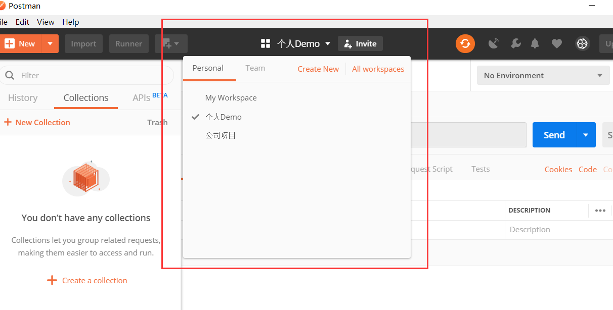


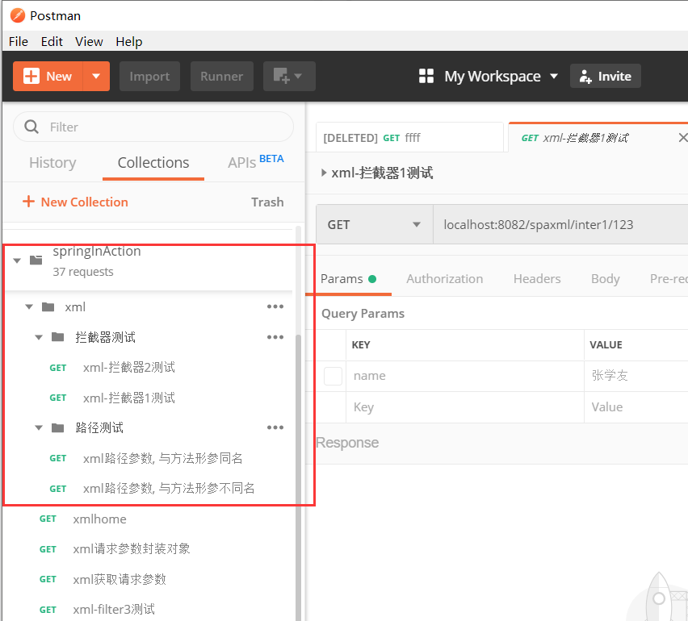

## environment 环境变量

可以为不同的环境, 预设一些变量, 然后在请求地址/请求参数等地方, 通过双大括号`{{key}}` 引用变量的值

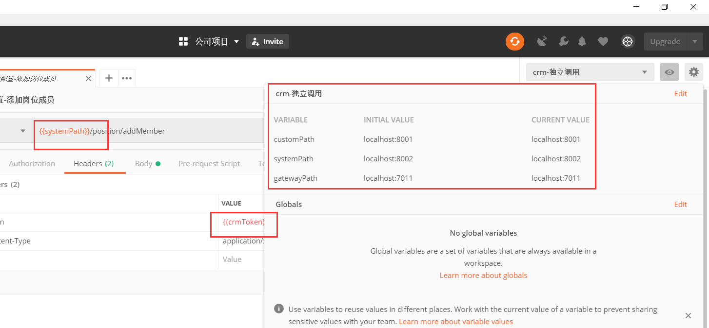

配合脚本, 可以方便管理请求的具体内容

比如登录操作, 可以在登录请求的`Tests` 窗口中, 设置请求后的操作, 将 `token` 添加到环境变量中, 其他请求就可以直接获取最新的 token 的值, 不需要每次手动修改每个请求的 token 

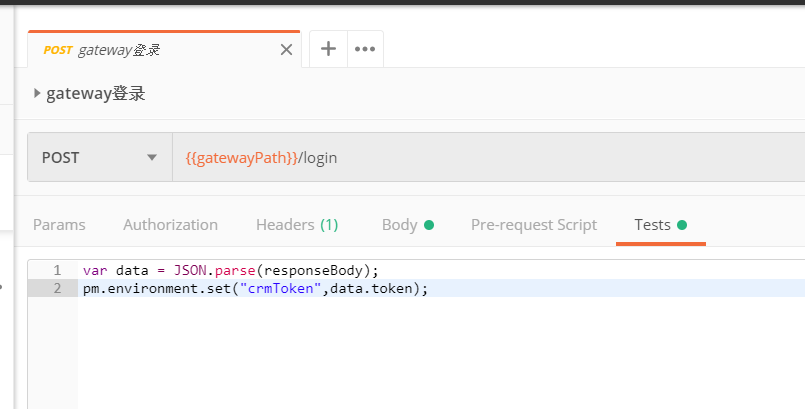

