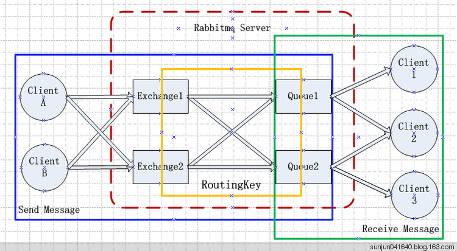
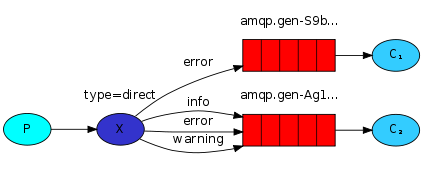
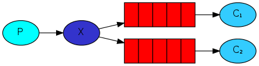
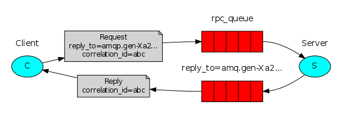
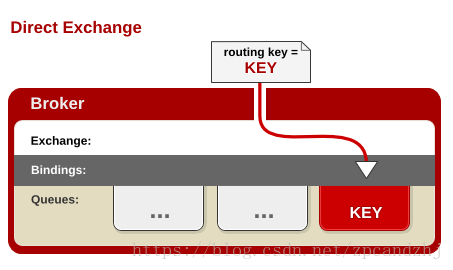
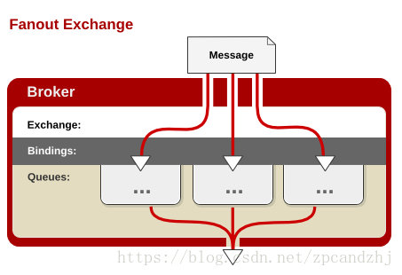
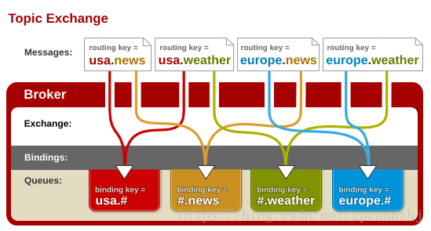

# █ RabbitMQ

# 一. 基本概念

## 1. AMQP



生产者先将消息发送到交换机, 然后交换机根据事先设置好的分发策略, 将消息分发到不同的队列中. 消费者从队列中获取消息.

生产者需要关注交换机名称, 路由键

消费者只需要关注队列

问题: 

- 简单模式/工作模式
  - 如何使用 amqpTemplate 直接发送消息到队列?
  - 不论该队列是否绑定交换机, 都能直接通过队列名发送消息
- 直连模式
  - 路由冲突? 能不能将多个不同的队列, 以相同的路由键绑定到同一个交换机?
  - 多重绑定? 能不能将同一个队列, 以不同的key绑定到同一个/不同的交换机上?
- 订阅模式
  - 不需要
- 主题模式


事务?

发送方确认? 

### 

# 二. RabbitMQ 安装与配置

## 1. 安装

### 1. 安装 erlang

rabbitmq 依赖于 erlang, 需要先安装 erlang 环境, 可以选择以下四个不同版本的 erlang 

- RabbitMQ-erlang: rabbitMQ 团队发布的最小 erlang 环境, 仅提供 rabbitMQ 必要的组件, 安装时不需要其他依赖, 更加易用
- [Erlang Solutions](https://www.erlang-solutions.com/resources/download.html) 提供的包, 通常是最新的, 可能会引入一些不必要的依赖
- [EPEL](http://fedoraproject.org/wiki/EPEL), 由 RHEL/Fedora 提供, 是最官方的包, 但可能过时. 被分割成许多个不同的小包.
- OpenSUSE 提供的包

#### 1.1. 最小 erlang 环境

可以添加 [Package Cloud](https://packagecloud.io/rabbitmq/erlang) 或 [Bintray](https://bintray.com/rabbitmq-erlang/rpm/erlang) 仓库, 使用 yum 安装

```bash
# 添加 packageCloud 仓库

# 添加 bintray 仓库

# 使用 yum 安装最小 erlang

```

直接下载 rpm 包进行安装 [下载地址 https://github.com/rabbitmq/erlang-rpm/releases ](https://github.com/rabbitmq/erlang-rpm/releases).

```shell
# 下载 erlang-rpm 包
wget --content-disposition https://packagecloud.io/rabbitmq/erlang/packages/el/7/erlang-22.2-1.el7.x86_64.rpm/download.rpm

rpm -ivh erlang-22.2-1.el7.x86_64.rpm 
```

安装 erlang 可能会出现 openssl 依赖错误, 需要先安装最新的 openssl

```shell
wget http://rpmfind.net/linux/centos/7.7.1908/os/x86_64/Packages/openssl-libs-1.0.2k-19.el7.x86_64.rpm

rpm -ivh openssl-libs-1.0.2k-19.el7.x86_64.rpm --force
```


### 2. 安装 socat

```sh
wget http://repo.iotti.biz/CentOS/7/x86_64/socat-1.7.3.2-5.el7.lux.x86_64.rpm

rpm -ivh socat-1.7.3.2-5.el7.lux.x86_64.rpm 
```


### 3. 安装 RabbitMQ

#### 3.1. yum 安装

需要手动添加仓库

```shell

```

#### 3.2. rpm 安装

需要手动安装需要的依赖

```shell
wget https://github.com/rabbitmq/rabbitmq-server/releases/download/v3.8.1/rabbitmq-server-3.8.1-1.el7.noarch.rpm

yum -y install ./rabbitmq-server-3.8.1-1.el7.noarch.rpm 
```


## 2. 配置

开启远程访问

用户管理插件

用户管理

### 2.2. 用户管理

RabbitMQ 的用户有5种类型

1. **超级管理员(administrator)**
   可登陆管理控制台，可查看所有的信息，并且可以对用户，策略(policy)进行操作。
2. **监控者(monitoring)**
   可登陆管理控制台，同时可以查看rabbitmq节点的相关信息(进程数，内存使用情况，磁盘使用情况等)
3. **策略制定者(policymaker)**
   可登陆管理控制台, 同时可以对policy进行管理。但无法查看节点的相关信息(上图红框标识的部分)。
4. **普通管理者(management)**
   仅可登陆管理控制台，无法看到节点信息，也无法对策略进行管理。
5. **其他**
   无法登陆管理控制台，通常就是普通的生产者和消费者。

端口配置


# 三. 应用开发

## 1. 原生 Client

### ConnectionFactory、Connection、Channel

ConnectionFactory、Connection、Channel都是RabbitMQ对外提供的API中最基本的对象。Connection是RabbitMQ的socket链接，它封装了socket协议相关部分逻辑。ConnectionFactory为Connection的制造工厂。
Channel是我们与RabbitMQ打交道的最重要的一个接口，我们大部分的业务操作是在Channel这个接口中完成的，包括定义Queue、定义Exchange、绑定Queue与Exchange、发布消息等。

## 2. 与 Spring 集成

引入依赖

xml 配置

java 配置

## 3. 与 SpringBoot 集成

引入依赖

常用属性配置

```properties
# 服务器配置
spring.rabbitmq.host
spring.rabbitmq.port
spring.rabbitmq.virtual-host
# 用户认证
spring.rabbitmq.username
spring.rabbitmq.password
# 默认目的地
spring.rabbitmq.template.exchange
spring.rabbitmq.template.routing-key
spring.rabbitmq.template.default-receive-queue
# 监听器
spring.rabbitmq.listener.simple.acknowledge-mode
spring.rabbitmq.listener.simple.concurrency
spring.rabbitmq.listener.simple.max-concurrency
```

具体配置内容见 [SpringBootp 配置项清单](https://docs.spring.io/spring-boot/docs/2.2.0.RELEASE/reference/html/appendix-application-properties.html#integration-properties)

## 4. AmqpTemplate RabbitMessagingTemplate

### 4.1. 区别

RabbitMessagingTemplate 是 AmqpTemplate 的代理人, 底层仍是通过调用 AmqpTemplate 的方法来实现消息的收发操作. 但 RabbitMessagingTemplate 是spring 对所有消息的服务的一个统一的抽象层, 提供一套跨消息服务实现的消息操作 API, 其消息返回的消息对象是对底层消息对象的进一步封装

AmqpTemplate 获取的消息对象是 `org.springframework.amqp.core.Message`

RabbitMessagingTemplate 获取的消息对象是 `org.springframework.messaging.Message`

### 4.2. 发送

AmqpTemplate 提供了五种消息发送方式, 且每种方式都有多个重载方法

#### 1) 基本的发送

先准备好 `Message` 对象, 将消息发送到指定的队列. 

如果事先定义好默认的交换机和路由键, 则可以省略相关参数

```java
void send(Message message);
void send(String routingKey, Message message);
void send(String exchange, String routingKey, Message message);
```

#### 2) 发送并接收回信

先准备好 `Message` 对象, 将消息发送到指定的队列, 并接收回复. 

如果事先定义好默认的交换机和路由键, 则可以省略相关参数

```java
Message sendAndReceive(Message message);
Message sendAndReceive(String routingKey, Message message);
Message sendAndReceive(String exchange, String routingKey, Message message);
```

#### 3) 转换并发送

前面的发送方法, 需要提前构造好 `Message` 对象,  `AmqpTemplate` 也允许直接发送具体的数据, 底层会以默认方式构造合适的 `Message` 对象

```java
void convertAndSend(Object message);
void convertAndSend(String routingKey, Object message);
void convertAndSend(String exchange, String routingKey, Object message);
```

如果需要为待发送消息添加一些消息属性, 比如为消息进行分组等, 需要在创建消息后, 发送消息前对消息进行操作, 可以采用以下方法, 在上述方法增加一个 `MessagePostProcessor` 后处理器

```java
void convertAndSend(Object message, MessagePostProcessor messagePostProcessor);
void convertAndSend(String routingKey, Object message, 
                    MessagePostProcessor messagePostProcessor);
void convertAndSend(String exchange, String routingKey, Object message, 
                    MessagePostProcessor messagePostProcessor);
```

#### 4) 转换发送并接收回信

```java
Object convertSendAndReceive(Object message);
Object convertSendAndReceive(String routingKey, Object message);
Object convertSendAndReceive(String exchange, String routingKey, Object message);
```

如果需要为待发送消息添加一些消息属性, 比如为消息进行分组等, 需要在创建消息后, 发送消息前对消息进行操作, 可以采用以下方法, 在上述方法增加一个 `MessagePostProcessor` 后处理器

```java
Object convertSendAndReceive(Object message, MessagePostProcessor messagePostProcessor);
Object convertSendAndReceive(String routingKey, Object message, 
                             MessagePostProcessor messagePostProcessor);
Object convertSendAndReceive(String exchange, String routingKey, Object message,
                             MessagePostProcessor messagePostProcessor) ;
```

#### 5) 转换发送并解析回信

`convertSendAndReceive()` 方法组能够获取回信, 但得到的回信是 `Object` 类型, 还需要额外的类型转换才能处理. `AmqpTemplate` 还提供了对应的泛型方法, 自动将回信解析为指定类型对象

```java
<T> T convertSendAndReceiveAsType(Object message, 
                                  ParameterizedTypeReference<T> responseType)
<T> T convertSendAndReceiveAsType(String routingKey, Object message,
                                  ParameterizedTypeReference<T> responseType);
<T> T convertSendAndReceiveAsType(String exchange, String routingKey, Object message,
                                  ParameterizedTypeReference<T> responseType);
```

如果需要为待发送消息添加一些消息属性, 比如为消息进行分组等, 需要在创建消息后, 发送消息前对消息进行操作, 可以采用以下方法, 在上述方法增加一个 `MessagePostProcessor` 后处理器

```java
<T> T convertSendAndReceiveAsType(Object message, 
                                  MessagePostProcessor messagePostProcessor,
                                  ParameterizedTypeReference<T> responseType);
<T> T convertSendAndReceiveAsType(String routingKey, Object message,
                                  MessagePostProcessor messagePostProcessor, 
                                  ParameterizedTypeReference<T> responseType);
<T> T convertSendAndReceiveAsType(String exchange, String routingKey, Object message,
                                  MessagePostProcessor messagePostProcessor,
                                  ParameterizedTypeReference<T> responseType);
```

### 4.3. 接收

#### 1) 接收消息

可以指定超时时间, 一定时间未获取到消息就结束

```java
Message receive();
Message receive(String queueName);
Message receive(long timeoutMillis);
Message receive(String queueName, long timeoutMillis);
```

#### 2) 接收并解析消息

可以将 Message 对象解析为 Object 对象, 都可以指定超时时间

```java
Object receiveAndConvert();
Object receiveAndConvert(String queueName);
Object receiveAndConvert(long timeoutMillis);
Object receiveAndConvert(String queueName, long timeoutMillis);
```

 `AmqpTemplate` 还提供了对应的泛型方法, 自动将回信解析为指定类型对象

```java
<T> T receiveAndConvert(ParameterizedTypeReference<T> type);
<T> T receiveAndConvert(String queueName, ParameterizedTypeReference<T> type);
<T> T receiveAndConvert(long timeoutMillis, ParameterizedTypeReference<T> type);
<T> T receiveAndConvert(String queueName, long timeoutMillis, 
                        ParameterizedTypeReference<T> type);
```

#### 3) 接收消息并回信

```java
// 默认回信目的地
<R, S> boolean receiveAndReply(ReceiveAndReplyCallback<R, S> callback);
<R, S> boolean receiveAndReply(String queueName, ReceiveAndReplyCallback<R, S> callback);

// 固定回信目的地
<R, S> boolean receiveAndReply(ReceiveAndReplyCallback<R, S> callback, 
                               String replyExchange, String replyRoutingKey);
<R, S> boolean receiveAndReply(String queueName, ReceiveAndReplyCallback<R, S> callback, 
                               String replyExchange,String replyRoutingKey);

// 动态回信目的地
<R, S> boolean receiveAndReply(ReceiveAndReplyCallback<R, S> callback,
                               ReplyToAddressCallback<S> replyToAddressCallback);
<R, S> boolean receiveAndReply(String queueName, ReceiveAndReplyCallback<R, S> callback,
                               ReplyToAddressCallback<S> replyToAddressCallback);
```

## 6. 消息监听器

两个关键注解

`@RabbitHandler`

`@RabbitListener(queues = 队列名)`

```java
@RabbitHandler
@RabbitListener(queues = queue)
public void queue(Message message, Channel channel) throws Exception {
    try {
        System.out.println(Thread.currentThread() + "queue 收到消息:" +message);
        channel.basicAck(message.getMessageProperties().getDeliveryTag(), true);
    } catch (IOException e) {
        channel.basicNack(message.getMessageProperties().getDeliveryTag(), false, true);
    }
}
```

# 四. 工作模式

## 1. 简单队列 Simple


一个生产者, 一个消费者

### 1.1. 原生方式

### 1.2. spring 方式

## 2. 工作队列 Work Queue


一个生产者, 多个消费者, 每个消费者取得的消息都是唯一的

### 2.1. 原生方式

### 2.2. spring 方式

## 3. 路由模式 Routing



### 3.1. 原生方式

### 3.2. spring 方式

声明交换机/队列/绑定路由

```java
@Bean
public DirectExchange directExchange(){
    return new DirectExchange(EXCHANGE_DIRECT);
}
@Bean(QUEUE_D1)
public Queue queueD1() {
    return new Queue(QUEUE_D1,true);
}
@Bean(QUEUE_D2)
public Queue queueD2() {
    return new Queue(QUEUE_D2,true);
}
@Bean
public Binding binding1(@Qualifier(QUEUE_D1) Queue queueD1, DirectExchange exchange){
    return BindingBuilder.bind(queueD1).to(exchange).with(KEY_D1);
}
@Bean
public Binding binding2(@Qualifier(QUEUE_D2) Queue queueD2, DirectExchange exchange){
    return BindingBuilder.bind(queueD2).to(exchange).with(KEY_D2);
}
}
```

消息生产者

```java
public String sendDx() {
    for (int i = 0; i < 10; i++) {
        amqpTemplate.convertAndSend(EXCHANGE_DIRECT, KEY_D1, "直连1 ");
        amqpTemplate.convertAndSend(EXCHANGE_DIRECT, KEY_D2, "直连2 ");
    }
    return "直连模式, 各发10条消息";
}
```

## 4. 发布/订阅 Pub/Sub



一个生产者, 多个消费者, 每个消息都会被所有消费者获取

### 4.1. 原生方式

### 4.2. spring 方式

声明

```java
@Bean
public FanoutExchange fanoutExchange(){
    return new FanoutExchange(EXCHANGE_FANOUT);
}
@Bean(QUEUE_F1)
public Queue queueF1() {
    return new Queue(QUEUE_F1,true);
}
@Bean(QUEUE_F2)
public Queue queueF2() {
    return new Queue(QUEUE_F2,true);
}
@Bean
public Binding binding1(@Qualifier(QUEUE_F1) Queue queueF1, FanoutExchange exchange){
    return BindingBuilder.bind(queueF1).to(exchange);
}
@Bean
public Binding binding2(@Qualifier(QUEUE_F2) Queue queueF2, FanoutExchange exchange){
    return BindingBuilder.bind(queueF2).to(exchange);
}
```

生产者

```java
public String sendFx() {
    for (int i = 0; i < 3; i++) {
        amqpTemplate.convertAndSend(EXCHANGE_FANOUT, null, "订阅1 ");
        amqpTemplate.convertAndSend(EXCHANGE_FANOUT, null, "订阅2 ");
        amqpTemplate.convertAndSend(EXCHANGE_FANOUT, null, "订阅3 ");
    }
    return "发送成功";
}
```


## 5. 主题模式 Topics


### 5.1. 原生方式

### 5.2. spring 方式

声明

```java
@Bean
public TopicExchange topicExchange(){
    return new TopicExchange(EXCHANGE_TOPIC);
}
@Bean(QUEUE_USA)
public Queue usaQueue() {
    return new Queue(QUEUE_USA,true);
}
@Bean(QUEUE_CHINA)
public Queue chinaQueue() {
    return new Queue(QUEUE_CHINA,true);
}
@Bean(QUEUE_NEWS)
public Queue newsQueue() {
    return new Queue(QUEUE_NEWS,true);
}
@Bean(QUEUE_WEATHER)
public Queue weatherQueue() {
    return new Queue(QUEUE_WEATHER,true);
}
@Bean
public Binding binding1(@Qualifier(QUEUE_USA) Queue queue, TopicExchange exchange){
    // usa.*: 仅匹配形如 usa.x 的key, 忽略 usa.x.y, usa.x.y.z 等key
    return BindingBuilder.bind(queue).to(exchange).with("usa.*");
}
@Bean
public Binding binding2(@Qualifier(QUEUE_CHINA) Queue queue, TopicExchange exchange){
    // china.#: 匹配形如 china.x, china.x.y, china.x.y.z 等key
    return BindingBuilder.bind(queue).to(exchange).with("china.#");
}
@Bean
public Binding binding3(@Qualifier(QUEUE_NEWS) Queue queue, TopicExchange exchange){
    // #.news: 仅匹配形如 x.news 的key, 忽略 x.y.news, x.y.z.news 等key
    return BindingBuilder.bind(queue).to(exchange).with("*.news");
}
@Bean
public Binding binding4(@Qualifier(QUEUE_WEATHER) Queue queue, TopicExchange exchange){
    // #.weather: 匹配形如 x.weather, x.y.weather, x.y.z.weather 等key
    return BindingBuilder.bind(queue).to(exchange).with("#.weather");
}
```

生产者

```java
public String sendTp() {
    // QUEUE_NEWS QUEUE_USA
    amqpTemplate.convertAndSend(EXCHANGE_TOPIC, "usa.news", "美国新闻联播");
    // QUEUE_NEWS QUEUE_CHINA
    amqpTemplate.convertAndSend(EXCHANGE_TOPIC, "china.news", "中国新闻联播");
    // 没有队列能收到
    amqpTemplate.convertAndSend(EXCHANGE_TOPIC, "usa.NewYork.news", "美国纽约新闻联播");
    // QUEUE_CHINA
    amqpTemplate.convertAndSend(EXCHANGE_TOPIC, "china.Shenzhen.news", "中国深圳新闻联播");

    // QUEUE_WEATHER QUEUE_USA
    amqpTemplate.convertAndSend(EXCHANGE_TOPIC, "usa.weather", "美国天气预报");
    // QUEUE_WEATHER QUEUE_CHINA
    amqpTemplate.convertAndSend(EXCHANGE_TOPIC, "china.weather", "中国天气预报");
    // QUEUE_WEATHER
    amqpTemplate.convertAndSend(EXCHANGE_TOPIC, "usa.NewYork.weather", "美国纽约天气预报");
    // QUEUE_WEATHER QUEUE_CHINA
    amqpTemplate.convertAndSend(EXCHANGE_TOPIC, "china.Shenzhen.weather", "中国深圳天气");
    return "发送成功";
}
```


## 6. 远程过程调用 RPC



### 6.1. 原生方式

### 6.2. spring 方式

## 7. 发布者确认 Publisher-Confirm

### 7.1. 原生方式

### 7.2. spring 方式

# 3. 交换机 Exchange

通过 channel 声明 exchange, 根据参数个数可以有以下四种方法, 且根据交换机类型的声明方式, 有枚举类和字符串的重载方法

```java
// 以枚举类指定交换机类型
exchangeDeclare(交换机名, 类型枚举);
exchangeDeclare(交换机名, 类型枚举, 是否持久化);
exchangeDeclare(交换机名, 类型枚举, 是否持久化, 自动删除, 其他参数);
exchangeDeclare(交换机名, 类型枚举, 是否持久化, 自动删除, 内部交换机,其他参数)
    
// 以字符串指定交换机类型
exchangeDeclare(交换机名, 类型字符串);
exchangeDeclare(交换机名, 类型字符串, 是否持久化);
exchangeDeclare(交换机名, 类型字符串, 是否持久化, 自动删除, 其他参数);
exchangeDeclare(交换机名, 类型字符串, 是否持久化, 自动删除, 内部交换机, 其他参数);
```


### 3.1. 直连交换机 Direct



直连型交换机，根据消息携带的路由键将消息投递给对应队列。

大致流程，有一个队列绑定到一个直连交换机上，同时赋予一个路由键 routing key 。
 然后当一个消息携带着路由值为X，这个消息通过生产者发送给交换机时，交换机就会根据这个路由值X去寻找绑定值也是X的队列。

### 3.2. 扇形交换机 Fanout



### 3.3. 主题交换机 Topic



### 3.4. 消息头交换机 Header

### 3.5. 自定义交换机

# 五. 高级特性

## 1. message

持久化

消息分组

优先级

延迟/定时投递


## 2. publisher

## 3. consumer

## 4. broker

发布者确认

优先级

持久化

分发策略

重发策略

死信

