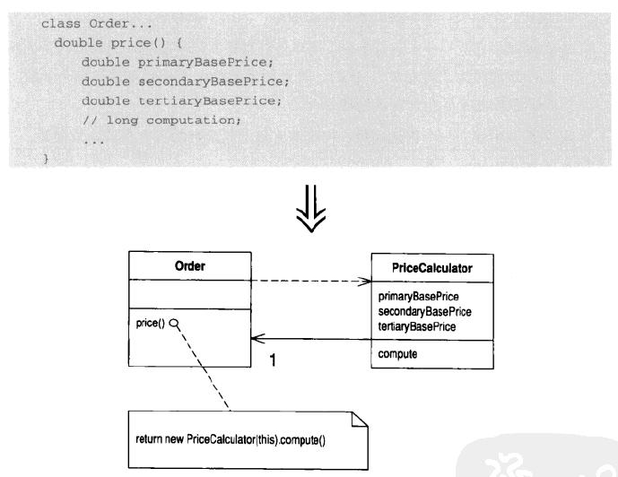
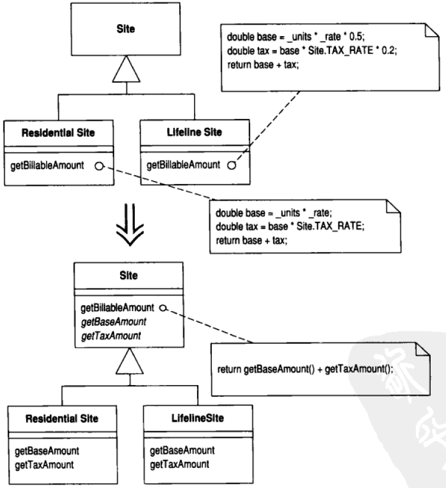

# █ 重构 -- 改善既有代码的设计

# 一. 重构原则

## 1. 什么是重构

重构最基本的定义: **在不改变软件可观察行为的前提下改善其内部结构.**

- 名词形式

  > 对软件内部结构的一种调整, 目的是在不改变软件可观察行为的前提下, 提高代码可读性, 降低维护成本

- 动词形式

  > 使用一系列的重构手法, 在不改变软件可观察行为的前提下, 调整其内部结构.

重构的主要目的是使软件更加容易被理解, 降低维护成本. 可能对软件内部做了很多修改, 但软件的可观察行为基本不变.

性能优化与之类似, 可能对代码大幅修改后, 外部行为依然保持不变. 但优化和重构的出发点不同, 优化可能会导致代码更难理解, 但为了更好的性能, 不得不牺牲一定的可读性.

## 2. 为何要重构

重构很有价值, 能帮助开发者始终良好地控制项目代码, 能实现以下几种目的

- **改进软件设计**

  如果没有重构, 程序的设计会逐渐腐败变质. 开发者可能会图方便, 为了更快地实现当前想要的小修改, 而在完全理解程序整体设计之前, 就贸然修改代码. 长期进行这种修改, 程序的代码结构可能会变形, 逐渐失去原有的设计结构, 程序员越来越难通过阅读源码而理解原来的设计.

  重构就像是整理代码, 你所做的事情就是让所有东西回到它应处的位置上, 代码结构的流失是累积性的, 经常重构则可以帮助代码维持自己该有的状态. 

  改进设计的一个重要方向就是消除重复代码. 消除重复代码不会使系统运行更快, 有助于未来的修改工作. 重复的代码越多, 就越难保证所有修改工作保持一致, 很可能会有遗漏的地方, 从而带来 bug. 

  如果消除重复代码, 你就可以确定所有事物和行为在代码中只表述一次, 这正是优秀设计的根本. 

- **使代码更容易理解**

  所谓程序设计, 就是编写代码告诉计算机它要做什么. 核心是"准确说出我想要的". 除了计算机, 代码还有另一个读者, 即日后需要修改代码的其他程序员. 而且这个程序员很可能就是我们自己. 

  我们很容易忽略这第二个读者, 但他才是最重要的. 我们不在乎计算机多花一些时间进行编译工作, 但是如果修改代码的程序员需要花费大量时间才能理解代码, 这会严重影响工作效率. 

  因此, 我们要对代码进行适当的修改, 让代码更容易理解, 而重构, 恰好有助于改善代码可读性. 

  重构提高代码可读性, 还有另一个表现. 我们可以利用重构来协助理解不熟悉的代码. 我们可以借助重构, 让代码更好地反映出我的理解, 然后重新执行看是否正常, 从而检验理解是否正确.

  随着重构的进行, 我们可以看到一些设计层面的东西, 如果不对代码进行修改, 可能永远也看不到. 重构把我们带到了更高的理解层次上. 

- **有助于找到 bug**

  对代码进行重构, 可以深入理解代码的行为, 并把 新的理解反馈回去. 在理清程序结构的同时, 也理清了自己的一些假设, 从而有助于找到程序中的 bug

- **提高编程速度**

  良好的设计是快速开发的根本. 事实上, 拥有良好设计才能做到快速开发.

  如果没有良好的设计, 或许某一段时间内的进度迅速, 但恶劣的设计很快就会让开发速度慢下来. 开发者需要花越来越多的时间去理解系统, 寻找重复代码; 需要花更多的时间在调试和测试上, 而不是专注于添加新功能.

  重构可以防止系统的腐败变质, 甚至可以提高设计质量, 因此从长期角度来说, 重构有助于提高编程速度.

## 3. 什么时候需要重构 

- 三次法则

  如果同样的代码重复了三次, 那就应该重构了

- 添加功能时

  此时重构的原因可能是为了帮助理解需要修改的代码, 

  另一个原因可能是程序现有结构不能很方便地添加新功能

- 修补错误时

  调试时重构, 多半是为了让代码更具可读性. 程序有bug, 往往意味着代码可读性不够好, 不足以在开发时就发现bug

- 复审代码时

  重构有助于复审别人的代码

  重构可以让复审工作得到更具体的结果

  

如果需要为程序添加一个新的功能/特性, 但现有的代码结构无法很方便的达成目的, 那就应该先重构程序, 改善其扩展性, 然后才是添加新的功能/特性

1. 可靠测试: 先构建一套可靠的测试机制, 这些测试必须有自我检验能力

   报告结果时, 要么显示ok, 要么给出具体的错误的内容

2. 小幅修改: 每次修改的幅度要小, 如果出现问题, 也很容易发现

3. 不提前优化: 很多时候重构会对性能造成影响, 但先不要担心性能问题, 待重构结束后, 再对性能问题进行针对性优化

   比如遍历集合时, 原来的代码可能在一个循环体内完成多件事情, 而重构将这其分成了多个循环, 循环次数多了可能会对性能造成负面影响.

4. 

## 4. 重构与性能

重构可能会导致某些操作被重复执行, 导致程序性能下降

但是实际上若不经过严格的测试, 并不清楚对性能会有多少影响

因此, 在重构时请先忽略性能问题, 先把重构工作做好, 之后再进行优化

# 二. 构建测试体系

想要进行重构, 首要前提是拥有一个可靠的测试体系, 保证原有功能不受影响, 避免重构的错误为系统引入不必要的bug. 

这里说的测试主要指的是单元测试, 检验程序内局部功能是否正常. 可以借助 Junit 来完成.  

## 1. 测试的自我验证

测试代码应该要能够自我验证, 自己找到测试结果不符合预期的地方. 如果测试不能自我验证, 就需要将测试数据输出到控制台, 再由开发者人眼比对, 这会严重影响测试效率.

大多数的测试都是两个值进行比较, 校验是否相等. 代码的自我验证, 可以通过引入断言来实现.

在编写测试代码时, 可以在校验上故意先设一个错误的期望值, 以校验测试方法是否真的有效.

## 2. 测试要经常运行

每次重构做了小幅修改后, 都应该运行测试. 保证2次测试之间做出的修改足够小, 那么一旦出现问题, 也能很快的定位到出错的地方. 

修改代码后不能只运行局部的几个测试, 应该定期运行全部测试, 确保系统整体功能正常

## 3. 让测试暴露bug

每当你收到 bug  报告, 请先写一个单元测试来暴露 bug, 确保将来不会出现相同的问题. 

一套良好的测试体系就是一个强大的 bug 侦测器, 能够大大缩减查找 bug 所需要的时间

## 4. 编写更好的测试

测试用例不是越多越好, 很多函数其实很简单, 不太容易出错, 这种测试用例没有什么价值, 反而会让开发者觉得编写测试代码得不偿失. 只要测试覆盖了最可能出错的部分, 就能从中获得最大利益.

编写测试用例时, 应该关注目标类该做的所有事情, 然后针对任何一项功能的任何一种可能失败的情况进行测试. 测试一个技巧是寻找边界条件, 要考虑到可能出错的边界条件, 把测试火力集中在那里.

## 5. 异常处理

别忘了检查程序出错时的反馈, 如果程序设置在某些情况下需要抛出异常, 那么需要编写相关测试用例, 检查是否抛出了预期的异常.

# 三. 代码的坏味道

## 1. 复杂冗长的代码

### 1) 重复代码

概述与缺点, 出现场景, 解决方案

这是最常见的代码缺陷, 想办法将它们合并, 代码就会有所改善. 

如果出现了重复代码, 那么修改时就需要修改多个地方, 增加工作量的同时还可能出现遗漏, 带来 bug

最常见的情况是, 多个地方含有完全相同的代码, 这时只要**提取函数**, 然后全部调用提取后的函数即可.

还有一种情况, 互为兄弟的子类含有相同的代码, 这时可以将 **函数上移** 至父类.

如果代码只是相似, 但有局部区别, 可以将相同和不同的部分分别 **提取函数**, 在分别调用.

还可能运用 **塑造模板函数** 的方式, 获取一个模板函数设计模式.

如果代码算法不同, 但目的一致, 那就可以通过 **替换算法** 的方式去掉不理想的函数.

- 提取函数
- 提取类
- 函数上移
- 塑造模板函数

### 2) 过长的函数

程序代码越长越难维护和理解, 可能需要借助大量的注释才能说明代码中某一部分具体都是实现什么目的.

函数越小, 功能越单一, 越容易理解和维护, 同时也更容易重用.

小函数也有缺点, 大量的小函数会带来过深的调用栈, 会让代码阅读者需要经常跳转查看上下文, 才能彻底搞懂各个小函数都在做什么.而让小函数更容易理解的关键在于函数要足够小, 并且有一个足够好的名字.小函数+好名字要优于长函数+多注释.

每当我们觉得需要添加注释才能说明代码的作用时, 我们就应该将这部分代码提取成独立的函数, 并将我们想要添加的注释作为方法名.

复杂的条件表达式以及循环, 都值得提取成独立函数.

- 提取函数
- 用查询取代临时变量
- 用函数对象取代函数
- 分解条件表达式

### 6) 过多的注释

注释本是好事, 但在大多数情况下，开发者只会为糟糕的(不易理解的)代码添加注释, 因此, 注释往往意味着此处应该重构。如上一节所说, 如果你需要注释才能解释一段代码, 那么就应该将注释的内容封装起来，通过函数名实现代码的自解释。

如果需要注释来说明 某些约束, 则应该引入断言

- 提取函数
- 引入断言

### 3) 过大的类

如果一个类负责的事情太多, 往往会出现太多的实例域, 一旦如此, 该类中可能会存在大量的重复代码.

这时我们应该将类进行拆分, 化整为零, 避免一个类过于复杂, 过于混乱

- 提取类
- 提取子类
- 提取接口
- 用对象取代数据值

### 4) 过长的参数列

我们知道, 函数需要的东西可以通过参数传递进去, 但如果函数的参数列太长, 这个函数就会变得很难理解.并且若需要增删参数, 则每次修改都必定需要修改函数的所有调用方.

在面向对象程序中, 我们总可以通过另一个对象获取数据. 因此, 我们不需要将函数需要的数据都以一个个独立的参数传递给它, 只需要传给函数一些包含所有需要数据的参数对象, 函数就通过参数对象获取它需要的那部分数据. 

当我们引入了参数对象后, 如果函数内需要获取更多或更少的数据, 很可能不需要函数签名, 只需要在函数体内增删几行从参数对象获取数据的代码就可以了. 

另外, 如果函数可以通过其他途径获取参数值, 那么它就不应该通过参数获取. 比如参数的接受端可以通过与调用端相同的计算来获取参数值, 就可以在函数内调用这个计算, 而不需要在调用方将参数传入.

- 以函数取代参数
- 引入参数对象
- 保持对象完整

### 5) √ switch结构

从本质上说, switch 结构的问题在于重复, 类似的 switch 结构, 可能会分布在不同地方, 如果需要增加一个 case 子句, 就必须找到所有的 switch 语句并修改它们. 而面向对象的多态可以优雅地解决这个问题. 

switch 语句通常会根据类型码进行选择, 我们需要找到与类型码相关的函数和类, 将switch 语句提炼到一个独立函数, 移动到需要多态性的那个类里. 通过子类或状态/策略模式来取消类型码, 然后就可以用多态来取代条件表达式了.

如果只是在单一的某个函数里, 根据条件选择需要执行的代码, 那多态确实不太合适. 这种情况下, 你可以在不同的调用方, 调用明确的不同函数, 从而消除 switch 结构. 

- 用多态取代条件表达式
- 用子类取代类型码
- 用状态/策略模式取代类型码
- 用明确函数取代参数
- 引入 null 对象

## 2. 修改分散

### 1) 发散式修改

一个类, 应该专注于一个方面, 只因这一个方面的原因而变化. 如果某个类, 经常因为不同的原因, 在不同的方向上发生变化, 就是发散式变化的问题. 如果出现了这种情况, 可能是因为这个类违反了单一职责原则, 就应该考虑将其重构, 拆分成针对不同问题的多个类.

- 提取类

### 2) 霰弹式修改

与上一节发散式修改正好相反, 这种坏味道指的是每当遇到一种变化, 都要同步修改多个不同的类. 需要修改的代码分散在多个类里, 不但很难找到它们, 还很可能会遗漏某些修改.这时应该将需要修改的部分收集起来放到同一个类中，使得一种变化只修改一个类

- 移动函数
- 移动字段
- 内联类

## 3. 数据组织不合理

### 1) 依恋情结（过分依赖其他类）

如果一个函数，大量依赖另外一个类对象的数据，而不是函数所在类，那么，就应该考虑将函数移到依赖的类中

- 移动函数
- 移动字段
- 提取函数

### 2) 数据泥团

可能会有多个字段总是聚集在一起，丢弃任意一个都会导致其他数据失去意义，那么就应该将这几个字段整合起来，封装成一个对象。

当提取出这样的对象后，相关函数可能会存在参数列过长, 或依恋情结的坏味道, 可以进一步重构.

- 提取类
- 引入参数对象
- 保持对象完整

### 3) 基本类型偏执

新手程序员往往更喜欢用基本类型而不是封装相应的小型对象，但实际世界中, 基本类型的数据往往相互关联, 组成上一节所说的数据泥团. 这种情况下, 小对象在语义表达和可维护性上效果更好。因此可以将一些基本类型数据封装成相应的小型对象.

还有一种情况, 程序中利用基本类型数据来标识类型或状态, 这种情况可能通过多态或策略模式来进行重构.

- 用对象取代数据值
- 提取类
- 引入参数对象
- 用对象取代数组
- 用类取代类型码
- 用子类取代类型码
- 用状态/策略模式取代类型码

### 4) 纯粹的数据类

只有数据字段和相应的get set 函数，要保证字段的封装性

- 移动函数
- 封装字段
- 封装集合

### 5) 暂时字段

通常一个对象，应该在任何时候都需要所有字段，保证所有字段有意义，但项目中可能会有某些函数需要额外的字段，这些暂时字段只在某些特定函数内有意义。这种字段会让人迷惑，应该将其放置到其他对象中去

- 提取类
- 引入 null 对象

### 6) 狎昵关系

如果两个类过分关联，过多关注对方的私有域，就表示两者过度耦合，应该尽量拆开

- 移动函数
- 移动字段
- 双向关联改成单向关联
- 用委托取代继承
- 隐藏委托关系

## 4. 类间关系不合理

### 1) 平行继承体系

这是霰弹式修改的一种特殊情况.

即有多个继承体系A B，在 A 添加一个子类时，就需要在 B 中添加相应的子类，这种情况可以让A引用B，并取消B继承树

- 移动函数
- 移动字段

### 2) √ 拒绝的遗赠

子类可能会不想继承父类的某些函数，如果有这种情况，往往意味着需要修改继承体系，将不需要的函数下放到别的兄弟类中。

还有一种做法是用委托替代继承，在原有子类中添加一个字段引用父类，需要使用的父类函数通过委托来实现，然后取消继承关系。

- 用委托取代继承

### 3) 冗余类

可能曾经有用，经过重构后价值不高，这时可以考虑将其取消, 将其中的函数融入到另一个类里去.

- 内联类
- 折叠继承层次

### 4) 夸夸其谈的未来性

为了可能不会存在扩展需求，设置过多的抽象层或设计模式，就带来了不必要的复杂度，应将其简化

- 折叠继承体系
- 内联类
- 移除参数
- 函数改名

### 5) √ 过长的消息链

客户端通过一系列的get函数连缀调用获取到最终的对象，即客户端需要了解这一过程中的所有对象关系. 一旦中间任意一段对象关系有变化，客户端都需要做出相应的修改。

应该封装中间的调用链，避免对客户端暴露过多细节, 从而避免过多地对客户端进行修改

- 隐藏委托关系

### 6) 中间人

对象封装会向外隐藏具体实现细节，封装往往伴随着委托。如果过度委托，我们应去掉中间人，直接跟最终干实事的对象打交道。或者可以将中间人变成最终对象的子类，消除委托的同时还能进行扩展

- 移除中间人
- 内联函数
- 用继承取代委托

### 7) 异曲同工的类/函数

可能会有一些函数干着相同的活，但函数签名不同，此时可以将其整合重组

- 重命名函数
- 移动函数

## 5. 扩展性

### 1) √ 不完美的库类

我们引入的第三方类库可能不够完美，但我们无法运用重构技术修改其中的类，这时我们可以引入本地扩展，新建一个继承类库的本地类, 或者只是简单的在本地的类中添加一两个外加函数

- 引入外加函数
- 引入本地扩展类

# 四. 重构技术

以下是常用的重构技术, 但是每个技术都不是孤立的, 而是相互关联, 相辅相成. 许多重构技术的应用时都需要结合其他的一个或多个技术共同作用. 

## 1. 重新组织函数

1. 提炼函数

   封装解决某一具体问题的代码, 并让函数名解释函数用途.

   通常用来消除重复代码, 更方便地实现重用, 或是将长函数拆分成更容易理解的小函数.

2. 内联不需要的函数（删除函数）

   如果一个函数的本体, 和它的函数名一样的清楚易懂, 那么就不需要专门进行封装, 应该取消这个函数, 直接在函数调用点执行函数本体.

   通常用来消除无用的间接层, 如不必要的委托和中间人等.

3. 内联临时变量

   如果一个变量, 只被一个简单表达式赋值一次, 并只被引用一次, 那么这个变量的存在价值不大, 应将其取消, 直接使用为它赋值的那个表达式本身.

   通常作为"用查询(函数调用)取代临时变量"或"提炼函数"技巧中的一部分.

4. 用查询(函数调用)取代临时变量

   如果程序中使用一个临时变量来保存某一个表达式的运算结果, 那么可以将这个表达式单独提取成一个函数, 然后将这个临时变量的引用点都替换成对新函数的调用

   通常用在临时变量保存了一个较复杂的表达式运算结果, 而这个运算结果可能会在多处用到的情况, 封装新函数有利于代码重用, 也提高了代码的可读性.

5. **√ 引入解释性变量**

   如果代码中直接用到一个复杂的表达式, 可以将该表达式的结果放入一个临时变量, 用这个临时变量的名称来解释表达式.

   通常用来替换较复杂的表达式(尤其是复杂的条件表达式), 而这个表达式并不需要多处重用的情况

6. **√ 分解临时变量，避免多次赋值**

   应尽量避免对同一个变量的重复赋值(除了循环相关变量), 如果有, 请将其拆成多个不同的变量.  对变量的重复赋值, 会导致变量在整个生命周期内的含义发生变化, 这会给代码阅读者造成困扰. 

   重复赋值通常出现在保存一段冗长代码的中间运算结果, 这时在分解临时变量后, 往往还需要进一步的拆分函数

7. 移除对参数的赋值，用临时变量取代

   java 是按值传递的语言, 在函数内对参数的赋值操作不能反映到函数外部. 这种情况下对传入参数重新赋值, 容易让代码阅读者困扰. 并且在函数内部, 对参数重新赋值意味着变量含义的改变, 这与上一条存在同样的问题. 因此, 应该用临时变量来存放想要赋给参数的值.

    这一条应该在最初编写代码时就避免, 但如果已经存在了, 请将其重构.

8. **√ 用函数对象取代函数**

   如果你有一个复杂的函数, 函数内各种局部变量相互纠缠, 导致你不能简单地通过提取函数或优化临时变量的方式将其简化, 那么可以考虑引入函数对象.

   函数对象是一种特殊的对象, 它的类中定义了原函数中用到的所有参数和局部变量作为实例域(包括原函数所在的对象). 然后定义一个构造函数, 接受源对象以及原函数所有参数作为构造参数. 再定义一个计算方法, 方法体与源函数完全相同. 

   构造出这样一个函数对象类后, 可以发现原来相互纠缠的参数, 都变成了对象的实例域, 所以现在可以任意拆分原函数, 而不需传递任何参数.

   定义好函数对象后, 原函数的本体就可以替换成这样的一行代码: 构造一个函数对象, 并调用其计算方法.

   

9. 替代算法

   如果代码中有多个函数完成同样的目的, 但具体实现不同, 应替换成最清晰最优雅地算法

## 2. 在对象(类)之间搬移特性

1. 移动函数

   某函数与其他类的关联要多于所在类, 应该将函数移动到其他类, 然后更新所有引用点

   如果有需要, 可以在原来的类中保留一个委托函数, 调用移动后的函数, 并加上过期注解

2. 移动字段

   某字段与其他类的关联要多于所在类, 应该将字段移动到其他类, 然后更新所有引用点

3. 提炼新类

   如果某个类过于复杂, 做了应该由多个类来完成的事情, 这时应该将类拆分, 提取一个新类, 并将相关的字段和函数移动到新类. 

   还有一种情况是因为类型分化, 该类应该分化出不同子类.

4. 内联不需要的类

   一个类没有做太多的事情, 可以合并到另一个类中去, 然后删除原来的类.

5. 隐藏委托关系

   原本客户端需要通过一系列的调用链, 才能调用最终的服务类. 这时可以在顶层服务类建立客户所需的所有函数, 用以隐藏委托关系.

6. 移除中间人

   隐藏委托关系可以方便客户端的调用, 但这层封装也是需要代价的, 当客户需要最终服务类的新特性时, 顶层服务类就需要添加相应的委托函数, 随着委托函数越来越多, 顶层服务类就成了一个中间人, 并且会带来霰弹式修改的坏味道(增加特性时需要同时修改最终服务类和顶层服务类). 这时我们可以让客户直接与最终服务类打交道, 省去顶层服务类的委托.

7. 引入外加函数

   需要扩展库类中的一两个方法, 可以在需要的类里添加一个扩展后的库类方法

8. **√ 引入扩展类**

   需要扩展库类中的多个方法, 可以对库类进行扩展

   扩展类有两种形式, 子类或者包装类

   子类的工作量少, 但如果涉及到对象, 子类和原库类可能会是两个不同的对象, 那么就需要维护两份数据

   包装类只维护一份数据, 但是进行需要添加大量的委托函数, 并且包装类与原库类没有继承关系, 需要添加相应的装包拆包函数

## 3. 重新组织数据

1. **√ 自封装字段**

   通常情况下, 我们将类的字段设为 private 并提供相应的访问函数, 在字段所在类内, 我们直接操作字段, 而在其他类, 则要通过访问函数来操作字段.

   而所谓的自封装字段, 则是要求在字段所在类也通过访问函数来操作字段. 大多数情况下, 这是不必要的, 但如果需要对字段有更灵活的管理方式, 如延迟初始化, 需要对字段进行处理, 又或者子类需要特殊的访问函数时, 自封装字段的访问方式就体现了它的价值.

2. 用对象取代数据值

   开发初期可能会有简单的数据项纪录某些值, 但随着程序发展, 可能需要对这些数据项进行一系列的操作, 这时我们可以将数据值改成对象, 并封装相关的行为. 

3. 将值对象改为引用对象

   当存在多个相等的对象时, 如果在修改时希望影响到所有对象, 这就需要将多个相等的值对象替换成同一个引用对象, 以实现同步修改.

   为了让不同客户获取到同一个引用对象, 可能需要一个字典或注册表来管理所有可选对象, 然后不同的客户通过工厂方法从注册表中获取对象的引用.

4. 将引用对象改为值对象

   如果没有同步修改的要求, 比如持有的对象的不可变的, 那么也可以将公共的引用对象改成值对象. 要注意这项重构应该只针对不可变的对象, 没有同步修改的需求, 否则同步多个不同的值对象还不如共享一个引用对象.

   这里说的不可变指的是不能修改对象本身, 但客户可以选择更换不同的值对象(为变量重新赋值).

5. 以对象取代数组

   数组应该用来存放同类数据, 如果一个数组, 各个元素代表不同的东西, 比如第一个元素表示姓名, 第二个元素表示年龄等等, 这种将元素含义与数组下标绑定的结构, 客户很难记清不同下标表示什么. 这种情况下应该改成对象, 通过对象的不同字段来管理不同含义的数据, 并且可以添加相关的操作函数, 更加灵活. 

6. 复制被监视数据

   观察者模式

7. 单向关联改成双向关联

   

8. 双向关联改成单向关联

   

9. 字面常量取代魔法值

   魔法值的问题显而易见, 意义不明, 且不便修改. 通过常量进行替换, 对程序性能没有任何影响, 而可读性大大增强. 

   但字面常量也有一个缺陷, 编译器是将常量值硬编码到 class 文件中, 如果编译后修改了字面常量, 则需要重新编译所有引用该常量的 class 文件. 如果使用枚举类型, 则没有这个问题, 无论何时修改枚举对象的值, 都不需要重新编译引用枚举对象的地方. 

10. 封装字段

    面向对象的基本要求, 所有字段都应该设为 private, 并提供相关的访问函数

11. **√ 封装集合**

    如果一个对象持有一个集合, 那么我们应该对这个集合的访问函数进行封装, 不能直接将集合返回给客户, 容易破坏封装性.

    对于集合的取值函数, 要返回该集合的一个只读副本而不是集合本身, 以免客户在集合所有者不知情的情况下修改了集合的内容.

    对于集合的设值函数, 不能直接将外部传入的集合赋值给集合字段, 而应该新建一个集合, 将传入集合的元素全部添加到新集合中. 否则客户端有可能在传入集合后, 再对集合进行修改, 破坏了封装, 在集合所有者不知情的情况下修改了集合的内容.

    对于集合的增删元素, 集合所有者应该提供相应的函数. 

12. 数据类取代记录

    即实体类, 通过实体类对象去对应数据库中的记录.

13. 用类取代类型码

    即枚举类, 用枚举对象替代基本类型的类型码.

    当类型码只作为标记, 但不影响行为的时候才用此项重构. 如果类型码影响对象的行为, 使用多态或状态/策略模式进行重构更为合适.

14. 子类取代类型码

    如果类型码会影响对象的行为, 且类型码在这个对象的整个生命周期内不会发生变化, 就可以使用这项重构.

    重构时, 为每个类型码创建一个原类的子类, 并覆盖会因类型码变化而变化的函数. 使用时, 通过工厂方法, 根据不同的类型码返回不同的子类对象.

15. 状态/策略模式取代类型码

    如果类型码会影响对象的行为, 且类型码在对象的生命周期内会发生变化; 或原类已有子类, 不方便通过子类取代状态码时, 可以使用这项重构技术.

    根据状态模式/策略模式进行重构.

16. 字段取代子类

    如果多个子类, 区别只是某些返回常量数据的函数不同, 就可以将返回的常量数据视为类型码, 在父类中添加一个类型码字段, 然后将所有子类取消. 

## 4. 简化条件表达式

1. 分解条件表达式

   对于复杂的条件分支结构, 可以将不同的分支单独提取出来封装成独立函数, 不同的分支就调用不同的函数.

   既可以封装条件, 也可以封装条件之下的分支代码块

2. 合并条件表达式

   可能会有一串的检查, 条件各不相同, 但最终的行为却是一致的. 这时可以用逻辑运算将它们合并成一个条件表达式, 并提取成独立函数或引入解释变量对合并后的表达式进行说明.

3. 合并重复的条件片段

   如果条件结构的每个分支上, 都有这相同的一段代码, 则将这段重复的代码提取到条件结构之外. 这样可以更清楚地表明哪些东西随条件的变化而变化, 又有哪些东西是不变的.

   我们也可以用同样的手法来处理异常, 如果不同的异常分支都执行相同的操作, 就可以将这段代码移到 final 块中. 

4. 移除控制标记

   对于复杂的选择/循环结构中, 我们可能会利用一些控制标记来控制流程, 但这种做法需要加入大量的标记检查语句, 增加了代码的复杂度. 

   可以使用break 和 continue 语句控制流程, 必要时使用带标记的 break 语句.

   也可以将复杂结构封装成独立函数, 通过 return 语句结束流程. 

5. **√ 以卫语句取代嵌套条件表达式**

   复杂嵌套的条件语句, 让人难以看清正常的执行路径. 

   如果所有分支中, 只有少数是正常行为, 其他都是特殊情况, 则应该先将特殊情况单独检查, 出现特殊情况的时候立即中断流程, 从函数中返回, 检查完特殊情况确认没有问题了, 再去执行正常的流程. 这种前置独立检查通常被称为"卫语句".卫语句要么直接返回, 要么抛出一个异常.

   使用卫语句取代嵌套的条件结构时, 常常需要将条件反转

6. 以多态取代条件表达式

   与用子类取代类型码一样.

7. **√ 引入 null 对象**

   程序中经常需要判断对象是否为null，判空操作分布在程序的各个角落。引入空对象可以优雅地消除绝大部分的null检查。

   空对象是多态的一种应用，创建一个原类的子类，覆盖原类的各种方法，方法体改成对象为null时的操作即可。

   在所有返回null的地方，返回这个空对象，后续的客户端代码都可以将其视为正常对象，可以直接调用相关方法而不需事先进行检查。

   有时候可能需要根据对象是否为空来选择不同操作，但并不是调用对象自己的方法。这时可以在原类中添加一个isNull()方法，正常对象返回false，空对象返回true。

   如果不能修改原来的类，无法添加isnull()方法，那么可以让空对象类实现一个自定义的NullObject接口，然后就可以在客户端代码中用instanceof检查是否为空对象。

8. 引入断言

   如果对某个条件有约束限制, 可以通过断言明确表现这种约束. 满足断言条件时, 程序正常执行, 不满足条件时, 程序抛出一个未检查异常. 

   断言与一般的条件表达式不同, 断言应该总是成立, 如果断言不成立, 说明程序员犯了错误, 提供了错误的参数. 实际上, 生产环境中的断言应该是不被执行的. 可以通过对 jvm 配置决定是否执行断言检查.

## 5. 简化函数调用

1. 函数改名

   基本操作, 如果函数名称不能很好的解释函数的作用, 就应该改一个更好的名字

2. 添加参数

   如果函数需要更多的信息, 可以添加参数. 但过多的参数会带来数据泥团, 应考虑是否用参数对象代替

3. 移除参数

   如果函数不需要某个参数, 就应该将其从参数列表中去掉

4. 将查询函数和修改函数分离

   某个函数既要返回对象状态, 又要对对象进行修改, 就应该将其拆分成两个不同的函数, 分离查询与修改操作.

5. 令函数携带参数

   若干的函数做了类似的工作, 但是函数本体中却包含不同的常量.

   这时可以将函数合并, 通过参数来表达不同的值.

6. 以明确函数取代参数

   如果有一个函数, 根据不同的参数, 选择完全不同的行为, 则应该针对该参数的每一个可能值, 建立不同的独立函数, 然后在函数调用方, 直接调用新的明确的函数.

7. 保持对象完整

   如果客户从某个对象中取出若干值, 作为多个参数传递给某个函数. 这时应改成直接传递整个对象, 让函数自己从对象中获取所需的数据.

8. 以函数取代参数

   如果客户先访问了某个查询函数, 将结果作为参数传递给目标函数, 且目标函数自己也能调用之前的查询函数, 这种情况下, 客户不需事先调用查询函数, 改成让目标函数在自己函数体内调用查询函数.

9. 引入参数对象

   如果多项参数总是一起传递, 组成了数据泥团, 就应该考虑用一个参数对象将这些参数封装成一个对象. 通常在引入参数对象后, 会发现有很多函数可以需要被移动

10. 移除设值函数

    如果某个字段只在初始化的时候设值, 之后不再允许外部修改它的值, 那么就将它的设值函数去掉.

11. 隐藏函数

    如果一个函数只供内部使用, 不被其他任何类使用, 请将这个函数设为 private

12. 以工厂函数取代构造函数

    如果希望创建对象时不仅做简单的初始化工作, 如需要选择不同的子类, 或是需要通知其他对象等, 可以创建一个工厂函数, 客户通过工厂函数去获取需要的对象.

13. 封装向下转型

    某个函数返回对象后, 需要客户进行向下转型. 如果可以, 请将向下转型的操作方在函数返回对象之前.

    比如使用泛型时指定类型参数, 相当于是在函数内添加了向下转型.

14. 以异常取代错误码

    某个函数返回一个特定的代码, 用以表示某种错误情况, 这种情况应该直接抛出异常

15. 以测试取代异常

    如果需要不满足某个条件调用函数时, 会抛出异常, 就应该在调用函数之前先进行检查. 

## 6. 处理概括关系

1. 字段上移

   两个子类拥有相同字段, 上移至超类

2. 函数上移

   有些函数, 在各个子类中结果完全相同, 函数上移至超类

3. 构造函数本体上移

   在各个子类的构造函数中, 有一部分内容是完全一样的, 将这部分代码上移到超类的构造函数中, 然后在子类的构造函数里调用超类构造函数

4. 字段下移

   超类中某些字段, 只跟某些子类有关, 而跟另外一些子类无关, 则这些字段不应放在超类, 应该下移到子类中

5. 函数下移

   超类中某个函数, 只跟某些子类有关, 而跟另外一些子类无关, 则这些函数不应放在超类, 应该下移到子类中

6. 提炼子类

   超类中的某些特性, 只被某些实例用到, 而跟另外一些实例无关, 则应该新建一个子类, 将这部分非公共的特性移到子类中去.

7. 提炼超类

   两个类具有相似的特性, 可以将其公共部分提取出来, 建立一个超类. 两个类作为子类, 只提供各自特殊的部分.

8. 提炼接口

   多个类, 有一些类似的职责和相应的一些函数, 但是彼此之间没有继承关系, 这个时候, 可以将公共的职责提取出来, 放在接口里. 有了这样的接口, 今后如果需要新建类, 要求与之前的类拥有相同职责, 可以让新类实现接口. 通过接口, 可以让类的职责更加明确. 

9. 折叠继承体系

   如果子类不够特殊, 与超类之间没有太大区别, 应该将它们合并, 避免过多的复杂度.

10. 塑造模板函数

    有一系列的子类, 其中某些函数, 以相同的顺序执行类似的操作, 但各个操作的细节有所不同. 

    这时可以将不同的细节操作提取成单独的小函数, 不同子类中对应小函数签名要相同. 然后将原函数本体改成按顺序调用小函数. 这时不同子类的原函数都变成完全一样了, 将其上移至超类中. 

    

11. 以委托取代继承

    某个子类只用到了超类中的一部分, 或者根本不需要继承而来的数据, 这时应该取消继承关系, 改用委托.

    具体做法是在子类中添加一个字段, 引用超类的某个对象. 然后在子类中添加需要的方法, 委托给超类对象, 然后取消继承关系. 

12. 以继承取代委托

    如果两个类之间存在大量的委托关系, 在类中添加了大量的简单委托函数, 这时就可以考虑时候应该取消委托, 让委托类继承受托类

## 7. 大型重构

1. 梳理并分解继承体系

   某个继承体系同事承担了两项责任, 可以将其拆开成两个继承体系, 并通过委托关系, 让其中一个调用另外一个.

2. 将过程化设计转换为对象设计

   

3. 将领域与显示/表述分离

4. 提炼继承体系吗
