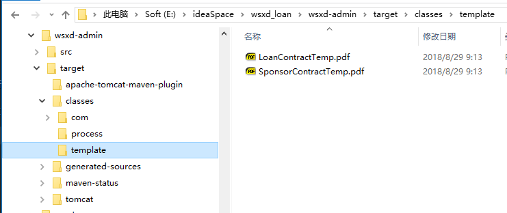

今天在项目中碰到一个奇怪的问题

项目中需要读取 pdf 文件作为模板, 进而进行填空盖章等操作, 但是在单独 demo 中能够正常运行的代码, 到了项目中间却总是报错. 

在 debug 过程中, 我尝试更换模板文件, 或是检查代码, 均没有发现不妥之处, 

输出文件大小后终于发现了端倪, 项目中取得的文件大小与独立 demo 中取得的文件大小不一致, 难道是模板文件给错了? 重新复制一份正确的模板, 运行, 却还是错误

最后才发现, 是 target 路径下的文件不对, 虽然 src 路径下的模板文件是正确的, 但是复制到 target 路径却变了, 这是为什么呢?

是什么原因导致复制文件时发生了改变? 最后想到了 maven 的资源过滤功能, maven 的 filter 可以替换文件中特定的字符串, 可能是这个替换工作对 pdf 模板文件产生了效果. 为此, 尝试将模板文件排除在资源过滤的路径之下, 单独再添加不经过滤的资源路径

编译运行, 程序终于正常了


还是有点问题

通过 maven tomcat plugin 启动项目是没问题了, 不管是在 eclipse 里启动, 还是在 idea 里, 都可以用 maven tomcat plugin 正常启动, 但是如果用 idea 的debug 启动, 却会有不同的包结构, 不同的包结构也导致不同的结果

因此, 需要考虑的是, idea 应该如何配置才能正常运行项目


- idea 中通过 maven tomcat plugin 启动时的项目结构

  

- idea 中通过配置tomcat 启动时的项目结构

  

解决方法: 

后来才发现, 该项目的pom 文件在两个不同的地方配置了 resource, 其中 一处没有正确排除 pdf 文件.

使用 idea 编译时, idea 根据没有排除 pdf 的 resource 配置进行编译

```xml
<plugin>
    <groupId>org.apache.maven.plugins</groupId>
    <artifactId>maven-war-plugin</artifactId>
    <version>2.6</version>
    <configuration>
        <archive>
            <addMavenDescriptor>true</addMavenDescriptor>
        </archive>
        <warName>wsxd-admin</warName>
        <!-- 未排除 pdf 文件 -->
        <webResources>
            <resource>
                <directory>src/main/resources</directory>
                <targetPath>WEB-INF/classes</targetPath>
                <filtering>true</filtering>
                <includes>
                    <exclude>src/main/resources/*</exclude>
                </includes>
            </resource>
        </webResources>
        <nonFilteredFileExtensions>
            <nonFilteredFileExtension>pfx</nonFilteredFileExtension>
        </nonFilteredFileExtensions>
    </configuration>
</plugin>
```

而使用 maven 编译时, maven 根据正常排除的 resource 配置进行编译

```xml
<filters>
    <filter>../conf/conf-${deploy.env}.properties</filter>
</filters>

<resources>
    <resource>
        <directory>src/main/resources</directory>
        <includes>
            <include>**/*</include>
        </includes>
        <!-- 排除 pdf 文件 -->
        <excludes>
            <exclude>template/*</exclude>
            <exclude>etc/*</exclude>
        </excludes>
        <filtering>true</filtering>
    </resource>

    <resource>
        <directory>src/main/resources</directory>
        <includes>
            <include>template/*</include>
        </includes>
    </resource>
    <resource>
        <directory>src/main/resources</directory>
        <includes>
            <include>etc/*</include>
        </includes>
    </resource>
</resources>
```


# █ idea 踩坑记录

项目启动, 使用 maven 启动, 和使用 本地tomcat 启动时的区别

项目启动方式, 可以通过本地tomcat 启动, 也可以通过 maven tomcat 插件启动,

使用 maven tomcat 的时候, 需要先将依赖 install 到本地仓库, 才能正常使用

使用本地 tomcat 的时候, 会自动编译整个项目, 不需要将项目依赖  install


打包的时候, 也可以通过maven package 和 idea 编译两种方式 

使用 maven package, 则需要先将依赖 install 到本地仓库, 如同 maven tomcat 一样

使用 idea 编译, 则要在项目 structure 中, 将 war 包添加到 deployment 队列中

