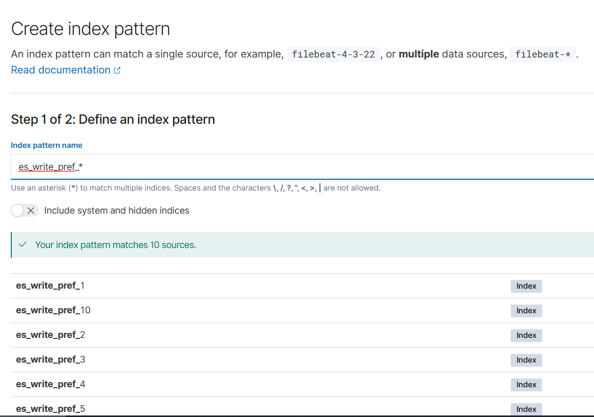
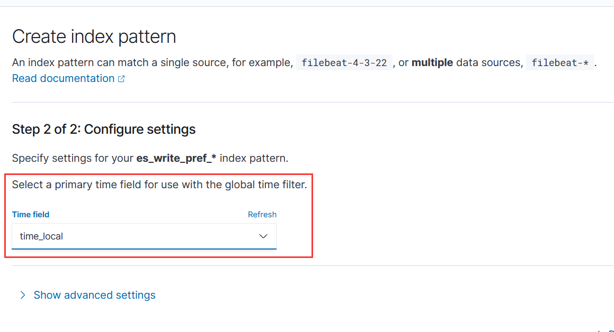
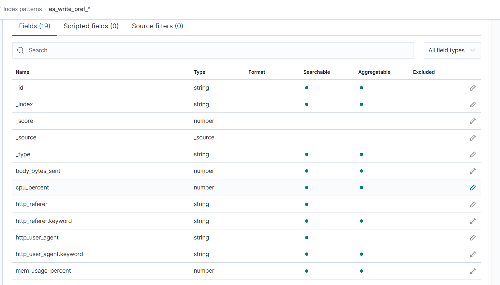
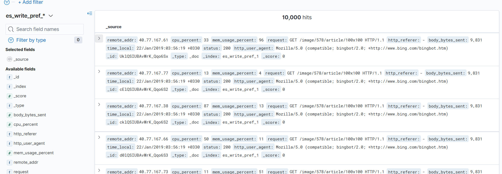
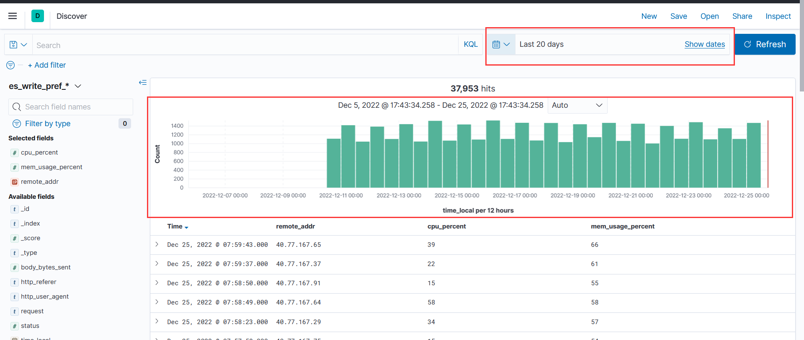
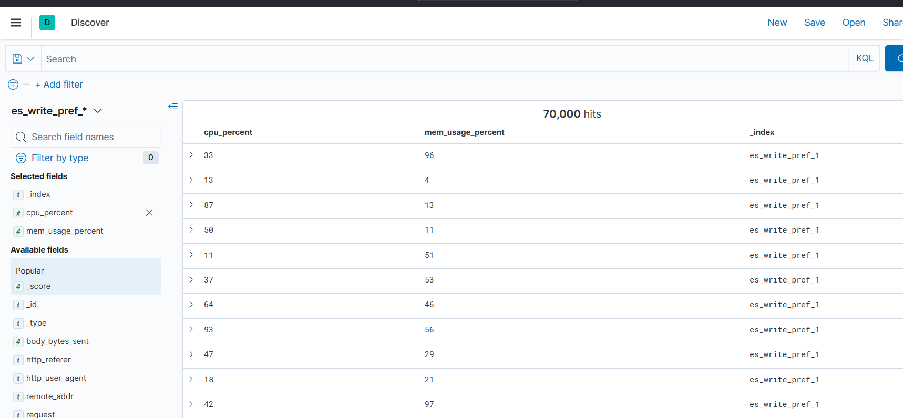
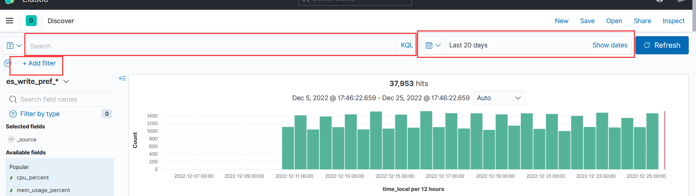
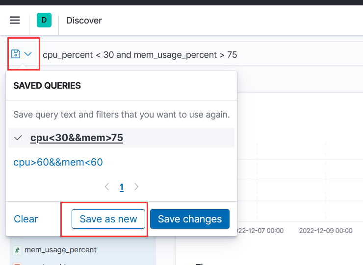
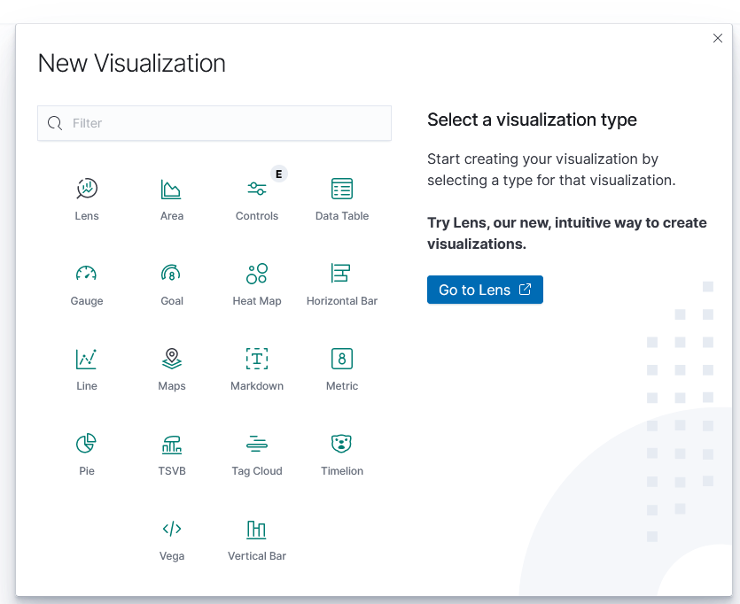

# 安装与配置

- 解压即可使用

- 配置文件 config/kibana.yml

  - server.port: 5601

    web服务端口, 默认5601

  - elasticsearch.hosts: ["http://localhost:9200"]

    要连接的 es 集群地址

  - kibana.index: ".kibana"

    kibana 会将相关的配置数据存放在这个索引中

  - i18n.locale: "en"

    kibana 界面语言配置, 默认英文, 可以设为 “zh_CN” 启用中文

# 主要功能

- Discovery: 浏览数据
- Visualize: 将数据可视化, 创建可视化面板
- Dashboard: 仪表盘, 展示各种事先定义好的可视化(visualize)内容

## 准备工作

准备索引数据

1. 索引模板

   ```json
   {
     "index_patterns": "es_write_pref*",
     "settings": {
       "index.number_of_shards":1,
       "index.number_of_replicas":0
     }
   }
   ```

2. 插入数据

   ```json
   {"index":{"_index":"es_write_pref_${__Random(1,10,)}","_type":"_doc"}}
   {"remote_addr": "40.77.167.${__Random(1,100,)}","cpu_percent": ${__Random(30,60,)},"mem_usage_percent": ${__Random(50,60,)},"request": "GET /image/578/article/100x100 HTTP/1.1","http_referer": ["-"],"body_bytes_sent": 9831,"time_local": "2022-12-${__Random(10,25,)} ${__Random(0,23,)}:${__Random(0,59,)}:${__Random(0,59,)}","status": 200,"http_user_agent": "Mozilla/5.0 (compatible; bingbot/2.0; +http://www.bing.com/bingbot.htm)"}
   
   ```

kibana 添加 index pattern

index pattern 是 kibana 一个关键概念, 从 es 获取数据进行分析时, 都是针对一个 index pattern, 

index pattern 支持通配符, 可以关联到多个索引

可以从 `Stack Management` - `Index patterns` 进入管理





如果索引包含时间相关的字段, 会突出显示, 可以选择一个作为默认的时间筛选条件, 在后续的查询中作为默认的时间条件.

在 index_pattern 中, 默认会展示跟 es 相同的数据类型, 按照类型决定各个字段支持的操作

也可以在 kibana 中为某些特殊字段提供额外的格式转换



# Discovery

## 查看数据

选择要查看的 index pattern , kibana 会展示索引的相关数据, 默认直接展示 doc 内容



如果创建 index_pattern 的时候选择了默认的时间field, 查看数据的时候会自动提供时间的筛选框, 并显示不同时间段内的 doc 数



左侧会列出所有的 field, 并有图标指示该 field 的类型

点击字段时, 会显示该 field 最常见的字段

点击字段旁边的加号, 会将该字段作为选中字段, 右侧数据界面变成表格形式, 只显示选中字段的内容



## 筛选数据



可以通过筛选条件进行查询

1. 通过 KQL 查询
2. 通过 默认时间字段 查询
3. 通过 自定义 filter 查询

可以将查询条件进行保存, 方便以后使用相同条件查询



# Visualize

## 可视化类型



新建可视化面板时, 包括以下类型

| 类型           | 描述                                                         |
| -------------- | ------------------------------------------------------------ |
| Markdown       | 信息框, 通过 markdown 语法, 编写提示信息, 可以用作 dashboard 概述 |
| Data Table     | 数据表, 直接展示相关数据                                     |
| Line           | 折线图                                                       |
| Horizontal Bar | 水平条形图                                                   |
| Vertical Bar   | 垂直条形图                                                   |
| Area           | 面积图                                                       |
| Pie            | 饼图, 显示数据来源比例                                       |
| Gauge          | 仪表盘图, 记录统计数据占预设数字的比例                       |
| Goal           | 目标图, 记录统计数据距离目标还有多少                         |
| Heat Map       | 热力图, 以矩阵形式显示数据分布                               |
| Tag Cloud      | 词云, 根据某个字段的相关指标生成词云                         |
| Maps           | 地图, 如果数据与地理位置相关, 可以结合地图展示               |
| Metric         | 指标, 根据数据得到一个指标                                   |
| Controls       | 控件, 添加常用的筛选条件, 在 Dashboard 更新所有可视化面板    |
| Lens           | 向导工具                                                     |
| TSVB           | time-serial visual builder, 时间序列可视化的构造器, 根据时间维度, 创建可视化, 可以生成多种展示 |
| Timelion       |                                                              |
| Vega           | 通过 vega 语法生成可视化图表                                 |

CSS 的 kibana 经过删减, 未提供 lens 工具, 但是提供了??

## 建图基本流程

1. 选择图形类型
2. 选择 index pattern, 即数据来源
3. 图的具体配置, 如字段, 纵横坐标, 分组等

## 图像配置

### 数据

- Metrics
  - Y轴数据, 选择一个聚合指标, 作为 y 轴的数据
  - Dot size, 点大小

### 指标与坐标轴配置

### 面板设置

# 基础图形

折线图, 面积图, 条形图