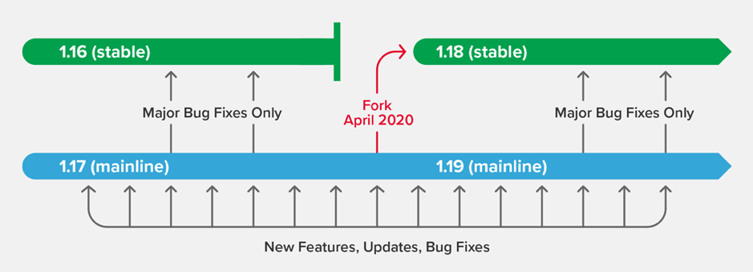

# █ Nginx

# 一. 概述

## 1. Nginx 是什么

[开源版官网](http://nginx.org/)

## 2. 版本介绍

NGINX 在 NGINX Open Source 代码存储库中维护着两个分支，分别为主线版和稳定版：

- `Mainline version`**主线版**: 更新活跃的分支, 会添加最新功能和错误修复. 版本号第二段为奇数, 如 1.19.0
- `Stable version`**稳定版**: 接收针对高严重性错误的修复, 但不会加入新功能. 版本号第二段为偶数, 如 1.18.0
- `Legacy versions`**历史版本**: 生命周期已结束的稳定版本, 不再更新

一般建议使用最新的 `Stable` 稳定版本, 但 Nginx 官方也建议使用`Mainline `主线版本, 包含了所有新功能、性能改进和增强功能, 并且经过测试和质量检查, 适合生产使用。

对于 NGINX，“稳定”一词是指功能和更新频率稳定, 与软件质量无关, 稳定分支在其生命周期中不接收任何新功能，通常仅接收一两个更新用于修复严重的错误。

稳定分支的**生命周期为一年**, 每年四月会停止对当前稳定分支的维护, 不再提供任何错误修复:

1. 新的稳定分支: 对当前主线分支(开发分支)进行复刻 (Fork)，以创建下一个稳定分支。

   新的稳定分支会继承主线分支在过去一年中进行的所有错误修复、功能更新和其他更改。

   请注意，在发布新的主线分支之前，“稳定分支”与当前主线分支完全相同，并且可能包含近几天内新增的功能

2. 新的主线分支: 主线分支版本升级, 版本号的第二位会增加为下一个奇数。

   主线分支会持续更新, 每四到六周就发布一个新版本。



# 二. 安装

## 1. 安装

- Ubuntu apt 安装

  ```shell
  sudo apt install nginx
  ```

- CentOS yum 安装

  ```shell
  yum install nginx
  ```

- tar.gz 编译安装

- windows

  从官网下载 zip 包, 解压即可

### 1.4. 确认安装成功

查看版本号, 以判断是否安

```sh
nginx -v
> nginx version: nginx/1.18.0 (Ubuntu)
```

## 2. 配置文件

通过不同的安装方式, 配置文件所在路径可能有所不同, 可能的路径有 `/usr/local/nginx/conf`, `/etc/nginx`, or `/usr/local/etc/nginx`.

- ubuntu apt 安装, 路径为 `/etc/nginx/nginx.conf`
- CentOS yum 安装, 路径为 `/etc/nginx/nginx.conf`
- tar.gz 解压安装, 路径为 `${安装路径}/conf/nginx.conf`

## 3. 启动/停止

```sh
nginx -s reload             # 重新载入配置文件
nginx -s reopen             # 重启 Nginx
nginx -s stop               # 快速停止 Nginx
nginx -s quit				# 正常退出 Nginx
```

## 4. 日志文件

如果需要查看 nginx 工作中的日志信息, 请查阅配置文件中 `access_log` 和 `error_log` 指定的日志文件

- `/var/log/nginx/access.log`
- `/var/log/nginx/error.log`


# 三. 配置

## 1. 配置文件基本规则

### 1.1. 文件结构

nginx 的配置文件基本结构如下所示, 大致规则如下

- Nginx由模块组成，这些模块由配置文件中指定的指令控制。
  - **简单指令**由名称和以空格分隔的参数组成，以分号`;`结尾。
  - **块指令**由名称和大括号`{}`包围的语句块组成, 每个语句块里面可以包含简单指令或其他的块指令
- 块指令也被称为上下文, 没有置于任何上下文之内的指令, 被认为是在主上下文中
- `#` 开头的是注释行

```nginx
# 全局块, 影响nginx全局的指令, 如用户组，pid存放路径，日志路径，插件及配置文件引入
user www-data;								#配置用户或者组，默认为nobody nobody。
worker_processes auto;						#允许生成的进程数，默认为1
pid /run/nginx.pid;							#指定nginx进程运行文件存放地址
include /etc/nginx/modules-enabled/*.conf;	#加载插件及配置

# 定日志路径和级别。这个设置可以放入全局块，http块，server块，
# 可选级别为：debug|info|notice|warn|error|crit|alert|emerg
error_log log/error.log debug;  

# events块, 影响nginx服务器或与用户的网络连接
events {
    accept_mutex on;	#设置网路连接序列化，防止惊群现象发生，默认为on
    multi_accept on;	#设置一个进程是否同时接受多个网络连接，默认为off
    #use epoll;			#事件驱动模型，select|poll|kqueue|epoll|resig|/dev/poll|eventport
    worker_connections  1024;    #最大连接数，默认为512
}

# http块, 配置代理，缓存，日志定义等
http {
	# http全局块
    include       mime.types;   #文件扩展名与文件类型映射表
    default_type  application/octet-stream; #默认文件类型，默认为text/plain

    sendfile on;   #允许sendfile方式传输文件，默认为off，可以在http块，server块，location块。
    sendfile_max_chunk 100k;  #每个进程每次调用传输数量不能大于设定的值，默认为0，即不设上限。
    keepalive_timeout 65;  #连接超时时间，默认为75s，可以在http，server，location块。
    
    #access_log off; #取消服务日志    
    log_format myFormat '$remote_addr–$remote_user [$time_local] $request $status $body_bytes_sent $http_referer $http_user_agent $http_x_forwarded_for'; #自定义格式
    access_log log/access.log myFormat;  #combined为日志格式的默认值
    
    #server块, 配置虚拟主机的相关参数，可以有多个
    server {
        #server全局块
        keepalive_requests 120; #单连接请求上限次数。
        listen       4545;   #监听端口
        server_name  127.0.0.1;   #监听地址     
        # location块, 配置请求的路由，以及各种页面的处理情况, 可以有多个
        # 请求的url过滤，正则匹配，~为区分大小写，~*为不区分大小写
        location [PATTERN] {
           #root path;  #根目录
           #index vv.txt;  #设置默认页
           proxy_pass  http://mysvr;  #请求转向 mysvr 定义的服务器列表
           deny 127.0.0.1;  #拒绝的ip
           allow 172.18.5.54; #允许的ip     
        }
    }
}
```

### 1.2. 变量

变量可以作为指令的参数, 以便动态的处理请求

#### 预设变量

详见 [nginx 预设变量](https://nginx.org/en/docs/http/ngx_http_core_module.html#variables)

#### 自定义变量

- `set`, 设置一个变量, 见 [官网](https://nginx.org/en/docs/http/ngx_http_rewrite_module.html#set)
- `map`, 创建一个 key-value 映射, 见[官网](https://nginx.org/en/docs/http/ngx_http_map_module.html#map)
- `geo`, 创建一个 ip-位置 映射, 见[官网](https://nginx.org/en/docs/http/ngx_http_geo_module.html#geo)

## 2. 设置虚拟服务器

在 `http` 块中添加 `server` 块, 就可以声明一个虚拟服务器, 允许有多个 `server` 块来指定多个虚拟服务器

```nginx
http {
    server {
        # 第一个server
    }
    server {
        # 第二个server
    }
}
```

## 3. server 指令

一个 server, 通过 `listen` 和 `server_name` 两个指令来匹配请求, 其中

- `listen`, 指定监听的客户端ip和请求的端口, 默认监听全部ip 和 80 端口
- `server_name`, 指定请求中 host 请求头的值, 可以是全名、通配符或正则表达式。

具体规则如下

- 若通过 `listen` 能确定唯一的 server, 则忽略 `server_name` 的规则(实际上是3的特例)
- 若通过`listen` 规则匹配到多个server, 则会用`server_name`去匹配`host`请求头
- 若 `server_name` 都不匹配, 则使用`listen`匹配到的default_server

其中, 如果通过 host 请求头能匹配到多个 `server_name`, 则按照以下优先级选取 server

- 全名完全匹配的
- 通配符在前面的最长通配符表达式, 如 `*.demo.com` > `*.com`
- 通配符在后面的最长通配符表达式, 如 `www.demo.*` > `www.*`
- 第一个匹配的正则表达式(按配置文件中的顺序)

### 默认服务器

如果 host 请求头没有匹配任何 `server_name`, 则选择 `listen` 的默认服务器

- 默认服务器是 listen 规则匹配的第一个 server (按配置文件中的顺序)

- 显式声明为默认服务器

  ```nginx
  listen  80 default_server;
  ```
  
- 不同的`ip:port` 可以指定各自的默认服务器


如果不想处理未匹配到 server_name 指令的请求, 如 host不匹配或没有host请求头, 则可以定义一个server_name 为空的服务器, 并直接返回 4xx 系列错误代码

```nginx
server {
    listen      80;
    server_name "";
    return      444;
}
```

也可以直接定义一个return 错误代码的server 来作为默认服务器

```nginx
server {
    listen      80 default_server;
    return      444;
}
```

## 4. location 指令

NGINX 可以将流量发送到不同的代理，或者根据请求的uri提供不同的文件。这些块是使用放置在服务器指令中的location指令定义的。

location 指令可以嵌套, 以便进行更细化的转发

```nginx
http {
    server {
        location xxx {
        	# 路径配置
        	location yyy {}
        	location zzz {}
        }
    }
}
```

location 指令支持两种写法

- 前缀字符串, URI必须以给定前缀开头

  ```nginx
  # 能匹配 /some/path/doc.html, 不匹配 /other/some/path/doc.html
  location /some/path/ {}
  ```

- 正则表达式, 用波浪号`~`(区分大小写)或`~*`(不分大小写)指示后续字符串是正则表达式

  ```nginx
  # ~ 是正则表达式的指示符
  location ~ \.html? {}
  ```


location 匹配路径的流程如下

- 检查前缀字符串的匹配, 找到最长匹配的
- 如有`=`的前缀字符串匹配成功, 则停止搜索, 使用`=`匹配成功的 location 指令
- 如有`^~`的前缀字符串是最长匹配, 则不进行正则表达式的匹配检查
- 暂存最长匹配的前缀字符串
- 按照配置文件中的顺序, 检查正则表达式
- 使用第一个匹配成功的正则表达式
- 如果没有匹配的正则表达式, 使用暂存的最长匹配的前缀字符串

location 指令中可以使用 `=` `~` `^~` 等限制符, 其中

- `= `严格匹配。如果这个查询匹配，那么将停止搜索并立即处理此请求, 
  - **可以用来对常用的路径进行优化, 跳过后续检测步骤**, 
  - 比如对`/` 和 `/index.html` 指定严格匹配 
- `~` 为区分大小写匹配(可用正则表达式)
- `!~`为区分大小写不匹配
- `~*` 为不区分大小写匹配(可用正则表达式)
- `!~*`为不区分大小写不匹配
- `^~` 如果把这个前缀用于一个常规字符串,那么告诉nginx 如果路径匹配那么不测试正则表达式。

### location 上下文

location 上下文通过一系列的指令来定义该如何处理一个请求


### root映射本地地址

```nginx
location /images/ {
	root /data;
}
```

对于`/images/`前缀的请求, 将在本地 `/data` 目录下查找文件, nginx 会将uri 拼到本地路径后面, 以获取完整的文件名, 

如请求 `/images/hello.jpg`, nginx 将返回`/data/images/hello.jpg`

### proxy_pass代理转发

```nginx
location / {
	proxy_pass http://www.example.com;
}
```

将请求转发到代理服务器

注意, 如果 location 指定了前缀, 并且 prosy_pass 的目标服务器指定了路径, 则会将请求url 中的前缀, 替换成proxy_pass 中的路径, 再发送到目标服务器

```nginx
location /some/path/ {
    proxy_pass http://www.example.com/link/;
}
```

比如上例的 `location` 匹配前缀 `/some/path/`, 且 `proxy_pass` 指定了目标服务器上的`/link/`, 则对于原始路径为 `/some/path/page.html` 的请求, 其中中 `/some/path` 将被替换为 `/link`, 即最终路径为 `http://www.example.com/link/page.html`.

如果前缀仅是 nginx 的路由标记, 不希望将路由前缀带到后端服务器时, 我们需要将该前缀从url 中去掉, 可以采用以下两种方法

#### 目标服务器路径以`/`结尾

当 proxy_pass 的服务器地址以`/`结尾时, nginx 会将请求url 的前缀部分去掉, 将剩余的拼到 proxy_pass 的地址后面

```nginx
server {
    listen 8081;
    location /order/ {
        proxy_pass http://192.168.0.103:8081/;
    }
}
```

#### 使用 rewrite

如果 proxy_pass 的服务器地址没有以 `/` 结尾, 则需要用 `rewrite` 指令对url 进行改写. 又因为 nginx 默认会对改写后的 url 重新匹配 server 和 location, `rewrite` 指令需要通过`break` 参数指定不再进行路径匹配

```nginx
server {
    listen 8082;
    location /user/ {
        proxy_pass http://192.168.0.103:8082;
        rewrite /user/(.*) /$1 break;
    }
}
```


## 5. 处理请求

### 5.1. 修改 url

`rewrite` 可以修改请求的 url,  接受2个参数

1. 必须, 原始路径, 正则表达式, 可以用括号`()`分组
2. 必须, 替换后的路径, 可以用`$n`引用前面正则表达式的匹配组内容
3. 可选, 停止进一步的改写(break 或 last), 或返回重定向(301或302)
   1. `last`, 停止原始url 匹配到的其他 rewrite 指令, 但新url 匹配到的location 及 rewrite 仍会执行
   2. `break`, 停止原始url匹配到的其他 rewrite 指令, 并不再使用新url匹配新一轮的rewrite指令
   3. `redirect`, 返回302响应, 浏览器发起新请求
   4. `permanent`, 返回301响应, 浏览器发起新请求

可以在 server 或 location 内使用多条 `rewrite` 指令, nginx 将会按其出现的顺序逐条执行

- 执行server下的rewrite
- 执行location匹配
- 执行location下的rewrite
- 按新url 进行新一轮的location匹配
- 执行location下的rewrite

当执行完 url 改写工作后, nginx 会根据新的 url 查找新的 location

### 5.2. 修改 response

`sub_filter`

### 5.3. 处理错误

`error_page` 指令

- 根据状态码返回指定错误页面
- 修改状态码
- 重定向到指定页面


## 6. 返回响应

### 6.1. 快速响应

`return` 可以快速返回响应, 第一个参数是状态码, 第二个参数是重定向地址, 或 body

```nginx
location /wrong/url {
    return 404;
}
location / {
    default_type application/json;
    return 200 "{\"msg\": \"you got a rapid response\"}";
}
location /permanently/moved/url {
    return 301 http://www.example.com/moved/here;
}
```

可用在 location 或 server 内

如果返回错误状态码, 则会返回指定的错误页面

### 6.1. 修改 header


# 四. 示例

## 2. 静态资源服务器

nginx 可以作为静态资源服务器, 只需要将资源放置到指定目录, 并设置映射路径即可.

```sh
server {
	listen 8088		# 监听的端口, 默认监听80端口	
    location / {
        root /opt/nginx_demo/static;
    }
    location /images/ {
        root /opt/nginx_demo/static/img;
    }
}
```

注意这里, 默认情况下, nginx 不会对请求路径进行裁剪, 会将请求路径原样拼到目标路径后面

比如, 请求路径为 `localhost/images/demo.jpg`, 则nginx会在 `/opt/nginx_demo/static/img` 的路径下查找`images/demo.jpg`, 即完整的文件路径为 `/opt/nginx_demo/static/img/images/demo.jpg`, 这可能不是我们希望的结果


## 3. 代理转发


### 3.1. 按路径转发

### 3.2. 按端口转发

### 3.3. 按请求信息转发


## 3. 改写响应

## 4. 负载均衡


