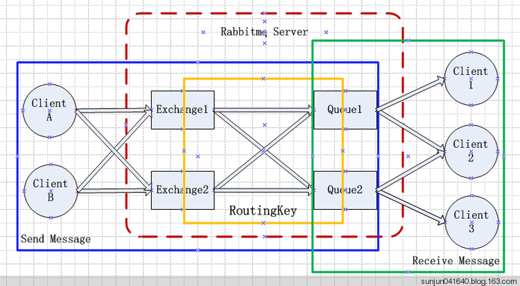
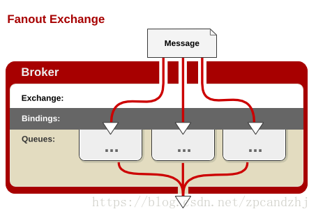
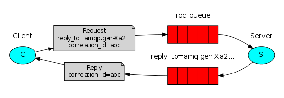

# █ RabbitMQ

# 一. 基本概念

## 1. AMQP


问题: 

- 简单模式/工作模式
  - 如何使用 amqpTemplate 直接发送消息到队列?
  - 不论该队列是否绑定交换机, 都能直接通过队列名发送消息
- 直连模式
  - 路由冲突? 能不能将多个不同的队列, 以相同的路由键绑定到同一个交换机?
  - 多重绑定? 能不能将同一个队列, 以不同的key绑定到同一个/不同的交换机上?
- 订阅模式
  - 不需要
- 主题模式

# 二. RabbitMQ 安装与配置

## 1. 安装

### 1. 安装 erlang

rabbitmq 依赖于 erlang, 需要先安装 erlang 环境, 可以选择以下四个不同版本的 erlang 

- RabbitMQ-erlang: rabbitMQ 团队发布的最小 erlang 环境, 仅提供 rabbitMQ 必要的组件, 安装时不需要其他依赖, 更加易用
- [Erlang Solutions](https://www.erlang-solutions.com/resources/download.html) 提供的包, 通常是最新的, 可能会引入一些不必要的依赖
- [EPEL](http://fedoraproject.org/wiki/EPEL), 由 RHEL/Fedora 提供, 是最官方的包, 但可能过时. 被分割成许多个不同的小包.
- OpenSUSE 提供的包

#### 1.1. 最小 erlang 环境

可以添加 [Package Cloud](https://packagecloud.io/rabbitmq/erlang) 或 [Bintray](https://bintray.com/rabbitmq-erlang/rpm/erlang) 仓库, 使用 yum 安装

```bash
# 添加 packageCloud 仓库

# 添加 bintray 仓库

# 使用 yum 安装最小 erlang

```

直接下载 rpm 包进行安装 [下载地址 https://github.com/rabbitmq/erlang-rpm/releases ](https://github.com/rabbitmq/erlang-rpm/releases).

```shell
# 下载 erlang-rpm 包
wget --content-disposition https://packagecloud.io/rabbitmq/erlang/packages/el/7/erlang-22.2-1.el7.x86_64.rpm/download.rpm

rpm -ivh erlang-22.2-1.el7.x86_64.rpm 
```

安装 erlang 可能会出现 openssl 依赖错误, 需要先安装最新的 openssl

```shell
wget http://rpmfind.net/linux/centos/7.7.1908/os/x86_64/Packages/openssl-libs-1.0.2k-19.el7.x86_64.rpm

rpm -ivh openssl-libs-1.0.2k-19.el7.x86_64.rpm --force
```

### 2. 安装 socat

```sh
wget http://repo.iotti.biz/CentOS/7/x86_64/socat-1.7.3.2-5.el7.lux.x86_64.rpm

rpm -ivh socat-1.7.3.2-5.el7.lux.x86_64.rpm 
```

### 3. 安装 RabbitMQ

#### 3.1. yum 安装

需要手动添加仓库

```shell

```

#### 3.2. rpm 安装

需要手动安装需要的依赖

```shell
wget https://github.com/rabbitmq/rabbitmq-server/releases/download/v3.8.1/rabbitmq-server-3.8.1-1.el7.noarch.rpm

yum -y install ./rabbitmq-server-3.8.1-1.el7.noarch.rpm 
```


## 2. 配置

```shell
#添加用户
#./rabbitmqctl add_user 账号 密码
./rabbitmqctl add_user admin admin
#分配用户标签(admin为要赋予administrator权限的刚创建的那个账号的名字)
./rabbitmqctl set_user_tags admin administrator
#设置权限<即开启远程访问>(如果需要远程连接,例如java项目中需要调用mq,则一定要配置,否则无法连接到mq,admin为要赋予远程访问权限的刚创建的那个账号的名字,必须运行着rabbitmq此命令才能执行)
./rabbitmqctl set_permissions -p "/" admin ".*" ".*" ".*" 
```

### 2.2. 用户管理

RabbitMQ 的用户有5种类型

1. **超级管理员(administrator)**
   可登陆管理控制台，可查看所有的信息，并且可以对用户，策略(policy)进行操作。
2. **监控者(monitoring)**
   可登陆管理控制台，同时可以查看rabbitmq节点的相关信息(进程数，内存使用情况，磁盘使用情况等)
3. **策略制定者(policymaker)**
   可登陆管理控制台, 同时可以对policy进行管理。但无法查看节点的相关信息(上图红框标识的部分)。
4. **普通管理者(management)**
   仅可登陆管理控制台，无法看到节点信息，也无法对策略进行管理。
5. **其他**
   无法登陆管理控制台，通常就是普通的生产者和消费者。

端口配置


# 三. 应用开发

## 1. 原生 Client

### ConnectionFactory、Connection、Channel

ConnectionFactory、Connection、Channel都是RabbitMQ对外提供的API中最基本的对象。Connection是RabbitMQ的socket链接，它封装了socket协议相关部分逻辑。ConnectionFactory为Connection的制造工厂。
Channel是我们与RabbitMQ打交道的最重要的一个接口，我们大部分的业务操作是在Channel这个接口中完成的，包括定义Queue、定义Exchange、绑定Queue与Exchange、发布消息等。

### 1.1. 生产者

```java
public static void main(String[] argv) throws Exception {
    //定义连接工厂
    ConnectionFactory factory = new ConnectionFactory();
    //设置服务地址
    factory.setHost(RabbitConstant.HOST);
    factory.setPort(RabbitConstant.PORT);
    //设置账号信息，用户名、密码
    factory.setUsername(RabbitConstant.USERNAME);
    factory.setPassword(RabbitConstant.PASSWORD);
    // 通过工厂获取连接
    Connection connection = factory.newConnection();
    // 从连接中创建通道
    Channel channel = connection.createChannel();
    // 声明（创建）队列, 注册到 rabbitmq 服务器
    channel.queueDeclare("SimpleQueue", true, false, false, null);
    // 消息内容
    String message = "Hello RabbitMQ!";
    channel.basicPublish("", "SimpleQueue", null, message.getBytes());
    System.out.println("成功发送消息: " + message);
    //关闭通道和连接
    channel.close();
    connection.close();
}
```

### 1.2. 消费者

```java
public static void main(String[] argv) throws Exception {
    //定义连接工厂
    ConnectionFactory factory = new ConnectionFactory();
    //设置服务地址, 端口
    factory.setHost(RabbitConstant.HOST);
    factory.setPort(RabbitConstant.PORT);
    //设置账号信息，用户名、密码
    factory.setUsername(RabbitConstant.USERNAME);
    factory.setPassword(RabbitConstant.PASSWORD);
    // 通过工程获取连接
    Connection connection = factory.newConnection();
    // 从连接中创建通道
    Channel channel = connection.createChannel();
    // 声明（创建）队列, 注册到 rabbitmq 服务器
    channel.queueDeclare("SimpleQueue", true, false, false, null);

    // 拉取消息
    GetResponse response = channel.basicGet("SimpleQueue", false);
    if (response != null) {
        String data = new String(response.getBody());
        System.out.println("成功获取消息 <= " + data);
        channel.basicAck(response.getEnvelope().getDeliveryTag(), false);
    } else {
        System.out.println("█ █ █ █ 简单队列暂时没有消息");
    }
    //关闭通道和连接
    channel.close();
    connection.close();
}
```


## 2. 与 Spring 集成

引入依赖

xml 配置

java 配置

## 3. 与 SpringBoot 集成

引入依赖

常用属性配置

```properties
# 服务器配置
spring.rabbitmq.host
spring.rabbitmq.port
spring.rabbitmq.virtual-host
# 用户认证
spring.rabbitmq.username
spring.rabbitmq.password
# 默认目的地
spring.rabbitmq.template.exchange
spring.rabbitmq.template.routing-key
spring.rabbitmq.template.default-receive-queue
# 监听器
spring.rabbitmq.listener.simple.acknowledge-mode
spring.rabbitmq.listener.simple.concurrency
spring.rabbitmq.listener.simple.max-concurrency
```

具体配置内容见 [SpringBootp 配置项清单](https://docs.spring.io/spring-boot/docs/2.2.0.RELEASE/reference/html/appendix-application-properties.html#integration-properties)

## 4. AmqpTemplate RabbitMessagingTemplate

### 4.1. 区别

RabbitMessagingTemplate 是 AmqpTemplate 的代理人, 底层仍是通过调用 AmqpTemplate 的方法来实现消息的收发操作. 但 RabbitMessagingTemplate 是spring 对所有消息的服务的一个统一的抽象层, 提供一套跨消息服务实现的消息操作 API, 其消息返回的消息对象是对底层消息对象的进一步封装

AmqpTemplate 获取的消息对象是 `org.springframework.amqp.core.Message`

RabbitMessagingTemplate 获取的消息对象是 `org.springframework.messaging.Message`

### 4.2. 发送

AmqpTemplate 提供了五种消息发送方式, 且每种方式都有多个重载方法

#### 1) 基本的发送

先准备好 `Message` 对象, 将消息发送到指定的队列. 

如果事先定义好默认的交换机和路由键, 则可以省略相关参数

```java
void send(Message message);
void send(String routingKey, Message message);
void send(String exchange, String routingKey, Message message);
```

#### 2) 发送并接收回信

先准备好 `Message` 对象, 将消息发送到指定的队列, 并接收回复. 

如果事先定义好默认的交换机和路由键, 则可以省略相关参数

```java
Message sendAndReceive(Message message);
Message sendAndReceive(String routingKey, Message message);
Message sendAndReceive(String exchange, String routingKey, Message message);
```

#### 3) 转换并发送

前面的发送方法, 需要提前构造好 `Message` 对象,  `AmqpTemplate` 也允许直接发送具体的数据, 底层会以默认方式构造合适的 `Message` 对象

```java
void convertAndSend(Object message);
void convertAndSend(String routingKey, Object message);
void convertAndSend(String exchange, String routingKey, Object message);
```

如果需要为待发送消息添加一些消息属性, 比如为消息进行分组等, 需要在创建消息后, 发送消息前对消息进行操作, 可以采用以下方法, 在上述方法增加一个 `MessagePostProcessor` 后处理器

```java
void convertAndSend(Object message, MessagePostProcessor messagePostProcessor);
void convertAndSend(String routingKey, Object message, 
                    MessagePostProcessor messagePostProcessor);
void convertAndSend(String exchange, String routingKey, Object message, 
                    MessagePostProcessor messagePostProcessor);
```

#### 4) 转换发送并接收回信

```java
Object convertSendAndReceive(Object message);
Object convertSendAndReceive(String routingKey, Object message);
Object convertSendAndReceive(String exchange, String routingKey, Object message);
```

如果需要为待发送消息添加一些消息属性, 比如为消息进行分组等, 需要在创建消息后, 发送消息前对消息进行操作, 可以采用以下方法, 在上述方法增加一个 `MessagePostProcessor` 后处理器

```java
Object convertSendAndReceive(Object message, MessagePostProcessor messagePostProcessor);
Object convertSendAndReceive(String routingKey, Object message, 
                             MessagePostProcessor messagePostProcessor);
Object convertSendAndReceive(String exchange, String routingKey, Object message,
                             MessagePostProcessor messagePostProcessor) ;
```

#### 5) 转换发送并解析回信

`convertSendAndReceive()` 方法组能够获取回信, 但得到的回信是 `Object` 类型, 还需要额外的类型转换才能处理. `AmqpTemplate` 还提供了对应的泛型方法, 自动将回信解析为指定类型对象

```java
<T> T convertSendAndReceiveAsType(Object message, 
                                  ParameterizedTypeReference<T> responseType)
<T> T convertSendAndReceiveAsType(String routingKey, Object message,
                                  ParameterizedTypeReference<T> responseType);
<T> T convertSendAndReceiveAsType(String exchange, String routingKey, Object message,
                                  ParameterizedTypeReference<T> responseType);
```

如果需要为待发送消息添加一些消息属性, 比如为消息进行分组等, 需要在创建消息后, 发送消息前对消息进行操作, 可以采用以下方法, 在上述方法增加一个 `MessagePostProcessor` 后处理器

```java
<T> T convertSendAndReceiveAsType(Object message, 
                                  MessagePostProcessor messagePostProcessor,
                                  ParameterizedTypeReference<T> responseType);
<T> T convertSendAndReceiveAsType(String routingKey, Object message,
                                  MessagePostProcessor messagePostProcessor, 
                                  ParameterizedTypeReference<T> responseType);
<T> T convertSendAndReceiveAsType(String exchange, String routingKey, Object message,
                                  MessagePostProcessor messagePostProcessor,
                                  ParameterizedTypeReference<T> responseType);
```

### 4.3. 接收

#### 1) 接收消息

可以指定超时时间, 一定时间未获取到消息就结束

```java
Message receive();
Message receive(String queueName);
Message receive(long timeoutMillis);
Message receive(String queueName, long timeoutMillis);
```

#### 2) 接收并解析消息

可以将 Message 对象解析为 Object 对象, 都可以指定超时时间

```java
Object receiveAndConvert();
Object receiveAndConvert(String queueName);
Object receiveAndConvert(long timeoutMillis);
Object receiveAndConvert(String queueName, long timeoutMillis);
```

 `AmqpTemplate` 还提供了对应的泛型方法, 自动将回信解析为指定类型对象

```java
<T> T receiveAndConvert(ParameterizedTypeReference<T> type);
<T> T receiveAndConvert(String queueName, ParameterizedTypeReference<T> type);
<T> T receiveAndConvert(long timeoutMillis, ParameterizedTypeReference<T> type);
<T> T receiveAndConvert(String queueName, long timeoutMillis, 
                        ParameterizedTypeReference<T> type);
```

#### 3) 接收消息并回信

```java
// 默认回信目的地
<R, S> boolean receiveAndReply(ReceiveAndReplyCallback<R, S> callback);
<R, S> boolean receiveAndReply(String queueName, ReceiveAndReplyCallback<R, S> callback);

// 固定回信目的地
<R, S> boolean receiveAndReply(ReceiveAndReplyCallback<R, S> callback, 
                               String replyExchange, String replyRoutingKey);
<R, S> boolean receiveAndReply(String queueName, ReceiveAndReplyCallback<R, S> callback, 
                               String replyExchange,String replyRoutingKey);

// 动态回信目的地
<R, S> boolean receiveAndReply(ReceiveAndReplyCallback<R, S> callback,
                               ReplyToAddressCallback<S> replyToAddressCallback);
<R, S> boolean receiveAndReply(String queueName, ReceiveAndReplyCallback<R, S> callback,
                               ReplyToAddressCallback<S> replyToAddressCallback);
```

## 6. 消息监听器

两个关键注解

`@RabbitHandler`

`@RabbitListener(queues = 队列名)`

```java
@RabbitHandler
@RabbitListener(queues = queue)
public void queue(Message message, Channel channel) throws Exception {
    try {
        System.out.println(Thread.currentThread() + "queue 收到消息:" +message);
        channel.basicAck(message.getMessageProperties().getDeliveryTag(), true);
    } catch (IOException e) {
        channel.basicNack(message.getMessageProperties().getDeliveryTag(), false, true);
    }
}
```

# 四. 工作模式



RabbitMQ 是现在很常用的一个消息服务中间件, 通过不同类型的交换机(*Exchange*) 和不同的路由键(*RoutingKey*) , 可以实现不同分发策略, 灵活地将消息分发到不同的队列中去. 

生产者(*Producer*)先将消息发送到交换机, 交换机根据事先设置好的分发策略, 将消息分发到不同的队列中, 消费者从指定队列中获取消息. 

生产者需要关注交换机(名称和类型), 路由键, 而消费者只需要关注队列.

在 RabbitMQ 中, 每个队列中的消息都只会被消费一次, 如果需要将同一条消息被多个消费者消费多次, 可以通过合适的交换机, 将同一条消息投递到多个不同的队列中, 形成多个消息副本提供给不同的消费者. 

## 1. 简单模式 Simple

不需要指定交换机, 生产者直接通过**队列名**发送消息, 消费者也直接通过**队列名**获取消息. 


## 3. 路由模式 Routing


需要声明一个直连交换机(*Direct Exchange*), 并通过路由键(*RoutingKey*)将一个队列绑定到直连交换机. 

- 允许多重绑定: 将**同一队列**以**不同的路由键**与交换机绑定
- 允许重复绑定: 将**多个队列**以**相同的路由键**与交换机绑定, 会创建多个消息副本


当消息到达直连交换机时, 会根据消息中携带的路由键, 查找绑定的队列:

- 若交换机上有通过该路由键绑定的队列, 将消息投递到该队列
- 若交换机上没有通过该路由键绑定的队列, 则消息会被丢弃

### 3.1. 原生方式

### 3.2. spring 方式

声明交换机/队列/绑定路由

```java
@Bean
public DirectExchange directExchange(){
    return new DirectExchange(EXCHANGE_DIRECT);
}
@Bean(QUEUE_D1)
public Queue queueD1() {
    return new Queue(QUEUE_D1,true);
}
@Bean(QUEUE_D2)
public Queue queueD2() {
    return new Queue(QUEUE_D2,true);
}
@Bean
public Binding binding1(@Qualifier(QUEUE_D1) Queue queueD1, DirectExchange exchange){
    return BindingBuilder.bind(queueD1).to(exchange).with(KEY_D1);
}
@Bean
public Binding binding2(@Qualifier(QUEUE_D2) Queue queueD2, DirectExchange exchange){
    return BindingBuilder.bind(queueD2).to(exchange).with(KEY_D2);
}
}
```

消息生产者

```java
public String sendDx() {
    for (int i = 0; i < 10; i++) {
        amqpTemplate.convertAndSend(EXCHANGE_DIRECT, KEY_D1, "直连1 ");
        amqpTemplate.convertAndSend(EXCHANGE_DIRECT, KEY_D2, "直连2 ");
    }
    return "直连模式, 各发10条消息";
}
```

## 4. 发布/订阅 Pub/Sub

### 扇形交换机 Fanout

需要声明一个扇形交换机(*Fanout Exchange*), 并将多个队列绑定到该交换机上. 

扇形交换机上绑定队列时不需要指定路由键(指定了也会被忽略), 到达扇形交换机的消息将会被投递到该交换机的所有队列中. 




### 4.1. 原生方式

### 4.2. spring 方式

声明

```java
@Bean
public FanoutExchange fanoutExchange(){
    return new FanoutExchange(EXCHANGE_FANOUT);
}
@Bean(QUEUE_F1)
public Queue queueF1() {
    return new Queue(QUEUE_F1,true);
}
@Bean(QUEUE_F2)
public Queue queueF2() {
    return new Queue(QUEUE_F2,true);
}
@Bean
public Binding binding1(@Qualifier(QUEUE_F1) Queue queueF1, FanoutExchange exchange){
    return BindingBuilder.bind(queueF1).to(exchange);
}
@Bean
public Binding binding2(@Qualifier(QUEUE_F2) Queue queueF2, FanoutExchange exchange){
    return BindingBuilder.bind(queueF2).to(exchange);
}
```

生产者

```java
public String sendFx() {
    for (int i = 0; i < 3; i++) {
        amqpTemplate.convertAndSend(EXCHANGE_FANOUT, null, "订阅1 ");
        amqpTemplate.convertAndSend(EXCHANGE_FANOUT, null, "订阅2 ");
        amqpTemplate.convertAndSend(EXCHANGE_FANOUT, null, "订阅3 ");
    }
    return "发送成功";
}
```


## 5. 主题模式 Topics


主题交换机与直连交换机类似, 都需要在绑定队列时指定路由键, 到达交换的消息会根据路由键投递到不同的队列.

但区别在于直连交换机使用的是精确匹配的路由键, 而主题交换机则允许使用通配符进行模糊匹配. 

主题交换机绑定队列的key是一个匹配表达式, 以句点`.`为分隔符, `*`匹配一个词, `#`匹配任意多个词, 如 

- `usa.*`: 仅匹配形如 `usa.x` 的key, 忽略 `usa.x.y`, `usa.x.y.z` 等key
- `china.#`: 匹配形如 `china.x`, `china.x.y`, `china.x.y.z` 等key
- `#.news`: 仅匹配形如 `x.news` 的key, 忽略 `x.y.news`, `x.y.z.news` 等key
- `#.weather`: 匹配形如 `x.weather`, `x.y.weather`, `x.y.z.weather` 等key

比如一个生产者以`usa.news`为路由键发送消息到主题交换机, 则该消息会被投递到 `usa.*`和`#.news` 两个队列


### 5.1. 原生方式

### 5.2. spring 方式

声明

```java
@Bean
public TopicExchange topicExchange(){
    return new TopicExchange(EXCHANGE_TOPIC);
}
@Bean(QUEUE_USA)
public Queue usaQueue() {
    return new Queue(QUEUE_USA,true);
}
@Bean(QUEUE_CHINA)
public Queue chinaQueue() {
    return new Queue(QUEUE_CHINA,true);
}
@Bean(QUEUE_NEWS)
public Queue newsQueue() {
    return new Queue(QUEUE_NEWS,true);
}
@Bean(QUEUE_WEATHER)
public Queue weatherQueue() {
    return new Queue(QUEUE_WEATHER,true);
}
@Bean
public Binding binding1(@Qualifier(QUEUE_USA) Queue queue, TopicExchange exchange){
    // usa.*: 仅匹配形如 usa.x 的key, 忽略 usa.x.y, usa.x.y.z 等key
    return BindingBuilder.bind(queue).to(exchange).with("usa.*");
}
@Bean
public Binding binding2(@Qualifier(QUEUE_CHINA) Queue queue, TopicExchange exchange){
    // china.#: 匹配形如 china.x, china.x.y, china.x.y.z 等key
    return BindingBuilder.bind(queue).to(exchange).with("china.#");
}
@Bean
public Binding binding3(@Qualifier(QUEUE_NEWS) Queue queue, TopicExchange exchange){
    // #.news: 仅匹配形如 x.news 的key, 忽略 x.y.news, x.y.z.news 等key
    return BindingBuilder.bind(queue).to(exchange).with("*.news");
}
@Bean
public Binding binding4(@Qualifier(QUEUE_WEATHER) Queue queue, TopicExchange exchange){
    // #.weather: 匹配形如 x.weather, x.y.weather, x.y.z.weather 等key
    return BindingBuilder.bind(queue).to(exchange).with("#.weather");
}
```

生产者

```java
public String sendTp() {
    // QUEUE_NEWS QUEUE_USA
    amqpTemplate.convertAndSend(EXCHANGE_TOPIC, "usa.news", "美国新闻联播");
    // QUEUE_NEWS QUEUE_CHINA
    amqpTemplate.convertAndSend(EXCHANGE_TOPIC, "china.news", "中国新闻联播");
    // 没有队列能收到
    amqpTemplate.convertAndSend(EXCHANGE_TOPIC, "usa.NewYork.news", "美国纽约新闻联播");
    // QUEUE_CHINA
    amqpTemplate.convertAndSend(EXCHANGE_TOPIC, "china.Shenzhen.news", "中国深圳新闻联播");

    // QUEUE_WEATHER QUEUE_USA
    amqpTemplate.convertAndSend(EXCHANGE_TOPIC, "usa.weather", "美国天气预报");
    // QUEUE_WEATHER QUEUE_CHINA
    amqpTemplate.convertAndSend(EXCHANGE_TOPIC, "china.weather", "中国天气预报");
    // QUEUE_WEATHER
    amqpTemplate.convertAndSend(EXCHANGE_TOPIC, "usa.NewYork.weather", "美国纽约天气预报");
    // QUEUE_WEATHER QUEUE_CHINA
    amqpTemplate.convertAndSend(EXCHANGE_TOPIC, "china.Shenzhen.weather", "中国深圳天气");
    return "发送成功";
}
```


## 6. 远程过程调用 RPC



### 6.1. 原生方式

### 6.2. spring 方式

## 7. 发布者确认 Publisher-Confirm

### 7.1. 原生方式

### 7.2. spring 方式

# 3. 交换机 Exchange

通过 channel 声明 exchange, 根据参数个数可以有以下四种方法, 且根据交换机类型的声明方式, 有枚举类和字符串的重载方法

```java
// 以枚举类指定交换机类型
exchangeDeclare(交换机名, 类型枚举);
exchangeDeclare(交换机名, 类型枚举, 是否持久化);
exchangeDeclare(交换机名, 类型枚举, 是否持久化, 自动删除, 其他参数);
exchangeDeclare(交换机名, 类型枚举, 是否持久化, 自动删除, 内部交换机,其他参数)
    
// 以字符串指定交换机类型
exchangeDeclare(交换机名, 类型字符串);
exchangeDeclare(交换机名, 类型字符串, 是否持久化);
exchangeDeclare(交换机名, 类型字符串, 是否持久化, 自动删除, 其他参数);
exchangeDeclare(交换机名, 类型字符串, 是否持久化, 自动删除, 内部交换机, 其他参数);
```

# 五. 高级特性

## 1. message

持久化

消息分组

优先级

延迟/定时投递


## 2. publisher

## 3. consumer

## 4. broker


## 要解决的问题

- 发布者确认, 确认消息正确发布到队列中
  - 同步
  - 事务
  - **发布者确认**
- 消费者确认 手动签收
  - 
- 失败重发策略
  - 记录重试次数 redis? 
  - nack 无限重发
  - basicPublish? 
- 幂等问题处理
- 死信处理
- 延迟队列
  - 消息存活时间 + 死信队列


优先级

持久化

