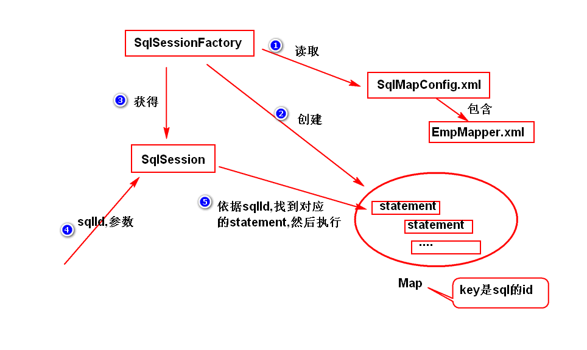
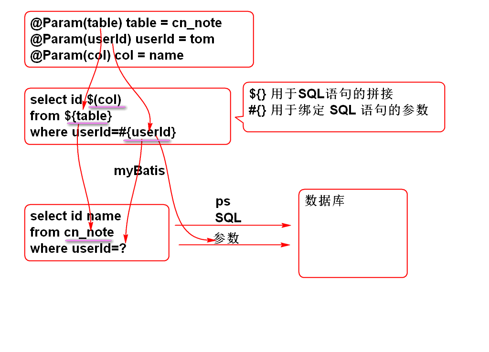
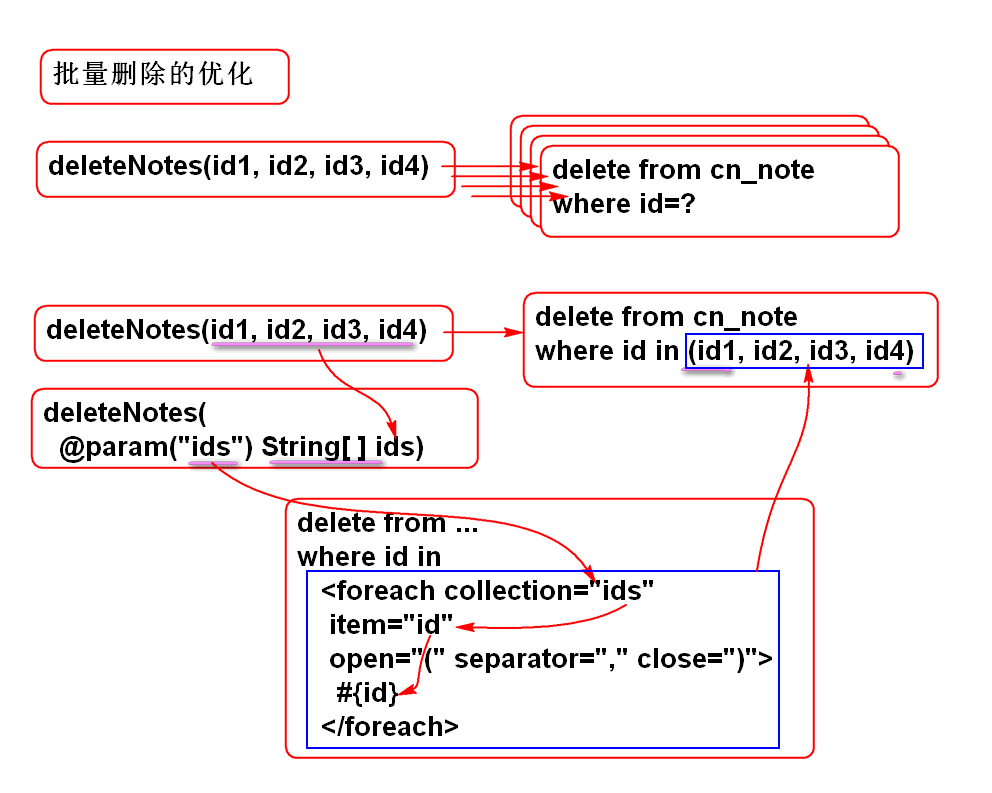
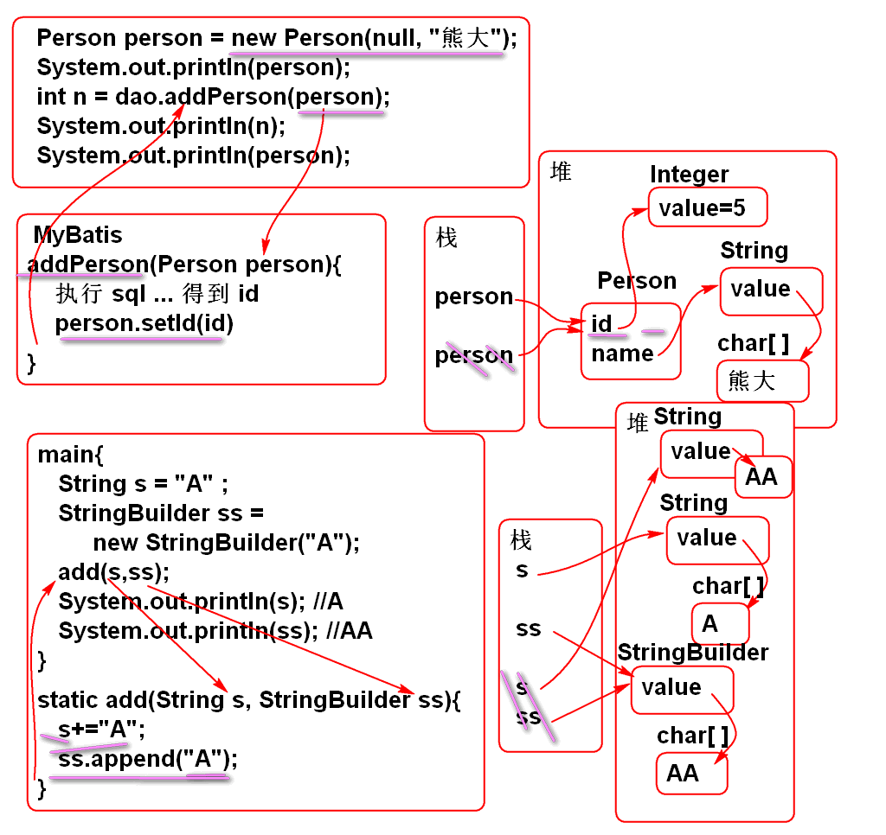
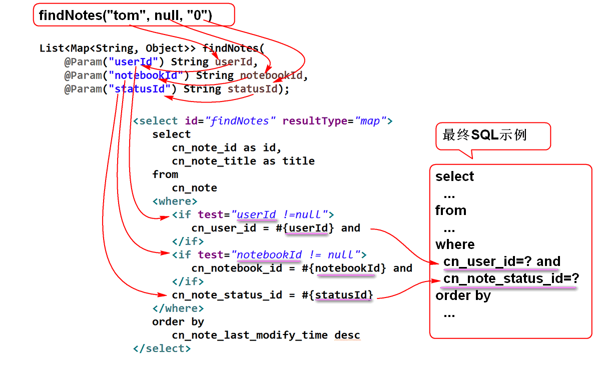
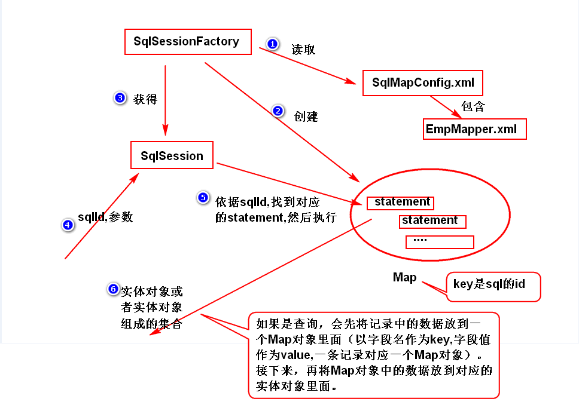

# 一. MyBatis 简介

## 1. Mybatis 简介

### 1.1. 概述

- Apache 的 `iBatis` -> Google 的 `MyBatis` -> Github 维护
- 开源的持久层框架, 底层仍然是 **jdbc**, 支持普通 SQL 查询, 存储过程和高级映射
- 封装了几乎所有的 JDBC 代码和参数的手工设置, 以及结果集的检索
- 使用简单的 **xml** 或注解来配置和定义映射关系
- 将 Java 的POJO( *Plain Old Java Objects* )映射成数据库中的记录

### 1.2. 编程步骤

1. **导依赖的包** : MyBatis 3.2.8, ojdbc14 10.2.0.4, junit 4.1.2

2. **写配置文件** : 指定连接池的配置和映射文件的位置, 一般放 resource 目录下

3. **编写实体类** : 实体类的属性名与表的字段名要一致, 忽略大小写

4. **写映射文件** : 指定 ID, 类名, sql语句

5. **访问数据库** : 调用 SqlSession 对象提供的方法来访问数据库

## 2. MyBatis体系结构

### 2.1. 加载配置

可以采用 xml 配置文件, 或是 Java 注解

MyBatis 将 SQL 的配置信息加载成 `MappedStatement` 对象

包括传入参数映射配置, 执行的 SQL 语句, 结果映射配置, 并将其存储在内存中

### 2.2. 工作原理



1. 先创建 SqlSessionFactory , 读取配置文件与映射文件中的参数信息
2. 创建预编译 Sql 语句的 PreparedStatement, 并存入 Map 中, 其中以 ID 为 key
3. 创建 SqlSession, 准备执行 sql 语句
4. 获取 sql 语句的 ID 和参数
5. 依据 ID 找到对应的 PS, 然后执行

## 3. 配置

SqlMapConfig.xml

主要的配置文件, 用于指定数据连接参数和框架参数

通常存放在 `/src/main/resources/SqlMapConfig.xml`

主要内容有两部分: 数据库连接参数, 映射文件的位置

```xml
<!DOCTYPE configuration PUBLIC "-//ibatis.apache.org//DTD Config 3.0//EN" 
	"http://ibatis.apache.org/dtd/ibatis-3-config.dtd">
<configuration>
    <!-- 配置连接参数 -->
	<environments default="environment">
		<environment id="environment">
			<transactionManager type="JDBC" />
        <dataSource type="POOLED">
            <property name="driver" value="数据库驱动"/>
            <property name="url" value="连接路径"/>
            <property name="username" value="用户名"/>
            <property name="password" value="密码"/>
        </dataSource>
		</environment>
	</environments>
    
	<!-- 指定映射文件的位置 -->
	<mappers>
		<mapper resource="entity/EmpMapper.xml" />
	</mappers>
</configuration> 
```

## 4. 基本api

1) 先创建 SqlSession

```java
String config = "SqlMapConfig.xml";
SqlSessionFactoryBuilder ssfb = new SqlSessionFactoryBuilder();
SqlSessionFactory ssf = ssfb.build(
    TestDAO.class.getClassLoader().getResourceAsStream(config)
);
session = ssf.openSession();
```

2) 执行 session 提供的方法

```java
// 查询
session.selectList(sql);
session.selectOne(sql, args);
// 插入
session.insert(sql, args);
// 修改
session.update(sql, args);
// 删除
session.delete(sql, args);
```

3) 提交事务并归还连接

```java
session.commit();
session.close();
```

# 二. SQL Mapper

## 1. mapper.xml

命名空间 

sql 语句

### 1.1. 预编译的 Statement

映射文件中, 根据 SQL 语句配置预编译的 Statement

```xml
<mapper namespace="命名空间?" >
    <!-- 有增删改查四种语句 -->
    <select id="查询方法名" parameterType="参数类型" resultType="结果类型">
        SELECT 语句
    </select>

    <insert id="插入方法名" parameterType="参数类型">
        INSERT 语句
    </insert>

    <update id="修改方法名" parameterType="参数类型">
        UPDATE 语句
    </update>

    <delete id="删除方法名" parameterType="参数类型">
        DELETE 语句
    </delete>
</mapper＞
```

## 2. mybatis 表达式



### 2.1. #{参数}

`#{}` 用于绑定SQL语句的参数, 也就是生成参数 ?, 然后利用PS执行带参数的SQL

指定参数类型为实体类时, 需要调用实体类的 get 方法获取具体参数值, 此时 MyBatis 表达式要与实体类属性同名

`＃{ 实体类属性名 }`

指定参数类型为基本类型时, 参数直接从方法参数列表获取, MyBatis 表达式中不要求与实体类属性同名

`＃{ 任意参数名 }`

```xml
<insert id="save" parameterType="entity.Employee">
    INSERT INTO t_emp VALUES(t_emp_seq.nextval,#{name},#{age})
</insert>
```

### 2.2. ${sql拼接}

`${}` 用于进行动态SQL拼接, 有SQL注入风险, 不要用来拼接用户输入.

占位符表达式, 可以在 sql 中进行占位, 允许进行 sql 拼接, 会有 sql 注入风险

```xml
<insert id="save" parameterType="entity.Employee">
    INSERT INTO ${table} VALUES(t_emp_seq.nextval,#{name},#{age})
</insert>
```

## 3. 动态 SQL

动态SQL

MyBatis 提供了灵活的动态SQL功能, 只需要使用映射文件的标签就可以到达灵活的拼接SQL语句的功能:

### 3.1. if

### 3.2. choose

### 3.2. foreach

```xml
<foreach collection="传入的参数集" item="参数集元素" open="(" separator="," close=")">
　　＃{参数集元素}
</foreach>
```



1. 持久层方法 NoteDao

   ```java
   int deleteNotes(@Param("ids") String... ids);
   ```

2. 定义SQL NoteMapper.xml

   ```xml
   <delete id="deleteNotes">
       delete from note where id in
       <foreach collection="ids" item="id" open="(" separator="," close=")">
           #{id}
       </foreach>
   </delete>
   ```

### 3.4. trim

trim 标签用于去除多余的 逗号, and 或 or

### 3.5. set

set标签用于生成 set 子句

```xml
<update id="updateNote" parameterType="entity.Note">
    update cn_note
    <set>
        <trim suffixOverrides=",">
            <if test="notebookId!=null">
                cn_notebook_id=#{notebookId},
            </if>
            <if test="userId!=null">
                cn_user_id=#{userId},
            </if>
            <if test="statusId!=null">
                cn_note_status_id=#{statusId},
            </if>
            <if test="typeId!=null">
                cn_note_type_id=#{typeId},
            </if>
            <if test="title!=null">
                cn_note_title=#{title},
            </if>
            <if test="body!=null">
                cn_note_body=#{body},
            </if>
            <if test="lastModifyTime != null">
                cn_note_last_modify_time=#{lastModifyTime}
            </if>
        </trim>
    </set>
    where cn_note_id=#{id}
</update>
```

### 3.6. where

`where`标签用于生成 where 子句, 若没有合适的条件子句则不会拼入`where`关键字

```xml
<select id="findNotes" resultType="map">
    select cn_note_id as id, cn_note_title as title
    from cn_note
    <where>
        <trim suffixOverrides="and">
            <if test="userId !=null">
                cn_user_id = #{userId} and
            </if>
            <if test="notebookId != null">
                cn_notebook_id = #{notebookId} and
            </if>
            <if test="statusId!=null">
                cn_note_status_id = #{statusId}
            </if>
        </trim>
    </where>
    order by
    cn_note_last_modify_time desc
</select>
```

### 自增id

MyBatis可以返回自动增加的ID:

  ```xml
<!-- 在插入时候读取自动生成的 ID
  打开 useGeneratedKeys="true" 可以读取自增 ID, 
设置 keyProperty="id" 告诉 MyBatis 将读取结果赋值给参数 person 对象的 id 属性 -->
<insert id="addPerson" parameterType="entity.Person" 
        useGeneratedKeys="true" keyProperty="id">
    insert into p_person(id, name )values(null, #{name})
</insert>
  ```


ID赋值原理:



## 4. mapper 映射器

### 什么是 Mapper 映射器

映射器是特殊的 java 接口(*interface*), 是 java 程序与 mapper.xml 之间的桥梁.

获取该映射器的实例后, 根据其方法名(与mapper.xml 中sql id一致)找到对应的映射关系, 从而执行 sql 操作

- 接口名通常被用作映射文件的命名空间
- 其中的抽象方法, 根据映射文件的具体关系决定:
  - 方法名 = 映射ID,
  - 方法参数 = 映射参数 parameterType
  - 方法返回值 = 映射返回值 resultType

```java
public interface EmployeeDAO {
    public void save(Employee e);
    public List<Employee> findAll();
    public Employee findById(int id);
    public void modify(Employee e);
    public void delete(int id);
    public Map findById2(int id);
    public Emp findById3(int id);
}
```

### 使用方法

1. 创建一个接口( *interface* ), 作为 Mapper 映射器

2. 创建映射文件( xml ), 命名空间为 Mapper 映射器的名字

3. 在映射文件中建立映射关系, 指定id, 参数类型, 返回值类型

4. 在 Mapper 映射器接口中, 添加与映射文件对应的抽象方法

5. 在业务层, 从 SQLSession 中获取映射器的实例

   ```java
   sqlsession.getMapper(映射器.class)
   ```

6. 通过映射器实例, 调用方法实现 sql 操作

   ```java
   public class TestDAO {
       private SqlSession session;
       private EmployeeDAO dao;
       
       @Before
       public void init(){
           String config = "SqlMapConfig.xml";
           SqlSessionFactoryBuilder ssfb = new SqlSessionFactoryBuilder();
           SqlSessionFactory ssf = ssfb.build(TestDAO.class.getClassLoader().getResourceAsStream(config));
           session = ssf.openSession();
           // MyBatis 会返回一个符合 Mapper 映射器要求的对象
           dao = session.getMapper(EmployeeDAO.class);
       }
       
       @Test // 根据 id 查询 , 返回 Map
       public void test6(){
           Map e = dao.findById2(21);
           System.out.println(e);
           session.close();
       }
       @Test // 根据 id 查询 , 利用别名
       public void test7(){
           Emp e = dao.findById3(21);
           System.out.println(e);
           session.close();
       }
   }
   ```

## 5. 多参数查询

在MyBatis中, 利用 `@Param` 注解, 可以实现多参数查询



案例:
1. NoteDao接口

   ```java
   List<Map<String, Object>> findNotes(
       @Param("userId") String userId,
       @Param("notebookId") String notebookId,
       @Param("statusId") String statusId);
   ```

2. SQL 语句: NoteMapper.xml

   ```xml
   <select id="findNotes" resultType="map">
       select id, title from note
       <where>
           <if test="userId !=null">
               user_id = #{userId} and
           </if>
           <if test="notebookId != null">
               notebook_id = #{notebookId} and
           </if>
           note_status_id = #{statusId}
       </where>
       order by last_modify_time desc
   </select>
   ```
# 三. 结果映射

## 1. Map 或简单实体

Mabatis 可以将一条记录中的数据存放到一个 Map 对象里, 以字段名为 key, 以字段值为 value, 直接返回.

如果要求返回一个实体, 且查询结果集的字段都能直接对应到这个实体的属性, 则 mybatis 可以 map 中取数据, 封装到对应的实体属性中去, 然后返回该实体对象.



优点: 不用编写实体类, 对于字段数量太多的表较为方便

缺点: 要调用 Map 提供的 get 方法获取值

## 2. 使用 ResultMap

使用 resultMap 可以解决复杂的映射, 如字段名-实体类属性的映射, 封装对象/集合等。

```xml
<resultMap type="entity.Emp" id="empResultMap">
    <result property="empNo" column="id"/>
    <result property="ename" column="name"/>
</resultMap>
<select id="findById3" parameterType="int" resultMap="empResultMap">
    SELECT * FROM t_emp WHERE id = #{id}
</select
```

 MyBatis 不自动支持复杂的映射关联 , 复杂的关联关系必须使用 resultMap 进行手动映射 .

### 2.1. 普通属性映射

> `<result column="结果集列名" property="实体属性"/>`

复杂映射的 resultMap 映射

复杂映射, 必须使用 resultMap 处理

各个字段逐一映射到每个属性, 其中 property 对应实体类的属性, column 对应数据库中的字段名

1) 主键映射

其中主键使用 id 元素映射

2) 普通类型映射

普通类型属性使用 result 元素映射

```xml
<mapper namespace="cn.tedu.note.dao.PostDao">
    <!-- 复杂映射必须使用 resultMap 进行处理 -->
    <resultMap type="cn.tedu.note.entity.Post" id="postMap">
        <id column="id" property="id"/>
        <result column="title" property="title"/>
    </resultMap>
    <select id="findPostById" parameterType="int" resultMap="postMap">
        select id,title,person_id from p_post where id=#{id}
    </select>
</mapper>
```

### 2.2. association

如果结果实体中的某个属性是一个子对象(封装了结果集中的多个字段), 则可以用 `association` 标签将查询结果映射到该子对象的各个属性.

```xml
<mapper namespace="dao.PostDao">
    <resultMap type="entity.Post" id="postMap">
        <id column="id" property="id"/>
        <result column="title" property="title"/>
        <!-- 使用 association( 关联 ) 映射子对象的属性 -->
        <association property="person" javaType="entity.Person">
            <id column="person_id" property="id"/>
            <result column="name" property="name"/>
        </association>
    </resultMap>

    <select id="findPostById" parameterType="int" resultMap="postMap">
        select p_post.id, title, person_id, p.name
        from p_post
        left outer join p_person p on p.id=person_id
        where p_post.id=#{id}
    </select>
</mapper>
```

### 2.3. collection

如果结果实体中的某个属性是一个集合(集合元素可以是基本类型或引用类型), 则可以用`collection` 标签将相应的字段封装到该集合属性中. 

首先利用`collection`表示将`comments`属性委托到SQL查询 `findCommentsByPostId` , 再定义SQL查询
`findCommentsByPostId`, 将`comment`属性的数据查询并且映射到`Comment`对象.

有两种方式:

- 直接在主 sql 中查出所有数据, mybatis 自动将部分字段封装为集合
- 主 sql 只查询基本属性, 集合属性委托给另一个子查询sql

> `<collection property="要映射的属性" select="子查询语句" column="传递给子查询的参数"/>`

```xml
<mapper namespace="dao.PostDao">
    <resultMap type="entity.Post" id="postMap">
        <id column="id" property="id"/>
        <result column="title" property="title"/>
        <association property="person" javaType="entity.Person">
            <id column="person_id" property="id"/>
            <result column="name" property="name"/>
        </association>
        <!-- 属性是一个集合 , 使用 collection 进行 映射处理 , 其中 column="id" 是查询参数 -->
        <collection property="comments" select="findCommentsByPostId" column="id">
        </collection>
    </resultMap>

    <select id="findCommentsByPostId" parameterType="int" resultType="entity.Comment">
        select id, title
        from p_comment
        where post_id=#{id}
    </select>
    <select id="findPostById" parameterType="int" resultMap="postMap">
        select p_post.id, title, person_id, p.name
        from p_post left outer join p_person p on p.id=person_id
        where p_post.id=#{id}
    </select>
</mapper>
```

# 四. 框架集成

## 1. 与 Spring 集成

1. 导入依赖包

   ```
   spring-webmvc,mybatis,mybatis-spring,
   dbcp,ojdbc,spring-jdbc,junit 
   ```

2. 不需要 MyBatis 的配置文件, 直接在 spring 配置文件添加以下配置

   1.  `SqlSessionFactory`, 配置数据库连接参数
   2.  `MapperScannerConfigurer`, 指定包名以扫描 Mapper 映射器, 并添加到 spring 容器.

   ```xml
   <!-- 配置连接池 -->
   <bean id="ds" class="org.apache.commons.dbcp.BasicDataSource" destroy-method="close">
       <property name="driverClassName" value="#{db.driver}" />
       <property name="url" value="#{db.url}" />
       <property name="username" value="#{db.user}" />
       <property name="password" value="#{db.pwd}" />
   </bean>
   
   <!-- 配置SqlSessionFactoryBean -->
   <bean class="org.mybatis.spring.SqlSessionFactoryBean">
       <!-- 注入连接池 -->
       <property name="dataSource" ref="ds"/>
       <!-- 注入映射文件的位置 -->
       <property name="mapperLocations" value="classpath:entity/*.xml"/>
   </bean>
   
   <!-- 配置MapperScannerConfigurer -->
   <bean class="org.mybatis.spring.mapper.MapperScannerConfigurer">
       <!-- 注入映射器所在的包名 -->
       <property name="basePackage" value="dao"/>
       <!-- 只扫描带有特定注解的接口 -->
       <property name="annotationClass" value="自定义注解"/>	
   </bean>
   ```

3. 编写实体类, Mapper 映射器, mapper.xml

## 2. 与 Spring 集成2

不配置 Mapper 映射器(*interface*), 直接通过 `namaspace.methodId` 指定要执行的 sql, 而这个 `namespace.MethodId` 是String 类型, 编译器无法检验, 类型不安全. 

同时 `SqlSessionTemplate ` 的方法对于参数的支持不够灵活, 因此不建议使用

1. 导包。

   ```
   spring-webmvc,mybatis,mybatis-spring,
   dbcp,ojdbc,spring-jdbc,junit 。
   ```

2. 不需要 MyBatis 的配置文件, 直接在 spring 配置文件添加以下配置

   1.  `SqlSessionFactory`, 配置数据库连接参数
   2.  `SqlSessionTemplate`

   ```xml
   <!-- 配置SqlSessionFactoryBean -->
   <bean id="ssfb" class="org.mybatis.spring.SqlSessionFactoryBean">
       <!-- 注入连接池 -->
       <property name="dataSource" ref="ds"/>
       <!-- 注入映射文件的位置 -->
       <property name="mapperLocations"value="classpath:entity/*.xml"/>
   </bean>
   
   <!-- 配置SqlSessionTemplate -->
   <bean id="sst" class="org.mybatis.spring.SqlSessionTemplate">
       <constructor-arg index="0" ref="ssfb"/>
   </bean>
   ```

3. 实体类

4. 映射文件(xml), namespace 可以任意指定。

   ```xml
   <mapper namespace="dao.EmployeeDAO">
       <insert id="save" parameterType="entity.Employee">
           INSERT INTO t_emp VALUES(t_emp_seq.nextval,#{name},#{age})
       </insert>
       <select id="findAll" resultType="entity.Employee">
           SELECT * FROM t_emp
       </select>
   </mapper>
   ```

5. 写一个 java 类作为 dao 层, 注入 SqlSessionTemplate 。

6. dao 层方法调用 `SqlSessionTemplate`  的方法, 通过 mapper.xml 的 `namespace.方法Id` 指定要执行的 sql

   ```java
   @Repository("empDAO")
   public class EmployeeDAO{
   
       @Autowired
       private SqlSessionTemplate sst;
   
       public void save(Employee e) {
           sst.insert("dao.EmployeeDAO.save",e);	
       }
       
       public List<Employee> findAll() {
           return sst.selectList("dao.EmployeeDAO.findAll");
       }
   }
   ```

## 3. 与 SpringBoot 集成

1. 依赖

   ```xml
   <dependency>
       <groupId>org.mybatis.spring.boot</groupId>
       <artifactId>mybatis-spring-boot-starter</artifactId>
   </dependency>
   ```

2. application.yml, 指定配置文件和 mapper.xml 的路径

   ```yaml
   mybatis:
       configLocation: classpath:mybatis/mybatis-config.xml
       mapperLocations: classpath:mybatis/mapper/*Mapper.xml
       typeAliasesPackage: com.luojbin.mybatis
   ```

3. 添加注解, 扫描映射器(interface)

   ```java
   @MapperScan("com.luojbin.mybatis.mapper")
   ```

# 五. 扩展

## 1. 插件


