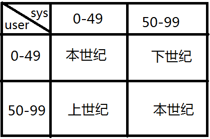

# █ SQL 语句
**SQL**：结构化查询语句，是用来操作数据库的语言, 所有的数据库都支持标准的SQL语句

SQL 语句包括

 1. **DDL** —— 数据定义语言
 2. **DML** —— 数据操纵语言
 3. **TCL** —— 事务控制语言
 4. **DQL** —— 数据查询语言
 5. **DCL** —— 数据控制语言

SQL语句不区分大小写，但字符串的值（直接量）要使用单引号括起来，区分大小写

# 一. DDL 数据定义语言
DDL 语句, 用于增删改数据库对象：表，视图，索引，序列

### 1. 创建表
> create table 表名 (字段 字段属性);

```sql
create table emp（
  id number(4),
  name varchar2(20),
  gender char(1),
  birth date,
  salary number(6,2),
  job varchar2(30),
  deptno number(2)
);
```

#### 1.1. 默认值 default
数据库中的所有数据类型的默认值都是null，在创建表时可以使用 default 字段单独指定默认值

> 字段 字段属性 default 默认值

```sql
create table emp_default(
  id number(4),
  name varchar2(20),
  gender char(1) default 'M',
  birth date,
  salary number(6,2) default 5000,
  job varchar2(30) default 'CLERK',
  deptno number(2)
);
```

#### 1.2. 非空约束 not null
当一个字段被 `not null` 修饰后，该字段在任何情况下值不能为 null

```sql
create table emp_not_null(
    id number(4),
    name varchar2(20) not null,
    gender char(1) default 'M',
    birth date,
    salary number(6,2) default 5000,
    job varchar2(30) default 'CLERK',
    deptno number(2)
);
```

### 2. 查询表的结构
> desc 表名

```sql
desc emp;
desc emp_default;
-- 非空约束可以在查看表结构的时候体现出来
desc emp_not_null;
```

### 3. 删除表
> drop table 表名

```sql
drop table emp;
```

### 4. 清空表
清空表可以使用 DML 的 `delete` 语句, 该操作受事务控制, 需要 commit 提交

还可以使用 DDL 中的 `truncate` 语句, 该操作不受事务控制, 无法撤销, 效率更高

> truncate table 表名

```mssql
truncate table emp;
```

### 5. 修改表

#### 5.1. 添加新字段
> alter table 表名 **add** (新字段 字段属性)

```sql
-- 向表中添加字段hiredate
alter table luojbin add(hiredate date);
desc luojbin;
```

对于 Mysql, 新增一个字段的时候可以指定字段位置, 不能加括号
> alter table 表名 **add** 新字段 字段属性 first;
>
> alter table 表名 **add** 新字段 字段属性 **after** 原有字段名;

```sql
alter table sss add age4 int first;
alter table sss add age5 int after age4;
```

#### 5.2. 删除表中现有字段
Oracle 支持一次删除多个字段, 用括号括起来并用逗号分隔. 

Mysql 一次只能删除一个字段

> alter table 表名 **drop** (字段)

```sql
-- 将表中的 hiredate 字段删除
alter table luojbin drop (hiredate);
desc luojbin;
```

#### 5.3. 修改字段名
Oracle 使用 rename column 子句修改字段名
> alter table 表名 **rename column** 旧列名 to 新列名

```sql
alter table emp rename column enmno to empno;
```

Mysql 使用 change 字句修改字段名, 可同时修改列属性, 会将原有数据自动转换
> alter table 表名 **change** 原列名 新列名 列属性


#### 5.4. 修改字段属性
修改字段可以修改字段的类型，长度，默认值，非空约束

但是表中若已存在数据，那么修改字段的时候尽量不修改类型

若修改长度尽量不要缩小，否则可能导致修改失败

> alter table 表名 **modify** (列名 新属性)

```sql
alter table luojbin modify(job varchar2(36) default 'ASSHOLE');
desc luojbin ;
```

#### 5.5 修改表名
> alter table 表名 **rename** to 新表名

```sql
alter TABLE emp rename to lyf;
```

Oracle 数据库还支持直接使用 rename 语句修改表名

> **rename** 原表名 to 新表名

```plsql
rename emp to luojbin;
```

# 二. DML 数据操纵语言

DML语句用来对表中数据进行相关操作, 包括：增，改，删

### 1. 增加记录
#### 1) 插入单条记录
若不指定插入字段，则要按照定义表时的字段顺序输入所有字段的值(全列插入)
> **insert into** 表名 (要插入的字段) **values** (要插入的字段的值)
>
> **insert into** 表名 **values** (按字段定义顺序指定插入值)

```sql
-- 在表中插入一行数据
INSERT INTO luojbin (ID,NAME,salary,deptno) VALUES (1,'luojbin',5000,10);
INSERT INTO luojbin (ID,NAME,salary,deptno) VALUES (2,'mayssong',6000,2);

-- 若不指定插入字段，则要按照表头顺序输入所有字段的值(全列插入)
INSERT INTO luojbin VALUES (1,'jack','M',SYSDATE,5000,'manager',1);
```

#### 2) 插入多条记录

插入多条记录时, 只需要在 `values` 子句中列出每一行的数据, 用逗号隔开

> insert into 表名 (字段列表) values **(第一行数值), (第二行数值), (第三行数值)**...
>
> insert into 表名 values **(第一行数值), (第二行数值), (第三行数值)**...

```sql
INSERT INTO luojbin (ID,NAME,salary,deptno) VALUES 
(1,'luojbin',5000,10),
(2,'mayssong',6000,2),
(3,'edison',7000,3);
```

#### 3) 插入子查询结果

插入数据时, 可以使用子查询, 将结果集作为一个子表, 一次性插入多条数据
其中要求子查询的字段排列与目标表一样.

> insert into 表名 **( 子查询 )**

```sql
-- 向 t_score 表中插入一些记录，这些记录要求符合以下条件：
--     1. 该同学没有上过编号“3”课程、
--     2. 这些同学的3号课成绩设为2号课的平均成绩；
--     3. t_score 表结构为 (sid, cid, score)
    
-- 1) 找出选了三号课的同学
select sid from t_score sc where cid = 3;

-- 2) 2号课的平均成绩
select avg(score) av2 from t_score group by cid having cid=2;

-- 3) 插入满足上述条件的记录
insert into t_score(
    select  sid,3,(Select avg(score) from t_score where cid = 2) 
    from students
    where sid not in (Select sid from t_score where cid = 3)
);
```

### 2. 修改记录
`update`语句用于修改表中数据，需要使用`where`添加条件以筛选满足条件的记录

若不添加`where`则是全表所有数据修改，修改多个字段用逗号隔开

> **update** 表名 set  字段1=值1, 字段2=值2, 字段3=值3 **where** 条件

```sql
-- 修改数据
update luojbin set job = 'teacher',salary= 6000 where name = 'luojbin';
```

### 3. 删除记录
`delete`语句用于删除表中记录，通常需要使用`where`添加条件来删除满足条件的记录

若不添加`where`是清空表中所有数据，清空表还可以使用DDL中的`TRUNCATE`语句

> **delete from** 表名 where 条件

```sql
-- 删除表中数据
delete from luojbin where name = 'luffy';
```

# 三. DQL 数据查询语言
DQL语句用于查询数据库中的数据

## 1. 基本查询

### 1.1. 基本查询语句
> **select** 字段 **from** 表名 **where** 条件

#### 1) SELECT ：
用来指定要查询的字段, 多个字段时用逗号隔开, 星号* 为通配符，表示查找表中的所有字段

查询的字段可以是表中的字段，函数和表达式

查询结果的字段以查询语句中顺序排列，不按表中的原有顺序

#### 2) FROM：
指定数据来源的表
```sql
select * from emp;
select job,ename,sal from emp;
```

可以使用伪表 `dual`: 伪表用来满足语法要求，实际上并不存在, 在 from 语句中使用

```sql
-- Oracle
select sysdate from dual;
```

MySQL 支持单独查询, 可以不添加伪表 `dual`

```sql
-- MySQL
select sysdate();
```


#### 3) WHERE：
用来指定匹配条件，不指定则是查询全表
```sql
select ename, job, sal, deptno from emp where deptno = 20;
select ename, job, sal, deptno from emp where sal >= 3000;
select ename, job, sal*12, deptno from emp where sal >= 3000;
```

### 1.2. 字符串操作函数
#### 1) 使用 CONCAT 连接字段
用来连接字段输出.

Oracle 中只能连接两个，如果需要连接多个字段，则嵌套使用.

Mysql 中无此限制, 可以直接连接多个字段

> CONCAT(字段1，字段2)


```sql
select concat(ename,sal) from emp;

-- Oracle, 嵌套使用以连接多个字段
select concat(concat(ename,'，'),sal) from emp;

-- Mysql, 直接连接多个字段
select concat(ename,',',sal) from emp;
```

#### 2) 使用 || 连接字段字符串
Oracle 中双竖线可用来连接多个字段字符串
> 字段1 || 字段2 || 字段3

```sql
select ename||','||job||','||sal from emp;
```

Mysql 中双竖线表示逻辑或, 当任意字段有值时为1, 全部字段无值时为0.

Mysql 中不能使用双竖线连接字符串

#### 3) 使用 LENGTH 统计字符串长度
返回指定字符串的长度, Oracle, Mysql 通用
> LENGTH(CHAR)

```sql
select ename,length(ename) from emp;
```

#### 4) 大小写转换
将字符串转换成大写、小写、首字母大写, MySQL 不提供首字母大写的函数
> upper(字段) —— 全大写, Oracle, Mysql
> lower(字段) —— 全小写, Oracle, Mysql
> initcap(字段) —— 首字母大写, Oracle

```plsql
select ename, upper(ename) from emp;
select ename, lower(ename) from emp;
select ename, initcap(ename) from emp;
select ename, job, sal from emp where upper(ename)=upper('scoTT');
```

#### 5) TRIM
去除两端的指定子字符串, 默认去除空格

Oracle 中截去集只能是单个字符.

MySQL 中截去集可以是一个字符串, 即有序的多个字符.

> 去除两端的空格: trim(原字符串)
>
> 去除前导子字符串: trim(**leading** '子字符串' from '原字符串')
>
> 去除后缀子字符串: trim(**trailing** '子字符串' from '原字符串')
>
> 去除两端子字符串: trim(**both** '子字符串' from '原字符串')
>
> 去除两端子字符串: trim('子字符串' from '原字符串')

```sql
-- Oracle
select trim('e' from 'eecutee') from dual;		-- cut

-- Mysql
select trim('ec' from 'ececutee') from dual;	-- utee
select trim(both 'ab' from 'ababavaabab');		-- ava
```

#### 6) LTRIM,RTRIM
Oracle 使用 LTRIM,RTRIM 的时候，截去多个字符，类似于正则表达式的`[字符集]*`，
> LTRIM(原字符串，截去字符集)
>
> RTRIM(原字符串，截去字符集)

```sql
-- Oracle
select ltrim('eessdsdcutee','eds') from dual; -- 'cutee'
select rtrim('eessdscutee','eds') from dual;  -- 'eessdscut'
```

MySQL 中, LTRIM,RTRIM 只能用于去除两端的空白, 不能指定截去字符集
> LTRIM(原字符串)
> RTRIM(原字符串)

```sql
-- MySQL
select ltrim('   abcd ') from dual; 	-- 'abcd '
select rtrim('cut   ') from dual;		-- 'cut'
```

#### 7) LPAD,RPAD 补位显示
指定该字段的显示位数，不足的以补位符补齐，若位数超出, 只取左边的部分

Oracle 中补位符可以省略, 默认为空格.

MySQL 中补位符不能省略, 必须指定.

> **LPAD**( 原字符串，显示位数 [，补位符(默认空格) ] ) —— 左补位，右对齐
> **RPAD**( 原字符串，显示位数 [，补位符(默认空格) ] ) —— 右补位，左对齐

```sql
-- Oracle
select ename,lpad(ename,6) from emp;		-- 左边补位
select ename,rpad(ename,3) from emp;		-- 截取左侧

-- Oracle, MySQL
select ename,lpad(ename,3,'-') from emp;	-- 截取左侧
```

#### 8) SUBSTR 截取子串
截取指定字符串的子串，从起始下标m开始截取n个字符，若不指定n，则截取到末尾

数据库中下标从1开始，负数表示从右边开始数(倒数)

Oracle, MySQL 通用

> SUBSTR(原字符串，起始下标m [，子串长度n ] )

```sql
select ename,substr(ename,2,4) from emp;
```

#### 9) INSTR 子串下标
类似于java中的`indexOf`，查找目标字符串在原字符串中的下标

在 Oracle 中, 可以指定起始下标和出现次数.

若指定起始下标m，则从起始下标开始找

若指定次数n，则是从起始下标开始，第n次出现的那个下标

> INSTR ( 原字符串，要查找的字符串 [，起始下标m [，出现次数n] ] )

```sql
-- Oracle
select instr('helloworld helloworld hello','hello',-1)from dual;
```

在 MySQL 中, 只能查找第一次出现的位置, 不能指定起始下标和出现次数
> INSTR ( 原字符串，要查找的字符串)

```sql
-- MySQL
select instr('helloworld helloworld hello','hello') from dual;
```

### 1.3. 数字操作函数
#### 1) ROUND 四舍五入
对数字n四舍五入，保留小数点后m位

若 m 为 0 或不写，则保留到各位

若是负数则保留到十位以上的位

> ROUND(数值n,保留小数位m)

```sql
-- round四舍五入
select round(456.789,2) from dual;	--	456.79
select round(456.789,1) from dual;	--	456.8
select round(456.789,0) from dual;	--	457
select round(456.789,-1) from dual;	--	460
```

#### 2) trunc 抹零舍去
对数值n进行抹零舍去，把m的零头都舍去, 仅 Oracle 可用.

MySQL 中没有 trunc 函数, 替代实现未知.

> TRUNC(数值n,保留小数位m)

```sql
select trunc(456.789,2) from dual;	--	456.78
select trunc(456.789,1) from dual;	--	456.78
select trunc(456.789,0) from dual;	--	456.78
select trunc(456.789,-1) from dual;	--	450
```

#### 3) mod 求余
求余数.

Oracle 中, 若除数 m 为零则返回 n 本身

MySQL 中, 若除数 m 为零则返回 null

> MOD(数值 n，除数 m)

```sql
select mod(5,2) from dual;	--	1
select mod(4,2) from dual;	--	0
select mod(3,2) from dual;	--	1

-- Oracle
select mod(3,0) from dual;	--	3，返回n本身

-- MySQL
select mod(3,0) from dual;	--	null
```

#### 4) 取整函数
 - **Ceil 向上取整**

   ceil 向上取整，取大于n的最小整数

   > CEIL(数值n)

   ```sql
   select ceil(-3.5) from dual;	--	(-3)
   select ceil(3.2) from dual;		--	4
   select ceil(0.5) from dual;		--	1
   ```

 - **Floor  向下取整**

   floor 向下取整，取小于n的最大整数

   > FLOOR(数值n)

   ```sql
   select floor(-3.5) from dual;	--	(-4)
   select floor(3.2) from dual;	--	3
   select floor(0.5) from dual;	--	0
   ```

### 1.4. 时间操作函数

#### 1) DATE
时间类型，7个字节，表示：**世纪 年 月 日 时 分 秒**，精确到秒

#### 2) TIMESTAMP
时间戳类型，11个字节，前7个字节与DATE相同，后4个字节表示更精确的时间分度，精确到纳秒

- **Oracle** 提供两个常用的关键字，获取当前系统时间

  > **sysdate**: 对应数据库一个内置函数，返回一个date类型数据，表示当前系统时间
  >
  > **systimestamp**: 对应数据库一个内置函数，返回一个timestamp类型，表示当前系统时间

  ```sql
  -- Oracle
  select sysdate from dual;
  select systimestamp from dual;
  ```

- **MySQL** 中也提供了相关的日期时间函数

	> **now**(): 获取当前时间, 执行开始时就获得值, 建议使用
	>
	> sysdate(): 动态获取实时时间, 同一语句中都有可能存在区别
>
	> `current_timestamp(), current_time(), localtime()` 等等

	```sql
	-- MySQL
	select sysdate() from dual;
	select now() from dual;
	```


#### 3) to_date() 字符串转date
类似 JAVA 的 SimpleDateFormat，按照给定的日期格式，把字符串转换成 date 类型

- **Oracle** 中提供了 to_date() 函数, 实现字符串转成 date 类型的数值.

  **YY--MM--DD--HH24--MI--SS
  年----月----日------时----分--秒**

  格式字符串中，除了特定字母和符号，都用双引号括起来

  > to_date('时间字符串','格式字符串')

  ```sql
  -- 普通写法
  select to_date('2009-11-03 15:32:35',
  	'YYYY-MM-DD HH24:MI:SS')from dual;
  
  -- 带双引号的中文写法
  select to_date('2009年11月03日 15时32分35秒',
  	'YYYY"年"MM"月"DD"日" HH24"时"MI"分"SS"秒"')from dual;
  ```

- **MySQL** 中, 使用 `str_to_date()` 函数代替 to_date()
但格式字符串相应规定有所不同, 且中文字符不需加双引号

		%Y：4位的年份
		%y：2位的年份
		%m：月份, 格式为(01……12) 
		%c：月份, 格式为(1……12)
		%d：天数, 格式为(00……31) 
		%e：天数, 格式为(0……31) 
		
		%r：时间,格式为12 小时(hh:mm:ss [AP]M) 
		%T：时间,格式为24 小时(hh:mm:ss) 
		
		%H：小时,格式为(00……23) 
		%h：小时,格式为(01……12) 
		%i：分钟,格式为(00……59) 
		%S：秒,格式为(00……59) 
		%s：秒,格式为(00……59) 

	> `str_to_date('日期字符串', '格式字符串')`

	```sql
	select str_to_date('2009-11-03','%Y-%m-%d');
	select str_to_date('70年07月03日 15:06', '%y年%m月%d日 %H:%i');
	```

#### 4) date 转字符串
可以将date按照给定的日期格式转换为字符串

- Oracle 使用 to_char() 函数实现
	> to_char(date,'格式字符串')

	```sql
select to_char(sysdate,'YYYY"年"MM"月"DD"日" HH24"时"MI"分"SS"秒"') from dual;
	```
	
- MySQL 使用 date_format() 函数实现
	
	> date_format(日期, '格式字符串')

	```sql
	select hiredate, date_format(hiredate,'%y年%m月') 
	```

#### 5) 2位年份的具体年份

- Oracle

  使用RR表示年份时系统根据用户输入与当前时间综合判断具体的年份

  1. 当前时间为2017年，用户输入49年，则判断为本世纪的49年，2049年
  2. 当前时间为2017年，用户输入98年，则判断为上世纪的98年，1998年

  

  ```sql
  select to_char(to_date('49-11-03 15:32:35','RR-MM-DD HH24:MI:SS'),
  	'YYYY-MM-DD HH24:MI:SS')from dual; //2049
  
  select to_char(to_date('98-11-03 15:32:35','RR-MM-DD HH24:MI:SS'),
  	'YYYY-MM-DD HH24:MI:SS')from dual; //1998
  ```

- MySQL

  MySQL 中, 2位年份的范围是 1970-2069

### 1.5. 计算日期
以下方法仅针对于 Oracle, MySQL 有自己的一套日期计算方法
#### 1) 日期加减
对一个日期加减一个数字等同于加减天数
> DATE + 数字

两个日期做减法，差为相差的天数
> DATE1 - DATE2

```sql
select to_char(sysdate+1,'YYYY-MM-DD') from dual;
select ename,sysdate-hiredate from emp;
```

#### 2) 某月最后一天
查看给定日期所在月的月底日期
> LAST_DAY( DATE )

```sql
select last_day(sysdate-60) from dual;
```

#### 3) 数月之后的日期
计算给定日期i个月后的日期
> ADD_MONTHS( DATE,i )

```sql
查看员工转正日期（就职日期三个月后）
select ename,add_months(hiredate, 3) from emp;
```

#### 4) 计算相差的月数
查看两个日期之间相差的月份
> MONTHS_BETWEEN( DATE1，DATE2 )

```plsql
查看员工工作月数
select ename,trunc(months_between(sysdate,hiredate),0)/12 from emp;
```

#### 5) 下一个周几
返回给定日期的第二天开始，一周以内的周几的日期
> NEXT_DAY(日期，周几)

```plsql
select next_day(sysdate,4) from dual;-- 从明天开始找周三
select next_day(sysdate,5) from dual;-- 从明天开始找周四
```

#### 6) 比较函数
- 比较给定数据中的最值，要求数据类型一致，若不一致会以第一个数据为准进行转换，转换失败则报错
- Oracle, MySQL 通用

##### 求最小值
> LEAST(数据1，数据2，数据3……)

##### 求最大值
> GREATEST(数据1，数据2，数据3……)

```plsql
-- Oracle, MySQL
-- 日期比较
select least(sysdate,to_date('1998-08-06','YYYY-MM-DD'))from dual;
select greatest(sysdate,to_date('1998-08-06','YYYY-MM-DD'))from dual;

-- 数字比较
select least(1,3,2) from dual;
select greatest(2,5,4) from dual;
```

#### 7) 提取字段
- 从数据中提取某个字段
- Oracle, MySQL 通用

> EXTRACT(字段 from 数据)

```plsql
-- 提取当前年份
select extract(year from sysdate)from dual;
-- 提取月份用作筛选条件
select ename,hiredate from emp where extract(month from hiredate)=04;
```

### 1.6. NULL操作
#### 1) NULL的设置
- **隐式插null**
  给表中插入数据记录时，可以只指定部分字段，此时则只需提供相应字段的值，未指定的字段自动插null	

  ```sql
  insert into student (id,name) values (1002,'张无忌');	
  ```

- **显式插null**
  不指定字段则必须写全字段数值，指明哪些字段要设为null，系统不会自动(隐式)插null

  ```sql
  insert into student values (1001,'林平之',null);	
  ```

- **修改为NULL**
  表中未规定为 not null 的字段，可以通过DML语句设置为NULL 

  ```sql
  update student set gender=null where id = 1000;
  ```

- **MySQL 自增类型插null**
MySQL 的数据表主键, 若使用自增类型, 则要在全字段插入的时候, 主键位置用null表示.
	
  ```sql
  CREATE TABLE employee99(
      id INT(4) AUTO_INCREMENT primary key,
      name VARCHAR(20)
  );
  insert into employee99 values (null, 'demo');
  ```

#### 2) NULL的判断
- NULL是一种状态，不是一个具体的值，**不能用字段 = null**来作为筛选条件
NULL要使用 is NULL 来作为筛选条件
- Oracle, MySQL 通用
> 字段 is null

```sql
-- Oracle, MySQL
delete from STUDENT where GENDER=null;	-- 错误
delete from student where gender is null;
```

#### 3) NULL的运算
Oracle: null与字符串连接等于什么都没干，还是原来的字符串
MySQL: 双竖线不是字符串连接, 具体运算规律不详

```sql
-- Oracle
select ename,job,ename||null from emp; -- 原来的ename

-- MySQL
select ename,job,1||null from emp; -- 1
select ename,job,0||null from emp; -- null
select ename,job,ename||null from emp; -- null
select ename,job,ename||job from emp; -- 0
select ename,job,1||0 from emp; -- 1
select ename,job,1||1 from emp; -- 1
select ename,job,0||0 from emp; -- 0
```


null与数字运算，结果得到null，即数字被丢弃了

```sql
select ename,sal,comm,sal+comm from emp; -- 得到null
```

#### 4) 空值函数
- **Oracle**

  - **NVL**

    函数意义，将null值替换为非null值

    当arg1为null时，函数返回arg2的值，否则返回arg1自身

    类似于JAVA中的三目运算符，**arg1非NULL ？ arg1 ： arg2**；

    > NVL ( arg1, arg2 )

    ```plsql
    select ename,sal,comm,sal+nvl(comm,0) from emp;
    select ename,sal,comm,nvl(comm,0)||'有绩效'from emp;
    ```
  - **NVL2**

    函数意义，根据是否为null，返回不同的值

    类似于JAVA中的三目运算符，**arg1非NULL ？ arg2 ： arg3**；

    当arg1不为null时，返回arg2

    当arg1为null时，返回arg3

    > NVL2 ( arg1, arg2, arg3 )

    ```plsql
    select ename,sal,comm,nvl2(comm,'有绩效','没有绩效')from emp;	
    ```

- **MySQL**

	- **ifnull**
	
	  同 Oracle 的 NVL 函数, 可以将 null 值替换为非 null 值.

	  > ifnull(arg1, arg2)
	
	  ```mysql
	  select ename,sal,comm,sal+ifnull(comm,0) from emp;
	  ```
	
	- **if**
	
	  MySQL 中没有 NVL2 函数, 可以通过 if 函数来实现
	
	  > if(arg1 is null, null时返回值, 非null时返回值);
	
	  ```mysql
	  select if('333' is null, '是null', '不是null');	
	  ```

## 2. 条件查询

- where语句过滤
- 结果集统计操作
- 关联查询

### 2.1. where 条件查询

#### 1) where条件中使用表达式和函数
where查询条件中可以使用表达式或函数

```sql
select ename,sal,sal*12 from emp where sal*12>50000;
select ename,sal from emp where ename = upper('scott');
```

#### 2) 数字比较符
> `>`, `<`, `>=`, `<=`, `!=`, `<>`, `=`

```sql
select * from emp;
select ename,sal from emp where sal<2000;
select ename,sal,job from emp where deptno<>10;
select ename,sal,hiredate from emp where hiredate>to_date('1982-1-1','yyyy-mm-dd');
select ename,sal from emp where sal<>3000;
select ename,sal from emp where sal!=3000;
```

#### 3) 逻辑运算符 AND OR
AND的优先级高于OR，建议在优先运算的部分加上括号，提高可读性
> WHERE 条件1 **AND** 条件2
>
> WHERE 条件1 **OR** 条件2

```sql
select ename,sal,job from emp where sal>1000 and job='CLERK';
select ename,sal,job from emp where sal>1000 or job='CLERK'
select ename,sal,job from emp where sal>1000 or job='CLERK' or job='SALESMAN';
```

#### 4) 模糊查询
作为where条件使用, 用单引号括起来, 区分大小写
> WHERE 字段 **LIKE** '格式字符串'

 -  **LIKE**：模糊查询，表示按右边规则查询
 -  下划线`_`:占位符，表示一个字符
 -  百分号`%`：通配符，表示任意多个任意字符
 -  具体字符：表示这个字符本身

```sql
select ename,job from emp where ename like '_A%';
select ename from emp where ename like '_A_T%';
select ename from emp where ename like '%A%';
```

#### 5) 集合查询
根据字段值与所列集合元素的关系筛选,常用在子查询的判断中
> WHERE 字段 **IN** (集合元素)：表示值是集合中的元素
>
> WHERE 字段 **NOT IN** (集合元素)：表示值是集合之外的元素

```sql
select ename, job,sal from emp where job in ('CLERK','SALESMAN');
```

#### 6) 范围查询
用来查询字段值在某个范围内的记录
> WHERE 字段 **between** 最小值 **and** 最大值

```sql
select ename,sal from emp where sal between 1000 and 3000;
```

#### 7) 集合比较
`ANY` 和 `ALL` 不能单独使用，要配合比较运算符一同使用，在子查询中使用较多

- ANY: 与集合中任意一个元素比较满足条件即可
- ALL: 与集合中所有元素比较都满足条件

Oracle 中, any 或 all 后面可以是直接给出的直接量

MySQL 中, any 或 all 后面必须要跟一个子查询, 比较的值由查询结果取得.

> WHERE 字段 > **ANY**(集合元素)
>
> WHERE 字段 > **ALL**(集合元素)

```plsql
-- Oracle
select ename,sal from emp where sal > any(1000,4000,5000)

-- Oracle, MySQL
select ename,sal from emp where sal > all( select * from all1 );
```

### 2.2. 结果集操作
使用`select from where`语句查询出基本结果集后，可对结果集进行进一步的处理，如去重、分组、排序、统计等等。

#### 1) 去除重复行
查询操作时，默认会显示所用行，不管结果是否有重复数据. 当重复数据没有实际意义，经常需要去掉重复值，在 **select** 子句中使用 `DISTINCT` 实现
> SELECT **DISTINCT** 字段

```sql
select distinct job from emp;
```

##### 多字段去重，对字段的组合重复的记录去重
> SELECT **DISTINCT** 字段1，字段2

```sql
select distinct job ,deptno from emp;
```

#### 2) 聚合函数
聚合函数又称为：多行函数，分组函数

作用是对结果记得指定该字段进行统计后得到结果,忽略NULL

使用聚合函数时，不能查询非聚合函数的字段

##### 1) 最大值与最小值
> **MAX**(字段)，**MIN**(字段)

```plsql
select max(sal), min(sal) from emp;
```

##### 2) 平均值和总和
> **AVG**(字段)，**SUM**(字段)

```plsql
select round(avg(sal),2), sum(sal) from emp;
select round(avg(comm),2), sum(comm), count(comm) from emp;
```

##### 3) 统计记录数
统计该字段有多少条记录，NULL值记录不纳入统计, 若count(常量)，则显示表中总记录数

通常使用 `count(*)` 获取总记录数.

> **COUNT**(字段)

```sql
select count(job) from emp;
select count(comm) from emp; -- null忽略
select count(1) from emp;
```

**将null值视为0纳入计算**

1. 使用NVL(含null字段，0)

2. 使用count(常量)

	```plsql
	-- Oracle
	select avg(nvl(comm,0)), sum(comm)/count(1) from emp;
	
	-- MySQL
	select avg(ifnull(comm,0)), sum(comm)/count(1) from emp;
	```

### 2.3. 分组 —— group by 子句
`group by` 子句可以将结果集按照给定字段，把值一样的记录进行分组, 配合聚合函数可以对不同的分组进行统计

注意, 若使用分组功能, 则 select 子句中只可以使用**分组字段**或**聚合函数**. 

MySQL 可以通过去掉`sql_mode`中的`ONLY_FULL_GROUP_BY`属性开启非分组字段的查询. 通常情况下, 同一组内多条记录的非分组字段的值不一定相同, 该设置会导致返回结果集只显示其中一个值而丢弃其他值, 造成结果集的不确定.

> **GROUP BY** 字段

```plsql
select deptno,avg(sal) from emp group by deptno;
select deptno from emp group by deptno;
```

##### 多字段分组
group by子句中填写多个字段，则把各字段值的组合作为分组依据

```plsql
select deptno,job,avg(sal) from emp group by deptno,job;
select job,avg(sal) from emp group by deptno,job;

-- 每种职位的最高工资
select job,max(sal),min(sal) from emp group by job;
```

### 2.4. 过滤 —— having 子句
必须跟在GROUP BY子句后面，不允许单独存在, 作用是添加过滤条件来过滤 group by 的分组

它可以将不满足条件的分组去除，可以使用聚合函数作为过滤条件

> **group by** 分组字段 **having** 条件

```plsql
-- 查询每个部门的最低工资，前提是该组最低工资大于1000
select deptno,min(sal) from emp  group by deptno having min(sal)>1000;

-- 查询每个部门的平均工资，前提是该组最平均工资大于1000
select deptno,avg(sal) from emp group by deptno having avg(sal)>2000;

-- 查询每个职位的平均工资，前提是该组最低工资大于1000
select job,avg(sal) from emp group by job having min(sal)>1000;
select job,avg(sal) from emp where sal>1000 group by job 
```

### 2.5. 排序 —— order by 子句
#### 1) 单字段排序
使用 `order by` 子句进行排序，必须放在查询语句的**最后面**,默认升序排序，NULL 被认为是最大值
> **ORDER BY** 排序字段 [ 升序ASC | 降序DESC ]

```sql
select ename,sal from emp order by sal;
select ename,sal from emp order by sal desc;
```

#### 2) 多字段排序
以多列作为排序标准，首先按第一列排序，相同部分按第二列排序, 每个字段可以单独指定排序方式
> ORDER BY 字段1 排序方式，字段2 排序方式

```plsql
select ename,deptno,sal from emp order by deptno,sal;
```

### 2.6. 子句执行顺序
DQL语句的六种子句，执行时按照下列顺序执行

1. **FROM 子句：**
先找到要查询数据的表，执行顺序为从后往前、从右到左。数据量较少的表尽量放在后面。
2. **WHERE子句：**
查询时逐条记录检查，执行顺序为自下而上、从右到左。将能过滤掉最大数量记录的条件写在WHERE 子句的最右。
3. **GROUP BY：**
将满足where条件的记录进行分组，执行顺序从左往右分组，最好在GROUP BY前使用WHERE将不需要的记录在GROUP BY之前过滤掉。
4. **HAVING 子句：**
消耗资源。尽量避免使用，HAVING 会在检索出所有记录之后才对结果集进行过滤，需要排序等操作。
5. **SELECT子句：**
少用 * 号，尽量取字段名称。ORACLE 在解析的过程中, 通过查询数据字典将 * 号依次转换成所有的列名, 消耗时间。
6. **ORDER BY子句：**
执行顺序为从左到右排序，消耗资源。

## 3. 关联查询
### 3.1. 基本概念
#### 1) 列别名
当一个 select 子句中包含表达式(或函数)时，结果集中对应字段默认使用该表达式作为字段名, 可读性差, 为此可以为这样的字段添加别名, 别名格式为`字段 AS 别名`, AS关键字可省略. 

可以在列别名使用双引号，以区分大小写并包含空格

> SELECT **字段表达式 [AS] "别名"** from 表名；

```sql
select ename, sal*12 from emp;
select ename, sal*12 as salyear from emp;
select ename, sal*12 "year_sal" from emp;
```

#### 2) 表的别名
在from子句中，可以为表指定一个别名
> from **表名1 表别名** 

#### 3) 字段来源
关联查询时，对于不同表中的同名字段，应明确指出该字段的来源表. 可使用表的别名，表别名在from语句中声明

> select **表1.字段** from 表1，表2 
>
> select **表1别名.字段** from 表1 表1别名，表2 表2别名

```sql
select e.ename,e.deptno,d.dname from emp e,dept d 
where e.deptno=d.deptno and d.dname='RESEARCH';
```

#### 4) 连接条件
关联查询通常都要添加连接条件，否则会产生笛卡尔积，通常是一个无意义的结果集.

笛卡尔积：两表的所有数据一一配对，得到总数为N1*N2的巨大结果集

```sql
select ename,dname from emp,dept;
```

连接条件的作用是告知数据库表与表之间数据是怎么对应的. 连接条件一般为相等连接, 可以使用以下两种方式指定连接条件

##### where 子句连接

可以在`where`子句中声明连接条件

> select 字段 from 表1, 表2 where **表1.字段X=表2.字段Y**

```sql
select ename,dname from emp,dept where emp.deptno = dept.deptno;
```

如果有过滤条件，则过滤条件和连接条件同时成立，用and连接

> select 字段 from 表1，表2 where **连接条件 and 过滤条件**

##### join on 子句连接

通常更建议使用 `join on`结构表示连接条件, 后面可以继续 `JOIN 表 ON 条件`, 这样写的好处是能将连接条件与过滤条件分离，结构更清晰. 并且由于某些数据库将普通关联查询(where子句关联)转换成内连接，因此直接写内连接形式能提高效率。

> select 字段 from 表0 **JOIN** 表1 **ON** 连接条件1 **JOIN** 表2 **ON** 连接条件2 ...

```sql
select ename,dname from emp join dept on emp.deptno = dept.deptno;
```

### 3.2. 内连接
直接写出关联表与连接条件，进行查询. 内连接关联查询的结果集，会忽略不满足连接条件的记录, 即不会在结果集中显示

> FROM 表1 JOIN 表2 ON 连接条件

```sql
select e.ename,e.deptno,d.dname from emp e join dept d on e.deptno=d.deptno;
```

### 3.3. 外连接
外连接在关联查询时，可以将不满足连接条件的记录也展示出来，不满足连接条件的记录在结果集中自成一行, 不与关联表的任何数据组合.

外连接分为：

- 左外连接
- 右外连接
- 全外连接

外连接，一般在 **join** 关键字前面加 **outer** 表示, ORACLE 数据库还可在连接条件后加 **(+)**,哪张表需要补null，就在连接条件中该表所在侧加**(+)**
#### 1) 左外连接：
以join左侧的表作为驱动表，驱动表中的所有数据都要列出来

当该表中某条记录不满足连接条件时，那么来自右侧表的字段值为null

> FROM 表1 **LEFT OUTER** JOIN 表2 ON 条件
>
> FROM 表1 JOIN 表2 ON 表1.字段=表2.字段**(+)**

```sql
select e.ename,d.dname from emp e left outer join dept d on e.deptno=d.deptno;
```

#### 2) 右外连接：
以join右侧的表作为驱动表，驱动表中的所有数据都要列出来

当该表中某条记录不满足连接条件时，那么来自左侧表的字段值为null

> FROM 表1 **RIGHT OUTER** JOIN 表2 ON 条件
>
> FROM 表1 JOIN 表2 ON 表1.字段**(+)**=表2.字段

```sql
select e.ename,d.dname from emp e right outer join dept d on e.deptno=d.deptno;
```

#### 3) 全外连接：
- Oracle 支持全外连接
- 两个表都是驱动表，两表中的所有数据都要列出
- 若存在不满足连接条件的记录，则另一张表相应字段补NULL
> FROM 表1 **FULL OUTER** JOIN 表2 ON 条件

```sql
select e.ename,d.dname from emp e full outer join dept d on e.deptno=d.deptno;
```

- MySQL 不支持全外连接

MySQL 中不支持全外连接, 如果想要实现全外连接的效果, 可以利用 union, 将左外连接和右外连接的结果集合并起来.
> SELECT ... FROM 表1 **LEFT OUTER** JOIN 表2 ON 条件
> **union**
> SELECT ... FROM 表1 **RIGHT OUTER** JOIN 表2 ON 条件

```sql
select e.ename,d.dname from emp e left outer join dept d on e.deptno=d.deptno 
    UNION
select e.ename,d.dname from emp e right outer join dept d on e.deptno=d.deptno;
```

### 3.4. 自连接
当表中的一条记录可以对应当前表的其他记录时，这种设计称为自连接. 把一张表当成两张表处理即可

> FROM 表1 JOIN 表1 ON 条件

```sql
select e.ename "employee",l.ename "leader" 
from emp e left outer join emp l on l.empno=e.mgr;
```

## 4. 子查询

在 select 查询时，在where查询条件中的限制条件不是一个确定的值，而是来自于另外一个查询的结果。

子查询是一条查询语句，它是嵌套在其他SQL语句中，目的是为外层查询提供数据的。

子查询SQL语句要用括号括起来，可用在各种子句之中。

子查询结果有多种形式

 - 单行单列子查询 —— 一个值，用在where、having子句中
 - 多行单列子查询 —— 一个字段多个值，用在where、having子句中
 - 多行多列子查询 —— 一个新的表，用在from子句中
 - 单行多列子查询 —— 一条记录, 相当于一个只有一条记录的表，用在from子句中

### 4.1. 在 DDL 中使用子查询
可以根据一个查询结果集快速构建一张表
> CREATE TABLE 表名 AS (子查询语句)

```sql
-- 先查找出想要的数据，作为子查询
SELECT  E.EMPNO,E.ENAME,E.SAL,E.JOB,D.DEPTNO,D.DNAME,D.LOC
FROM EMP E, DEPT D WHERE  E.DEPTNO=D.DEPTNO;

-- 根据子查询结果集快速构建一张表
create table EMP2 as (select  E.EMPNO,E.ENAME,E.SAL,E.job,D.DEPTNO,D.DNAME,D.LOC
from EMP E left outer join DEPT D on  E.DEPTNO=D.DEPTNO);
```

### 4.2. 在 WHERE 子句中
子查询在where子句中使用最多
> SELECT 字段 FROM 表名 WHERE 条件(子查询)

```sql
-- 查查谁的工资高于CLARK？
SELECT ENAME,SAL FROM EMP WHERE SAL>(SELECT SAL FROM EMP WHERE ENAME='CLARK');

-- 查看谁的工资高于公司平均工资?
SELECT ENAME,SAL FROM EMP WHERE SAL>(SELECT AVG(SAL)FROM EMP);

-- 将SMITH所在部门的员工工资上浮10%
UPDATE EMP SET SAL=SAL*1.1 WHERE DEPTNO=(SELECT DEPTNO FROM EMP WHERE ENAME='SMITH');

-- 将CLARK所在部门员的记录删掉
DELETE FROM EMP WHERE DEPTNO=(SELECT DEPTNO FROM EMP WHERE ENAME='CLARK');
```

#### 1) 单行单列子查询
当子查询为单行单列时，即只有一个值，视作给定固定值处理

```sql
-- 查查谁的工资高于CLARK？
SELECT ENAME,SAL FROM EMP WHERE SAL>(SELECT SAL FROM EMP WHERE ENAME='CLARK');
```

#### 2) 多行单列子查询
当子查询为多行单列时，即有一个字段、多个值，作为一个集合, 在用作判断条件时要搭配 **IN, ANY, ALL** , 进行集合查询

```sql
-- 查看与职位是SALESMAN同部门的其他职位员工
SELECT ENAME,JOB,DEPTNO FROM EMP 
WHERE DEPTNO IN (SELECT DEPTNO FROM EMP WHERE JOB='SALESMAN') AND JOB<>'SALESMAN';

-- 查看比职位是SALESMAN和CLERK的人工资都高的员工
SELECT ENAME,JOB,SAL FROM EMP 
WHERE SAL>ALL(SELECT SAL FROM EMP WHERE JOB='SALESMAN' OR JOB='CLERK');

SELECT ENAME,JOB,SAL FROM EMP 
WHERE SAL>ALL(SELECT SAL FROM EMP WHERE JOB IN('SALESMAN','CLERK'));
```

#### 3) EXISTS
EXISTS 关键字后面跟一个子查询，当该子查询可以查询出至少一条记录时，条件成立
> WHERE EXISTS (子查询结果)

```sql
-- 查看有员工的部门都有哪些？
SELECT D.DEPTNO,D.DNAME ,D.LOC FROM DEPT D 
WHERE EXISTS(SELECT * FROM emp e WHERE e.deptno=d.deptno);

-- 查看那些人是别人的领导
SELECT EMPNO,ENAME,JOB,DEPTNO FROM EMP M
WHERE EXISTS (SELECT * FROM EMP E WHERE E.MGR=M.EMPNO);
```

**NOT EXISTS** 关键字后面跟一个子查询，当该子查询不能查询出记录时，条件成立	
> WHERE NOT EXISTS (子查询结果)


```sql
-- 查看没有员工的部门都有哪些？
SELECT D.DEPTNO,D.DNAME ,D.LOC FROM DEPT D 
WHERE NOT EXISTS(SELECT* FROM EMP E WHERE E.DEPTNO=D.DEPTNO);

-- 查看哪些人没有当领导
SELECT EMPNO,ENAME,JOB,DEPTNO FROM EMP M
WHERE NOT EXISTS (SELECT * FROM emp e WHERE e.mgr=m.empno);
```

### 4.3. 在 HAVING 子句中
类似于在普通的WHERE子句中使用子查询

```sql
-- 查看各部门最低薪水，前提是该部门的最低薪水要大于30号部门的最低薪水
SELECT MIN(SAL),DEPTNO FROM EMP GROUP BY DEPTNO
HAVING MIN(sal)>(SELECT MIN(sal) FROM emp  WHERE deptno=30);
```

### 4.4. 在 FROM 子句中
在 FROM 子句中使用子查询通常是将子查询的结果(多列)做一张表看，基于该查询结果进行二次查询时使用

#### 多列子查询
当子查询结果为多列时(不论单行还是多行)，可将子查询结果视为一个新的表

```sql
-- 查看谁的工资高于部门平均工资

-- 1.先查询部门的平均工资（即子查询的结果）
SELECT E.DEPTNO,AVG(SAL) AVG_SAL FROM EMP  E GROUP BY DEPTNO;

-- 2.查询谁的工资高于部门平均工资
SELECT E.ENAME,E.SAL,e.DEPTNO,t.AVG_SAL 
FROM EMP E JOIN (SELECT E.DEPTNO,AVG(SAL) AVG_SAL FROM EMP  E GROUP BY DEPTNO) T 
ON E.DEPTNO=T.DEPTNO WHERE E.SAL>=T.AVG_SAL;
```

### 4.5. 在 SELECT 子句中

```sql
SELECT E.ENAME,E.SAL ,(
SELECT D.DNAME FROM DEPT D WHERE D.DEPTNO = E.DEPTNO) DNAME
FROM emp e;
```

## 5. 分页查询
分页查询就是将数据分段查询出来，一次只查询所有数据中的一部分, 这样做可以减少系统资源开销，减少数据量，提高网络传输效率.

在SQL标准中没有制定分页机制标准语句，是各数据库系统各自规定的.

### 5.1. ORACLE 的分页机制
ORACLE提供了一个伪列：`ROWNUM`. 

ROWNUM字段不存在于任何一张表中，该字段的值是结果集中每条记录的行号, ROWNUM字段的值是动态生成的，只要查询出一条记录，ROWNUM就会为该条记录生成行号，从1开始，一次递增1. 虽然ROWNUM字段不存在具体的表中，但所有的表都可是用这个字段进行查询.

注意, 在子查询中使用 `ROWNUM`列时, 必须为该列指定别名, 才能保持行号不变以进行后续操作. 因`ROWNUM` 本身是系统关键字, 始终根据当前结果动态生成. 若不起别名则容易产生各种意外结果. 


```sql
-- 查公司6-10名员工
-- 1.先查询出公司全员
SELECT ROWNUM,EMPNO,ENAME,SAL,DEPTNO FROM EMP;
-- 2.把子查询的结果作为新表，对新表进行查询
SELECT * FROM 
(SELECT ROWNUM RN,EMPNO,ENAME,SAL,DEPTNO FROM EMP) 
WHERE rn BETWEEN 6 AND 10;

-- 查公司内工资排名的6-10名员工
-- 1.先对所有员工按工资进行排名
SELECT EMPNO,ENAME,SAL,DEPTNO FROM EMP ORDER BY SAL DESC;
-- 2.对工资排名表进行编号
SELECT ROWNUM RN,T.* FROM(SELECT EMPNO,ENAME,SAL,DEPTNO FROM EMP ORDER BY SAL DESC) T;
-- 3.查询第6-10名员工
SELECT * FROM (
    SELECT ROWNUM RN,T.* FROM(
        SELECT EMPNO,ENAME,SAL,DEPTNO FROM EMP ORDER BY SAL DESC ) T        
    )WHERE RN BETWEEN 6 AND 10;
-- 4.改进写法，只对前10名进行编号
SELECT * 
  FROM (SELECT ROWNUM RN,T.* 
     FROM(SELECT EMPNO,ENAME,SAL,DEPTNO 
        FROM EMP ORDER BY SAL DESC ) T 
     WHERE ROWNUM<=10)
WHERE RN >=6;
```

#### 2) MySQL 的分页机制
MySQL 使用 limit 字句进行分页查询, 其中起始位置指要从第几条记录后开始查询, 若查询最前面的m条数据, 可以省略起始位置n

> limit 起始位置n, 每页记录数m
>
> limit 每页记录数m

```sql
SELECT EMPNO,ENAME,SAL,DEPTNO FROM EMP ORDER BY SAL DESC limit 0, 5
SELECT EMPNO,ENAME,SAL,DEPTNO FROM EMP ORDER BY SAL DESC limit 5;
```

### 5.2. DECODE 函数
Oracle 的 `DECODE` 函数类似 java中的 `SWITCH CASE` 结构, 分成三个部分: 

- 第一个参数是要判断值的字段变量，后面的参数成对给出
- 参数对中, 前一个是字段变量的值，后一个是要返回的结果
- 最后是 default 值，如果前面的case都匹配失败，则返回 default 的结果; 若不指定default值，则返回null

MySQL 中没有 decode 函数, 要实现相应的功能, 要使用 if 嵌套结构

> DECODE (switch参数,case1,结果1,case2，结果2 ... default默认值)

```sql
-- 对公司各职业的人员加薪
SELECT ENAME,JOB,SAL,
  decode (JOB,
    'MANAGER',SAL*1.2,
    'ANALYST',SAL*1.1,
    'SALESMAN',SAL*1.05,
    SAL) BONUS
FROM EMP;
```

SQL中还有CASE语句, Oracle, MySQL 都支持
> CASE 字段变量 
> WHEN 情况1 THEN 语句1
> WHEN 情况2 THEN 语句2
> ELSE 默认语句 END

```sql
SELECT ENAME,JOB,SAL,
  CASE JOB 
    WHEN 'MANAGER' THEN SAL*1.2
    WHEN 'ANALYST' THEN SAL*1.1
    WHEN'SALESMAN' THEN SAL*1.05
    ELSE sal END
  BONUS
FROM EMP;

-- 将manager和analyst看做一组，其他职位为另外一组，分别统计两组人数
-- 此时只能先使用decode函数，将其重新分组
SELECT count(1),decode(JOB,'MANAGER','LEADER','ANALYST','LEADER','OTHER') 
FROM EMP GROUP BY decode(JOB,'MANAGER','LEADER','ANALYST','LEADER','OTHER') ;

-- MySQL 使用 case 语句
SELECT count(1),(case JOB 
	when 'MANAGER' then 'LEADER' 
	when 'ANALYST' then 'LEADER' 
	else'OTHER' end) 
FROM EMP 
GROUP BY (case JOB 
	when 'MANAGER' then 'LEADER' 
	when 'ANALYST' then 'LEADER' 
	else'OTHER' end); 
```

#### DECODE 函数中的参数类型
要求各情况的值，与要匹配的字段变量类型相同

且各种情况下的返回值也要类型相同，

但不要求返回值类型与字段变量类型相同

```sql
-- 按照部门名字给各部门排序
SELECT deptno ,dname,loc
from dept order by decode (dname,'OPERATIONS',1,'ACCOUTING',2,'SALES',3);
```

### 5.3. 排序函数

#### 1) ROW_NUMBER()
在组内按照指定字段分组并排序，为每组生成组内 **连续且唯一** 的序号（不允许并列）
> ROW_NUMBER() OVER(PARTITION BY 分组字段 ORDER BY 排序字段 排序方式)

```sql
-- 查看每个部门的工资排名
SELECT ename,deptno,sal,
  row_number() OVER(PARTITION BY deptno ORDER BY sal DESC) rank 
from emp;
```

#### 2) RANK
在组内按照指定字段分组并排序，为每组生成组内 **不连续而不唯一** 的序号（允许并列）。
> RANK() OVER(PARTITION BY 分组字段 ORDER BY 排序字段 排序方式)

```sql
-- 查看每个部门的工资排名
SELECT ename,deptno,sal,
  rank() OVER(PARTITION BY deptno ORDER BY sal DESC) rank 
from emp;
```

#### 3) DENSE_RANK
在组内按照指定字段分组并排序，为每组生成组内 **连续而不唯一** 的序号（允许并列）。
> DENSE_RANK() OVER(PARTITION BY 分组字段 ORDER BY 排序字段 排序方式)

```sql
-- 查看每个部门的工资排名
SELECT ename,deptno,sal,
  dense_rank() OVER(PARTITION BY deptno ORDER BY sal DESC) rank 
from emp;
```

#### 4) 插入测试数据

```sql
CREATE TABLE sales_tab(
  year_id NUMBER NOT NULL,
  month_id NUMBER NOT NULL,
  day_id NUMBER NOT NULL,
  sales_value NUMBER(10,2) NOT NULL
);
INSERT inTO sales_tab
SELECT 
  trunc(DBMS_RANDOM.VALUE(2010,2012)) AS year_id,
  trunc(dbms_random.VALUE(1,13)) AS month_id,
  trunc(dbms_random.VALUE(1,32 )) AS day_id,
  round(dbms_random.VALUE(1,100),2) AS sales_value
FROM dual
CONNECT BY level <= 1000;
SELECT * FROM sales_tab;
commit;
```

## 6. 集合操作
为了合并多个查询语句的结果，可以使用集合操作符，实现集合的并、交、差

使用集合操作的时候，两次查询语句中的查询字段必须一样(可以用null代替)

### 6.1.并集
将两次查询的结果集合并，重复记录只记录一次
> 第一次查询 **UNION** 第二次查询

### 6.2.全并集
将两次查询的结果集合并，重复记录将记录多次
> 第一次查询 **UNION ALL** 第二次查询

```sql
-- 合并职位是'MANAGER'的员工，和薪水大于2500的员工集合，查看两种方式的结果差别

-- 并集
select ename,job,sal from emp where job = 'MANAGER'
union
select ename,job,sal from emp where sal>2500;

-- 全并集
select ename,job,sal from emp where job = 'MANAGER'
union all
select ename,job,sal from emp where sal>2500;
```

### 6.3.交集
将两次查询的结果集合并，取在两次查询中都存在的共有部分

MySQL 中没有 intersect, 替代实现未知

> 第一次查询 **INTERSECT** 第二次查询

```sql
select ename,job,sal from emp where job = 'MANAGER'
intersect
select ename,job,sal from emp where sal>2500; 
```

### 6.4.差集
在第一次查询的结果中，去掉第二次查询的结果部分
> 第一次查询 **MINUS** 第二次查询

```sql
select ename,job,sal from emp where job = 'MANAGER'
minus
select ename,job,sal from emp where sal>2500; 
```

### 6.5.高级分组函数
#### 1) ROLLUP()
相当于按`[abc]`, `[ab]`, `[a]`, `[全表]`进行多次分组统计并合并结果集
> GROUP BY ROLLUP(A,B,C)


```sql
-- 使用集合操作求每天、每月、每年、总计的营业额统计
select year_id,month_id,day_id,sum(sales_value)from sales_tab 
group by year_id,month_id,day_id
union all
select year_id,month_id,null,sum(sales_value)from sales_tab 
group by year_id,month_id
union all
select year_id,null,null,sum(sales_value)from sales_tab 
group by year_id
union all
select null,null,null,sum(sales_value)from sales_tab ;

-- 使用ROLLUP() 高级分组函数求每天、每月、每年、总计的营业额统计
select year_id,month_id,day_id,sum(sales_value) 
from sales_tab group by rollup(year_id,month_id,day_id);
```

#### 2) CUBE()
cube()的分组策略为每个参数的组合进行一次分组
相当于按照`[abc]`, `[ab]`, `[ac]`, `[bc]`, `[a]`, `[b]`, `[c]`, `[全表]`进行多次的分组

> GROUP BY CUBE(a,b,c)

```sql
select year_id,month_id,day_id,sum(sales_value)from sales_tab
group by cube(year_id,month_id,day_id)order by year_id,month_id,day_id;
```

#### 3) GROUPING SETS()
该函数允许自行指定分组策略，然后将这些分组统计的结果并在一起
函数的每个参数为一种分组方式

> GROUP BY GROUPING SETS (分组方式1,分组方式2,分组方式3)

```sql
-- 查看每天、每月的营业额统计
select year_id,month_id,day_id,sum(sales_value)from sales_tab
group by grouping sets((year_id,month_id,day_id),(year_id,month_id))
order by year_id,month_id,day_id;
```


# 四. 视图, 序列, 索引, 约束
## 1. 视图
### 1.1. 概述
视图也是数据库对象之一,在SQL语句中体现的角色与表一致, 但视图只是对应一个查询语句的结果集.

#### 1) 视图分类
 - 简单视图: 基于单表建立的,不包含任何运算加工,简单视图是基表的子集
 - 复杂视图: 基于单表建立的,但包含了运算加工
 - 连接视图: 基于多表建立的,叫做连接视图

#### 2) 视图的作用
 - 简化复杂查询

  如果需要经常执行某项复杂查询, 可以基于这个复杂查询建立视图, 此后查询该视图即可

 - 限制数据访问

视图本质上是一条select语句, 所以当访问视图时, 只能访问到所对应的select语句中涉及到的列. 对基表中其他的列起到安全和保密的作用, 限制数据访问

#### 3) 命名规则
视图对应的子查询的查询字段可以使用别名, 那么该字段的名字就是这个别名, 而不是原来的字段名. 若字段含有函数或表达式,那么该字段必须指定别名.

#### 4) 数据字典
查看数据字典,有助于了解曾经创建过的数据库对象

 - `user_objects` : 当前用户创建的所有对象
 - `user_views` : 当前用户创建的视图
 - `user_tables` : 当前用户创建的表

```sql
select * from user_objects;
select * from user_views;
select * from user_tables;
```

### 1.2 视图操作

#### 1) 创建视图
> create view v_视图名 as 查询语句

```sql
create view v_emp_10 as select empno,ename,sal,deptno from emp where deptno=10;
```

#### 2) 修改视图
视图实质上是一个查询结果集,不是真正的表,表的操作语句对视图并不适用. 要修改视图, 只要修改创建视图时的查询语句, 重新建立视图
> create or replace view v_视图名 as 新查询语句

```sql
create or replace view v_emp_10 as select empno id,ename name,sal*12 ysal, deptno 
from emp where deptno = 10;
```

#### 3) 删除视图
删除视图时, 只是将视图从数据字典中移除, 不会删除基表中的实际数据
> drop view V_视图名

### 1.3. 简单视图的 DML 操作
对视图进行 DML 操作就是对视图数据来源的基础表进行的操作. DML 操作不能违反基表的约束条件. 

复杂视图中的结果的数据经过了运算加工, 往往不能逆向推得基表的原始数据, 因此不允许对复杂视图进行DML数据操作.

```sql
create or replace view v_emp_10 as select empno,ename,sal,deptno 
	from emp where deptno = 10;

-- 使用 insert 插入记录
insert into v_emp_10(empno,ename,sal,deptno)values (1001,'jackson',2000,10);

-- 使用 update 修改记录
update v_emp_10 set sal=3000 where empno = 1001;

-- 使用 delete 删除记录
delete from v_emp_10 where empno = 1001;

select * from emp;
select * from v_emp_10;
```

### 1.4. 数据污染
对视图进行操作时, 对基表造成了实质性的修改, 如 insert 和 update 操作, 而且修改之后的记录不在视图的可见范围内, 即视图对它作出的修改失去了控制.

```sql
insert into v_emp_10 (empno,ename,sal,deptno) values (1001,'jack',2000,20);
```

#### 1) 检查选项
可以为视图添加检查选项, 来保证视图进行DML操作时不会对基表数据污染. 视图的检查选项, 要求视图进行DML操作后, 该记录仍对视图可见, 否则不允许操作.
> 创建视图 with check option

```sql
create or replace view v_emp_10 as select empno,ename,sal,deptno 
from emp where deptno = 10 with check option;

-- 插入视图可见的记录,成功
insert into v_emp_10 (empno,ename,sal,deptno)values(1001,'jack',2000,10);

-- 插入视图不可见的记录,失败(视图 with check option 子句违规)
insert into v_emp_10 (empno,ename,sal,deptno)values(1001,'jack',2000,20);
```

#### 2) 只读选项
数据库允许简单视图执行DML语句, 但又有数据污染或数据损坏的风险, 可以为视图添加只读选项, 只读视图不允许进行DML操作.
> 创建视图 with read only

```sql
create or replace view v_emp_10 as select empno,ename,sal,deptno 
from emp where deptno = 10 with read only;

-- 插入视图可见的记录,失败(无法对只读视图执行DML操作)
insert into v_emp_10 (empno,ename,sal,deptno)values(1001,'jack',2000,10);
```

### 1.5. 复杂视图 连接视图
复杂视图和连接视图不允许进行DML操作
> `create view v_视图名 as select 字段(表达式或函数) 字段别名 from 表1` —— 复杂视图
>
> `create view v_视图名 as select 字段 from 表1 join 表2 on 连接条件` —— 连接视图

```sql
-- 查询哪些员工工资高于自己所在部门平均工资
-- 1. 创建一个复杂视图,统计各部门工资情况
create or replace view v_dept_sal as 
	select d.deptno no ,d.dname,min(e.sal) min_sal,max(e.sal) max_sal,
	avg(e.sal) avg_sal,sum(e.sal) sum_sal
	from emp e join dept d on e.deptno=d.deptno group by d.deptno,d.dname;

select * from v_dept_sal;

-- 2. 查询哪个员工的工资高于自己所在部门平均工资
select ename,e.deptno,v.no,e.sal,v.avg_sal 
	from emp e join v_dept_sal v on e.deptno=v.no where e.sal>v.avg_sal; 

-- 3.查询每个部门最高工资的员工是谁
select ename,e.deptno,e.sal,v.max_sal 
	from emp e join v_dept_sal  v on e.deptno=v.no where e.sal=max_sal; 
```

## 2. 序列
序列也是数据库对象之一, 作用是根据指定规则生成一系列的数字. 一般用于为表的每一条记录的主键字段提供值,但并不依附于表

### 2.1. 创建序列
序列也是数据库对象,名字不能与别的对象重复,通常采用 **表名_主键字段** 为序列名
创建序列时可以指定多项参数
> create sequence seq_序列名 start with 起始值 increment by 步进值

 - [ start with 起始值 ] : 指定起始值,默认1
 - [ increment by 步进值 ] : 指定步进值,负数表示递减,默认1
 - [ maxvalue 最大值 | nomaxvalue ] : 指定最大值,默认无
 - [ minvalue 最小值 | nominvalue ] : 指定最小值,默认无
 - [ cycle | nocycle ] : 指定循环取值,默认无
 - [ cache 缓存大小 | nocache ] : 指定缓存大小.默认20

```sql
create sequence seq_emp_id start with 1 increment by 1;
```

### 2.2. 使用序列
序列支持两个伪列(命令)

 - **nextval**
获取序列下一个数字,序列会根据序列最后生成的数字加上步进值来得到, nextval会导致序列发生步进, 序列不能通过rollback回退的

 - **currval**
获取序列最后一次生成的数字, 需要注意的是, 新创建的序列必须在使用nextval生成一个数字后才能使用currval

	```sql
	-- 序列伪列的使用
	-- 新序列通过nextval生成一个数字
	select seq_emp_id.nextval from dual;
	
	-- 获取当前序列值,6
	select seq_emp_id.currval from dual;
	
	-- 使用序列自动生成员工编号,员工编号为7
	insert into emp (empno,ename,sal,job,deptno) 
		values (seq_emp_id.nextval,'JACKIE',5000,'CLERK',10);
	
	-- 回退事务,撤销插入员工数据
	rollback;
	
	-- 获取当前序列值,7. 虽然插入员工数据操作被回退,但序列值不能回退
	select seq_emp_id.currval from dual;
	```

### 2.3. 删除序列
> drop sequence seq_序列名

```sql
drop sequence seq_emp_id;
```

## 3. 索引
索引是加快查询效率的机制. 索引一旦建立, 其维护和使用都由数据库自行完成, 用户在操作带索引的表时, 与操作无索引的表完全一样, 没有区别.

使用 `like` 进行模糊查询时不会使用索引

### 3.1. 合理使用索引
- 为经常出现在where、order by、distinct 子句中的列创建索引
- 为经常作为表的连接条件的列建立索引
- 不要在数据量小,或经常使用DML操作的表上建立索引
- 限制表上的索引数目,删除不常用或不合理的索引

### 3.2. 创建索引
> create index idx_索引名 on 表名(索引字段)

```sql
create index idx_emp_name on emp(ename);
```

### 3.3. 复合索引(多列索引)
如果经常使用某些字段的组合处理数据, 如多字段排序、多字段分组, 则可以为这样的多字段建立复合索引,各字段要按顺序排列

> create index idx_索引名 on 表名(索引字段1,索引字段2)

```sql
create index idx_emp_job_sal on emp(job,sal);
create index idx_emp_sal_job on emp(sal,job);
```

### 3.4. 函数索引
如果经常使用某些函数作为查询条件,可以为函数建立索引
> create index idx_索引名 on 表名(函数)

```sql
create index emp_ename_upper_idx on emp(upper(ename));
select * from emp where upper(ename) = 'KING'; 
```

### 3.5. 修改索引(重构)
如果经常在索引列上执行DML操作, 需要定期重建索引, 提高索引的空间利用率. 当一个表上有不合理的索引, 会导致操作性能下降.

类似对视图的修改就是对视图的重定义, 索引的修改即对索引的重构

> alter inder idx_索引名 rebuild

### 3.6. 删除索引
> drop index idx_索引名

```sql
drop index idx_emp_name;
```

## 4. 约束
约束的全称是**约束条件**, 也称作完整性约束条件, 是在数据表上强制执行的一些数据校验规则, 当执行DML操作时, 数据必须符合这些规则, 如果不符合则无法执行.

约束条件可以保证表中数据的完整性, 保证数据间的逻辑

### 4.1. 约束等级
#### 1) 列级约束
列级约束必须要在定义字段的时候进行设置, 非空约束只能以列级约束形式设置

由于取消约束的时候, 需要用约束名来取消, 建议都采用完整写法

> 字段 类型属性 **constraint 约束名 约束类型**

列级约束可以采用简写形式,系统自动分配约束名
> 字段 类型属性 约束类型

#### 2) 表级约束
表级约束可以在定义完字段后, 再对某个字段添加约束. 除了非空约束, 其他约束都可以使用表级约束形式添加.
> constraint 约束名 约束类型(约束字段)

### 4.2. 约束操作
#### 1) 添加约束
可以在建表的时候添加约束
> create table 表名 (字段 类型属性 **constraint 约束名 约束类型**)

也可以在建表后修改表定义时添加
> alter table 表名 **modify** (字段 类型属性 **constraint 约束名 约束类型**)
> alter table 表名 **add constraint** 约束名 约束类型(约束字段)

#### 2) 删除约束
> alter table 表名 **drop constraint** 约束名

### 4.3. 具体约束类型
#### 1) 非空约束
非空约束可以在建表的时候添加, 也可以在建表后修改表定义时添加, 只能采用列级约束方式添加.

只有非空约束能在`modify`子句中取消

```sql
-- 建表的时候添加非空约束
create table employee(
  eid number(6), 
  name varchar(30) not null,
  salary number(7,2),
  hiredate date constraint employee_hiredate_nn not null 
);
-- 建表后修改表定义时添加非空约束
alter table employee modify (eid number(6) not null);
alter table employee modify (eid number(6) constraint employee_eid_nn not null);

-- 取消非空约束
alter table employee modify (eid number(6) null);
alter table employee drop constraint employee_eid_nn;
```

#### 2) 唯一性约束
唯一性约束要求该字段每条记录的值不能重复,null除外

```sql
create table employee1 (
  eid number(6) unique,
  name varchar(30),
  email varchar(50),
  salary number(7,2),
  hiredate date,
  constraint employee1_email_uk unique(email)
);
-- 插入不同值的数据
insert into employee1 (eid,name,email)values(1,'jack1','a');
insert into employee1 (eid,name,email)values(2,'jack2','b');
-- 尝试插入eid相同的数据,失败(违反唯一约束)
insert into employee1 (eid,name,email)values(1,'jack3','c');
两次插入eid为null的数据,成功
insert into employee1 (eid,name,email)values(null,'jack4','d');
insert into employee1 (eid,name,email)values(null,'jack5','e');

-- 建表后添加唯一性约束
-- 以表级约束方式添加
alter table employee1 add constraint employee1_name_uk unique(name);
-- 以列级约束方式添加
alter table employee1 modify (name varchar(30) constraint employee1_name_uk unique);

-- 取消唯一性约束
alter table employee1 drop constraint employee1_name_uk;
```

#### 3) 主键约束
主键要求该字段每条记录的值非空且唯一, 用来唯一标识一行记录, 可以是单字段或多字段组合, 建议使用单列主键. 

一张表只允许建立一个主键约束, 其他约束条件没有限制.

主键字段的值应自动生成, 不要人为干预, 以免他带有可能会变化的属性(若有唯一且不变的属性, 也能设为主键). 永远不要更新主键, 主键一经生成, 不再改变

```sql
create table employee2 (
  eid number(6) constraint employee2_eid_pk primary key,
  name varchar(30),
  email varchar(50),
  salary number(7,2),
  hiredate date
);

-- 插入不同值的数据
insert into employee2 (eid,name,email)values(1,'jack1','a');
insert into employee2 (eid,name,email)values(2,'jack2','b');

-- 尝试插入eid相同的数据,失败(违反唯一约束)
insert into employee2 (eid,name,email)values(1,'jack3','c');

-- 两次插入eid为null的数据,失败(违反非空约束)
insert into employee2 (eid,name,email)values(null,'jack4','d');
```

#### 4) 外键约束
外键是两张表之间的约束关系, 其中从表的外键字段引用主表的参照字段. 选作外键的字段, 其值只能是主表字段中的值, 或者为null
> constraint 约束名 **foreign key** (从表外键) **references** 主表(字段)

##### 外键约束的性能影响
当主表参照字段被从表引用时, 主表的该行记录不允许被删除.

要删除主表某条记录时, 必须先确保它的参照字段不被从表引用. 而在从表上进行DML操作时, 数据库将对主表进行检查, 产生额外负担.

关联不一定需要外键约束, 外键限制太多, 效率太低, 实际中很少使用

#### 5) 检查约束
对字段值的范围进行约束, 不满足条件的update和insert都不被接受
> add constraint 约束名 check(字段条件)

```sql
-- 给员工的薪水增加检查约束
alter table employee2 add constraint employee2_sal_check check(salary>2000);

-- 更新工资为2500,成功
update employee2 set salary=2500 where eid=1;

-- 更新工资为1900,失败(违反检查约束)
update employee2 set salary=1900 where eid=2;

-- 插入工资为2500的记录,成功
insert into employee2 (eid,name,salary) values (3,'jack3',2500);

-- 插入工资为1900的记录,失败(违反检查约束)
insert into employee2 (eid,name,salary) values (4,'jack4',1900);
```

# 五. MySQL 数据库基本操作

1. 使用MySQL命令行工具
	- Windows 用户使用: MySQL Client, 输入密码
	- Linux: 
	
			mysql -u用户名 -p密码
			mysql -uroot -p

2. 显示数据库命令

	> show databases;

3. 创建数据库命令

	> create database 数据库名;

4. 删除数据库命令

	> drop database 数据库名;

5. 切换当前数据库
	
	> use 数据库名

6. 显示当前数据库中的全部表

	> show tables;

7. 建表语句, 在当前数据库中创建表

	> create table 表名 (列的声明...)

8. 设置当前命令行窗口的编码: 设置当前窗口的文本编码为UTF-8

	> set names utf8;

9. 执行sql脚本命令: 执行文本文件中的一批SQL命令.
	如果SQL文件是UTF-8编码的, 就必须先执行 set names utf8;
	
	> source 文本文件的路径名;
	
	```mysql
	source D:\Robin\Note\note_ziliao\cloud_note.sql (WINDOWS)
	source /home/soft01/note_ziliao/cloud_note.sql	(LINUX)
	```

## 3. 案例: 
### 3.1. 执行脚本建立数据表:

```mysql
source /home/soft01/note_ziliao/cloud_note.sql
show databases;
use cloud_note;
show tables;
```


### 3.2. 创建一张表, 并且插入数据. 

```mysql
create database demo;
use demo
create table MyTable(id int, name varchar(100));
insert into MyTable (id, name) values (1, 'Tom');
insert into MyTable (id, name) values (2, 'Jerry');
select id, name from MyTable;
drop table MyTable;
drop database demo;
```

# Oracle 安装

目标文件夹: D:\Oracle\
Oracle 主目录: D:\Oracle\app\oracle\product\11.2.0\server\
Oracle 基目录:D:\Oracle\
'Oracle 数据库监听程序' 的端口: 1521
'Oracle Services for Microsoft Transaction Server' 的端口: 2030
'Oracle HTTP 监听程序' 的端口: 8080