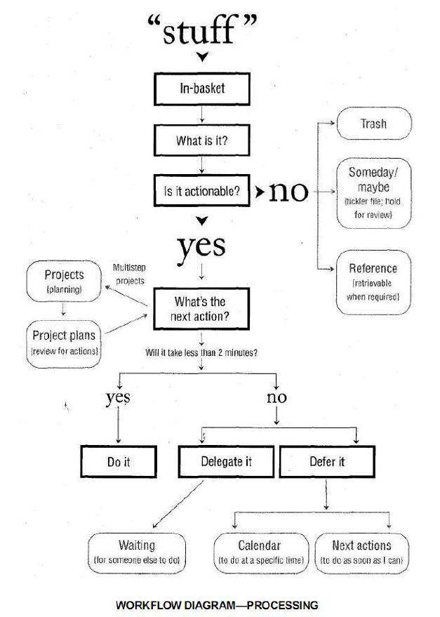

# █ 尽管去做, 无压工作的艺术

第一部分, 介绍这个系统的概况, 简要介绍整套方法论

第二部分,  具体的实施方法

第三部分, 更深入的讨论, 自定义优化等

- 避免救火, 疲于处理紧急状况
- 舒缓压力, 将所有任务妥善安排

# 一. 新情况, 新做法

> 焦虑是由于缺乏控制力，组织管理、准备和行动不足所造成的。——戴维·凯克奇（David·Kekich）

本书中的这套方法，完全基于两个主要目的：

- 搜集所有一切需要处理的事情, 不论大小, 把它们统统置入一个脱离大脑的逻辑系统中。
- 训练自己在接受任何任务的前期就作出分析和计划, 以确保在任何时候, 都拥有一套可以立即执行的计划（以及相关的行动）

## 1. 问题：新的要求，匮乏的资源

- 工作不再有清楚的界线
  - 内容越来越杂
  - 信息越来越多
  - 工作量越来越大
- 工作在不断地变化
  - 环境不断变化
  - 专业人士具有更强的独立性和自由度, 频繁变换职业
- 旧的模式和习惯已显得力不从心
- “大局”与事物的本质
  - 着眼大局, 认清主要的目标和价值观，为我们的工作赋予了先后次序、意义和方向, **但实践效果不佳?**
    - 干扰太多, 分散注意力, 无法集中精力关注更重要的问题
    - 由于个人管理系统欠缺, 对复杂困难的任务产生抵触情绪, 阻止了具体行动的实施
    - 更高的视角提出了更多任务和更高标准, 使我们压力更大
  - 关注价值观并不会使你的生活变得简单。它阐明意义，指导方向，**而且带来更多复杂的情况**。
  - 缺少一套连贯一致的系统和工具，并能够在实实在在的工作中发挥出卓越的功效
    - 必须能够从大局着眼，从小处入手，并且使二者有机地融合在一起
    - 必须能够管理多个层面
    - 必须能够坚持不懈地对每天衍生的众多新生事物保持控制
    - 必须比原来节省更多的时间和精力
    - 必须化繁为简

## 2. 承诺：一切就绪的状态

- “心静如水”的理想状态

  > 劳逸结合: 你发挥能量的能力与你放松休息的能力直接成正比。

  在任何程度上、任何时间内都能够随心所欲地控制自己的一切事物，能够100%地把精力投入到工作中而不受任何外界的干扰

  对于高效率的专业人士来说，如果他们希望保持工作中的平衡和积极稳定的成果，那么，这种状态必将成为一种不可或缺的条件

- 你能够在需要时进入自己的“高效状态”吗？

## 3. 原则：有效处理心中的承诺

由于人们对自己作出的承诺或者承担的义务**不明确**，导致了他们承受着重重**压力**的折磨.-- 悬而未决的问题

学会对那些承诺的事情加以控制，可以有效地缓解压力.

你内心很有可能已经承担了比你自己所意识到的还多得多的工作. 任何没有找到应有的位置和恰当的存在方式的事物，都会盘踞在我们的脑海中，成为悬而未决的问题。

为了能够高效地应付这一切问题，首先，你必须**收集所有**那些“经常唤醒你模糊记忆”的事情，然后着手计划如何一一地解决掉

- 管理承诺时的基本要求

  - 所有未完成的事项, 都放入工作篮. 要经常查看并清理工作篮
  - 你必须明白你的工作到底是什么, 需要采取什么行动来推动工作的发展进程
  - 一旦决定了需要采取的行动方案, 安排组织好这些行为的提示信息(记录下来)

- 检验这种模式的一个重要训练.

  - 写下要处理的事情, 并描述理想结果(收集, 展望结果)
  - 写下推动事情的具体行动(将任务分解成行动)
  - 接下来要做什么?(找到下一步行动)

  思考, 让你更加明确地了解到你所期盼的结果和确定了下一步需要采取的行动方案, 从而增加你对事情的控制力, 精神放松了一些，注意力更集中了

- “知识工作”的本质

  - 什么是知识工作? 

    你对工作投入的思考必须比你认识到的多，但是又比你所担心的工作量少

  - ‘这项工作的预期成果是什么？’这是一个提高知识工作者工作效率的关键性问题

  - 明确预期的结果 -- 思考后果是促使希望转化为现实的最为有效的手段之一。

- 为什么有些事情总是萦绕在你的心头. 

  - 因为你希望它们的状况能有所改善, 但有以下问题
    - 还没有确切地认定它们的**预期结果**是什么
    - 还没有决定你下一步的**具体行动**到底是什么
    - 还没有把后果和即将采取行动的提示信息存入你所**依赖的体系**中去
  - 大脑会记住这些问题, 并持续向你施加压力, 增加你的精神负担

- 你的大脑并不总那么管用

  - 不断地考虑那些毫无进展的事情纯粹是浪费时间和精力。而且这往往只会增加你的焦虑不安

- “材料”的转化

  - 材料, 指任何进入你的精神或现实世界中但尚未找到归属的事情，所有你尚未推理出理想的解决方法和下一步具体行动的事情
  - 我们需要把所有我们尽力管理的“材料”转化为可以付诸行动的事务。
  - 绝大部分任务清单只是列举“材料”, 未转化为预期结果和行动方案，即真正意义上的工作提纲和细节

## 4. 途径：管理你的行动

通过训练, 可以让你在工作中变得更加敏锐和有效率, 在这之前, 需要习惯清空大脑

管理你的行动是管理好你全部“材料”的关键所在。

- 管理行动的重要性

  本质: 在某一时间，如何选择要做的事情、如何管理行动.

  问题: 管理那些尚未确认或决定的行动是极其困难的, 因为还没有搞清楚要做些什么

  事实上, 你仅仅能够完成这项任务中的某一个步骤, 多数情况下, 一两分钟就能完成推动工作进程的步骤

  问题的关键在于，他们无法断定到底要干些什么，下一步需要采取哪些行动.事情极少由于时间匮乏而受阻。它们陷入困境往往是由于未能判定行动而造成的。

- 自下而上法的价值

  - 从当前活动和任务的最底层入手, 对提高个人工作效率具有实用价值
  - 问题在于大多数人陷于繁杂的事务中难以脱身，阻碍了他们总揽大局, 自下而上反而更加有效。
  - 当你能轻松应对底层具体行动的时候, 你才能进行更高一级思维活动

- 横向和纵向的行动管理

  - 横向, 捕捉各种各样不同的事情

    你需要配备一个完善的系统来辅助你记录尽可能多的工作，并在需要时及时地提供必要的提示, 确保你能够快速而轻松地从一件事情过渡到另一件。

  - 纵向, 针对每个具体的主题和工作所进行的思考

    这就是“项目规划”, 勾勒出执行过程中一切必要的想法、细节、重要环节和事情的先后次序

  - 横向控制和纵向控制的目标是一致的：解除你精神上的负担，并把事情做好

- 最重要的技巧：把一切赶出你的大脑

  - 大脑中盘踞问题的多少与其解决的效率成反比. 杂念越多, 效率越低
  - 大多数人只在自己工作生活已经一团乱麻的时候才会采取行动, 列出工作清单. 
  - 将这种做法作为生活常态, 并使之贯穿于你生活中的各个领域

# 二. 横向管理, 五个阶段



无论什么情况下, 我们在工作时都将经历5个阶段: 

1. 收集: 收集一切会引起我们注意力的事情
2. 处理: 加工处理, 确定它们的实质及接解决方法
3. 组织: 整理得出的结论, 列为我们行动的备选方案
4. 回顾: 检查行动清单, 选择下一步行动
5. 行动: 实施最佳方案

这是我们习以为常的处事方法, 但是大多数人在这5个阶段都有很大的改进空间.

通常, 我们在一天里的不同时段, 分别处理5个阶段效果会更好. 许多人无法把工作安排得井井有条，主要原因正是他们试图一口气完成这5个阶段的工作. 

他们试图一口气完成最重要工作, 而对于"不那么重要"的事情, 则是搁置一旁不作处理, 那么这件事情就成了一件悬而未决的问题. 它将时时刻刻地消磨你的精力，阻碍你集中精力思考那些真正重要的事情。

横向管理的关键

- 明确判定工作的预期结果以及下一步具体行动；
- 把一切尚待解决的工作的提示信息安置在一个安全可靠的系统中，并定期回顾和检查。

## 1. 收集, 收集一切

- 百分之百地捕获一切“未尽事宜”.

  先将未尽事宜在一个收集篮, 直到有时间来思考它到底是什么问题, 打算如何解决. 定期清空收集篮

- 收集工具

  - 具体的工作篮
  - 纸质记事本
  - 电子设备
  - 录音设备
  - 电子邮件
  - 高科技设备

- 影响成功收集的因素

  - **收集一切**未尽事宜

    如果不能收集一切, 大脑里就不能完全信任我们的系统, 而是处于两头兼顾、疲于奔命的状态之中

  - **尽可能少**的收集工具数量

    随时随地都能收集, 但不能太分散(一个手机足以)

  - 定期清空收集工具

    如果不清空收集工具, 加工处理里面的材料, 那么就是一个堆满杂物的仓库

    清空不等于全部完成, 只是确定材料的实质, 并妥善安排行动计划

    为了把工作篮清扫干净, 你的管理系统必须全部到位, 若缺乏有效的流出路径, 工作篮的材料就会堆积如山

## 2. 处理, 确定实质及解决方法

材料需要先加工, 才能有效的组织整理起来. 材料加工后得出的下一步行动, 才是真正组织整理的对象

- what: 这是一件什么事情？

  这些材料到底是什么，需要做些什么

- 是否需要采取行动呢？

  - 不需要行动

    - 垃圾: 不需要保留, 可以丢弃
    - 将来也许: 需要孵化, 酝酿, 日后重新评估, 可以写在备忘或日程表中
    - 参考资料: 有价值的资料, 存档备查

  - 需要行动

    - 要达到什么目标和结果?

      需要在清单中体现出结果, 提醒这里有个未解决的问题

    - 如果是一个项目

      需要多步行动才能完成, 列入"项目"清单, 并分解成"行动"清单

    - 下一步行动是什么?

      - 不超过两分钟, 立即处理
      - 委办任务, 指派给别人, 设置跟踪提醒
      - 待办事项, 记录在清单上, 延迟处理

## 3. 组织, 整理得出的结论

对于那些不可能采取行动的事务来说，它们可以划分为

- 垃圾
- 孵化工具
- 参考资料存储器

在管理那些能够解决掉的事情时，你需要

- 项目: 项目清单、作为索引
- 资料: 一个保存工作计划和资料的存储器或文件夹、存放具体任务细节
- 日程表、
- 下一步行动: 下一步行动的提示清单，
- 委办跟踪: 一张你所期待的回复信息的提示清单。


### 3.1 项目清单

项目: 任何一个由几个步骤才能完成的任务. 

如果某项工作不能一步完成, 就需要有提醒机制, 否则会回到大脑中, 重新成为困扰人的未尽事宜.

我们不可能执行"项目", 只能执行推动项目的"行动", 完成足够多的"行动", 才能达到项目的预期目标. 

- 列工作任务(结果)清单. 不需要排序, 列出来, 方便查阅即可

### 3.2 工作的辅助性资料

大多数项目, 都会有相关信息, 以及项目分解后的行动清单. 

应该将这些东西按照主题或项目组织管理起来. 

### 3.3 下一步行动的种类

- 特定时间执行 -- 日程表

  你的日程表上一般标注三种情况：

  - 在某一个**确切的时间**里采取的行动；
  - 在某一个**确切的日期**里采取的行动
  - 在某一个**确切的日期**里将要获取的**信息**；

  不需要"每日工作"清单, 不要尝试为所有工作安排日程

  - 由于情况不断变化, 策略重点转移, 必定有工作需要调整. 可以制定工作计划, 但不要限定执行时间.  应该采用下一步行动清单记录所有行动信息
  - 如果每日工作清单中总有一些不是必须在当天完成的, 它会令日程表弱化, 对其他确实需要在当天完成的任务造成干扰
  - 总之, 如果日程表中的任务经常变动, 日程表就不再神圣, 失去了意义.

- 越快处理越好 -- 下一步行动

  所有行动都记录在下一步行动清单中. 任务太多可以进一步细分

- 指派他人处理 -- 委办跟踪


- 不能够立即落实的工作
  - 垃圾, 果断丢弃, 不要污染我们的系统
  - 将来也许, 记录有兴趣, 但暂时条件不成熟, 无法执行的任务, 要定期查阅, 如周回顾
  - 备忘录(日程表)
  - 参考资料, 
- 参考资料, 在需要时能够毫不费力地查寻到的资料
  - 特定主题的存储区, 按资料的内容分类保存
  - 一般资料文件区, 无法归类到特定主题的资料

  预先定义好分类, 归档的程序要简便快捷, 否则是自找麻烦

  如果没有给参考资料设定清晰可辨的界限，就无法区分哪些是可以采取行动的事件，哪些是暂时无法实施的工作

## 4. 回顾, 把它们列为我们行动的选择方案

你需要每隔一段时间，全面地回顾一下你自己的生活和工作的情况. 每周你再次浏览一下那些未完善的工作和悬而未决的问题，快速地清理一下自己面临的行动和抉择，从而从根本上对某一时间需要处理的工作作出有效的选择。

- 回顾的内容和时机, 根据你的需要，经常地回顾你的清单，把它们赶出你的大脑。

  完成任务后回顾日程表, 处理未尽事宜

  检查完日程表, 看看下一步行动清单, 时间允许就可以实施. 

  “工作任务”、“等待处理”和“将来某时/也许”，这些清单应该根据你的具体需要经常查阅

- 成功的关键因素：每周查阅

  - 收集和加工处理所有的“材料”。
  - 回顾和检查你的系统
  - 更新各类清单
  - 做到清洁、清楚、实时和完整

大多数人并没有真正拥有一个严丝合缝的完整系统, 因为他们所回顾的事物老是支离破碎.

你建立的系统越完备，你就越信赖它；你越信赖它，你就越发具有坚持运行这个系统的内在动力。而每周的回顾和查阅即是达到这个目标的关键所在。

## 5. 行动

工作流程管理计划的基本目的是，在任何时候为你作出正确的选择提供方便

- 选择下一步行动的标准
  - 环境
  - 有多少时间
  - 有多少精力
  - 重要性
- 工作的类型
  - 处理事先安排好的工作: 按下一步行动清单推进工作的完成
  - 处理随时冒出来的事件:  放下手中工作, 处理突发事件
  - 定义你自己的工作: 加工处理/组织整理
- 回顾和检查工作的6个高度
  - 5万米, 生活, 是我们整个生活的全景, 是对工作的最终描述，你制定的所有目标、前景展望、规划、任务及行动都来自于这个工作描述，同时也为其获得成功指明方向。
  - 四万米, 愿景, 3-5年展望, 会从一个更加广阔的角度着眼
  - 三万米, 目标, 1-2年内, 你希望在生活和工作的各个领域达到哪些目标
  - 两万米, 责任范围: 每个人都身兼不同角色, 承担不同责任. 有助于更加综合全面地分析和评估任务清单
  - 一万米, 当前的工作: 工作任务与项目
  - 零米, 目前的行动: 密密麻麻的行动清单, 需要处理的一切事务

# 三. 纵向管理, 制定工作计划

## 1. 强化工作重心

在大多数情况下和大部分时间里，你仅仅需要横向工作重心, 即统筹所有任务. 

但有时候也需要针对某一项目设计整套解决方案, 即纵向工作重心

```
我们的最终目标是把各种工作和情况赶出你的大脑，但不要丢弃任何具有潜在价值的想法。
```

大多数情况下, 纵向思考并不要求详尽周密. 你可以随意开始对问题的思考, 这样效率最高. 有时候也会需要制订更加正规的工作计划,

根据我的经验，人们计划做得越多，形式越随意自然，他们获得的效果就越理想，同时，还释放了大量的精神压力。它碰巧符合我们天生的思考和策划的习惯 --- 自然式计划模式

## 2. 自然式计划模式

世界上经验最丰富的计划家就是你的大脑。尽管其过程可能毫无章法可言，但事实上在大脑闪现出任何一个具体的方案之前，一些相当复杂的步骤就已经抢先登场了.人的大脑只有经过5个步骤才能够完成任何一项任务, 举一个简单的事例：计划出去吃饭

1. **目标**

   问问为什么 why, 这个问题的价值

   - 界定成功
   - 建立决策标准
   - 调配资源
   - 给予冬季
   - 阐明重点
   - 拓宽选择

   你的意愿就是你的目标，它自然而然地启动了你内心深处的计划过程。

2. **原则**

   你的原则规定了你所作计划的界限, 即使你没有意识到你受到原则的约束。

   无论如何，在制定计划时，你的目标和原则决定了你的动机和计划。

3. **展望成果**

   一旦决定要实现目标，首先进入你脑海的实质性问题是什么呢? 就是你对结果的预期.

   1. 超前预想工作情况
   2. 想像“大获成功”的景象。（暂时中止“是的，但是……”）
   3. 捕捉你想像中应该到位的各种特点、各个方面和品质。

4. **头脑风暴**

   一旦作出承诺要达到某一目标，在达到之前，你就会身不由己地向自己接二连三地发问。

   这些问题是这个创造性过程中的一个组成部分。当大脑意识到，在你设定的目标和你目前的状况之间存在着一定的差距，这时它会千方百计地弥补这一差距，以消除这种“认知不协调”.

   这种思考模式显示出一定的随意性。你会想到有关外出就餐方方面面的事情, 头脑中可能浮现出的各种复杂烦琐的细节问题。

   - 不判断，不质疑，不评估，不批判
   - 追求数量，不求质量
   - 把分析组织工作置于次要的位置上

5. **组织管理**

   一旦头脑里装满了大量的想法和细枝末节，你也就不由自主地开始了组织整理的工作.

   一旦你对相关的结果产生了各式各样的想法，大脑将自动地根据事情的组成要素、重要程度和事件发展的先后顺序，分门别类地进行归纳整理。

   - 明确事件的重要组成部分
   - 整理分类（按照下面一个或多个标准）
     - 组织结构
     - 先后顺序
     - 重要程度
   - 必要程度的详述

6. **明确下一步行动**

   最后，为了促使第一要素的顺利实现，你主要集中在下一步具体的行动方案上.

每天你无论做什么事情，都会顺理成章地遇到工作计划中这5个不同的阶段, 你的一切举动自然而然地发生了，并没有给予过多的考虑。

### 自然计划法并不是工作中的常规做法

但是, 自然计划法并不是工作中的常规方法. 大多数情况, 我们为具体项目制定计划时, 并没有遵循自然计划法的5个阶段, 可能会遗漏某些环节. 试试自然计划法, 可能会有奇效.

### 非自然计划法

与自然计划法香相比, 这种计划法更常见. 

### "好主意"变成坏主意

我们常会听见"有什么好主意能解决这个问题?"这样的提问. 

但这里隐含的前提, 是我们能够评估主意是不是足够好. 这要求我们必须明确这个提议的目的，清楚地勾勒出前景的轮廓，并收集（头脑风暴）和分析（组织管理）所有的相关资料.这是以你思考的程度达到80%时为前提的！而一开始就提出这个问题，很可能会扼杀任何人的创造力。

如果你打算在定义目标、展望前景、网罗愚蠢想法之前就梦想得到一个“好主意”的话，那么，这往往只会阻碍你启动创造性的思维。

### 归因于小学语文老师

我们的老师教我们写文章时, 往往会让我们先写提纲, 提前决定文章的结构和要点.

这是大多数人关于计划的最基础的知识, 但这很不自然. 如果你先写好文章, 那么提炼提纲非常容易. 

在工作生活中, 我们也常常列"提纲", 这些提纲被称为"目标"或是"目的", 但实际上这些目标脱离实际, 列出来以后就被束之高阁, 对人们的现实生活和工作毫无影响

## 3. 反应式计划模式

在许多人的观念中, 非自然计划方法才是在做"计划", 但由因为这种计划不是遵循自然规律和人的思维习惯自然产生的, 无法落地, 对实际工作指导意义不大, 渐渐的, 人们就不再做计划. 

但是没有事先计划, 就会演变成被动救火 -- 反应式计划就产生了. 

行动起来 -> 盲目地忙碌 -> 加班 -> 增加人手... 这一局面令人们倍感压力, 当人们忙碌却无法解决问题时, 有人提出需要有点计划, 于是开始标记重点问题, 重点解决.

后来只标记重点已经不够了, 大家决定开会讨论, 有人提问"谁有好主意?" 当大家都没有好主意时, 领导觉得自己人已经黔驴技穷, 需要外援 -- 咨询顾问. 而顾问会带领大家回到最重要的问题: 现在需要做什么呢? (前景和目标)

反应式计划方法与自然式恰好相反，它总是能够回到自上而下的工作轨道上来的。这不是应不应该执行自然式计划方法的问题，而是什么时候执行，付出何种代价。

## 4. 自然式的5个阶段

### 4.1 目的

多问问为什么要做这件事情, 我们往往会沉迷于细节之中, 

思考"为什么"的价值

- 界定成功
- 创造了决策标准
- 集结资源
- 激发动机
- 阐明重点
- 拓宽选择


### 4.2 

# 四. 确定时间, 空间和工具

实践 GTD 之前, 需要花费一些功夫做启动工作

1. 花时间收集, 初始化工作篮
2. 整理自己的工作区, 打造自己的高效环境
3. 确定需要使用的工具

# 五. 收集, 填充工作篮

一定要在你彻底完成所有的收集工作之后，才开始对其进行处理

- 这有助于你认识到自己面对的工用量
- 同时让你清楚“终点”在哪
- 当开始处理（process）和组织（organize）的时候, 不用担心遗漏, 可以集中精力

## 1. 外在的收集工作, 打造工作区

搜索你周围的环境，检查一下哪些事物没有到位，把它们放入工作篮。

### 不该收集的东西

- 日用品, 参考资料, 装饰品, 办公设备

这些东西要么经常用, 已经在合适的地方; 或者不需采取任何行动. 

若上述内容有需要采取行动的, 则需要放入收集篮

### 可能碰到的问题

- 东西太多太大, 收集篮装不下

  太大: 在纸上写下提示信息, 作为替代品放入收集篮

  太多: 堆在收集篮周围, 与其他东西分开即可. 后续的整理工作会将其清理

  没用: 丢掉没有的垃圾

- 收集的时候强迫症发作, 偏离到清理打扫和整理的工作中去

  如果有时间, 就好好收拾吧

  如果没时间, 将"打扫"作为未尽事宜, 加入到收集篮

- 如何处理以前的收集和整理成果

  除非你的系统非常有效, 否则将里面的东西全部重新整理

- 发生紧急事件, 打断了收集工作

  需要立即处理: 马上处理

  不需要立即处理: 写在纸上, 加入到收集篮

  稍后马上处理: 单独设置一个"紧急事件"工作篮

### 改造工作区

桌面, 抽屉, 柜子, 地板, 墙面, 储物架, 房间等等...

如果需要升级设施/打扫整理/清理整顿等任务, 写个纸条, 放入工作篮中.

## 2. 内在的收集工作, 清空大脑

当把外部环境的材料都收集完了, 很自然的会从脑海里搜索需要处理的事项

准备一沓白纸, 每张纸上只写一件事情, 将脑中所有事情记录到纸上: 工作/生活/大事/琐事, 等等

参考清单...

## 3. 收集的成果

经过上面的收集工作, 你的脑子已经被清空, 而收集篮被塞得满满当当, 接下来就要处理材料, 清空工作篮

# 六. 处理, 清空工作篮

所谓的清空工作篮，事实上并不意味着完成你所收集到的全部工作和行动。它指的是识别你搜集到的每样东西，确定它是什么，它意味着什么，它需要你进行什么样的行动

处理后, 你将达到以下几点:

- 丢弃你不再需要的一切
- 完成任何用不了2 分钟就能搞定的事情
- 把任何可以委托他人处理的事情交代出去
- 为所有需要超过2 分钟时间的工作，在组织工作的系统之中注明提示信息，以提醒你日后执行；
- 根据获取的信息，明确你目前一些较为重要的工作和任务

## 1. 加工方法指导

- 从上往下处理

  每一件事情都必须获得均等机会的处理, 尽最大的可能迅速地突击到收集篮的底部，而且不逃避任何一件事.

  - 紧急搜索不是处理

    多数人会从工作篮中挑最紧急最重要的事情来处理, 但不是我们这里推荐的正常处理方法.

    进入处理阶段时, 必须按顺序解决所有事情, 一旦打乱, 必定会有所遗漏. 

  - 先进先出? 后进先出?

    建议先进先出, 但通常区别不大.

    邮件会话可以先处理最新的, 新邮件往往已经包含了会话中所有旧邮件, 一次性处理

- 一次一事

  每次只处理一项内容，可以迫使你集中全部注意力来作出判断

- 一次一事

- 永远不要把任何事务再次放回工作篮

  当一件事务第一次从工作篮中取出时，立刻判定它的实质以及处理方法

## 2. 关键步骤, 下一步行动是什么

你现在需要做的就是对每样事情决定它所需要进行的下一步行动. 但这需要你又快又果断地思考。很多时候，需要采取的行动不会那么明显，需要你去发掘，去选择。

### 不需要行动

- 垃圾
- 孵化: 加入将来/也许清单, 或者写入日程表/备忘录
- 参考资料

### 需要行动

- 下一步行动必须是可执行的具体的行动
- 

# 七. 管理, 建立好清单

# 八. 检查, 回过头看看

# 九. 行动, 选最佳方案

# 十. 创造性地思考工作

# 十一. 养成收集和自省的习惯

# 十二. 下一步行动

# 十三. 关注结果


