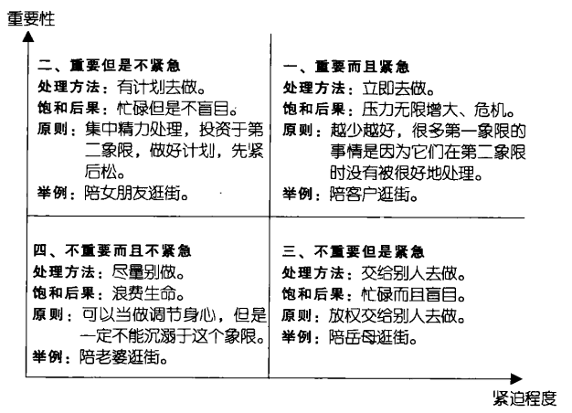
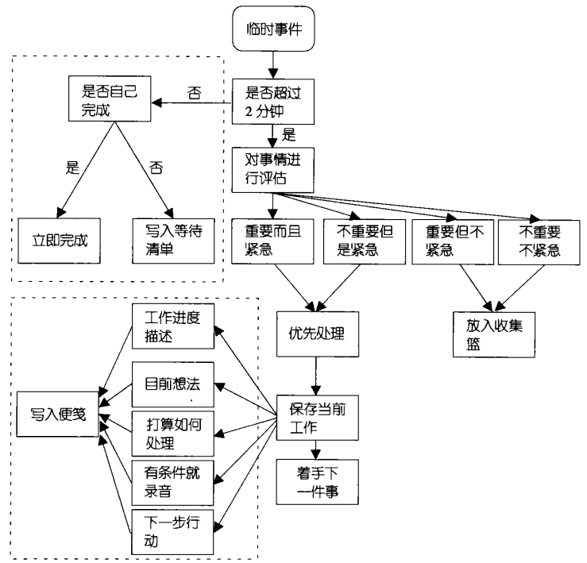

# █ 小强升职记 读书笔记

[TOC]


# 一. 认识自己

> 走出混沌, 开始反思, 找出浪费时间的源头, 认识时间管理的必要性, 找到自己的职业价值观

## 1. ★统计时间比例(三类时间)

1. **预估**: 在纸上写下自认为在三类事件上的时间比例: 专注工作, 好好休息, 浪费时间
2. **明确**: 在纸上写下自己对三类事件的描述
   - 专注工作，心无杂念, 进入忘我状态, 效率很高
   - 好好休息，休闲散步等
   - 浪费时间，无意义玩手机, 无法集中精力, 烦躁不安
3. **记录**: 连续5个工作日, 每个一小时记录自己的状态, 从早上七点到晚上十点
4. **总结**: 周末统计三类比例

## 2. ★找到时间黑洞(预估与结果)

时间黑洞, 会永无止境地吞噬你的宝贵时间. 

由于注意力被打断, 重新集中注意力也需要时间. 时间黑洞不仅吞噬"无意义"的时间, 还将集中精力的时间破坏. 

**出现原因**: 做事情不够主动, 目的性不强, 没有计划, 容易被杂事吸引注意力从而忽略了真正该做的任务. 

1. 每隔一个小时写出下一个小时计划做的事情
2. 一个小时后记录结果
3. 坚持一整天, 从早上七点到晚上十点
4. 睡前分析结果
   1. 任务清单: 一天应完成哪些任务
   2. 执行结果: 按时完成/延迟完成/未完成, 分析各自的原因

```
技巧
多任务需要处理时, 为任务设置倒计时, 到时提醒, 切换任务

避开时间黑洞的技巧
1. 关掉通讯工具, 避免无意义的群聊
2. 关闭邮件提醒, 改成固定时间处理邮件
3. 保证办公环境干净整洁, 办公用品方便随手可得
4. 准备好茶水
5. 列当天任务清单, 完成一件划掉一件
6. 舒服的椅子
7. 尽可能隔离自己, 让身边的人不要打扰自己
8, 做事分轻重缓急, 先解决重要/紧迫的事情
9. 累了就休息
10. 设置任务的最后期限, 设置期限能明显提高效率, 挖掘潜力
```

## 3. ★记录时间日志(忠实记录)

1. **记录**: 连续一周, 每隔半小时记录当前在做的事情, 从早上七点到晚上十点
2. **总结**: 找到高效时段与实践黑洞
3. **分析**: 找到问题所在, 有没有改进空间

```
时间日志的作用
1. 每小时提醒自己珍惜时间
2. 充分掌握自己的时间, 避免轻易原谅自己
3. 分析自己时间的投入与产出
4. 找到自己的高效时段
```

## 4. ★每日时间规划(作息表)

时间管理, 就是学会安排和利用自己的时间, 在合适的时间做合适的事. 

时间管理不追求完成任务的数量, 而追求充分利用时间完成最重要的任务, 从而创造最大的价值.

给自己设置一个每日时间表, 确定以下时间段

- 每日任务安排
- 邮件/沟通
- 高效工作
- 应急杂事
- 思考总结

四步工作法

1. **收集**: 所有任务放入工作篮, 不论何人何时派发的任务
2. **分类**: 清除无意义的任务, 找出委办的任务, 完成2分钟内的任务
3. **整理**: 日程任务设置提醒, 委办任务转交并设置提醒, 准备当前任务需要的材料
4. **执行**: 在高效时段做最重要的事情, 其他任务合理安排

```
提高工作效率的窍门
1. 分析一天任务, 找到重点任务, 安排在高效时段
2. 发布或上交材料前, 仔细回顾资料是否齐全, 能否继续完善
3. 新闻订阅, 避免无意义刷刷刷
4. 减少邮件与IM次数, 避免群聊灌水
5. 定时休息, 有助于精力恢复

小技巧
拒绝打断: 完成某项任务时, 拒绝被不必要的事情打断当前工作
```

## 5. ★找到自己的价值观(自测表)

先找到自己的价值观, 才能根据价值观对人事物做出评估, 最后才能决定什么是最重要的事, 以及他们值得我花费多少时间. 

完成价值观自测表, 找到自己价值观所在(详见小强升职记, P026)

# 二. 时间管理方法

> 学习基本的时间管理方法, 开始时间管理的征程

## 1. 四象限法则

任务按重要性和紧迫性两个维度进行划分. 关键是如何评估任务:

- 重要性: 根据自己的职业价值观, 是否对自己长远发展有意义
- 紧迫性: 根据任务的时间底线, 是否马上就要处理

改造任务清单, 放入四象限

1. 列清单, 将一天的所有任务列成一个清单
2. 分轻重: 以自己职业价值观为标准, 标记重要/不重要
3. 分缓急: 以任务的截止时间为标准, 标记紧急/不紧急
4. 优先级:  按照自己的意愿标记高中低
5. 将清单中的任务放进四象限

面对四个象限的任务, 采取不同的应对方法



### 1) 重要且紧急

必须马上去做, 否则后果严重.

第一象限是生活工作的主要压力来源, 是雷区, 进入次数越少越好. 绝大部分任务是第二象限中未及时处理的任务.

### 2) 重要不紧急

虽然暂不紧急, 但应尽早准备, 否则会变成重要且紧急的任务.

是我们日常工作的重点, 有计划去做. 要在第一时间进行任务分解并制定时间表. 处理好第二象限的任务, 能大大减少第一象限的任务. 

第二象限工作法, 即对任务进行目标描述和任务分解, 是四象限的核心和最终目的, 目的在于消除时间管理的三大杀手: 拖延, 犹豫不决, 目标不明确

```
目标描述与任务分解的好处
1. 迫使我们将精力花在第二象限, 这在任务一开始是非常重要的
2. 有利于把项目做细, 有计划地做, 时刻知道下一步该做什么
3. 明确任务完成的标准, 达到标准时可以放下心里的石头, 减轻压力
4. 有了工作时间的约束, 可以明确知道任务是否拖延, 原因是什么, 如何避免
```

### 3) 不重要但紧急

很多人误以为"紧迫"的就是"重要", 但在此处投入时间, 往往意义不大.

此处的任务是我们忙碌而盲目的原因, 应尽量避免. 拒绝不必要的任务, 或放权委派他人去完成. 

利用猴子法则[^monkey]，甩锅不接锅，避开三象限

[^monkey]: 猴子法则, 过多地帮助别人解决问题, 而耽误了自己该做的任务. 少接别人的锅

### 4) 不重要不紧急

只是打发时间, 仅当调剂, 不可沉迷

## 2. 时间投资法

```
时间投资特性
1. 供给无弹性: 固定不变, 每人每天都是24小时
2. 无法蓄积: 不论是否愿意, 时间都在流逝, 无法存储备用
3. 无法取代: 任何活动都需要时间的堆砌, 是不可缺少的资源
4. 无法复得: 一旦流逝, 永远丧失, 无法挽回
```

1. 计算自己的时间资本, 还有多少时间可以利用? 工作资本/休闲资本
2. 计算自己的单位时间价值, 薪水/工时
3. 想办法提高回报率, 即提高自己单位时间价值. 升职加薪/提高时间利用率

- 巴菲特的五大投资原则
  - 找出杰出的公司, 找到最重要的任务, 能创造最大价值的任务
  - 少就是多, 着力于解决一二象限的关键任务, 而不是解决大量小问题
  - 押大赌注于高概率事件, 把握机会, 要事第一, 优先解决最重要最有价值的任务
  - 要有耐心, 某些重要任务的不会立马有回报, 需要时间孵化
  - 不要担心短期价格波动, 不要被紧急而不重要的事情影响心情

## 3. 专注下一步行动

脑子里事情太多, 会给人带来压力. 只装一件事，就能从嘈杂环境和沉重压力中解脱.

专注于一件事的好处： 

- **专注**，心无杂念, 提高效率和创造力
- **成就感**，能看见任务一件件被消灭, 保持旺盛的斗志
- **摆脱压力**，不用惦记还有很多任务需要处理, 只需做好当下的一件事
- **更好的结果,** 排除干扰, 就有更高效率和创造力, 带来更好的结果

```
时间管理不是一个人的事，要带动身边的人, 共同营造更好的工作环境
```

造成手足无措, 效率低下, 抗干扰能力差的原因之一就是把 **项目** 当成了 **行动**. 

- 项目: 由一系列单一的行动共同组成.
- 行动: 可执行的单一步骤
- 下一步行动: 已经确定的, 需要2分钟以上才能解决的单一行动
  - 动词开头, 保证可执行性
  - 内容清晰, 描述清晰, 不需要大脑擅自发挥想象力, 关联过多无谓的信息
  - 描述结果, 明确任务完成的标识, 明确的结果产生更大的能量
  - 设置起止时间与周期, 能更合理地安排时间

```
要经常问自己: 下一步行动是什么?

消除压力的方法:
1. 设立目标, 设定完成目标后的奖励, 给自己更多动力
2. 若不能全部完成, 尽量完成能完成的部分, 建立信心
3. 解决主要问题
```

要将项目分解成行动，列出行动清单. 依次完成下一步行动.

- 所有行动清单: 列出项目分解后的所有行动, 完成一项删除一项
- 下一步行动清单: 只写出下一步行动, 完成后再写下一个, 可以让自己保持专注.

## 4. 衣柜整理法


### 1) 收集

收集，清空衣柜：收集一切引起我们注意的事情, 全部放进收集篮, 以清空大脑

- 收集工具越少越好, 统一管理. 多了内容分散, 并会提高复杂度
- 保证5秒钟拿出工具, 灵感稍纵即逝
- 定期清空这些工具, 只是一个暂存器, 要及时处理

### 2) 处理

处理，为衣服分类：确定它们的实质及解决方法 (是否可执行，何时执行)

- 从上往下处理, 每件事情都有均等机会被处理, 快速给任务定性
- 一次只处理一件事情
- 不要放回收集篮, 一次就确定任务的性质及处理方法

为任务分类, 是否可执行

- 不可执行
  - 垃圾: 浪费时间浪费生命的事情, 千万不要做
  - 将来/也许:不确定时间, 或条件尚未成熟的事情
  - 参考资料: 今后某些时候会用到的资料, 分类归档
- 可执行
  - 2分钟任务: 2分钟内就能完成的简单任务, 立即去做
  - 多步骤的项目: 待分解成多步骤的行动才能做
  - 委办任务: 指派别人去做, 并设置跟踪提醒
  - 日程任务: 确定时间去做的, 添加到日历和到期提醒
  - 普通待办: 在合适的时间去完成

### 3) 组织

组织，将分类的衣服重新存储：组织整理得出结论, 将任务放入不同清单

3+1清单系统

- 收集篮: 每日清空, 要方便取放
- 将来也许: 可能需要很久以后才会做, 要方便长期保存
- 待办事项: 指导日常工作的关键, 要方便查看
- 项目: 围绕一个主题的多任务的集合, 可能有关联的资料和文件

### 4) 回顾

回顾，对衣服心中有数：把他们列为我们行动的选择方案. 定期清理，修正，

-  让灵感应运而生: 对自己的一切了如指掌, 对所有的一切做了充足的准备
- 站在三万米的高度去考虑问题: 思考哪些事有利于我接近目标? 今后类似的事情如何取舍? 
- 孵化和修剪你的任务及目标: 不做修剪, 将来/也许清单会越来越庞大.

合适的回顾时间

- 每天工作第一眼
- 每周定期回顾
  - 回顾将来也许清单: 可以行动的项目规划实施, 不需要做的项目删除
  - 回顾项目清单: 
    - 下一步该做什么?
    - 项目进度是多少?
    - 项目要取得什么样的成果?
    - 项目的实施有没有需要修正的地方?
    - 有没有遗漏? 有什么新想法?

  - 回顾待办事项清单

    - 有没有做了而没删除的任务?
    - 这周做了哪些事?
    - 下周计划做什么? 
    - 任务需不需要添加到日程表?

  - 重新审视自己的目标

    

### 5) 行动

行动，选择合适的下一步行动

- 重要性, 优先考虑完成重要的任务
- 环境, 根据所处环境, 将同一环境的任务一起处理
- 时间, 现在的时间是否足够, 选择能在指定时间内完成的任务.
- 精力, 劳逸结合, 完成大任务后可以用轻松点的任务作为调节

### 6) 六个高度理论

1. 愿景, 五万米

   好好思考自己的价值观, 原则和目标, 这是工作的灵魂所在.

   工作室谋求更好生活的途径, 追求无压, 流畅, 高效的工作

2. 原则, 四万米

   包含3-5年的工作目标, 关于职位或能力

   - 我的目标是什么
   - 哪些人已经达到这个目标
   - 他们是如何达到目标的
   - 达到目标后我的工作和生活会是怎么样的

3. 目标, 三万米

   目标是比愿景更细化的东西, 通常在一年内可以有阶段性的成果

4. 责任, 两万米

   每个人有不同角色, 工作/家庭/生活/社群, 不同角色都有其特定的责任.

   好好完成责任范围内的事情, 才能进一步的发展

5. 任务, 一万米

   注意力放在眼前的任务上

6. 行动, 当前跑道

   最细节的事情, 全部放入清单, 逐一完成

花一段时间, 好好思考自己的未来发展, 制定一个自上而下的职业规划, 然后自下而上地完成, 并随时修订自己的规划

# 三. 目标管理

> 构建目标管理体系, 进入新的成长阶段

## 1. 目标, 让自己忙碌而不盲目

```
目标的作用
1. 给人明确的方向感, 诗人充分了解自己每个行为的目的
2. 让人清晰地评估自己的行为, 进而正面检讨自己的行为
3. 让人从忙乱中转移到自己的工作重点上
4. 让人更关注结果, 产生持久的动力
5. 激发出人的潜能
```


```
无法达成目标的原因
1.设定了不可达成的目标
2.没有将目标分解为计划
3.放任偶尔的失败
4.没有写下来
5.没有及时修正目标
6.没有坚持行动
```

## 2. ★目标管理

### 1) 正确描述目标

SMART 原则, 

- Specifie, 具体的. 明确描述
- Measurable, 可测量的, 有具体的量化指标
- Attainable, 可实现的, 具有可能性
- Realistic, 可实行的, 具有现实可行性, 有可实现的操作方法
- Time-based, 时间限制, 要在一定时间内实现

按照 SMART 原则描述目标后, 能对目标有更清晰的认识. 

- 对于不可达成的目标, 能打消不切实际的念头, 
- 对切实可行的目标, 能大大增强自信

```
设立目标的误区
不要设置太过长远的目标, 太长远的目标没有意义.
始终把目标定在目光可及的地方, 设置阶段目标, 分阶段完成.
```

### 2) 目标分解

实现目标的关键是将目标转变成计划. 

参照树的结构, 将目标分解成计划

- 树根: 实现目标的基础

  写在一张质量比较好的卡片上, 或笔记本首页, 要保留到目标达成以后

  - 写下目标. 可以添加配图, 放在醒目的位置, 即 **让目标形象化**
  - 我为什么要达成这个目标. 写下设立目标的理由, 遇到挫折时候再看看
  - 我为什么能达成这个目标. 说服自己, 给自己信心
  - 哪些人，团体，组织能帮我达成目标, 以便寻求他人的帮助
  - 时间限制, 设立期限, 让自己抓紧行动

* 树干, 写下计划步骤（子项目）

  写在树根下面, 完成一个步骤的时候, 勾上已完成

* 树枝, 在月计划表细化计划步骤

  完成树干后的一周内做好树枝(月计划表), 放到抽屉里, 将会被频繁使用

* 树杈, 在周计划表细化实施步骤

  每月最后一天, 对照下个月的月计划表, 做好下月的树杈(周计划), 固定在桌面上

  每完成树杈中的一项任务, 勾上已完成. 进而勾掉树枝, 树干的相关步骤.

  若树杈任务未能完成, 应该重新审视整个计划, 及时调整. 

### 3) 提高执行力

- 找到最大的石头，主要任务

  我要达成这个目标, 最大的障碍在哪里? 然后首先去除这个障碍.

  每个树干/树枝/树杈都有其最大障碍, 找到并解决它. 

- 写下来，不写下来很可能会被忽略遗忘

  - 写到才能做到
  - 大脑提供灵感, 纸笔细化行动
  - 白纸黑字才是契约

* 重视失败，拒绝麻木，及时调整

  - 连锁反应. 计划环环相扣, 一项失败会影响全局
  - 麻木. 不重视失败, 就会对失败麻木, 进而习惯失败

  但失败无法避免, 出现后要足够重视, 及时调整

  - 重视失败, 分析原因. 为什么失败? 如何避免?
  - 调整计划, 以变化应对变化. 

### 4) 目标形成合力
目标是铁链而不是铁砂，按照六个高度原则，指定一个系统化的目标体系。
当自己的目标更有层次，更加系统后，这些目标会形成合力，成为人生的动力源泉。

* 什么是六个高度
* 为什么要按照六个高度原则去设定目标
  * 设定更加有层次, 系统的目标
  * 这样所有的目标可以形成一种合力, 形成一条铁链
  * 就像通关游戏一样, 保持完成每一个目标的兴奋度
* 怎样按照六个高度原则设定系统的目标
  * 自上而下地设定目标
  * 每个目标都从属于某个愿景
  * 每个愿景从属于某个原则
  * 目标层是设定目标和指定计划的分水岭
* 设定目标与制定计划的区别是什么
  * 钉钉目标允和指定计划的区别在于, 前者是要做什么what, 后者是如何去做how


```
行动起来，做实干家不做目标收藏家
```

## 3. 主题思考法

* 在空白纸上这一个思考的主题
* 列出问题并编号
* 依次回答问题

# 四. 自定义

> 开始自主思考, 用自己的眼光去发现问题, 建立属于自己的清单管理系统, 让自己拥有个性化的时间管理方式

项目 任务 行动的区别

* 项目: 多远的组合, 包括任务和成果
* 任务: 由单个行动组成的时间, 可以相互嵌套
* 行动: 单个的步骤, 可以直接执行


## 1. 定制适合自己的清单系统

3+1清单系统的问题

- 收集箱

- 将来也许

  工作上的任务, 基本都能确定是否可行, 或具有明确的时间点, 不会有什么模糊的空间

- 待办事项

  容易让"任务"和"下一步行动"揉在一起, 可能会打乱工作节奏

- 项目

  基层工作者只对项目局部负责, 无法掌握项目全貌

不同的人适合不同的时间管理系统, 需要根据自己的实际情况调整定制. 

* 依据: 角色，材料，环境
  * 便利贴先生：任务执行者
  * 邮件狂人：项目管理者
  * 交际者：市场营销
  * 掌柜的：企业决策
* 目的: 保证所有的事务, 都能在自己的系统里找到合适的地方

## 2. 任务执行者的筷子式清单

任务执行者通常会变成便利贴狂人, 但滥用便利贴会有以下问题

- 随手写，缺乏组织
- 自我定位为执行者, 不利于提升
- 对事情来者不拒, 沦为别人的垃圾箱

针对任务执行者, 筷子式清单更为合适

- 任务清单

  总体把握, 树状，来自收集篮, 为行动清单提供素材, 需要定时回顾

- 行动清单

  细节完善, 列表，来自收集篮和分解后的任务清单, 推动任务的完成

- 行动要描述具体，5W，为什么，何人，何时，何地，何事

- 三步走，列任务，分解任务，执行行动

## 3. 邮件狂人的邮箱管理

* 每天清空收件箱，将邮件归类, 确定处理方法
  * 初筛: 浏览邮件主题, 删掉没用的邮件
  * 略读: 查看邮件主要内容, 分类存储
* 文件夹分类: 行动，委办，将来，归档四类
* 针对行动文件夹开展工作
* 归档文件夹下，为不同项目分文件夹

## 4. 交际者的日程表和记事本

* 日程表，记录所有定时提醒信息, 安排行动
  * 日程表是圣地, 写上就要做到, 保持信仰
  * 不要排的太满, 时间不确定, 或每天都要做的, 不必写入日程表
* 记事本，任务的孵化和分解等
* ，不能什么都往里面塞

## 5. 掌柜的43个文件夹

* 适合纸质资料多且有日程安排的人
* 43个文件夹, 做好标签, 放在足够大的抽屉里
  * 月文件夹12个，当月最靠前，依次排列
  * 日文件夹31个，当天最靠前，依次排列
* 每天取出当月和当日的两个文件夹来处理，清空
* 一年后将所有文件夹清空归档

# 五. 习惯养成

> 享受时间管理带来的转变, 同时培养良好的习惯, 继续成长

* 时间不是省出来的，是挣出来的。与其自己开车一个半小时，不如公共交通2小时，可以利用路上时间
* 每天高达90％的行为是出于习惯，好的习惯是天使，坏的习惯是魔鬼
* 杰出人士把自我训练变成习惯，进而把成功变成习惯
* 目标与习惯分不开, 要更好的实现目标, 就需要有良好的习惯

* 习惯一般不写入任务清单
    * 培养习惯是周期性的，任务清单需要每日清空，太繁琐
    * 可以写入别人的任务清单，让别人监督提醒
    * 工作和生活分开，习惯是个人生活，不要与工作任务揉在一起
    * 已有习惯不需要提醒，就不需要写入任务清单

```
早起的优势
1. 不被打扰的时间
2. 思考人生，整理生活和工作
3. 周回顾，月回顾
4. 安排一天的工作
5. 锻炼身体等
```

## ★习惯养成计划

```
能不能养成习惯，取决于意愿有多强烈，动力有多足
```

* 习惯清单: 列出想要培养的习惯，要改掉的坏习惯

* 一次培养一个习惯，坚持21天
   * 第一关，前三天，最别扭的时期，容易失败
   * 第二关，一个月，坚持一个月，一旦失败，重头计算
   * 第三关，一个月后，容易放松警惕。转移注意力，不要过多关注习惯

* 和自己谈谈，增强决心，为潜意识注入力量
   * 告诉自己，这个习惯有多重要，写下来，放在醒目的位置
   * 不断重复愿景，描绘习惯养成后美好的生活和更优秀的自己
   * 制作习惯养成小卡片，分成“关于习惯”和“写给想逃跑的自己”
   * “关于习惯”**每天看看**，不断强化培养习惯的信念
     * 要培养什么习惯
     * 为什么要培养这个习惯
     * 为什么我能成功
     * 如果成功, 会怎么样
     * 如果失败, 要怎么样
   * “写给想逃跑的自己”放在抽屉，想放弃了拿出来看看

* 循序渐进制定计划
  * 写下来
  * 循序渐进，分段实现大目标
  * 简单，打卡
  * 明确具体，SMART法则
  * **危机预案**，写下可能会遇到的问题和应对措施

* 将计划公之于众
   * 同伴，可以组团培养习惯，互相鼓励
   * 监督，让别人来督促你
   * 支柱，想想你失败后会对别人造成什么不良影响

* 执行计划
  * 行动起来，不做空想家
  * 设立正向激励和负面惩罚
  * 对于不能简单打卡的习惯，采用“磨练+自我沟通”，每天提醒自己，刺激自己的潜意识
        
# 六. 创新与分享

> 让灵感的火花闪现, 继续创造适合自己的时间管理方法, 并与别人分享实践经验

## 1. ★日回顾，不断完善自己

* 每日自省
   * 今天哪些事情做得好
   * 今天哪些事情做得不够好
   * 今天有什么收获
   * 今后在哪些方面需要提高
   * 今天我进步了吗
* 日回顾作用
   * 帮助回顾每日工作, 总结经验, 才能更快进步
   * 帮助建立信心
   * 帮助找到目标, 知道自己的不足, 才有改进的方向和动力

## 2. 二八法则

* 80％的价值来自于20％的项目, 做20％的事情创造80%的产出

  * 80％的小事有犯错和返工的空间，20％的关键事项不容有失，否则返工太费劲
  * 用80％的时间思考，20％的时间做事

  * 把精力集中在能带来80%价值的那20%的关键任务

* 为任务清单划分优先级

  * 必须做的事情，关键任务，在高效时段保质保量完成
  * 应该做的事情，普通任务，学会拒绝，猴子理论甩锅，最后才是自己处理
  * 能够做的事情，附加任务，有时间就做
```
每天只设置一个boss项, 优先解决
1. 可以帮助界定成功，是分段实现大目标的小目标
2. 可以帮我确立信心，可以看见自己朝着大目标前进
3. 可以帮我调整计划，是底线，躲不掉，也不能顺延的
4. 可以帮我进行回顾，是每日工作的重点，回顾时重点突出
```

## 3. 不被打扰的时间

### 1) 确定时间

- 半小时以上，能大大提高工作效率和生产力

- 怎么确定不被打扰的时段
  - 每天有没有绝对不被打扰的时段
  - 每天最忙的时间是在家还是公司
  - 你觉得什么时间比较宽裕？上班前还是下班后
  - 能自如地进入“就绪”状态吗？习惯背景音乐吗
  - 一般能保持精力集中多长时间
- 如何不被打扰
  - 与家人朋友约好，不要打扰你
  - 关闭一切通讯工具
  - 隔绝噪音，可以用背景音乐
  - 进入“就绪”状态前，放下所有杂念

### 2) 如何使用

- 先做好一切准备工作
  - 泡茶
  - 舒服的姿势
  - 要用的工具
  - 立即完成杂事，或直接不做
- 让自己的心静下来
  - 杂念写到纸上，清空大脑
  - 切断信息输入源，邮件，聊天工具等
  - 固定的时间段
- 头脑风暴，想到的都写下来
- 结束后整理思路
  - 思考了哪些问题
  - 获得了哪些思路
  - 哪些确定可行的
  - 哪些也许可行的
  - 下一步该怎么做

### 3) 有何作用

* 时间管理关键两点
    * 把事做正确，平时琐事太多，要抓住关键任务，在重要事情上花精力
    * 做正确的事，留给自己思考的时间，找对方向
* 用来做什么
     * 认真的计划自己的将来: 人生规划, 职业规划等
     * 系统地考虑整个项目:项目策划
     * 从某个高度思考人生, 总结回顾, 头脑风暴
     * 高效地完成手头的任务, 读书, 写作等

## 4. 应对突发事件

### 1) 应对原则

* **要事第一**

    对自己有意义的事才是重要的，不要因为指派任务的人是领导就当成重要的.

* **委婉而坚决地拒绝**

    * 若答应，要让对方知道突发事件给你带来的负面影响，你为此做出的牺牲
    * 若拒绝，要委婉，表示出自己想做，但实在无法实现，不要留下商量的余地

* **争取下次机会**

    * 第二天询问前一天的情况，表示出自己很关心，再次强调日程冲突和惋惜
    * 一周内告诉对方，下次有机会绝不错过

### 2) 调整情绪

* **立即放松**

    不急于完成突发任务,  不要带情绪工作

    * 起来活动活动
    * 安抚自己的情绪
    * 思考接下来怎么做

* **做最坏的打算**

    * 调整自己的计划，也不是什么太大的问题

 * **默念口诀**

     找个有趣的口诀，自我调侃，其实是给自己心理暗示

     * 生活如此美好，我却如此暴躁，不好，不好
     * 工作是别人的，身体是自己的，别为别人的工作气坏自己的身体，切记，切记

 * **改变自己**

     由于身心互动, 要改变情绪, 最快的方法是改变身体状态, 如表情, 动作, 走路方式等

     * 表情会影响动作, 动作会影响情绪
     * 让自己常带微笑, 心情也会变好
     * 抬头挺胸, 人会更加自信

 * 积极乐观

     外部环境是中性的，看我们怎么对待，选择积极还是消极

### 3) 突发事情的处理

#### 处理原则

* 不要让突发事件影响情绪，学会管理自己的情绪，控制情绪和节奏
* 重视再次放入收集篮的动作，将手头上做到一半的事情，当成新任务放进收集篮
* 向身边的人推荐时间管理办法，让他们按日程办事，少制造突发事件

#### 具体步骤



- 评估耗时, 两分钟内能否完成
  - 如果需要自己完成，立即去做
  - 如果需要委办，指派给别人并添加跟踪提醒
- 评估紧急程度, 是否需要优先处理
  - 如果不紧急, 放入收集篮, 后面再处理
  - 如果紧急,  优先处理紧急任务, 手头工作当成新任务放进工作篮
    - 当前工作进度，做到什么程度了
    - 目前的想法
    - 打算怎么处理
    - 关于手头工作的下一步行动

## 5. 打造高效办公区

* 按衣柜整理法分类：待处理，委办，归档，丢弃
* 干净整洁
* 足够简单
* 触手可及
* 功能完备


# █ 附录，经验分享
## 1. 衣柜整理法

* 收集，随时捕捉任何事情
* 处理，条理清晰，事无巨细
* 回顾，查漏补缺，督促检查

## 2. 经验

* 随时清空大脑: 收集, 把想法都放进收集篮
* 每天清空收件箱: 处理, 清空收集篮
* 抓住零碎时间, 提高时间利用率
* 将自己的方法告诉身边的人
* 先分解项目，再执行

## 3. 浅阅读时代

### 1) 有效阅读

* 带着明确的目标去阅读, 明确要解决的问题
* 解除阅读的焦虑感和麻木感

### 2) 收集

* 对重要内容加批注，马克
* 将重要内容整理到电子笔记，方便日后复习

### 3) 回顾

* 认真阅读收集的内容，寻找与以往知识的联系, 加深记忆
* 头脑风暴后记下你的想法
* 用熟悉的工具设置回顾提醒
* 日回顾当天收集的内容，下班前十分钟
* 周回顾一周的内容，30~50分钟
* 月回顾当月学到的知识，一小时

### 4) 清理

* 持续收集不清理，会懒得去处理过多的资料，收集就没意义了
* 资料的持续增长让人焦虑
* 清理会督促你完成任务，不清理会令人松懈，“一定做”变成“可能做”
* 每季度清理过去三个月的内容