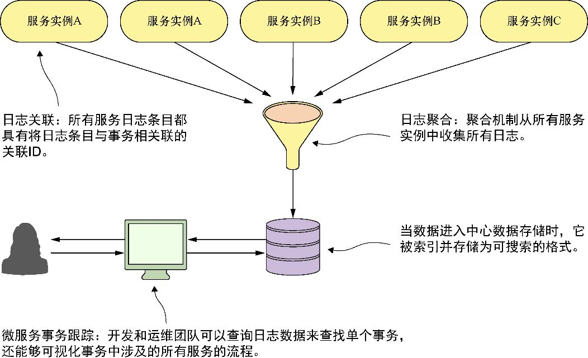

# 一. 云与微服务

> 计算机领域的任何问题都可以通过增加一个间接的中间层来解决

解决什么问题-为什么需要微服务

包含哪些模块-微服务涉及哪些问题

基本使用-

## 1. 概述

## 1.1. 架构发展历史

在微服务的概念逐步形成之前, 绝大部分基于 web 的应用都是使用单体架构来构建的. 虽然应用是作为单个工作单元部署的, 但大多数情况下，会有多个开发团队开发这个应用程序, 每个开发团队负责应用程序的不同部分. 

随着应用的规模和复杂度增长, 各个开发团队的沟通与合作成本并没有减少, 而且, 每当各个团队需要修改代码时, 都需要对整个应用重新构建, 重新测试, 重新部署.

为此, 微服务的概念出现了. 微服务是一个小的, 松耦合的分布式服务, 允许将一个大型的应用, 分解成具有严格职责定义的, 便于管理的组件.

在思考微服务时，一个需要信奉的重要概念就是：分解和分离应用程序的功能，使它们完全彼此独立。将上述的应用程序分解为微服务, 可能像下图所示的样子,

每个功能团队完全拥有自己的服务代码和服务基础设施。他们可以彼此独立地去构建、部署和测试，因为他们的代码、源码控制仓库和基础设施（应用服务器和数据库）现在是完全独立于应用的其他部分的。

微服务架构的特征

- 分解组件, 协同工作
- 独立部署
- 轻量级通讯
- 技术无关
- 分工明确

### 为什么要改变构建应用的方式

现代社会的几乎所有方便都可以通过互联网连接在一起, 原本只服务于当地的公司突然发现, 他们可以接触到全球的客户群, 而更大的客户群带来了全球竞争, 也影响了对系统的要求

- 复杂度上升
- 客户期待更快速的交付
- 性能和可伸缩性
- 高可用

为了满足这些启用, 我们希望能构建一种高可伸缩性和高度冗余的应用程序. 如果将应用分解成可以相互独立构建和部署的小型服务, 那么就将具备以下特性

- 灵活性
- 有弹性
- 可伸缩性

> 小型的, 简单的, 解耦的服务 = 可伸缩的, 有弹性的, 灵活的应用

### 云和微服务

云平台类型

- 基础设施即服务, Iaas
- 平台即服务 PaaS
- 软件即服务 SaaS
- 函数即服务 FaaS
- 容器即服务 CaaS

微服务架构的核心概念之一, 就是每个服务可以被打包和部署为离散的独立制品, 服务实例应该迅速启动, 服务的每一个实例都是完全相同的. 作为微服务的开发人员, 我们需要决定将服务部署到某个具体环境中

- 物理服务器
- 虚拟机镜像 IaaS
- 虚拟容器 CaaS

由于物理服务器的局限性, 开发人员不能快速提高物理服务器的容量, 而且在多个物理服务器之间水平伸缩微服务成本可能会非常高. 

微服务的一大优势就是高弹性, 而云服务供应商允许开发人员在几分钟内快速启动新的虚拟机和容器, 而且当需求下降时, 开发人员可以关闭虚拟服务器而不产生资源浪费或额外的费用. 服务器弹性也意味着应用程序可以更具弹性.

IaaS 能够拥有足够弹性的同时, 比 PaaS 和 FaaS 拥有更多的自由度

### 微服务应用要考虑的问题

尽管构建单个微服务的概念易于理解, 但运行和支持健壮的微服务应用程序, 还需要考虑几个主题

- 大小适当
- 位置透明
- 有弹性
- 可重复
- 可伸缩

- 

## 2. 三大角色

### 2.1. 架构师

架构师在软件项目中的作用是提供待解决问题的工作模式.

架构师的工作是提供脚手架, 软件开发人员将根据这些脚手架构建他们的代码, 使应用程序的所有部件能组合在一起.

在构建微服务架构时, 项目的架构师主要关注以下三个任务:

- 分解业务问题
  - 描述业务问题
  - 注意动词
  - 寻找数据内聚
- 建立服务粒度
  - 开始时粒度大些, 后面再重构成小粒度的服务
  - 重点关注服务如何交互
  - 对着对问题领域的理解不断增长, 服务的职责也会改变
- 定义服务接口
  - 拥抱 REST 理念
  - 使用 URI 来传达意图
  - 请求和响应使用 json
  - 使用 http 状态码来传达结果

### 2.2. 软件开发人员

开发人员需要建立一个实现应用程序中每个微服务的基本模式.

我们希望使用的是一个移除了样板代码的框架, 并且微服务中每个服务都采用相同的布局, 因此可以考虑使用 spring boot 来构建每一个微服务

### 2.3. DevOps 工程师

对于 DevOps 工程师来说, 微服务的设计关乎在投入生产后如何管理服务

- 微服务应该是独立的, 可以独立部署的
- 微服务应该是可配置的
- 微服务实例需要对客户端是透明的, 客户端不需要了解微服务的细节
- 微服务应该传达它的健康信息. 这是云架构的关键部分

以上四条原则, 可以映射到以下运维工作环节

- 服务装配: 打包和部署微服务

  

- 服务引导: 管理微服务的配置

  

- 服务注册/发现: 客户端如何与微服务通信

  

- 服务监控: 传达微服务的健康状况

  

### 2.4. 把视角综合起来

云中的微服务看起来很简单, 但是要想成功, 却需要一个综合的视角, 将架构师,开发人员和 DevOps 工程师的视角融到一起, 形成一个紧密结合的视角.

- 架构师, 专注于业务问题的自然轮廓
- 开发人员, 专注于构建分层服务, 服务中的每一层都有离散的职责
- DevOps, 关注服务的自动化构建和部署, 还要关注如何监控服务的健康状况

## 3. 是否需要使用微服务

微服务架构带来的复杂度

- 构建分布式系统的复杂性
- 服务器散乱
- 应用程序的类型
- 数据事务和一致性

# 二. 微服务模式

## 1. 核心开发模式

- 服务粒度
- 通信协议
- 接口设计
- 配置管理
- 服务之间的事件处理

可以使用 Spring Cloud 的组件来实现

- Spring Boot
- Spring Cloud Config
- Spring Cloud Stream

## 2. 路由模式

- 服务发现
- 服务路由

可以使用 Spring 

- Spring Cloud Netflix Eureka
- Spring Cloud Netflix Zuul

## 3. 客户端弹性模式

- 客户端负载均衡

  客户端缓存着多个服务端的信息, 将请求分发到不同服务端, 避免某个服务端压力过大

- 断路器模式

  某个服务端不健康时, 客户端会绕过该服务端, 使用其他服务端, 而不会重复调用不健康的服务

- 后备模式

  当调用失败时, 后备模式询问是否有可执行的替代方案

- 舱壁模式

  隔离服务端上对不同服务的调用, 确保不健康的服务端不会耗尽客户端的资源

实现组件

- Spring Cloud Netflix Ribbon
- Spring Cloud Netflix Hystrix

## 4. 安全模式

- 验证
- 授权
- 凭据管理和传播

实现组件

- Spring Cloud Security
- OAuth2
- JWT

## 5. 日志记录和跟踪模式

- 日志关联
- 日志聚合
- 微服务跟踪

实现组件

- Spring Cloud Sleuth
- zipkin

## 6. 构建和部署模式

一个常见的问题, **配置漂移**

- 构建和部署管道
- 基础设施即代码
- 不可变服务器
- 凤凰服务器

实现方式

- Travis CI
- Docker
- Gitlab CI/CD
- Github Actions
- Jenkins

# 三. 事务与一致性

cap

分布式事务

# 四. 高可用

服务高可用

网关高可用

配置中心高可用

数据库高可用

集群

主从

 熔断

降级

快速失败

舱壁模式 [聊聊舱壁模式](https://blog.csdn.net/dot_life/article/details/80823272)

让不同任务请求通过自个专门的线程池请求到各自微服务，像舱壁一样对资源进行隔离；  假设这么个场景，在应用中你需要使用REST通过HTTP连接五个不同的微服务，使用一个普通的线程池去维持这些连接，如果五个服务中其中一个服务由于某种原因出现异常，所有的池成员都将精疲力尽的等待服务器响应，为了最大限度地减少的影响，它始终是一个很好的做法，定制个性化服务话服务始终是一个号的做法。这可以减少某个异常影响对其他服务的影响，从而使您的应用程序其他部分继续执行。这种模式俗称的舱壁。
下图描述了实施舱壁的简单的示例场景：在左侧，微服务A，用同一个连接池去请求X和Y两个服务。如果服务X或服务的Y其中任何一个行为异常，这会影响连接池的整体行为。如果舱壁模式实现，如该图所示的右侧，即使微服务X被错误操作，只有池X将受到影响。微服务Y可以继续为应用程序提供服务.

