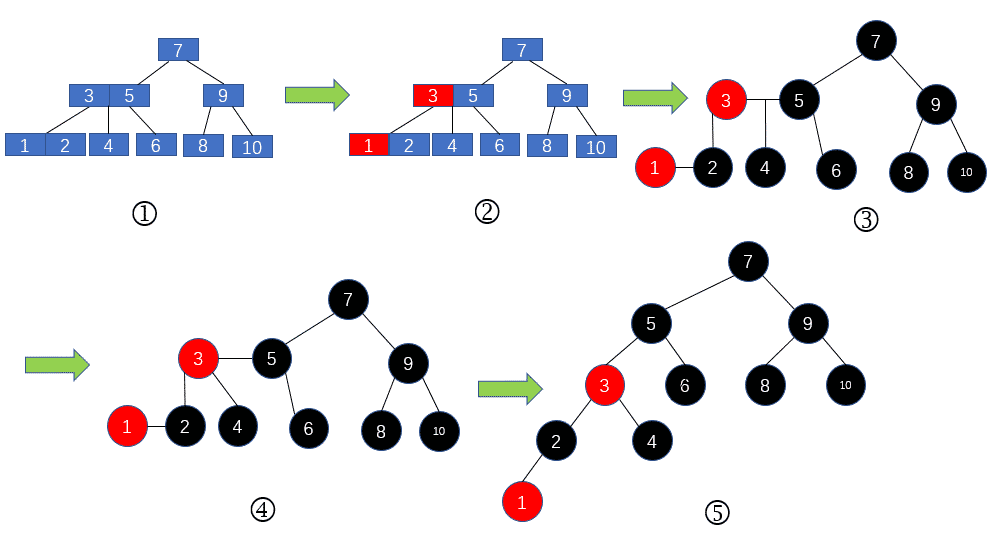
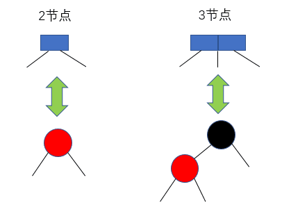
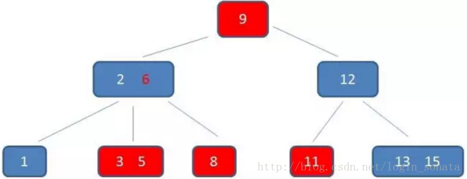

# █ 数据结构基础

# 表, 队列, 栈

## 表 list

将一系列元素依次排列,  形如{A~0~, A~1~, A~2~…A~n-1~} 的数据结构, 称为**表**, 且将表内元素个数称为**表的大小**

表的基本操作

- 添加 `insert`
- 删除 `remove`
- 查找 `findKth`

### 数组 ArrayList

可以用数组来实现表, 适合**顺序插入+随机获取**的场景, 

在数组中, 可以通过数组下标, 在常数时间内定位到指定位置的元素`O(1)`, 适合频繁随机获取元素的场景

但是, 不适合频繁进行随机位置的插入或删除的操作`O(N)`, 需要移动大量的元素

### 链表 LinkedList

如果需要频繁对表进行随机插入或删除, 则使用链表更加合适. 

链表由一系列节点组成, 每个节点包括2部分: **当前节点的数据**+**下一节点的位置**

当需要在表中插入或删除一个元素时, 只需要修改上一节点中维护的下一节点位置即可, 该操作可以在常数时间内完成 `O(1)`

但是, 如果需要获取某个位置的元素时, 需要从链表开头通过一个个元素遍历过去, `O(N)`, 效率较低

- 单链表: 单向链接, 前一节点有后一节点的引用, 可正向遍历, 但无法逆向遍历
- 双链表: 双向连接, 相邻节点持有彼此的引用, 可正向遍历, 也可逆向遍历

## 队列 queue

队列是一种特殊的表, 只允许在表的一端进行添加, 另一端进行删除, 先进先出, FIFO

**基本操作**

- 入队 `enqueue`
- 离队 `dequeue`

**队列实现**

- 链表实现: 持有两端引用的双链表可以很直观地实现队列, 一端负责入队, 另一端负责离队
- 数组实现: 稍微复杂一些, 需要用到**循环数组**

**队列的应用**

多任务排队执行

但应注意, 完全按先到先得的原则让任务进行排队可能是不合适的, 小任务可能会等待太长的时间. 为了提高效率, 多任务调度应该考虑优先完成简单的小任务, 具体的优先调度原则后面再看

## 栈 stack

栈也是一种特殊的表, 比队列更加严格, 只允许在一个位置上进行添加/删除操作, 后进先出, LIFO

- 压栈 `push`
- 弹栈 `pop`
- 查看栈顶 `peek`/`top`

由于栈只能在表的一个端点上操作, 而不论数组表还是链表, 都能在常数时间内完成对端点的操作

- 链表实现, 只需要栈顶到下一层元素位置, 可用单链表实现
- 数组实现, 在数组的基础上维护一个栈顶位置即可, array[top] 即可定位栈顶, 栈操作时修改 top 位置

某些处理器的寄存器提供了自增/自减寻址功能, 将栈操作作为指令系统的一部分, 一条指令即可完成入栈或出栈。

### 栈的应用

平衡符号, 检查成对的符号是否正确

后缀表达式, 逆波兰算法, 可以缓存中间结果

中缀到后缀的转换, 将人们常用的算式表达式, 转换成便于计算机处理的后缀表达式

方法调用, 记录程序的执行调用过程


# 树 Tree

对于大量的输入数据, 表的线性访问时间太慢, 而树这种结构, 其大部分操作的运行时间平均为 `O(logN)`

## 定义

- 一棵树是一些节点的集合, 可以为空, 一棵树由 N 个节点和 N-1 条边组成
- 若不是空集, 则树由一个**根**节点R +若干个非空**子树**组成, 每一棵子树的根r, 都被来自根R 的一条有向**边**所连接
- 每一个子树的根r, 是根R 的儿子; 而根R 是子树的根r的父亲
- 节点间关系: 儿子, 父亲, 兄弟, 孙子, 祖父, 祖先, 真祖先, 后裔, 真后裔
- 叶子节点: 没有子节点的节点
- 路径, 从节点 n~1~ 到 节点 n~2~ 从上往下经过的节点序列, {n~1~, n~2~, n~3~…n~k~}, 共 k 个节点
- 路径的**长度**: 路径经过的边的数量, 从 n~1~ 到 n~k~, k个节点之间有 k-1 条边
- **高度**: **从叶子节点开始往上数**, 某节点到叶子节点的最长的路径长, 
- **深度**: **从根节点开始往下数**, 从根节点到该节点的路径长, 根的深度为0. 

## 树的实现

树的一种实现: 每一个节点除了数据之外, 还有一些指向其他节点的链(不一定是树的边)

```java
class TreeNode {
    Object data;			// 数据
    TreeNode firstChild;	// 指向第一个子节点的链
    TreeNode nextSibling;	// 指向下一个兄弟节点的链, 根节点没有兄弟节点
}
```

## 树的遍历

          1
        /    \
      2        3
     / \      / \
    4   5    6   7

### 广度优先遍历(BFS)

也称为层序遍历(level order), 先遍历完上一层的所有节点, 再遍历下一层次的节点

1, 2, 3, 4, 5, 6, 7

### 深度优先遍历(BFS)

按子树进行遍历, 遍历完一棵子树, 再遍历另一棵子树, 按照子树与父节点的遍历顺序, 可以分为三种

```shell
# 先序遍历(中, 左, 右)
1,2,3,4,3,6,7

# 中序遍历(左, 中, 右)
4,2,5,1,6,3,7

# 后序遍历(左, 右, 中)
4,5,2,6,7,3,1
```

## 二叉树

二叉树是一种特殊的树, 其中每个节点最多有2个子节点, 可以直接存储指向左右子节点的链

```java
class BinaryTreeNode {
    Object element;			// 数据
    BinaryTreeNode left;	// 指向左子节点的链
    BinaryTreeNode right;	// 指向右子节点的链
}
```

一棵平均二叉树的深度要比节点数N小得多, 平均深度`O(√N)`

而特殊的二叉树, 二叉查找树, 其深度的平均值为`O(logN)`

- 满二叉树, 每个节点, 要么是叶子节点, 要么有两个子树
- 完美二叉树, 在不新增层级的前提下, 无法继续添加节点的二叉树
- 完全二叉树, 完美二叉树去掉最下一层的右侧若干个节点的二叉树, 国内也称满二叉树

### 二叉查找树

二叉树的一个重要应用场景是在查找中使用.

二叉查找树是有序的二叉树, **各节点可比较(comparable或自定义的比较方法), 且左子树所有节点<父节点<右子树所有节点**

这意味着对二叉查找树进行中序遍历, 即可得到树中元素的升序排列.

通常, 对二叉查找树的操作都需要借助递归来实现, 但因为其深度的平均值为`O(logN)`, 一般不会出现栈溢出的问题.

### 二叉查找树的操作

- 包含 `contains`
- 最大值 `findMax`
- 最小值 `findMin`
- 插入 `insert`
- 删除 `remove`
  - 叶子节点, 直接删除
  - 单棵子树, 使父节点跳过当前节点, 直接指向子节点
  - 两棵子树, 使用右子树的最小值来替代
- 懒惰删除, 保留节点只标记删除, 适合很少删除节点的场景, 避免了对树的频繁调整

## AVL 树

如果没有特殊的平衡条件, 对二叉查找树的插入/删除操作很容易使二叉树失衡, 退化成链表, 查找效率大大的降低. 实际使用中经常会二叉树的进行平衡调整, 避免节点的深度太深. 

**平衡二叉树**: 要求所有节点的左右子树的高度相等.平衡条件过于严格, 只有完美二叉树(2^N^-1个节点)才能满足, 实际上无法使用

**AVL 树**: 在平衡二叉树的基础上, 放宽了平衡条件, 有以下要求

- 左子树与右子树的高度差不超过1
- 需要在每个节点记录高度信息

### AVL 树的平衡

在 AVL 树中, 要出现高度不平衡, 也就是A点的两棵子树高度差2, 

对于插入新节点时, 可能的情况如下

#### 单旋转

- B节点有子节点1, C没有子节点, 在B的子节点1进行一次插入

  

  ```java
  /*
   * 左子树单旋转, 左子树根节点k1作为新的子树根
   *           k2             k1
   *          /  \           /  \
   *        k1    Z  --->   X   k2
   *      /   \                /  \
   *     X     Y              Y    Z
   */
  ```

- B节点有子节点2, C没有子节点, 在B的子节点2进行一次插入

  
  
  ```java
  /**
   * 右子树单旋转, 左子树根节点作为新的子树根
   *        k1                 k2
   *       /  \               /  \
   *      X   k2     --->   k1    Z
   *         /  \          /  \
   *        Y    Z        X    Y
   */
  ```

#### 双旋转

- C节点有子节点3, B没有子节点, 在C的子节点3进行一次插入

  ```java
  /**
   * 左子树双旋转: 先左子树右侧单旋转, 再本节点左侧单旋转
   *           k3                         k3                        k2
   *          /  \    k1-RIGHT           /  \      k3-LEFT        /   \
   *        k1    D  ----------->       k2   D  ----------->    k1    k3
   *      /   \                       /   \                    / \    / \
   *     A     k2                    k1    C                  A   B  C  D
   *          /  \                  /  \
   *         B    C                A    B
   */
  ```

- C节点有子节点4, B没有子节点, 在C的子节点4进行一次插入

  ```java
  /**
   * 右子树双旋转: 先左子树右侧单旋转, 再本节点左侧单旋转
   *            k1                     k1                          k2
   *           /  \     k3-LEFT       /  \       k1-RIGHT        /   \
   *          A    K3  ----------->  A    K2   ----------->    k1    k3
   *              /  \                   /  \                 / \    / \
   *            k2    D                 B    K3              A   B  C  D
   *           /  \                         /  \
   *          B    C                       C    D
   */
  ```


## 伸展树

伸展树的平衡条件没有AVL树这么严格, 但是它保证了从空树开始连续M次操作最多花费 `O(M*logN)` 时间(摊还时间).

如果任意操作可以有最坏时间界`O(N)`, 但我们要求摊还时间界为`O(M*logN)` 的话, 那么, 当一个节点被操作时, 它就必须被移动. 当需要反复访问访问一个深层次的节点时, 总的时间就可能是`O(M*N)`.

伸展树的基本原则是, 当一个节点被访问, 它就会通过一系列的旋转操作被推到根上. 同时如果一个节点过深, 那么其路径上也存在许多相对较深的节点, 通过重新构造树可以减少这些节点的操作时间. 因此, 在移动被访问节点的过程中, 实际上要对这棵树进行重新平衡. 

而且, 在实际场景中, 当我们访问一个节点后, 很可能在不久后再次访问, 因此伸展树将被访问节点推到根上的做法, 使得伸展树在实际使用中往往比理论的摊还时间还要更快一些.

另外, 伸展树还不要求记录高度和平衡信息, 可以节省空间并简化代码.

### 展开

对目标节点, 递归执行以下展开转换, 即可将其推到根的位置.

#### 单旋转

如果目标节点的上一级就是根, 执行一次单旋转, 使目标节点变成新根

#### 之字形的双旋转

目标节点与上两级节点组成之字形, 则将以祖父节点为根的子树进行双旋转, 使目标节点成为该子树的根

#### 一字型的镜像转换

目标节点与上两级节点组成一字型, 则将以祖父节点为根的子树进行镜像转换, 使目标节点成为该子树的根

### 插入

插入节点时, 将新节点插入到树上, 然后按展开规则, 将新节点推到根上

### 删除

1. 先访问要删除的节点, 使其被推到根上, 去掉这个节点, 此时剩下两个独立的左右子树
2. 访问左子树中的最大值, 使其被推到左子树的根上, 作为整棵树的新根, 且该根没有右子树
3. 将原来的右子树, 作为新根的右子树


## 多路查找树

如果数据不能全部载入内存, 需要从磁盘读取数据, 需要尽可能减少对磁盘的访问.

虽然平衡的二叉查找树(如AVL树)可以提供 O(logN) 的访问速度, 但是对于1千万的数据, logN也需要约25次的磁盘访问, 还是太慢了

为了减少磁盘访问次数, 很直观的想法就是要减少树的层数, 但 AVL 树已经是接近平衡的二叉查找树了, 可见2分支的树不能满足需求. 

为此, 我们需要更多的分支, 多路查找树, 可以快速降低树的层数, 从而减少查询次数. 一个完全二叉树, 高度大约是 log~2~N; 而一个M分支的完全M叉树, 高度大约是 log~M~N.

一个M叉查找树种, 需要 M-1 个关键字来决定选哪个分支, 并且我们希望M叉查找树能以某种方式保持平衡, 不能像二叉树那样退化成链表; 甚至需要更严格的平衡条件, 避免退化成二叉查找树.

## B树

b树（balance tree）和b+树应用在数据库索引，可以认为是m叉的多路平衡查找树, 从理论上讲，二叉树查找速度和比较次数都是最小的，为什么不用二叉树呢？
因为我们要考虑磁盘IO的影响，它相对于内存来说是很慢的。数据库索引是存储在磁盘上的，当数据量大时，就不能把整个索引全部加载到内存了，只能逐一加载每一个磁盘页（对应索引树的节点）。所以我们要减少IO次数，对于树来说，IO次数就是树的高度，而“矮胖”就是b树的特征之一，它的每个节点最多包含m个孩子，m称为b树的阶，m的大小取决于磁盘页的大小。

B树中每个节点最多拥有的儿子数, 称为B树的阶, 一个M阶B树具有以下特点:

1. 定义任意非叶子结点最多只有M个儿子，且`M>2`
2. 根结点的儿子数为`[2, M]`
3. 除根结点以外的非叶子结点的儿子数为`[M/2, M]`，向上取整；
4. 非叶子结点的**关键字个数 = 儿子数-1**；
5. 所有叶子结点位于同一层；
6. k个关键字把节点拆成k+1段，分别指向k+1个儿子，同时满足查找树的大小关系。

## 2-3 树

## 红黑树

红黑树具有以下五条性质

1. 每个节点要么是黑色，要么是红色。 
2. 根节点是黑色。 
3. 每个叶子节点（NIL）是黑色。 
4. 每个红色结点的两个子结点一定都是黑色。 
5. 任意一结点到每个叶子结点的路径都包含数量相同的黑结点。

光看性质, 会很迷惑, 其实, 红黑树是2-3树的变种

那么红黑树与2-3树有什么关系呢？现在我们对2-3树进行改造，改造成一个二叉树: 

1. 对于2节点，保持不变；
2. 对于3节点，我们首先将3节点中左侧的元素标记为红色，如下图2所示。
3. 然后我们将其改造成图3的形式；
4. 再将3节点的位于中间的子节点的父节点设置为父节点中那个红色的节点，如图4的所示；
5. 最后我们将图4的形式改为二叉树的样子，如图5所示。  

图5是不是很熟悉，没错，这就是我们常常提到的大名鼎鼎的红黑树了。  



下面我们参考图4, 回过头再看下红黑树的五条性质。

1. **性质1：每个节点要么是黑色，要么是红色。**

   2-3树中存在2节点和3节点，3节点中左侧的元素便是红色节点，而其他的节点便是黑色节点。 

2. **性质2：根节点是黑色。** 

   在2-3树中，根节点只能是2节点或者3节点，2节点与3节点在红黑树中的等价形式，如下图所示

   显然，无论是哪种情况，根节点都是黑色的。 

   

3. **性质3：每个叶子节点（NIL）是黑色。** 

   这里的叶子节点不是指左右子树为空的那个叶子节点，而是指节点不存在子节点或者为空节点被称作叶子节点。在性质2中我们讨论的根节点是黑色的都是讨论根节点不为空的情况，若红黑树是一个空树，那么根节点自然也是空的叶子节点，这时候叶子节点便必然是黑色的。 

4. **性质4：每个红色结点的两个子结点一定都是黑色。** 

   还是从2-3树的角度来理解，红色节点对应2-3树中3节点左侧的元素，那么它的子节点要么是2节点，要么是3节点。无论是2节点还是3节点对应的节点颜色都是黑色的，这在性质2时已经讨论了。

5.  **性质5：任意一结点到每个叶子结点的路径都包含数量相同的黑结点。** 

   性质5应该是红黑树最重要的一条性质了。2-3树是一颗绝对平衡的树，即2-3树中任意一个节点出发，到达叶子节点后所经过的节点数都是一样的。那么对应到红黑树呢？2-3树中2节点对应到红黑树便是一个黑色的节点，而3节点对应到红黑树是一个红色节点和一个黑色节点。所以，无论是2节点还是3节点，在红黑树中都会对应一个黑色节点。那么2-3树中的绝对平衡，在红黑树中自然就是任意一结点到每个叶子结点的路径都包含数量相同的黑结点了。

Java中的 `TreeSet` 和 `TreeMap` 就的底层, 就是用红黑树来实现


## B+树

B+树是B树的变体, 我们知道总数相同时, 树的分支越多, 树的层数就越低, 需要的磁盘IO 就越少. 为了让B树增加分支, 就需要提高更多的关键字, 因此让中间的索引节点只含关键字, 不含具体数据, 就可以大大增加B树的分支树, 从而减少磁盘IO. 

B+树的优势

- b+树的中间节点不保存数据，所以磁盘页能容纳更多节点元素，更“矮胖”；

- b+树查询必须查找到叶子节点，b树只要匹配到即可不用管元素位置，因此b+树查找更稳定（为什么需要稳定）

- 对于范围查找来说，b+树只需遍历叶子节点链表即可，b树却需要重复地中序遍历，如下两图

  

  

这里介绍一个名为 B+树 的M阶查找树, 具有以下特性:

1. 数据项都存储在叶子节点上
2. 非叶子节点用来定位, 最多存储 M-1 个关键字, 拥有 M 个子树; 第 i 个关键字代表第 i+1 个子树中最小的关键字, 即关键字是分界点
3. 树根要么是一个叶子节点, 要么有 2 ~ M 个子树(除非整棵树不足L条记录)
4. 除树根外的其他非叶子节点, 拥有 M/2 ~ M 个子树(半满)
5. 所有的叶子节点都在相同的深度, 并拥有 L/2 ~ L 条数据记录(除非整棵树不足L条记录)

其中: 

- M: 非叶子节点的分叉数(最大子树个数), 同时是关键字个数+1
- L: 每个叶子节点的容量, 能存储几条数据记录
- 整棵树不足L条记录时, 第3和第5条规则要放宽
- 第4和第5条要求节点半满, 可以保证B+树不会退化成二叉树

在文件系统中, 通常以一个磁盘区块作为一个节点

- 用作非叶子节点: `区块大小 >= 关键字长度*(M - 1) + 区块寻址大小*M `
- 用作叶子节点: `区块大小 >= 数据记录长度*L`

### B+树的插入

插入到未满的节点, 直接插入

插入到已满的节点, 递归向上分裂节点, 最终可能导致树的高度增大

### B+树的删除

删除后仍半满, 直接删除

删除后不半满, 从相邻节点领养, 或者递归地合并相邻节点, 最终可能导致树的高度降低


# 散列 hash

散列表, 可以以常数平均时间`O(1)`执行查找/插入/删除等操作, 但是元素之间是无序的, 不支持如二叉查找树中的 `findMax`, `findMin `以及以线性时间`O(N)`将表打印的操作.

散列表的基础结构, 是一个包含多个元素的, 具有固定大小的数组, 表的大小为 `size`, 每个元素中用来查询定位的关键字被映射到从 `0`到 `size-1` 之间的某个数, 然后将关键字对应的元素放到表中的对应位置(称为“桶”), 这个映射称为"**散列函数**". 

散列表的访问速度, 与散列表中的元素个数多少有关. 我们将散列表中元素个数, 与该表大小的比值称为**装填因子**, 当装填因子达到一定值时, 应该对散列表进行扩容, 将元素重新分配到新表中, 减少散列冲突, 提高访问速度

## 冲突处理

由于关键字有无限可能, 而表的空间是有限的, 肯定会有冲突的可能, 因此, 一个理想的散列函数, 应该尽可能均匀的分配关键字, 减少冲突, 并且在冲突出现的时候进行合适的处理.

### 分离链接法

可以将散列到同一个值的内容, 保存到一个附加的数据结构中, 如双向链表, 每次插入时, 将元素添加到该链表的顶端.

理论上来说, 任意的附加数据结构都可以实现分离链接法. 但通常来说, 我们希望散列冲突尽可能少, 也就是希望散列表足够大且散列足够均匀, 此时, 所有的链表都应该很短, 因此没必要使用太复杂的附加数据结构.

Java中的`HashMap` 和 `HashSet` 就是通过分离链接法来解决冲突, 

- 当同一散列值中的冲突数较小时, HashMap 通过一个附加链表来记录数据;
- 当同一散列值中的冲突数超过8个后, HashMap 会将附加链表转换成红黑树, 增加查找速度
- **闪存散列代码**: 为不可变的`String`缓存了`hashCode`, 可以避免重复计算hash值, 提高了以`String`为key时的访问速度

### 探测散列表

分离链接法需要附加的数据结构, 编码更复杂, 并且在冲突时重新开辟空间也会造成时间开销, 效率不高.

也可以在冲突时, 通过某种方式尝试另外的桶, 直至找到空桶可以存放新的元素.

比如访问一个元素时, h~0~(x), h~1~(x), h~2~(x)…h~i~(x) 相继被尝试, 其中 `h(x) = (hash(x) + f(i)) mod TableSize`, `f(i)` 是冲突解决办法.

#### 局限性

一般来说, 探测散列表的**装填因子不应超过0.5**.

探测散列表**不能直接删除元素**, 因为可能该桶曾发生过冲突, 元素被存到了别的桶, 如果将原始散列值对应的元素删除, 则同一散列值的元素都可能在`contains`时失败, 因此, 探测散列表的删除一般先采取懒惰删除

#### 线性探测法

 `f(i)` 选择使用一个线性函数, 比如`f(i)=i`, 出现冲突时逐渐向后寻找空闲的桶. 只有散列表未满, 总能找到合适的空桶.

但是, 即使表未满, 非空的桶可能连成一个区块, 称为`一次聚集`, 散列到区块中的任何元素, 都需要多次尝试后才能找到新的空桶. 

#### 平方探测法

 `f(i)` 选择使用一个二次函数, 比如`f(i)=i^2`, 出现冲突时逐渐向后寻找空闲的桶. 

#### 双散列

在x上应用第二个散列函数, 如 f(i)=i*hash~2~(x), 但应注意第二个散列函数不能计算得0, 否则会留在原地

## 再散列

如果散列表装得太满, 装填因子过大, 则冲突发生的概率会大大增加, 使访问速度下降, 而且对于开放定址法的探测散列表, 还可能因为找不到合适的空桶而插入失败. 

解决方式: 当装填因子达到指定阈值时, 新建一个两倍大的表, 并且使用一个相关的新的散列函数, 遍历原表将所有元素重新插入到新表中. 这个操作的开销比较大, 运行时间为 `O(N)`.

如果能事先知道需要存储N个数据, 就可以创建一个足够大的散列表, 就不再需要再散列, 避免额外开销.

## 完美散列

- 分离链接法, 下级也是散列表
- 当下级散列表需要存放N个数据时, 该下级散列表的大小为 N^2^

## 布谷鸟散列

- 维护多个散列函数不同的散列表

## 跳房子散列

- 用事先确定的, 对计算机底层体系结构而言是最优的一个常数, 给探测序列的最大长度加一个上界
- 当探测序列中需要很靠后才能找到空位时, 尝试在前面找到一个可移动的元素, 以减少平均查找时间

# 优先队列(堆)

当有多项任务要处理时, 一个简单的方式是按照先后顺序将其添加到队列中, 逐个执行. 但是很多情况下, 这个策略不是最优选择, 比如有时候需要让短任务先执行, 也可能有一些重要任务需要优先执行, 这种时候可以考虑使用**优先队列**(*Priority Queue*)

## 基本操作

优先队列至少要支持以下两种操作

- 插入`insert`: 相当于队列中的“入队”操作
- 删除最小`deleteMin`: 相当于队列中的“出队”操作, 但是需要操作的是优先队列中最小的元素

## 实现方式

可以用多种不同的方式实现优先队列

1. 双端链表
   - 插入: 总是插入到表头, `O(1)`
   - 删除: 遍历链表, 找到并删除最小元素, `O(N)`
2. 有序链表, 保持链表有序
   - 插入: 按元素顺序插入到指定位置 `O(N)`
   - 删除: 删除表头的元素 `O(1)`
3. 二叉查找树, 插入和删除都是 `O(logN)`

## 二叉堆

优先队列最普遍的实现方式是一种叫二叉堆(binary heap)的结构, 当“堆”这个词出现在优先队列的上下文中时, 都是指二叉堆.

类似于AVL树操作后需要重新平衡, 对堆进行操作后也可能需要调整以满足堆的性质. 二叉堆具有以下特性,

- 结构性质
  - 是一棵被完全填满的二叉树, 除了底层(从左到右填入), 这样的二叉树又叫“完全二叉树”
  - 由于完全二叉树的满编特性, 可以通过数组来表示, 而不需使用链(指针)
  - 对于任意位置`i`的元素, 其左儿子在`2i`, 右儿子在`2i+1`, 父节点在`i/2`
- 堆序性质
  - 由于我们需要快速找到最小元, 因此将最小元放在根上
  - 考虑到子树也是一个堆, 则任意节点都应小于它的所有后裔
  - 类似的, 也可以定义逆序的max堆, 根上的元素是最大的
  - 堆可以用来找最大值或最小值, 但需要提前决定

### 插入

1. 先在堆末尾的可用位置创建一个空穴, 作为待插入的位置
2. 与父节点比较大小,
   - 若新元素大于父节点元素, 插入完成
   - 若新元素小于父节点元素, 将父节点的元素移到空穴中, 原父节点成为新的空穴
3. 继续与上一级比较, 直到找到空穴合适的位置, 将新元素插入

这种操作叫做**上滤**. 也可以先插入然后与父节点交换的方式来实现, 但交换需要3次赋值. 当需要上滤d层时, 交换需要3d次赋值, 移动空穴则只需要d+1次赋值.

### 删除

1. 找到堆中的最后一个元素, 尝试将它移动到堆中合适的位置
2. 删除根元素, 产生一个空穴
3. 堆末元素与空穴的左右子树比较大小
   - 若堆末元素比左右子树小, 移动到空穴中, 删除完成
   - 若堆末元素不是最小, 将左右子树中较小的值放到父节点的空穴中, 使得空穴下移
4. 当空穴没有子节点时, 将堆末元素放到空穴中

这种操作叫做**下滤**. 类似的, 可以通过移动空穴, 避免不必要的交换操作

### java 中的优先队列

在 java 1.5 之后, 提供了泛型类 PriorityQueue, 提供了基于二叉堆(数组实现)的优先队列的基本操作

### 应用场景

优先队列可以迅速找到一组数据中间最大/最小的一个, 但是又不必花费过多的精力维护全局有序.

在以下场景中, 可以考虑使用优先队列(二叉堆)来处理

1. 寻找第K个元素(单堆)

   - 将所有元素添加到堆中, 则第 k 次取出的就是要求的第 k 个元素 `O(N*logN)`
   - 先取出k个元素构造一个堆, 后续元素与堆最小元素比较, 更新堆, 最后堆顶就是要求的值 `O(N*logk)`

2. 堆排序

   将所有元素添加到堆中, 依次取出并记录所有元素, 即可完成对数据的排序

3. 双堆

## 堆的其他操作

- 降低关键字的值`decreseKey`

- 增加关键字的值`increaseKey`

- 删除`delete`

- 构建堆`buildHeap`

- 合并`merge`

  

## 其他优先队列

### d-堆

与二叉堆类似, 但每个节点有d个子节点, 因此二叉堆也是2-堆

堆最大的缺点是: 将两个堆合并是非常困难的操作

### 基于合并的堆

对于二叉堆, 将两个堆合并成一个, 是很困难的操作

而以下几种以**合并**为基本操作的数据结构, 可以提供`O(logN)`的合并操作

#### 左式堆

考虑到合并两个堆的效率, 可以考虑左式堆(leftist heap)

左式堆像二叉堆那样具有结构性和堆序性, 区别在于左式堆不是理想平衡的, 实际上趋向于非常不平衡

- 零路径长 `npl`: 一个节点X, 到其一个未满的后代节点的最短路径长

  一个未满的节点, 其零路径长 npl = 0

  一个 null 节点, 零路径长 npl = -1

  任意节点的零路径长, 等于左右子节点零路径长的最小值加1, npl = min(npl(左), npl(右)) + 1

- 左倾: 对于任意节点X, 左儿子的零路径长应 >= 右儿子的零路径长

  该性质使堆倾向于在左侧增加深度, 这有利于合并操作

左式堆的操作, 可以认为是基于两个堆的合并操作

- 插入一个节点: 将新元素看做单节点堆, 与原堆合并
- 删除堆顶: 删除根节点, 合并左右两个子堆

#### 斜堆

斜堆 skew heap

#### 二项队列

一个二项队列(binomial queue), 不是一个堆序的树, 而是包含多个堆序的树的集合, 称为森林(forest)

每一棵堆序树, 都是有约束的形式, 称为二项树(binomial tree)

每一个高度上, 至多存在一棵二项树

- 高度为0的二项树, 是一个单节点的树

- 高度为k的二项树, 是将一棵B~k-1~附加到另一棵B~k-1~的根上而构成, 恰好有2^k^个节点

- 一个具有k个节点的二项队列, 将k转换成二进制位, 某一位为1时即表示该二项队列包含了对应高度的二项树

  比如 k = 13, 二进制位为 1101, 则该二项队列由 B~3~, B~2~, B~0~ 组成, 没有B~1~

##### 合并

类似于二进制加法中的处理, 从高度最低的树开始, 逐渐合并同级的树, 

- 若没有其他同级的树, 该树成为最终二项队列中的一部分
- 若有其他同级的树, 继续合并成更高级的树

##### 删除

1. 在原二项队列H中找到具有最小根的二项树B~k~, 将B~k~从H中去掉, 剩下的部分组成 H~1~
2. 将B~k~的根元素去掉, 得到下级的多个二项树, 这些二项树组成了二项队列 H~2~
3. 合并 H~1~ 和 H~2~

# 不相交集

# 图论

## 基本概念

**图 (*graph*)**, 由**边 (*edge*) 的集合**`E` 和**顶点 (*vertex*) 的集合**`V` 组成, 表示为 `G=(V,E)`.

- **边, 也称为弧(*arc*)**: 两个顶点组成的点对 `(v, w)`, 其中`v, w ∈ V`
  - **环(loop)**: 若图含有一个顶点到它自身的边 `(v, v)`, 该边称为环, 一般讨论的图都是无环的
  - **权(weight), 也称为值(cost)**: 部分图中的边具有特定的数值
- **有向图(digraph)**: 如果点对是有序的, `(v,w) != (w,v)` 时, 则图是有向的
- **无向图**: 如果点对是无序的, `(v,w) == (w,v)` 时, 则图是无向的

- **邻接 (adjacent)**: 顶点 `v` 和 `w` 邻接 等价于 存在边/点对`(v, w) ∈ E`
  - 在无向图中, 边 `(v,w)` 等价于边 `(w,v)`, 则v与w邻接, w也与v邻接
- **完全图(complete graph)**: 图中每一对顶点都有一条边(都是邻接的) 
- **路径(path)**: 连接多个顶点的多条边, 由顶点序列 w~1~, w~2~,w~3~…w~n~ 使得 `(w~i~, w~i+1~) ∈ E`
  - **路径的长(length)**: 路径中包含的边数
  - **自身路径**: 一个顶点到它自身也可视为一条路径, 长=0
  - **简单路径**: 途径的所有顶点都是互异的, 但第一个顶点和最后一个顶点可能相同(组成圈)
  - **圈(cycle)**: 满足w~1~=w~n~, 且长大于0的一条路径, 如果该路径是简单路径, 则是**简单圈**
    - 无向图中, `(v, w)` 和 `(w, v)` 是同一条边, 路径 v, w, v 不是一个圈
    - 有向图中, `(v, w)` 和 `(w, v)` 是不同的边, 路径 v, w, v 组成一个圈
    - **有向无圈图(directed acyclic graph, DAG)**, 不含圈的有向图
- **连通性(connected)**
  - 无向图中, 若每个顶点到其他任意顶点都存在路径, 称无向图是连通的
  - **强连通**: 有向图中, 每个顶点到其他任意顶点都存在路径
  - **弱连通**: 有向图不是强连通, 但其基础图(对应的无向图是连通的

## 图的表示

考虑有向图, 无向图可当成是每一条边都是双向的有向图, 采取类似方式处理.

### 邻接矩阵

使用一个二维数组:

- 若边 `(v, w)` 存在, 记 `A[v][w] = true`, 否则记为 `A[v][w] = false`
- 若边 `(v, w)` 有权值k, 记 `A[v][w] = k`, 否则记为 `A[v][w] = 无意义数据`

结构简单, 但空间需求为 **θ( |V| ^2^)**.

在大部分图中, 顶点并非两两邻接, 因此邻接矩阵中有大量的位置用来表示边不存在, 空间利用率很低.

### 邻接表(类表示)

如果图不是**稠密**的(任意两点都邻接), 即图是**稀疏**的, 更好的表示方式是只记录存在的边, 可以使用邻接表:

**邻接表是表示图的标准方式**:

- 对每一个顶点, 用一个表存放所有与之邻接的顶点
- 对于无向图, 每条边 `(v, w)` 出现在顶点 v 和 w 的表中, 需要双倍的空间

此时图只需要线性空间, 为 **O( |E| + |V| )**

```java
// 第一种方式, 顶点(Vertex)为key, 该顶点的邻接表 List<Vertex> 为 value 放到映射中
Map<Vertex, List<Vertex>> graph;

// 第二种方式, 顶点的名字(String)为key, 顶点(Vertex)为value, 顶点的邻接表作为Vertex类的一个成员属性
Map<String, Vertex> graph;
class Vertex {
  // 顶点自身的名字
  String name;
  // 该顶点的邻接表
  List<Vertex> linkedVertex;
}
```

### 邻接表(链式前向星)

这是一种在图论中十分常见的存图方式，与**数组存储单链表**的实现一致（**头插法**: 每次在链表头部插入）。

这种存图方式又叫**「链式前向星存图」**。

这种方式需要多个数组配合, 如下所示

```java
// 其中 N 为节点数, M = 边的数量
int idx;								// 是用来对边进行编号, 表示下一条边的下标
int[] he = new int[N]; 	// headEdge, 节点数组, he[a] 表示a节点最后一次记录的边序号
int[] e = new int[M];		// edge, 边数组, e[i]表示图中第i条边指向的节点
int[] w = new int[M];		// weight, 权重数组, 记录边的权重
int[] ne = new int[M];	// nextEdge, 下一条边数组, ne[i] 表示与第i条边同起点的下一条边
```

要将一条边添加到图中, 先将边的信息记录到各个数组, 然后将边序号添加到 `he` 数组, 再修改 `idx` 变量备用

```java
void add(int a, int b, int c) {
  // 将边的信息添加到对应数组
  e[idx] = b;				// 边的终点信息
  w[idx] = c;				// 边的权重信息
  ne[idx] = he[a];	// 记录前一条边的边序号
  he[a] = idx;			// 将新边的边序号添加到起点数组
  
  // 修改边的编号, 留待下一条边使用
  idx++;						
}
```

获取某节点的邻接表, 先从 `he` 数组获取该节点出发的最后一条边的边序号`i`, 通过这个边序号获取边的相关信息

```java
// 从 he 数组获取从a节点出发的最后一条边的边序号i
//      根据边序号i, 从 e[i] 获取该边指向的节点
//      根据边序号i, 从 w[i] 获取该边的权重
//      根据边序号i, 从 ne[i] 获取与该边同出发点的下一条边
for (int i = he[a]; i != -1; i = ne[i]) {
  	// 存在由 a 指向 b 的边，权重为 c
    int b = e[i], c = w[i]; 
}
```

## 拓扑排序

**拓扑排序**是对有向无圈图的顶点的一种排序(遍历), 如果存在一条从 v~a~ 到 v~b~ 的路径, 那么 v~b~ 在 v~a~ 的后面

- 如果图是有圈的, 则无法使用拓扑排序
- 由于图中可有多条路径, 拓扑排序不唯一

拓扑排序的方法:

1. 找到一个没有入边的顶点, **输出该顶点**, 删除该顶点与其所有出边
2. 对图中剩余部分重复上一步操作

## 最短路径算法

经常需要在一个图中计算从A点到B点的最短路径, 

对于一个赋权图: 每条边 (v~i~, v~j~) 具有权值ci,j, 则一条路径v~1~v~2~v~3~…v~n~ 的和 **SUM(c~i,j~)**, 称为**赋权路径长**, 路径中的边的条数, 称为**无权路经长**. 

显然, 无权路经长是赋权路径长的特殊情形, 可以认为每条边的权都等于1.

一般来说, 若没有特殊说明, 当图是赋权图, 则所求的最短路径就是指最短的赋权路径长.

如果赋权图中, 权值为负数的边会给最小路径问题带来额外的问题. 

- 如果图中存在**负值圈** (赋权路经长为负值的圈), 最短路径问题就是不确定的, 因为可以无限次地进入负值圈. 
- 当不存在负值圈时, 点s到自身的最短路径长为0

### 无权最短路径

要求从a点到b点的最短路径, 通常采用**广度优先搜索(breadth-first search, BFS)**方式, 按层处理顶点, 距起点越近的节点越先被处理. 这与树的层序遍历很相似.

1. 选中起点A, 标记到A点的最短路径为0
2. 获取所有与A邻接的点集E~1~, 标记 A到这些点的最短路径是1
3. 继续获取与点集E~1~中所有点邻接且为标记最短路径的点集E~2~, 标记 A 到点集E2 的最短路径为2
4. 继续获取与点集 E~i~ 邻接且未标记的点集 Ei+1, 标记最短路径为 i+1
5. 直至计算完 A 到图中所有点的最短路径长

编码实现时, 我们需要关注以下几个信息, 

- Known, 节点是否可以到达, 是否已经找到从A点过来的最短路径
- d~v~: 从起点过来的最短路径
- p~v~: 簿记变量, 记录从A点过来路径中的上一个节点, 使我们能够得到完整的路径

### Dijkstra算法

对于无负边的赋权图, 一个经典的方法是 dijkstra 迪杰斯特拉算法, 这也是一个经典的贪心算法

求解过程分成多个阶段

每个阶段都获取当前未知节点中的路径最小的节点

### 含负值边无负值圈的最小路径算法

与 Dijkstra 算法相似, 但是每个阶段不要求取未知顶点中路径最小的, 而是通过一个队列, 每次更新dw 时, 将对应的顶点都添加到队列中, 即每个顶点被更新时, 都要进一步地更新该节点的邻接点, 直到没有顶点需要被更新

## 无圈图

### 最小路径-改进的Dijkstra

如果已知图是无圈的, 可以通过改进节点选取法则, 来改进 Dijkstra 算法

新法则是以拓扑顺序选择顶点

### 最长路径

对于无圈图, 另一种重要场景是求最长路径

比如一个包含多条并行路线的项目, 最快什么时候能完成, 此时就需要找出各路线中最长的一条, 称为**关键路径分析法**, 可以用一个无圈图来描述需要完成的动作以及完成步骤所需要的时间, 称为**动作节点图**

- 关键路径: 决定项目最早完成时间的路径, 称为关键路径
- 松弛时间: 如果一个节点不是关键路径上的节点, 则可能该节点可以稍微延期而不影响项目整体完成时间, 此时可延迟的时间称为松弛时间

## 网络流问题

- 图
- 流图
- 残余图
- 增广路径

## 最小生成树

## 深度优先搜索

### 无向图

### 双连通性

### 欧拉回路/环游

### 哈米尔顿圈

### 有向图

## NP完全性

