# 算法设计技巧

## 递归

编写递归方法时, 应注意以下几点

1. **基准情形**, 必须提供基准情形, 能直接得到结果, 不需要往下递归
2. **不断推进**, 对于需要进行递归的情形, 每一次递归都要朝着一种基准情形推进
3. **设计法则**, 假设所有递归调用都能运行
4. **合成效益法则**, 求解一个问题的同一实例时, 尽量不在不同的递归层数中做相同的工作

*合成效益法则, 是避免重复工作, 提升循环/递归算法效率的一个关键.*(即**记忆化搜索**)

```
举例来说, 对数列 An = n, 求前n项和Sn的数列时, 可能会有这种做法
S1 = 1;
S2 = 1+2;
S3 = 1+2+3;
...
每次计算 Sn 时, 都重复计算了前面n-1项的和, 根据合成效益法则, 我们应该避免这种重复操作, 可以直接使用前一个结果, 即
S1 = 1;
S2 = S1 + 2;
S3 = S2 + 3;
...
```

| 题目                                                         | 难度   | 备注 |
| ------------------------------------------------------------ | ------ | ---- |
| [21. Merge Two Sorted Lists](https://leetcode-cn.com/problems/merge-two-sorted-lists/) | 🟢简单🆗 |      |
| [206. Reverse Linked List](https://leetcode-cn.com/problems/reverse-linked-list/) | 🟢简单🆗 |      |
| [77. Combinations](https://leetcode-cn.com/problems/combinations/) | 🟡中等🆗 |      |
| [46. Permutations](https://leetcode-cn.com/problems/permutations/) | 🟡中等🆗 |      |
| [784. Letter Case Permutation](https://leetcode-cn.com/problems/letter-case-permutation/) | 🟡中等🆗 |      |
| [450. Delete Node in a BST](https://leetcode.cn/problems/delete-node-in-a-bst/) | 🟡中等🆗 |      |

### 尾递归

尾递归是这样一种情况: 在递归算法中的最后一步才进行递归调用, 这种结构通常可以通过将代码放到一个 while 循环结构中, 并用一次赋值替代递归方法参数, 从而消除这种不必要的递归.

不恰当的递归可能会造成栈空间耗尽, 使程序被错误的终止.

## 动态规划 DP

### 记忆化搜索

很多问题可以通过**递推方式**求解, 而数学上的递推公式, 都可以**直接转换成递归算法**. 但问题是, 计算机在处理递归的时候, 往往会导致大量的重复计算, 违反了"合成效益法则". 

在递归运算时, 可能会重复计算之前已经处理过的结果, 为了避免重复计算, 可以用一个辅助的数据结构将其中间结果缓存起来, 在进入递归方法后, 先检查是否有缓存结果, 如果曾经处理过同样的问题, 可以直接返回结果, 避免重复计算

这种通过**辅助的数据结构**, 在递归过程中**记录中间结果**的方式, 称为**记忆化搜索**

### 动态规划

实际上, 任何基于递归的**记忆化搜索**, 都能改成非递归的形式, 即循环+递推公式的**动态规划**

基于记忆化搜索,, 我们可以进一步**将递归改写成循环**

一般地, 动态规划问题需要以下两部分

1. 确定状态定义, 明确自变量与因变量

   其实就是在 dfs 递归时, 记忆化搜索依赖的缓存器

2. 确定状态转移方程(递推公式), 如果根据已知状态获取下一个状态

   根据 dfs 递归时的逻辑, 转换成状态的递推方式

如果通过整理思路, 可以定义出一个 dfs 函数, 那么基于这个 dfs 函数的入参和出参, 可以很容易的将其转化成动态规划所需要的状态定义+状态转移方程:

1. 从 DFS 方法签名出发。分析哪些入参是可变的，将其作为 DP 数组的维度；将返回值作为 DP 数组的存储值。
2. 从 DFS 的主逻辑可以抽象中单个状态的计算方法。

参考:

[宫水三叶-1575题的记忆化搜索解法](https://mp.weixin.qq.com/s?__biz=MzU4NDE3MTEyMA==&mid=2247485297&idx=1&sn=5ee4ce31c42d368af0653f60aa263c82&chksm=fd9cac6ecaeb25787e6da90423c5467e1679da0a8aaf1a3445475199a8f148d8629e851fea57&scene=178&cur_album_id=1748759632187047943#rd)

[宫水三叶-1575题, 从记忆化搜索到动态规划](https://mp.weixin.qq.com/s?__biz=MzU4NDE3MTEyMA==&mid=2247485319&idx=1&sn=95a3dc9c97ca57185de792ca70924afe&chksm=fd9cac98caeb258ebea466f59378670a90af1cb3015ae70922e1d04ac711a5b8d8d853ac5e7d&scene=178&cur_album_id=1748759632187047943#rd)

### 空间优化

在动态规划中, 我们使用了辅助的数据结构来记录中间数据, 但可能某些数据用过一次后就不再需要, 比如在矩阵或多维数组中, 如果计算一行/列的数据只需要上一行/上一列的运算结果, 而不需要更前面的中间结果时, 就可以考虑只保留将会被使用的那部分数据, 可以大大地降级空间规模

比如 *120.三角形最小路径和* 中, 计算每行最小路径和的时候, 只需要上一行的数据, 而不需要更前面的数据, 因此可以滚动使用两个数组, 只记录上一行与当前行的数据.

### 例题-路径问题

| 题目                                                         | 难度   | 备注   |
| ------------------------------------------------------------ | ------ | ------ |
| [62. Unique Paths(不同路径)](https://leetcode.cn/problems/unique-paths/) | 🟡中等🆗 |        |
| [63. Unique Paths II(不同路径2)](https://leetcode.cn/problems/unique-paths-ii/) | 🟡中等🆗 |        |
| [64. Minimum Path Sum(最小路径和)](https://leetcode.cn/problems/minimum-path-sum/) | 🟡中等🆗 |        |
| [120. Triangle(三角形最小路径和)](https://leetcode-cn.com/problems/triangle/) | 🟡中等🆗 |        |
| [931. Minimum Falling Path Sum(下降路径最小和)](https://leetcode.cn/problems/minimum-falling-path-sum/) | 🟡中等🆗 |        |
| [1289. Minimum Falling Path Sum II(下降路径最小和2)](https://leetcode.cn/problems/minimum-falling-path-sum-ii/) | 🔴困难🆗 |        |
| [70. Climbing Stairs](https://leetcode-cn.com/problems/climbing-stairs/) | 🟢简单🆗 |        |
| [198. House Robber](https://leetcode-cn.com/problems/house-robber/) | 🟡中等🆗 |        |
| [1575. Count All Possible Routes(统计所有可行路径)](https://leetcode.cn/problems/count-all-possible-routes/) | 🔴困难🆗 | 太难了 |

[62. Unique Paths(不同路径)](https://leetcode.cn/problems/unique-paths/)

由于每次只能向右或向下移动, 则每个节点的只能从左侧或上方的格子过来, 则到达每个格子的可能路径数, 等于左侧格子路径数+上方格子路径数之和

设 `f[i][j]` 是 格子(i,j)的可能路径数, 有以下递归关系: `f[i][j] = f[i][j-1] + f[i-1][j]`

[63. Unique Paths II(不同路径2)](https://leetcode.cn/problems/unique-paths-ii/)

与 62 题类似, 只是有障碍物. 因为障碍物无法到达, 也无法为后续格子提供可能性, 因此我们可以判断, 如果该格子为障碍物, 就将其路径数设为0

[64. Minimum Path Sum(最小路径和)](https://leetcode.cn/problems/minimum-path-sum/)

与 62 题类似, 考虑每个格子只能从左侧/上面的格子过来, 到达每个格子的最小路径和是左侧格子和上侧格子中较小者+当前格子的数, 

即 `f[i][j] = min(f[i][j-1], f[i-1][j]) + grid[i][j]`

[120. Triangle(三角形最小路径和)](https://leetcode-cn.com/problems/triangle/)

与64类似, 每个节点的最小路径和, 等于两肩上节点的最小路经和的较小者加上本节点大小

即 `f[i][j] = min(f[i-1][j-1], f[i-1][j]) + triangle[i][j]`

[931. Minimum Falling Path Sum(下降路径最小和)](https://leetcode.cn/problems/minimum-falling-path-sum/)

每一个节点的下降序列和, 可能来自上一行相邻的三个元素, 

即有递推关系 `f[i][j] = min(f[i-1][j-1], f[i-1][j], f[i-1][j+1]) + matrix[i][j]`

[1289. Minimum Falling Path Sum II(下降路径最小和2)](https://leetcode.cn/problems/minimum-falling-path-sum-ii/)

每一个节点的下降序列和, 可能来自上一行的最小值`lastMin`或次小值`lastMin2`, 

即有递推关系 `f[i][j] = j == lastMin所在列 ? lastMin2 + matrix[i][j] : lastMin + matrix[i][j]`

[1575. Count All Possible Routes(统计所有可行路径)](https://leetcode.cn/problems/count-all-possible-routes/)

太难了, 不会做, 还以为找到了解题秘籍


### 例题-0/1背包

经典题目：

0/1 Knapsack (medium)

Equal Subset Sum Partition (medium)

Subset Sum (medium)

Minimum Subset Sum Difference (hard)

## 分治算法

## 广度优先 BFS

如树的层序遍历, 就是广度优先搜索方法指导下的遍历方式

一般来说在找最短路径的时候使用 BFS，其他时候还是 DFS 使用得多一些（主要是递归代码好写）。

### 双向bfs

[宫水三叶-双向BFS缩小搜索空间](https://mp.weixin.qq.com/s?__biz=MzU4NDE3MTEyMA==&mid=2247486981&idx=1&sn=045ea6c880080fea1ce807794ccff69b&chksm=fd9ca51acaeb2c0c83d13e3b2a5196895d1a1b44f8981cc3efad9d6a2af158267010646cc262&scene=178&cur_album_id=1917113998693449732#rd)

在图论问题中, 如果通过 bfs 求解, 随着搜索层数的增加, 很容易出现搜索空间爆炸的情况, 

**双向 BFS 也有局限，因为你必须知道终点在哪里**

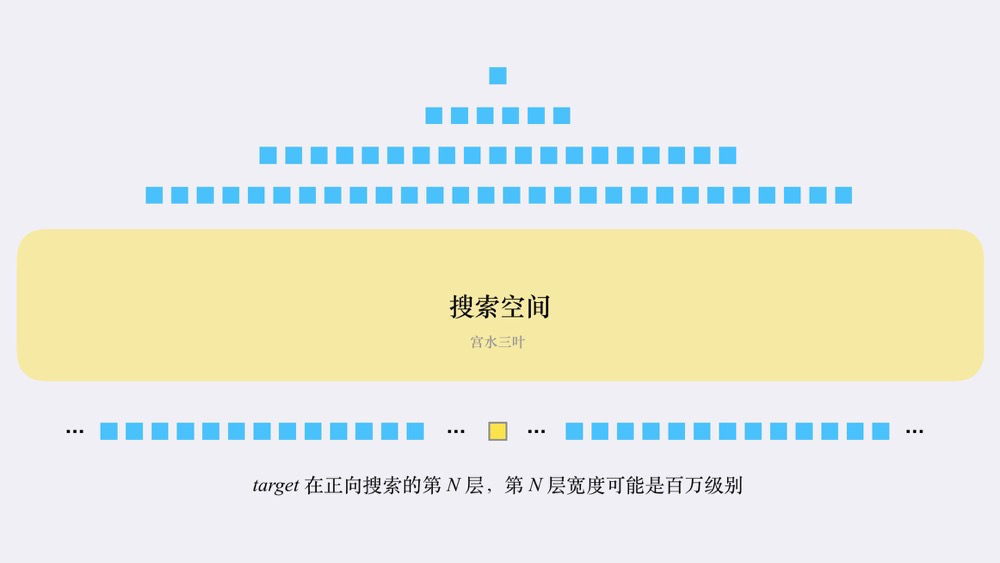

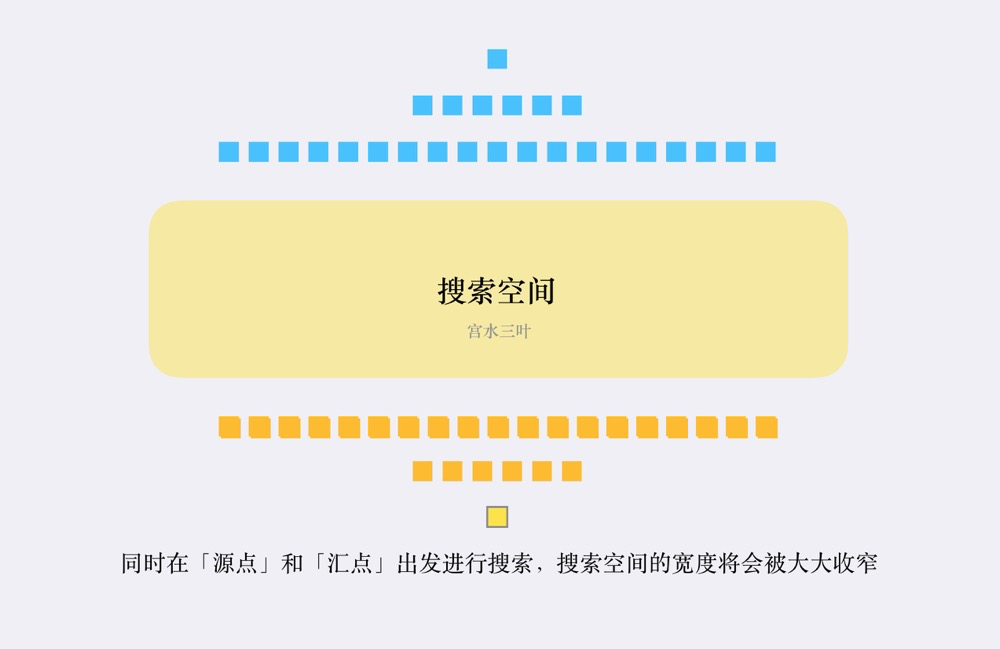

## 深度优先 DFS

在图相关问题中(广义的图, 包括树/矩阵等), 如果需要获取某条路径或者需要获取所有路径时, 就会用到深度优先搜索/遍历

如树的深度优先遍历, 包括先序/中序/后序遍历

深度优先**遍历**的伪代码结构如下

```java
void dfs(路径, 选择列表, 结果集) {
    // 确定基本情况和结束条件
    if (满足结束条件) {
        结果集.add(路径);
        return;
    }

    // 遍历所有选项
    for (选择 in 选择列表) {
        做选择;
        dfs(路径’, 选择列表, 结果集);
        撤销选择;
    }
}
```

## 回溯算法

对于**多次选择的问题**(比如排列组合), 所有可能的路径构成一个树状的解空间, 回溯算法是这样一种做法:

1. 每一步做出一个选择, 判断是否满足要求
2. **前进**: 如果满足要求, 暂时采纳, 进行下一步的选择
3. **回溯**: 如果不满足要求, 退回上一步, 重新做出选择
4. 直到找到答案, 或者尝试完所有可能, 结束算法

回溯算法其实是穷举搜索的一种实现方式, 但是穷举的性能一般都不太理想, 因此回溯算法在尝试所有可能性时, 可能会根据一些限制条件, 若发现当前分支的后续节点是否满足要求, 此时直接放弃当前分支的后续尝试,  从而减少了尝试次数, 达到性能优化的结果, 这种减少解空间的方式称为“**裁剪**”或"**剪枝**".

### 回溯算法与DFS

回溯算法也是尽可能地完成一条路径, 只是发现不满足的时候可以提前返回. 如果回溯算法执行过程中, 未经历剪枝回溯, 实际上就等价于对解集树的一次前序遍历, 因此, 回溯算法相当于 DFS 思想指导下的一种实现方法, 和DFS的关系可以理解为

>  回溯算法 = 树的深度优先搜索 + 剪枝函数

但区别在于, 回溯算法只适合应用在树上(指解空间是树, 原始数据可以不是树), 而 DFS 作为一种搜索算法, 可以用在其他更广泛的场景中, 比如图, 矩阵等

## 贪婪算法

分阶段地解决问题, 在每个阶段, 都认为所做的决定是最好的, 意味着选择的是**局部最优**

当算法结束时, 我们希望局部最优就是全局最优, 但这并不总是成立.

如果不要求绝对的最佳答案, 贪婪算法往往也能给出一个可接受的次优解

- Dijkstra 迪杰斯特拉算法: 解决无负值边的赋权图最短路径问题
- Prim 普里姆算法: 解决最小生成树问题
- Kruskal 克鲁斯卡尔算法: 解决最小生成树问题

| 题目                                                         | 难度   | 备注     |
| ------------------------------------------------------------ | ------ | -------- |
| [53. Maximum Subarray(最大子数组和)](https://leetcode-cn.com/problems/maximum-subarray/) | 🟢简单🆗 | 贪心算法 |
|                                                              |        |          |
|                                                              |        |          |

## 位运算


| 题目                                                         | 难度   | 备注 |
| ------------------------------------------------------------ | ------ | ---- |
| [231. Power of Two](https://leetcode-cn.com/problems/power-of-two/) | 🟢简单🆗 |      |
| [191. Number of 1 Bits](https://leetcode-cn.com/problems/number-of-1-bits/) | 🟢简单🆗 |      |
| [190. Reverse Bits](https://leetcode-cn.com/problems/reverse-bits/) | 🟢简单🆗 |      |
| [136. Single Number](https://leetcode-cn.com/problems/single-number/) | 🟢简单🆗 | 异或 |

## 随机化算法

## 单调队列

## 单调栈

单调栈是特殊的栈, 分成单调递增栈/单调递减栈(从栈顶到栈底)

- 递增栈: 从栈顶到栈底单调递增, 栈顶元素最小
- 递减栈: 从栈顶到栈底单调递减, 栈顶元素最大

通常用来寻找数组中每个元素的最近一个更大/更小元素, 使用时可以以正序或逆序地方式构造单调栈

| 题目                                                         | 难度   | 备注         |
| ------------------------------------------------------------ | ------ | ------------ |
| [739. Daily Temperatures(每日温度)](https://leetcode.cn/problems/daily-temperatures/) | 🟡中等🆗 | 华为od机试题 |
| [496. Next Greater Element I(下一个更大元素)](https://leetcode.cn/problems/next-greater-element-i/) | 🟢简单🆗 | 先预处理     |
|                                                              |        |              |


## 线段树

## 前缀和

涉及到数组/矩阵中某个区间的统计计算, 通常可以使用前缀和来简化处理, 降低区间统计的时间复杂度。

求解前缀和数组的过程, 则可基于动态规划思想的递推关系进行计算.

举个例子：给定` n`个数，然后进行`m`次区间内统计查询, 如区间求和/统计个数等。

如果用暴力写法，那每次查询都需要遍历区间, 从区间左端点到区间右端点进行统计，时间复杂度较大。

这种时候就可以预先求出该数组的一维前缀和, 每次查询可以直接获取两端点前缀和之差。

- **一维前缀和**

  对于数列 x~n~, 对应前缀和即数列求和 y~n~, 

  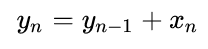

  ```java
  int n = x.length;
  int[] y = new int[n];
  for(int i = 0; i < n; i++) {
      if (i == 0) {
          y[i]=x[i]; 
      } else {
          y[i] = y[i-1] + x[i];
      }
  }
  ```

  结合前面避免越界/减少分类讨论的技巧, 前缀和数组可以定义成比原始数组稍大

  ```java
  int n = x.length;
  int[] y = new int[n + 1];
  for(int i = 1; i <= n;  i++) {
      y[i] = y[i-1] + x[i-1];
  }
  ```

- 二维前缀和

  二维前缀和实际上就是一个矩阵内值的和，而矩阵又可以由两个行数或列数少一的子矩阵组合后，删去重合部分再加上右下角的值来构成

  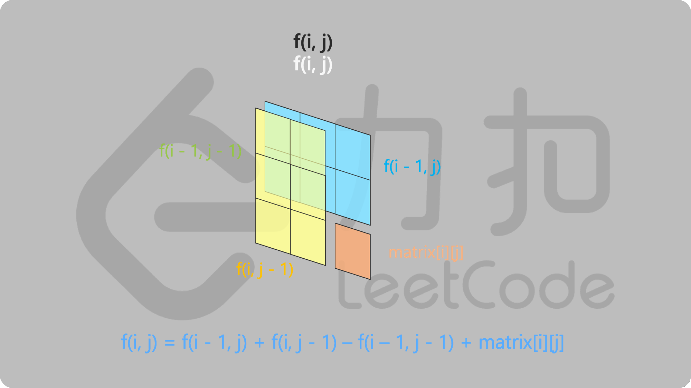

  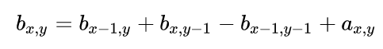

  ```java
  int n = a.length;
  int m = a[0].length;
  int[][] c = new int[n][m];
  for(int y=0;y<n;y++)//n行
      for(int x=0;x<m;x++)//m列
      {
          if(x==0 && y==0) b[y][x]=a[y][x];//左上角的值
          else if(x==0) b[y][x]=b[y-1][x]+a[y][x];//第一列
          else if(y==0) b[y][x]=b[y][x-1]+a[y][x];//第一行
          else b[y][x]=b[y-1][x]+b[y][x-1]-b[y-1][x-1]+a[y][x];
      }
  }
  ```

  结合前面避免越界/减少分类讨论的技巧, 前缀和数组可以定义成比原始数组稍大

  ```java
  int n = a.length;
  int m = a[0].length;
  int[][] c = new int[n + 1][m + 1];
  // 统计完成后, 第一行与第一列都是默认的0
  for (int y = 1; y <= n; y++) {
      for (int x = 1; x <= m; x++) {
          c[y][x] = c[y - 1][x] + c[y][x - 1] - c[y - 1][x - 1] + a[y-1][x-1];
      }
  }
  ```

### 例题

| 题目                                                         | 难度   | 备注          |
| :----------------------------------------------------------- | ------ | ------------- |
| [303. Range Sum Query - Immutable(区域和检索-数组不可变)](https://leetcode.cn/problems/range-sum-query-immutable/) | 🟢简单🆗 | 一维入门      |
| [304. Range Sum Query 2D - Immutable(二维区域和检索-矩阵不可变)](https://leetcode.cn/problems/range-sum-query-2d-immutable/) | 🟡中等🆗 | 二维入门      |
| [1480. Running Sum of 1d Array(一维数组的动态和)](https://leetcode.cn/problems/running-sum-of-1d-array/) | 🟢简单🆗 | 一维入门      |
| [497. Random Point in Non-overlapping Rectangles(非重叠矩形随机点)](https://leetcode.cn/problems/random-point-in-non-overlapping-rectangles/) | 🟡中等🆗 | 前缀和+二分   |
| [724. Find Pivot Index(寻找数组中心下标)](https://leetcode.cn/problems/find-pivot-index/) | 🟢简单🆗 | 前缀和+遍历   |
| [560. Subarray Sum Equals K(和为k的子数组)](https://leetcode.cn/problems/subarray-sum-equals-k/) | 🟡中等🆗 | 前缀和+哈希   |
| [926. Flip String to Monotone Increasing(字符串翻转成单调递增)](https://leetcode.cn/problems/flip-string-to-monotone-increasing/) | 🟡中等🆗 | 前缀和统计    |
| [238. Product of Array Except Self(除自身以外数组的乘积)](https://leetcode.cn/problems/product-of-array-except-self/) | 🟡中等🆗 | 前缀积+后缀积 |
|                                                              |        |               |

# █ 实战技巧

## 1. 避免溢出

### 比较器的写法

为什么 new PriorityQueue<>((x,y)->(y-x)) 的写法会有某些案例无法通过？和 new PriorityQueue<>((x,y)->Integer.compare(y,x)) 写法有何区别？

`(x,y)->(y-x)` 的写法, 在数学计算逻辑上没有错，但若在计算机中直接使用，当 y = Integer.MAX_VALUE, x = Integer.MIN_VALUE 时，y - x 的运算会导致溢出，返回的是 **负数** ，而不是逻辑期望的 **正数**.

在 Java 中 `Integer.compare(a, b)` 的实现只是单纯的比较，不涉及运算，所以不存在溢出风险。

```java
// Integer.compare(x, y)
public static int compare(int x, int y) {
    return (x < y) ? -1 : ((x == y) ? 0 : 1);
}
```

### 平均值的计算

求平均值的第一反应是 `(a+b)/2`, 但是 `a+b` 可能就溢出了, 要用 `a+(b-a)/2`, 或者 `a/2+b/2`

在二分法求中点时, 通常使用`a+(b-a)/2`, 此处允许  `a-b` 是因为数组/链表下标都是非负数, 非负数之间相减没有溢出的风险, 而且只进行一次除法运算, 效率比`a/2 + b/2`更高

 `a`, `b`两数中若允许有负数, 则 `a-b`也有可能发生溢出, 此时可以使用 `a/2 + b/2` 的方式来计算两数的中点

## 2. 避免越界

在使用数组时, 常常需要注意边界时数组下标是否越界, 在很多时候, 我们可以定义一个比必要空间稍大的数组, 使得运算时下标都在有效范围内

比如计算前缀和的时候, 有递推公式 `sum[i] = sum[i-1] + data[i]`, 如果我们定义的 sum 数组与 data 数组等长, 那么在计算 `sum[0]` 的时候, 由于递推公式中的 `sum[-1]` 越界, 就需要对 `sum[0]` 做特殊讨论, 单独声明, 而后的递推公式, i 从1 开始

```java
// 若定义 sum[]与 data[] 等长, 需对 sum[0] 做单独讨论
// sum[0] = data[0], sum[i] = data[0] +...+ data[i]
int n = data.length;
int[] sum = new int[n];
// 为了避免越界, 需要单独处理sum[0]
sum[0] = data[0];
for(int i = 1; i < n;  i++) {
    sum[i] = sum[i-1] + data[i];
}

// 若定义 sum[] 比 data[] 多一个元素, 可令有效前缀和从 sum[1] 开始
// sum[0] = 0, sum[i] = data[0] +...+ data[i-1] = sum[i-1] + data[i-1]
int n = data.length;
// 扩大了数组长度, 避免对边界问题的特殊处理
int[] sum = new int[n + 1];
for(int i = 1; i <= n;  i++) {
    sum[i] = sum[i-1] + data[i-1];
}
```

## 3. 根节点记录

在一些链表或树的问题中, 需要特别注意对根节点的处理, 为了减少对不同情况的讨论, 我们可以用一个无效节点作为新的根, 将原本的根挂在该伪根节点上,  那么原本的根节点就成为了与其他节点相同的非根节点, 与其他节点拥有相同的处理逻辑而不需要单独讨论. 在问题求解完成后, 直接返回伪根节点的子节点

```java
public Node method(Node root) {
    // 创建一个伪节点, 将原根节点挂在伪根上
    Node dummyRoot = new Node();
    dummyRoot.child = root;
    // 按常规节点求解问题
    // 最后返回伪根的子节点, 即要求的新根
    return dummyRoot.child;
}
```

## 4. 链式前向星

用数组实现链表, 是一种头插入式的链表

可用来作为图的邻接表

# █ ACM模式

在力扣上刷题, 都会给出一个方法模板, 学习时只需要关注核心的算法逻辑, 称为**核心代码模式**

但在很多竞赛和机试的OJ在线判题系统中, 采用**ACM模式**, 要求写出来的代码是直接可以本地运行的，所以我们需要自己写include哪些库函数，构造输入用例，构造输出用例, 对一些数据结构也需要自己设计.

因此需要熟悉一些常用的输出输入处理方式, 考试的时候节约时间


# █ 数组/列表

## 排序


### 基于比较的排序

#### 冒泡排序

1. 比较相邻的元素。如果第一个比第二个大，就交换他们两个。
2. 对每一对相邻元素作同样的工作，从开始第一对到结尾的最后一对。这步做完后，最后的元素会是最大的数。
3. 针对所有的元素重复以上的步骤，除了最后一个。
4. 持续每次对越来越少的元素重复上面的步骤，直到没有任何一对数字需要比较。


```java
public void selectionSort(int[] array) {
  int n = array.length;
  for (int i = 0; i < n; i++) {
    boolean flag = true;
    for (int j = 0; j < n - i - 1; j++) {
      // 遍历未排序的部分, 比较相邻两个元素的大小, 一轮遍历会将最大的元素移动到最后面
      if (array[j] > array[j + 1]) {
        // 若当前元素大于前一元素, 交换
        int t = array[j];
        array[j] = array[j + 1];
        array[j + 1] = t;
        flag = false;
      }
    }
    // 若遍历一遍未发生交换, 则已经是有序的, 不再进行无意义的比较
    if (flag) {
      break;
    }
  }
}
```

#### 选择排序

1. 首先在未排序序列中找到最小（大）元素，存放到排序序列的起始位置。
2. 再从剩余未排序元素中继续寻找最小（大）元素，然后放到已排序序列的末尾。
3. 重复第二步，直到所有元素均排序完毕。


```java
public void selectionSort(int[] array) {
  int n = array.length;
  for (int i = 0; i < n-1; i++) {
    int minIdx = i;
    for (int j = i + 1; j < n; j++) {
      if (array[j] < array[minIdx]) {
        // 若新元素更小, 记录最小元素下标
        minIdx = j;
      }
    }
    // 若当前元素不是最小元素, 交换
    if (minIdx != i) {
      int t = array[minIdx];
      array[minIdx] = array[i];
      array[i] = t;
    }
  }
}
```

#### 插入排序

1. 将第一待排序序列第一个元素看做一个有序序列，把第二个元素到最后一个元素当成是未排序序列。
2. 从头到尾依次扫描未排序序列，将扫描到的每个元素插入有序序列的适当位置。（如果待插入的元素与有序序列中的某个元素相等，则将待插入元素插入到相等元素的后面。）


```java
public void insertionSort(int[] array) {
  int n = array.length;
  // i = 有序序列的长度
  for (int i = 1; i < n; i++) {
    // 记录当前要操作的数
    int j = i;
    int tmp = array[j];
    // 当 tmp 比前一元素小时, 将该元素往后移动一格(相当于与tmp交换位置)
    while(j > 0 && tmp < array[j - 1]){
      array[j] = array[j - 1];
      // 相当于tmp的位置前移
      j--;
    }
    // 若当前元素不是最小元素, 交换
    if (j != i) {
      array[j] = tmp;
    }
  }
}
```

#### 希尔排序


#### 堆排序


#### 归并排序


归并排序是一种**分治算法**, 以 `O(N log N)` 的时间界完成排序, 其思路是这样的: 

1. 如果有两个有序的子数组, 对其合并排序是比较简单的, 只需要依次取出两个子数组的最小值进行比较排序
2. **分**: 对于一个数组, 可以递归地将其分割成两部分, 分别排序
3. **治**: 将排好序的两个子数组, 合并成一个数组


#### 快速排序


### 线性时间的排序

#### 桶排序

#### 基数排序

### 外部排序


## 二分查找

顾名思义, 二分查找每次都**将数据分成两部分**, 然后判断我们可能能从哪一部分找到我们想要的结果, 然后就聚焦于这一部分, 舍弃另外一步分数据, 这样可以快速降低问题的规模, 以 `O(logN)` 的时间界内得到答案. 

这种模式的步骤是这样的：

1. 首先，算出左右端点的中点。

2. 如果中点正好是我们要的答案，直接返回中点的下标

3. 如果中点不是答案, 就需要判断答案在左侧还是在右侧

   如果答案位于左侧, 将下一步搜索空间放到左边, 丢弃右边

   如果答案位于左侧, 则继续在右边搜索, 丢弃左边

伪代码模板如下

```java
public int search(Object[] args) {
    // 答案的可能取值范围, 就是查找的起始端点
    int l = 取值起点, r = 取值终点;
    // 如果查找区间只有一个元素, 允许进循环内判断, 这里允许等号
    while (l < r) {
        // 改进的中点求法, 避免溢出的问题
        int mid = l + (r - l) / 2;
        if (中点就是答案) {
            // 如果中点就是所求答案, 直接返回
            return mid;
        }
        if (下一次在左侧区间寻找) {
            // 修改查找区间为左半部分
            // 考虑 mid 有没有可能是答案, 通常取 r = mid 或 r = mid - 1
        } else {
            // 修改查找区间为右半部分
            // 考虑 mid 有没有可能是答案, 通常取 r = mid 或 r = mid - 1
        }
    }
    // 结束循环(或查找区间只有一个元素), 检查端点是不是答案
    // 可能有 l == r, 或 l > r, 与修改区间时的做法有关 
    if (左或右端点是答案) {
        return 答案端点;
    }
    // 若左端点不是答案, 那就没有答案, 按题目要求返回
    return 无答案;
}
```

以有序数组内查找目标为例, 查找过程如下图所示：

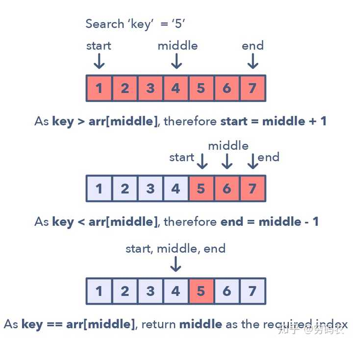

二分查找的本质, 在于数据的**两段性**, 将数据分成两段, 只要一段**确定满足**某个性质(包含了答案)，我们可以在已确定的那段中能得到我们想要的结果, 那么另外一段是否满足该性质已经不重要，这个时候就可以使用二分, 抛弃另外一段的数据, 

这种两段性, 可以有多种体现. 可以是 **01 型(满足/不满足)** , 也可能是 **1? 型(确定满足/不一定满足)**. 最常见的场景, 在一段有序数组中找到某个数, 这是一种特定的 01 型.

若题目中出现了以下任意信息点, 就可以考虑使用二分查找: 

1. 输入数据规模较大, 或要求`O(logN)`的解法
2. 有序数组
3. 其他具备两段性的数据

### 细节问题

二分查找的原理很简单, 但是在不同场景下, 有很多细节需要注意

1. **起始边界问题**

   记住我们的搜索区间, 是答案的可能区间, 因此直接将答案值域的两端设为边界即可

2. **边界更新问题** 

   在边界更新时, 关注**中点是否仍有可能是答案**

   1. 如果中点仍有可能是最终答案, 就保留中点,  `l = mid` 或 `r = mid`  
   2. 如果中点已经能被排除, 就取偏移后节点, `l = mid + 1` 或 `r = mid - 1`

3. **无限循环问题**

   当搜索空间只有两个边界元素时, 由于常用的 `mid = l + (r - l) / 2` 是向下取整, 此时 `mid == l`, 后续执行边界更新时保留中点而采用 `l = mid` 时, 实际上边界未被修改, 就进入了无限循环. 

   为了脱离循环, 应该确保每次**更新边界时都能真正改变边界**, 既然这里是因为 `mid == l` 导致对左边界修改无效, 那么可以修改中点的计算规则, 采用向上取整 `mid = l + (r - l + 1)/2` , 令这种场景下的 `mid == r`, 那么在执行 `l = mid` 的时候就能正确改变边界.

4. **结束循环的条件**

   结束循环后, 可能会出现 `l == r` 或 `l > r` 两种可能, 
   
   要么某个端点就是答案, 要么问题无解, 根据具体问题判断

### 例题

1. Order-agnostic Binary Search (easy)
2. Ceiling of a Number (medium)
3. Next Letter (medium)
4. Number Range (medium)
5. Search in a Sorted Infinite Array (medium)
6. Minimum Difference Element (medium)
7. Bitonic Array Maximum (easy)

| 题目                                                         | 难度   | 备注           |
| :----------------------------------------------------------- | ------ | -------------- |
| [704. Binary Search(二分查找)](https://leetcode-cn.com/problems/binary-search/) | 🟢简单🆗 | 入门题         |
| [35. Search Insert Position(搜索插入位置)](https://leetcode-cn.com/problems/search-insert-position/) | 🟢简单🆗 | 入门题         |
| [278. First Bad Version(第一个错误版本)](https://leetcode-cn.com/problems/first-bad-version/) | 🟢简单🆗 | 边界处理       |
| 278-改. Last Good Version(最后一个正确版本)                  | 🟢简单🆗 | 边界处理       |
| [33. Search in Rotated Sorted Array(搜索旋转排序数组)](https://leetcode.cn/problems/search-in-rotated-sorted-array/) | 🟡中等🆗 | 01型两段式     |
| [162. Find Peak Element(寻找峰值)](https://leetcode.cn/problems/find-peak-element/) | 🟡中等🆗 | 1?型两段式     |
| [875. Koko Eating Bananas(爱吃香蕉的珂珂)](https://leetcode.cn/problems/koko-eating-bananas/) | 🟡中等🆗 | 对答案值域二分 |
| [497. Random Point in Non-overlapping Rectangles(非重叠矩形随机点)](https://leetcode.cn/problems/random-point-in-non-overlapping-rectangles/) | 🟡中等🆗 | 前缀和+二分    |

## 滑动窗口

滑动窗口类型的题目经常是用来执行数组或是链表上某个区间（窗口）上的操作。比如找最长的全为1的子数组长度。滑动窗口一般从第一个元素开始，一直往右边一个一个元素挪动。当然了，根据题目要求，我们可能有固定窗口大小的情况，也有窗口的大小变化的情况。

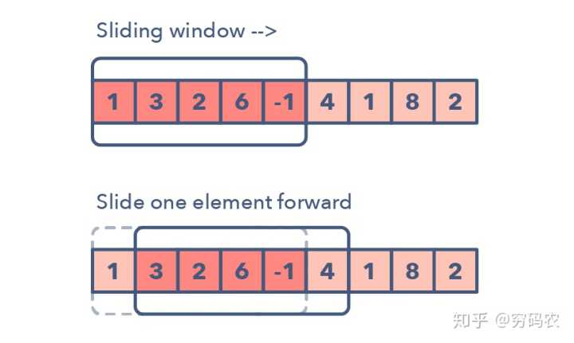

该图中，我们的窗子不断往右一格一个移动

```java
/* 
以力扣 209 为例
给定一个含有 n 个正整数的数组和一个正整数 target 。
找出该数组中满足其和 ≥ target 的长度最小的 连续子数组 [numsl, numsl+1, ..., numsr-1, numsr] ，并返回其长度。如果不存在符合条件的子数组，返回 0 
*/
public int minSubArrayLen(int target, int[] nums) {
  int n = nums.length;
  if (n == 0) {
    return 0;
  }
  int ans = Integer.MAX_VALUE;
  // 判断条件
  int sum = 0;
  // 初始化窗口两端点, 都是数组起点
  int start = 0, end = 0;
  // 外层循环, 逐渐右移end
  while (end < n) {
    sum += nums[end];
    // 内层循环, 若满足条件, 尝试缩短子数组, start右移
    while (sum >= target) {
   		// 记录结果
      ans = Math.min(ans, end - start + 1);
      // 更新判断条件
      sum -= nums[start];
      start++;
    }
    // start不能继续右移, 则继续右移end
    end++;
  }
  return ans == Integer.MAX_VALUE ? 0 : ans;
}

```

下面**是一些我们用来判断我们可能需要上滑动窗口策略的方法**：

适用场景

这个问题的输入是一些线性结构：比如链表呀，数组啊，字符串啊之类的让你去求最长/最短子字符串或是某些特定的长度要求

经典题目

1. Maximum Sum Subarray of Size K (easy) 1708
2. Smallest Subarray with a given sum (easy)
3. Longest Substring with K Distinct Characters (medium)
4. Fruits into Baskets (medium)
6. Longest Substring with Same Letters after Replacement (hard)
7. Longest Subarray with Ones after Replacement (hard)

| 题目                                                         | 难度   | 备注 |
| ------------------------------------------------------------ | ------ | ---- |
| [3.Longest Substring Without Repeating Characters](https://leetcode-cn.com/problems/longest-substring-without-repeating-characters/) | 🟡中等🆗 |      |
| [209.Minimum Size Subarray Sum](https://leetcode-cn.com/problems/minimum-size-subarray-sum/) | 🟡中等🆗 |      |
| [567.Permutation in String](https://leetcode-cn.com/problems/permutation-in-string/) | 🟡中等🆗 |      |
| [904. Fruit Into Baskets](https://leetcode.cn/problems/fruit-into-baskets/) | 🟡中等❌ |      |
| [1493. Longest Subarray of 1's After Deleting One Element](https://leetcode.cn/problems/longest-subarray-of-1s-after-deleting-one-element/) | 🟡中等❌ |      |

## 双指针

双指针是这样的模式：两个指针朝着左右方向移动（双指针分为同向双指针和异向双指针），直到他们有一个或是两个都满足某种条件。双指针通常用在排好序的数组或是链表中寻找对子。比如，你需要去比较数组中每个元素和其他元素的关系时，你就需要用到双指针了。我们需要双指针的原因是：如果你只用一个指针的话，你得来回跑才能在数组中找到你需要的答案。这一个指针来来回回的过程就很耗时和浪费空间了 — 这是考虑算法的复杂度分析的时候的重要概念。虽然brute  force一个指针的解法可能会奏效，但时间复杂度一般会是O(n²)。在很多情况下，双指针能帮助我们找到空间或是时间复杂度更低的解。

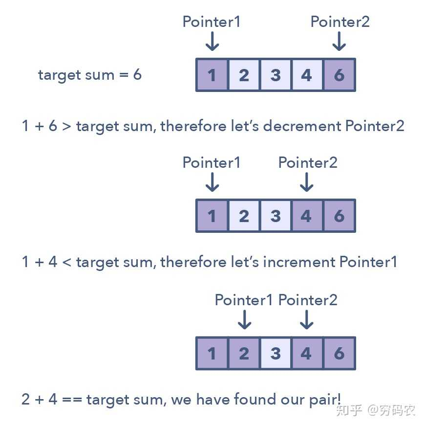

上图是说，我们在排好序的数组里面找是否有一对数加起来刚好等于目标和

适用场景

识别使用双指针的招数：

一般来说，数组或是链表是排好序的，你得在里头找一些组合满足某种限制条件

这种组合可能是一对数，三个数，或是一个子数组

经典题目

1. Pair with Target Sum (easy) 1865
2. Remove Duplicates (easy)
3. Squaring a Sorted Array (easy)
4. Triplet Sum to Zero (medium)
5. Triplet Sum Close to Target (medium)
6. Triplets with Smaller Sum (medium)
7. Subarrays with Product Less than a Target (medium)
8. Dutch National Flag Problem (medium)

| 题目                                                         | 难度   | 备注 |
| ------------------------------------------------------------ | ------ | ---- |
| [19. Remove Nth Node From End of List(删除链表的倒数第 N 个结点)](https://leetcode-cn.com/problems/remove-nth-node-from-end-of-list/) | 🟡中等🆗 |      |
| [26.Remove Duplicates from Sorted Array(删除有序数组中的重复项)](https://leetcode-cn.com/problems/remove-duplicates-from-sorted-array/) | 🟢简单🆗 |      |
| [167. Two Sum II - Input Array Is Sorted(两数之和 II - 输入有序数组)](https://leetcode-cn.com/problems/two-sum-ii-input-array-is-sorted/) | 🟡中等🆗 | 剪枝 |
| [189. Rotate Array(轮转数组)](https://leetcode-cn.com/problems/rotate-array/) | 🟡中等🆗 |      |
| [283. Move Zeroes(移动零)](https://leetcode-cn.com/problems/move-zeroes/) | 🟢简单🆗 |      |
| [344. Reverse String(反转字符串)](https://leetcode-cn.com/problems/reverse-string/) | 🟢简单🆗 |      |
| [557. Reverse Words in a String III(反转字符串中的单词 III)](https://leetcode-cn.com/problems/reverse-words-in-a-string-iii/) | 🟢简单🆗 |      |
| [876. Middle of the Linked List(链表的中间结点)](https://leetcode-cn.com/problems/middle-of-the-linked-list/) | 🟢简单🆗 |      |
| [977. Squares of a Sorted Array(有序数组的平方)](https://leetcode-cn.com/problems/squares-of-a-sorted-array/) | 🟢简单🆗 |      |
| [35. Search Insert Position(搜索插入位置)](https://leetcode.cn/problems/search-insert-position/) | 🟢简单🆗 |      |
| [15. 3Sum(三数之和)](https://leetcode.cn/problems/3sum/)     | 🟡中等🆗 |      |
| [16. 3Sum Closest](https://leetcode.cn/problems/3sum-closest/) | 🟡中等❌ |      |
| [713. Subarray Product Less Than K](https://leetcode.cn/problems/subarray-product-less-than-k/) | 🟡中等❌ |      |

## 链表翻转

在众多问题中，题目可能需要你去翻转链表中某一段的节点。通常，要求都是你得原地翻转，就是重复使用这些已经建好的节点，而不使用额外的空间。这个时候，原地翻转模式就要发挥威力了。这种模式每次就翻转一个节点。一般需要用到多个变量，一个变量指向头结点（下图中的current），另外一个（previous）则指向咱们刚刚处理完的那个节点。在这种固定步长的方式下，你需要先将当前节点（current）指向前一个节点（previous），再移动到下一个。同时，你需要将previous总是更新到你刚刚新鲜处理完的节点，以保证正确性。

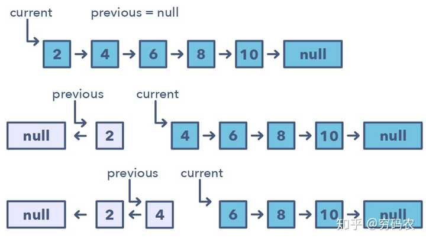

咱们怎么去甄别这种模式呢？

- 如果你被问到需要去翻转链表，要求不能使用额外空间的时候

| 题目                                                         | 难度   | 备注 |
| ------------------------------------------------------------ | ------ | ---- |
| [206. Reverse Linked List(反转链表)](https://leetcode.cn/problems/reverse-linked-list/) | 🟢简单🆗 |      |
| [92. Reverse Linked List II](https://leetcode.cn/problems/reverse-linked-list-ii/) | 🟡中等❌ |      |
| [25. Reverse Nodes in k-Group](https://leetcode.cn/problems/reverse-nodes-in-k-group/) | 🔴困难❌ |      |

## 快慢指针

这种模式，有一个非常出门的名字，叫龟兔赛跑。咱们肯定都知道龟兔赛跑啦。但还是再解释一下快慢指针：这种算法的两个指针的在数组上（或是链表上，序列上）的移动速度不一样。还别说，**这种方法在解决有环的链表和数组时特别有用**。

**通过控制指针不同的移动速度（比如在环形链表上），这种算法证明了他们肯定会相遇的。快的一个指针肯定会追上慢的一个（可以想象成跑道上面跑得快的人套圈跑得慢的人）。**

**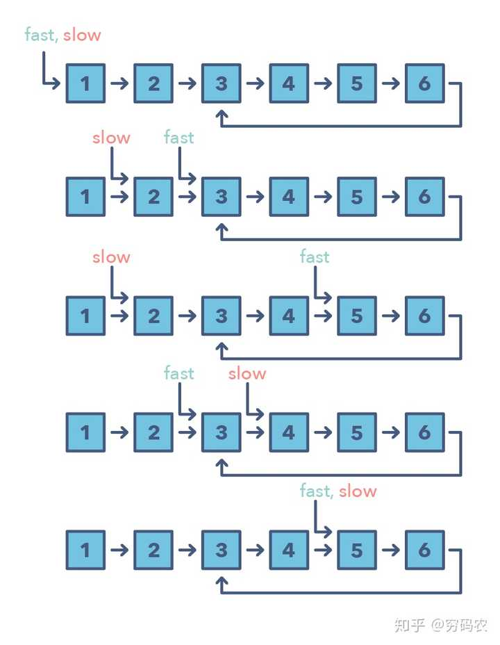**

上面这个图演示了快慢两个指针最终在5相遇了

适用场景

咋知道需要用快慢指针模式勒？

1. 问题需要处理**环**上的问题，比如环形链表和环形数组
2. 当你需要知道链表的长度或是某个特别位置的信息的时候

那啥时候用快慢指针而不是上面的双指针呢？

有些情形下，咱们不应该用双指针，比如我们在单链表上不能往回移动的时候。一个典型的需要用到快慢指针的模式的是当你需要去判断一个链表是否是回文的时候。

经典题目

1. LinkedList Cycle (easy)
2. Start of LinkedList Cycle (medium)
3. Happy Number (medium)
4. Middle of the LinkedList (easy)

| 题目                                                         | 难度   | 备注 |
| ------------------------------------------------------------ | ------ | ---- |
| [876. Middle of the Linked List(链表的中间结点)](https://leetcode-cn.com/problems/middle-of-the-linked-list/) | 🟢简单🆗 |      |
| [141. Linked List Cycle(环形链表)](https://leetcode.cn/problems/linked-list-cycle/) | 🟢简单🆗 |      |
| [202. Happy Number](https://leetcode.cn/problems/happy-number/) | 🟢简单❌ |      |
|                                                              |        |      |


## 区间合并类型

区间合并模式是一个用来处理有区间重叠的很高效的技术。

在涉及到区间的很多问题中，通常咱们需要要么判断是否有重叠，要么合并区间，如果他们重叠的话。

这个模式是这么起作用的：给两个区间，一个是a，另外一个是b。别小看就两个区间，他们之间的关系能跑出来6种情况。详细的就看图啦。

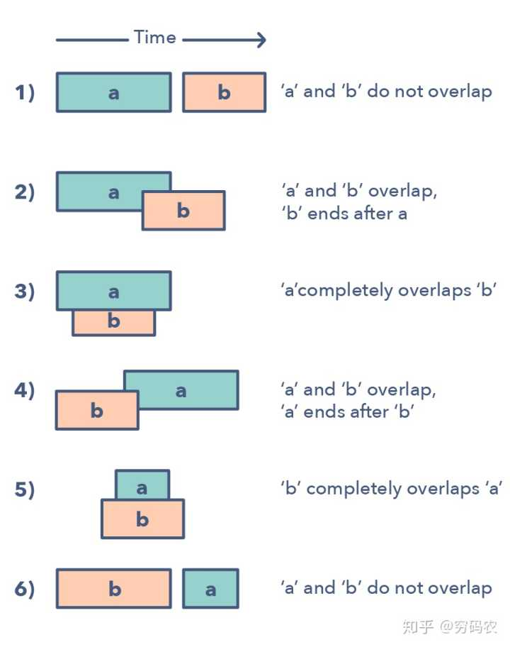


理解和识别这六种情况，灰常重要。因为这能帮你解决一大堆问题。这些问题从插入区间到优化区间合并都有。怎么识别啥时候用合并区间模式呀？

- 当你需要产生一堆相互之间没有交集的区间的时候
- 当你听到重叠区间的时候

| 题目                                                         | 难度   | 备注 |
| ------------------------------------------------------------ | ------ | ---- |
| [56. Merge Intervals](https://leetcode.cn/problems/merge-intervals/) | 🟡中等❌ |      |
| [57. Insert Interval](https://leetcode.cn/problems/insert-interval/) | 🟡中等❌ |      |
| [436. Find Right Interval](https://leetcode.cn/problems/find-right-interval/) | 🟡中等❌ |      |
| [986. Interval List Intersections](https://leetcode.cn/problems/interval-list-intersections/) | 🟡中等❌ |      |


## 循环排序/原地哈希

这种模式讲述的是一直很好玩的方法：可以用来处理数组中的数值限定在一定的区间的问题。

这种模式一个个遍历数组中的元素，如果当前这个数它不在其应该在的位置的话，咱们就把它和它应该在的那个位置上的数交换一下。你可以继续将交换后的数放到其正确的位置上，但这复杂度就会是O(n^2)。这样的话，可能就不是最优解了。

因此循环排序的优势就体现出来了。

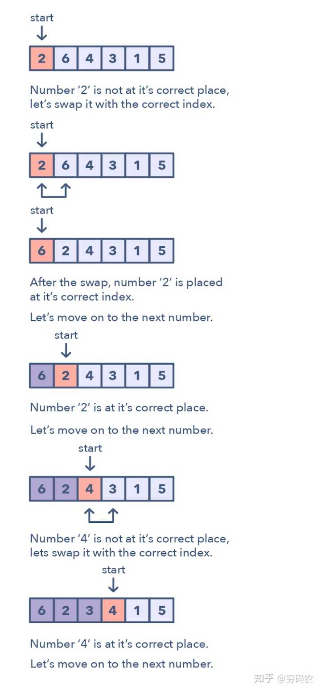

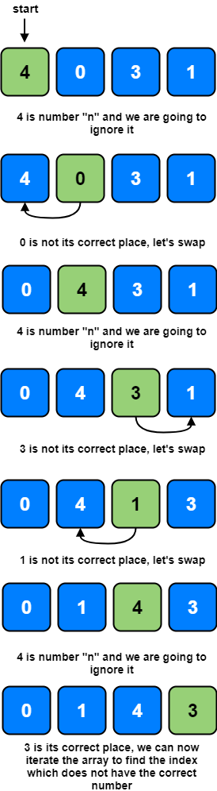

咋鉴别这种模式？

- 这些问题一般设计到排序好的数组，而且数值一般满足于一定的区间
- 如果问题让你需要在排好序/翻转过的数组中，寻找丢失的/重复的/最小的元素
- 数组的数字是1 ~ n或0 ~ n-1，要求空间复杂度O(1)下找出丢失或重复的数字

| 题目                                                         | 难度   | 备注 |
| ------------------------------------------------------------ | ------ | ---- |
| [41. First Missing Positive(缺失的第一个正数)](https://leetcode.cn/problems/first-missing-positive/) | 🔴困难🆗 |      |
| [268. Missing Number(丢失的数字)](https://leetcode.cn/problems/missing-number/) | 🟢简单🆗 |      |
| [287. Find the Duplicate Number](https://leetcode.cn/problems/find-the-duplicate-number/) | 🟡中等❌ |      |
| [442. Find All Duplicates in an Array](https://leetcode.cn/problems/find-all-duplicates-in-an-array/) | 🟡中等❌ |      |
| [448. Find All Numbers Disappeared in an Array](https://leetcode.cn/problems/find-all-numbers-disappeared-in-an-array/) | 🟢简单❌ |      |

## 单调栈

维护一个单调递增的栈

# █ 堆/优先队列

## 前K个系列

任何让我们求解最大/最小/最频繁的K个元素的题，都遵循这种模式。

用来记录这种前K类型的最佳数据结构就是堆了（译者注：在Java中，改了个名，叫优先队列（PriorityQueue））。这种模式借助堆来解决很多这种前K个数值的问题。

这个模式是这样的：

1. 根据题目要求，将K个元素插入到最小堆或是最大堆。
2. 遍历剩下的还没访问的元素，如果当前出来到的这个元素比堆顶元素大，那咱们把堆顶元素先删除，再加当前元素进去。

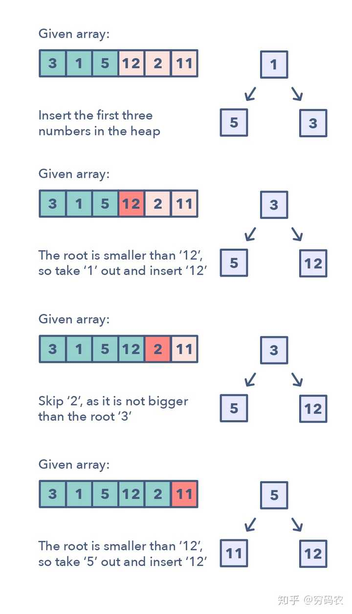

注意这种模式下，咱们不需要去排序数组，因为堆具有这种良好的局部有序性，这对咱们需要解决问题就够了。识别最大K个元素模式：如果你需要求最大/最小/最频繁的前K个元素如果你需要通过排序去找一个特定的数

经典题目

1. Top ‘K’ Numbers (easy)
2. Kth Smallest Number (easy)
3. ‘K’ Closest Points to the Origin (easy)
4. Connect Ropes (easy)
5. Top ‘K’ Frequent Numbers (medium)
6. Frequency Sort (medium)
7. Kth Largest Number in a Stream (medium)
8. ‘K’ Closest Numbers (medium)
9. Maximum Distinct Elements (medium)
10. Sum of Elements (medium)
11. Rearrange String (hard)

## 双堆类型

很多问题中，我们被告知，我们拿到一大把可以分成两队的数字。

为了解决这个问题，我们感兴趣的是，怎么把数字分成两半？使得：小的数字都放在一起，大的放在另外一半。双堆模式就能高效解决此类问题。正如名字所示，该模式用到了两个堆

一个**最小堆**, 用来找最小元素；一个**最大堆**, 拿到最大元素。

这种模式将一半的元素放在最大堆中，这样你可以从这一堆中秒找到最大元素。同理，把剩下一半丢到最小堆中，O(1)时间找到他们中的最小元素。

若大数放在小堆, 小数放在大堆, 则双堆堆顶元素是相邻元素, 这种方式可以快速找到第k大的数, 也称为**对顶堆**

通过这样的方式，这一大堆元素的**中位数**就可以从两个堆的堆顶拿到数字，从而计算出来。

适用场景

判断双堆模式的秘诀：这种模式在优先队列，计划安排问题（Scheduling）中有奇效

如果问题让你找一组数中的**最大/最小/中位数**有时候，这种模式在涉及到二叉树数据结构时也特别有用

经典题目

1. Find the Median of a Number Stream (medium)
2. Maximize Capital (hard)

| 题目                                                         | 难度   | 备注            |
| ------------------------------------------------------------ | ------ | --------------- |
| [295. Find Median from Data Stream(数据流的中位数)](https://leetcode.cn/problems/find-median-from-data-stream/) | 🔴困难🆗 | 直接对顶堆      |
| [480. Sliding Window Median](https://leetcode.cn/problems/sliding-window-median/) | 🔴困难❌ | 对顶堆+延迟删除 |
|                                                              |        |                 |

## 多路归并

K路归并能帮咱们解决那些涉及到多组排好序的数组的问题。每当你的输入是K个排好序的数组，你就可以用堆来高效顺序遍历其中所有数组的所有元素。你可以将每个数组中最小的一个元素加入到最小堆中，从而得到全局最小值。当我们拿到这个全局最小值之后，再从该元素所在的数组里取出其后面紧挨着的元素，加入堆。如此往复直到处理完所有的元素。

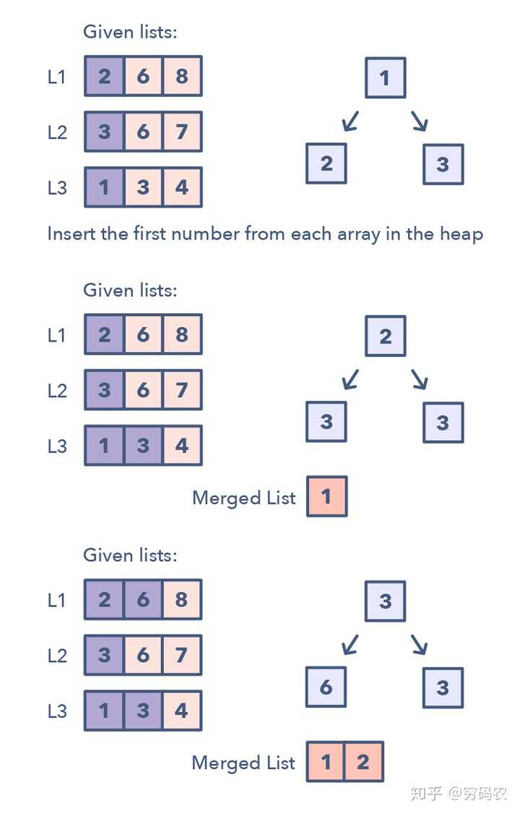

该模式是这样的运行的：

1. 构造堆, 把每个数组中的第一个元素都加入最小堆中

2. 取出堆顶元素, 放入排好序的结果集合里面

3. 将最小值的后继加入堆: 将刚取出的元素所在的数组里面的下一个元素加入堆

   *链表可以快速确定后继, 如果输入是数组, 怎么确定取出的元素来自哪个数组?*

4. 重复步骤2，3，直到处理完所有数字

识别K路归并：该问题的输入是排好序的数组，链表或是矩阵, 如果问题让咱们合并多个排好序的集合，或是需要找这些集合中最小的元素

1. Kth Smallest Number in M Sorted Lists (Medium)
2. Smallest Number Range (Hard)

| 题目                                                         | 难度   | 备注                         |
| ------------------------------------------------------------ | ------ | ---------------------------- |
| [23. Merge k Sorted Lists(合并K个升序链表)](https://leetcode.cn/problems/merge-k-sorted-lists/) | 🔴困难🆗 | 节点组堆, 节点能直接确定后继 |
| [378. Kth Smallest Element in a Sorted Matrix](https://leetcode.cn/problems/kth-smallest-element-in-a-sorted-matrix/) | 🟡中等❌ |                              |
|                                                              |        |                              |

# █ 树

## 广度优先遍历/深度优先遍历

| 题目                                                         | 难度   | 备注 |
| ------------------------------------------------------------ | ------ | ---- |
| [733. Flood Fill(图像渲染)](https://leetcode-cn.com/problems/flood-fill/) | 🟢简单🆗 |      |
| [695. Max Area of Island(岛屿的最大面积)](https://leetcode-cn.com/problems/max-area-of-island/) | 🟡中等🆗 |      |
| [617. Merge Two Binary Trees(合并二叉树)](https://leetcode-cn.com/problems/merge-two-binary-trees/) | 🟢简单🆗 |      |
| [116. Populating Next Right Pointers in Each Node( 填充节点右侧节点指针)](https://leetcode-cn.com/problems/populating-next-right-pointers-in-each-node/) | 🟡中等🆗 |      |
| [542. 01 Matrix(01矩阵)](https://leetcode-cn.com/problems/01-matrix/) | 🟡中等🆗 |      |
| [994. Rotting Oranges(腐烂的橘子)](https://leetcode-cn.com/problems/rotting-oranges/) | 🟡中等🆗 |      |

## 树上的BFS(广度优先遍历)

这种模式基于宽搜（Breadth First Search  (BFS)），适用于需要遍历一颗树。借助于队列数据结构，从而能保证树的节点按照他们的层数打印出来。打印完当前层所有元素，才能执行到下一层。所有这种需要遍历树且需要一层一层遍历的问题，都能用这种模式高效解决。这种树上的BFS模式是通过把根节点加到队列中，然后不断遍历直到队列为空。每一次循环中，我们都会把队头结点拿出来（remove），然后对其进行必要的操作。在删除每个节点的同时，其孩子节点，都会被加到队列中。识别树上的BFS模式：如果你被问到去遍历树，需要按层操作的方式（也称作层序遍历）

经典题目

1. Binary Tree Level Order Traversal (easy)-102
2. Reverse Level Order Traversal (easy)
3. Zigzag Traversal (medium)
4. Level Averages in a Binary Tree (easy)
5. Minimum Depth of a Binary Tree (easy)
6. Level Order Successor (easy)
7. Connect Level Order Siblings (medium)

## 树上的DFS(深度优先遍历)

树形DFS基于深搜（Depth First Search (DFS)）技术来实现树的遍历。咱们可以用递归（或是显示栈，如果你想用迭代方式的话）来记录遍历过程中访问过的父节点。

该模式的运行方式是从根节点开始，如果该节点不是叶子节点，我们需要干三件事：

1. 需要区别我们是先处理根节点（pre-order，前序），
2. 处理孩子节点之间处理根节点（in-order，中序），
3. 还是处理完所有孩子再处理根节点（post-order，后序）。

递归处理当前节点的左右孩子。

识别树形DFS：你需要按前中后序的DFS方式遍历树如果该问题的解一般离叶子节点比较近。

经典题目

1. Binary Tree Path Sum (easy)
2. All Paths for a Sum (medium)
3. Sum of Path Numbers (medium)
4. Path With Given Sequence (medium)
5. Count Paths for a Sum (medium)

| 题目                                                         | 难度   | 备注 |
| ------------------------------------------------------------ | ------ | ---- |
| [965. Univalued Binary Tree(单值二叉树)](https://leetcode.cn/problems/univalued-binary-tree/) | 🟢简单🆗 |      |
| [508. Most Frequent Subtree Sum(出现次数最多的子树和)](https://leetcode.cn/problems/most-frequent-subtree-sum/) | 🟡中等🆗 |      |
| [513. Find Bottom Left Tree Value(找树左下角的值)](https://leetcode.cn/problems/find-bottom-left-tree-value/) | 🟡中等🆗 |      |


## 子集类型(多重DFS)

一般都是使用多重DFS

超级多的编程面试问题都会涉及到排列和组合问题。子集问题模式讲的是用BFS来处理这些问题。

这个模式是这样的：

1. 给一组数字 [1, 5, 3]
2. 我们从空集开始：[[]]
3. 把第一个数（1），加到之前已经存在的集合中：[[], [1]];
4. 把第二个数（5），加到之前的集合中得到：[[], [1], [5], [1,5]];
5. 再加第三个数（3），
6. 则有：[[], [1], [5], [1,5], [3], [1,3], [5,3], [1,5,3]].

该模式的详细步骤如下：

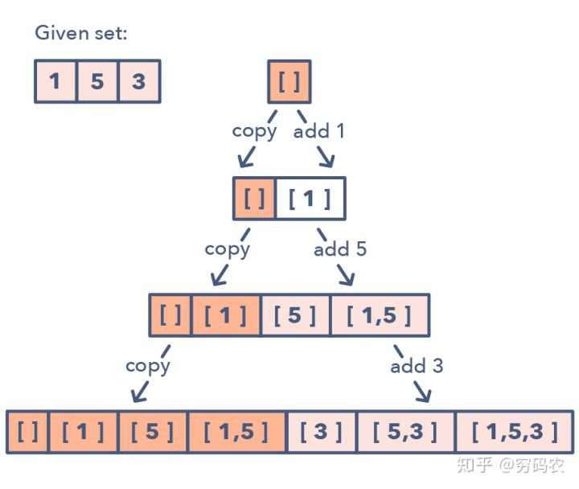

如果判断这种子集模式：问题需要咱们去找数字的组合或是排列

经典题目

1. Subsets (easy)
2. Subsets With Duplicates (easy)
3. Permutations (medium)
4. String Permutations by changing case (medium)
5. Balanced Parentheses (hard)
6. Unique Generalized Abbreviations (hard)

# █ 不相交集


# █ 图论

## 建图

有些问题经过分析后考虑用图论的方法来解决, 需要先将数据转换成图的表示, 可以按照以下方式处理

1. 确定图的表示方式
   1. 稠密图: 使用邻接接矩阵(二维数组), `w[起点][中点]=权重`
   2. 稀疏图: 使用邻接表(类) 或 **链式前向星**
2. 初始化节点数据
3. 初始化边的信息, 将所有边逐条添加到图中

## 拓扑排序类型

拓扑排序模式用来寻找一种线性的顺序，这些元素之间具有依懒性。比如，如果事件B依赖于事件A，那A在拓扑排序顺序中排在B的前面。这种模式定义了一种简单方式来理解拓扑排序这种技术。

这种模式是这样奏效的：

1. 初始化
   1. 借助于HashMap将图保存成邻接表形式。
   2. 找到所有的起点，用HashMap来帮助记录每个节点的入度
2. 创建图，找到每个节点的**入度**
   1. 利用输入，把图建好，然后遍历一下图，将入度信息记录在HashMap中
3. 找所有的起点, **入度为0的节点**
   所有入度为0的节点，都是有效的起点，而且我们讲他们都加入到一个队列中
4. 排序
   1. 对每个起点，执行以下步骤
      1.  把它加到结果的顺序中
      2. 获取其在图中的后继节点
      3. 将其后继的**入度减少1** (相当于将这条边无效化)
      4. 如果节点**入度变为0**，则该节点成为新的起点，将其加入队列中
   2. 重复（a）过程，直到起点队列为空。

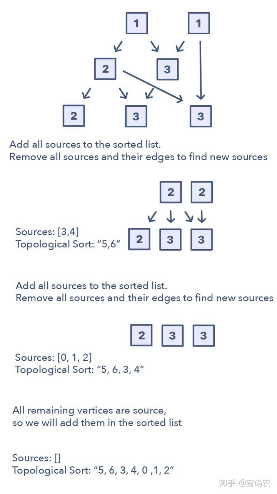

拓扑排序模式识别：

待解决的问题需要处理**无环图**

你需要以一种有序的秩序更新输入元素

需要处理的输入遵循某种特定的顺序

经典题目

1. Topological Sort (medium)
2. Tasks Scheduling (medium)
3. Tasks Scheduling Order (medium)
4. All Tasks Scheduling Orders (hard)
5. Alien Dictionary (hard)

## 最短路径问题

### Dijkstra 迪杰斯特拉算法

### Floyd 佛洛依德算法

## 最长路径问题

