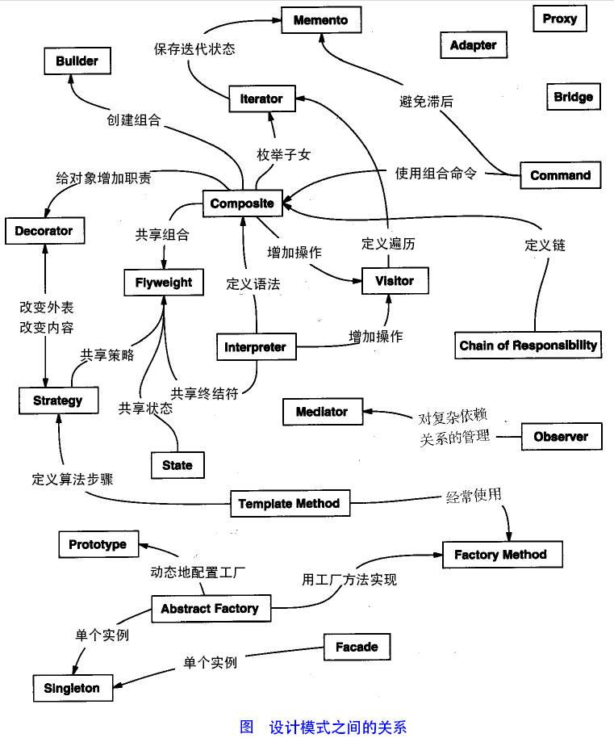
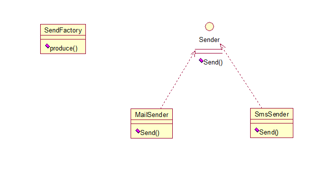
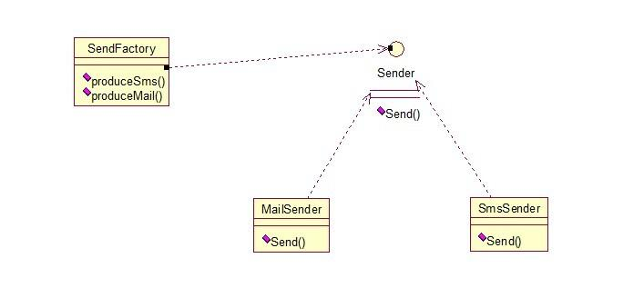
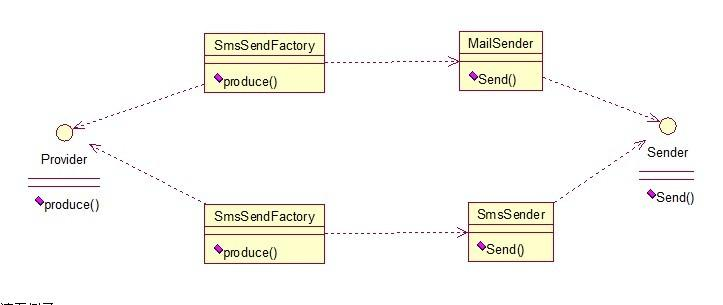

# █ 设计原则

要想更深入地了解面向对象思想, 就必须熟悉面向对象思想的设计原则

- 单一职责原则
- 开闭原则
- 里氏替换原则
- 依赖注入原则
- 接口分离原则
- 迪米特原则

## 1. 开闭原则

> 对扩展开放, 对修改关闭

- 即对类的修改, 是通过增加代码进行得, 而不是修改现有代码
- 也即是说软件开发人员一旦写出了可以运行的代码, 就不应该去改动它, 而是要保证他能一直运行下去.
- 通常需要借助于抽象和多态, 即把可能变化的内容抽象处理啊, 从而是抽象的部分是相对稳定的, 而具体的实现则是可以改变和扩展的

## 2. 单一职责原则

> 每个类只有一个职责, 对外提供一种功能, 引起类变化的原因只有一个

- 核心思想: 高内聚, 低耦合
- 在设计模式中, 所有的设计模式都遵循这一原则

单一职责的类, 功能简单, 更利于重用

若一个类设计得过于复杂, 功能复杂, 那么就很难适应别的地方, 重用性差

## 3. 里氏替换原则 (->开闭原则)

> 在任何父类出现的地方, 都可以用它的子类来替代

- 也就是说, 同一个继承体系中的对象, 应该有共同的行为特征
- 其目的是为了满足开闭原则

重载方法: 两同两小一大原则

- 方法名相同
- 参数列表相同
- 返回类型比原方法小(子类)
- 抛出异常比原方法小(子类)
- 访问范围比原方法大(保证可用)

## 4. 依赖注入原则 (->开闭原则)

> 面向接口编程, 依赖于抽象, 不要依赖于具体实现

- 内涵: 如果一个类需要使用或者依赖其他的类, 则应该依赖与这些类的抽象类, 而不是这些类的具体实现类.
- 方法: 在编程的时候, 针对抽象类或接口编程, 而不是针对具体实现编程

## 5. 迪米特原则 (->开闭原则)

> 最小知道原则, 一个类尽可能少的了解其他类

- 内涵: 降低各个对象之间的耦合, 提高系统的可维护性
- 在模块之间应该只通过接口编程, 而不理会模块的内部工作原理.它可以使各个模块之间的耦合度降到最低

## 6. 接口分离原则 (->单一职责)

> 接口中不存在子类用不到却必须提供实现的方法, 如果有, 拆分接口

- 核心思想: 不应该强迫程序依赖他们不需要使用的方法
- 内涵: 一个接口不需要提供太多的行为, 一个接口应该只提供一两种密切相关的功能, 不应该把所有的操作都封装在同一个接口中

## 7. 合成复用法则

> 尽可能使用合成/组合/聚合的方式, 少用继承

# █ 设计模式

- 设计模式, 是一套被反复使用, 多数人知晓的, 经过分类编目的, 代码设计经验的总结
- 使用设计模式是为了可重用代码, 让代码更容易被他人理解, 保证代码可靠性
- 设计模式不是一种方法和技术, 而是一种思想
- 设计模式和具体的语言无关, 学习设计模式就是要建立面向对象的思想, 尽可能的面向接口编程, 高内聚低耦合, 使设计的程序可复用性更好
- 学习设计模式能够促进对面向对象思想的理解, 反之亦然, 两者相辅相成
- 设计模式的几个要素
  - **名字**: 一个简单, 有意义的名字
  - **问题**: 描述在何时使用模式
  - **方案**: 描述设计的组成部分以及如何解决问题
  - **效果**: 描述模式的效果以及优缺点
- 设计模式的分类
  - 创建型模式 对象的创建
  - 结构型模式 对象的组成
  - 行为型模式 对象的行为



# 一. 创建型模式

## 0.简单工厂

### 简单工厂方法

> 一个类，一个方法: 传入不同的参数, 返回不同类型的对象



### 多方法简单工厂

> 一个类，多个方法: 调用不同的方法, 返回不同类型的对象



### 静态工厂方法

> 一个类，多个静态方法: 调用不同的方法, 返回不同类型的对象

- 又叫静态工厂方法模式, 定义了一个具体的工厂类, 负责创建一些类的实例
- 优点: 客户端不需要再负责对象的创建, 从而明确了各个类的职责
- 缺点: 这个静态工厂类负责所有对象的创建, 如果有新的对象增加, 或者某些对象的创建方式不同, 就需要不断的修改工厂类, 不利于后期的维护

```java
interface Animal(){}

public class Cat implements Animal{}
public class Dog implements Animal{}

public class AnimalFactory(){
    public static Dog createDog(){
        return new Dog();
    }
    public static Cat createCat(){
      	return new Cat();
    }
    public static Animal createAnimal(String type){
        if("dog".equals(type)){
          	return new Dog();
        }else if("cat".euqals(type)){
          	return new Cat();
        }
        return null;
    }
}
```

## 1.工厂方法模式

> 一个工厂接口，多个单工厂方法的实现类，扩展时直接新增工厂，不用修改原有代码



### 2.1. 原理

- 概述
   工厂方法模式中, 抽象工厂类负责定义创建对象的接口, 具体对象的创建工作由集成抽象工厂的具体类实现
   
- 优点
  
   客户端不需要再负责对象的创建, 从而明确了各个类的职责, 如果又新的对象增减, 只需要增加一个具体的类和具体的工厂类即可, 不影响已有的代码
   
   后期维护容易, 增强了系统的扩展性
   
- 缺点

   需要额外的编写代码, 增加了工作量

### 2.2. 案例: 工厂方法

```java
// 产品基类
public interface Animal(){}
// 具体的产品子类
public class Cat implements Animal{}
public class Dog implements Animal{}

// 工厂类的接口, 定义一个返回产品基类的方法
public interface Factory{
    public abstract Animal createAnimal();
}

// 具体的工厂类, 返回具体的产品子类
public class DogFactory implements Factory{
    public abstract Animal createAnimal(){return new Dog();}
}
public class CatFactory implements Factory{
    public abstract Animal createAnimal(){return new Cat();}
}

// 不同的工厂只能生产不同的产品子类
public class FactoryDemo{
    public static void main(String[] args){
        Factory factory1 = new DogFactory();
        Animal dog = factory1.createAnimal();

        Factory factory2 = new DogFactory();
        Animal cat = factory2.createAnimal();
    }
}
```

## 2.抽象工厂模式

> 一个工厂接口，内有多个工厂方法，每个工厂实现类可以生产多个关联产品

模板设计模式, 抽象类工厂, 可以用来生产不同系列的对象.

### 3.1. 原理

- 核心思想
- 内涵
- 具体做法: 抽象工厂, 就是工厂方法的升级, 可以一个工厂, 生成若干类型的

### 3.2. 案例:

- 引擎系列

  ```java
  public interface Engine {}
    
  public class EngineA implements Engine {
    public EngineA(){
      System.out.println("制造 引擎A");
    }
  }
  
  public class EngineB implements Engine {
    public EngineB() {
      System.out.println("制造 引擎B");
    }
  }
  ```

- 空调系列

  ```java
  public interface Aircondition{}
  
  public class AirconditionA implements Aircondition {
      public AirconditionA() {
          System.out.println("制造 空调A");
      }
  }
  
  public class AirconditionB implements Aircondition  {
      public AirconditionB() {
          System.out.println("制造 空调B");
      }
  }
  ```

- 抽象工厂

  ```java
  public interface AbstractFactory {
      public Engine createEngine();
      public Aircondition createAircondition();
  }
  ```

- 实体工厂类

  ```java
  public class FactoryBMW3 {
      public Engine createEngine() {
          return new EngineA();
      }
      public Aircondition createAircondition() {
          return new AirconditionA();
      }
  }
  public class FactoryBMW5 {
  	public Engine createEngine() {
          return new EngineB();
       }
  	public Aircondition createAircondition() {
          return new AirconditionB();
  	}
  }
  ```

## 3.单例模式

### 5.1. 原理:

- 概述
   单例模式就是要确保类在内存中只有一个对象, 该实例必须自动创建, 并且对外提供
- 优点
   在系统内存中只存在一个对象, 因此可以节约系统资源, 对于一些需要频繁创建和销毁的对象, 单例模式无疑可以提高系统的性能
- 缺点
   没有抽象层, 因此扩展很难
   职责过重, 在一定程度上违背了单一职责
- 细分
  - 饿汉式:
  - 懒汉式

### 5.2. 具体操作

### 5.2. 案例:

#### 1) 饿汉式

在类加载的时候, 同时创建自身对象, 即在使用之前就先创建好

```java
public class Student{
    // 私有的构造方法, 不允许在别的地方创建实例
    private Student(){}

    // 静态域存放了一个本类的实例对象    
    private static Student s1 = new Student();

    // 公共方法, 对外提供这类唯一的一个对象
    public static Student getStudent(){
        return s1;
    }
}
```

#### 2) 懒汉式

在类加载的时候不创建对象, 在第一次使用的时候才创建对象

注意! 懒汉式的单例模式有可能存在线程安全问题

```java
public class Teacher{
    // 私有的构造方法
    private Teacher(){}

    // 静态域存放了一个本类实例, 声明但未初始化   
    private static Teacher t;

    //公共方法, 对外提供这类唯一的一个对象
    public static Teacher getTeacher(){
        //判断对象是否存在, 不存在则创建新对象
        if(t==null){
            t = new Teacher();
        }
        return t;
    }
}
```

#### 3) 演示

单线程情况

```java
public class TeacherDemo {
    public static void main(String[] args){
        Teacher t1 = Teacher.getTeacher();
        Teacher t1 = Teacher.getTeacher();
        System.out.println(t1 == t2); //true
    }
}
```

多线程情况

- 懒汉式基本写法

  ```java
  public class Teacher{
      //私有的构造方法
      private Teacher(){}
  
      //静态域存放了一个对象, 声明但未初始化   
      private static Teacher t;
  
      //公共方法, 对外提供这类唯一的一个对象
      public static Teacher getTeacher(){
          //判断对象是否存在, 不存在则创建新对象
          if(t==null){
          try{
              //休眠,以演示线程安全问题
              Thread.sleep(1000);
          } catch (InterruptedException e){
          	e.printStackTrace();
          }
          	t = new Teacher();
          }
          	return t;
      }
  }
  ```
  
- 演示类

  ```java
  public class TeacherDemo2 {
      public static void main(String[] args){
          new Thread() {
              public void run(){
                  Teacher t1 = Teacher.getTeacher();
                  System.out.println(t1);
              }
          }.start();
      
          new Thread() {
              public void run(){
                  Teacher t1 = Teacher.getTeacher();
                  System.out.println(t1);
              }
          }.start();
      }
  } 
  //两个线程获取的对象不一样, 出现线程安全问题
  ```

- 饿汉式修正写法

  ```java
  public class Teacher{
      //私有的构造方法
      private Teacher(){}
  
      //静态域存放了一个对象, 声明但未初始化   
      private static Teacher t;
  
      //公共方法, 对外提供这类唯一的一个对象
      public synchronized static Teacher getTeacher(){
          //判断对象是否存在, 不存在则创建新对象
          if(t==null){
              try{
                  //休眠,以演示线程安全问题
                  Thread.sleep(1000);
              } catch (InterruptedException e){
                  e.printStackTrace();
              }
              t = new Teacher();
          }
          return t;
      }
  }
  ```

## 4.建造者模式

## 5.原型模式

> 以一个已有对象为原型，克隆新的对象

# 二. 结构型模式

## 6.适配器模式

> 类的适配器: 适配器类: 继承原类，并实现新接口
>
> 对象的适配器: 适配器对象: 持有原类的对象，并实现新接口
>
> 接口的适配器: 适配器实现类: 原接口有大量方法，适配器提供大量空/默认实现，后续实现类直接继承适配器，选择性实现想要的方法

### 8.1. 原理:

- 概念
   在接口和具体实现类之间提供一个适配器(抽象类),
   该抽象类为借口中所有抽象方法提供了默认实现(通常是空实现).
   具体的实现类不直接实现接口, 而是继承这个适配器
- 优点
   只需为要用的的一个方法提供实现, 不需理会接口中其他抽象方法
- 缺点
   实现类已经继承自适配器抽象类, 无法再继承别的类

### 8.2. 案例:

如果一个接口提供了很多的抽象方法

```java
interface ActionListener {
    void method1();
    void method2();
    void method3();
    void method4();
    void method5();
}
```

实现类中只需要其中的一个方法, 但还是必须为其他方法提供空实现, 很麻烦

```java
public class ButtonAction implements ActionListener {
    public void method1(){};
    public void method2(){...};
    public void method3(){};
    public void method4(){};
    public void method5(){};
}
```

可以在接口和实现类之间, 提供一个抽象类, 该抽象类为所有抽象方法提供了默认实现 (通常是空实现)

```java
public ActionAdpt implements ActionListener{
    public void method1(){};
    public void method2(){};
    public void method3(){};
    public void method4(){};
    public void method5(){};
}
```

具体的实现类不用直接实现接口, 而是去继承这个抽象类, 需要哪个方法, 就重写那一个方法即可.

## 7.装饰器模式

> 层层嵌套，在原类基础上（方法调用前后）扩展功能
>
> 装饰者与被装饰者实现同一接口，装饰者持有被装饰者的引用，装饰者在调用被装饰者方法的前后执行一些新的操作

### 7.1.

- 概述
   使用被装饰类的一个子类的实例, 在客户端将这个子类的实例交给装饰类, 是继承的替代方案
- 优点
   使用装饰模式, 可以提供比集成更灵活的扩展对象的功能, 它可以动态的添加对象的功能, 并且可以随意组合这些功能
- 缺点
   正因为可以随意组合, 所有就可能出现一些不合理的逻辑

典型应用场景: IO流

### 7.2.

```java
interface Phone{
    void call();
}

public class IPhone implements Phone{
    public void call(){
        System.out.println("打电话");
    }
}

public class PhoneDemo {
    public static void main(String[] args){
        Phone phone = new IPhone();
        phone.call();
    }
}
```

如果要增加彩铃功能, 就多写一个彩铃接口

```java
interface Ring{
    public void ring();
}
```

则实现类还要实现 Ring 接口

```java
public class IPhone implements Phone, Ring{
    public void Ring(){
        System.out.println("播放彩铃");
    }
    public void call(){
        ring();
        System.out.println("打电话");
    }
}
```

但彩铃业务没必要由 Phone 类实现, 而应该是别人实现了, 为 Phone 提供服务, 将 Ring 接口改成具体类

```java
public class Ring {
    public void Ring(){
    	System.out.println("播放彩铃");
	}
}
```

Phone 类需要彩铃了, 则可以继承自 Ring, 但不合逻辑

```java
public class IPhone extends Ring implements Phone{
    public void call(){
        ring();
        System.out.println("打电话");
    }
}
```

如果还想让手机增加播放音乐功能, 但是 IPhone 已经不能继承了

```java
public class Music {
    public void playMusic(){
        System.out.println("手机播放音乐");
    }
}
```

### 装饰类

为了扩展一个类, 可以使用装饰的抽象类, 要包含一个被装饰的对象

```java
public abstract PhoneDecorate implements Phone {
    //被装饰的对象
    private Phone phone = null;
    //传入被装饰对象
    public PhoneDecorate(Phone p){
        this.p = p;
    }
}
public class SingPhoneDecorate extends PhoneDecorate {
    pblic SingPhoneDecorate(Phone p){
        super(p);
    } 
    pulbic void call(){
        System.out.println("可以听彩铃了");
        super.call();
    }
}
public class Demo {
    public static void main(String[] args){
        Phone p = new IPhone();
        PhoneDecorate pd = new SingPhoneDecorate(p);
        pd.call();
    }
}
public class MusicPhoneDecorate extends PhoneDecorate {
    public MusicPhoneDecorate(Phone p){
        super(p);
    }
    public void call(){
        super.call();
        System.out.println("可以听音乐");
    }
}
public class Demo2 {
    public static void main(String[] args) {
        Phone p = new IPhone();
        PhoneDecorate spd = new SingPhoneDecorate(p);
        PhoneDecorate mpd = new MusicPhoneDecorate(spd);
        mpd.call();
    }
}
```

## 8.代理模式

> 代理类与原类实现同一接口，代理类自己获取原始类的对象并持有
>
> 调用者不关心原类，直接操作代理类
>
> 装饰模式需要调用者指定原类对象，作为构造参数传入装饰者类

代理模式与装饰模式的联系与区别

- 相同点
  - 装视者与原始类, 实现同一接口
  - 代理类与被代理类, 实现同一接口
  - 代理模式和装视模式都能实现对原方法的增强
- 区别
  - 代理类对外隐藏了原始类, 外部不关心被代理类
  - 装视模式中, 由外部调用者决定原始类, 外部调用者清楚装饰链上的细节
  - 代理类侧重于完成一些与原始类业务功能无关的操作, 如记录日志, 控制数据库事务等
  - 装饰类侧重于对原始类业务功能进行扩展, 如发邮件抄送给更多人, io读写添加缓存等

## 9.外观模式

> 一个外观类，封装多个关联类的操作，外部通过外观类进行操作，用来屏蔽内部的调用细节

## 10.桥接模式

> 一个目标接口，可以有多个实现类
>
> 一个桥接口/类，持有目标接口的一个实现对象
>
> 桥在自己的方法内调用目标对象的指定方法

## 11.组合模式

> 将多个对象组合在一起进行操作

## 12.享元模式

> 为了实现对象的共享，如连接池，常与工厂模式配合使用

# 三. 行为型模式

## A. 父类与子类

### 13.策略模式

一个目标接口，多个实现类

一个调用者类，通过替换实现类，从而替换方法实现

与组合模式的区别？

### 14.模板方法模式

一个抽象类，有一个主方法和多个小方法

主方法定义了各个子方法的调用过程，是一个模板

抽象类的不同子类实现，提供不同的小方法实现

#### 1) 概述

模板方法模式就是定义一个算法的骨架,
 而将具体的算法延迟到子类中来实现

#### 2) 优点

使用模板方法模式, 在定义算法骨架的同时, 可以很灵活的实现具体的算法, 满足用户灵活多i按的需求

#### 3) 缺点

如果算法骨架有修改的话, 则需要修改抽象类

```java
public abstract class GetTime{
    //方法骨架, 用来计算一段代码的执行时间
    public long getTime(){
        long start = System.currentTimeMillis();
    
        //此处不定义具体方法, 而是调用抽象方法
        code();
    
        long end = System.currentTimeMillis();
        return end - start;
    }
    
    public abstract void code();
}

public class ForDemo extends GetTime{
    public void code(){
        //for循环具体代码
    }
}

public class IODemo extends GetTime{
    public void code(){
        //IO操作具体代码
    }
}

public class GetTimeDemo{
    public static void main(String[] args){
        GetTime g1 = new ForDemo();
        System.out.println(g1.getTime());
    
        GetTime g2 = new IODemo();  
        System.out.println(g2.getTime());
    }
}
```

## B. 两个类之间

### 15.观察者模式

类似报纸的订阅模式

- 报社出版报纸, 发布新的消息
- 订户需要收到报纸时, 向报社订阅, 以后报社会将新报纸送到订户手上
- 订户可以取消订阅, 取消订阅后, 报社不会再给订户送报纸
- 在报社的运营期间, 不断会有新的订户订阅, 也会有老的订户取消订阅

> 出版者 + 订阅者 = 观察者模式

- 定义了对象之间的一对多依赖(一个主题, 多个观察者`)
- 当一个对象(主题)变化时，依赖它的对象(观察者)会得到通知并响应
  - 观察者有一个响应方法，响应被观察者的变化
  - 被观察者有一个列表，记录都有哪些观察者
  - 当被观察者修改时，通知所有观察者，调用观察者的响应方法

类似的, 消息队列的主题订阅模式就是观察者模式的一种实现

实现观察者模式的方式有很多种, 但根本上来说, 核心都是 主题 + 观察者

#### 主题

负责维护观察者列表, 是一个具有状态的对象, 状态改变时通知所有观察者

```java
public interface Subject {
    // 添加与取消观察者
    void registObserver(Observer o);
    void removeObserver(Observer o);
	// 必要时通知观察者
    void notifyObservers();
}
```

#### 观察者

实现观察者接口, 等到接收主题的通知

```java
public interface Observer {
    // 接受主题发来的通知, 并作出响应
    void update(Object newData);
}
```

java 为观察者提供了内置的支持, 但有时候自己实现会更有弹性, 更符合实际需要

#### 观察者 Observer

```java
// java.util.Observer
public interface Observer {
    // Observable 被观察者, 以便观察者知道这是来自哪个主题的消息
    // arg, 额外的数据对象
    void update(Observable o, Object arg);
}
```

#### 被观察者 Observable

是一个具体类, 使用时继承, 限制了它的应用. 

```java
// java.util.Observable
public class Observable {
    private boolean changed = false;
    private Vector<Observer> obs;

    public Observable() {obs = new Vector<>();}

    public synchronized void addObserver(Observer o) {
        if (o == null)
            throw new NullPointerException();
        if (!obs.contains(o)) {
            obs.addElement(o);
        }
    }

    public synchronized void deleteObserver(Observer o) {obs.removeElement(o);}
    
    // 通知观察者们, 不提供额外数据
    public void notifyObservers() {notifyObservers(null);}
    // 通知观察者们, 可以提供额外数据
    public void notifyObservers(Object arg) {
        Object[] arrLocal;
        synchronized (this) {
            if (!changed)
                return;
            arrLocal = obs.toArray();
            clearChanged();
        }
        for (int i = arrLocal.length-1; i>=0; i--)
            ((Observer)arrLocal[i]).update(this, arg);
    }

    public synchronized void deleteObservers() {obs.removeAllElements();}
    // 主题修改状态, 用来确定是否需要通知观察者
    protected synchronized void setChanged() {changed = true;}
    protected synchronized void clearChanged() {changed = false;}
    public synchronized boolean hasChanged() {return changed;}
    
    public synchronized int countObservers() {return obs.size();}
}
```


### 16.迭代子模式

### 17.责任链模式

多个对象，每个对象有下一个对象的引用，形同链表

消费者只关心最开头的责任对象，不了解后续的对象

### 18.命令模式

调用者只需发出命令，不关心谁来执行

一个命令接口，有命令的执行方法

一个执行者对象，完成某个操作

命令的实现对象持有执行者的引用，通过调用执行者的方法，完成命令内容

## C. 引入中间类

### 19.中介者模式

> 多个对象相互依赖协作时, 修改容易引起连锁反应
>
> 引入中介者, 所有目标对象都只于中介者建立联系, 由中介者协调对象间的合作

### 20.解释器模式


### 21.访问者模式

> 分离数据结构与数据操作, 适合结构稳定但行为多变的场景

- 一个访问者接口, 规定一个访问方法 `visit(DataNode)`
- 一个数据节点接口, 规定一个接收访问者对象的方法 `accept(Visitor)`
- 通过数据节点接收访问者, 再调用访问者的 visit 方法**(动态绑定与双分派)**

## D. 类的状态

### 22.备忘录模式

保存对象的某个状态，以便需要时恢复

- 原始对象A，记录A当前状态，并能创建备忘录对象
- 备忘录B，记录A在某个时刻的状态
- 记录本C，存放多个备忘录B对象，以备恢复

### 23.状态模式

当对象处于不同状态时，提供不同的操作

一个原始对象，多个实现同一接口的状态对象

每个状态对象，提供不同的方法实现

原始对象的方法，通过调用状态对象的方法来实现

修改原始对象时，就更换当前的状态对象

# 四. 其他常用模式

## 24.并发型模式

## 25.池化模式

线程池, 连接池

## 26. 过滤器模式

## 27. 空对象模式

## mvc模式

## 业务代表模式

## 组合实体模式

## 数据访问对象模式

## 前端控制器模式

## 拦截过滤器模式

## 服务定位器模式

## 传输对象模式


# █ 灵活运用