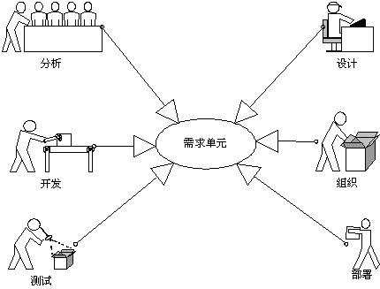

# █ 建模基础

# 一. 面向过程与面向对象

## 1. 面向过程

**面向过程方法**认为我们的世界是由一个个相互关联的小系统组成的. 面向过程的分析方法是找到过程的起点, 然后顺藤摸瓜, 分析每一个部分, 直至达到过程的终点. 

将世界视为过程的方法, 蕴含着一个前提假设: 这个过程的稳定的, 这样我们才有分析的基础, 所有的工作成果都依赖于对这个过程的步步分析. 

**面向过程的困难**, 本质上是因为面向过程方法将世界看作是过程化的. 但世界在不停地变化, 当过程不再稳定, 结果不再能预设地时候, 面向过程方法不再能满足我们的需要. 

由于世界过于复杂且不停变化, 我们只能放弃对整个过程的了解, 寻求一个能够将复杂的系统转化为一个个我们能够控制的小单元. 

## 2. 面向对象

```
我对面向对象编程的目标从来就不是复用. 相反, 对我来说, 对象提供了一种处理复杂性问题的方式. 这个问题可以追溯到亚里士多德, 您吧这个世界视为过程还是对象? 在面向对象兴起运动之前, 编程以过程为中心, 例如结构化设计方法. 然而, 系统已经到达了超越其处理能力的复杂性极点. 有了对象, 我们能够通过提升抽象级别, 来构建更大更复杂的系统. 我认为, 这才是面向对象编程运动的真正胜利. 
																	-- Grand Booch
```

**面向对象方法** 将世界看作一个个相互独立的对象, 相互之间并无因果关系. 独立对象一句某个规律结合再一起, 具备了特有性值和共呢个, 然后又构成了更为复杂的更大的对象, 这正是面向对象的基本原理

面向对象方法与面向过程方法的根本不同, 就是不再把世界看作是一个紧密关联的系统, 而是看成一些相互独立的离散的小零件, 这些零件依据某种规则组织起来, 完成一个特定的功能. 这个区别导致了分析设计方法的不同: 分析设计从国车过分析变成了对象获取, 从数据结构变成了对象结构. 

**面向对象的困难** 现实世界与对象世界之前存在一道鸿沟 -- 抽象. 抽象是面向对象的精髓所在, 同事也是面向对象的困难所在. 

- why: 对象是怎么被抽象出来的, 为什么要这样抽象而不是那样抽象? 
- how: 对象世界可以任意组合, 怎么找到能满足我们需求的那种组合? 
- what: 抛开现实世界, 当我们面对一组对象的时候, 怎么看出它表达的含义? 


为了解决面向对象的三个困难, 我们需要这样的一些方法:

- 一种把现实世家映射到对象世界的方法: **业务建模**
- 一种用对象世界描述现实世界的方法: **概念建模**
- 一种验证对象世界行为正确反映了现实世界的方法: **分析设计建模**


# 二. 统一过程与UML

## 1. 建模与统一过程

### 1.1. 建模

建模, 是指通过对客观事物进行抽象, 以表征并理解事物, 同时把对事物的理解概念化, 形成一种"便于理解事物内部结构和工作原理"的表达. 

建立模型是人们解决现实世界问题的一种常用手段. 模型要能够真实反映客观事物, 就需要有一个论证的过程, 使得模型建立过程是严谨的, 并且结果是可追溯和验证的. 

人一切的中心, 无论什么行业, 什么业务, 本质上都是某些**人**依据某些**规则**在做**事**, 期间使用并产生了一些**物**. 因此, 建立模型的关键就是找到以上的 人, 事, 物, 规则. 

建模包含两个问题: 怎么建? "模"是什么?

#### 1) 怎么建

依赖于方法论, 在上升一点到哲学高度就是认识论.

我们是怎么认识和描述这个世界的? 当我们描述一个事物的时候, 都是从某一个抽象角度来说的, 抽象角度的不同决定了建模方向的不同. 因此, 为现实世界建模的时候, 首先要决定抽象角度, 即建立这个模型的目的是什么. 

在需求分析/系统分析/系统设计时, 要采用面向对象的方法, 在面对问题领域的时候首先不要决定去全盘考虑, 而是找出问题领域包含的抽象角度.

具体来说, 面对一个需求, 首要目标不是弄清楚业务时如何一步步完成的, 而是弄清楚有多少业务的参与者, 每个参与者的目标时什么, 参与者的目标就是我们要找的抽象角度. 与分析完整的复杂业务流程相比, 分析参与者的一个个个目标要简单得多. 实际上, 参与者的目标就是后面要说的"用例".

#### 2) 模是什么

依赖于确定了抽象角度下的场景模拟. 

搞清楚谁发出了什么动作, 作用域什么事物, 产生了怎样的后果. 

一个由抽象角度确定了的目标, 需要由静态的事物加上特定条件下产生的一个特定的场景来完成. 

> 静态的事物(物) +特定的条件(规则) + 特定的动作(参与者的驱动) = 特定的场景(事件)


### 1.2. 统一过程

统一过程 (*UP/RUP, Rational Unified Process*) 归纳和整理了许多软件工程的最佳实践, 是一个采用了面向对象思想, 使用 UML 作为软件分析设计语言, 并结合项目管理, 质量保证等许多软件工程知识综合而成的一个非常完整和庞大的软件方法. 


统一过程定义了软件开发过程中最重要的阶段和工作, 划分了**四个阶段**, 总结了**九个核心工作流**, 定义了参与软件开发过程的各种角色, 以及他们的职责, 还定义了软件生产过程中产生的工件并提供了模板. 


### 1.3. 统一过程与UML

软件项目中真正的灵魂是**软件过程**, 站在软件过程的角度, 线了解一个软件项目是怎么做的, 再去 UML 中寻找需要的工具, 用 UML 中的工具把软件过程中要达到的要求记录下来. 

UML 是一种语言, 用来描述软件生产过程中要产生的文档, 而统一过程则是指导如何产生这些文档, 以及这些文档需要讲述什么的方法. 

### 各阶段与产出

| 阶段           | 模型 | 用例 | 活动 | 包图 | 类   图 | 状态 | 时序 | 协作 | 组件 | 部署 |
| -------------- | ---- | ---- | ---- | ---- | ------- | ---- | ---- | ---- | ---- | ---- |
| 业务建模       |      |      |      |      |         |      |      |      |      |      |
| 需求(系统建模) |      |      |      |      |         |      |      |      |      |      |
| 分析建模       |      |      |      |      | 分析类  |      |      |      |      |      |
| 设计建模       |      |      |      |      | 设计类  |      |      |      |      |      |
| 实施           |      |      |      |      |         |      |      |      |      |      |
| 测试           |      |      |      |      |         |      |      |      |      |      |
| 部署           |      |      |      |      |         |      |      |      |      |      |
| 配置与变更管理 |      |      |      |      |         |      |      |      |      |      |
| 环境           |      |      |      |      |         |      |      |      |      |      |


## 2.UML 元素

### 2.1. 版型

UML 几乎每一个元模型都有很多版型( *stereotype* ), 版型是 UML 元模型的扩展元素, 在元模型基本定义的基础上赋予特别的含义, 使得这个元素适用于特定的场合. 


除了 UML 已经定义的版型外, 为了使元素更加符合自己实际的业务场景, 还可以自定义版型. 版型通常在基础元素的符号上增加 `<<版型名称>>` 的标识, 为了更加明确还可以为版型指定特定的符号. 

### 2.2. 参与者

参与者使在系统之外与系统交互的某人或某事物. 注意系统边界的概念, 参与者只可能存在于系统边界之外, 边界之内的所有人和事物都不是参与者. 

参与者和系统边界总是相伴而生, 设置的边界不同, 参与者就不同. 要弄明白谁是参与者, 首先要明确系统的边界. 

- 谁对系统有明确的目标并主动发出动作? 
- 系统是为谁服务的? 

系统边界之外的人, 即参与者, 或者更应该称为主角, 而系统边界之内的人, 应该称为业务工人.

```
比如张三去银行开户, 大堂经理指导张三填写开户申请表, 柜员根据张三填写的申请表在银行的电脑系统内为张三开户. 
在这个过程中: 
a)如果将整个银行看作一个整体, 那么对整个银行而言, 只有张三是系统边界以外的人, 张三作为主角(参与者)主动发起开户的动作, 大堂经理和柜员是都为了张三的开户目标而工作, 是银行系统里的业务工人.
b)如果将柜员操作的银行电脑系统视为一个系统, 那么柜员就是在电脑系统边界以外的人, 柜员发起为张三开户的动作, 所以对于银行电脑系统而言, 柜员就是主角(参与者)
```

业务主角@业务建模

业务工人@业务建模, 是人与控制类的结合

其他概念: 涉众(干系人), 角色(按职责划分), 用户(可以担任多个角色)


检查点

- 是否找到所有角色? 是否对系统内所有角色都进行了建模和说明
- 每个参与者都至少参与了一个用例? 删除无用的参与者
- 能否为每个参与者(角色)找到不同的人员? 检查参与者之间是否有包含关系, 能否合并以化简
- 是否有参与者担任与系统相关的相似角色?
- 是否有两个参与者担任与用例相关的统一角色?
- 特定的参与者是否将几种完全不同的方式适用系统?
- 参与者是否有直观名称和描述性名称? 用户和客户能否理解这些名称?

### 2.3. 用例

概念: 

- **用例**表达了参与者的一个目标, 
- **用例实例**表达同一用例可以有不同的实现方法. 
- **用例场景**则描述了如何来达到这个目标(如何实现), 通常是用活动图来描述一个用例实现的具体流程. 

用例是一种把现实世界的需求捕获下来的方法. 如果所有对系统有愿望的人, 要做的所有事情都找齐了, 那么系统的功能性就被确定下来了. 

一个用例就是与参与者交互的, 并且给参与者提供可观测的有意义的结果的一系列活动的**集合**. 

**所谓的用例, 就是一件事情**, 要完成这件事情需要一系列的步骤, 也可以有不同的办法, 还可能会遇到各种各样的意外情况, 因此这件事情是由很多不同的情况集合构成的. 在 UML 中一种情况被称为一个**用例场景**, 一个场景就是一个用例的实例.

```
你想做一顿饭吃, 需要完成煮饭和炒菜两件事情, 【煮饭】和【炒菜】就是两个用例;
煮饭, 可以用电饭煲, 也可以在锅里蒸, 【用电饭锅煮饭】和【在锅里蒸饭】就是煮饭用例的两个用例实现;
"淘米-下锅-开火-30分钟后关火"这样一个完整的流程则是"在锅里蒸饭"这一用例实现的具体场景.
启动用例是有条件的, 要做饭得有米, 这是启动用例的前提, 也叫【前置条件】
执行完用例会得到明确的结果, 米变成了饭, 这是用例的结果, 也叫【后置条件】
```

综上所述, 一个完成的用例定义由参与者, 前置条件, 场景, 后置条件构成. 


#### 用例的特征

- 用例是相互独立的: 不需要与其他用例交互就能完成参与者的目的, 即**功能完备**.
- **参与者发起**: 用例体现了参与者的愿望, 参与者的愿望是用例存在的原因.
- 用例结果对参与者是**可观测**和**有意义**的. 系统功能对参与者不可见, 不是业务用例
- 必然以**动宾**短语的形式出现
- 一个用例就是一个需求单元,分析单元, 设计单元, 开发单元, 测试单元甚至部署单元



#### 用例的粒度

在项目过程中, 根据阶段的不同, 使用的用例粒度也不同. 评判标准为用例是否完成了参与者的某个完整目的.

- **业务建模阶段**: 每个用例能够说明一件完整的事情, 即一个用例描述一项**完整的业务流程**
- **用例分析(概念建模)阶段**: 每个用例能描述一个完整的事件流, 即一个用例描述**完整业务中的一个步骤.**
- **系统建模阶段**: 一个用例能够描述操作者与计算机的**一次完整交互**.

不论粒度如何选择, 应该确保在同一个阶段, 所有用例的粒度应该是同一级别的. 粒度的选择问题, 本质上还是边界认定不同而产生的. 

#### 用例和功能

习惯了面向过程结构化设计方法的人员, 对用例最常见的误解就是认为用例就是功能的划分和描述, 认为一个用例就是一个功能点(x).

虽然用例是捕获功能性需求的, 但前提是这个功能性需求是**从参与者的角度出发**的, 用例不是功能.

```
描述一件东西时, 可以从以下角度出发:
- 结构性观点: 这东西是什么?
- 功能性观点: 这东西能做什么?
- 使用者观点: 用户拿这东西做什么?
```

从结构性观点出发, 说明不了事物的作用. 而且在建模阶段, 对于尚不存在的软件系统, 我们无法描述它的结构.

从功能性观点出发, 采用功能分解来获取需求的方式, 因为缺少了上下文, 功能很可能偏离使用者的期望, 变成对用户无用, 或用户不知道怎么用的东西. 

而使用者观点, 实际上就是用例的观点. 用例表明了用户希望系统是什么样, 他将怎样使用这个系统, 希望获得什么结果. 

```
1.功能是脱离用户意愿而存在的, 是事物本身的固有性质(能力);用例是描述用户愿望的, 说明用户将在系统做什么.
2.功能是孤立的, 给定输入就得到确定的输出;用例是系统性的,需要描述谁在什么情况下做了什么得到什么.
3.用例可以视为一系列功能的组合. 但注意是用例分解出功能, 而不是先有功能再组成用例
```

#### 目标与步骤

在**业务建模阶段**, 用例(*业务用例*)是用来捕获功能性需求的, 必须完整描述参与者的一个完整目标. 如果在此阶段误将步骤作为用例来建模, 就无法准确描述参与者如何使用系统, 也就无法准确地捕获功能性需求.

而在**概念建模阶段**, 由于功能性需求已经捕获, 在对需求进行深入分析时, 我们进入了用例的内部. 这意味这我们分析的边界已经改变, 原来的业务工人成为了现在的参与者. 此时在业务建模阶段不能作为用例的步骤, 正是当前的参与者(原来的业务工人)的完整目标, 因此可以作为用例(*概念用例*)使用.

#### 用例粒度的误区

- 粒度过小

  分不清目标和步骤. 误将步骤作为用例, 会导致需求捕获不准确, 还会导致用例的粒度过小, 而粒度过小则会导致系统分析没有抽象的余地.

- 同一阶段中用例粒度大小不一

  这个问题本质上是因为建模者心中的边界不够清晰, 导致参与者定义不清, 进而导致了用例粒度不一.

  边界决定了当前阶段的抽象层次, 决定了哪些信息该暴露, 哪些信息该隐藏. 错误的暴露会导致结构混乱.

#### 用例的版型

- 业务用例 @业务建模, 获取**功能性业务**
- 业务用例实现 @业务建模, 是业务用例的一种实现方式
- 概念用例 @概念建模, 用来获取业务用例中的**核心业务逻辑**
- 系统用例 @系统建模, 用来定义系统范围, 获取**功能性需求**
- 系统用例实现 @系统建模, 代表了系统用例的一种实现方式, 是连接系统用例模型和系统实现之间的桥梁.

### 2.4. 边界

参与者, 用例与边界相伴而生, 边界本质上是面向对象中的一个很重要的概念: **封装**. 任何对象都有边界, 外界只能通过这个边界来认识对象, 与对象打交道.

在收集需求时, 我们总要先假定一个范围边界, 在这个边界内寻找需求. 这个边界并不明确, 随着需求的明确, 边界逐步变得明朗, 最后得到需求的集合决定了最终边界的大小. 

#### 1) 边界决定视界

导致看到的东西不一样. 在建模时, 不同粒度大小的用例都可能是合理的, 因为选择的边界大小不同. 为了更清楚的捕捉需求, 建模时需要不断变换边界, 从更多的侧面去描述同意个信息, 以求最大程度地符合真实地需求. 

#### 2) 边界决定抽象层次

我们可以调整边界大小, 决定我们当前关注的抽象层次, 排除掉非本层次的信息, 使得我们的分析粒度可以有条不紊地逐步细化, 自顶向下地把整个系统描述清楚. 

#### 3) 灵活使用边界

边界不仅能在需求方面发挥作用, 在设计层面也能发挥重要地作用. 通过设定边界, 可以有效地降低复杂度.

边界是无形的, 与其说是 uml 元素, 不如说是一种分析方法. 灵活使用边界来决定抽象层次和视角, 进而排除边界外大量的杂音来减低工作的复杂程度. 

### 2.5. 业务实体

> 业务实体为问题领域中的关键概念建立了概念化的理解,是人们认识问题领域的重要手段. 

类的一种版型, 特别用于**业务建模阶段**建立**领域模型**. 

如果说参与者和用例描述了我们在这个问题领域中要达到什么样的目标, 那么业务实体就描述了我们**用什么来达到**业务目标, 以及**通过什么来记录**这个业务目标. 业务实体代表业务角色执行业务用例时, 所处理或使用的"**事物**".

- 业务实体来自现实世界, 在问题领域里能找到与之对应的事物
- 业务实体是在分析业务流程/场景的过程中发现的, 必须对业务场景有贡献(被使用或被创建)
- 业务实体只包含它本身的特性(属性和方法), 而不包含外界如何使用它的信息.

#### 1) 属性

> 属性是保存业务实体特征的一个记录, 业务实体的属性集合, 决定了它的唯一性. 

在特定的场景下, 只需要关心它与这个场景直接关联的那些属性. 这是面向对象方法中"抽象视角"的体现

属性不是一个不可再分的概念, 可能对应了现实中的一个复杂事物. 而对于现实中的事物, 是否都应该独立建模? 

- 如果参与者可以直接使用, 就应该将其建模为一个业务实体. 
- 如果必须通过另外一个业务实体才能访问这个事物, 那么就应该将该事物作为访问它的业务实体的一个属性.  

#### 2) 方法

> 方法是访问一个业务实体的句柄(handle, 即抓手), 它规定了外部可以怎么使用它

在特定的场景下, 只需要关心它与这个场景直接关联的那些方法. 这是面向对象方法中"抽象视角"的体现.

#### 3) 获取业务实体

1. 建立业务用例场景
2. 找到业务场景中出现的事物, 就是业务实体的备选对象
3. 分析事物间的关系, 确定哪些要单独建模, 哪些作为属性

### 2.6. 包

> 包是一种容器, 如同文件夹一样, 将信息分类, 形成逻辑单元

包最主要的作用就是容纳并为其他元素分类, 需要分类就可以使用包, 比如领域包, 子系统, 组织结构, 层等.

### 2.7. 分析类

> 用于获取系统中主要的职责簇, 代表系统的原型类.


分析类主要有三个, 都是类的版型, 可以对应到 MVC 模式中的 Model, View, Control 三个元素. 

- 边界类: 对系统给外部环境与其内部运作之间的**交互**进行建模
- 控制类: 对一个或几个用例所特有的**控制行为**进行建模, 来源于用例场景中的**行为**, 主要起协调对象的作用.
- 实体类: 对必须**存储**的信息和相关行为建模, 来源于业务模型中的业务实体.

分析类是从业务需求向系统设计转化过程中最主要的元素, 在高层次抽象出实现业务需求的系统原型.

**高于设计实现, 高于语言实现, 高于实现方式.**

由于分析类的抽象层次较高, 基本上停留在概念阶段, 相对于设计实现/语言实现/实现方式等工作来说, 需要考虑的信息量要少得多, 而能够让分析工作**专注在实现需求**上. 也因为分析类得抽象层次较高, 概括能力就很强, 也就比设计和实现要**稳定**.

在一个演进式得软件声明周期里, 维护稳定得分析类比维护以便得射击类要投入更少的精力, 更容易获得一个稳定架构来知道整个软件的开发.

### 2.8. 设计类

设计类是最常见的类图中的元素, 由类型+属性+方法构成. 设计类取决于实施语言, 直接使用与编程语言相同的语言来描述.

- **类** 类是对对象某一方面特征的归纳和抽象, 而对象则是类实例话的结果.
- **属性** 是对象特征, 属性同时表明了对象的唯一性
- **方法** 原则上方法是访问对象或影响其他对象属性或关系的唯一途径, 对象的属性只应该被它自己的方法改变.

### 2.9.关系

- **关联** `─────`

  关联是一种**静态关系**, 通常和运行状态无关, 由常识/规则/法律等因素决定, 是一种强关联的关系. 

  关联关系一般不强调方向, 表示双方是互相知道对方的存在, 但不会相互直接使用, 通常是外部对象通过其中一方找到关联的另一方. 

  特别的, 在用例模型中, 关联关系总是从参与者指向用例, 表示参与者知道用例, 但用例不知道参与者

- **依赖** `---->`

  描述对象在运行时会使用到另外一个对象的关系. 依赖关系是针对运行期的临时性的**动态关系**, 随着运行场景不同, 依赖关系也可能变化. 

  双向依赖是一种不好的结构, 我们应该尽量保持单向依赖, 避免双向依赖. 

- **组合** `────◆`

  表示部分组成了整体, 且部分不能脱离整体单独存在. 

  比如四肢是人身体的一部分, 四肢不能脱离人的身体单独存在. 

- **聚合** `────◇`

  表示个体组成了群体, 且个体可以脱离群体单独存在. 

  比如人聚合成为公司, 人可以离开公司而存在.

- **实现** `----▷`

  表示基本元素只规定一个目标, 但可能由多种不同的实现形式, 每一个实现形式都实现了基本元素规定的目标. 

  比如业务建模中的业务用例与业务用例实现, 设计建模中的接口与实现类.

- **泛化** `────▷`

  表示后者由前者泛化而成, 是对前者更高层次的抽象. 换一个角度来说, 前者继承了后者, 即继承关系. 比如设计建模中的子类和超类的关系. 

  在泛化(继承)关系中, 子类继承了超类的所有特征, 并且子类可以增加/修改超类的行为和属性

- **精化** `---<<refine>>--->`

  用于用例模型, 表示基本用例可以分解出许多更小的关键精化用例, 这些更小的精化用例更细致地展示了基本用例的核心业务. 

  在精化关系中, 精化元素仅仅是从更微观更精确地描述了基本元素的行为和属性, 但没有任何改变.

  精化关系仅用在建模阶段, 在设计实现阶段是没有精化这个语义的. 

- **扩展** `---<<extend>>--->`

  用于在用例模型(通常是概念用例模型), 向基本用例的扩展点插入扩展用例, 表示的是"可选"而不是"必须". 

  即使没有扩展用例, 基本用例也是完整的; 如果没有基本用例, 则扩展用例不能独立存在.

  ```
  (正常通话) --<<extend>>---> (保留通话)
  正常通话时可以选择是否保留通话, 即使不保留通话, 正常通话用例也是完整的
  而如果没有正常通话, 则不可能单独启动保留通话用例
  ```

- **包含** `---<<include>>--->`

  用于用例模型, 表示基本用例中包含子用例. 包含用例是被封装的, 表示可在不同基本用例中复用的行为. 主要是概念用例模型中, 通过分析业务用例场景, 抽象出关键的必选的核心业务, 而形成的包含用例.

  包含用例表示的是"必需"而不是"可选".

  如果没有包含用例, 基本用例是不完整的; 而如果没有基本用例, 包含用例单独存在是没有意义的. 

  ```
  (存钱|取钱) --<<include>>--> (验证账号密码)
  不论是存钱或取钱, 都需要先验证账号密码是否正确, 因此验证账号密码作为一个可复用的包含用例被提取出来.
  如果缺少验证账号密码这一步, 存钱/取钱用例是不完整的; 如果不存钱/取钱, 单独验证账号密码是没有意义的.
  ```


### 2.10. 组件

### 2.11. 节点

## 3. UML 视图

### 3.1. 概述

视图用于组织 UML 元素, 表达出模型某一方面的含义. 

*模型提出了论点, 静态图是论据, 动态图则是论证.*

#### 1) 静态视图

表达模型的结构性特征, 包括用例图, 类图, 包图

只描述事物的静态结构, 而不描述其动态行为

#### 2) 动态视图

表达模型的行为性特征, 包括活动图, 状态图, 时序图, 协作图

动态视图不能够独立存在, 必须关联一个静态视图或UML 元素, 说明模型在规定静态结构下的动态行为. 

#### 3) 视图与视角

视角是人们观察事物的角度. 出于不同的目的, 人们会从不同的角度对同一个信息进行审视和评估. 视角是针对每一个视图来说的, 一个视图展示了一个特定视角下的内容. 不同的视角展示了整体信息不同的特定部分, 体现人们不同的认知角度, 也满足了观察者的某一个审视要求.

- 从信息的展示角度来说, 恰当的视角可以让观察者更容易抓住信息的本质
- 从观察者角度来说, 观察者只关心信息中他感兴趣的那一部分视角的内容, 其他角度的信息对他没有太大意义.

因此在展示信息时, 选择**适当的视角**, 并展示给**适当的观察者**是非常重要的.

建立模型的目的是向相关的人展示将要生产的软件产品, 这包含了很多不同方面的信息, 只有把这些方面都描述清楚了, 用不同的视图去展示软件的不同方面, 才能说建立了一个完整的模型. 所以建模主要的工作分为两个方面: 

- **完整性**: 为软件绘制那些表达软件不同含义的视图, 来完整地表达软件的含义.
- **针对性**: 为不同的的干系人展示他们所关心的那部分视角

### 3.1. 用例图

以参与者和用例作为基本元素, 以不同的视角展现系统的**功能性需求**. 

- 对目标客户: 用例视图是他们业务领域的逻辑化表达
- 对开发团队: 是系统蓝图和开发的依据

用例图的类型

- `业务用例视图` @业务建模 for 业务需求的概念

  使用**业务主角** + **业务用例**, 展现业务建模的结果, 通常要从以下两个视角进行展示

  - 业务主角视角: 着眼于角色职责, 业务主角都参与了哪些用例

    

  - 业务模块视角: 着眼于业务完整性, 业务模块中包含哪些用例, 涉及哪些角色

    

  - 其他视角: 着眼于某个部门, 或某个关键业务实体

- **`业务用例实现视图`** @业务建模 for 业务需求的实现途径

  展现业务用例有哪些实现途径. 

  

- **`概念用例视图`** @概念建模(业务建模的子集) for 细化和准确理解业务用例

  展现从业务用例中分析分解出来的**关键概念用例**, 并表示概念用例与业务用例之间关系(扩展/包含/精化).

  以**业务用例为单元**展示的, 即一个概念用例视图描绘一个业务用例的分析结果, 与之紧密联系的其他业务用例也可以一并展示.

  

- **`系统用例视图`** @系统建模 for 系统开发范围

  展现对业务用例分析后得到的**系统用例**, 以确定**系统开发范围**, 需要开发什么功能, 

  以**业务用例为单元**展示的, 即完成一个业务用例需要在系统中进行哪些操作(系统用例), 是系统需求向业务需求的映射, 保证了建模过程的可追溯性.

  

- **`系统用例实现视图`** @系统建模 for  系统用例的实现途径

  展现系统用例有哪些实现途径, 表达系统实现到系统需求的追溯.  建议使用, 便于形成可扩展的系统. 同时确保每个系统用例都被实现.

  

### 3.2. 类图

类图用来展示系统中的类, 以及类与类之间的关系. 本质上是 现实世界问题领域的 抽象对象 的结构化, 概念化, 逻辑化的描述.

UML 解决面向对象三个困难的方法源于对类理解的三个层次(概念层, 说明层, 实现层)的观点, 类图围绕这三个层次的观点进行建模, 随着抽象层次的降低而逐步细化.

#### 1) 概念层类图

**`概念层类图`** @业务建模/领域建模

着重于对现实世界中问题领域的**概念化理解**, 而不是实现, 类名通常是问题领域中实际事物的名称.

以领域模型图, 即业务实体图来展示的, 表示业务目标通过业务实体的交互来完成.


#### 2) 说明层类图

**`说明层类图`** @概念建模

考察的是类的接口而不是实现, 图中表达的类和类关系应该是对问题领域在**接口层次**抽象的描述

以分析类和分析模型图来表示的


#### 3) 实现层类图

**`实现层类图`** @设计建模

实现层观点认为, 类是**实现代码**的描述, 类图中的类直接映射到可执行代码.

实现类类图明确采用什么语言和规范, 并指定了类的属性和方法, 可以视为**伪代码**.


### 3.3. 活动图

描述为了完成某一个目标需**要做的活动**, 以及这些活动的**执行顺序**. 

活动图实际上描述的是业务流程, 是一种过程化的分析方法. 而在面向对象的眼中是没有业务流程的, 所谓流程是在某些外部力量推动下, 对象之间相互交流的一个过程. 从活动图的观点来描述业务, 实际上是不能直接看到对象如何发挥作用, 容易导致对象对立性被破坏. 

这是一个矛盾: 既要保持面向对象观点中**对象的独立性**, 又要保持现实世界中业务目标的**过程化描述**. 活动图很好地解决了业务目标地过程化描述, 但给对象分析造成了混乱. 

使用活动图时, 建模者自己要避免被过程化地观点影响. 我们使用活动图来描述用例场景, 帮助我们认识问题领域, 从问题领域发现关键地兑现给, 然后就应该把活动图中地流程忘掉, 专心研究关键对象的特性.

UML 有两个层面的活动图, 一种用于描述**用例场景**, 另一种用于描述**对象交互**. 实际建模过程中, 主要应用于业务场景建模和用例场景建模.

#### 1) 用例活动图

用例表达了参与者的一个目标, 用例场景则表达如何来达到这个目标, 用例活动图就是描述用例场景的工具. 


活动图包含以下的一些元素

- 起始点(*initial*)
- 活动(*action*): 活动时业务流程中的一个执行单元
- 条件分支: 根据条件选择一个分支往下执行
  - 判断(*decision*): 根据某个条件进行决策, 执行不同的流程分支
  - 合并(*merge*): 分支执行后合并, 通常可省略该元素, 而直接指向同一个后续元素
- 并发支流: 多个支流并发执行
  - 同步起始(*fork*): 分叉表示从该节点开始多个直流并行执行
  - 同步汇合(*join*): 汇合表示多个支流同时到达后再执行后续活动
- 结束点(*final*)

#### 2) 对象活动图

对象活动图用于展示对象的交互, 但描述的不是特别清晰, 效果不如状态图/时序图/协作图等.


#### 3) 泳道

前面的活动图描述了业务流程中活动的执行顺序, 却没有描述出谁来执行这些活动. 在面向过程的观点里, 对象职责是不重要的, 重要的是业务的执行过程. 而面向对象的观点则相反, 认为对象职责才是最重要的. 泳道的引入解决了活动图不能表述对象职责的遗憾, 代表一个特定的类/人/部门/层次等对象的职责区, 这些对象在业务流程中负责执行的活动集合构成了他们的职责. 

泳道最主要的用途是在分析用例场景时, 用来获取角色职责.


#### 4) 场景建模

- **业务场景建模**

  客户的业务通常是以业务流程的形式存在, 仅从单个客户代表出得到的需求不足以说明业务的全貌. 这时可以以不同的业务代表作为泳道, 以从业务代表处获取的业务用例作为活动来绘制活动图. 

  这对我们获取正确的业务用例和检查已获得的业务用例有很好的帮助.

  - 帮助发现业务用例: 已获取的用例能否完整描述业务流程, 有没有遗漏的环节
  - 帮助检查业务用例粒度: 若现用用例在活动图中显得别扭, 可能是粒度不正确
  - 帮助检查业务主角: 是否有角色职责不清, 或没有合适他的用例
  - 帮助检查业务用例: 是否有无处安放的用例, 是否可以舍弃

- **用例场景建模**

  业务用例是参与者要达到的业务目标, 并通过用例场景来说明如何达到目标. 

  通常是以业务主角和业务工人作为泳道, 以工作单元作为活动来绘制活动图, 通过这个活动图描述业务场景.

  这种活动图对我们获取概念用例, 角色和业务实体有很好的帮助

  - 帮助发现概念用例
  - 帮助发现角色: 一个泳道表示一个角色, 是否有相同用例被不同泳道(角色)使用, 若有可抽象出新的角色
  - 帮助发现业务实体: 活动通常采用动宾结构, 这个宾语往往就是业务实体
  - 帮助建立领域模型: 若某业务实体出现在不同活动中, 则可能是关键业务对象, 围绕它可建立领域模型.

### 3.4. 状态图

状态图显示了一个状态机. 状态机用于对模型元素的动态行为进行建模, 具体来说是对系统行为中受事件驱动的方面进行建模, 主要用于描述对象的状态变化(*怎么变*), 以确定什么行为改变了对象状态(*为什么变*), 以及对象状态变化对于系统的影响(*变了之后怎么样*). 

状态机用于描述某一个对象在整个生命周期内的状态变迁, 以获得对这个对象的理解, 同时获得系统和实体对象相互影响的关系. 可以用来描述业务实体对象*@业务建模*, 分析类对象*@分析建模*, 设计类对象*@设计建模*.


状态图包含以下的元素

- 初始状态: 状态机的起始位置, 不需要事件触发
- 状态: 是对象执行某项活动或等待某个事件时的条件
- 复合状态: 具有子状态的称为复合状态, 子状态也有初始状态和终止状态
- 转移: 是两个状态间的关系, 表示发生某事件且条件满足时, 对象执行某些操作并转换状态
- 事件: 特定的动作或行为, 如果条件满足, 事件将触发一个转移
- 条件: 是一个布尔表达式, 事件发生时检查是否成立. 其结果可决定转移的分支, 或拒绝转移
- 最终状态: 表示状态机执行结束, 或对象生命周期结束

状态图在描述单个复杂对象的行为时非常有助于我们理解一个对象的行为. 但不需要为每个对象都绘制状态图. 建议仅对领域模型中最关键的业务对象绘制, 尤其是参与了多个用例场景多个活动的业务对象. 

### 3.5. 时序图与协作图

时序图用于描述按事件顺序排列的对象之间的的交互模式: 它按照参与交互的对象所具有的生命线, 和它们相互发送的消息来显示这些对象.

协作图描述了对象间交互的一种模式: 通过对象之间的连接和它们相互发的消息来现实参与交互的对象.

在时序图/协作图中, 包含对象和主角实例, 以及说明它们如何交互的消息

时序图与协作图是可以相互转换的, 区别在于

- 时序图强调消息事件的发生顺序, 更便于阐述事件流的过程
- 协作图强调对象之间的关系, 更便于获得对对象结构的理解

通常我们使用时序图/协作图来描述**用例实现**, 通过贡献于该用例实现的对象之间的交互, 来说明用例是如何被对象实现的. 使用时序图来描述用例实现是一种从现实世界到对象世界的映射方法, 它对我们确定对象职责和接口有显著的作用. 对象的核心就是职责与接口. 

我们知道有三种不同层次的类图, 对应类在三个层次的观点. 时序图/协作图作为描述类的实例(即对象)间交互的图, 针对三个层次也有所不同. 

#### 1) 业务模型时序图/协作图

用于为领域模型中的业务实体交互建模, 目标是实现业务用例. 

活动图可以帮助我们发现业务实体, 如果有了活动图再来绘制业务实体时序图, 则会有迹可循, 非常容易. 

时序图中可以非常容易地分辨对象的职责, 生命周期和会话过程, 对业务模型时序图的理解有助于了解业务架构.


绘制业务模型时序图应注意

- 时序图以达成**业务目标**为准则
- 使用的描述语言应尽量采用**业务术语**
- 业务模型时序图对分析设计有利, 但对编码实现而言过于粗略而不能作为依据

#### 2) 概念模型时序图/协作图

概念阶段的时序图采用分析类来绘制, 目标同样是实现业务用例. 但由于分析类本身代表了系统原型, 所以这个阶段的时序图已经带有计算机理解

概念模型时序图通常是依据业务模型场景图来绘制的. 它将业务模型场景用分析类重新绘制以便, 既保留了实际业务需求, 又得到计算机实现的基本理念


#### 3) 设计模型时序图/协作图

设计模型时序图使用设计类作为对象绘制, 目标是实现概念模型中的某个事件流, 一般以一次完整交互为单位, 消息细致到方法级别, 已经可以看作伪代码了. 

显然, 在实际工作中不会为所有交互绘制时序图, 那是一个巨大的工程量. 实际项目开发过程中, 我们通常都会使用框架来简化开发,  因此也只需要为框架中的关键类描述典型的交互场景即可. 


但在省略大量设计模型时序图的同时, 我们需要使用更多的概念模型时序图. 才能保证有足够信息来说明需求与实现之间的过渡.

### 3.6. 组件图 部署图

### 3.7. 包图

实际建模过程中, 元素非常多, 就需要通过包对元素进行分类整理, 从大到小, 从粗到细的建立元素之间的关系.

约束最小, 可在任意阶段使用

## 5. 用例驱动


## 6. 迭代开发


迭代式软件生命周期式一种演进式的软件开发方法, 它将一个软件视为多次增量的结果, 每一次迭代完成该软件的一个部分, 而每一个迭代可视为一个小的瀑布模型.

### 6.1. 迭代计划 vs 里程碑计划

有的人可能会将迭代计划与里程碑计划混淆.

真正的迭代计划, 每一个迭代都经历一次完整的软件生命周期, 即每一个迭代都需要经历需求-分析-设计-实施的全过程, 每一个迭代都将得到一个可运行的系统. 迭代计划的目标是尽早地实现需求, 得到一个可运行的系统. 

### 6.2. 风险控制

对于软件来说, 最主要的一个风险就是需求变更或者需求理解错误. 

最有效的应对办法就是尽早验证, 并控制风险的影响规模. 假如需求变更总是无法避免的, 那么就让变更发生在项目的早期, 并且是在与之相关的部分还没有大规模开展工作时. 

客户通常是在见到并使用系统后, 才会发现系统中不合适的地方, 进而提出需求变更.

迭代式开发的目的就是要尽早给客户提供一个可运行的系统. 当需求还在进行过程中时, 需求人员从众多需求中发现对客户来说最为关键, 或者最复杂/最不稳定的那部分需求, 在早期迭代计划里就可以包含这一部分需求. 这样, 在需求人员还在细化其他需求时, 针对这部分需求的设计和开发已经开始. 而当需求人员将其他需求分析得差不多时, 早期迭代也已经完成, 可以交付客户进行早期验证, 并尽早收到客户对这些需求的反馈.

### 6.3. 保证核心质量

如果将客户的核心业务安排进早期迭代, 则能够保证这些核心业务尽早和尽可能多地经历验证和测试, 确保最后交付时核心业务成为最稳定的模块. 

### 6.4. 技术/人员风险

在迭代式开发过程中, 早期迭代可以包含哪些不明确的技术风险, 以便更早地知道消除或降低技术风险的办法. 同时对于开发人员来说, 分析设计和开发越早参与项目, 则技能越熟练, 后期面对的技术问题就越少.

另一方面, 迭代式开发过程中, 开发工作能够尽早开始, 相对于瀑布模型将开发集中在后期, 实际的开发周期能够加长, 因此可以投入更少的开发人员.

### 6.5. 用例驱动

如果采用 UML 建模, 用例就是最好的迭代点, 我们可以为用例排出优先级, 在每个迭代实现一部分用例. 

# █ 统一过程与uml

# 一. 统一过程与uml

不要从 UML 的定义去思考如何做软件, 而要站在软件工程的角度, 去 UML 中寻找需要的工具. 

软件项目真正的灵魂是软件工程, 软件工程的需要才是 UML 之类的工具诞生的原因. 因此, 在讨论如何使用 UML 之前, 需要系统地学习软件工程, 掌握了软件工程, 才知道为什么要有用例, 为什么有分析模型, 才能明确什么时候需要什么样的 UML 视图来表达软件的观点.

要用好 UML, 首先要明确地知道自己想要做什么, 根据自己的目的来寻找合适的模型, 确定了模型之后, 再确定要采用哪些视图来表达模型. 

软件过程明确了软件的生命周期, 明确了软件生命周期过程中的成果物和可交付物, 同时也就明确了需要什么样的模型, 需要什么样的视图.

其实, 任何一种软件过程都可以使用 UML 作为工具, 而统一过程, 作为一个软件过程的通用模板, 对 UML 的使用也更为深入. 统一过程覆盖了软件过程的方方面面, 学习统一过程就可以快速建立起完整和全面的软件工程概念, 而真正理解了软件工程, 在实际项目中就能够做到有效地裁剪, 定义出适合自己团队的软件过程. 

# 二. 业务建模

## 1. 目的

业务建模位于统一过程的**先启**阶段, 主要目的在于为客户的真实业务建立模型, 理解客户的真实需要. 注意业务模型与计算机系统无关, 无论是否建立软件系统, 业务都客观存在, 因此建模中要抛开

- 了解目标组织的结构及机制
- 了解目标组织中, 当前存在的问题, 并确定改进的可能性
- 确保客户, 最终用户, 开发团队就目标组织达成共识
- 导出支持目标组织所需的系统需求
  - 业务模型是系统需求的重要来源, 用来了解用户对系统的需求
  - 业务实体是分析涉及工作流的重要输入, 用来确定设计模型总的实体类

## 2. 流程和活动集


## 3. 产出和工件集

业务建模阶段需要建立以下模型:

- **业务用例模型**: 获取客户的真实业务范围

  - 业务用例视图(用例图): 描述客户的业务目标
    - 业务主角视角: 关注角色职责是否完整
    - 业务模块视角: 关注业务是否完整

  - 业务用例场景(活动图): 说明业务用例的执行过程, 说明业务主角是如何使用业务用例完成业务目标
  - 业务用例实现视图(用例图): 描述客户的业务目标有哪些实现途径
  - 业务用例实现场景(活动图): 针对每一个业务用例实现, 说明实现该方式的流程和步骤

- **概念用例模型**: 精化业务用例, 获取业务用例中关键和核心的工作单元, 以深入地理解业务

  - 概念用例视图(用例图): 精化/分解粒度过大的业务用例, 得到概念用例
  - 概念用例场景(活动图): 描述精化/分解后的概念用例如何完成业务用例
  - 业务分析类(分析类图): 描述概念用例涉及到哪些业务实体对象及相互关系
  - 业务分析场景(时序图/协作图): 描述业务实体对象之间如何交互

- **领域模型**: 试图定义出能够满足所有业务场景的对象结构, 以帮助理解问题领域中的关键概念和关键对象
- 领域模型图(业务实体类图): 即概念层类图, 着重对问题领域的概念化理解
  - 业务实体交互图(时序图/协作图): 描述业务实体对象之间如何交互
  - 领域对象状态图: 描述关键业务对象在完整业务流程中的状态变化, 及造成的影响
  
- **业务架构**: 为业务领域建立一个维护和扩展的逻辑结构, 描述业务的构成(商业模式)

  - 领域包(包图): 描述业务领域主要的业务模块
  - 组织结构包(包图): 描述组织结构, 参与者都有哪些角色

- **相关文档**
  - 业务词汇表
  - 业务规则
  - 业务前景
  - 业务架构文档
  - 补充业务用例规约


# 三. 系统建模

## 1. 目的

系统建模即需求过程, 针对客户现存的实际业务或客户规划中的实际业务, 决定要把哪些业务纳入系统开发范围, 确定系统需要解决哪些问题, 实现什么功能.

- 与客户和其他涉众, 在系统的工作内容方面达成一致并保持
- 使系统开发人员能够清楚地了解系统需求
- 定义系统边界(做什么, 不做什么)
- 为计划迭代的技术内容提供基础
- 为估算开发系统所需成本和时间提供基础
- 定义系统的用户界面, 重点是用户的需要和目标

## 2. 流程和活动集

系统建模在先启阶段开始, 在精化阶段中细化. 

- 先启阶段, 侧重于**分析问题**和**理解涉众需要**
- 精化阶段, 侧重于**定义系统**和**改进系统定义**
- **管理系统规模**和**管理需求变更**的活动贯穿项目始终.


## 3. 产出和工件集

系统建模阶段主要是建立以下模型

- **系统用例模型**
  - 系统用例视图(用例图): 系统功能性需求的高层视图, 表达了全部功能性需求
  - 系统用例场景(活动图): 说明参与者如何与计算机交互以达成其目的
  - 系统用例实现(用例图): 描述系统用例的实现方式, 是系统实现到系统需求的追溯
  - 系统用例实现场景(活动图/时序图): 说明参与者如何与计算机交互以达成其目的
  - 系统用例规约: 描述参与者如何启动和中止用例, 如何使用用例完成目标等相关规则.
- 系统原型
  - 用户界面建模
- 其他文档
  - 软件需求规约
  - 需求管理计划
  - 用例示意板: 描述界面如何使用用例


# 四. 分析设计

## 1. 目的

分析设计建模分为概要设计和详细设计两个过程, 主要在精化阶段执行, 主要使用分析模型和设计模型来完成设计分析过程.

- 分析建模: 需求向设计模型转化的过渡, 建立系统原型, 是系统实现需求的第一手方案
- 设计建模: 描述用例实现的对象模型, 对系统详细设计, 是编码实现前的最后一道建模工序

## 2. 完整流程

### 2.1. 流程和活动集

由于完整的统一过程是一个重量级的过程, 适合大型或超大型的项目, 因此其中的分析和设计工作流程相当复杂, 对大多数中小型项目并不十分合适, 因此只简单介绍一下, 不过多赘述


#### 1) 定义备选架构


#### 2) 改进备选架构


#### 3) 分析行为


#### 4) 设计实时/非实时组件


### 2.2. 产出


## 3. 简化流程

### 3.1. 分析建模

由于统一过程定义的分析/设计流程过于复杂, 这里介绍一下简化后的分析和设计建模过程. 

#### 1) 流程


#### 2) 产出

- 分析模型
  - 分析类类图
  - 分析类时序图/协作图

### 3.2. 设计建模

#### 3.1. 流程


#### 3.2. 产出

- 设计模型
  - 设计类类图
  - 设计类时序图/协作图


### 3.3. 推荐做法

实际项目中, 维护完整的设计模型成本非常高, 几乎没有人会这么做, 原因有以下几点:

- 实际项目中的类非常多, 如果将所有的类都绘制出来, 工作量非常庞大. 
- 实际项目中都会使用一些简化开发的框架, 导致许多操作的设计模型都大同小异, 没有必要重复绘制. 
- 需求随时可能发生变化, 即使绘制好设计模型, 一点需求变动就会导致大量的修改

因此, 建议将维护设计与需求一致的工作交给分析模型, 设计模型仅仅针对一些典型场景建立和维护, 并保持这些场合中的设计类向分析类的映射. 如此一来, 设计模型所针对的场合都是普遍的问题, 相对稳定, 不会经常变化. 同时, 分析模型由于抽象层次较高, 也是比较稳定的, 维护分析模型要比维护设计模型轻松得多.


# 五. 实施建模

## 1. 目的

实施建模的目的, 是建立组件及其所在的实施子系统的集合. 

在一个以架构为导向, 以迭代为生命周期的项目里, 建立实施模型是很有意义的, 通过是是模型, 可以允许系统在多次迭代中逐步完善, 没一次迭代组装出系统的一个部分直至完成. 不过, 前提是分析设计过程足够完善, 以至于可以飞铲搞清楚的定义出系统的每个组件, 以及实现这些组件的类, 组件之间的依赖, 接口和通信标准(组装规则). 显然这需要在分析设计阶段投入大量的时间和精力.

而对于中小型项目, 很可能不需要使用组件化开发模式. 对于中小型项目, 采用简化的实施模型也是有好处的. 

## 2. 完整流程

### 2.1. 流程和活动集


### 2.2. 产出


## 3. 简化流程

统一过程定义的实施建模, 需要以架构为导向, 组件化的开发模式, 这将花费大量的成本在分析设计阶段, 对于中小型项目来说, 这是不现实的. 

为此, 这里介绍一个适合中小型项目的实施建模工作流程, 是按用例的优先级, 采用多个迭代的方式来实施项目的. 


在中小型项目的实施模型中, 最重要的思想就是迭代式开发. 

每一次迭代的结果都应当式一个可运行的系统, 而不是类似核心模块这种不可执行的模块. 如果某次迭代只产生了一个核心模块, 它不能被测试(按用例场景测试), 不能被验证(被证明实现了用例场景), 更不能交付客户做试运行, 那么这个迭代基本上式没有太大意义的. 

因此, 建议采用实施模型的思想, 以用例为基础来分工, 因为一个用例就是一个可独立执行的单元, 每一次迭代的目标可定义为实现了哪些用例. 分工时最先考虑的是哪些逻辑组件可以实现这些用例, 哪怕实现用例的组件跨越了多个模块/业务/小组. 为了快速搭建一个可运行的系统, 可以只完成每个组件中的与实现用例有关的那部分功能. 

- 用例代表了客户的需求, 它达成了客户的一个系统目标, 并且描述了客户如何使用它的全部细节. 因此, 当一个迭代完成时, 我们可以尽早交付客户做需求验证, 避免在大量工作完成后才得到反馈, 甚至是需求变更而带来大范围的返工.
- 用例场景描述了该用例应当完成的全部功能
- 项目时间也许总是不够的, 采用迭代式的开发模式, 在项目到期前, 即便未能完成全部项目, 也还能交付给客户一个核心模块和功能已经足够稳定和健壮的系统. 
- 人们在工作中总需要一些成就感来激发工作热情. 迭代式开发, 每隔一两个月就有一个可运行的系统面试, 伸手可及的正反馈将不断激发工作热情.

统一过程试图用最稳定, 最全面, 最安全的方法囊括软件开发的全部, 看起来的确式很笨重的, 但是统一过程更重要的是揭示了软件生产的秘密, 运用这些思想, 完全可以定制出适合自己项目的简化过程, 也可以将统一过程中有用的思想与极限编程/敏捷方法等轻量级的方法结合起来. 


