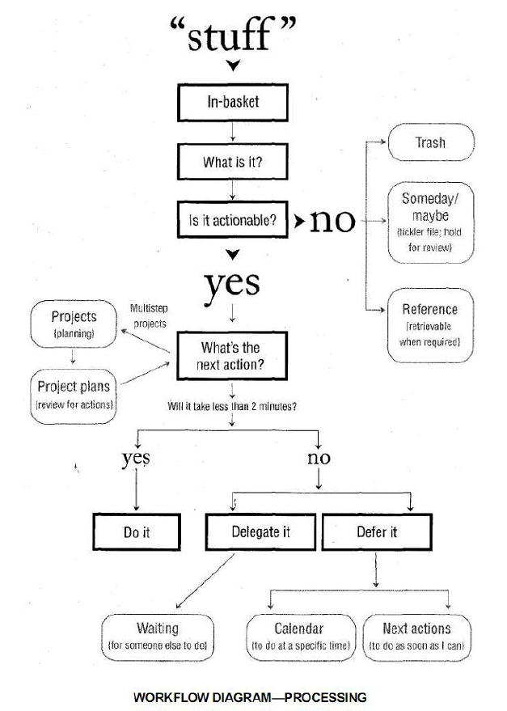

# █ 尽管去做, 无压工作的艺术

# 一. 新情况, 新做法

> 焦虑是由于缺乏控制力，组织管理、准备和行动不足所造成的。——戴维·凯克奇（David·Kekich）

本书中的这套方法，完全基于两个主要目的：

- 搜集一切需要处理的事务 不论大小, 把它们统统置入一个脱离大脑的逻辑系统中。
- 训练自己在接手事务的前期就作出分析和计划, 快速确定处理方案, 以确保在任何时候, 都拥有一套可以立即执行的计划（以及相关的行动）

## 1. 挑战: 工作太多, 压力太大

- 信息时代要处理的信息越来越多, 且工作不具备明确的边界, 导致工作量变大

- 外部环境不断变化, 人们具有更强的独立性和自由度, 频繁变换职业导致工作内容变化

- 由于工作事务多且杂, 无法用传统日程表或全部排列优先级来进行管理

- “大局”与事物的本质
  - 着眼大局, 认清主要的目标和价值观，为我们的工作赋予了先后次序、意义和方向, **但实践效果不佳?**
    - 干扰太多, 分散注意力, **无法集中精力**关注更重要的问题
    - 由于个人管理系统欠缺, 对复杂困难的任务产生**抵触情绪**, 阻止了具体行动的实施
    - 更高的视角提出了更多任务和更高标准, 使我们压力更大
    
    ```
    关注价值观并不会使你的生活变得简单。它阐明意义，指导方向，而且带来更多复杂的情况
    ```
  
  - 缺少一套连贯一致的系统和工具，并能够在实实在在的工作中发挥出卓越的功效
    - 必须能够**从大局着眼，从小处入手**，并且使二者有机地融合在一起
    - 必须能够**管理多个层面**
    - 必须能够坚持不懈地对每天衍生的众多新生事物**保持控制**
    - 必须比原来**节省时间和精力**
    - 必须**化繁为简**

## 2. 追求: 心静如水的状态

“心静如水”的理想状态: 依照所投入物体的质量和力度作出相应的反应，然后又归于平静。既不反应过激，也不置之不理。  

在任何情况、任何时间内都能够随心所欲地控制自己的一切事物，能够100%地把精力投入到工作中而不受任何外界的干扰

## 3. 原则：有效处理心中的承诺

### 压力从何而来

由于人们对自己作出的承诺或者承担的义务**不明确**，脑子里总想着各种各样未完成的事情, 导致了他们承受着重重**压力**的折磨.

- **为什么有些事情总是萦绕在你的心头** 

  因为你希望它们的状况能有所改善, 但存在以下问题

  - 还没有确切地认定它们的**预期结果**是什么
  - 还没有决定你下一步的**具体行动**到底是什么
  - 还没有把后果和即将采取行动的提示信息存入你所**依赖的体系**中去
  - 大脑会记住这些问题, 并持续向你施加压力, 增加你的精神负担

- **大脑并不总是那么管用**

  - 不断地考虑那些毫无进展的事情纯粹是浪费时间和精力。而且这往往只会增加你的焦虑不安

- **“材料”的转化**

  - 材料, 指任何引起你注意但尚未找到归属的事情，所有未决定解决方法和下一步具体行动的事情
  - 我们需要把所有我们尽力管理的“材料”转化为可以付诸行动的事务。
  - 绝大部分任务清单只是列举“材料”, 未转化为预期结果和行动方案(工作提纲和细节)

### 如何防止违约

压力, 焦虑和内疚并不是因为承担太多的工作，更主要是由于你撕毁了同自己的约定.

- **不签订协议, 学会拒绝**

  保持一份工作清单，可以让你更加轻松地并理直气壮地说“不”  

  把一切分散注意力的事情全部放进了工作篮，这一习惯让他有机会重新考虑哪些任务才是真正值得关注的  

- **完成协议**

  根除消极情绪的另一种途径就是完成这项工作，然后标上“已经完成” . 每一个人都渴望成功。为了满足这一愿望，给自己安排一些能够轻松完成的任务是一个非常好的方法  

- **重新协商协议**

  你不打算大幅度地降低对你的标准，也不希望停止工作，同时仍然期望逃离紧张压力的折磨, 那你就必须学会重新商定协议  .  这是重新调整约定，而不是毁约  

### 管理对自己的承诺

为了能够高效地应付这一切问题，首先，你必须**收集所有**那些“经常唤醒你模糊记忆”的事情，然后**着手计划**如何一一**解决掉**

工作篮里的材料, 都代表着与自己的承诺, 学会对那些承诺加以控制，可以有效地缓解压力

- **管理承诺时的基本要求**

  - **收集一切**: 所有未完成的事项, 都放入工作篮. 要经常查看并清理工作篮
  - **制定计划**: 明白你的工作到底是什么, 需要采取什么行动来推动工作的发展进程
  - **提醒与行动**: 一旦决定了需要采取的行动方案, 安排组织好这些行为的提示信息(记录下来)

- **检验这种模式的一个重要训练**.

  - **任务与预期结果**: 写下要处理的事情, 并描述理想结果(收集, 展望结果)
  - **分解任务列计划**: 写下推动事情的具体行动(将任务分解成行动)
  - **下一步行动**: 接下来要做什么?(找到下一步行动)

  > 思考, 让你更加明确地了解到你所**期盼的结果**和确定了下一步需要采取的**行动方案**, 从而增加你对事情的**控制力**, 精神放松了一些，注意力更集中了

## 4. 途径：管理你的行动

- **管理行动的重要性**

  本质: 在某一时间，如何选择要做的事情、如何管理行动.

  问题: 管理那些尚未确认或决定的行动是极其困难的, 因为**还没有搞清楚要做些什么**

  事实上, 你仅仅能够完成这项任务中的某一个步骤, 多数情况下, 一两分钟就能完成推动工作进程的步骤

  问题的关键在于，他们无法断定到底要干些什么，下一步需要采取哪些行动.事情极少由于时间匮乏而受阻。它们陷入困境往往是由于未能判定行动而造成的。

- **自下而上法的价值**

  - 从当前活动和任务的最底层入手, 对提高工作效率具有实用价值
  - 自上而下法的问题: 大多数人陷于繁杂的事务中难以脱身，阻碍了他们总揽大局, 自下而上反而更加有效。
  - 当你能轻松应对底层具体行动的时候, 你才能进行更高一级思维活动

- **横向和纵向的行动管理**

  - 横向, 捕捉各种各样不同的事情

    需要一个完善的系统来辅助记录，并在需要时及时地提供提示, 确保能够轻松快速地切换任务。

  - 纵向, 针对每个具体的主题和工作所进行的思考

    即“项目规划”, 勾勒出执行过程中一切必要的想法、细节、重要环节和事情的先后次序

  - 横向控制和纵向控制的目标是一致的：解除你精神上的负担，并把事情做好

- **最重要的技巧：把一切赶出你的大脑**

  - 大脑中盘踞问题的多少与其解决的效率成反比. 杂念越多, 效率越低
  - 大多数人只在自己工作生活已经一团乱麻的时候才会采取行动, 列出工作清单. 
  - 将这种做法作为生活常态, 并使之贯穿于你生活中的各个领域

# 二. 五个阶段




无论什么情况下, 我们在工作时都将经历5个阶段: 

1. **收集**: 收集一切会引起我们注意力的事情
2. **处理**: 加工处理, 确定它们的实质及接解决方法
3. **组织**: 整理得出的结论, 列为我们行动的备选方案
4. **回顾**: 检查行动清单, 选择下一步行动
5. **行动**: 实施最佳方案

这是我们习以为常的处事方法, 但是大多数人在这5个阶段都有很大的改进空间.

通常, 我们在一天里的不同时段, 分别处理5个阶段效果会更好. 许多人无法把工作安排得井井有条，主要原因正是他们试图一口气完成这5个阶段的工作. 

他们试图一口气完成最重要工作, 而对于"不那么重要"的事情, 则是搁置一旁不作处理, 那么这件事情就成了一件悬而未决的问题. 它将时时刻刻地消磨你的精力，阻碍你集中精力思考那些真正重要的事情。

横向管理的关键

- 明确判定工作的预期结果以及下一步具体行动；
- 把一切尚待解决的工作的提示信息安置在一个安全可靠的系统中，并定期回顾和检查。

## 0. 准备工作

实践 GTD 之前, 需要花费一些功夫做启动工作

1. 花时间收集, 初始化工作篮

2. 整理自己的工作区, 打造自己的高效环境

3. 确定需要使用的工具: 滴答清单以及合适的分类清单(详见组织整理的相关内容)

   预先定义好分类, 加工处理时, 归档的程序要简便快捷

   为了把工作篮清扫干净, 你的管理系统必须全部到位, 若没有给设定清晰可辨的界限, 缺乏有效的流出路径, 工作篮的材料就会堆积如山

## 1. 收集, 收集一切

- **捕获一切“未尽事宜”**.

  先将未尽事宜在一个收集篮, 等有时间再来来思考它到底是什么问题, 打算如何解决. 定期清空收集篮

  一定要在你彻底完成所有的收集工作之后，才开始对其进行处理

  - 这有助于你认识到自己面对的工用量
  - 同时让你清楚“终点”在哪
  - 当开始处理（process）和组织（organize）的时候, 不用担心遗漏, 可以集中精力

- **影响成功收集的因素**

  - **收集一切**未尽事宜

    如果不能收集一切, 大脑里就不能完全信任我们的系统, 而是处于两头兼顾、疲于奔命的状态之中

  - **尽可能少**的收集工具数量, 方便且集中, **滴答清单**

  - **定期清空**收集工具

    如果不清空收集工具, 加工处理里面的材料, 那么就是一个堆满杂物的仓库

    清空不等于全部完成, 只是确定材料的实质, 并妥善安排行动计划


## 2. 处理, 确定实质及解决方法

所谓的清空工作篮，并不意味着完成所收集到的全部工作和行动。

它指的是识别你搜集到的每样东西，确定它是什么，意味着什么，需要你进行什么样的行动

- 从上往下依次处理: 保证每一件事情都必须获得均等机会的处理, 选择性处理容易产生遗漏

- 每次只处理一项材料，可以迫使你集中全部注意力来作出判断

对每个材料决定它所需要进行的下一步行动, 需要你又快又果断地思考:

- **what: 这是一件什么事情？预期成果是什么？**

  这些材料到底是什么，需要做些什么, 达到什么效果

  提高工作效率的关键性问题, 思考后果是促使希望转化为现实的最为有效的手段之一。

- **是否需要采取行动呢？**

  - **不需要行动**

    - **垃圾**: 不需要保留, 可以丢弃
    - **将来也许**: 需要孵化, 酝酿, 日后重新评估, 可以写在备忘或日程表中
    - **参考资料**: 有价值的资料, 存档备查

  - **需要行动**

    - 要达到什么目标和结果?

      需要在清单中体现出结果, 提醒这里有个未解决的问题

    - 如果是一个项目

      需要多步行动才能完成, 列入"项目"清单, 并分解成"行动"清单

    - 下一步行动是什么? 必须是可执行的具体的行动

      - 不超过两分钟, 立即处理
      - 委办任务, 指派给别人, 设置跟踪提醒
      - 待办事项, 记录在行动清单或日程表上, 延迟处理

## 3. 组织, 将行动放到合适的清单

材料需要先加工, 才能有效的组织整理起来. 材料加工后得出的行动, 才是真正组织整理的对象

经过分析处理, 待处理的材料以下去向, 需要事先准备好相应的清单

### 需要执行的行动或项目

- **项目清单**: 任何一个由几个步骤才能完成的任务. 仅作为总目录, 让你宏观感受工作量, 方便总揽全局
- **项目资料**: 项目相关的文档资料, 分解后的行动清单, 存放具体任务细节
- **行动清单**: 记录所有行动的清单. 任务太多可以根据场景进一步细分
- **等待清单**: 委托他人的跟踪提醒, 引用原始内容

### 不能够立即落实的工作

对于那些不能采取行动的事务来说，它们可以划分为

- **垃圾**: 果断丢弃, 不要污染我们的系统
- **日程表**: 保持神圣, 不要将所有事情加到日程表, 不便调整, 且会弱化日程表的日程提醒效果
  - 在某一个**确切的时间**里采取的行动；
  - 在某一个**确切的日期**里采取的行动
  - 在某一个**确切的日期**里将要获取的**信息**；
- **将来/也许清单**: 记录有兴趣, 但暂时条件不成熟, 无法执行的任务, **要定期查阅, 如周回顾**
- **参考资料**, 在需要时能够毫不费力地查寻到的资料
  - 特定主题的存储区, 按资料的内容分类保存
  - 一般资料文件区, 无法归类到特定主题的资料

### 其他清单

- 核查清单: 
  
  记录工作中容易遗漏或忽视的细节的清单, 如旅行前的准备, 或者是岗位职责等
  
  - 个人主张（如有关价值观的个人陈述）
  - 工作责任范畴（工作的职责范围）
  - 旅行核查清单（旅行前要检查和完成的事情）
  - 每周回顾（在每周回顾中要检查和更新的事情）
  - 培训计划的组成要素（当推出某项计划时，一切需要处理的情况，从前期到后期）
  - 客户
  - 会议核查清单（准备召开一个会议时，所需要筹备的事情）
  - 焦点区域（生活中所扮演的重要角色和承担的责任）
  - 生活/工作中的关键性人物（定期评估人际关系，以推动事态的发展，捕捉新的机遇）
  - 组织系统图（需要管理和维持的输出区域和关键性人物）
  - 个人发展（应该定期评估的情况，以确保个人平衡与进步）  

## 4. 回顾, 维护系统, 保持控制力

gtd的目的在于排除杂念, 在你选择一个行动时, 能够坚信这是当前最好的选择, 其他事情都暂时不必操心.

### 4.1. 行动前回顾

回顾的内容和时机, 根据你的需要，在任何需要的时候都能看到行动提示, 每次采取行动前都可以浏览一下

1. 日程表: (行动前, 日/周/月)掌握当天要完成的任务, 才能灵活安排其他工作(有时间限制 != 重要的)
2. 行动清单: (行动前, 日/周/月)预先确定要做的具体行动, 时间允许就可以实施. 
3. “项目”、“等待处理”和“将来/也许”: (日/周/月)根据实际情况定时查阅, 不对其念念不忘影响效率即可

### 4.2. 周期回顾

定期回顾并更新你的系统，才能让你切实控制系统中的一切，让你对正在进行的事情更加“确信”。 

每周回顾并更新, 涵盖了5大阶段的4个: 收集,加工,组织,回顾

每隔一段时间，要全面地回顾一下自己的生活和工作的情况(日程表, 下一步行动, 委办提醒). 

每周再浏览一下那些未完善的工作和悬而未决的问题(收集篮, 将来/也许)，快速地清理一下自己面临的行动和抉择，从而从根本上对某一时刻需要处理的工作作出有效的选择。

- 成功的关键因素：每周查阅

  - 收集和加工处理所有的“材料”。
  - 回顾和检查你的系统
  - 更新各类清单
  - 做到干净、清楚、实时和完整

大多数人并没有真正拥有一个严丝合缝的完整系统, 也无法在回顾时获得实质性得回报, 因为他们没有总览全局, 总觉得遗漏了某些东西. 

你建立的系统越完备，你就越信赖它；你越信赖它，你就越有坚持运行这个系统的动力。每周回顾就是保持系统完善性的关键所在。

定期回顾的一个重要的作用，让你**始终记得最要紧的工作、最重要的目标，把握住自己的方向** .

1. 整理笔记
2. 清理日程表
3. 清空大脑, 记到收集篮
4. 回顾项目清单
5. 回顾下一步行动
6. 回顾等待清单
7. 回顾核查清单
8. 回顾将来/也许清单
9. 回顾其他辅助资料
10. 收集新想法

### 回顾和检查工作的6个高度

事情的重要性是选择下一步行动的基本根据, 为了评价事情的重要性，我们必须先搞懂我们的工作是为了什么.

- **五万米, 人生**, 是我们整个生活的全景, 是对工作的最终描述，你制定的所有目标、前景展望、规划、任务及行动由此决定，也服务于此。
- **四万米, 3-5年愿景**, 从一个更加广阔的角度着眼
- **三万米, 1-2年内目标**, 你希望在生活和工作的各个领域达到哪些目标
- **两万米, 角色的责任和义务**: 每个人都身兼不同角色, 承担不同责任和义务, 有助于更加综合全面地分析和评估任务清单
- **一万米, 当前的项目/目标**: 工作任务与项目
- **跑道, 目前的行动**: 行动清单, 需要处理的一切事务

## 5. 行动, 决定下一步行动

>哪些事情应该去做，哪些事情可以稍后做，那些事情应该立刻做 

工作流程管理系统的目的，是为你正确选择下一步行动时提供参考和支持

要确保将“材料”加工成可执行的“行动”, 未加工的材料会让我们觉得无从下手, 要重新思考和计划

事先就定义好行动的步骤, 直接从行动清单中取出并执行, 不需要再次思考重要性/场地/时间等等

### 5.1. 选择下一步行动的四个标准

- **场景环境**: 这个行动需不需要依赖特定的**环境或工具**? 公司? 家里? 电脑旁? 
- **有多少时间**: 这个行动需要多久, 接下来的时间够不够
- **有多少精力**: 体力或注意力是否足够完成这项行动
- **重要性**: 满足前3个条件的行动中, 哪个最重要, 最有价值?  先完成它

### 5.2. 工作的类型

- **事先安排的工作**: 按下一步行动清单推进工作的完成
- **突发事件**:  放下手中工作, 处理突发事件
- **制定工作计划**: 加工处理/组织整理, 更新行动清单

# 三. 纵向管理, 制定工作计划

## 1. 强化工作重心

**横向管理**: 统筹所有任务, 一般性的事务, 大多数情况

**纵向管理**: 针对重点项目制定详细工作计划

```
我们的最终目标是把各种工作和情况赶出你的大脑，但不要丢弃任何具有潜在价值的想法。
```

大多数情况下, 纵向思考并不要求详尽周密. 你可以随意开始对问题的思考, 这样效率最高. 

正式的计划和整理也是有必要的，它能让你理清事件的要素、相互的关联、重要的程度, 更适合于应对非常复杂的情况，易于对工作进行更加详尽的规划概括。  

计划做得越多，形式越随意自然，获得的效果就越理想，同时，还释放了大量的精神压力。这也符合我们天生的思考和策划的习惯 --- 自然式计划模式

## 2. 自然式计划模式

单独列出那些需要多个行动才能完成的事务, 分解它

- 对项目进行纵向管理, 自然式计划, 要经过5个步骤:

  1. 定义目标和原则
  2. 展望成果
  3. 头脑风暴
  4. 组织整理
  5. 明确下一步行动方案

- 借助合适的工具和形式, 促使我们仔细思考

  (搞一个既定的流程和形式, 按部就班走下去并及时记录, 有助于集中注意力)

- 项目清单也要及时更新

**定义目标和原则**

你的意愿就是你的目标, 它自然而然地启动了你内心深处的计划过程.

而在制定计划时，你的原则限定了你所作计划的界限, 即使你没有意识到你受到原则的约束。

```
问问为什么 why, 这个问题的价值
- 界定成功
- 建立决策标准
- 调配资源
- 给予动机
- 阐明重点
- 拓宽选择
```

确定原则, 完成下面这句话，你就找到了最佳答案：“我可以完全放手让别人去处理这件事情，只要他们……”  

重视原则的另一个重要原因是：它能为我们的行为提供清晰明确的指导  

**展望成果**

决定了要实现目标，很自然地会开始对结果的展望, 描绘实现目标后的情景.

1. 超前预想工作情况
2. 想像“大获成功”的景象。（暂时中止“是的，但是……”）
3. 捕捉你想像中应该到位的各种特点、各个方面和品质。

**头脑风暴**

当大脑意识到，在目标成果和当前状况之间存在着差距，这时它会提出“如何达到…”的各种问题，以消除这种“认知不协调”, 这种思考模式显示出一定的随意性, 你会想到有关实现目标方方面面的事情, 头脑中可能浮现出的各种复杂烦琐的细节问题。

- 不判断，不质疑，不评估，不批判
- 追求数量，不求质量
- 把分析组织工作置于次要的位置上

**组织管理**

当头脑里对相关的结果产生了各式各样的想法，大脑将自动地根据事情的组成要素、重要程度和事件发展的先后顺序，分门别类地进行归纳整理。

- 明确事件的重要组成部分
- 整理分类（按照下面一个或多个标准）
  - 组织结构
  - 先后顺序
  - 重要程度
- 必要程度的详述

**明确下一步行动**

最后，为了促使第一要素的顺利实现，你主要集中在下一步具体的行动方案上.


