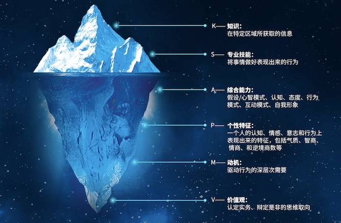
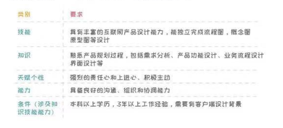
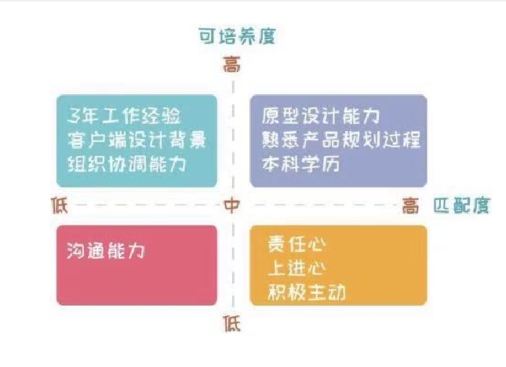
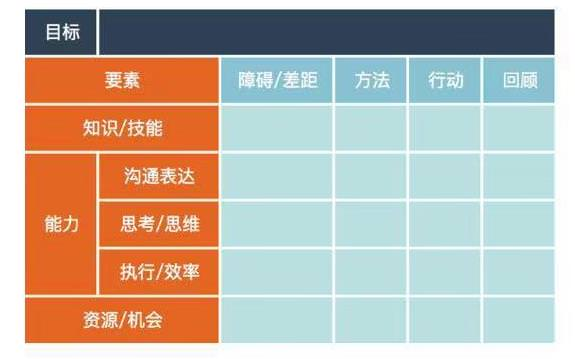
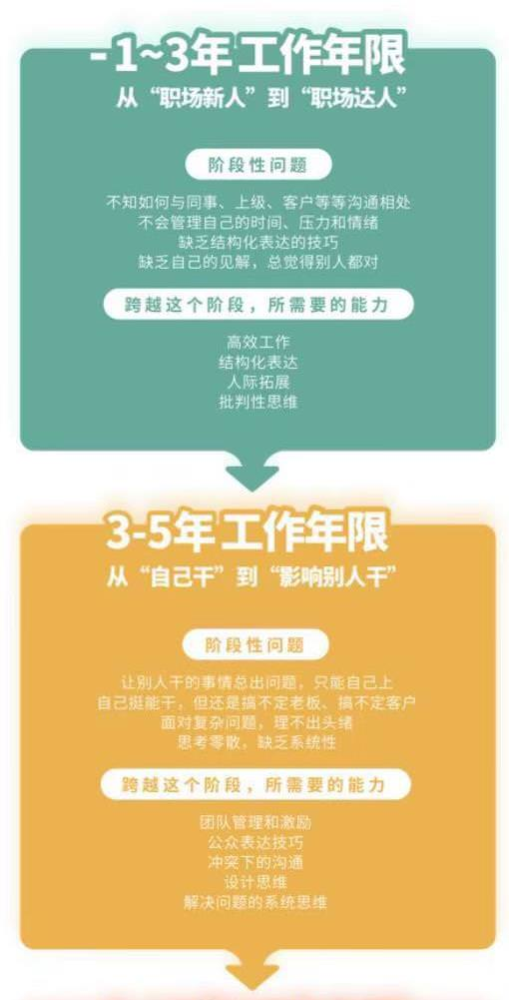
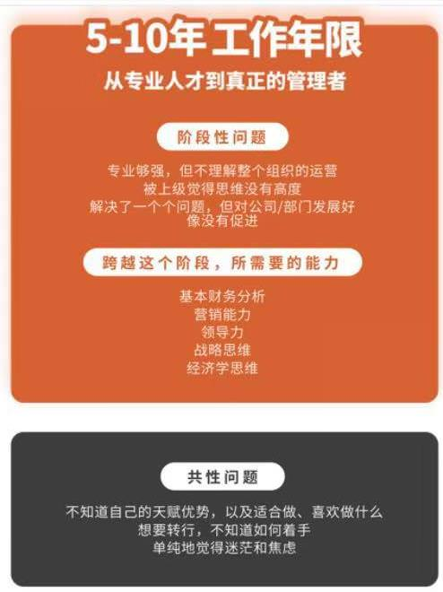

## 破除职场迷茫
### 1. 如何全面认识自己（冰山模型）

- **知识**：是指你了解比较多的领域，比如财务知识、人力资源知识等。这与大学所学专业、常看的书、从事的工作、业余爱好等有关。
- **技能**：指你所具备的某个领域的硬性能力，比如编程、Excel等。

两者的区别在于：**知识更多是描述性的，技能更多是程序性的。**比如说，自行车能平衡的原理，是一种知识；但是会修自行车，是一种技能。

看一个人的知识，问一些问题，看考试成绩就好；看技能，让ta实操一下就好。都是“显性”的。

- **通用能力**：比如创新能力、表达能力等等。

相对知识和技能来说，能力的培养周期长，并且相对隐性，高低不是一眼就能看出来的，往往需要通过仔细的行为观察。

比如，一个人的创新能力到底如何，很难用一个证书、几道题目来考察，而需要看ta在处理很多事情时候的行为。
所以,能力是在冰山中间的部分。

另外，能力跟知识技能最大的区别在于：知识和技能属于特定领域的,而能力则更多是通用领域的。比如，知识会分财务、人力资源、金融等等，但是“创新”这样的能力，是适用于任何领域的，一旦掌握，是能够迁移的。

- **天赋**：包括价值观、性格特质、动机。

之所以把这些统称为“天赋"，是因为在我们成年之后，这些因素很难被改变，它们受基因、家庭教育、童年经历等等的影晌很大。

- **价值观**：是你判断事物的标准。

比如说，当自由和稳定产生冲突的时候，你选择哪个、放弃哪个；在事业和家庭产生冲突的时候，你怎么处理，等等。性格特质则是个人的行为偏好，比如，你是偏内向还是外向，是更关注宏观还是细性格特质则是个人的行为偏好，比如，你是偏内向还是外向，是更关注宏观还是细节。

- **动机**

其实动机的分类方法有很多，最常见的是麦克利兰的理论，分为成就动机、权力动机和亲和动机。成就动机的人，喜欢挑战；权力动机的人，希望影响他人；而亲和动机的人，希望维持更好的团队关系。

#### 为你解读“冰山模型"

以上这三类要素，越往冰山下面的部分，越难培养，越难发现，但是，也因为门槛越高，所以越能成为竟争优势。而且，这些要素并不是独立的，下面的要素会影响上面的要素。举例来说，一个人的知识储备有多少，其实不仅取决于ta看多少书，更重要的是ta的学习能力、动机等等。学习和思考能力更强、并以追求真理作为价值观的人，知识储备会更高。

所以，越往冰山下面的部分，对一个人的发展越重要，也越大程度上决定了一个人的价值。

听起来，似乎有点让人沮丧，反正是天注定，是不是我们就不用努力了呢？

实际上，冰山底下的部分没有好坏之分，只有是否适合。比如说，很多人认大内向性格是不好的，但实际上，内向性格的人更加深思熟虑、更专注，所以做一些需要思考、而非整天跟人打交道的事情，能够更加得心应手。

这才是我们需要理解这个模型的原因，因为这样我们才能知道：在我们的个人价值要素中，哪些是可提升的，而哪些是不可改变需要适应的。

#### 冰山模型可以解释许多心中疑惑

**疑惑1：**大什么我们这个专注“升值"的社区，在内容设计上面，更侧重能力方面的提升？

因为相比只适用于某个领域的知识和技能、以及努力也很难改变的“天赋"来说，能力才是可学习、又可迁移的高性价比因素。如今中国企业的平均寿命只有2·3年，人工智能未来10年会替代人类50％的工作，如果没有可迁移能力，只有某个专业领域的知识和技能，未来的抗风险能力领域的市场价值，也会随着行业和企业的变化而有很大的波动。

**疑惑2：**我英语特别好，要不要找一份工作，来发挥这方面的特长？

英语属于技能，这是容易习得和培养的，是可改变的。你最应该选择的工作，是那些最符合你“天赋"的工作，才能让你事半功倍。比如说，对于咨询工作来说，成就动机的人，往往会比亲和动机的人做得更好。

**疑惑3：**零经验的情况下跨行面试，如何才能成功？

零经验，代表在这个领域，你的知识和技能是不足的。但只要你的能力基础够扎实，知识和技能是可以很快提升的。所以，如果你能够向面试官讲出一些案例，能够证明你有目标岗位所需要的能力，就更容易成功。

**疑惑4：**企业招聘在面试的时候，为什么要让你不停地举很多例子，类似“你曾经做过什么样的打破常规的事情？"“你曾经解决过什么样的困难问题？”

一般大公司都会有自己的岗位任职标准，这些标准的搭建就建立在冰山模型的基础上，针对岗位所需要的知识、技能、能力、天赋等因素进行定义，然后在面试的时候重点考察。知识和技能往往在简历和笔试中可以看到大部分，比如学的专业、拿的证书、笔试成绩等等，而能力的考察，则是面试的重点，所以让你不断地举例子，其实就是在让你证明：你有这些能力。

实际上，如果你足够聪明的话，在面试之前，看到企业的招聘要求之后，甚至能够推测到面试官会问你什么样的面试问题。所以，记住这个冰山模型，让它成为你认识自己的开始吧！

> “那些认识自己的人，知道什么事对于自己合适，并且能够分辨，自己能做什么，不能做什么。”——苏格拉底

#### 知识点提炼
冰山模型是人才管理领域的基础模型，也是几乎所有大公司做人才招聘和培养的基础。

我们可以用这个模型来进行自我认知和盘点，能够很方便地帮我们对接到企业招聘需求。冰山模型描述了一个人的所有内在价值要素，包括知识、技能、软能力、性格特质、动机、价值观等。

模型中，越往下的因素越难培养、越难观察到，但是，对人的影晌也越大。除了自我认知，冰山模型还可以用来进行人才筛选、人才培养等等。

### 2.如何匹配最合适的工作（职位匹配矩阵）
#### 第一步：职位分析
如果你已经有了目标职位，那么就针对这几个职位进行分析。否则的话，可以用你目前所在的职位。当以如果你的目标是升职到上一个职位，那么可以用上一个职位来进行分析。找到职位分析的对象之后，具体做法就是：把这个职位的要求列出来，并且按照冰山模型的要素来进行分类。

比如，某互联网公司的产品经理招聘要求如下：
-具有丰富的互联网产品原型设计能力，能独立完成流程图、概念图、原型图等设计
-熟悉产品规划过程，包括需求分析、产品功能设计、业务流程设计、界面设计等；
-强烈的责任心和上进心，积极主动；
-具备良好的沟通、组织和协调能力；
-本科以上学历，3年以上工作经验，需要有客户端设计背景。

我们做一下归类，结果如下：

这里需要说明的是，一般企业在要求学历和工作经验的时候，背后的出发点在于：
**有这份工作经验，那就证明你有这方面的知识、技能和能力。工作经验，是企业降低风险的一个辅助判断工具。**

很多时候，我们在纠结“我要转行，但没有经验，怎么办"的时候，其实可以从这一点出发，思考一下：没有工作经验的证明，你要通过什么替代方式来证明自己有这份潜力？

从这个角度思考之后，我们就可以想到，为什么在转行的时候，通过目标公司的朋友来内推是有用的。因为内推其实是你的朋友在帮你背书，这也是降低企业风险的一种有效方式。

#### 第二步：职位匹配
清楚了职位的要求，接下来就是匹配了。

在这个步骤，我们不光要考虑匹配度，还需要考虑可培养度。当然，可培养度跟我们之前介绍的冰山模型有关系，越往下的要素，越难培养。大什么要考虑可培养度呢？举例来说，强烈的上进心，这个属于动机，是冰山下面的特质，很难培养；但是，原型设计，这是个技能，就是可培养的。

这两个维度对于我们来说，都很重要，因为：知道自己的匹配度，能够帮我们精准地定位职业方向；而分清楚那些可培养和不可培养的匹配差距，又能够在此基础上，拓宽我们的选择，不把我们局限在一个狭小的领域。

具体的匹配方式是，画出一个二维矩阵，然后根据此前自我盘点的结果，把这些要求放到矩阵里面去。比如下图：

#### 第三步：职位选择
做完匹配之后，接下来就是进行选择了。针对前面提到的两种主要应用场景，分别来说说方法（如果是为了晋升，可以参照场景2，只是分析对象变成了上一级职位）

**场景1：目标职位选择**

如果有几个目标职位，那么分别画出矩阵图，看看在这些图中，哪个职位的“匹配且不可培养"区间中的项目最多，说明：你做这个职位，长期来说，会比别人更有竞争力。

当然，如果是短期内想要做个选择，那么“匹配且可养"中的项目也很重要。

**场景2：现有职位评估**

在四个区间中，如果“匹配且不可培养"中的项目最多，说明这个职位你长期做下去是可以有竟争力的。当然，我们今天更多的是从自我认知的角度来谈选择。除了这些，你可能还需要考虑其它你在意的因素，比如行业前景等等，我们未来会继续展开。

有了长期竞争力，还得考虑短期。所以，“不匹配且可培养"中的项目，是你未来需要努力改进的方面。

如果“不匹配且不可培养"中的项目最多，那么你需要考虑一下，是否要进行职业转换了。因为长期来说，可能面临竞争力下降，或者没有足够热情的问题。

做完这三步，我们现在应该知道：如何从自己的优劣势出发，来进行职业选择，才不浪费自己的天赋。

**最后，还有两点需要注意：**

第一，虽然我们用这种方法进行了分析，但是，一份职业的考量还会参考其它要素，比如行业前景，再比如自己的需求，我在咨询公司时候的一位同事，天性是很适合做咨询顾问的，但是对出差非常排斥，每次出差都无法休息，严重影晌工作，后来她还是换工作了。

第二，即便同一个工作，不同的工作内容，对人的要求也不一样。我曾经说过自己在咨询公司的一段经历，从自身的优势（善于分析和解决问题）出发，筛选那些能够发挥自己优势的客户（真正想解决问题的客户，而不只是借顶级咨询公司“装点门面"的客户），最终成为中国区晋升最快的顾问之一。

所以，不妨在工作中，找到那些最容易发挥你优势的工作内容，充分展现出来，让老板看到你的亮点！

#### 知识点提炼：

匹配自己最适合的工作可以依照三步来进行：职位分析、职位匹配、职位选择。

职位分析可以从技能、知识、能力、天赋个性、条件等因素着手分析职位的要求。

职位匹配可以从匹配度和可培养两个维度入手，建立一个二维矩阵，对职位要求进行盘点。

选择“匹配且不可培养”项目最多的职业，长期来看会更有竞争力。

### 3.如何在工作中巧用自身优势（SSC法）
#### 一、工作是有不同方法的
在过去8年，我研究过60多家公司的400多个岗位，发现：除了流水线岗位之外，其它岗位，在不同的公司做的事情都有不同；即便是同一个公司的不同任职者，做事的方式也有很大差异。甚至在一些公司，岗位都是没有职责描述的，奉行的就是“你行你上"的管理策略：不受岗位限制，能力强、产出高的人，会拿到更高的回报。

所以，同一份工作，是有不同做法的，你可以根据自己的知识、技能、能力、性格特质和价值观去调整工作方法，最优化工作产出。记住一点：**真正善于工作的人，不是那些什么都揽在身上的人，而是那些有“脾气”会“挑工作”的人。**

我经常讲我自己当咨询顾问的一个经典案例，就是作为一个乙方，我如何去“挑客户"的。

实际上，我回头去看原来的咨询公司，那些晋升快速、被客户高度认可的顾问们，并不是同一类型的人。有些人外向到每天在外面浪，有人内向到除了工作其它时间都死宅；有些人计划周全、执行力强，但有些人临到最后一刻、跟客户开会前10分钟还在改方案……

所以，对任何一份工作来说，都有一个基本要求，比如咨询顾问至少得分析能力、解决问题能力比一般人好一些。但在此之上，有些人用沟通技巧打动客户，有些人用超常的反应速度打动客户，而另一些人则是脑洞很大、总能带给客户新的想法。

所以，基本的能力素质能够帮你把工作做到70分，但在此之上，**那些你高于常人的优势点，才是真正的立足之本。**你需要可能地在工作中亮出来，让别人看到。

这就好像商品，同样是手机，在做到最基本的那些功能之后，你需要有自己的差异点，比如苹果是创新、小米是性价比、vivo是渠道，这些都是它们各自擅长的点。如果换一下，让vivo去走苹果的路线，苹果在中国去铺渠道，其实都做不好。

总结第一点：没有人可以找到完美工作，同样，我们也不需要一份完美的工作。

#### 二、怎样发挥优劣势
既然完成工作可以用不同的方法，那这些方法应该怎么找呢？有没有一个普适的方法可以大我所用呢？有，方法的核心就是：拆解。

**拆解的方法通常有两个：第一是按职责模块拆解，第二是按服务对象拆解。**

按职责模块拆解：把自己的工作内容进行分类，然后从中找出最能发挥你优势的部分并着重提高，其它部分保持平均水平即可。

比如圈外的一位学员来找我，她做的是流程改进的工作，工作职能可以划分大三大块：发现流程问题、提出流程解决方案，然后督促相应部门完成流程改进的落地。
她的问题是：自己能够把方案做到很细致，但是在跟其它部门沟通的时候，经常陷入争执，最终方案不了了之。她的工作进行不下去，部门出现问题，领导就会责怪她没有及时发现和解决问题，其它部门也会把责任推给她。

我给她的建议是：虽然你不擅长沟通和处理人际关系，但是，如果你在流程问题解决方面的能力非常强，甚至在公司内都难以被替代，完全可以跟老板沟通，在团队内部重新做一个分工，自己负责方案制定、做技术支持，而其他人去负责沟通和跟进。另外，即便自己去跟部门沟通，也可以改变方式，不要从“你们必须按我的方法改变"，而是从“我有专业能力，可以帮助你们做得更好”的角度去沟通。

按服务对象拆解：意思是根据你所服务的对象来进行划分，找到最适合你的服务对象，并制定策略、进行重点跟踪。我自己“挑客户"的例子，就是如此。

我曾经问某500强制药公司的销售负责人一个问题：如何才能做好销售？

他给我的答案是：销售人员的能力和打法各不相同，每一个打法都能成功。但是好销售有个共同点，就是“懂得取舍"。什么意思呢？要懂得选择适合自己的客户、放弃那些不可能成功的，才能做好销售。记住：**没有人可以满足所有人。**

#### 三、制定行动方案
分析完之后，就结束了吗？当然不是，我们还需要行动计划。

我们可以用SSC的方法，来制定行动计划。什么是SSC?是Start Stop Continue的简称。

**Start**：你之前没有做，今后打算去做的事情。比如你是一位内容编辑，发现自己其中一项优势是数据，那么可以定期对公众号进行数据分析，指导内容制作。

**Stop**：你之前在做，但今后不会继续的事情。比如之前圈外学员的例子，流程解决方案是她的专长，跟进落地可以跟老板沟通之后不去做。

**Continue**：有哪些事情，是需要继续加强做的。比如，我在解决问题方面很强，那么我会继续在这个工作上多加强。

很多时候，以优势工作，可以成为有亮点的人；不断地弥补劣势，反而会成为一个平庸的人。

#### 知识点提炼：
同一份工作，是有不同做法的，你可以根据自己的知识、技能、能力、性格特质和价值观去调整工作方法，最优化工作产出。

为了更好地发挥自身优势，可以将工作按两种方法拆解：第一是按职责模块拆解，第二是按服务对象拆解。

分析完之后用SSC方法制定行动计划，SSC是StartStopContinue的简称。Start：你之前没有做，今后打算去做的事情。Stop：你之前在做，但今后不会继续做的事情。Continue：有哪些事情，是需要继续加强做的。

### 4. 如何破除转型期迷茫（5 why分析法）
#### 一、澄清问题：多问几次“为什么"
曾经有位圈柚来找我，说：圈圈，我想要转行去做市场，但我之前是做人力资源的，没有相关经验。有什么途径可以让我转吗？

我问他说：你为什么要转行做市场工作呢？

对方：可以学到更多东西，成长更快。

我：为什么你会觉得，做市场会比做人力资源成长更快呢？

对方：市场部门需要做很多分析、制定策略，而且要去做顾客研究，这样成长得很快。

我：大什么你觉得人力资源就不需要做这些事情呢？他们也需要做关于人才选、育、用、留的分析，需要制定公司的人才管理策略，还需要理解员工的诉求，才能把工作做好啊。

对方：可我现在的工作不需要做这些事情啊，公司一点也不重视这块。

我：所以，你是要转行？还是，只是需要换个公司呢？

对方：嗯，我可能要再想想。

遇到一个问题，就马上跳到解决方案，是我们正常的思维方式。但是，我们往往没搞清楚问题究竟是什么。**我们关注了太多What（要做什么事）和How（如何做这件事），却没有关注Why（为什么要做这件事）。**

这就好像什么呢？你每天都在琢磨跑步的正确方法，购买各种跑步装备，但从来没有问过自己：为什么要跑步？是为了健身，还是减压，还是参加比赛？如果仅仅是减压，那大可不必做那么细致的研究，甚至不是必须通过跑步来实现的。

很多时候，我们在一件事情上耗得久了，总会一头扎进去，而忘了自己为什么要做这件事。**所以及时刹车，多问自己几次为什么，有助于我们及时找到本质问题，从而找到最初的方向然后继续前进。**

#### 二、摆出选项：多问自己能做什么
多问自己大什么，似乎还不够，面对职业转型，我们还需要调整选项来找到最适合的那个答案。

**1、拓宽选项**

在社区里面的很多问题，提问模式都是：“我现在的现状是×××，我想要×××，请问要如何×××？"但如果你有心，去看一下这些问题，会发现很多是类似这样的：

“想要更有发展的工作，所以我想去做咨询”

“跟着现在的老板学不到东西，所以我想转行"

“现在的工作不适合自己，所以我想去考研”

发现问题所在了吗？大部分问题里面的现状，和ta想要的解决方案并不匹配。咨询不是唯一有发展的工作，转行不是解决老板能力问题的最佳方案，考研没有办法帮自己找到更合适的工作。

所以，我们有时候花了很多时间去纠结如何做到那个解决方案，却没发现：解决问题还有其它方式。

有读者问过我这样的问题：“……我是跳槽继续做销售呢，还是转行去新兴发展行业呢？"但我的问题是：还有其他解决办法吗？不可以在新兴发展行业做销售吗？

很多时候，我们陷入困境的原因是：只看到一个或两个选择，而忽略了其他可能性。所以，当我们纠结于两个选项的时候，或许可以拓宽思路，引入第三个选择，帮我们更好地做决定。

**2、限制选项**

上周五晚上，我开完会觉得很饿，在公司翻泡面，反复在各个牌子和囗昧之间比较到底要吃哪一个。然后公司一位实习生突然跟我说：老板，你忘啦？我们饮水机坏了，没有热水啊……

**有时候，我们在纠结的选项，其实根本就不存在。**

职业选择方面尤其如此，比如在问答区里面，很多圈柚会问到类似这样的问题：我现在做互联网运营，做了3年多了，觉得这个工作不适合我。但我也不知道自己要做什么，那么多行业，有点迷茫。感觉自己逻辑思维能力强，想做咨询；沟通能力也不差，也想去做销售……

与上面的鼓励他拓宽选项不同，这类问题我给的建议恰恰是：限制选项。**找出你能做的，而不是你想做的。**

为什么呢？因为你想做的可能很多，1800多个职业，你基本都没做过，总会有好奇。但问题是，你能做的只有那么几类。

对于互联网运营来说，如果要转行，需要先从相关行业入手，比如做市场、做BD、做产品等等，而不是大海捞针一样没方向。

有时候，选择困难不是因为选择本身的困难，而是对选项的判断出了问题。选项本身不对，决策质量也高不到哪里去了。

所以，当我们觉得无法选择的时候，可能需要质疑选项：觉得进退两难的时候，思考是否还有第三个选项；觉得“世界太大、没有方向"的时候，从“能做的"开始找选项。

#### 三、评估选项：多问自己“适合什么"
当我们澄清了问题，同时又通过上面的办法，将选项进行适当的调整之后，这时我们要做的才是评估每一个选项，做出选择如何评估呢？**对内看自身需求，对外看发展前景。**

当我们看自身需求的时候，可以用我们一直在学习的冰山模型来做评估。把对应职业选项的要求列出来，看看跟自己的自我盘点结果有多大程度的匹配度。匹配度最高的那个选项，就是你需要优先考虑的。

看完对内的匹配度，还需要向外看。那就是，关于这个行业/职业的发展前景。

这个判断，可以作为我们选择时候的辅助考虑因素。

具体来说，行业可以看几点：这个行业过去几年的增长速度、行业的利润率、行业可能受到的新技术的影响。当然，这些信息的获取，可以从猎头、行业资深人士、优质信息网站当中获得。

所以总结来说，当我们面临职业选择的时候：

- 先问自己几个“为什么"，弄清楚问题
- 思考解决这个问题的选项，在此过程中，需要判断选项的可行性
- 确定选项之后，从内部匹配度和外部发展性两个角度，来进行评估，做出选择

#### 知识点提炼：
面临职业选择的时候：
先问自己几个“为什么"，弄清楚问题思考解决这个问题的选项，在此过程中，需要判断选项的可行性；
确定选项之后，从内部匹配度和外部发展性两个角度，来进行评估，做出选择。

### 5. 如何进行高效学习
教育家马尔科姆．诺斯尔斯曾经总结过，**成人学习的四个特点：自愿、经验、自主、行动。**其中，自愿、经验和行动，都是我们在学习中常常忽略的。所以，基于这3个特点，今天我要告诉大家3个高效学习的方法。

当然，我们今天讨论的学习，是有明确目的、且追求学习效率的高效学习，所以，以修身养性、陶冶情操为目的而学习音乐、艺术等领域的知识，并不属于我们讨论的范围。

这3个方法，概括起来是：
**1. 结果导向，有目的地学习；
2. 优化认知，警惕错误经验；
3. 学以致用，在做中去学。**

下面我们一个个来看。

#### 一、结果导向，有目的地学习
小时候的我们，学什么多是学校和家长安排的，家长和老师似乎从来不会问我们“愿不愿意学"，因为我们几乎没有选择，也不会选择。但长大之后，如果你就是不愿意学习某项内容，那强行往你的大脑里灌，是根本行不通的。

比如说，我们社区里面有很多内容，有些人不愿意学，即便咱们免费给他，他可能也不会加入进来。所以成人学习的第一个特点就是：**自愿**。

根据这个特点，要实现高效学习，第一个就是有目的地学习，而且很多时候是以解决工作和生活中的问题为目的的。比方说，我最近需要做个演讲，就去学习如何演讲，这个时候你是最有动力的。从这个角度来说，空闲的时候刷刷知乎和公众号文章，真的不能算是学习。因为即使看到了很优秀的文章，也更多是一种无目的地被动接收信息，只能称大消遣而不是学习。

那么如何做到“结果导向"呢？

两个办法，一个短期、一个长期。

**对于短期性的学习，需要以问题为切入口，通过探索答案，实现高效学习。**比如说，作为运营的你，发现产品的活跃度下降，这时就要以“如何提高产品活跃度"作为一个问题来解决。你可以去分析数据、上课、买书、和同行交流，以及在思考的过程中去解决问题。而且，也正是因为你是完全围绕问题展开的，所以在过程中不会跑偏，最终不仅能够解决问题，还能够建立这方面的知识体系。

**长期来看，想要形成结果导向型的学习，我们还要看：在工作中，自己需要提升哪方面的能力。**那些你最缺失的、又是工作最需要的能力，就需要优先学习和培养。

大家可以回想一下：你最近的学习内容，是针对短期问题、还是长期能力提升的呢？如果都不是，那这个学习内容是否有必要学呢？会不会是浪费时间呢？

#### 二、优化认知，警惕错误经验
我曾在一个平台上，分享过自己的读书方法。和很多人一遍就把书看完不一样，我一般先把序言和目录浏览一遍，知道这本书通篇在说什么，然后就放回去，等到我写文章或者遇到相关问题的时候，再拿出这本书去找相应的章节，学了立马就用。

所以不像很多读书很快的人，我读书非常慢，常常是断断续续的一段时间后，一本书才会被我看完，或者说用完。我说完后，一些人不太同意，他们认为：读书从长期来看总是会有价值的，不应该像我这样，完全从短期的功利主义出发。

为什么管符合认知研究结果，他们仍然不愿意认同我的学习方式？因为成人学习的第二个特点就是：**容易受经验的局限。**

如果我让一个孩子按照我的方法去学习，我告诉他这是对的，他不会反对。但成年人有很多自己的固有认知，导致我们很难有空杯心态，我们会把学习内容跟过去的认知作对照，决定自己是否接受。

所以，当我们知道成人学习的第二个特点之后，在去学习一些新知识时，要警惕自己原先是否存在错误的认知。不要遇到和经验不符的东西，就一棒子打死，而是应该去思考一下：这个看似不合理的新知识，来源是否靠谱、是否有理论支撑、逻辑上能否自洽。如果新知识在这些方面都
得到了验证，那么就应该警惕一下，不要因为过去的错误认知而损失了让自己认知升级的机会。

#### 三、学以致用，在做中去学习
在我没开始做[圈外同学]这个产品的时候，很多人和我分享，他们是如何利用我的公众号文章进行学习的，读者还会热心地告诉我：圈圈，我每次都会认真看你的文章，整理成excel（或word)，还会听你的所有讲座，从圈外、知乎、赤兔到奴隶社会，都认真地记笔记。

每次看到他们发我的这些截图，我都会被大家的努力所惊叹。但是，一般还是会善意地提醒他们一句：整理得很棒！但是努力应用更重要啦！

因为这恰恰是成人学习的一大特点：**行动**。

不管学习的内容有多好，只要不能用，我们最终都会觉得没有价值。这些读者也是一样的，笔记做得很认真，但如果没有用在自己的工作或生活上，一段时间之后，他们就会觉得：啊，这根本没用，我不要再学了。

查理芒格曾经说，100个思维模型，就可以解决世上90％以上的问题了。所以我们其实并不需要太多的知识，更重要的是应用。相反，如果学习的东西，我们没有机会应用，或者不知道怎么应用的话，我们就会忘记。

所以，当我去年从服务了九年多的咨询公司辞职、进入职场在线教育行业之后，就决定要做“能够应用"的学习产品，让大家在学习的同时，还必须输出。

比如在圈外同学}里，我们的课程安排是：学完知识点之后，马上布置很多练习，练习完之后，有助教点评和反馈。另外，除了线上产品本身，我们还有线下学习工作坊，更是提供了一个足够真实的应用场景。

总之，学习的确是一件对自身极其有益的事情，但如何学习，如何高效学习，是我们首先要学习的内容。

#### 知识点提炼：
高效学习的三个要点：
1．结果导向，有目的地学习
2．优化认知，警惕错误经验
3．学以致用，在做中去学。

### 6. 如何科学制定职业发展计划（IDP计划）
在很多公司，都有一个高潜人才名单，人数大约占全体员工的10％，是公司定义出来未来要重点培养和发展的员工，通常只会对当事人和管理层公开。针对这些高潜员工，公司会帮他们制定专属的个人发展计划（简称IDP, Individual Development Plan)，为他们配备更多的发展资源，并提供升职的快车道（Fast Track)。

我自己过去也帮很多大公司设计过他们的高潜人才发展体系。借用这个IDP的方法论，我帚你一起来制定你自己的专属学习计划。

**IDP的主要思想就是：目标-差距-方法-行动。**

为了方便你制定计划，我为你提供了一个标准化IDP模板，是相对精简的版本，你可以很方便地制定计划。

模板并不难，我简单解释一下怎么用。

1）**填写目标**

在目标的地方，填写你的职业或学习目标。这里要注意，不要写太大或者太远的目标，最多1年可以了。

我们在这里定目标是为了定学习计划，所以过于远大的目标会导致计划周期过长，不利于落地。当然，如果你有长期的人生目标，那么这里的短期目标，是要与这个长期目标匹配的。

2） **分析差距**

找到你当前的现状跟目标之间的差距。

在分析差距的时候，其实就是分析目标职位所需要的能力跟你现状之间的差异。比如你是运营专员，如果到运营经理，需要团队管理能力、解决问题能力、沟通协调能力等等。

**实际上，每个层级、每个阶段，都有各自阶段的主要矛盾，解决这些矛盾，都需要对应的能力，然后才能跨越到下个层级/阶段。**你的整个职业生涯，就是不断打怪升级的过程，而每个过程都需要升级装备才行。所以你能够做好运营专员，但并不代表你能够做好运营经理，因为两者面临的主要矛盾、需要的能力是不一样的。

具体每个阶段会面临什么样的矛盾、需要什么样的能力呢？我曾经为了设计圈外的课程体系，对过去的咨询和研究经历做了个总结，基于过去9年6个行业近百家公司几十万人才的企业真实咨询案例，将大多数岗位共性的职业发展历程，分成了不同阶段，每个阶段都有对应会遇到的问题/矛盾，以及需要掌握的能力。

我总结在一张表里面了，在页面上可以看到这张图表。

3）**确定方法**

每个差距，都有相应的方法来提升。我们都愿意用一些努力来换取自己想要的东西，但这个世界从没有一条原则是“你努力了，你就一定能得到自己想要的"。你需要正确的方向、正确的方法以及合适的机会跟资源。学习并不总是好的，方向错了就是浪费时间，而且还会因为努力没有结果导致失去信心。由此可见，方法的重要性。

4）**制定行动计划**
知道了方法之后，最后就是对应每一项差距来制定一个行动计划了。需要注意的是，行动计划需要注明在什么时间点、用什么方式、具体做什么事、借助谁的帮助、达成什么样的效果，才算合格。

好了，你可能会觉得，这个思路不错，但计划还是无从着手。没有关系，在下一段，我会提供给你3个标准化的计划，是基于此前的咨询研究经历，实际上这也是圈外商学院整个课程体系设计的依据。

三个计划分别针对：职场初期3年以内，作为基层员工或职场新人；3-5年，作为资深员工或者主管；5-10年，成为或即将成大企业中层管理者。

#### 1-3年职场新人的学习进阶要点
当你初入职场，还是一名员工的时候，作为工作3年以内的职场新人，最重要的是走好从学校到职场的过渡。当然，我这里说的3年，只是一个通常概念有些人在学校就实习很多、成长很快，不需要3年，连一些最基本的职场能力也不具备。

处于这个阶段的时候，你可能会迷茫，因为你接触的工作种类还非常少，不知道现在的工作是否适合自己；同时，职场跟学校的关系大不相同，所以不知道应该如何跟同事相处；不知道向上级汇报工作的时候，应该怎么更好地表现和表达；经常要加班，但一天下来，好像做的事情都很琐碎，似乎也没什么重要产出。

要突破这个阶段，成长到下个阶段，你需要的能力是：在**思考**方面，脱离学生“找标准答案"的思维，形成自己的独立见解；在**效率**方面，面对多任务，能够高效工作和做好时间管理；在**沟通**表达方面，你需要做到理解他人的需求，并且条理清晰，同时在这个阶段，向上管理也会是一个需要学习的沟通主题；最后，在**人际交往**方面，你需要懂得基本的人际拓展的方法。

#### 3-5年职场精英的学习进阶要点
经过职场初期的摸爬滚打，你完成了职场新人的过渡，工作开始得心应手之后，你会迎来更大的挑战。在这个阶段，可能你成为了团队最资深的员工、辅导新员工做事，也可能牵头负责了某个项目，甚至开始带一个小团队，这时候你需要培养自己的**影响力**。因为你会发现，你不仅仅只是执行单一任务了，你需要跨部门沟通；你的工作任务变得复杂，要解决的问题有点大，有时候没有头绪；有些事情明明自己搞定了，但其他团队/同事那里卡住了；对初级员工教得很耐心，但他们的工作产出让人心累，最后只好自己跳进去干；最终，事情做得蛮漂亮，但是自己不那么会说，导致受到的肯定跟自己的成绩不符。

要突破这个阶段，从**“靠自己”**到**“靠别人”**，你需要具备这些能力：在思考方面，掌握**解决复杂问题**并分工拆解的方法，同时，需要掌握一些思维技巧，包括**创新思维**和**设计思维**等等，以便能够设计出问题解决方案；需要懂得如何辅导和**激励下属工作**，而不让自己累死；在沟通表达方面，掌握一些**讲故事**说服他人的技巧，同时还需要知道如何进行有感染力的**公开表达**；最后在人际方面，你需要处理一些团队内部或跨部门的冲突，进行**高难度沟通**。

#### 5年以上中层管理者的学习进阶要点
工作5年或更久后，你可能跨越了“影晌力"阶段，开始有机会或即将有机会带领一个部门，你会又一次遇到困难，比如发现自己的高度不够。你可以很好地带团队做好执行，但是涉及到上层沟通、战略方向、商业决策等等，有点力不从心。尤其是，如果你是技术出身到了管理岗位后，必然会面临这样的问题。实际上，线下商学院的MBA教育，主要是针对这个阶段的问题。

这时候，在思维方面，你需要更加有高度，掌握**战略思维**以及理性的**经济学思维**，与高层沟通；在效率方面，你考虑的不仅仅是团队，而是整个部门，所以需要掌握一些**运营和财务的知识**，才能更好地配置资源；另外，即便你不是做营销工作，但营销作为公司最重要的职能，你需要了解并掌握一些营销的工具；最后，在人际方面，全面而进阶的**领导力**会是你的学习主题。

这就是不同发展阶段，要实现跨越所需要学习的能力，以及你可以采用的学习计划。工作对每个人来说，除了是生存工具之外，还决定了我们人生中的很多方面。

比如，至少8小时你都在工作，所以它决定了你人生的大部分时间是否快乐；好的收入能够让你给家人更好的生活，所以它影晌了你的家庭幸福指数；做一份有成就感的工作，你会更加有自信，更加有个人魅力；好的工作就是你的安全感，所以你不需要依附于任何人。

蔡康永说：“我对于幸福感的一个重要标准是，可以常常保持对很多我不喜欢的事情说不。"对于普通人来说，工作可能是唯一一个途径，让你有底气对不喜欢的事情说不。

#### 知识点提炼：
通过目标-差距-方法-行动针对知识/技能、能力、资源/机会进行分析，为自己制定个人发展计划。

2018/10/29 16:58:24 

吵架攻略

## 科学吵架之别被对方的情绪带沟里: 不激动

**如何破局？**

这种吵架模式的层级比较低，破局也不需要拥有多强的逻辑能力，只要在意识到对方的意图后跳出对方设的这个圈即可，总之不要被对方这种带有评论、指责意味的情绪带着走。

因为，面对明显带有评价、攻击性质的表达，一旦开始较真，你就已经输了：**《非暴力沟通》一书指出，一旦想为自己辩护或开脱，就等于默认自己有问题。**

## 科学吵架之一定一定要守住主题: 别跑题

这也是一种很常见的吵架方式：在某件事上不占理，那就把你拉入我擅长的领域，用我熟悉的表达方式怼你。*

这种吵架需要你有**「议题设置能力」。**

**如何破局？**

**很简单，一定一定一定要死守主题。每当对方想把话题拽偏时，你一定要及时把话题拉回来，而且要直接说对方曲解了意思，让 TA 不再得寸进尺。**

你甚至每次直接说一句即可：朋友，别跑题行不？来，咱们继续刚才的主题。

方法就是那么简单，很多人也懂，但为什么还会被对方带偏？

因为很多人就是有一种自信，觉得跑到另一个论点上也能吵赢，反而让对方钻了空子。 

## 科学吵架之别被对方的故事整懵逼: 个例有意义?

怎么破局？

**请熟记以下几个万能逼问句：**

**请问，个例能代表大多数吗？**

**请问，这个是因果关系吗？**

**请问，故事说完了，说说你的逻辑好吗？**

**请问，你们家那点事能代表全世界吗？**