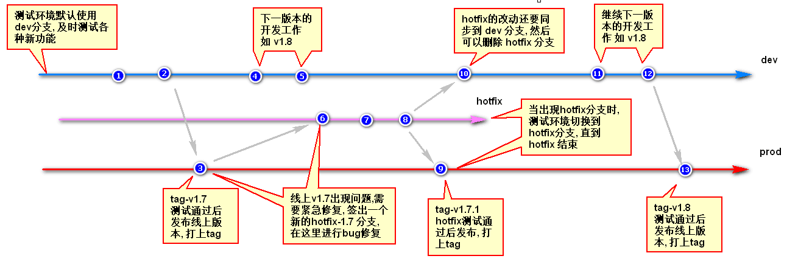

# 1. 工作规范

原型设计 - 需求评审 - 开发 - code Review - 测试 - 文档完善+postman整理

文档使用 markdown 语言编写, 推荐使用 typora 编辑器, 每个版本发布时同步发布对应的开发文档(pdf版)


# 2. 开发环境规范

idea插件

- free mybatis
- translation+有道智云
- 阿里校验
- 大小写转换
- grep console
- lombok, 其实我不太喜欢这东西
- gson format
- maven helper

idea 配置

- 自定义todo
- 另存一套热键表
- 统一UTF-8
- 统一采用 LF

maven配置

- 本地仓库
- 自定义仓库

git配置

- commit log 规则, angular 规则
- 关闭自动CRLF




# 3. 招聘要求

必备技术

- spring springMVC MyBatis
- aop, 线程,
- SQL, 左右连接, 子查询, 分组

考察方案

- 搭建环境?
- 写一个接口从前往后?


# 4. 机试题目

1. AOP: 编写一个切面, 记录所有接口的调用日志(时间, url, 参数, 结果), 存到数据库
2. SQL: 利用子查询
3. MyBatis: 利用 collection 封装树状结构
4. redis: 
5. cloud: 使用 feign, 声明式调用接口

```java
String saleStatus = JsonUtil.getNullableFieldValue(saleInfo, "Active");
if (saleStatus != null) {
    sale.setStatus(EorderSaleStatusEnum.getCodeByDesc(saleStatus));
}
```

