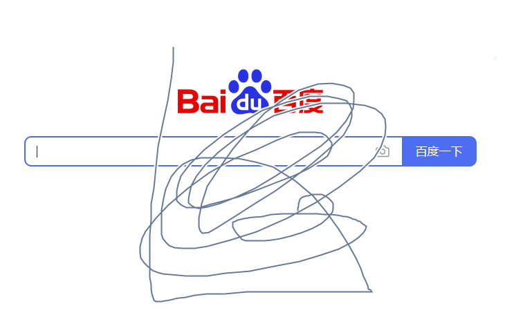
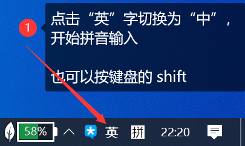
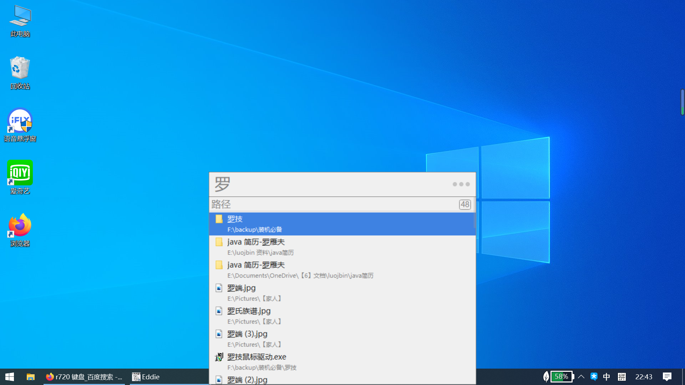

# windows 10

## 开始菜单

### 应用列表

- 大部分应用都会列在应用列表里
- 按名字首字母/拼音首字母分成多个组
- 点击每个组前面的字母会折叠应用列表, 只显示字母列表
- 点击字母以快速跳转到指定的分组

### 磁贴

常用的应用可以通过“磁铁”的方式固定在右侧的磁贴区域

部分应用提供动态磁贴功能, 可以在不启动软件的时候看到一些关键信息, 如日历/天气/图片

可以将任意的软件/文件夹以磁贴的方式固定到开始菜单

- 右键点击要添加到开始菜单的软件/文件夹
- 在菜单中选择【固定到“开始”屏幕】
- 打开开始菜单, 将新添加的东西拖到合适的地方

# 软件部分

## 鼠标手势

已安装鼠标手势支持( WGestures ), 可以通过鼠标完成软件窗口/浏览器标签等操作, 几乎可以用在任何软件上.

### 基本规则

- 为方便记忆, 预设手势都是【**按住鼠标右键+画出指定图形**】, 可以自定义

- 使用鼠标手势时, 会显示手势轨迹(手势有效时轨迹是蓝色的), 并给出对应的操作名称, 松开右键生效

  

- 手势无效时, 轨迹会变成**灰色**, 下方的操作名称也会消失

- 如果不是自己想要的操作, 就不要松开右键, 继续乱画几个圈, 轨迹变灰后再松开, 就不会误操作

  

### 常用手势

| 操作                 | 鼠标手势                             | 说明及适用范围                                         |
| -------------------- | ------------------------------------ | ------------------------------------------------------ |
| 最大化/恢复原来大小  | 按住右键, 向右上角划                 | 任何软件, 相当于点击右上角最大化按钮                   |
| 最小化               | 按住右键, 向左下角划                 | 任何软件, 相当于点击右上角最小化按钮                   |
| 前进                 | 按住右键+向右                        | 主要用在浏览器，资源管理器                             |
| 后退                 | 按住右键+向左                        | 主要用在浏览器，资源管理器                             |
| 滚动到最上面         | 按住右键, 向上                       | 主要用在浏览器，资源管理器                             |
| 滚动到最下面         | 按住右键, 向下                       | 主要用在浏览器，资源管理器                             |
| 打开新标签页         | 按住右键，再点击一下左键             | 主要用在浏览器， 新建一个空白标签页                    |
| 关闭标签页           | 按住右键，向下再向右（画 L）         | 在浏览器时关闭一个标签页， 在资源管理器是关闭窗口 |
| 上一个标签页（左侧） | 按住右键, 向上再向左                 | 主要用在浏览器                                         |
| 下一个标签页（右侧） | 按住右键, 向上再向右                 | 主要用在浏览器                                         |
| 窗口置顶             | 按住右键, 向上-向右-向上, 倒着画闪电 | 任何软件                                               |
| 切换到桌面           | 按住右键+向下再向上( 画 V )          | 任何软件                                               |

## 输入法

已安装讯飞输入法, 讯飞输入法支持多种输入方式, 能满足不同输入习惯

可以通过以下任意一种方式启动讯飞输入法

- 按下键盘 CTRL + SHIFT, 左侧或右侧都可以

- 鼠标点击右下角的输入法指示图标( “拼”字 ), 在展开的弹框中选择讯飞输入法

  

- 双击桌面的语音悬浮框图标, 直接启动讯飞语音输入

  

### 语音输入

可以用两种方式启动语音输入

- 直接双击桌面的“语音悬浮窗”
- 先启动讯飞输入法, 鼠标左键点击输入法工具栏中间的麦克风图标

两种方法都会打开语音输入悬浮窗, 打开语音输入悬浮窗后, 先点一下要输入文字的地方, 然后单击(或长按)语音悬浮窗, 说出要输入电脑的话, 再次点击悬浮窗(或松开长按)结束, 稍等一会, 输入法会将语音转为文字.

讯飞语音输入支持不同的方言, 可以自由切换 

- 右键点击语音悬浮窗

- 在弹出菜单中选择“语种选择”

- 在弹出的语言列表中选择要使用的语言

  

### 手写输入

启动讯飞输入法后, 

1. 鼠标左键点击输入法工具栏最右侧的齿轮图标, 

2. 在弹出菜单选择“手写输入”

   

3. 弹出手写输入的手写框

手写输入支持触摸板手写和鼠标左键手写, 有三种模式

- 鼠标左键手写, 单字模式, 边写边识别, 需要手动选字

  

- 鼠标左键手写, 叠写模式, 写完后自动选字, 有时候可能会有错

- 触摸板手写, 叠写模式

  若触摸板关闭, 需要用 Fn + F6 开启触摸板

  

### 拼音输入

电脑默认状态下就是“微软拼音输入法”, 但默认为英文状态, 点击“拼”字前面的“英”字可以切换成中文拼音输入, 也可以按一下键盘上的 shift 键切换中英文

若启动了讯飞输入, 直接敲键盘也是拼音输入, 但是没有微软拼音输入法好用, 有时候会卡

## 搜索工具

在桌面时, **按两下键盘的 CTRL 键**, 屏幕中间会出现一个搜索框, 输入文件名称即可快速找到文件

支持中文搜索, 或拼音首字母缩写

也可以在打开资源管理器后**直接输入文件名**(不需要按两下 ctrl 调出搜索框), 进行搜索, 当前文件夹的搜索结果会显示在前面, 当前文件夹没有结果则会显示其他地方的文件

搜到文件后, 按一下键盘的右方向键, 可以打开操作菜单, 对文件进行其他操作

