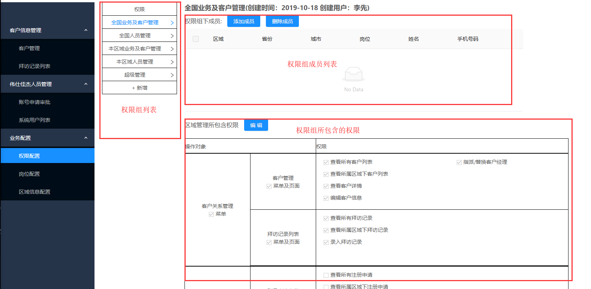
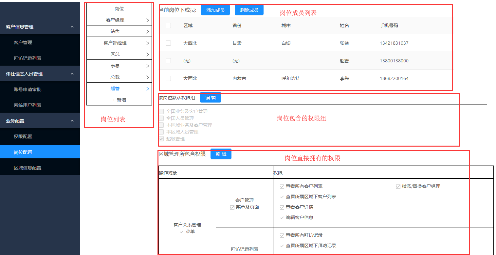
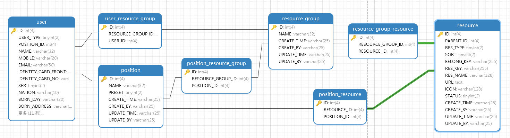
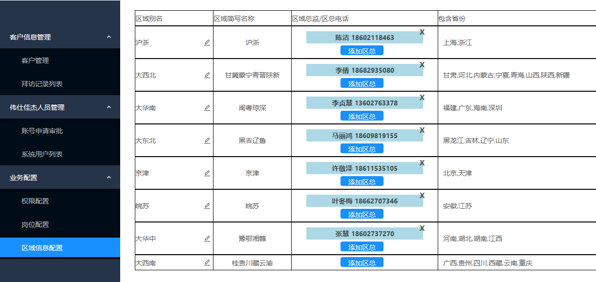

# 二. 业务配置

该模块为系统管理模块, 为了方便系统管理员对权限/岗位/区域信息进行管理.

## 1. 岗位及权限配置

### 1.1. 名词解释

- `资源`: 系统中的每一个操作, 对应一个请求接口, 称为资源. *资源仅在底层数据库进行管理, 用户不能在系统内进行修改.* 
- `权限`: 完成一个任务需要相关的多个资源, 将紧密关联的多个资源整合管理, 称为权限. 拥有该权限即可请求相关的多个资源. *每个权限包含的资源仅在底层数据库进行管理, 用户不能在系统内进行修改.*
- `权限组`: 为了便于管理相关的多个权限, 可以创建分组, 称为权限组. 一个权限组下可以有多个权限.
- `岗位`: 为了便于管理用户类型, 管理一类用户所拥有的权限, 可以创建岗位. 可以为岗位添加关联的权限组, 也可以为岗位添加独立权限. 一个岗位的权限是以下两部分的合集: 
  - 岗位所包含权限组的所有权限
  - 岗位直接拥有的所有独立权限
- `权限组成员`: 可以为权限组添加成员, 成员拥有该权限组内的所有权限. 一个用户可以同时属于多个权限组.
- `岗位成员`: 可以为岗位添加成员, 成员拥有该岗位的所有权限. 一个用户只能属于一个岗位. 
- `用户权限`: 本系统的用户, 所拥有的权限是以下三个部分的合集:
  - 权限组的权限: 若用户是某个权限组的成员, 则拥有该权限组的所有权限
  - 岗位的独立权限: 若用户是某个岗位的成员, 则拥有该岗位直接拥有的所有权限
  - 岗位包含权限组的权限: 若用户是某个岗位的成员, 则拥有该岗位所包含权限组的所有权限

### 1.2. 界面与功能

#### 1) 权限配置

权限配置页面如上图所示, 分成三个部分

- `权限组列表`

  展示当前系统内的所有权限组, 当前选中的权限组以蓝色高亮显示. 可以对权限组进行 **新增/删除/重命名** 操作

- `权限组成员列表`

  展示当前权限组内的所有成员, 可以为权限组 **添加/删除** 成员

- `权限组所包含的权限`

  展示了当前权限组拥有的权限, 可以为权限组 **添加/删除** 权限

#### 2) 岗位配置

岗位配置页面如上图所示, 分成四个部分:

- `岗位列表`

  展示当前系统内的所有岗位, 当前选中的岗位以蓝色高亮显示. 可以对岗位进行 **新增/删除/重命名** 操作.

  其中有7个预设岗位, 不允许编辑(超管/总裁/事总/区总/客户部经理/销售/客户经理).

- `岗位成员列表`

  展示当前岗位的所有成员, 可以为岗位 **添加/删除** 成员

- `岗位包含权限组`

  展示了当前岗位拥有的权限组, 可以为岗位 **添加/删除** 权限组. 岗位将拥有相关权限组的所有权限

- `岗位直接拥有的权限`

  展示了当前岗位直接拥有的权限, 可以为岗位 **添加/删除** 独立权限. 

  其中, 超管岗位直接拥有系统内所有权限, 且不允许编辑.

### 1.4. 接口概述

> 权限配置详情请看 com.vstecs.crm.system.controller.ResourceController

| 请求路径                           | 请求方式 | 说明                 |
| ---------------------------------- | -------- | -------------------- |
| /resource/**resourceTree**         | GET      | 获取完整的权限树     |
| /resource/**getGroupList**         | GET      | 获取权限组列表       |
| /resource/**saveGroup**            | POST     | 新增/重命名权限组    |
| /resource/**removeGroup**          | POST     | 删除权限组           |
| /resource/**getGroupMembers**      | GET      | 获取权限组成员列表   |
| /resource/**addGroupMembers**      | POST     | 为权限组添加成员     |
| /resource/**removeGroupMember**    | POST     | 删除权限组的成员     |
| /resource/**getGroupResources**    | GET      | 获取权限组拥有的权限 |
| /resource/**saveGroupResource**    | POST     | 保存权限组拥有的权限 |
| /resource/**savePositionGroup**    | POST     | 保存岗位拥有的权限组 |
| /resource/**savePositionResource** | POST     | 保存岗位拥有的权限   |

> 岗位配置详情请看 com.vstecs.crm.system.controller.PositionController

| 请求路径                       | 请求方式 | 说明                 |
| ------------------------------ | -------- | -------------------- |
| /position/**getList**          | GET      | 获取岗位列表         |
| /position/**save**             | POST     | 新增/重命名岗位      |
| /position/**remove**           | POST     | 删除岗位             |
| /position/**getResourceGroup** | GET      | 获取岗位拥有的权限组 |
| /position/**getResourceList**  | GET      | 获取岗位拥有的权限   |
| /position/**getMembers**       | GET      | 获取岗位成员列表     |
| /position/**addMember**        | POST     | 添加岗位成员         |
| /position/**removeMember**     | POST     | 删除岗位成员         |
| /position/**getUserGroups**    | GET      | 按岗位获取用户列表   |

### 1.5. 主要数据表

主要业务表及关系如上图所示, 系统用户通过所属岗位/权限组, 获取到该用户拥有的所有权限. 

其中`resource` 表中有几个关键字段:

| 字段名     | 含义     | 说明                                                         |
| ---------- | -------- | ------------------------------------------------------------ |
| RES_TYPE   | 权限层级 | 1=一级菜单, 2=二级菜单, 3=按钮/具体请求                      |
| BELONG_KEY | 所属权限 | 分配权限, 指示该权限受哪个权限控制, 拥有分配权才可以分配此权限 |
| RES_KEY    | 权限标识 |                                                              |
| URL        | 资源列表 | 该权限拥有的资源列表, 记录资源的URL, 以逗号分隔              |

### 1.6. 关键操作的业务逻辑

用户为权限组或岗位分配权限时, 需要满足以下要求

- 欲操作的权限存在, 且操作者拥有欲操作权限
- 操作者拥有欲操作权限的分配权(belong_key)

用户为权限组或岗位添加/删除成员时, 需要满足以下要求

- 操作者拥有欲操作权限组/岗位中的所有权限
- 操作者拥有欲操作权限组/岗位中所有权限的分配权(belong_key)
- 目标用户存在, 且操作者有权访问目标用户

为了满足以上要求, 在进行权限操作时, 必须进行相关校验

为权限组增加/删除权限

- 当前用户拥有

为权限组增加/删除成员

为岗位增加/删除权限

为岗位增加/删除权限组

删除岗位

- 检查岗位存在
- 检查岗位可操作, 即操作者拥有该岗位下的所有权限
- 检查该岗位下有无成员, 包括账户已停用的成员

为岗位增加成员

- 检查岗位存在
- 检查岗位可操作, 即操作者拥有该岗位下的所有权限
- 检查目标用户存在且对操作者可见
- 检查目标用户未分配岗位

为岗位删除成员

- 检查岗位存在
- 检查岗位可操作, 即操作者拥有该岗位下的所有权限
- 检查用户存在且对操作者可见
- 检查目标用户是否当前岗位的成员

## 2. 区域配置

### 2.1. 功能介绍

区域配置界面如上图所示, 在此页面, 系统管理员可以对区域信息进行配置

- **修改** 区域别名
- **添加/删除** 区总, 每个区域的区总不超过十个. 

### 2.2. 代码概述

