# 2019 国庆东京游

# 交通

可以使用OSAKA 的 ICOCA , 不需要另外购买西瓜卡

可选通票

- **JR 1日票**

  购买当天有效, 所有JR 普通列车, 750 

- **东京1日票**

  购买当天有效, JR+东京地下铁+都营地下铁+巴士, 1590

- **地铁72小时票**

  开始使用的72小时内有效, 东京地下铁+都营地下铁 1500

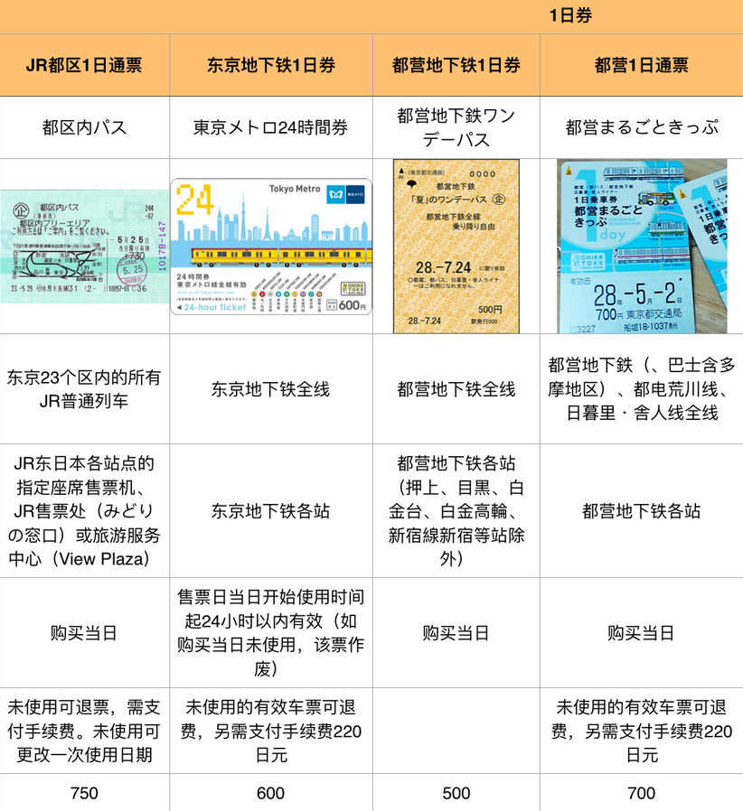

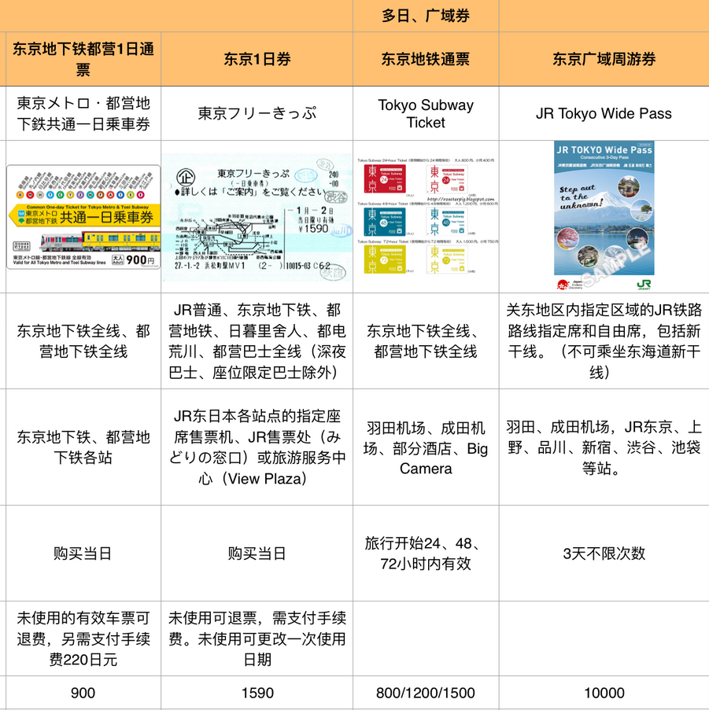

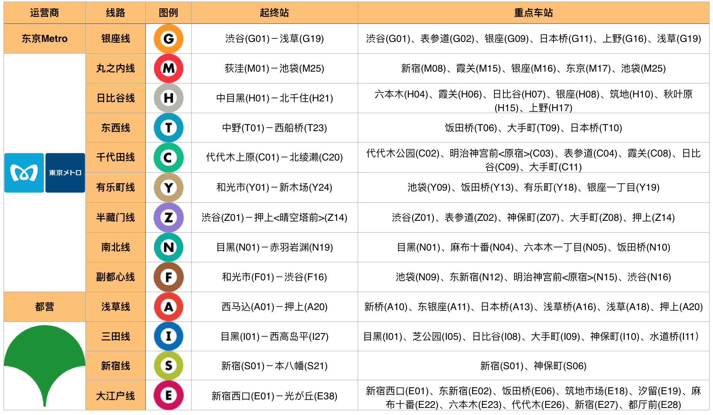

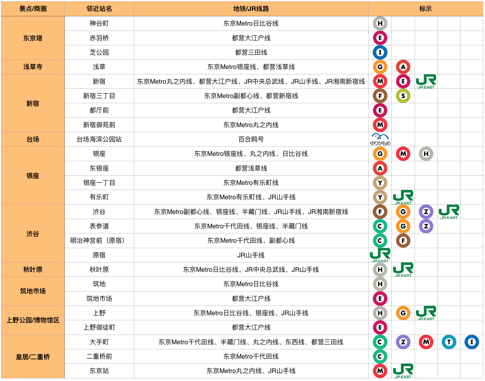

# 行程

## 10.2 出发

- **深圳-广州东**

  C7128 10:07 - 11:20 

- **广州东站- 广州白云机场**

  地铁3号线, 广州东 `G` -机场北(2号航站楼) `B`,  约40分钟

- **广州白云T2-东京羽田1号楼**

  南航CZ3085 14:40 - 19:45

遇到一辆会自己变身的列车，一口气坐到目的地押上。
出站口走路5分钟到酒店，好近。
晚饭是“小金寿司”，一家老夫妇的店，要了一份套餐，还有三文鱼刺身，还不错，泡姜甜甜的。
饭后溜达，去了全家、Lawson、711和地铁口的超市，买零食。回来后去酒店楼顶看晴空塔。
电视里看到一个催眠的节目，是各种萌萌的生物打哈欠的画面，配上柔和的音乐，哈哈有趣。

## 10.3 周四 浅草秋叶原

中午才出门，来吃回转寿司Toriton，东京必吃餐厅，2684日元，支付宝￥171.42。
饭后抹茶冰淇淋，上31层观景，看晴空塔、俯瞰墨田区，小而密的房子看起来并不美丽。
步行至浅草寺，求签、买御守，两个人都求到凶签，把签系在杆子上，就可以把厄运留下不带走啦！打卡雷门，拍一波游客照后走人。
步行至合羽桥，扛了一座富士山，买了一把奢侈的刀。
闹闹说：我发现了！日本的建筑楼梯都是露天的，而且特别小。
去秋叶原，不知道逛啥，先吃饭吧。排队一个小时，我和闹闹轮流排队，另一个人去帮陶陶找CD。终于在排到座位之前找了两家店买到了CD，好累。牛排饭比烤肉饭好吃！吃完依旧不知道逛啥，一路上都是揽客的“女仆”，可是不漂亮，消费内容我们也不感兴趣。去BIC门口扭了蛋，进去看了看投影仪，赶上打烊就走了。
又去吃了天妇罗，真美味！吃完快10点，Yodobashi也打烊了，干脆回酒店得了。路上又去全家买了甜品，心满意足。

**晴空塔(天空树)**

**浅草寺**

~~**上野公园**~~

**秋叶原,** 电子产品, 动漫, 主题咖啡厅, 女仆街

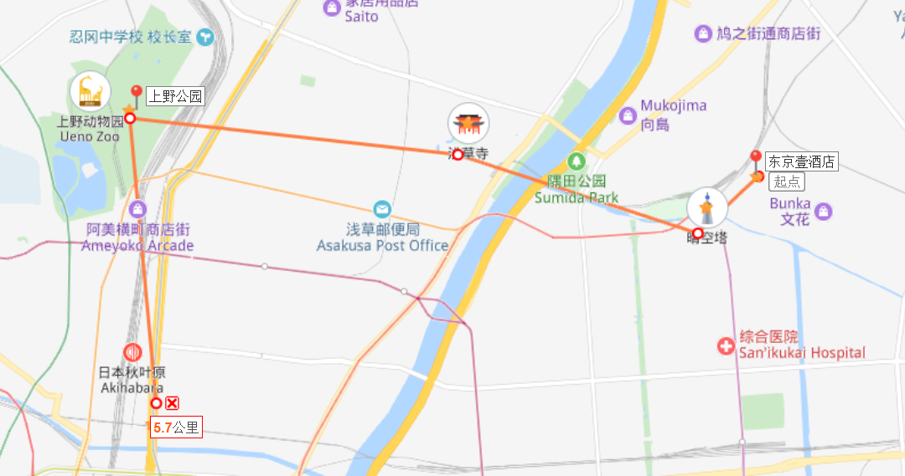

## 10.4 周五 涩谷新宿

又快到中午才出门，直接去吃饭。六厘舍, 还用优惠券领了2个鸡蛋, 东京蘸水面，面很粗壮，酱汁很香很浓郁。
去逛pokemon商店，给圈圈买了个小钱包，闹闹买了个不知道怎么玩的妙蛙种子。
逛邮政博物馆，门票只有300日元/人，本以为只是个小主题展馆，没想到里面竟然有世界各国的各个时期邮票，收纳展板密密麻麻，叹为观止！还有个机器可以拍照打印有自己头像的明信片，然后在旁边盖戳。外面的小纪念品商店里的商品也很有趣，有很多来自各个国家、各个年代、盖了邮戳的邮票和信封，上面写有地址和名字，可以随意选购。
在商场4楼溜达了一圈，好多玩具伴手礼，啥都没买。
到明治神宫4点半，门口看到今天4点40关门，赶紧溜进去，快走加胡乱自拍一通，还收获了一支自动贩卖机300日元的美味冰淇淋，完美打卡。
假装逛原宿，进了一家GU，却在准备试衣服被告知仅限在线购物。
往涩谷方向走，沿路密集的潮牌店，随便进了一家集合店right-on，两人各自收获几件还不错的衣服，开心！
到了涩谷，没找忠犬八公像，先找咖喱吃。搜到了一家有咖喱的炸猪排，味道还不错，酸甜口，比较有趣。涩谷不会逛，109全是女装，走人。
再去新宿，到处是商场，还是不会逛，干脆去东京都厅看夜景。竟然误打误撞走到了小吃街“思い出横丁”，可惜刚吃饱, 没食欲。
走到东京都厅9点半，45楼观景，人还挺多。闹闹兴致勃勃排队看了个“未来东京VR”，画质不好hin失望。我累得腿麻，坐在椅子上不想动弹。

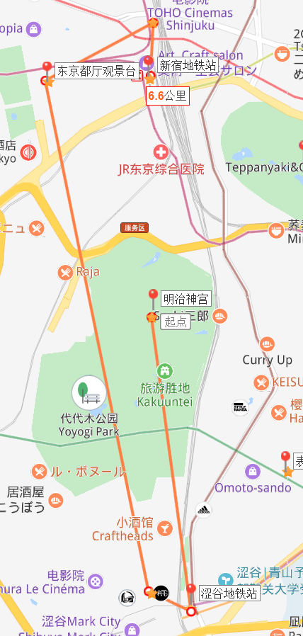

### 涩谷

**明治神宫**, 明治神宫免票, 宝物殿：500日元, 神宫御苑：500日元 9:00-16:30

**原宿**, 潮牌店, 买手店, 明治神宫旁边

**涩谷地铁站**附近, 忠犬八公像, 109百货, 涩谷hikarie

**Tokyu Hands**有较多拥有日本风格的创意类小物和伴手礼，**Loft**则更适合喜欢清新风格的人群来挑选各种精致的伴手礼或者周边。

**吃:** 比较有名的**拉面店**有一兰拉面，光面，原宿牛骨拉面; 也有像原PECO 和りんか SEASON’S GRILL RINKA这样的**日式料理**店, 原宿的**可丽饼**和**松饼**在日本公认是最好吃的.

### 新宿

“很东京”的画面：飞驰而过的电车、干净锃亮的出租车、各色的广告牌与霓虹灯、行人如织的街道、复杂的岔路口，以及在日本很难得一见的不眠夜。这里也是东京市井气息浓郁的地区，《深夜食堂》设定发生在这附近的小巷子里。

**歌舞伎町一番街**就坐落在新宿东口，分为一丁目和二丁目。新宿歌舞伎町是全东京都最大的一个红灯区，这条街名为歌舞伎町。歌舞伎町有剧场、电影院、游戏场、俱乐部、夜总会、酒吧、咖啡店和各种饮食店，还有“土耳其浴场”、“蒸汽浴场”等。

**东京都厅**是东京都政府的办公大楼, 新宿二丁目, 45层的展望台俯瞰东京, 免费

**吃: 思い出横丁,** 对吃货来说，思い出横丁才是不可错过的小巷, 因为在这里可以体验到繁华东京最接地气的市井美食。

出发: 东京壹酒店-明治神宫

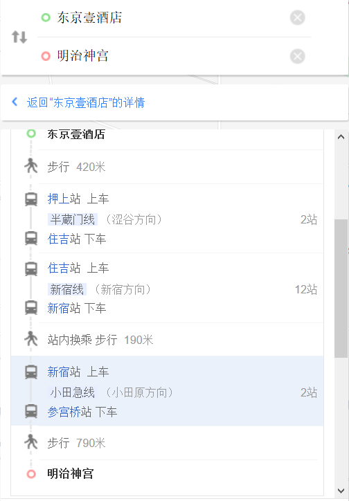

返程 新宿-东京壹酒店

## 10.5 周六 筑地银座皇居

闹闹今天嗓子好疼，我们出门先去门口买了点药，还是上次我们去大阪的时候我发烧买的感冒药。
去浅草吃寿喜烧，今半别馆。还好到的早，去时没排队，很快吃上。穿和服的店员帮忙烧肉煮菜，很好吃。
饭后去书店街，这年代还有这么多书店，几条街接连都是各种书店，而且店里人都还不少。日本的书大多小而薄，口袋书，适合随身携带随时拿出来读。闹闹找到了内山书店，我在里面买了一本1982年出版的杨绛的《喜剧二种》，看起来唯一一本勉强能看懂的书，算是纪念品。
去皇居，逛了东御苑，大花园。然后打卡二重桥。太热太晒，整个人都要累化了。
步行去伊东屋，想买本子，逛了两圈，最后发现还是淘宝货全且方便。但是也惊叹于可以把文具店开得这么琳琅满目，简直就是手帐爱好者的购物天堂。
累了，去吃饭，找了一家拉面馆，再一次证明去的早就是好，不用排队，快快吃上饭。还不错，略咸，闹闹说没有昨天的蘸水面好吃。
饭后逛商场，三越，大国药妆店，堂吉诃德，结束后就累劈了，再也没力气逛森美术馆，只能在返程路上远远地跟东京塔打了个招呼。下次吧，回见。

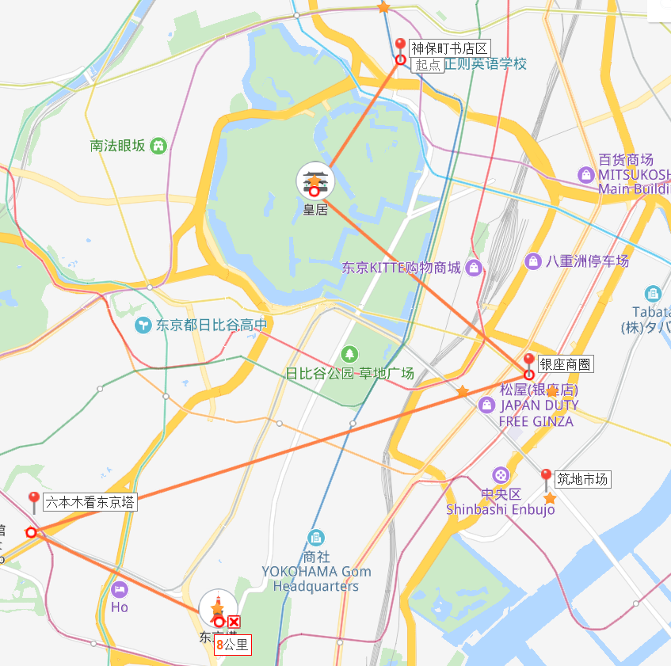

**神保町(书店街)**

**皇居(免费, 预约)**

皇居的游览分为`皇城`和`东御苑`，参观都是`免费`的，**皇城要提前预约**，东御苑则可以直接进入参观。人气很高的`二重桥`在皇居外侧，可以直接看到。

皇城的预约网址是（只有英文和日文）：[sankan.kunaicho.go.jp](https://sankan.kunaicho.go.jp/register/place?locale=en)

**银座**, 买买买, 三越、松屋、高岛屋.….东京体量最大、最新的时尚地标GinzaSix（GINSIX）

**六本木**: **森美术馆**, 开放时间: 10:00-22:00；停止入场时间:21:30 (1月1日-12月31日 周一,周三-周日)10:00-17:00；停止入场时间:16:30 (1月1日-12月31日 周二), 票价: 成人1800日元

**东京塔, 海贼王馆**(3900日元)

出发: 东京壹酒店-神保町书店区

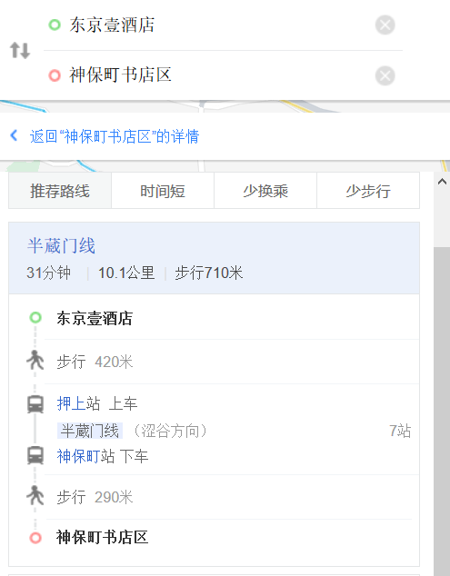

返程: 东京塔-东京壹酒店

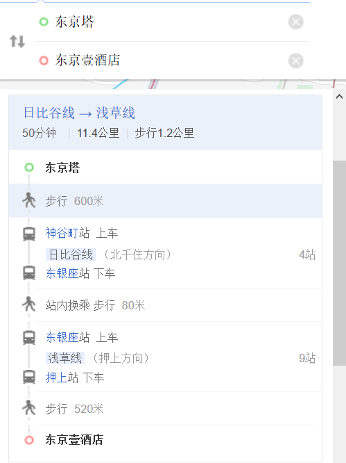

## 10.6 周日 镰仓

可怜的闹闹发烧了，嗓子也哑了。
早上起床发现下雨降温了，我们吃了热狗和松屋的饭，满足之余还去Zara溜达了一圈。原计划是去镰仓，但是天气和身体都不太理想，不然就算了吧。昨天没去成森美术馆和东京塔，不如现在去？
改道来了森美术馆，对这里的排队规则表示疑惑。三条队：museum，gallery和快速通过。好不容易弄明白了gallery是一个叫Jean-Michel Basquiat的个展，不知道快速通过的队是不是预约券？反正我们的队是最长最慢的一个。
美术馆出来是城市观景台，看了东京塔，还有免费小合影。可惜天气不好，没看到远处的富士山。
去东京站一番街。其实是三条街，动漫、拉面、零食。东京站好大好大，只是找那几条街就用了好久。动漫街里好多主题店，各种周边和手办，看得人眼花缭乱。可是贵的买不起，便宜的看不上。最后只在蜡笔小新店里扭了个蛋，但是运气超好，一下子就扭到了小新！
出来东京站，在门口小店里买了一盒据说是东京必买的香蕉蛋糕，还意外地找到了热茶，很满足。
不知道吃啥，干脆返程回押上。又排了一个小时队吃了回转寿司，俩人吃得好饱，还是没其他人吃得多，但是已经好贵了哈哈。
饭后溜达，闹闹给小外甥们仔细挑了两辆他自己都舍不得买的小汽车，真是个好舅舅！又去旁边的life超市溜达，没找到地漏贴纸，买了个柿子，据说日本的脆柿子很甜，尝尝看。
例行全家买零食，闹闹最后还是没有去抽海贼王的奖，但是买了个上面有小蛋糕的布丁，也很开心。晚上回去配着明治的巧克力牛奶和泡芙一起吃，好满足！
洗漱之后收拾东西，查完明天早上的时间和路线，定了表，睡觉！

#### 路线一: JR线

从东京壹酒店出发, 到镰仓, 共约 1小时30分钟

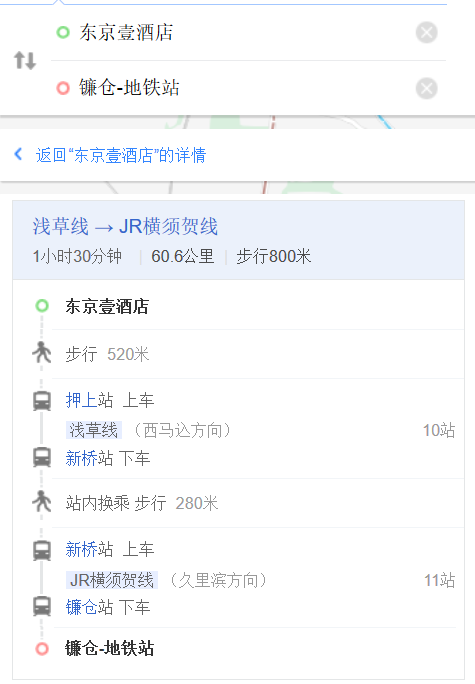

#### 路线二: 小田急电铁江之岛/镰仓周游券

小田急电铁的通票产品。售价1470日元。可在一天内搭乘：
 **· 搭乘新宿～藤泽间的小田急普通列车来回各一趟**
 **· 不限次数搭乘江之电全线、藤泽～片濑江之岛间的小田急普通列车**

 ※**包含了**一次东京到镰仓的往返车票，所以无需再单独购票。

#### 镰仓一日游路线

江之岛(2.5小时)→湘南海岸(1.5小时)→镰仓高校前站(1小时)→极乐寺站(1小时)→长谷寺(1小时)→镰仓小町通(1小时)

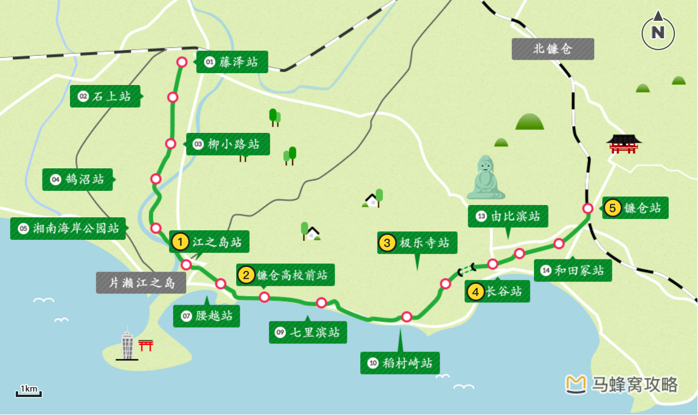

**鎌仓站**附近、**长谷站**附近与**片濑江之岛站**附近是三个美食云集的片区

## 10.7 返程

- **东京羽田1号楼-广州白云T2**

  南航CZ3086 10:45-14:25

- **广州白云机场-广州东站**

  地铁3号线, 机场北(2号航站楼) `B`  - 广州东 `G` ,  约40分钟

- **广州东-深圳**

  C7049 16:55 - 18:12

早起坐车，进站前在全家疯狂购入一大袋零食，管它会不会压扁，好吃就行！
没赶上7:21的机场特快，上了7:32的急行车，依旧是会变身的列车，赶上通勤，好多好多人，但是大家都好整齐好安静，按顺序排队上下车。
到机场排队托运的时候吃了两个饭团，真好吃！托运时候问了箱子里有刀有没有问题，工作人员说不是剑就行，放心了。
到了免税店本来想买小棕瓶和眼霜，对比了价格，还是决定上网买。最后买了两盒薯条三兄弟，计划赶不上变化哈哈。
登机前数了下零钱，又在自动贩卖机买了瓶咖啡，真是物尽其用啊哈哈。
落地后经过免税店看了一下这边小棕瓶的价格，哦哟竟然这么便宜！幸好没在日本买，也幸好听闹闹的看了一眼！然后就开心地忘了还移动WiFi，坐了两站地铁才想起来，哈哈，行程结束啦！

到了广州东站转乘动车的时候被拦下开箱，说菜刀不能带上车。我们又急又热，一时有点儿慌。冷静了一下，看到旁边有快递电话，问能否在这里寄快递。幸好他们可以帮忙保管和记录身份信息，我们叫了快递，才终于进站，刚好赶上检票。呼……好险！