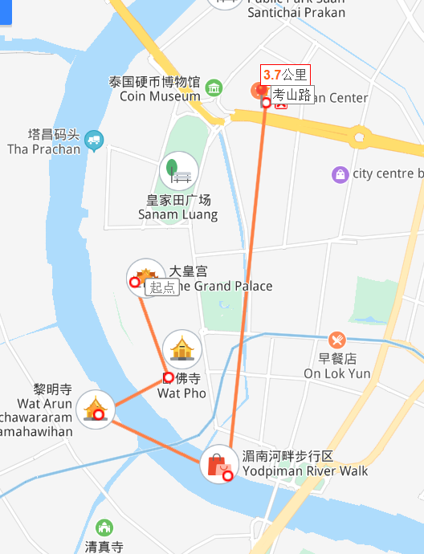
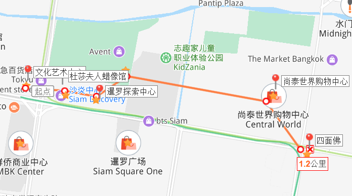
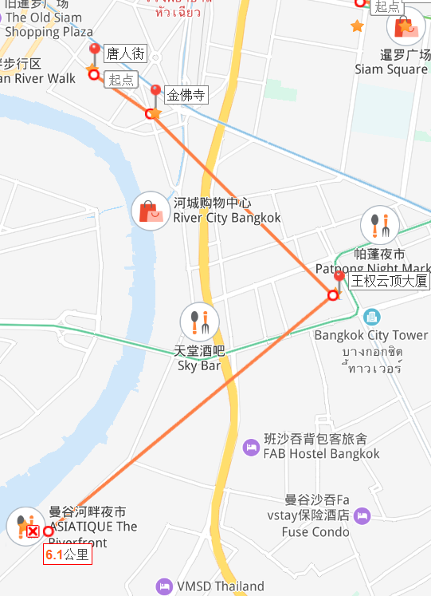

# █ 2020 春节泰国游

# 三. 泰国

推荐理由 | 物美价廉，语言无障碍，旅游设施完善

## 签证

## 机票

入境可能会抽查返程机票, 需提前准备好返程机票凭证

## 酒店

落地签(电子落地签) 15天

## 主要目的地

### 曼谷

#### 泰式观光

大皇宫+玉佛寺, 文化观光

卧佛寺, 泰式按摩, 早上人较少, 下午要排队

王权云顶大京都大厦, 曼谷最高楼, 需网上提前买票, 80/人

湄南河

#### 购物逛街

暹罗探索中心+杜莎夫人蜡像馆+海洋世界+尚泰购物中心, 购物逛街

暹罗海洋世界, 东南亚最大的水族馆

文化艺术中心, 免费, 经常各种展, 可以随便逛逛

#### 吃吃喝喝

河畔夜市, 夜市,摩天轮

唐人街, 华人华侨, 潮汕/广式小吃

考山路, 小吃,酒吧,夜生活

### 清迈

### 普吉岛

## 行程

### day01 广州-曼谷

### day02 泰式观光

大皇宫-卧佛寺按摩-郑王庙-湄南河-考山路夜市

### day03 暹罗商圈

曼谷文化艺术中心-暹罗探索中心(杜莎夫人蜡像馆)-海洋世界-尚泰世界购物中心(NaRaYa曼谷包)-四面佛

### day04 随意-河畔夜市

唐人街-金佛寺-云顶大厦-河畔夜市

### day05 曼谷-广州-深圳