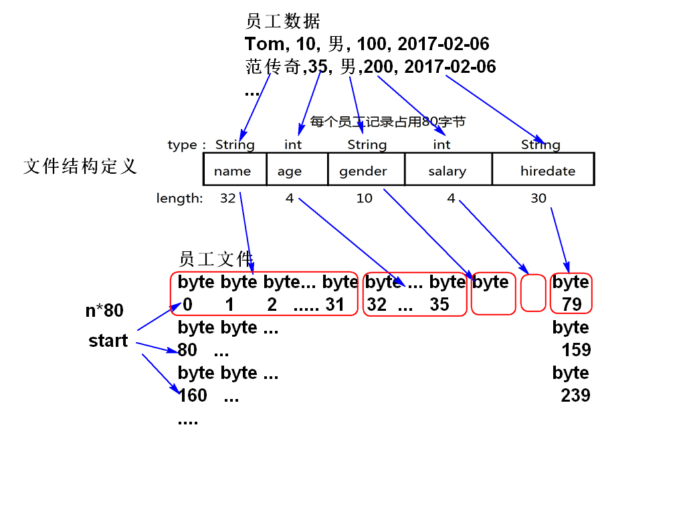
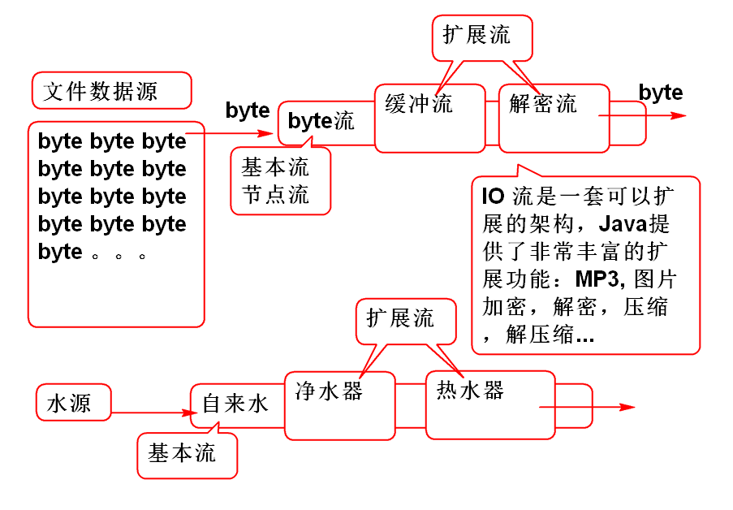
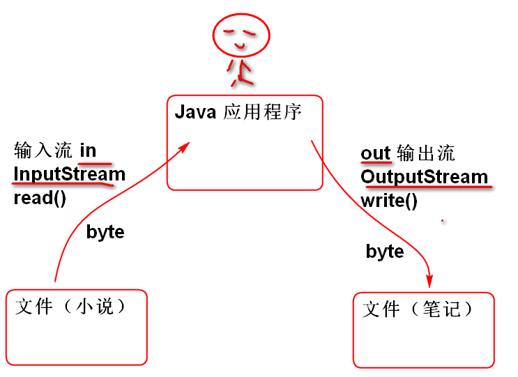

# █ Java SE API


# 什么是API

1. 由Java提供(Oracle, SUN), 现成的程序组件（类）。
2. API封装了开发时候常用的功能！
   - 字符串操作
   - 数据管理（集合）
   - IO，文件访问
   - 线程管理 
   - ...

## API 的手册

http://doc.tedu.cn

# String

学习String提供的那些方法？这些方法有那些功能！学会利用这些功能!

## String 对象的特点

1. String对象的数据不可改变！

2. String类型对象封装了一个字符串数组

3. 任何的操作也不能改变这个字符数组的内容

   String s = "123";
   	String ss = s;
   	s = s+"abc";
   	System.out.println(s);//123abc
   	System.out.println(ss);//123

> 说明: 在如上代码中改变的是字符串引用变量，但是字符串没有变！好处是字符串可以“作为”基本类型使用！

原理:


## 字符串常量的重用现象

Java中的字符串常量是尽肯能重复使用的！好处是节省资源（内存）

1. 字符串字面量（直接量）在内容一样时候重用同一个String对象。
   String s1 = "123abc";
   	String s2 = "123abc";
   	//s1 s2 是字符串类型的引用变量
   	//"123abc" 是直接量（字面量）
2. 字符串常量也参与重用！
3. 字面量、常量的运算结果是字符串，也重用同一个字符串
   String s4 = "123abc";
   	String s5 = 123 + "abc";//1+"23abc"
   	System.out.println(s4==s5);//true		
4. 字符串变量，变量的运算结果 和 新创建的字符串对象不参与重用！！
   String name = in.nextLine();//Tom
   	String s1 = "Tom and Jerry";
   	String s2 = name + " and Jerry";
   	System.out.println(s1==s2);//false
   	String s3 = new String("Tom and Jerry");
   	System.out.println(s3==s1);//false

原理:


经典题目：

```
String s1 = "1"+"23"+"abc";
String s2 = "1"+23+"abc";
String s3 = '1'+23+"abc";
System.out.print(s1==s2);
System.out.print(s1==s3);

如上代码的执行结果：
A.truetrue B.truefalse C.falsetrue D.falsefalse
```

## 字符串中的字符

字符串中封装了一个字符数组，字符串中的字符就是char类型的数据。

1. char 类型是整数， 是一个字符的Unicode编码。
2. 16位无符号整数， 占用2个字节

案例：

```
String s = "Tom and Jerry";
//          0123456789012
char c = s.charAt(4);
System.out.println(c);//a
System.out.println((int)c);//97
```

## indexOf 方法

找出一个字符在字符串中的位置：

indexOf()

1. 如果有重复，找出左侧第一个位置
2. 如果没有找到，返回-1

案例：

```
String s = "Tom and Jerry";
int i = s.indexOf('a'); 
System.out.println(i);//4
i = s.indexOf('r');
System.out.println(i);//10
i = s.indexOf('X');
System.out.println(i);//-1
```

str.indexOf("查找字符串", 起始位置)

```
String url = "http://tedu.cn/index.html";
int i = url.indexOf("/",7);
System.out.println(i);
```

## lastIndexOf 

反序查找：从右到左查找，返回字符的位置

```
String url = "http://tedu.cn/index.html";
int i = url.lastIndexOf("/");//14
System.out.println(i);//14
```

查找手册练习：

1. 找到包 java.lang
2. 找到类 String
3. 找到方法 lastIndexOf()

## substring 方法

从字符串中截取一部分作为子字符串

```
url.substring(起始位置)
//从起始位置开始到最后截取为子字符串

String url = "http://tedu.cn/index.html";
String filename = url.substring(15);
// filename = index.html

url.substring(起始位置, 结束位置)
//从起始位置开始到结束位置截取为子字符串
String url = "http://tedu.cn/index.html";
//            01234567890123456
// 包括起始不包括结束位置
String str = url.substring(7, 14);
String str = url.substring(7, 7+8);
```

## trim

```
String str = " \t Tom \n \r";
String s = str.trim();
```

## startsWith  endsWith 

检测一个字符串是否以指定字符串开头或结尾 

```
String str = "Hello World!";
boolean b = str.startsWith("Hello");//true
b = str.startsWith("World");//false

b = str.endsWith("World");//false
b = str.endsWith("!");//true
```

案例:

```
String name = "demo.JPG";
if(name.toLowerCase().endsWith(".jpg")){
	System.out.println("图片文件");
}
```

# StringBuilder

Java 提供的用于计算字符串的API， 其运算性能好：

案例：

```
String s = "A";
s = s + "1";
s = s + "1";
s = s + "1";
System.out.println(s);
```

原理：


性能比较：

```
	String s = "A";
	long t1 = System.currentTimeMillis();
	for(int i=0; i<10000; i++){
		s = s+"1";
	}
	long t2 = System.currentTimeMillis();
	System.out.println(s.length());
	System.out.println(t2-t1);
	
	StringBuilder ss = 
		new StringBuilder("A");
	t1=System.nanoTime();
	for(int i=0; i<10000; i++){
		ss.append("1");
	}
	t2 = System.nanoTime();
	System.out.println(ss.length());
	System.out.println(t2-t1);
```

StringBuilder API:

```
	StringBuilder buf=
			new StringBuilder();
	buf.append("李洪鹤老师...");
	buf.insert(0, "那一年");
	buf.replace(4, 4+2, "某人");
	buf.delete(6, 6+2);
	String s = buf.toString();
	System.out.println(s); 
```

http://svn.tedu.cn/svn/1702se/stu0001 
 stu0001  xxxx

http://svn.tedu.cn/svn/1702se/stu0002
 stu0002  xxxx
...
http://svn.tedu.cn/svn/1702se/stu0500
 stu0500  xxxx


## String 和 StringBuilder

String是不变字符串： 对象不可改变，对象中的字符数组中的数据不可改变。

StringBuilder是可变字符串：对象封装的字符数组中的数据可以改变。

StringBuilder类型的操作性能好于Srting，字符串操作建议使用StringBuilder。 字符串显示使用String。

运行期间字符串连接计算利用StringBuilder的append完成。

案例：
	

```
String s = "123";
String ss = s + "abc";
//ss = new StringBuilder(s)
//		.append("abc").toString();
```

案例：

```
String s = "123"+"456"+"abc";
String ss = "123";
String str = ss + "456"+"abc";
//在一个表达式中出现连续的字符串连接，Java会
//自动的优化为一个StringBuilder对象
//String str = new StringBuilder(ss)
//	.append("456").append("abc").toString();
```

> 在工作中一个表达式中的连续字符串连接不需要优化为StringBuilder

> 在反复进行字符串连接时候建议使用StringBuilder

## 正则表达式

用于声明字符串的规则表达式。

经常用于检测一个字符串是否符合特定规则。

语法：

1. 字符集合：
   - [abcd] abcd四个字符选一个
   - [a-f]  a到f字符选一个
   - [^abcd] 除了abcd字符的其他字符
   - 缩写版
     - . 任意字符
     - \d 数字
     - \D 非数字
     - \w 单词字符
     - \W 非单词字符
     - \s 空白
     - \S 非空白
2. 数量词
   - X{n} n个X
   - X{n,m} n到m个
   - X{n, } 最少n个
   - ? {0,1}
   - - {0,}
   - - {1,}
3. 分组
   - (序列1|序列2)

常见案例：

```
邮政编码的规则 \d{6}
身份证的规则 d{17}[\dXx]
用户名的规则: 8到11个单词字符 \w{8,11}
检查一个文件是否为jpeg照片文件： .+\.jpe?g
检查一个文件是否为照片文件： .+\.(jpe?g|png|gif)
Excel能够支持的文件名规则 ： .+\.xls[xbm]?
手机号的规则： (0086|\+86)?\s*1\d{10}
```

## String 正则API

### matches

用于检测一个字符串整体是否符合指定的正则规则。

案例：

```
//String reg=".+\\.jpe?g";
String reg=".+\\.(jpe?g|png|gif)";
//正则表达式： .+\.(jpe?g|png|gif)
//Java 字符串: .+\\.(jpe?g|png|gif)
String file = "她.png";
System.out.println(reg); 
boolean b = file.matches(reg);
System.out.println(b); 	
```

### split

按照一定规则将字符串劈开

```
String str=
	"1, 李洪鹤, 110, lihh@tedu.cn, 北京海淀区";
String[] data=str.split(",\\s*");
// "1", "李洪鹤" ...
System.out.println(data[1]);
```

### replaceAll

replace 替换

```
String str = "那一年，我去你家，你说我去！"
String reg = "我去";
String s = str.replaceAll(reg, "XXX");
System.out.println(s);
```

# Object 类

- 在Java类继承结构中，java.lang.Object类位于顶端；
- 如果定义一个Java类时没有使用extends关键字声明其父类，则其父类默认为 java.lang.Object 类；
- Object类型的引用变量可以指向任何类型对象。
- Java 设计者将子类中必须有的方法都定义在Object类中
  - toString
  - equals

## toString方法

关于Object 的toString方法：

1. 返回该对象的字符串表示。通常，toString 方法会返回一个“以文本方式表示”此对象的字符串。结果应是一个简明但易于读懂的信息表达式。
2. 建议所有子类都重写此方法。
3. Object默认的toString方法返回值是
   - 类名@散列码
   - 这个默认方法是没有实际意义的结果，所以建议重写此方法。
4. 由于很多Java API会自动调用toStirng方法，所以重写toString方法可以简化软件的开发调试。
   - 重写时候一般返回对象关键数据。

案例重写toString方法：

```
public class Demo11 {
	public static void main(String[] args) {
		Foo foo = new Foo();
		//调用Object提供的默认toString方法
		//返回一个字符串，意义不大
		String str = foo.toString();
		System.out.println(str);
		//调用重写的toString()方法
		Goo goo = new Goo();
		String s = goo.toString();
		System.out.println(s);
		//toString的用途：println 等
		//很多API会自动的调用toString
		//可以简化软件的开发和测试
		System.out.println(goo); 
	}
}
class Foo /*extends Object*/{
}
class Goo{
	//重新继承与Object类的toString();
	public String toString(){
		return "Hello World!";
	}
}
```

案例, 一个有意义的toString重写：

```
/**
 * 一个有意义的toString重写案例 
 */
public class Demo12 {
	public static void main(String[] args) {
		Airplane a1 = new Airplane(5, 7);
		a1.move();
		a1.move();
		a1.move();
		//System.out.println(a1.x+","+a1.y);
		System.out.println(a1);
		a1.move();
		a1.move();
		a1.move();
		//System.out.println(a1.x+","+a1.y);
		System.out.println(a1);
	}
}
class Airplane{
	int x, y;
	public Airplane(int x, int y) {
		this.x = x;
		this.y = y;
	}
	public void move(){
		x++;
		y+=2;
	}
	//重写toString方法后可以简化调试程序
	//在程序中使用 System.out.println(plane);
	//即可输出对象的数据值
	public String toString() {
		return x+","+y;
	}
}
```

## equals

1. == 不能比较两个对象是否相等

2. Java 在Object提供了equals方法，用于比较两个对象是否相等

   - equals默认的方法还是采用 == 比较，默认方法方法不能用于比较两个对象是否相等。
   - Java建议重写equals方法实现对象的相等比较

3. 如何重写？按照对象的关键属性比较两个对象是否相等。

4. 重写模板：

   public boolean equals(Object obj){
   		//当两个对象的x和y都相等时候则相等
   		if(obj==null) return false;
   		if(this==obj) return true;
   		//使用if语句保护，避免造型异常
   		if(obj instanceof PointX){
   			//为了读取x y属性必须造型为子类型
   			PointX other=(PointX)obj;
   			return this.x == other.x && 
   				this.y == other.y;
   		}
   		//方法一定返回一个boolean值！
   		return false;
   	}

==不能用于比较对象：


案例：

```
/**
 * 测试 重写 equals 方法 
 *
 */
public class Demo13 {
	public static void main(String[] args) {
		Point p1 = new Point(3, 4);
		Point p2 = new Point(5, 6);
		Point p3 = new Point(3, 4);
		Point p4 = p1;
		//p1和p3引用的对象逻辑上是相等的！
		//但是==比较不能反映这个“相等”结果
		//== 只能用于比较两个变量相等
		//不能用于比较两个对象是否相等
		System.out.println(p1==p3);//false
		System.out.println(p1==p4);//true
		
		//默认的equals方法也不能对象相等
		//必须重新才行！！！
		System.out.println(p1.equals(p3));
		System.out.println(p1.equals(p4));
		
		PointX p5 = new PointX(3, 4);
		PointX p6 = new PointX(3, 4);
			
		System.out.println(p5.equals(p6));//true 
		System.out.println(p5.equals(null)); 
	}
}
class Point{
	int x, y;
	public Point(int x, int y) {
		this.x = x;
		this.y = y;
	}
	public String toString() {
		return x+","+y;
	}
}
class PointX{
	int x, y;
	public PointX(int x, int y) {
		this.x = x;
		this.y = y;
	}
	public String toString() {
		return x+","+y;
	}
	//重写equals方法比较两个对象是否相等
	public boolean equals(Object obj){
		//当两个对象的x和y都相等时候则相等
		if(obj==null) return false;
		if(this==obj) return true;
		//使用if语句保护，避免造型异常
		if(obj instanceof PointX){
			//为了读取x y属性必须造型为子类型
			PointX other=(PointX)obj;
			return this.x == other.x && 
				this.y == other.y;
		}
		//方法一定返回一个boolean值！
		return false;
	}
}
```


# 包装类

将基本类型包装对象。

1. 包装类包装的是基本类型数据
2. 基本类型计算性能好
   - 包装类型计算性能差
3. 每个基本类型对应一个包装类型
   - byte  ->  Byte
   - short ->  Short
   - int   ->  Integer
   - long  ->  Long
   - float ->  Float
   - double -> Double
   - boolean -> Boolean
   - char    -> Charcater

### 包装类用于将基本类型包装为对象

案例：
	

```
int n = 5;
Integer i = new Integer(n);
Integer j = Integer.valueOf(n);

Double d = new Double(0.5);
Double k = Double.valueOf(0.5);
```

### Java 5 提供了 “自动包装”

案例：

```
Integer i = new Integer(5);
Integer j = Integer.valueOf(5);
Integer k = 5;//Java 5 自动包装功能

System.out.println(k);//5
System.out.println(i);//5
System.out.println(j);//5
```

### Number

- 数字类型包装类型的父类 Number
- Number 中定义了 子类的公共方法
  - intValue()
  - doubleValue()
  - longValue()
  - floatValue()
- 全部子类都继承这些功能
- Number 可以定义变量引用任何子类型实例

案例：

```
Integer i=6;//自动包装
//将Integer转换为 double类型数据
double d = i.doubleValue();
System.out.println(d); //6.0
//读取整数类型
int n = i.intValue();
System.out.println(n);
//Java5 以后提供了自动拆包
int m = i;//编译后 i.intValue();
System.out.println(m); 

Double x = 6.6;
double y = x.doubleValue();
int k = x.intValue();
double z = x;//x.doubleValue();
System.out.println(x);
System.out.println(y);
System.out.println(z);
System.out.println(k);

Number num = 6.0;
System.out.println(num);//toString() 
```

### 包装类中声明的每种类型的 “极值”

案例：

```
int max = Integer.MAX_VALUE;
int min = Integer.MIN_VALUE;
System.out.println(max);
System.out.println(min);

double dmax = Double.MAX_VALUE;
System.out.println(dmax);
```

> 每种类型的极值都定义对应的包装类中。

### 包装类中提供了 字符串类转换为基本类型的方法

- Integer.parseInt()
- Double.parseDouble()
- Boolean.parseBoolean()

案例：

```
String str = "-12561";
int i = Integer.parseInt(str);
System.out.println(i);//

//str = "Abnc123";
//i = Integer.parseInt(str);

str = "3.14";
double pi = Double.parseDouble(str);
System.out.println(pi);

str = "true";
boolean b = Boolean.parseBoolean(str);
System.out.println(str);
```

### 自动拆包和自动包装 

Java5 为了方便程序员，提供了自动包装和自动拆包

> 注意: 包装类型计算性能没有基本类型好，要尽量避免大量使用包装类进行计算。

案例：

```
Integer i = 5;//自动包装
int j = i;//自动拆包

int num = i * 6 + j;
Integer x = i * 6 + j;

System.out.println(num);
System.out.println(x);
```

# 时间 API

### 计算机里的时间原理

- 计算机中的时间是一个毫秒数
- 从1970年元旦开始累积
- 1970年以前是负数

### Date 类型

1. 默认的Date类型对象中封装当前系统时间毫秒
2. getTime 获取时间毫秒数 
3. 修改date中的毫秒数
4. Date 重写了toString 方法

案例：

```
	//默认的Date类型中封装了系统时间毫秒
	Date date = new Date();
	//获取时间毫秒数
	long now = date.getTime();
	System.out.println(now);
	long y=now/1000/60/60/24/365 + 1970;
	System.out.println(y); 
	//date 重写了toString();
	System.out.println(date); 
	
	int year = date.getYear();
	System.out.println(year); 
	//修改date中的毫秒数
	//0毫秒代表 GTM 时间的1970年元旦
	date.setTime(-1000L*60*60*24);
	System.out.println(date); 
	year = date.getYear();
	System.out.println(year);	
```

### SimpleDateFormat 

SimpleDateFormat 用于将Java系统时候
换算为人类习惯的 年月日 时分秒

案例：

```
	SimpleDateFormat fmt=
		new SimpleDateFormat();
	Date date = new Date();
	//将系统时间换算为人类习惯的时间
	String str = fmt.format(date);
	System.out.println(str); 
```

自定义时间格式化显示 

```
	SimpleDateFormat fmt = 
		new SimpleDateFormat(
			"yyyy年M月d日 HH:mm:ss");
	Date date = new Date();
	System.out.println(date);
	System.out.println(fmt.format(date));  
```

将字符串解析为 系统时间（毫秒数）

```
	String str = "1980-5-6";
	String pattern = "yyyy-M-d";
	SimpleDateFormat fmt=
		new SimpleDateFormat(pattern);
	//将字符串时间解析为计算机时间
	Date date=fmt.parse(str);
	System.out.println(date);
	System.out.println(date.getTime());
	
	//解析身份证中的生日
	String id="12345619891405123122x";
	//         012345678901234
	String s = id.substring(6,6+8);
	System.out.println(s); 
	pattern = "yyyyMMdd";
	fmt=new SimpleDateFormat(pattern);
	date = fmt.parse(s);
	System.out.println(date); 
```

### Calender

历法是替代 Date 类型的API，用于替换Date类型的那些过时的API方法 

```
	Calendar c1 = 
		new GregorianCalendar();
	Calendar c2 = Calendar.getInstance();
	//默认的Calendar里面封装是当前系统时间
	System.out.println(c1);
	System.out.println(c2);
	//将Calender转换为Date类型
	Date date = c1.getTime();
	SimpleDateFormat fmt =
		new SimpleDateFormat();
	System.out.println(fmt.format(date));
	
	//创建指定年月日的Calender
	Calendar cal = 
		new GregorianCalendar(
			2017, Calendar.MARCH, 6);
	//输出结果：
	date = cal.getTime();
	System.out.println(fmt.format(date)); 
```

设置时间的分量 

```
	//默认的Calender是当前时间
	Calendar cal=Calendar.getInstance();
	System.out.println(cal.getTime());
	//利用set方法修改时间分量：
	//修改年份分量
	cal.set(Calendar.YEAR, 2000);
	//修改月份分量
	cal.set(Calendar.MONTH, 
			Calendar.AUGUST);
	//修改日期分量
	cal.set(Calendar.DATE, 1);
	//检查修改的结果：
	System.out.println(cal.getTime());
 		
	//超量更改时间：32天是一个月多一天
	cal.set(Calendar.DATE, 32);
	System.out.println(cal.getTime());
```

获取时间分量

```
	Calendar cal = Calendar.getInstance();
	//获取年份分量
	int year=cal.get(Calendar.YEAR);
	System.out.println(year); 
	//获取月份分量
	int month = cal.get(Calendar.MONTH);
	System.out.println(month);
	//获取日期分量
	int d = cal.get(Calendar.DATE);
	System.out.println(d); 
	//获取星期
	int w = cal.get(Calendar.DAY_OF_WEEK);;
	System.out.println(w); 
```

输出每个月的最大日期 

```
	Calendar cal=Calendar.getInstance();
	
	for(int i=Calendar.JANUARY; 
			i<=Calendar.DECEMBER; i++){
		cal.set(Calendar.MONTH, i);
		cal.set(Calendar.DATE,1);
		int max=cal.getActualMaximum(
			Calendar.DAY_OF_MONTH);
		System.out.println(max); 
	}
```

日期相对增加方法 add 

```
	Calendar cal=Calendar.getInstance();
	print(cal); 
	
	//将cal中的当前时间的月份分量上
	//增加5个月的时间。
	cal.add(Calendar.MONTH, -5);
	print(cal); 
	
	cal.add(Calendar.DATE, 5);
	print(cal); 
```

​	

# 集合

## Collection

集合的父类型接口

1.  定义了所有集合的通用方法 
   - add 将元素添加到集合中 
2.  有两个子接口 
   - List 表示有序集合
   - Set 表示无序集合
3. Collection 是接口，使用时候必须使用具体实现类

案例：

```
Collection col=new ArrayList();
col.add("Tom");
col.add("Jerry");
System.o
```

## API

## Java中如何比较两个对象

1. 默认比较大小Comparable
   - Java 中定义了一个接口  Comparable
   - 包含比较方法compareTo
     - 返回正数， 第一个对象大
     - 返回负数， 第一个对象小
     - 返回0数， 两个数一样
   - Java中可以比较大小的API都实现了这个接口
     - String 
     - Date 
     - 包装类
     - 等
   - 案例

```
		public class Demo01 {
			public static void main(String[] args) {
				String s1 = "田";//30000
				String s2 = "中";//20013
				String s3 = "abcd";
				int n1 = s1.compareTo(s2);
				int n2 = s2.compareTo(s1);
				int n3 = s1.compareTo(s3); 
				System.out.println(n1);
				System.out.println(n2);
				System.out.println(n3);
				
			}
		}
```

2. 定义比较大小  Comparator 

   - 声明了用于比较任意对象的方法 compare

   - 案例：

     public class Demo03 {
     		public static void main(String[] args) {
     			Product p1 = 
     				new Product("新西兰空气", 5.9);
     			Product p2 = 
     				new Product("加勒比海海水", 6);
     			Product p3 = 
     				new Product("喜马拉雅山雪", 6);
     			ByWeight byWeight = new ByWeight();
     			int n1 = byWeight.compare(p1, p2);
     			int n2 = byWeight.compare(p2, p1);
     			int n3 = byWeight.compare(p2, p3);
     			System.out.println(n1);
     			System.out.println(n2);
     			System.out.println(n3);
     			}
     	}
     	/*
     	 * 按照商品重量进行自定义比较
     	 */
     	class ByWeight 
     		implements Comparator<Product>{
     		public int compare(
     				Product o1, Product o2) {
     			double val = o1.weight-o2.weight;
     			if(val>0){return -1;}
     			if(val<0){return 1;}
     			return 0;
     		}
     	}
     	class Product{ //产品
     		String name;
     		double weight;//重量
     		public Product(
     				String name, double weight) {
     			this.name = name;
     			this.weight = weight;
     		}
     		public String toString() {
     			return "Product [name=" + name + ", weight=" + weight + "]";
     		}
     	}

## 自然排序

```
/**
 * 对可以比较大小的对象进行自然排序 
 */
public class Demo02 {
	public static void main(String[] args) {
		List<String> list = 
				new ArrayList<String>();
		list.add("Tom");
		list.add("Jerry");
		list.add("Andy");
		list.add("Lee");
		list.add("Mac");
		/*
		 * sort方法只能对List集合进行排序
		 * list集合中的元素需要实现Compatible
		 * 接口包含compareTo方法 
		 */
		Collections.sort(list);
		System.out.println(list); 
		
	}
}
```

## 自定义排序

```
/**
 * 自定义比较与自定义排序 
 *
 */
public class Demo03 {
	public static void main(String[] args) {
		Product p1 = 
			new Product("新西兰空气", 5.9);
		Product p2 = 
			new Product("加勒比海海水", 6);
		Product p3 = 
			new Product("喜马拉雅山雪", 6);
		ByWeight byWeight = new ByWeight();
		int n1 = byWeight.compare(p1, p2);
		int n2 = byWeight.compare(p2, p1);
		int n3 = byWeight.compare(p2, p3);
		System.out.println(n1);
		System.out.println(n2);
		System.out.println(n3);
	
		List<Product> list=
			new ArrayList<Product>();
		list.add(p3);
		list.add(p2);
		list.add(p1);
		list.add(new Product(
				"阿拉斯加的土", 2)); 
		//Java中的自定义排序
		//将集合中的元素按照给定的自定义比较器
		//的比较结果进行排序。
		Collections.sort(list, byWeight);
		System.out.println(list);
	}
}
/*
 * 按照商品重量进行自定义比较
 */
class ByWeight 
	implements Comparator<Product>{
	public int compare(
			Product o1, Product o2) {
		double val = o1.weight-o2.weight;
		if(val>0){return -1;}
		if(val<0){return 1;}
		return 0;
	}
}
class Product{ //产品
	String name;
	double weight;//重量
	public Product(
			String name, double weight) {
		this.name = name;
		this.weight = weight;
	}
	public String toString() {
		return "Product [name=" + name + ", weight=" + weight + "]";
	}
}
```

## Queue 队列

Java提供了Queue API，由LinkedList实现，用于处理先进先出的业务问题，如视频缓存队列

操作方法：

1. offer 将数据插入队列
2. peek 检查队列头部元素
3. poll 从队列拉出数据


案例：
	 

```
public class Demo04 {
	public static void main(String[] args) {
		Queue<String> queue = 
			new LinkedList<String>();
		System.out.println(queue);
		//offer将数据追加到队列中
		queue.offer("Tom");
		queue.offer("Jerry");
		queue.offer("Andy");
		System.out.println(queue); 
		//peek检查队首，元素并不出列
		String first = queue.peek();
		System.out.println(first);//Tom
		System.out.println(queue);//不变
		//poll 是拉出一个元素，元素出列
		String element=queue.poll();
		System.out.println(element);//Tom
		System.out.println(queue);
		//拉取队列中全部的数据
		while(! queue.isEmpty()){
			System.out.println(queue.poll());
		}
	}
}
```

## Stack 栈

栈是后进先出的数据结构。

Java 利用Deque 接口提供了栈操作方法 push 和 pop，由LinkedList实现了Stack结构：

方法：

1. push 将数据压入栈
2. pop 将数据从栈中弹出 

案例：

```
/**
 * 后进先出的栈结构 
 */
public class Demo05 {
	public static void main(String[] args) {
		// Deque 接口中定义了 栈操作方法
		// LinkedList 实现了栈操作方法
		Deque<String> stack = 
			new LinkedList<String>();
		//栈提供了 push方法可以将数据“压”入栈中。
		stack.push("Tom");
		stack.push("Jerry");
		stack.push("Andy");
		//先压入的数据在栈的最底部
		System.out.println(stack);
		//出栈的顺序相反：后进先出
		while(! stack.isEmpty()){
			//利用pop可以从栈中弹出数据
			//弹出顺序与进入顺序相反
			String s = stack.pop();
			System.out.println(s); 
		}
	}
}
```

## 查找表Map

Map是专门面向查找而设计的数据结构，其特点是将数据按照Key：Value成对存储起来，按照key来查找Value。 map中的key不可以重复，Value可以重复。

Map的常用实现类HashMap是查找性能最好的数据结构！

Map接口定义了通用的方法：

1. put(key,Value) 将数据添加到map
   - 如果map中没有key，则添加
   - 如果map中已经存在key则替换
2. value = get(key) 从map中查找value
   - 返回查找结果对象
   - 没有找到返回null
3. boolean containsKey(key) 检查map中是否包含key

案例：

```
/**
 * 测试使用查找表
 */
public class Demo06 {
	public static void main(String[] args) {
		//创建 map 类型的实例，声明key的类型
		//是String，被查找的Value的类型是Emp
		// 员工信息
		Map<String, Emp> employees =
			new HashMap<String, Emp>();
		//向map添加被查找的数据
		Emp val=employees.put("传奇", 
				new Emp(1, "范传奇"));
		System.out.println(val);
		val=employees.put("范传奇", 
				new Emp(1, "范冰冰"));
		System.out.println(val);
		//当Key相同时候，就发生了替换, 
		//返回值是被替换的原有数据
		val=employees.put("范传奇", 
				new Emp(1, "范传奇"));
		System.out.println(val);
		System.out.println(employees); 
		
		employees.put("克晶", 
				new Emp(2, "王克晶"));
		employees.put("王克晶", 
				new Emp(2, "王克晶"));
		System.out.println(employees);
		
		//调用get方法，利用关键字查找员工信息:
		Emp emp = employees.get("传奇");
		System.out.println(emp);
		//当关键字key对应的Value不存在时候
		//返回null，表示查找没有结果
		emp = employees.get("李洪鹤");
		System.out.println(emp);//null
		
		//containsKey检查 map 中是否包含指定的key
		boolean b = 
			employees.containsKey("克晶");
		System.out.println(b);
		b = employees.containsKey("洪鹤");
		System.out.println(b);
	}
}
class Emp{//员工类型
	int id;
	String name;
	public Emp(int id, String name) {
		super();
		this.id = id;
		this.name = name;
	}
	public String toString() {
		return "Emp [id=" + id + ", name=" + name + "]";
	}
}
```

map的查找性能非常好：
	

```
/**
 * ArrayList 顺序查找和 HashMap散列查找的性能差别
 * list.indexOf(obj)：在list顺序查找obj对象
 * 返回对象的索引位置
 *    
 * map.get(key) 是散列查找
 */
public class Demo07 {
	public static void main(String[] args) {
		List<Integer> list= 
			new ArrayList<Integer>();
		Map<Integer, Integer> map =
			new HashMap<Integer, Integer>();
		for(int i=0; i<800000; i++){
			list.add(i);
			map.put(i, i);
		}
		long t1 = System.nanoTime();
		int idx = list.indexOf(799999);
		long t2 = System.nanoTime();
		int n = map.get(799999);
		long t3 = System.nanoTime();
		System.out.println(idx);//99999
		System.out.println(n);
		System.out.println(
				(t2-t1)+","+(t3-t2));
	}
}
```

散列表的原理：

```
public class Demo08 {
	public static void main(String[] args) {
		//相同等的字符串 hashCode值一样
		System.out.println(
			"传奇".hashCode());
		System.out.println(
			"传奇".hashCode());
		System.out.println(
			"范传奇".hashCode());
		System.out.println(
				"王克晶".hashCode());
		System.out.println(
				"克晶".hashCode());
		System.out.println(
				"洪鹤".hashCode());
		
		String s1 = new String("abc");
		String s2 = new String("abc");
		String s3 = new String("abd");
		System.out.println(s1.hashCode());
		System.out.println(s2.hashCode());
		System.out.println(s3.hashCode());
		
	}

}
```


作为散列表Key的类型必须实现hashCode和equals：

```
/**
 * 测试 key对象的 equals 和 hashCode 
 * 对HashMap的影响 
 */
public class Demo09 {
	public static void main(String[] args) {
		//key对象类型如果不重写equals hashCode
		//将对象map集合产生严重影响，照成map
		//工作异常
		Map<Key,String> map =
			new HashMap<Key, String>();
		//没有重新hashCode和equals会出现重复添加
		map.put(new Key(1, "老师"), 
				"范传奇，王克晶，李洪鹤");
		map.put(new Key(1, "老师"), 
				"范老师，王老师，李老师");
		System.out.println(map); 
		//没有重新hashCode和equals会出现查询失败
		String val = 
				map.get(new Key(1, "老师"));
		System.out.println(val); 
```

​		 
​			

```
	}
}
class Key{
	int id;
	String name;
	public Key(int id, String name) {
		super();
		this.id = id;
		this.name = name;
	}
	
	@Override
	public int hashCode() {
		final int prime = 31;
		int result = 1;
		result = prime * result + id;
		return result;
	}

	@Override
	public boolean equals(Object obj) {
		if (this == obj)
			return true;
		if (obj == null)
			return false;
		if (getClass() != obj.getClass())
			return false;
		Key other = (Key) obj;
		if (id != other.id)
			return false;
		return true;
	}

	public String toString() {
		return "Key [id=" + id + ", name=" + name + "]";
	}
}
```

## Map的遍历

Map的遍历

1. 利用key的集合遍历map的内容
2. 利用Entry遍历map集合 

案例：
	

```
public class Demo10 {
	public static void main(String[] args) {
		Map<String, String> map = 
			new HashMap<String, String>();
		map.put("炸弹", "大王,小王");
		map.put("同花顺", "方块3, 方块4, 方块5, 方块6");
		map.put("拖拉机", "梅花5,红桃5,梅花6,红桃");
		//获取全部key的集合
		Set<String> keySet=map.keySet();
		System.out.println(keySet);
		//遍历集合中全部的Key
		for(String key:keySet){
			System.out.println(key);
			//在迭代期间可以利用get方法获取
			//value的值，性能没有问题
			System.out.println(map.get(key)); 
		}
		
		//利用Entry遍历Map集合
		//entrySet() 可以从map集合中获取全部
		// key:value 条目的集合，每个key:value
		// 对的对象类型是 Entry，而Entry类型上
		// 定义了getKey和getValue方法，可以获取
		// key:value对中的key和Value
		Set<Entry<String,String>> entries=
			map.entrySet();
		for(Entry<String, String> entry:entries){
			String key = entry.getKey();
			String value = entry.getValue();
			System.out.println(key+":"+value);
		}
	}
}
```


## PM2.5

收集PM2.5信息，方便查找某个区域的PM2.5最大值
PM2.5数据：

```
"海淀:180,顾家庄:100,香山:78,驻马店:120,石家庄:125,海淀:156,香山:298,海淀:356"
```

参考代码：
	

```
public class Demo11 {

	public static void main(String[] args) {
//"海淀:180,顾家庄:100,香山:78,驻马店:120,石家庄:125,海淀:156,香山:298,海淀:356"
		
		//1. 解析字符串得到每个地点和其PM2.5值
		//2. 创建散列表 map
		//3. 遍历输入数据
		//4. 如果有地点，取出比较在存入
		//5. 如果没有地点，直接存入
		
		String pm25="海淀:180,顾家庄:100,香山:78,驻马店:120,石家庄:125,"
				+ "海淀:156,香山:298,海淀:356";
		String[] data = pm25.split("[,:]");
		System.out.println(Arrays.toString(data));
		Map<String, Integer> map=
				new LinkedHashMap<String, Integer>();
		for(int i=0; i<data.length; i+=2){
			String loc=data[i];
			String str=data[i+1];
			//System.out.println(loc);
			int val = Integer.parseInt(str);
			if(map.containsKey(loc)){
				int v = map.get(loc);
				if(val>v){
					map.put(loc, val);
				}
 			}else{
 				map.put(loc, val);
 			}
		}
		
		//查询
		int val = map.get("海淀");
		System.out.println(val);
		//输出全部结果？
	}
}
```


# IO

## File

Java 程序中如何操作文件、文件夹：

1. 创建File对象代表文件夹、文件
2. 利用File对象提供方法操作文件夹、文件
3. File 对象提供的方法:
   - 属性方法
     - 是否存在 
     - 是否是文件
     - 是否是文件夹
     - 文件的长度，文件中包含的字节数量
     - 文件（文件夹）的读写属性
     - 文件夹、文件是否隐藏
     - 文件的创建时间
   - 操作方法
     - 删除文件夹、文件
     - 创建文件夹，创建系列文件夹
     - 创建文件
     - 文件夹、文件的改名
   - 查询方法
     - 列文件夹的内容

### File	构造器

创建File对象可以代表文件或者文件夹

1. new File(文件路径名)
2. new File(父文件夹，文件名)

> 利用构造器创建file对象以后就可以调用File 提供的API方法了

案例：
	

```
/**
 * 创建file对象，代表某个文件夹中的某个文件 
 */
public class Demo06 {
	public static void main(String[] args) {
		//创建file对象代表文件夹
		File dir=new File("test");
		//创建file对象代表 文件夹中的文件
		File file=new File(dir, "demo.txt");
		//如上file代表 test文件夹中的demo.txt
		//文件
		boolean b = file.exists();
		System.out.println(b); 
	}
}
```

### 删除文件 API 方法

案例：

```
/**
 * File API 的使用
 *
 */
public class Demo01 {
	public static void main(String[] args) {
		//创建file 对象，代表硬盘上的文件
		File file=new File("demo/test.txt");
		//有了file对象后就可以利用File类
		//提供的API方法操作 demo/test.txt文件
		//delete：删除file所代表的硬盘文件
		boolean success = file.delete();
		System.out.println(success);
		//当删除成功时候返回 true，
		//删除失败时候返回false
		success = file.delete();
		System.out.println(success); 
	}	
}
```

### File 对象可以代表文件或文件夹

```
/**
 * File 可以代表文件夹 
 */
public class Demo04 {
	public static void main(String[] args) {
		//dir 就代表硬盘上的一个文件夹
		File dir=new File("demo");
		//File API 提供了检查是否是文件夹的方法
		//isDirectory 返回true是文件夹
		boolean b = dir.isDirectory();
		System.out.println(b); //true
		//删除文件夹！只能删除空文件夹！
		dir.delete();
		//此时file对象，没有被代表的文件、文件夹
		//这时候 file对象：不是文件，不是文件夹
		// 也不存在
		b = dir.isDirectory();
		System.out.println(b); 
	}
}
```

### 检查文件是否存在

new File（） 用于创建内存对象，并不是创建文件或者文件夹，甚至并不一定有对应的磁盘文件，Java File 提供了exists用于检查对应的磁盘文件（文件夹）是否存在：

```
/**
 * 检查磁盘文件是否存在 
 */
public class Demo02 {
	public static void main(String[] args) {
		File file=new File("demo/hello.txt");
		//exists: 检查file对象代表的硬盘文件
		//是否存在，如果存在则true，否则false
		boolean b = file.exists();
		System.out.println(b);//true
		file.delete();
		//删除以后磁盘文件就不存在了，但是内存对象还在
		b = file.exists();
		System.out.println(b);//false
	}
}
```

### 文件分隔符

```
/**
 * 文件分隔符问题：
 * 1. Windows 的文件分隔符 ：\
 * 	  - D:\demo\test.txt
 *    - demo\test.txt
 *    - File.separator = \
 * 2. Linux 的文件分隔符 ：/
 *	  - /home/soft01/demo/test.txt
 *    - demo/test.txt
 *    - File.separator = /
 * 3. File 类提供了自动适应操作系统的文件分隔符
 * 变量File.separator或随着操作系统自动变化，
 * 可以利用这变量，编写跨系统的程序：
 * 	  - "demo"+File.separator+"test.txt"
 * 4. 当使用 “/” 时候 Java 会自动使用所有操作
 *    系统，这样更加方便！
 */
public class Demo03 {
	public static void main(String[] args) {
		String path= "demo"+File.separator+
				"test.txt";
		File file = new File(path);
		boolean b = file.exists();
		System.out.println(b);//false
	}
}
```

### 不能删除非空文件夹

delete()方法可以删除文件或者空文件夹，但是不能删除非空文件夹！！

案例:

```
/**
 * 不能删除非空文件夹 
 * 首先准备实验素材：test/demo.txt
 */
public class Demo05 {
	public static void main(String[] args) {
		//创建file对象代表文件夹
		File dir=new File("test");
		boolean b=dir.isDirectory();
		System.out.println(b);//true
		boolean success=dir.delete();
		System.out.println(success);//false
		//test 文件夹中包含文件，这时
		//不能直接删除。delete()返回false
	}
}
```

​	

> 删除非空文件夹可以利用后面的递归删除方法实现！

### 读取文件的属性

File API 提供了读取文件（文件夹）属性的方法

```
/**
 * 读取一个文件夹、文件的全部属性
 * 素材：test/demo.txt 
 */
public class Demo07 {
	public static void main(String[] args) {
		File dir=new File("test");
		File file=new File(dir, "demo.txt");
		//dir代表一个文件夹
		//file 代表一个文件
		//检查是否是文件
		System.out.println(dir.isFile());
		System.out.println(file.isFile());
		//检查文件的长度
		long length = file.length();
		System.out.println(length); 
		//检查文件的最后修改时间
		long time = file.lastModified();
		Date date = new Date(time);
		System.out.println(date);
		//检查文件的读写属性
		boolean read=file.canRead();
		boolean write=file.canWrite();
		boolean hidden = file.isHidden();
		
		System.out.println(read);
		System.out.println(write);
		System.out.println(hidden);
	}

}
```

> 文件夹的长度是没有意义的数据！！

### 创建文件夹

```
/**
 * 创建文件夹 
 */
public class Demo08 {
	public static void main(String[] args) {
		File file = new File("abc");
		//mkdir()用于创建文件夹，如果成功
		//创建文件夹，则返回true，否则false
		boolean b = file.mkdir();
		System.out.println(b);//true
		//创建系列文件夹
		File file2=new File("def/demo/test");
		//mkdirs 用于创建一系列父子文件夹
		b = file2.mkdirs();
		System.out.println(b); 
		//使用绝对路径创建文件夹
		File file3=new File("d:/demo/test");
		//new File("/home/soft01/demo/test");
		file3.mkdirs();
	}
}
```

### 创建文件

```
/**
 * 利用File API 创建文件
 * 
 */
public class Demo09 {
	public static void main(String[] args) 
		throws Exception{
		File file = new File("test/abc.txt");
		//调用file对象的API方法
		//create:创建
		//createNewFile: 创建新文件
		//如果创建成功返回true，创建失败
		//返回false，如果没有写入权限，则
		//出现异常！！
		boolean b = file.createNewFile();
		System.out.println(b);//true
		//使用绝对路径创建文件
	}
}

```

### 文件（文件夹）改名

```
/**
 * 文件的改名操作
 * 素材： test/abc.txt  没有 test/def.txt
 */
public class Demo10 {
	public static void main(String[] args) {
		File file1=new File("test/abc.txt");
		File file2=new File("test/def.txt");
		//file1 是存在的文件，
		//file2 是一个不存在的文件
		//将file1的名字改名为file2对应的名字
		boolean b = file1.renameTo(file2);
		//改名之后：file1就不存在了（abc.txt）
		//          file2存在(def.txt)
		System.out.println(b);//true
	}
}

```

### 列出文件夹的内容

```
/**
 * 列文件夹的内容 
 */
public class Demo11 {
	public static void main(String[] args) {
		//创建file对象代表test文件夹
		// new File("D:/");
		// new File("/home/soft01/");
		File dir=new File("test");
		//查询 test文件夹的内容列表
		//返回值是File类型的数组，有的是
		//文件有的是文件夹
		File[] files=dir.listFiles();
		//在控制台输出文件夹中全部的内容
		for(File file:files){
			//文件夹显示为： [文件夹名]
			if(file.isDirectory()){
				System.out.println(
						"["+file.getName()+"]"); 
			}else{
				System.out.println(
						file.getName());
			}
		}
	}
}

```

### 递归删除文件夹的内容

```
/**
 * 删除一个包含文件的文件夹 
 */
public class Demo12 {
	public static void main(String[] args) {
		File file = new File("abc");
		boolean b=delete(file);
		System.out.println(b); 
	}
	// 删除一个包含文件的文件夹 
	public static boolean delete(File dir){
		//删除一个文件夹的步骤：
		//1. 列出文件夹的全部内容
		//2. 遍历每个文件，并且调用文件的detete()
		//3. 删除文件夹
		//4. 返回删除的结果
		if(! dir.exists()){
			return false;
		}
		File[] files=dir.listFiles();
		for(File file:files){
			if(file.isDirectory()){
				//删除子文件夹
				//删除子文件的算法与删除当前
				//文件夹的算法是一致的。利用
				//递归删除子文件夹
				delete(file);
			}else{
				file.delete();
			}
		}
		return dir.delete();
	}
}

```

### 递归统计文件夹的大小

```
/**
 * 统计一个文件夹中全部文件的总长度 
 */
public class Demo13 {
	public static void main(String[] args) {
		File dir = new File("abc");
		long n = count(dir);
		System.out.println(n); 
	}
	//统计dir对应的文件夹中文件的总大小
	public static long count(File dir){
		//1. 查找dir的全部内容
		//2. 遍历每个文件，累加文件的大小
		//3. 返回统计结果
		if(! dir.exists()){	return 0;}
		if(dir.isFile()){return dir.length();}
		File[] files=dir.listFiles();
		long sum = 0;
		for(File file:files){
			if(file.isDirectory()){
				//统计子文件夹的总大小:
				//统计子文件夹时候和统计当前
				//文件夹的算法是一样的！
				long l = count(file);
				sum += l;
			}else{
				//统计一个文件
				sum+=file.length();	
			}
		}
		return sum;
	}
}

```

### 有条件列目录

```
/**
 * 设置文件的过滤条件
 * File： 文件
 * Filter: 过滤器
 */
public class Demo14 {
	public static void main(String[] args) {
		//FileFilter 是一个接口
		//new FileFilter(){} 创建匿名内部类
		FileFilter filter = 
			new FileFilter(){
			//accept 方法是在FileFilter中定义
			//的抽象方法。
			//accept: 接受，测试文件是否
			//被接受
			public boolean accept(File file){
				//接受一个文件的名是以.txt
				//为结尾的。
				String name=file.getName();
				return name.endsWith(".txt"); 
			}
		};
		
		File file1 = new File("abc/demo1.txt");
		File file2 = new File("abc/test.dat");
		//检查 file1 使用以 .txt 为结尾
		System.out.println(
				filter.accept(file1));//true
		//检查 file2 使用以 .txt 为结尾
		System.out.println(
				filter.accept(file2));//false
		
		//listFiles 重载方法，与filter配合
		//可以过滤文件夹内容列表，列出满足
		//条件的文件
		
		File dir=new File("abc");
		//满足过滤条件的全部文件（或文件夹）
		File[] files=dir.listFiles(filter);
		for(File file:files){
			System.out.println(file.getName());
		}
		//有过滤条件的列目录方法
		//listFiles(过滤条件);
	}
}

```

## RandomAccessFile

RandomAccessFile 简称 RAF，Java是提供的API，可以从文件的任意一个位置开始访问文件的内容。

Random： 随机，任意位置
Access： 访问，读写

> 任何文件都是一个长长的byte数据序列。

### RAF 写文件

```
/**
 * RAF 写出文件 
 */
public class Demo15 {
	public static void main(String[] args) 
		throws Exception{
		String file="abc/demo.txt";
		//创建RAF对象，以读写方式创建对象时候
		//如果文件不存在，则在磁盘上自动创建
		//文件，文件默认的指针位置在0
		//如果文件与文件夹同名或者不能写文件
		//则抛出异常
		RandomAccessFile raf=
			new RandomAccessFile(file, "rw");
		//检查文件的读写指针位置
		long p=raf.getFilePointer();
		System.out.println(p);//0
		//将数据写到文件中
		raf.write(65); //有效范围：0~255
		p = raf.getFilePointer();
		System.out.println(p);
		
		raf.write(66);
		p = raf.getFilePointer();
		System.out.println(p);
		
		long l = raf.length();//检查文件的长度
		System.out.println(l); 
		
		raf.close();//raf必须关闭
	}

}

```

​		

### RAF 读取文件

```
/**
 * RAF 读取文件
 *
 */
public class Demo16 {
	public static void main(String[] args) 
		throws Exception {
		//以只读访问打开文件
		String file = "abc/demo.txt";
		RandomAccessFile raf=
			new RandomAccessFile(file, "r");
		//刚刚打开的文件读写指针位置是0
		long p=raf.getFilePointer();
		System.out.println(p);//0
		//读取0位置上的数据(65)
		int b = raf.read();//将byte填充到int
		//占用int： 0~255 范围
		System.out.println(b);//65
		//读取以后，文件指针位置自动移动一下
		//检查文件指针位置
		p = raf.getFilePointer();
		System.out.println(p);//1
		//读取下一个byte数据: 66
		b = raf.read(); 
		System.out.println(b);//66
		//文件指针位置：
		p = raf.getFilePointer();
		System.out.println(p);//2
		//在文件末尾时候调用raf.read()
		//返回一个特殊值：-1 表示读取到文件末尾了
		b = raf.read();
		System.out.println(b);//-1
		p = raf.getFilePointer();
		System.out.println(p);//2
		raf.close();
	}
}

```


### RAF 总结

1. 理解什么是文件
   - 文件是由byte组成的序列
2. RAF可以打开文件，在文件的任意位置开始读写
3. RAF打开文件方式：
   - r 只读
   - rw 读写
4. 基本的读写方法
   - read()  读取一个byte
   - write() 写出一个byte
   - 文件的读写位置（文件指针）会自动移动
   - 每次第一个byte（0~255）
5. 在基本读写方法之上，扩展了基本类型的读写
   - readInt  writeInt  每次读写4个byte
   - readLong  writeLong  每次读写8个byte
   - ...
6. String 的读写
   - 内存中的字符串是char数据，不是byte类型
   - 写出字符串：
     - 需要将字符串进行编码（UTF-8）编码为byte数据
     - 然后在写到文件中！！！
   - 读取字符串
     - 读取byte数据
     - 将byte数据解码（UTF-8）为字符串！

### 随机读写文件

RAF 可以从文件的任何位置开始读写文件，其核心方法是seek(位置)：

案例：
	

```
/**
 * 随机文件读写 
 *
 */
public class Demo01 {
	public static void main(String[] args) 
		throws Exception{
		String file = "abc/myfile.dat";
		RandomAccessFile raf=
			new RandomAccessFile(file, "rw");
		//将0~255写入到文件 myfile.dat
		for(int i=0; i<=255; i++){
			raf.write(i);
		}
		//移动读写位置指针到0
		raf.seek(0);//可以在任意位置开始读写
		int b;
		//经典的模式写法：
		while((b=raf.read())!=-1){
			System.out.println(b);
		}
		raf.close();
	}
}
```

> 注意： 文件读写完毕以后才能raf.close()关闭文件！！

### 基本类型读写

RAF 提供了基本类型的读写方法，基本类型的读写方法的底层是 read() write() 方法。


- int 拆分为 4个byte读写
- long 拆分为 8个byte读写
- byte 1个byte读写
- short 拆分为 2个byte读写
- float 拆分为 4个byte读写
- doubel 拆分为 8个byte读写
- boolean 1个byte读写
- char 拆分为 2个byte读写

int 的读写原理:


案例：

```
/**
 * RAF 整数数据读写，其他类型 略
 */
public class Demo02 {
	public static void main(String[] args) 
		throws Exception{
		String file = "abc/integer.dat";
		RandomAccessFile raf = 
			new RandomAccessFile(file, "rw");
		//将int数据126712 拆分为4个byte写到
		//文件中，文件指针连续移动4次
		raf.writeInt(126712); 
		long p = raf.getFilePointer();
		System.out.println(p);
		raf.seek(0);
		//读取一个整数: 连续读取4个byte，拼接
		// 为一个int数据, 文件指针连续移动4次
		int n = raf.readInt();
		p = raf.getFilePointer();
		System.out.println(p);//4
		System.out.println(n);//126712
		raf.close();
	}
}
```

### 字符串IO

字符串中存储的是char数据，不能直接IO，需要先进行编码，编码为byte数据在进行读写。常见的编码方案是 UTF-8.

在UTF-8 编码中：英文字符1个byte，中文字符3个byte

案例：
	

```
/**
 * 字符串类型的写出和读取 
 */
public class Demo03 {
	public static void main(String[] args) 
		throws Exception{
		String file="abc/str.txt";
		RandomAccessFile raf = 
			new RandomAccessFile(file, "rw");
		String str = "你好ABC";
		//对字符串进行UTF-8编码
		byte[] bytes=str.getBytes("UTF-8");
		System.out.println(bytes.length);//9
		//将文字的编码写入到文件中
		raf.write(bytes);//将数组中全部的byte
		//数据写入到文件中。
		long p = raf.getFilePointer();
		System.out.println(p);//9
		//从头读取
		raf.seek(0);
		byte[] buf=new byte[(int)raf.length()];
		//read(bytes) 从文件中连续读取byte数据
		//将读取结果填充到 byte数组中
		raf.read(buf);
		//buf 中是按照UTF-8编码的字符数据,解码：
		String s = new String(buf, "UTF-8");
		System.out.println(s); 
		raf.close();
	}
}
```

> 注意：文字信息必须经过编码才能写到文件中。读取文件时候需要进行解码处理。 如果编码和解码的规则不一致就会出现乱码问题！！

### 综合案例

将员工信息写到文件中，并且在读取回来：

原理：



写数据案例：

```
/**
 * 写员工信息 
 */
public class Demo04 {
	public static void main(String[] args) 
		throws IOException{
		String file="abc/emp.dat";
		RandomAccessFile raf=
			new RandomAccessFile(file, "rw");
		write(raf, 0,"Tom", 10, "男", 100, new Date());
		write(raf, 1,"范传奇",30,"男",200,new Date());
		raf.close();
	}	
	public static void write(
			RandomAccessFile raf, //已经打开的文件
			int n, //n = 0 1 2 ... 行号
			String name, 
			int age,
			String sex,
			int salary,
			Date hiredate)throws IOException{
		int start=n*80;//n=0,0  n=1,80  n=2,160
		raf.seek(start);//将文件指针移动到每行起始位置
		//将name编码，然后写到文件中
		byte[] bytes=name.getBytes("UTF-8");
		raf.write(bytes); //3 9 10
		//写出age
		raf.seek(start+32);//跳到age位置
		raf.writeInt(age);//写出年龄
		//写出性别
		bytes = sex.getBytes("UTF-8");
		raf.write(bytes);
		//写出薪水
		raf.seek(start+46);
		raf.writeInt(salary); 
		//写出日期
		SimpleDateFormat fmt = 
				new SimpleDateFormat("yyyy-MM-dd");
		String d = fmt.format(hiredate);
		bytes = d.getBytes("UTF-8");
		raf.write(bytes);
	}
}
```

读取员工信息：
		

```
/**
 * 读取员工信息文件 
 *
 */
public class Demo05 {
	public static void main(String[] args) 
		throws  Exception {
		String file="abc/emp.dat";
		//打开文件 emp.dat
		RandomAccessFile raf=
			new RandomAccessFile(file, "r");
		//读取第一行 （Tom）
		Emp e1 = read(raf, 0);
		//读取第二行 （范传奇）
		Emp e2 = read(raf, 1);
		//显示读取结果
		System.out.println(e1);
		System.out.println(e2);
		//关闭文件
		raf.close();
	}
	public static Emp read(
		RandomAccessFile raf, int n) 
		throws Exception {	
		int start = n*80;//读取的起始位置
		raf.seek(start);//找到name的起始位置
		byte[] bytes = new byte[32];
		raf.read(bytes);//读取32个byte
		//bytes=[T,o,m,0,0,0,0,0,...0]
		String name=
			new String(bytes,"UTF-8").trim();
		//读取年龄
		int age = raf.readInt();
		//读取性别...
		bytes = new byte[10];
		raf.read(bytes);
		String sex=new String(bytes,"UTF-8").trim();
		//读取薪水
		int salary = raf.readInt();
		//读取日期
		bytes = new byte[30];
		raf.read(bytes);
		String str = new String(bytes, "UTF-8").trim();
		//解析日期
		SimpleDateFormat fmt = 
			new SimpleDateFormat("yyyy-MM-dd");
		Date hiredate=fmt.parse(str);
		return new Emp(
			name,age,sex,salary,hiredate);
	}
}
class Emp{
	String name;
	int age;
	String sex;
	int salary;
	Date hiredate;
	public Emp(String name, int age, String sex, int salary, Date hiredate) {
		super();
		this.name = name;
		this.age = age;
		this.sex = sex;
		this.salary = salary;
		this.hiredate = hiredate;
	}
	public String toString() {
		return "Emp [name=" + name + ", age=" + age + ", sex=" + sex + ", salary=" + salary + ", hiredate=" + hiredate
				+ "]";
	}
	
}
```

## IO Stream

RAF 提供了文件随机读写功能，但是没有提供复杂数据的读写功能。 Java 提供了另外一套可以灵活扩展的API： IO流。

IO流在节点流基础之上提供了丰富的的扩展功能，利用这些扩展流可以大大简化IO程序的开发。 



IO流按照功能可以分为两大类： 节点流和处理流

### 节点流

节点流是流最原始的数据源，提供流最基本的功能。

### 处理流

也称为高级流，过滤流，处理流是在其他流的基础之上扩展出更高级的功能。处理流的核心特点是必须依赖于另外一个流，自己不能独立功能，处理流是对另外的流进行扩展。

### 输入流与输出流

流按照数据流向分为输入流和输入流：



- InputStream 代表输入流 经常缩写为in
  - 包含核心方法 read()
  - 关闭方法 close()
- OutputStream 输出流流 经常缩写为out
  - 包含核心方法 write()
  - 关闭方法 close()

> 这两个流是抽象类，不能直接使用。在实际工作中使用其实现类

### 文件输出流 FileOutputStream

文件输出流节点流，是以文件为目标数据源的节点流，是基本的流，只提供了基本的输出方法write()

案例：
	

```
/**
 * 使用文件输出节点流写文件 
 */
public class Demo06 {
	public static void main(String[] args) 
		throws Exception {
		String file="abc/fos.dat";
		//利用文件节点流打开一个文件
		//当文件不存在时候，会自动创建文件
		//文件存在时候将文件替换为新文件
		//当文件不能写时候，出现异常
		FileOutputStream out = 
			new FileOutputStream(file);
		//测试基本的 byte 数据写出方法
		//将byte写到文件中有效范围（0~255）
		out.write(65);
		out.write(66);
		//关闭文件
		out.close();
	}
}
```

### 文件输入流

文件输入节点流，是文件作为数据来源的节点流，也是基础节点流，提供了基本的文件读取功能。

案例：

```
/**
 * 测试 文件输入节点流 的读取文件
 */
public class Demo07 {
	public static void main(String[] args) 
		throws Exception {
		String file="abc/fos.dat";
		//用文件节点输入流打开文件
		//如果文件不能打开或者文件不存在
		//就抛出异常！
		FileInputStream in = 
			new FileInputStream(file);
		//测试基本的节点流读取方法
		//每次从文件中读取一个byte(0~255)
		int b1 = in.read();
		int b2 = in.read();
		System.out.println(b1);
		System.out.println(b2);
		in.close();
	}
}
```

### 复制一个文件

将文件输入流与文件输出流连接起来，就可以实现文件的复制功能：

```
/**
 * 利用文件流实现文件的复制功能 
 * 
 * 在不使用缓冲流的情况下，读写性能很差！
 * 
 */
public class Demo08 {
	public static void main(String[] args) 
		throws Exception{
		//打开原始输入文件
		FileInputStream in =
			new FileInputStream(
			"d:/TETRIS.zip");
				
		//打开目标的输出文件
		FileOutputStream out = 
			new FileOutputStream(
			"d:/TETRIS_new.zip");
		
		//从in里读取每个byte写到out流中
		int b;
		while((b=in.read())!=-1){
			//b代表原始文件中的每个byte
			out.write(b); 
		}
		//关闭in，out即可
		in.close(); 
		out.close();
		System.out.println("成功！");
	}
}
```

> 这个程序性能有瑕疵。

利用缓存读写方法可以提供 文件复制性能：
	

```
/**
 * 自定义缓存读写 
 */
public class Demo09 {
	public static void main(String[] args) 
		throws Exception{
		//打开原始输入文件
		FileInputStream in =
			new FileInputStream(
			"d:/TETRIS.zip");
		//打开目标的输出文件
		FileOutputStream out = 
			new FileOutputStream(
			"d:/TETRIS_new.zip");
		byte[] buf=new byte[1024*8];//1K byte
		//从输入流in中读取尽可能多的byte填充
		//到缓存 buf 中，返回读取个数 1024
		//int n = in.read(buf);//1024
		//int n = in.read(buf);//1024
		//...
		//n = in.read(buf); // 1 ~ 1024
		//n = in.read(buf); // -1
		int n;
		while((n = in.read(buf))!=-1){
			//将buf中从0开始的连续n个byte
			//写到 文件流out中
			out.write(buf, 0, n);
		}
		
		in.close();
		out.close();
		System.out.println("OK!");
	}
}
```

> 为了避免最后一次复制多余的byte必须使用 out.write(buf, 0, n) 方法。

### 缓冲流

Java提供了使用简便的高级扩展流： 缓冲流

1. 缓冲流必须依赖一个基础流，如：节点流
2. 缓冲流可以在不改变原有算法逻辑情况下，为流提供缓冲区，可以加快系统IO性能。

如：

```
/**
 * 利用文件流实现文件的复制功能 
 * 
 * 在不使用缓冲流的情况下，读写性能很差！
 * 
 */
public class Demo08 {
	public static void main(String[] args) 
		throws Exception{
		//打开原始输入文件
		FileInputStream fis =
			new FileInputStream(
			"d:/TETRIS.zip");
		
		BufferedInputStream in =
			new BufferedInputStream(fis);
				
		//打开目标的输出文件
		FileOutputStream fos = 
			new FileOutputStream(
			"d:/TETRIS_new.zip");
		
		BufferedOutputStream out=
			new BufferedOutputStream(fos); 
```

​			

```
		//从in里读取每个byte写到out流中
		int b;
		while((b=in.read())!=-1){
			//b代表原始文件中的每个byte
			out.write(b); 
		}
		//关闭in，out即可
		in.close(); 
		out.close();
		System.out.println("成功！");
	}
}
```

> 可以看到，复制文件的算法没有改变，只是在原有文件流的外部"套上"缓冲流，软件的IO性能就大大加快了。

## RamdomAccessFile 与流

RamdomAccessFile： 可以从文件的任意位置开始读写，提供了基本的读写和基本类型的读写方法。

流：只能从头开始顺序读写，是可以扩展的架构，从基本的节点流可以扩展为任何数据的读写。

为啥要写文件？当需要将数据长久保存时候就需要写到文件中，比如：游戏对象的状态，游戏分数，拍照的结果，截屏的结果...

IO 流

节点流：是从基本的数据源打开的流
处理流: 高级流，过滤流，对基本流的功能扩展！

文件节点流

FileInputStream： 文件输入节点流，也是字节输入流
FileOutputStream： 文件输出节点流，也是字节输出流

BufferedInputStream：处理流，也是输入流，提供了数据缓存（byte数组）扩展功能，提高了IO性能，不需要改变原有逻辑就可以提高IO性能。

BufferedOutputStream：...

### 清空缓存的问题

flush() 清空缓存，将数据立即写的文件中。

案例:

```
/**
 * 缓存对IO的影响 
 */
public class Demo01 {
	public static void main(String[] args) 
		throws Exception{
		String file="abc/test.txt";
		FileOutputStream fos = 
			new FileOutputStream(file);	
		BufferedOutputStream out=
			new BufferedOutputStream(fos);
		//缓存流将数据写到缓存中，当缓存满了的
		//时候在成批（8K）的写到文件中
		out.write(65);
		out.write(66);
		out.write(66);
		//将缓存清空，数据写到文件中
		//清空缓存，文件不关闭可以继续写文件
		out.flush();
		out.write(67); 
		//关闭方法包含清空缓存的功能
		//out.close();
		//out.write(67); //不能再写文件了
	}
}	
```

> flush()后面的数据经常不会写到文件中。 

### 对象输出流 

对象输出流：是高级流，必须依赖其他字节流。

对象写到文件中编码为byte数据写到文件中的过程称为“对象序列化” 反之称为对象反序列化。

Java利用序列化接口自动支持了对象序列化和反序列化，我们需要做的只是实现这个接口。

案例:

```
/**
 * 实现序列化接口时候Java自动添加两个方法：
 * 一个是对象序列化方法（将对象变成byte）
 * 一个是对象反序列化方法（将byte拼接为对象）
 * 
 * 建议:(必须遵守) 实现序列化接口是添加序列化
 * 序列化 版本号，可以保证对象序列化、反序列化 
 * 的稳定。减少更改类对序列化的影响。
 */
public class Person implements Serializable {
	private static final long 
		serialVersionUID = -44741053724L;
	String name;
	String sex;
	int age;
	//friend 是瞬态属性，系列时候会被忽略
	//反序列化结果是 null
	transient Person friend;
 
	public Person(String name, String sex, int age) {
		super();
		this.name = name;
		this.sex = sex;
		this.age = age;
	}
```

​	
​	

```
	public Person(String name, int age) {
		this.name = name;
		this.age = age;
	}
```

​	
​	

```
	@Override
	public String toString() {
		return "Person [name=" + name + ", sex=" + sex + ", age=" + age + ", friend=" + friend + "]";
	}
```

​	 

```
}
```

对象序列化案例：

```
/**
 * 对象输出流 
 */
public class Demo02 {
	public static void main(String[] args) 
		throws Exception{
		Person p1 = new Person("范传奇", 10);
		Person p2 = new Person("李洪鹤", 10);
		p1.friend = p2;
		String file="abc/obj.dat";
		//将对象写到文件中
		FileOutputStream fos=
			new FileOutputStream(file);
		BufferedOutputStream bos=
			new BufferedOutputStream(fos);
		//对象输出流
		ObjectOutputStream oos=
			new ObjectOutputStream(bos);
		//将对象写到文件中
		oos.writeObject(p1);
		oos.writeObject(p2);
		//关闭高级流就会自动关闭全部流
		oos.close();		
	}
}
```

对象反序列化案例：
	
	

```
/**
 * 对象反序列化 
 */
public class Demo03 {
	public static void main(String[] args)
		throws  Exception{
		String file = "abc/obj.dat";
		
		FileInputStream fis=
			new FileInputStream(file);
		BufferedInputStream bis=
			new BufferedInputStream(fis);
		ObjectInputStream ois=
			new ObjectInputStream(bis);
		//读取对象
		//从文件读取一系列byte数据拼接为对象
		Person p1 = (Person)ois.readObject();
		Person p2 = (Person)ois.readObject();
		System.out.println(p1);
		System.out.println(p2);
		ois.close();
		
	}
}
```

## 字符流

Java提供了字符处理流，字符处理流都是高级流，都需要依赖低级的字节流，字符流在低级流基础上扩展出字符的编码和解码功能，利用字符流可以简便的处理文本文件。

> 注意：字符流只能处理文本文件！！

字符输出流：

```
/**
 * 字符输出流
 */
public class Demo04 {
	public static void main(String[] args) 
		throws Exception {
		String file = "abc/osw.txt";
		FileOutputStream fos=
			new FileOutputStream(file);
		BufferedOutputStream bos=
			new BufferedOutputStream(fos);
		//OutputStreamWriter是高级流，必须依赖
		//其他的字节流，扩展的字符编码功能
		OutputStreamWriter writer=
			new OutputStreamWriter(
			bos, "utf-8");
		//将字符输出到文件
		//将30000（田）编码为UTF-8的byte数据
		//并且将byte写到文件中。
		writer.write(30000); 
		writer.write("田地");
		char[] chs = 
			{'你','好','J','A','V','A'};
		writer.write(chs);
		writer.write(chs,2,4);
		//关闭高级流就可以关闭文件了
		writer.close();
		
	}

}
```

字符输入流：

```
/**
 * 读取文本信息 
 */
public class Demo05 {
	public static void main(String[] args) 
		throws Exception{
		String file="abc/osw.txt";
		FileInputStream fis=
			new FileInputStream(file);
		BufferedInputStream bis=
			new BufferedInputStream(fis);
		//使用 InputStreamReader
		//InputStreamReader 是高级流，必须依赖
		//基本的字节流，扩展了字符的解码功能
		//将字节流中的byte数据读取后进行字符
		//解码 得到解码以后的字符数据
		InputStreamReader reader=
			new InputStreamReader(
			bis, "utf-8");//GBK
		//读取字符,返回0~65535之间的字符
//		int c = reader.read();
//		char ch = (char)c;
//		System.out.println(ch);
//		c = reader.read();
//		ch = (char)c;
//		System.out.println(ch);
		int c;
		while((c = reader.read())!=-1){
			char ch = (char)c;
			System.out.println(ch); 
		}
		reader.close();
	}
}
```

### PrintWriter

PrintWriter 是高级流，提供了更加方便的println方法，是最常用的流之一， 经常用于写文本文件。

案例：

```
/**
 * 利用PrintWriter 写文本文件 
 */
public class Demo06 {
	public static void main(String[] args) 
		throws Exception{
		String file="abc/pw.txt";
		FileOutputStream fos=
			new FileOutputStream(file);
		BufferedOutputStream bos=
			new BufferedOutputStream(fos);
		OutputStreamWriter osw =
			new OutputStreamWriter(
			bos, "utf-8");
		//PrintWriter：是高级流，扩展了println
		//方法和print
		// true 自动清理缓存功能，每个println方法
		//之后会执行一个  flush方法
		PrintWriter out=new PrintWriter(osw, true);
		out.println("Hello World!");
		out.close();
	}
}
```

> 建议： 写文本文件时候要明确指定文本的编码。

### BufferedReader 

BufferedReader 是高级流，它提供了非常方便的文本读取方法readLine，是最常用的文本文件读取流。

案例：
	

```
/**
 * 利用BufferedReader读取文本文件 
 */
public class Demo07 {
	public static void main(String[] args) 
		throws Exception{
		String file = "abc/day07.md";
		FileInputStream fis = 
			new FileInputStream(file);
		BufferedInputStream bis=
			new BufferedInputStream(fis);
		InputStreamReader isr = 
			new InputStreamReader(
			bis,"UTF-8");
		//BufferedReader  是高级流
		BufferedReader in=
			new BufferedReader(isr);
		/**
		 * readLine 返回文本文件中的一行数据
		 * 不包含回车字符，当读取到文件末尾时候
		 * 返回null
		 */
		String str;
		while((str=in.readLine())!=null){
			System.out.println(str);
		}
		in.close();
	}
}	
```

### 综合案例

```
/**
 * 将控制台输入的信息保存文本文件中 
 */
public class Demo08 {
	public static void main(String[] args) 
		throws Exception {
		Scanner in = new Scanner(System.in); 
		String file="abc/mail.txt";
		
		File mail = new File(file);
		if(mail.exists()){
			System.out.print(
				"旧文件存在，还要吗(y/n)？");
			String s = in.nextLine();
			if(s.equals("n")){
				if(mail.delete()){
					System.out.println("已经删除");
				}
			}
		}
		
		//true: 表示追加方式写文件
		FileOutputStream fos=
			new FileOutputStream(file, true);
		BufferedOutputStream bos =
			new BufferedOutputStream(fos);
		OutputStreamWriter osw = 
			new OutputStreamWriter(
			bos, "UTF-8");
		PrintWriter out=
			new PrintWriter(osw, true);
		//从控制台读取一行，向文件中写一行
		while(true){
			String str = in.nextLine();
			if(str.equals(":exit")){
				break;
			}
			out.println(str); 
		}
		out.close();
	}
}
```


# 异常

意外处理手段：

1. 利用方法的特殊返回值处理意外
   - map.get(key) 返回null表示没有找到
   - read() 返回0~255正常，返回 -1 表示意外，文件的末尾
   - readLine() 正常返回字符串，意外返回null
   - ...
   - 优点：简单
   - 缺点：状态不明确
2. 利用异常返回特殊情况
   - Date d=fmt.parse(str) 正常返回日期数据，意外抛出FormatExeption 对象
   - int i=Integer.parseInt(str) 正常返回int数据，意外抛出异常。 

### try catch 处理异常

Java提供了try catch 处理方法， 用于处理软件中出现的异常：

案例：

​	

```
/**
 * 异常处理 
 */
public class Demo09 {
	public static void main(String[] args) 
		throws Exception {
		SimpleDateFormat fmt =
			new SimpleDateFormat("yyyy-MM-dd");
		String str = "A2017-03-01";//"一九九七年";
		String s = "a55";
		Date d=null;
		int age=0;
		try{
			d = fmt.parse(str);
			age = Integer.parseInt(s);
		}catch(ParseException e){
			System.out.println("替换系统时间");
			d = new Date();
		}catch(NumberFormatException e){
			System.out.println("处理数字解析异常");
			age = 18;
		}
		System.out.println(d);
		System.out.println(age); 
		//...
	}
}
```

### finally 

try catch 中可以写一个fianlly代码块，finally代码块无论是否出现异常都会执行。

案例：

```
/**
 * try catch finally 的规则 
 *
 */
public class Demo11 {
	public static void main(String[] args) {
		// y = println(test(x))
		System.out.println(test("5A")); 
		System.out.println(test(null)); 
		System.out.println(test("")); 
	}
	public static int test(String s){
		try{
			int n = s.charAt(0)-'0';
			return n;
		}catch(NullPointerException e){
			return -1;
		}catch (RuntimeException e) {
			return -2;
		}finally{//最终的，最终执行代码块
			//无论是否出现异常永远执行
			//用于执行回收资源：关闭文件等
			System.out.println("finally"); 
		}
	}
}
```

### 案例

复制一个文件的异常处理：
	

```
/**
 * 一个完整的异常处理案例 
 */
public class Demo12 {
	public static void main(String[] args) {
		String from = "abc";
		String to = "abc/ok.new";
		try{
			//Java编译器会检查：如果方法有异常声明就必须进行处理
			copy(from, to);
			System.out.println("完成");
		}catch(RuntimeException e){
			e.printStackTrace();
			System.out.println(e.getMessage());
		}catch (IOException e) {
			e.printStackTrace();
			System.out.println(e.getMessage());
		}
		
	}
	
	//方法中如果抛出了异常，就需要使用throws声明
	//方法有意外情况发生，否则会有编译错误
	public static void copy(String from,
			String to) throws IOException,
		RuntimeException {
		File file = new File(from);
		if(! file.exists()){
			throw new RuntimeException(
			"源文件不存在！"+from);
		}
		if(! file.isFile()){
			throw new RuntimeException(
			"源不是文件！"+from);	
		}
		//...可以增加其他异常处理逻辑
		
		//必须在try
		FileInputStream in = null;
		FileOutputStream out = null;
		try{
			in=new FileInputStream(from);
			out=new FileOutputStream(to);
			byte[] buf = new byte[1024*8];
			int n;
			while((n=in.read(buf))!=-1){
				out.write(buf, 0, n);
			}

		}catch(FileNotFoundException e){
			e.printStackTrace();
		}catch (IOException e) {
			//复制期间的读写失败！
			e.printStackTrace();
			//复制期间出现的意外情况，必须
			//再次抛给调用者，告诉调用者复制失败了
			throw e;
		}finally{
			//回收系统资源
			//close()方法本身也会抛出异常，必须进行捕获处理
			try{
				//由于in可能为null，为了避免空指针异常，必须检查是否为空
				if(in!=null) in.close();
				if(out!=null) out.close();
			}catch(IOException e){
				e.printStackTrace();
			}
		}
	}
}
```

### 异常的分类

异常的继承关系：


所有异常都继承于： Throwable

Error 的子类表示系统不可恢复错误，一旦出现Java虚拟机就崩溃了，程序就无法恢复执行了。

Exception 的子类是系统可恢复异常，一旦出现异常只要使用代码进行适当的处理程序就可以恢复继续执行。

RuntimeException：非检查异常，是系统不检查的异常，Java编译器不检查RuntimeException和其子类的异常，无论是抛出和捕获都不检查。这类异常需要程序员编程需要避免的异常。

Error案例：

```
/**
 * 系统不可恢复的错误：堆内存溢出（内存泄漏） 
 */
public class Demo10 {
	public static void main(String[] args) {
		List<Foo> list= 
			new ArrayList<Foo>();
		for(int i=0; i<50000000; i++){
			list.add(new Foo());
			//new Foo();
		}
	}
}
class Foo{
	long a;
	long b;
	long c;
	long d;
}
```

堆和栈?


集合操作


迭代器


子集合


 


