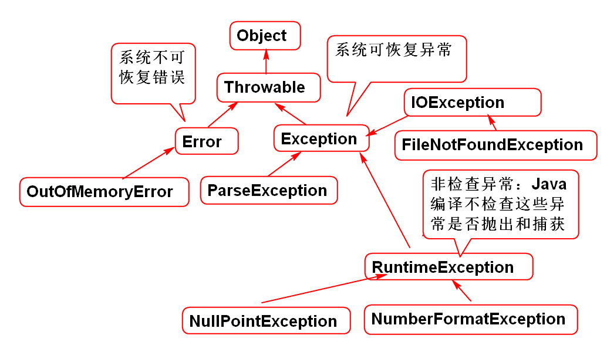

# RamdomAccessFile 与流

RamdomAccessFile： 可以从文件的任意位置开始读写，提供了基本的读写和基本类型的读写方法。

流：只能从头开始顺序读写，是可以扩展的架构，从基本的节点流可以扩展为任何数据的读写。

为啥要写文件？当需要将数据长久保存时候就需要写到文件中，比如：游戏对象的状态，游戏分数，拍照的结果，截屏的结果...

IO 流

节点流：是从基本的数据源打开的流
处理流: 高级流，过滤流，对基本流的功能扩展！

文件节点流

FileInputStream： 文件输入节点流，也是字节输入流
FileOutputStream： 文件输出节点流，也是字节输出流

BufferedInputStream：处理流，也是输入流，提供了数据缓存（byte数组）扩展功能，提高了IO性能，不需要改变原有逻辑就可以提高IO性能。

BufferedOutputStream：...

### 清空缓存的问题

flush() 清空缓存，将数据立即写的文件中。

案例:

	/**
	 * 缓存对IO的影响 
	 */
	public class Demo01 {
		public static void main(String[] args) 
			throws Exception{
			String file="abc/test.txt";
			FileOutputStream fos = 
				new FileOutputStream(file);	
			BufferedOutputStream out=
				new BufferedOutputStream(fos);
			//缓存流将数据写到缓存中，当缓存满了的
			//时候在成批（8K）的写到文件中
			out.write(65);
			out.write(66);
			out.write(66);
			//将缓存清空，数据写到文件中
			//清空缓存，文件不关闭可以继续写文件
			out.flush();
			out.write(67); 
			//关闭方法包含清空缓存的功能
			//out.close();
			//out.write(67); //不能再写文件了
		}
	}	

> flush()后面的数据经常不会写到文件中。 

### 对象输出流 

对象输出流：是高级流，必须依赖其他字节流。

对象写到文件中编码为byte数据写到文件中的过程称为“对象序列化” 反之称为对象反序列化。

Java利用序列化接口自动支持了对象序列化和反序列化，我们需要做的只是实现这个接口。

案例:

	/**
	 * 实现序列化接口时候Java自动添加两个方法：
	 * 一个是对象序列化方法（将对象变成byte）
	 * 一个是对象反序列化方法（将byte拼接为对象）
	 * 
	 * 建议:(必须遵守) 实现序列化接口是添加序列化
	 * 序列化 版本号，可以保证对象序列化、反序列化 
	 * 的稳定。减少更改类对序列化的影响。
	 */
	public class Person implements Serializable {
		private static final long 
			serialVersionUID = -44741053724L;
		String name;
		String sex;
		int age;
		//friend 是瞬态属性，系列时候会被忽略
		//反序列化结果是 null
		transient Person friend;
	 
		public Person(String name, String sex, int age) {
			super();
			this.name = name;
			this.sex = sex;
			this.age = age;
		}
	
	
	
		public Person(String name, int age) {
			this.name = name;
			this.age = age;
		}
	
	
	
		@Override
		public String toString() {
			return "Person [name=" + name + ", sex=" + sex + ", age=" + age + ", friend=" + friend + "]";
		}
	 
	 
	}

对象序列化案例：

	/**
	 * 对象输出流 
	 */
	public class Demo02 {
		public static void main(String[] args) 
			throws Exception{
			Person p1 = new Person("范传奇", 10);
			Person p2 = new Person("李洪鹤", 10);
			p1.friend = p2;
			String file="abc/obj.dat";
			//将对象写到文件中
			FileOutputStream fos=
				new FileOutputStream(file);
			BufferedOutputStream bos=
				new BufferedOutputStream(fos);
			//对象输出流
			ObjectOutputStream oos=
				new ObjectOutputStream(bos);
			//将对象写到文件中
			oos.writeObject(p1);
			oos.writeObject(p2);
			//关闭高级流就会自动关闭全部流
			oos.close();		
		}
	}

对象反序列化案例：
	
	
	/**
	 * 对象反序列化 
	 */
	public class Demo03 {
		public static void main(String[] args)
			throws  Exception{
			String file = "abc/obj.dat";
			
			FileInputStream fis=
				new FileInputStream(file);
			BufferedInputStream bis=
				new BufferedInputStream(fis);
			ObjectInputStream ois=
				new ObjectInputStream(bis);
			//读取对象
			//从文件读取一系列byte数据拼接为对象
			Person p1 = (Person)ois.readObject();
			Person p2 = (Person)ois.readObject();
			System.out.println(p1);
			System.out.println(p2);
			ois.close();
			
		}
	}

## 字符流

Java提供了字符处理流，字符处理流都是高级流，都需要依赖低级的字节流，字符流在低级流基础上扩展出字符的编码和解码功能，利用字符流可以简便的处理文本文件。

> 注意：字符流只能处理文本文件！！

字符输出流：

	/**
	 * 字符输出流
	 */
	public class Demo04 {
		public static void main(String[] args) 
			throws Exception {
			String file = "abc/osw.txt";
			FileOutputStream fos=
				new FileOutputStream(file);
			BufferedOutputStream bos=
				new BufferedOutputStream(fos);
			//OutputStreamWriter是高级流，必须依赖
			//其他的字节流，扩展的字符编码功能
			OutputStreamWriter writer=
				new OutputStreamWriter(
				bos, "utf-8");
			//将字符输出到文件
			//将30000（田）编码为UTF-8的byte数据
			//并且将byte写到文件中。
			writer.write(30000); 
			writer.write("田地");
			char[] chs = 
				{'你','好','J','A','V','A'};
			writer.write(chs);
			writer.write(chs,2,4);
			//关闭高级流就可以关闭文件了
			writer.close();
			
		}
	
	}

字符输入流：

	/**
	 * 读取文本信息 
	 */
	public class Demo05 {
		public static void main(String[] args) 
			throws Exception{
			String file="abc/osw.txt";
			FileInputStream fis=
				new FileInputStream(file);
			BufferedInputStream bis=
				new BufferedInputStream(fis);
			//使用 InputStreamReader
			//InputStreamReader 是高级流，必须依赖
			//基本的字节流，扩展了字符的解码功能
			//将字节流中的byte数据读取后进行字符
			//解码 得到解码以后的字符数据
			InputStreamReader reader=
				new InputStreamReader(
				bis, "utf-8");//GBK
			//读取字符,返回0~65535之间的字符
	//		int c = reader.read();
	//		char ch = (char)c;
	//		System.out.println(ch);
	//		c = reader.read();
	//		ch = (char)c;
	//		System.out.println(ch);
			int c;
			while((c = reader.read())!=-1){
				char ch = (char)c;
				System.out.println(ch); 
			}
			reader.close();
		}
	}

### PrintWriter

PrintWriter 是高级流，提供了更加方便的println方法，是最常用的流之一， 经常用于写文本文件。

案例：

	/**
	 * 利用PrintWriter 写文本文件 
	 */
	public class Demo06 {
		public static void main(String[] args) 
			throws Exception{
			String file="abc/pw.txt";
			FileOutputStream fos=
				new FileOutputStream(file);
			BufferedOutputStream bos=
				new BufferedOutputStream(fos);
			OutputStreamWriter osw =
				new OutputStreamWriter(
				bos, "utf-8");
			//PrintWriter：是高级流，扩展了println
			//方法和print
			// true 自动清理缓存功能，每个println方法
			//之后会执行一个  flush方法
			PrintWriter out=new PrintWriter(osw, true);
			out.println("Hello World!");
			out.close();
		}
	}

> 建议： 写文本文件时候要明确指定文本的编码。

### BufferedReader 

BufferedReader 是高级流，它提供了非常方便的文本读取方法readLine，是最常用的文本文件读取流。

案例：
	
	/**
	 * 利用BufferedReader读取文本文件 
	 */
	public class Demo07 {
		public static void main(String[] args) 
			throws Exception{
			String file = "abc/day07.md";
			FileInputStream fis = 
				new FileInputStream(file);
			BufferedInputStream bis=
				new BufferedInputStream(fis);
			InputStreamReader isr = 
				new InputStreamReader(
				bis,"UTF-8");
			//BufferedReader  是高级流
			BufferedReader in=
				new BufferedReader(isr);
			/**
			 * readLine 返回文本文件中的一行数据
			 * 不包含回车字符，当读取到文件末尾时候
			 * 返回null
			 */
			String str;
			while((str=in.readLine())!=null){
				System.out.println(str);
			}
			in.close();
		}
	}	

### 综合案例

	
	/**
	 * 将控制台输入的信息保存文本文件中 
	 */
	public class Demo08 {
		public static void main(String[] args) 
			throws Exception {
			Scanner in = new Scanner(System.in); 
			String file="abc/mail.txt";
			
			File mail = new File(file);
			if(mail.exists()){
				System.out.print(
					"旧文件存在，还要吗(y/n)？");
				String s = in.nextLine();
				if(s.equals("n")){
					if(mail.delete()){
						System.out.println("已经删除");
					}
				}
			}
			
			//true: 表示追加方式写文件
			FileOutputStream fos=
				new FileOutputStream(file, true);
			BufferedOutputStream bos =
				new BufferedOutputStream(fos);
			OutputStreamWriter osw = 
				new OutputStreamWriter(
				bos, "UTF-8");
			PrintWriter out=
				new PrintWriter(osw, true);
			//从控制台读取一行，向文件中写一行
			while(true){
				String str = in.nextLine();
				if(str.equals(":exit")){
					break;
				}
				out.println(str); 
			}
			out.close();
		}
	}
	

## 异常

意外处理手段：

1. 利用方法的特殊返回值处理意外
	- map.get(key) 返回null表示没有找到
	- read() 返回0~255正常，返回 -1 表示意外，文件的末尾
	- readLine() 正常返回字符串，意外返回null
	- ...
	- 优点：简单
	- 缺点：状态不明确
2. 利用异常返回特殊情况
	- Date d=fmt.parse(str) 正常返回日期数据，意外抛出FormatExeption 对象
	- int i=Integer.parseInt(str) 正常返回int数据，意外抛出异常。 

### try catch 处理异常

Java提供了try catch 处理方法， 用于处理软件中出现的异常：

案例：

	
	/**
	 * 异常处理 
	 */
	public class Demo09 {
		public static void main(String[] args) 
			throws Exception {
			SimpleDateFormat fmt =
				new SimpleDateFormat("yyyy-MM-dd");
			String str = "A2017-03-01";//"一九九七年";
			String s = "a55";
			Date d=null;
			int age=0;
			try{
				d = fmt.parse(str);
				age = Integer.parseInt(s);
			}catch(ParseException e){
				System.out.println("替换系统时间");
				d = new Date();
			}catch(NumberFormatException e){
				System.out.println("处理数字解析异常");
				age = 18;
			}
			System.out.println(d);
			System.out.println(age); 
			//...
		}
	}
	
### finally 

try catch 中可以写一个fianlly代码块，finally代码块无论是否出现异常都会执行。

案例：

	/**
	 * try catch finally 的规则 
	 *
	 */
	public class Demo11 {
		public static void main(String[] args) {
			// y = println(test(x))
			System.out.println(test("5A")); 
			System.out.println(test(null)); 
			System.out.println(test("")); 
		}
		public static int test(String s){
			try{
				int n = s.charAt(0)-'0';
				return n;
			}catch(NullPointerException e){
				return -1;
			}catch (RuntimeException e) {
				return -2;
			}finally{//最终的，最终执行代码块
				//无论是否出现异常永远执行
				//用于执行回收资源：关闭文件等
				System.out.println("finally"); 
			}
		}
	}

### 案例

复制一个文件的异常处理：
	
	/**
	 * 一个完整的异常处理案例 
	 */
	public class Demo12 {
		public static void main(String[] args) {
			String from = "abc";
			String to = "abc/ok.new";
			try{
				//Java编译器会检查：如果方法有异常声明就必须进行处理
				copy(from, to);
				System.out.println("完成");
			}catch(RuntimeException e){
				e.printStackTrace();
				System.out.println(e.getMessage());
			}catch (IOException e) {
				e.printStackTrace();
				System.out.println(e.getMessage());
			}
			
		}
		
		//方法中如果抛出了异常，就需要使用throws声明
		//方法有意外情况发生，否则会有编译错误
		public static void copy(String from,
				String to) throws IOException,
			RuntimeException {
			File file = new File(from);
			if(! file.exists()){
				throw new RuntimeException(
				"源文件不存在！"+from);
			}
			if(! file.isFile()){
				throw new RuntimeException(
				"源不是文件！"+from);	
			}
			//...可以增加其他异常处理逻辑
			
			//必须在try
			FileInputStream in = null;
			FileOutputStream out = null;
			try{
				in=new FileInputStream(from);
				out=new FileOutputStream(to);
				byte[] buf = new byte[1024*8];
				int n;
				while((n=in.read(buf))!=-1){
					out.write(buf, 0, n);
				}
	
			}catch(FileNotFoundException e){
				e.printStackTrace();
			}catch (IOException e) {
				//复制期间的读写失败！
				e.printStackTrace();
				//复制期间出现的意外情况，必须
				//再次抛给调用者，告诉调用者复制失败了
				throw e;
			}finally{
				//回收系统资源
				//close()方法本身也会抛出异常，必须进行捕获处理
				try{
					//由于in可能为null，为了避免空指针异常，必须检查是否为空
					if(in!=null) in.close();
					if(out!=null) out.close();
				}catch(IOException e){
					e.printStackTrace();
				}
			}
		}
	}

### 异常的分类

异常的继承关系：

所有异常都继承于： Throwable

Error 的子类表示系统不可恢复错误，一旦出现Java虚拟机就崩溃了，程序就无法恢复执行了。

Exception 的子类是系统可恢复异常，一旦出现异常只要使用代码进行适当的处理程序就可以恢复继续执行。

RuntimeException：非检查异常，是系统不检查的异常，Java编译器不检查RuntimeException和其子类的异常，无论是抛出和捕获都不检查。这类异常需要程序员编程需要避免的异常。

Error案例：

	/**
	 * 系统不可恢复的错误：堆内存溢出（内存泄漏） 
	 */
	public class Demo10 {
		public static void main(String[] args) {
			List<Foo> list= 
				new ArrayList<Foo>();
			for(int i=0; i<50000000; i++){
				list.add(new Foo());
				//new Foo();
			}
		}
	}
	class Foo{
		long a;
		long b;
		long c;
		long d;
	}

------------------

## 作业

1. 完成课题案例
2. 完成SVN案例

