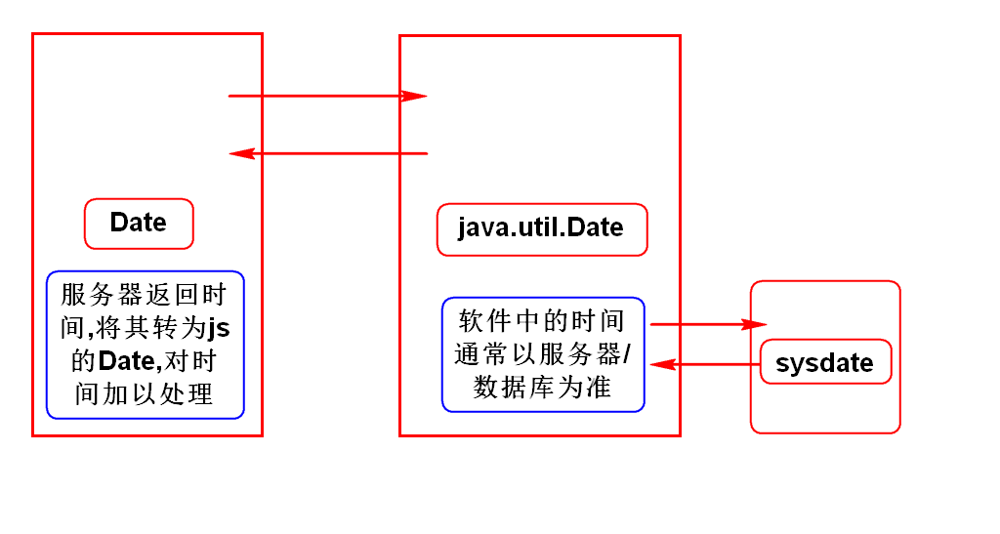
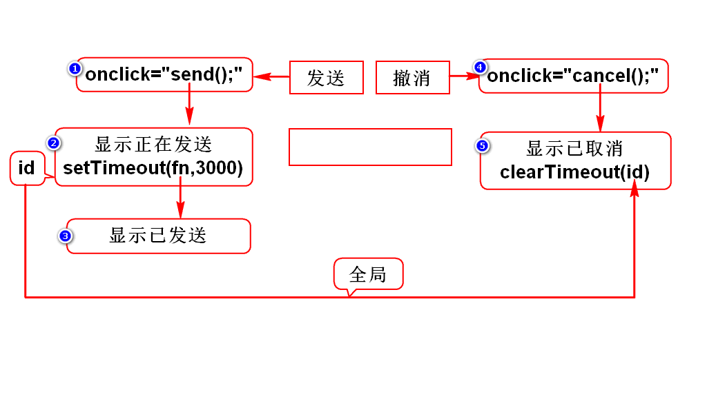
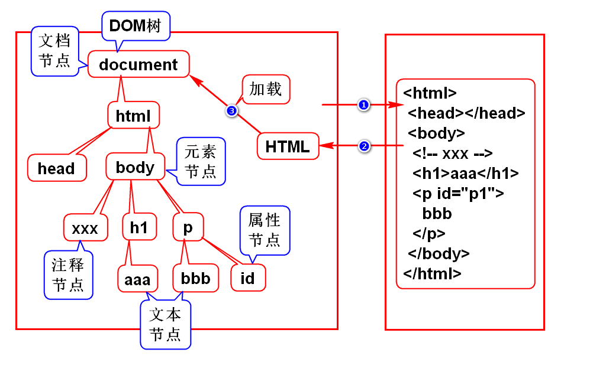

# █ HTML 部分
# 一. WebBasic 概述

## 1. 课程安排
1. **HTML ( 1.5天 )**
勾勒出网页的结构和内容

2. **CSS ( 3天 )**

3. **JavaScript ( 4天 )**
动态网页脚本, 让网页呈现动态的数据和效果

4. **jQuery ( 1.5天 )**
是一个框架, 提高JS的开发效率

### 1.1. 补充: W3C中文官方手册

- 外网: [http://www.w3school.com.cn](http://www.w3school.com.cn "w3school")
- 内网: [http://doc.tedu.cn](http://doc.tedu.cn)
内网上的文档, 可以从外网的 [canglaoshi.org](http://canglaoshi.org) 网站下载

### 1.2. 补充2: 创建WEB项目的注意事项
1. **JavaEE视图**

- 在 Eclipse 右上角选择 JavaEE

2. **选择 war**

- 创建 Maven 项目, 最后一步选择 war 包封装

3. **创建项目部署文件**

- 展开项目
- 右键点击 Deployment Descriptor
- 选择 Generate Deployment Descriptor Stub, 创建项目的部署描述文件

## 2. WEB 概述

### 1. Web三要素
- **浏览器**：向服务器发起请求，下载服务器中的网页（HTML文件），然后执行 HTML 显示出内容
- **服务器**：接收浏览器的请求，发送相应的页面到浏览器
- **HTTP协议**：浏览器与服务器的通讯协议

### 2. 工作原理

- HTML 是带标记的文本文件, 部署在服务器上, 在浏览器上解释执行
根据 HTTP 协议, 浏览器发出请求给服务器，服务器做出响应, 给浏览器返回一个 HTML
- 浏览器解释执行 HTML, 从而显示出内容

### 3. XML 与 HTML

#### 3.1. XML
- 可扩展（自定义）标记语言
- 标记，属性，标记之间的关系都可以扩展
- 用来存储或传输数据

#### 3.2. HTML
- 超文本标记语言
- 用来设计网页的标记语言, 文件以 .html 或 .htm 为后缀
- 由浏览器解释执行, 可以嵌套用脚本语言编写的程序段
- 标记、属性、标记之间的关系都是固定的（由 W3C 制定标准）
- 可以将 HTML 理解为标签固定的 XML, 某些版本的 HTML 是严格遵守 XML 规范

***

# 二. HTML

## 1. HTML 简介
### 1.1. HTML 标记
HTML 标记通常也被称为 HTML **标签** (HTML tag), 是用尖括号括起来的关键词.

- **双标签**: 
成对出现的标签, 开始标签 + 结束标签, 结束标签有结束符号(斜杠 /),  双标签中间是标签要表达的内容
> <标签 属性=属性值> 内容 < /标签>  

- **单标签**: 
单独出现的标签, 一个标签即可把内容表达清楚, 但单标签要包含结束符号(斜杠 /)
> <标签 属性=属性值 />

### 1.2. HTML 注释
HTML 支持在文件中添加注释, 注释可以跨行, 不可嵌套
> < !-- 注释内容 -->

## 2. HTML 文档结构
### 2.1. 版本声明

- HTML 有多个不同版本的标准, 不同版本支持的标签功能有区别, 会导致页面显示效果不一致. 因此在文档中要明确指出采用的 HTML 版本, 浏览器才能正确解读文件, 达到理想的效果.
- HTML 版本需要在文档开头声明, <!DOCTYPE> 该声明不是 HTML 标签, 它告诉浏览器应该用什么标准来解读当前页面

    > < !DOCTYPE html版本信息>
    
    	常用的 HTML5 声明
    	<!DOCTYPE html>

### 2.2. < HTML> 根标签

- 每个HTML文件都有一个根标签, 根标签为< HTML>
根标签之下有两个子标签, **< head> 头部** 与 **< body> 主体**.

    > < HTML> 页面内容 < /HTML>

### 2.3. < head> 头部
< head>元素是所有头部元素的容器, 可以声明元信息, 指示浏览器在何处可以找到样式表, 脚本等等

- **< title> 标题**
指定页面的标题, 该标题可用在收藏夹, 或作为搜索引擎结果的页面标题
- **< meta> 元信息**
关于 HTML 文档的元数据, 不会显示在页面上, 用以告知浏览器必要信息.
用于规定页面的描述, 关键词, 文档作者, 最后修改时间以及其他元数据

 - charset 指示字符编码集
 - content 指示页面内容

### 2.4. < body> 主体
HTML 页面的具体页面内容

# 三. HTML 页面内容

## 1. 文本元素
文本是网页上的重要组成部分, 直接书写的文本会用浏览器默认的样式显示, 也可以用相应的文本类标签进行处理.

### 1.1. 标题元素
标题元素让文字以醒目的方式显示, 往往用于文章的标题, 有 h1~h6 六个等级
> < h1> 标题文本 < /h1>

### 1.2. 段落元素
结构化文本的一种方式, 段落元素中的文本独立成段, 有段间距
> < p> 标题文本 < /p>

### 1.3. 列表元素
列表是值将具有相似特征或者先后顺序的几行文字进行对齐排列
列表元素可以嵌套使用, 可以创建多层列表, 常用于创建文档大纲, 导航菜单等

- **有序列表**
有序列表, 按顺序将列表项对齐排列, 段首有数字编号
> < ol> 列表内容 < /ol>

- **无序列表**
无序列表, 将列表项对齐排列, 段前有段落标记, 但没有数字编号
> < ul> 列表内容 < /ul>

- **列表项**
无论是有序列表还是无序列表, 在列表之中都有列表项, 列表项使用 **< li>** 指示
> < li> 列表项 < /li>

### 1.4. 块分区元素
块分区元素用于为元素分组, 常用于页面布局
块级元素会独立成段, 即前后都会自动换行
> < div> 区块内容 < /div>

### 1.5. 行内元素
**span** 行分区不会自动换行, 没有特定的含义, 可用于为行内部分文本设置样式属性
> < span> 行内容 < /span>

除了用 **span** 添加 CSS 样式, 还可使用以下标签设置简单的文本样式

- **< i>** 斜体
- **< b>** 加粗 
- **< u>** 下划线
- **< del>** 删除线
- **&...;** 实体引用

### 1.6. 元素显示方式

- **块级元素**
默认情况下, 块级元素会独占一行, 即元素的前后都会自动换行
如 段落元素 < p>, 块分区元素 < div>, 标题元素 < hn>

- **行内元素**
行内元素不会换行, 默认与别的元素位于同一行内
如: 行分区< span>, 超链接< a>

## 2. 图像
使用单标记< img>元素, 将图像添加到页面
> < img src="../images/04.jpg" alt="替代文本" title="悬停信息" />

- **src**
用于指定图像文件的位置, 可使用相对路径或绝对路径
- **width**
设置图片的显示宽度, 通常以像素为单位指定, 也可使用相对父级区域的百分比
- **height**
设置图片的显示高度, 通常以像素为单位
- **alt**
设置图片无法正常显示时的替代文本, 建议填写
- **title**
设置鼠标悬停时在图片上显示的文本信息, 建议填写

## 3. 超链接

### 3.1. 链接到外部网页
使用 < a>元素创建一个超链接, 使点击相应文本时可以跳转到指定位置.
> < a href="目标位置" target="打开方式"> 显示的内容 < /a>

- **href**
设置连接要跳转的网页路径, 可以是绝对路径或相对路径, 也可以是 js 脚本语句

- **target**
设置跳转页面的打开方式, 默认是当前窗口打开( **\_self** ), 也可以设为新窗口打开( **\_blank** )

示例:

	<a href="http://www.tmooc.cn">默认在原窗口打开</a>
	<a href="http://www.tmooc.cn" target="_blank">target在新窗口打开</a>

### 3.2. 链接到页内锚点
超链接除了跳转到别的页面, 还可以跳转到当前页面的指定位置, 此时跳转的目标位置为页内的锚点, 用 **\#锚点名** 表示

- **定义锚点**
**< a>**标签的 **name** 属性可以为内容设置锚点
> < a name="锚点名"> 显示内容 < /a>

- **链接到锚点**
**< a>**标签的 **href** 属性可以设置要跳转的锚点 
> < a href="#锚点名"> 显示内容 < /a>

- **链接到顶部**
页面顶部默认就是一个锚点, 没有锚点名, 直接用 # 表示
> < a href="#"> 显示内容 < /a>

## 4. 表格
### 4.1. 表格的作用
- 表格通常用来组织结构化的信息, 是由单元格排列而成
- 也可以使用表格来为页面分区

### 4.2. 表格的结构

#### 1) **< table> 表格标签**
< table> 内就是表格范围, 不需要使用 < p> 划分段落
创建表格时, 先通过**< table> 表格标签**划分出表格整体的作用范围
可以使用下列属性设置相应的格式

- 常用属性

    - **border**: 设置表格边框
    - **width/height**: 设置表格的尺寸
    - **align**: 设置表格相对页面的位置
    - **cellpadding**: 单元格边框与内容之间的间距
    - **cellspacing**: 单元格之间的间距

#### 2) **< tr> 行标签**
划分表格内行的范围, 把表格按行划分

- 常用属性

    - **align**: 行内所有单元格内容在水平方向的位置
    - **valign**: 行内所有单元格内容在竖直方向的位置

#### 3) **< td> 列标签**
使用列标签, 给每一个行分列, 从而获得单元格

- 常用属性

    - **align**: 一个单元格内元素的水平方向位置
    - **valign**: 一个单元格内元素的竖直方向位置

#### 4) **< th> 标题标签**
特殊的列标签, 单元格内容自动居中并加粗

#### 5) 案例
代码:

	<table border="1" cellspacing="0">
		<tr>
			<td>苍老师</td>
			<td>范传奇</td>
		</tr>
		<tr align="right">
			<td>王克晶</td>
			<td>程祖红</td>
		</tr>
	</table>

效果:

<table border="1" cellspacing="0">
	<tr>
        <td>本行左对齐</td>
		<td>苍老师</td>
		<td>范传奇范传奇范传奇</td>
	</tr>
	<tr align="right">
        <td>本行右对齐</td>
		<td>王克晶王克晶王克晶王克晶</td>
		<td>程祖红</td>
	</tr>
	<tr></tr>
</table>

### 4.3. 跨行跨列表格

#### 1) 跨行属性 : rowspan
使当前单元格沿着垂直方向延伸, 单元格跨行, 属性值为该单元格跨越的行数
> < td rowspan="行数"> 内容 < /td>

	<table border="1" cellspacing="0">
		<tr>
			<td rowspan="2">苍老师</td>
			<td>范传奇</td>
		</tr>
		<tr>
			<!-- <td>王克晶</td> -->
			<td>程祖红</td>
		</tr>
	</table>

#### 2) 跨列属性 : colspan
使当前单元格沿着水平方向延伸, 单元格跨列, 属性值为该单元格跨越的列数
> < td colspan="行数"> 内容 < /td>

	<table border="1" cellspacing="0">
		<tr>
			<td colspan="2">苍老师</td>
			<!-- <td>范传奇</td> -->
		</tr>
		<tr>
			<td>王克晶</td>
			<td>程祖红</td>
		</tr>
	</table>

### 4.4. 表格行分组
表格内可以按行划分为3个部分: 

- < thead> 表头
- < tbody> 表主体
- < tfoot> 表尾

		<table border="1" cellspacing="0" width="500">
			<thead>
				<tr>
					<td>编号</td>
					<td>名称</td>
					<td>金额</td>
				</tr>
			</thead>
			<tbody style="color:red;">
				<tr>
					<td>1</td>
					<td>鼠标</td>
					<td>100.0</td>
				</tr>
				<tr>
					<td>2</td>
					<td>键盘</td>
					<td>200.0</td>
				</tr>
				<tr>
					<td>3</td>
					<td>音响</td>
					<td>300.0</td>
				</tr>
			</tbody>
			<tfoot>
				<tr>
					<td colspan="2">合计</td>
					<td>600.0</td>
				</tr>
			</tfoot>
		</table>

效果:

<table border="1" cellspacing="0" width="500">
	<thead>
		<tr>
			<td>编号</td>
			<td>名称</td>
			<td>金额</td>
		</tr>
	</thead>
	<tbody style="color:red;">
		<tr>
			<td>1</td>
			<td>鼠标</td>
			<td>100.0</td>
		</tr>
		<tr>
			<td>2</td>
			<td>键盘</td>
			<td>200.0</td>
		</tr>
		<tr>
			<td>3</td>
			<td>音响</td>
			<td>300.0</td>
		</tr>
	</tbody>
	<tfoot>
		<tr>
			<td colspan="2">合计</td>
			<td>600.0</td>
		</tr>
	</tfoot>
</table>

# 四. 案例: 英雄联盟
## 1. 分区
- 所有区域都要设置宽度、边框、居中

		style="	border:1px solid red;
				width:960px;
				margin:0 auto;	"

## 2.逐个开发每个区域

# 五. 表单
## 1. 表单概述
### 1.1. 表单元素
表单, 
< form> 双标签, 用来圈定需要提交的内容

### 1.2. 表单控件
用来给用户输入数据的框
共4类9种, 通过 **type** 属性指定

1. 输入框

	1. "text" 		文本框
	2. "password"	密码框

2. 选择框

	1. "radio" 单选框
	2. "checkbox" 复选框

3. 按钮

	1. "submit" 提交按钮
	2. "reset" 重置按钮
	3. "button" 普通按钮

4. 其他

	1. "hidden" 隐藏域
	2. "file" 文件选择框

## 2. input 元素
### 2.1. 输入框
#### 1) 文本框
最常用的输入控件
> < input type="text" />

#### 2) 密码框
与普通文本框类似, 但输入的文本不直接显示, 以星号表示
> < input type="password" />

#### 3) 文本框和密码框的主要属性

- value: 设置文本框的默认内容
- maxlength: 限制输入的字符数
- readonly: 设置文本控件为只读

#### 4) 效果

	
 账号: <input type="text" value="default" readonly/> 

	
 密码: <input type="password" value="123456" /> 

账号:<input type="text" value="default" readonly/>

密码:<input type="password" value="123456" />

### 2.2. 选择框

#### 1) 单选框

单选框默认并不排斥, 需要用 **name** 属性对单选框进行分组, 
具有相同name的单选框为同一组, 相互排斥
> < input type="**radio**" name="组名" />选项

单选框可以通过 **checked** 属性设置默认值
> < input type = "radio" name = "组名" **checked** />选项

**value**属性用来设置各选项对应的值

	性别:
	<input type="radio" name="gender" checked/>男
	<input type="radio" name="gender"/>女

	性别:
	<input type="radio" name="gender" checked/>男
	<input type="radio" name="gender" />女

#### 2) 复选框

> < input type = "**checkbox**" />

	兴趣:
	<input type="checkbox" checked />吃
	<input type="checkbox" />喝

	兴趣:
	<input type="checkbox" checked />吃
	<input type="checkbox" />喝

#### 3) 隐藏框
用来设置需要向服务器发送, 但不希望被用户看到的数据
通过value指定默认值
> < input type="**hidden**" value="默认值" />

#### 4) 文件框
选择要上传的文件
> < input type="**file**" />

#### 5) 按钮
按钮有三种, 提交, 重置, 自定义
通过 value 属性指定按钮名字

- **提交按钮** submit
  将表单的内容提交到服务器

    > < input type="**submit**" value="提交" />

- **重置按钮** reset
  将表单的内容清除, 恢复到初始状态

    > < input type="**reset**" value="重置" />

- **自定义按钮** buttun
  结合 js, 给按钮绑定事件, 实现自定义功能

    > < input type="**button**" value="按钮名" />

### 2.3 其他标签

#### 1) label 与 id
ID 是元素的唯一标识, 任何元素都可以指定 ID
通过 label 元素, 可以将控件与文本内容绑定在一起
增加控件的面积, 便于操作

> < input type="类型" id="**控件标识**" />
> < label for="**控件标识**" >内容 < /label>

- 代码:
  
    	<input type="checkbox" checked id="check1" />
        	<label for="check1">我已阅读并愿遵守此协议</label>

- 效果:
  
    

        <input type="checkbox" checked id="check1" />
        <label for="check1">我已阅读并愿遵守此协议</label>
    

#### 2) 下拉选
使用 select 表示下拉选
用 option 指示各个选项, 第一个选项往往设为提示信息
selected设置默认值, 也常用 value 属性设置与选项对应的值

> < select>
> 　　< option>请选择< /option>
> 　　< option value="1"> 选项1 < /option>
> 　　< option value="2" selected> 选项2 < /option>
> < /select>

- 代码:

        <select>
        	<option>请选择</option>
        	<option>北京</option>
        	<option>上海</option>
        	<option selected>西安</option>
        	<option>深圳</option>
        	<option>惠州</option>
        </select>

- 效果:

    <select>
    	<option>请选择</option>
    	<option>北京</option>
    	<option>上海</option>
    	<option selected>西安</option>
    	<option>深圳</option>
    	<option>惠州</option>
    </select>

#### 3) 文本域
可以自由改变大小的文本框 
可以设置默认的行数和列数, 从而指定了默认大小
默认大小为2*20
双标签中间为默认值

> < textarea cols="列数" rows="行数">5555555555< /textarea>

- 代码:

        简介: <textarea cols="20" rows="2">5555555555</textarea>

- 效果:

    

        简介:
        <textarea cols="20" rows="2">5555555555</textarea>
    

# █ CSS 层叠样式表

# 一. 概述
## 1. 简介

## 2. 使用
> 

# 二. CSS语法
## 3. 样式声明

### 3.1. border 边框
> border: width style color;
> border-指定边: width style color;

	/* 给一边加上边框 */
	h1 {
		border-left:5px solid red;
	}
	
	/* 给四条边加上相同的边框 */
	p {
		border:2px dashed grey;
	}

### 3.2. border 内容溢出处理

- visible: 显示
- hidden: 隐藏
- scroll: 显示滚动条
- auto: 自动显示滚动条

## 4. BOX 框模型

## 5. 背景

> 

# 三. 文本格式化

- 指定字体
> font-family: 字体1, 字体2 ;

- 字体大小
> font-size: 字体大小 ;

- 字体加粗
> font-weight: normal/bold ;

- 文本颜色
> color: 颜色

- 文本排列
> text_align: left/center/right

- 文字修饰
> text-decoration: none/underline

- 行高
不设置行高,则行高与字高相同
设置了行高,文字会在行高范围内垂直居中
> line-height: 行高值

- 首行文本缩进
> text-indent: 缩进量

演示代码:

	body {
		font-family: "微软雅黑","文泉驿正黑","黑体";
		font-size:14px;
	}
	.logo {
		text-align:right;
		line-height:61px;
	}
	.logo>a {
		margin-right:40px;
		text-decoration:none;
		color:#fff;
	}
	.logo>a:hover{
		font-weight:bold;
	}
	.copyright>p {
		color:#fff;
		text-align:center;
		line-height:25px;
	}

# 四. 表格样式

# 五. 定位
# 六. 杂项

# █ JavaScript 动态脚本语言

# 一. 概述
## 1. JavaScript 概述
**JavaScript** 是嵌入在HTML中, 在浏览器中运行的脚本语言, 具有与Java, c语言类似的语法.

1. 一种网页编程技术, 用来向 HTML 页面添加交互行为
2. 直接嵌入 HTML 页面
3. 由浏览器解释执行代码, 不需进行预编译

### 1.1. 发展史
最早由网景公司在 Netscape 2.0 首先推出了 JavaScript, 当时命名参考了 Java 的名称
现在由 **ECMA** 组织维护 JavaScript 标准

### 1.2. 特点
可以使用任何文本编辑工具编写
由浏览器内置的 JavaScript 引擎执行代码

- 解释执行: 事先不编译, 逐行执行
- 基于对象: 内置大量线程对象

适宜:

- 客户端数据机选
- 客户端表单合法性验证
- 浏览器事件的触发
- 网页特殊显示效果制作
- 服务器的异步数据提交

## 2. JavaScript 的三种调用方式

### 2.1. 事件定义式
- 在定义事件时直接写入 JavaScript 脚本代码, 要用**双引号**把 JavaScript 语句括起来
- 事件: 是用户的操作(动作), 是 JavaScript 调用的时机
如单击事件, 双击事件...
> <标签 **事件 = "JavaScript 语句"** /> 

		<input type="button" value="按钮1" onclick="alert('hello,tarena!');" />

### 2.2. 嵌入式
#### 1) 标签中定义函数
- 在页面内任意位置, 嵌入 **< script>** 标签, 在标签中定义 JavaScript 函数

	- JavaScript 的函数都是公有的静态函数
	- JavaScript 的函数都有返回值, 返回值类型不用声明
	- JavaScript 中使用引号时, 单引号与双引号效果相同
	
> function 函数名( 参数列表 ){ 函数体 }

	//定义函数
	
	
	//调用函数
	<input type="button" value="按钮2" onclick="f2();" />
#### 2) 标签中直接写执行语句
嵌入式调用 JavaScript 时, **< script>** 标签中除了定义函数, 还可以直接写 JavaScript 代码.

- 直接写 js 代码, 此时的代码在页面加载的同时就将执行, 并且可以阻塞页面的后续加载

### 2.3. 文件调用式

- 将 JavaScript 代码写入一个单独的 .js 文件, HTML 文件引用该 .js 文件
- js 文件是纯文本文件, 不需要包含 < script> 标签, 直接书写 js 代码
- 引入文件时, 相当于把 JavaScript 代码复制到该位置

> < script src="js文件路径"> < /script> 

	

### 2.4. script 标签
1. 可以用来定义嵌入式 JavaScript 函数
2. 可以用来引用文件调用式 JavaScript 代码

- 若在同一个script标签中, 既引用了外部js文件, 又定义新的JavaScript函数代码, 则对内部函数的定义有严格要求
- 不建议在一个script标签中同时执行两种调用方式.

## 3. 代码纠错问题
- JavaScript 是解释性代码, 若编写时代码错误, 编辑器中并无明显提示, 只有最后执行时, 页面中得不到理想效果.

1. **查看错误信息**
页面执行出错时, 可以在浏览器控制台查看错误信息
不管能否看懂, 都必须去看, 对于反复出现的错误要记住
**· IE:** 状态栏, 开发工具
**· Firefox, Chrome:** 错误控制台

2. **打桩**
隔一段代码, 输出一次当前信息, 看程序执行到什么地方出错
打桩还可跟踪程序执行的过程, 检验变量在当前语句是否正确

3. **排除法定位故障点**
每次注释掉一部分代码, 看代码是否还有问题
建议采用二分法, 每次注释一半的可疑代码

# 二. JavaScript 基本语法

## 1. 注释
JavaScript 的注释方式与 Java 基本相同, 但没有文档注释

> //单行注释
> /* 多行注释 */

## 2. 语句
### 2.1. 基本规则
- 由表达式, 关键字, 运算符组成
- 大小写敏感
- 使用分号或换行结束, 一行中有多个语句时不能省略分号
- 推荐加上分号, 减少错误和歧义

### 2.2. 常用语句
1. 弹出提示框
> alert('弹出框内容');

2. 控制台输出
> console.log("输出内容");

3. 获取外部对象
> document.getElementById("元素ID");

4. 获取对象的值
> 外部对象.value;

5. 输出内容
> 外部对象.innerHTML = 输出内容;

## 3. 标识符
- 标识符

	- 由不以数字开头的字母,下划线,美元符号组成
	- 常用于标识函数,变量等名称
	- 见名知意,小驼峰命名法
	- JavaScript 有一些保留字,不可声明为标识符

## 4. 变量
### 4.1.  声明变量
JavaScript 的变量没有类型, 称为弱类型语言, Java的变量有明确类型, 称为强类型语言
统一使用关键字 **var** 声明变量
变量没有类型, 但变量引用的数据是有类型的
> var x,y;

### 4.2. 变量初始化
使用 **=** 赋值, 未初始化的默认值为 **undefined**

## 5. 数据类型
### 5.1. 特殊类型
- null: 空
- undefined: 未定义

### 5.2. 内置对象(基本类型)
- Number: 数字
- String: 字符串
- Boolean: 布尔
- Function: 函数
- Array: 数组

### 5.3. 外部对象
- window: 浏览器对象
- document: 文档对象

### 5.4. 自定义对象
- Object: 自定义对象

### 5.5. 类型转换
JavaScript 属于松散类型的程序语言

- 变量在声明时不需要指定数据类型
- 变量所引用的数据有类型

不同类型数据在计算过程中会自动进行转换

- 数字值 + 字符串: 数字转换为字符串
- 数字值 + 布尔值: true转换1, false转为0
- 字符串 + 布尔值: 布尔转换为字符串true或false
- 布尔值 + 布尔值: 布尔值转换为数值1或0进行计算

### 5.6. 类型转换函数

#### 1) 转换为字符串
- 所有数据类型都可以转换为String类型

    > toString( 表达式 )

#### 2) 转换为整数
- 转换为整数, 若失败则返回 **NaN** ( not a number)

    > parseInt( 表达式 )

		console.log(parseInt("3.14"));	//3
		console.log(parseInt(3.14));	//3
		console.log(parseInt("good"));	//NaN
		console.log(parseInt(true));	//NaN

#### 3) 转换为浮点数
- 转换为浮点数, 若失败则返回 **NaN** ( not a number)

    > parseFloat( 表达式 )

#### 4) 查询当前类型
- 查询当前数据的类型

    > typeof( 表达式 )

#### 5) 数字类型检查
- 判断被测表达式是不是一个数,
如果不是数则返回 true , 是一个数则返回 false

    > isNaN( 表达式 )

- 判断结果不太理想, 实际工作中通常使用正则表达式来判断

		console.log(isNaN(3.14));		//false
		console.log(isNaN("3.14"));		//false	
		console.log(isNaN("abc"));		//true
		console.log(isNaN(true));		//false
	
		//矛盾的情况, 空串非NaN, 解析结果却是NaN
		console.log(isNaN(""));			//false
		console.log(parseInt(""));		//NaN

## 6. 运算符
JavaScript 的运算符, 与 Java 中的相似, 只有部分小区别

### 6.1. 算术运算
- **+ 加 :** 可以表示数值的加法运算, 也可以用于字符串连接
- **- 减 :** 可以表示数值的减法运算, 也可以用于表示负数
- **＊乘 :** 同Java中乘法一样
- **/ 除 :** 整型数值相除可以得到浮点数
- **++ 递增 :** i++ 等价于 i = i + 1
- **-- 递减 :** i-- 等价于 i = i - 1

### 6.2. 关系运算
用于判断数据之间的大小关系, 关系表达式的结果值为boolean类型

- **>**  大于
- **<**  小于
- **=**     等于
- **!=**    不等于
- **>=** 大于等于
- **<=** 小于等于

### 6.3. 全等运算
JavaScript 中除了普通的双等号表示数值相等, 还可以用三等号表示全等

- **相等**: 数值相等, 类型不一定相同

    > 变量1 == 变量2

- **全等**: 数值相等, 类型也相同

    > 变量1 === 变量2

- **不全等**

    > 变量1 !== 变量2

    	console.log("运算符测试");
    	var k = "5";
    	var t = 5;
    	console.log(k==t);	//true
    	console.log(k===t);	//false

### 6.4. 逻辑运算

- 与 java 中的逻辑运算符相似

    - 逻辑非 !
    - 逻辑与 &&
    - 逻辑或 ||

#### 1) && 与 &
- 使用 && 
如果前面结果是false 或 空值, 则该语句短路, 不再执行后续语句
如果前面结果是true 或 非空值, 则该语句继续执行后续判断, 最终返回右侧语句的结果

- 使用 & 
一旦遇到false 或 空值, 则该语句短路, 不再执行后续语句,返回0
如果语句执行完了都没有遇到 false 或 空值, 则返回1

- 使用类型转换
由于布尔值相加减时, 会将 true 转换为1, false 转换为0, 因此可以通过相加实现与的判断
需要确保两个检查方法都正确执行, 可以使用
> 条件1 + 条件2 == 2

### 6.5. 条件运算
条件运算, 即三目运算符
先计算布尔式的值, 如果为true, 则执行表达式1, 否则执行表达式2
> 布尔式 ? 表达式1 : 表达式2 

### 6.6. 案例: 计算平方

- 代码
  
        <title>计算器</title>
        
        
        <body>
        	<input type="text" id="num"/>
        	<input type="button" value="平方" onclick="pf();"/>
        	=
        	
        </body>

## 7. 流程控制

### 7.1. 分支结构
- if 语句
- switch-case 语句

### 7.2. 循环结构
- for 循环
- while 循环
- do-while 循环

### 7.3. JavaScript 中的条件表达式
JavaScript中的流程控制结构, 与Java中的基本相同
**区别:** 
Java 中的条件表达式必须返回布尔值
JavaScript 中的条件表达式可以返回任意类型的值

 - 所有表示空的值, 都是false
 - 所有表示非空的值, 都是true

		var c = "false";
		if(c){
			console.log("c是true");
		}else{
			console.log("c是false");
		}

	可以使用短路与实现条件分支

		c && console.log("c是true");

### 7.4. 案例: 猜数字

- 代码

        
        
        <body>
        	<input type="text" id="num" />
        	<input type="button" value="你猜" onclick="guess();" />
        	=
        	
        </body>

# 三. 内部对象

## 1. String(手册)
### 1.1. String 的创建
与 Java 类似, 有两种方法

- 直接量创建
> var str = "字符串内容"

- new 方式创建
> var str = new String("字符串内容")

### 1.2. String 的属性

- 长度属性, length

    > str.length

### 1.3. String 的方法

- **大小写转换**
        
    > str.**toLowerCase**()
    > str.**toUpperCase**()

- **获取指定位置字符**
返回指定位置的字符, 或对应的 Unicode 编码

    > str.**charAt**(index)
    > str.**charCodeAt**(index)

- **查找指定字符串**
在给定的字符串中, 正查或倒查某一个子字符串, 可以指定开始的位置

    > str.**indexOf**(目标字符串 [, 起始位置])
    > str.**lastIndexOf**(目标字符串 [, 倒数位置])
  
- **获取子字符串**

    > str.**substring**(起始下标 [, 结束下标])

- **替换子字符串**
可以将字符串中的某个子字符串, 替换成一个新的字符串
方法将返回替换后的新字符串, 原字符串不变

    > str.**replace**(原字符串, 新字符串)

        var str = "JavaScript";
        str.replace('a', 'e');  // JevaScript, 变了
        str;                    // JavaScript, 不变

- **拆分子字符串**
按给定的分隔符, 将一个字符串拆分成一个子字符串数组.
若原字符串拆分成的元素大于数组长度, 则后面的元素被丢弃

    > str.**split**(分隔符 [, 数组最大长度])

        var str = "1.2.3.4.5";
        var strs1 = str.split('.');      //1, 2, 3, 4, 5
        var strs2 = str.split('.', 3);   //1, 2, 3

## 2. Number(*)

- toFixed(小数位)
把数字转换为字符串, 并四舍五入到指定位数

## 3. Array 数组

- JavaScript 中的数组, 都相当于 Java 中的 Object 数组, 允许存有所有类型数组
- 任何方式创建的数组, 本质是一样的, 相当于 Object 数组, 也是集合

### 3.1. 创建数组
与 Java 中相似, 但不使用大括号

#### 1) 只声明变量

> var a1 = new Array();

#### 2) 声明并开辟空间

> var a2 = new Array(数组长度);

#### 3) 声明并赋值
> var a3 = new Array(100, "a", true);

#### 4) 直接量赋值
> var a4 = [100, 200, 300];

### 3.2. 数组属性
数组有长度属性, JavaScript 的数组长度可变

> a1.length;

### 3.3. 数组方法

- **数组翻转**
将数组翻转, 存入原数组中

    > arr.reverse()

- **数组排序**
默认升序排列, 可以按照指定函数进行排序(函数返回值大于零即交换)

    > arr.sort( [排序依据] )

## 4. Math(手册)
和Java差不多, 提供各种数学常量与方法

### 4.1. 三角函数

- Math.sin(x)
- Math.cos(x)
- Math.tan(x)

### 4.2. 计算函数

- 开平方: Math.sqrt(x)
- 求次方: Math.pow(x,y) 
- e 对数: Math.log(x)
- e 次方: Math.exp(x)

### 4.3. 其他函数

- 绝对值: Math.abs(x)
- 最大值: Math.max(x,y) 
- 随机数: Math.random()
- 近似值: Math.round(x)

## 5. Date
### 5.1. 创建 Date 对象
- Date 对象用于处理日期和时间, 封装了系统时间的毫秒数
  
    > var now = new Date();
    > var time = new Date("2013/3/20 11:30");

### 5.2. 如何格式化日期对象

- JavaScript 内置了很多格式化函数, 可以直接生成指定格式的字符串形式

    > toString()
    > toLocaleTimeString()
    > toLocaleDateString()

### 5.3. 如何读写时间分量

- 读写时间毫秒数

    > getTime()
    > setTime(毫秒数)

- 读写时间分量

    > getDate() / setDate()
    > getDay() / setDay()
    > getFullYear() / setFullYear()

## 6. RegExp 正则对象(*)
### 6.1. 创建正则对象

创建正则表达式对象, 有两种方式, 可以设置工作模式
工作模式有三种
	
- 默认模式
- **i** 忽略大小写模式
忽略匹配中的大小写检测

- **g** 全局模式
设定当前匹配为全局模式

> var 变量名 = / 正则表达式 / 模式标记; 
> var 变量名 = new RegExp("正则表达式" [ , 模式标记 ] );

	var str = "you can you up , no can no bb";
	var reg = /no/;

### 6.2. test() 校验正则表达式
- 用正则对象, 去检验目标字符串

    > Reg对象.test(字符串)
    
        console.log(reg.test(str));
	
### 6.3. exec() 提取匹配到的子串
- 提取匹配到的子串, 返回格式为[正则表达式, index: 下标, input: 检验的字符串]
若无匹配的子串, 则返回 null

    > Reg对象.test(字符串)

#### 1) 普通模式
- 只检验有无, 找到第一个就结束

    	console.log(reg.exec(str));

#### 2) 全局模式
- 第N次调用, 则从str中找到第N个匹配的子串

    	reg = /no/g;
        	console.log(reg.exec(str));
        	console.log(reg.exec(str));
        	console.log(reg.exec(str));

### 6.4. 字符串支持正则的方法(手册)
- replace()
- match()
- search()

### 6.5. 案例: 登录验证

## 7. Function 对象(*)
### 7.1. 定义函数对象

- JavaScript 中的函数, 就是 Function 对象, 函数名就是指向 Function 对象的引用.

    > funcdtion 函数名( [参数] ){
    > 　　函数体;
    > 　　return 返回值;
    > }

#### 1) 函数名

- 使用函数名可以访问函数对象
- 函数名() 是调用函数

#### 2) 函数返回值

- 函数默认返回 undefined
- 可以使用 return 返回具体的值

### 7.3. 函数的参数
- JavaScript 的函数不能重载, 但是支持多参数列表
- 调用时只要函数名一样, 无论传入多少个参数, 调用的都是同一个函数
- 没有接收到实参的参数值为 undefined
- 建议声明参数, 参数名不可以用关键字

### 7.4. arguments 对象

- arguments 对象是一种特殊的对象, 在函数代码中, 表示函数的参数数组.
- 所有的参数都将传递给 arguments 数组对象
- 在函数代码中, 可以使用 arguments 访问所有的参数

    > arguments.length: 函数传入的实参个数
    > arguments[i]: 第 i 个参数

### 7.5. 使用 Function 对象创建函数
- 可以使用 Function 对象直接创建函数

    > var 函数名 = new Function(参数列表,函数体);

        var add = new Function("x","y","return(x+y);");
        var result = add(2,3);
        alert(result);  // 5
        alert(add);     // 弹出方法的文本, 为函数 add

### 7.6. 匿名函数

- 可以创建匿名函数

    > var 函数名 = function(参数列表){函数体};

        var add = function(x,y){
            return x+y;
        };
        var result = add(2,3);
        alert(result);  // 5
        alert(add);     // 弹出方法的文本, 为匿名函数

### 7.7. 全局函数
- 全局函数可以用于所有的 JavaScript 对象
- 常用的全局函数有:

    - parseInt()
    - parseFloat()
    - isNaN()
    - eval()

### 7.8. eval()
- eval 函数用于计算表达式字符串, 或者用于执行字符串中的 JavaScript 代码
  
    - 只接受原始字符串作为参数
    - 如果参数中没有合法的表达式和语句, 则抛出异常

- 代码

        var s1 = "2+3";
        s1;         // 2+3
        eval(s1);   // 5
        
        var s2 = "var n = 5; console.log(n);";

# 四. 外部对象
JavaScript 脚本语言, 可以访问操作浏览器对象, 这些对象是 JavaScript 脚本以外的东西, 称为**外部对象**.
外部对象是由浏览器提供的, 是一系列的API, 是一组规范和规则

- 接口:

	- 狭义: interface, 提供一些抽象的方法标准规范
	- 广义: 程序的定义/调用方式, 是一组标准规范

## 1. 概述
### 1.1. BOM 浏览器对象
**Browser Object Model**: 浏览器对象模型, 用来访问和操纵浏览器窗口, 使 JavaScript 有能力与浏览器对话
浏览器是一个软件, 浏览器的开发人员按照面向对象思想, 把浏览器及其子功能模块视为对象.

- 通过使用 BOM, 可以移动窗口, 更改状态栏文本, 执行其他不与页面内容发生直接联系的操作
- 没有相关标准, 但被广泛支持

### 1.2. DOM 文档对象
**Document Object Model**: 文档对象模型, 用来操作文档
BOM 中最重要的一个部分, 代表整个网页.

- 定义了访问和操作 HTML 文档的标准方法
- 应用程序通过对 DOM 树的操作, 来实现对 HTML 文档数据的操作

## 2. window 对象
表示浏览器窗口

- 所有 JavaScript 全局对象, 函数, 以及变量均自动成为 window 对象的成员

包含以下部分:

- history: 历史记录
- navigator: 浏览器相关信息
- document: 网页文档
- location: 地址
- screen: 当前屏幕对象

### 2.1. 对话框
#### 1) alert
提示对话框, 显示给定字符串的提示信息
> alert( 提示信息 )

#### 2) confirm
确认对话框, 显示给定字符串的提示信息, 让用户确认操作
按"确定"按钮返回true, 其他操作返回false
> confirm( 确认信息 )

	// 演示confirm 方法
	function f1(){
		var b = confirm("您确定要清空购物车?");
		if(b){
			console.log("购物车已清空");
		}
	}

### 2.2. 定时器
多用于网页动态时钟, 制作倒计时, 跑马灯效果等
启动定时器相当于启动了一个新的线程, 主线程在启动定时器线程后会继续执行后续命令, 主线程与定时器线程并发执行, 不会相互等待.

#### 1) 周期性时钟
以一定的间隔执行代码, 循环往复

- **设置定时器**
给定执行语句 exp, 通常封装成一个函数, 并设置时间间隔 time (毫秒), 将会周期性触发代码 exp
该方法会返回定时器对象的ID, 这个ID是定时器的唯一标识, 用来停止该定时器.
> setInterval( exp, time )

- **停止定时器**
通过定时器的 ID, 停止相应的定时器
> clearInterval( ID )

演示:

	function f2() {
		//启动周期性定时器, 每隔1000毫秒调用一次该函数
		var n = 5;
		//返回的ID是定时器的唯一标识, 用来停止该定时器
		var id = setInterval(function(){
			console.log("执行定时器");
			console.log(n--);
			if(n==0){
				//停止定时器
				clearInterval(id);
				//执行一次性的延迟命令
				console.log("Duang!");
			}
		}, 1000);
	}

#### 2) 案例: 时钟

JavaScript 脚本:

	var id = null;
	function run(){
		//若id非空, 即定时器已启动, 不再启动新的定时器
		if(id){
			return;
		}
		id = setInterval(function(){
			//获得当前时间
			var time = new Date();
			//转换为本地格式
			var now = time.toLocaleTimeString();
			//将时间写入clock
			var clock = document.getElementById("clock");
			clock.innerHTML=now;
		}, 1000);
		
	}
	function pause(){
		clearInterval(id);
		//停止定时器时, 清空id, 以保证下次正常启动
		id = null;
	}

页面内容:

	<input type="button" value="run" onclick="run();" />
	<input type="button" value="pause" onclick="pause();" />  
	
当前时间

#### 3) 延迟器时钟
在一个设定的时间间隔之后执行代码, 而不是立即执行

- **设置延迟器**
给定执行语句 exp, 并设置延迟时间 time (毫秒), 延迟结束后触发代码 exp, 执行完毕后自动关闭
该方法会返回定时器对象的ID, 这个ID是定时器的唯一标识, 用来停止该定时器.
> setTimeout( exp, time )

- **停止延迟器**
通过定时器的 ID, 停止相应的定时器
> clearTimeout( ID )

演示:

	//一次性定时器
	//需要在两个方法里用到这个id,要设为全局变量
	var toId;
	function f3(){
		console.log("显示广告");
		//启动一次性定时器
		//推迟5000ms调用函数, 调用一次后自动结束
		toId = setTimeout(function(){
			console.log("自动关闭广告");
		}, 5000);
	}
	
	function f4(){
		console.log("取消关闭广告");
		//在一次性定时器正在运行, 还未结束时, 可以调用此方法手动提前停止
		clearTimeout(toId);
	}

#### 4) 案例: 限时撤销

JavaScript 脚本部分:

	//初始状态下没有发送消息.
	var id = null;
	
	function send(){
		//如果已经有发送中的消息, 则结束方法, 不再发送新消息.
		if(id){
			return;
		}
		//获取信息框
		var p = document.getElementById("statement");
		p.innerHTML = "正在发送...";
		//启动延迟器
		id = setTimeout(function(){
			p.innerHTML = "已发送.";
			//运行后清空id, 以便下次操作
			id = null;
		},3000);
	}
	
	function cancel(){
		//如果没有正在发送的消息, 则不进行撤销操作
		if(id){
			var p = document.getElementById("statement");
			clearTimeout(id);
			id = null;
			p.innerHTML = "已取消发送.";
		}
	}

页面内容部分:

	<input type="button" id="send" value="发送" onclick="send();"/>
	<input type="button" id="cancel" value="撤销" onclick="cancel();"/>
	
等待操作

### 2.3. 子对象

#### 1) location 对象

- href属性表示当前页面的网址, 常用于获取和改变当前浏览的网址, 与超链接相比更灵活, 能够在跳转之前进行一定的逻辑判断.
> location.href=网址

- 重载页面, 效果如同按下刷新按钮
> location.reload()

#### 2) history 对象
包含用户在浏览器窗口中访问过的 URL 记录, 可以通过方法跳转到相应页面

- **forward()**: 前进, 访问下一个页面, 相当于按下浏览器的"前进"按钮.
- **back()**: 后退, 访问上一个页面, 相当于按下浏览器的"前进"按钮.
- **go(n)**: 前往, 访问历史中的一个页面, 相当于按下浏览器的n次的"前进"或"后退"的按钮.

#### 3) screen 对象
包含有关客户端显示屏幕的信息, 常用于获取屏幕的分辨率, 色彩等

- **width / height**: 客户端屏幕尺寸
- **availWidth / availHeight**: 浏览器可用屏幕尺寸

#### 4) navigator 对象
用于获取客户端浏览器和操作系统的信息

- **userAgent**: 获取浏览器相关信息

## 3. document 对象

### 3.1. DOM 概述

- 当 HTML 网页被加载到本地时, 浏览器会在本地内存中创建页面的文档对象模型, 称为 **DOM 树**, 其中每个子对象也称为树的**节点**.
- JavaScript 动态操作都是对 DOM 树中的节点对象进行操作, 而不是对 HTML 文件本身进行修改
- 通过可编程的对象模型, JavaScript 可以创建动态的 HTML
- JavaScript 能够实现:

	- 改变页面中所有 HTML 元素
	- 改变页面中所有 HTML 属性
	- 改变页面中所有 CSS 样式
	- 对页面中所有事件作出反应

### 3.2. 读写

#### 1) 节点信息

- **nodeName**: 节点名称

	- 元素节点: 标签名
	- 属性节点: 属性名
	- 文本节点: 永远是 #text
	- 文档节点: 永远是 #document

- **nodeType**: 节点类型

    - 1: 元素节点
    - 2: 属性节点
    - 3: 文本节点
    - 8: 注释节点
    - 9: 文档节点

- 示例

		var p1 = document.getElementById("p1");
		console.log(p1.nodeName);	//p, 表示该节点为段落元素
		console.log(p1.nodeType);	//1, 表示该节点为元素节点 

#### 2) 节点内容

- **innerHTML**
对象节点的内容, 包括其中的 HTML 标记, 重新赋值时新的 HTML 标记有效

- **innerText**
对象节点的内容, 忽略其中的 HTML 标记, 重新赋值时新的 HTML 标记被视为文本, 不会生效

		// 1) innerHTML
		var p2 = document.getElementById("p2");
		console.log(p2.innerHTML);
		p2.innerHTML="2.DOM提供了<u>查询</u>节点的方法";
		
		// 2) innerText
		var p3 = document.getElementById("p3");
		console.log(p3.innerText);
		p3.innerText="3.DOM提供了<b>增删</b>节点的方法";

#### 3) 节点的值

- 除了label之外的表单控件都有值, input select textarea等

    > 读: 节点.value
    > 写: 节点.value = 新值

#### 4) 节点属性

- **getAttribute**
根据属性名, 获取相应的属性值

- **setAttribute**
根据属性名, 设置相应的属性值

- **removeAttribute**
根据属性名, 删除相应的属性值

		// 1) 通过方法读写任何属性
		var img1 = document.getElementById("img1");
		console.log(img1.getAttribute("src"));
		img1.setAttribute("src","../images/02.jpg");
		img1.removeAttribute("src");

#### 3.3. 案例: 轮播图片

样式与脚本

	
	

页面内容

	

		
		
		
		
		
		
	

### 3.4. 查询
如果需要操作 HTML 元素, 必须先找到该元素的对应节点

#### 1) 通过 ID 查询
通过指定的 ID 来返回元素节点, ID 是元素的唯一标识, 能找到唯一的节点, 忽略文档的结构. 
如果 ID 错误, 则返回 null
> document.getElementById("元素ID")

#### 2) 通过层次 (节点关系) 查询
遵循文档的层次结构, 根据当前节点在文档中的位置, 可以查找 父/子 节点
若查询结果可能为复数, 要注意给该api加s

- **获取父节点**
获取当前节点的父级节点
每个节点仅有一个父节点, 该查询将返回一个节点
> 当前节点.parentNode

- **获取子节点**(含文本元素)
用这种方式获取的子节点, 包含了父级标签之下的所有 HTML 内容
把文本内容也视为子节点, 包括所有的空格和回车
每个节点可以有多个子节点, 该查询将返回一个集合, 要加s
> 当前节点.childNodes

- **获取子节点**(指定类型节点)
通常我们不需要文本节点, 在获取子节点时可以指定子节点的类型
该查询将返回一个集合, 要加s
> 当前节点.getElementsByTagName("指定类型标签")

- **获取兄弟节点**
JavaScript 未提供直接查询兄弟节点的查询方法.
需要先查出父节点, 再获取子节点列表, 要加s
对于子节点列表, 可以使用下标获取指定的节点
> 当前节点.parentNode.getElementsByTagName("指定类型标签")
> 当前节点.parentNode.getElementsByTagName("指定类型标签")[节点下标]

#### 3) 通过标签名查询
- 查询某元素之下的所有层级中满足条件的所有节点, 如果标签名称错误, 则返回长度为 0 的节点列表

    > 当前节点.getElementsByTagName( 标签名 );

#### 4) 通过 name 属性查询
- 根据标签的 name 属性的值进行查询

    > 当前节点.getElementsByName( name属性值 );

### 3.5. 增删

#### 1) 新增节点对象
创建节点对象时, 要指定该节点的类型, 但并未指定节点所在位置
此时节点对象只存在内存中, 没有添加到 DOM 树之中, 是游离的节点
> var 新节点 = document.createElement("节点类型");

#### 2) 追加节点
把新创建的节点, 追加到父级节点下, 作为该父级节点的最后一个子节点
> 当前节点.appendChild(新节点)

	//创建新节点
	var li = document.createElement("li");
	//修改此li
	li.innerHTML = "天津"
	//追加新节点
	var ul = document.getElementById("city");
	ul.appendChild(li);

#### 3) 插入节点
把新创建的节点, 追加到父级节点下, 插入到某个已有节点之前
> 父类节点.insertBefore(新节点, 插入位置节点)

	//创建节点
	var li = document.createElement("li");
	//修改节点
	li.innerHTML="石家庄";
	//插入节点
	var ul = document.getElementById("city");
	var gz = document.getElementById("gz");
	ul.insertBefore(li,gz);

#### 4) 删除节点
删除节点时, 要从父级节点定位, 由父级节点去执行删除操作
> 父级节点.removeChild( 要删除的节点 )

	//通过父亲删除孩子
	var ul = document.getElementById("city");
	var gz = document.getElementById("gz");
	ul.removeChild(gz);

#### 5) 案例: 省市选择

脚本部分:
	
	

页面内容

	<body>
	省:
	<select id="province" onchange="f1();">
	
		<option value="-1">请选择</option>
		<option value="0">河北省</option>
		<option value="1">山东省</option>
		<option value="2">江苏省</option>
	</select> 
	市:
	<select id="city">
		<option>请选择</option>
	</select>
	</body>

#### 6) 案例: 购物车

# 四. 自定义对象

## 1.概述
自定义对象是一种特殊的数据类型, 由属性和方法封装而成

- **属性**: 与对象有关的值
> 对象名.属性名

- **方法**: 对象可以执行的行为或完成的功能
> 对象名.方法名()可以

## 2.创建对象
无论用什么方式创建的对象, 都是 Object 类对象
如果对象需要复用, 建议采用自定义构造器, 对于对象包含的内容更加清晰直观

### 2.1. 直接量( JSON )
- JSON 是一种轻量级的数据交换格式, 大括号 {} 代表一个对象, 内含多个键值对
- key 通常是字符串, value可以是任意类型的数据, 还可以是函数

    > { "属性名" : "属性值 , "方法名" : function(){} }
    
    	//采用直接量创建对象
    	function f1(){
    		var stu = {
    				"name":"zhangsan",
    				"age":25,
    				"work":function(){
    					alert("学java");
    				}
    		};
    		alert(stu.name);
    		alert(stu.age);
    		stu.work();
    	}

### 2.2. 内置构造器
- 直接创建对象, 再一项项添加属性和方法

    > var obj = new Object();
    
        //采用内置构造器创建对象
        function f2(){
        	//内置构造器创建对象
            var tch = new Object();
        
            //对象.属性: 即为对象添加属性
        	tch.name = "cang";
        	tch.age = 20;
        
            //对象.方法名: 即为对象添加方法
        	tch.work=function(){
        		alert("教java");
        	};
        	alert(tch.name);
        	alert(tch.age);
        	tch.work();
        }

### 2.2. 自定义构造器
如果想要复用构造器, 构造多个同类对象, 可以自定义构造器
构造器也是函数, 语法规则与普通函数一样, 采用不同命名规则以示区别

- 普通函数: 小驼峰命名法, 首单词小写, 后续单词首字母大写
- 构造器函数: 大驼峰命名法, 所有单词首字母大写

    	//采用自定义构造器创建对象
        	function Coder(name,age,work){
        		this.name = name;
        		this.age= age;
        		//this指代当前对象
        		//this.job给当前对象加job属性
        		//=work是将参数work赋值给此属性
        		this.job = work;
        	}
        	function f3(){
        		var coder = new Coder(
        			"wang",
        			23,
        			function(){
        				alert("写java");
        			}
        		);
        		alert(coder.name);
        		alert(coder.age);
        		coder.job();
        	}

# 五. 事件

## 1. 事件概述
### 1.1. 概述
事件:  指页面元素状态改变, 用户在操作鼠标或键盘时触发的动作

- 鼠标事件
- 键盘事件
- 状态事件: 条件成立时自动触发

### 1.2. 事件属性
通过一个事件属性, 可以在某个事件发生时,对某个元素进行某种操作

### 1.3. 事件定义
- 直接定义事件
直观, 但 JavaScript 与 HTML 耦合在一起, 不利于后续维护

        <input type="button" value="按钮" onclick="method()" />

- 动态绑定事件
页面加载后, JavaScript 获取节点, 通过修改属性的方式给节点绑定事件
  
        

- 取消事件
即在时间触发的时候, 直接结束

        onclick="return false;"

## 2. event 对象
- 任何事件, 触发后将会产生一个 event 对象, 记录了事件发生时的鼠标位置, 键盘按键状态和触发对象等信息
常用属性: clientx, clientY, cancelBubble 等 

- 如何获取事件对象
需要考虑浏览器的兼容性
	- 在调用函数时传入event
	- 在声明的函数上加参数接收event

- 直接定义的事件
1. 节点在调用函数的时候, 传入参数 event
2. JavaScript 的函数声明中, 接收参数 event

- 动态绑定事件
1. 浏览器会自动传递参数 event
2. JavaScript 的函数声明中, 接收参数 event

对于event对象, 进场需要获得事件源

- 事件源: 即触发事件的元素( 事件的目标节点 )

	> event.srcElement || event.target
	

动态绑定事件

## 3. 事件处理机制
- 冒泡机制
当处于对象模型底部对象发生时, 会依次激活上层对象定义的同类事件处理.
使用冒泡机制, 可以简化事件的定义, 

- 取消冒泡
可以取消事件的冒泡, 底层对象事件发生时, 只在该对象层次激活事件处理, 而不会继续激活上层对象的事件处理.

- 待解决的问题
在使用冒泡简化事件定义的时候, 需要知道事件发生的具体部位, 称之为事件源
通过事件对象, 可以获得事件源

# 六. JavaScript 面向对象编程

## 1. 创建对象

### 1.1. json 创建对象

### 1.2. Object 创建对象

## 2. JavaScript 对象的属性和方法

声明变量后, 直接在变量名后加属性定义语句

> var obj = {};
> obj.name = "Tom";

## 3. JavaScript 对象的特点

1. new Object() 和 JSON 语法创建的对象没有差别  
	JSON 语法简洁方便, 更加容易使用  
2. 对象可以随时添加属性  
	
	> 对象.属性 = 值
	
3. 不存在的属性, 值是 undefined  
	相当于 false, 利用这个特点可以检测属性是否存在

		if(! obj.age){
			console.log('没有age属性');	
		}

4. JS 对象可以随时删除属性, 执行后该对象没有该属性, 则返回true
	
> delete 对象.属性

5. JS 对象没有封装性可言, 数据随时可以修改
6. JavaScript 不完全支持面向对象的三大特征(封装, 继承, 多态), 不是完整意义上的面向对象语言
7. JavaScript 对象相当于是一个散列表, 可以随时put进去键值对作为对象的属性
	为对象添加属性, 就是是添加了 key: value
	访问对象的属性, 就是是获取 value=get(key)

## 4. JS 对象的方法
js 对象的方法, 本质上也是一个属性, 这个属性的值是一个函数对象
> var obj = {};
> obj.name = 'tom';
> obj.who = function(){console.log(this.name);};

调用 JS 对象的方法
要在方法名后面加括号.
> 对象名.方法名();

若不添加括号, 则获取该属性所指定的函数对象
> 对象名.方法名;

JavaScript 所有方法都有返回值, 不指定的时候, 就是 undefined.
在调用 js 对象的方法时, 先将方法体执行, 而后返回该函数方法的返回值.

	var obj={};
	> undefined
	
	obj.name='tom';
	> "tom"
	
	obj
	> Object { name: "tom" }
	
	obj.who=function(){console.log(this.name)};
	> function obj.who()
	
	obj
	> Object { name: "tom", who: obj.who() }
	
	obj.who;
	> function obj.who()
	
	obj.who();
	tom 			//obj.who()方法体中的输出语句
	> undefined		//obj.who()方法的返回值 
	
	obj.who2=function(){return this.name;};
	> function obj.who2()
	
	obj
	> Object { name: "tom", who: obj.who(), who2: obj.who2() }
	
	obj.who2();
	> "tom"

可以将js 对象的方法删除, 像删除属性一样的删除
> delete 对象.方法名

可以修改 js 对象的方法, 像修改属性一样, 重新赋值
> 对象.方法名=function(){新方法体}

## JavaScript 方法没有重载
js 方法没有重载, 重复定义同名方法时, 会覆盖之前定义的方法
js 调用方法时不考虑参数列表, 只根据方法名绑定

## 使用 JSON 直接声明属性和方法
> var 对象名 = { 属性1:值1, 方法1:function(){方法体} }

## 默认的变量和函数
在网页中, 直接声明的变量和函数, 是 window 对象的属性和方法, 是全局变量.
