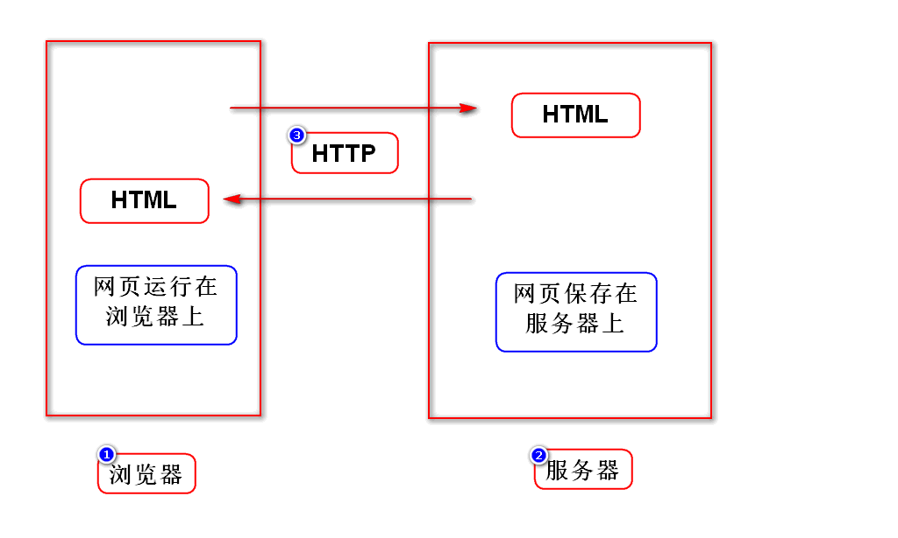
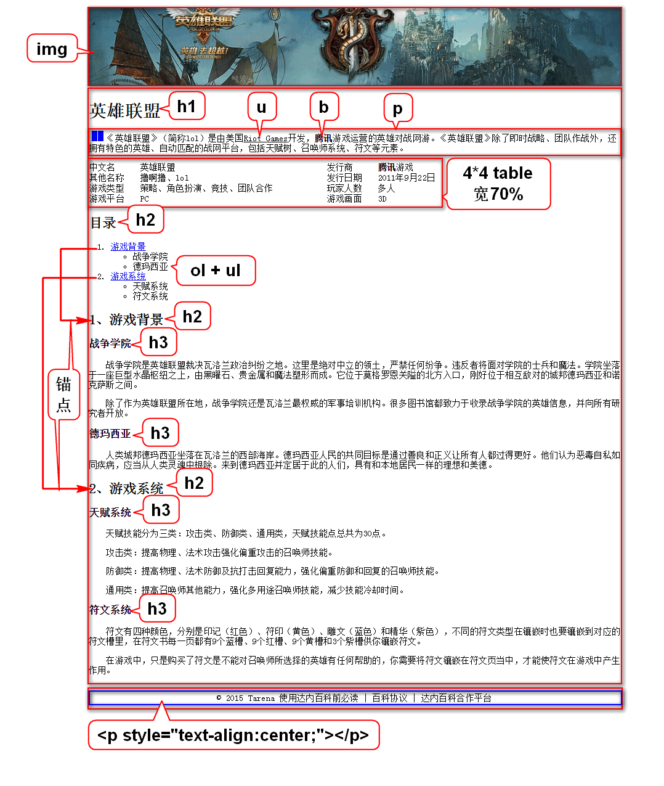

# 一.课程介绍
## 1.HTML(1.5天)
- 勾勒出网页的结构和内容

## 2.CSS(3天)
- 美化网页

## 3.JavaScript(4天)
- 让网页呈现动态的数据和效果

## 4.jQuery(1.5天)
- 是一个框架,提高JS的开发效率

# 二.WEB概述

# 三.XML和HTML对比
## 1.XML
- 可扩展(自定义)标记语言
- 标记、属性、标记之间的关系都可以扩展
- 用来存储或传输数据

## 2.HTML
- 超文本标记语言
- 标记、属性、标记之间的关系都是固定的(w3c)
- 某些版本的HTML严格遵守XML规范
> 可以将HTML理解为标签固定的XML

# 四.跨行跨列

# 五.英雄联盟
## 1.分区
- 所有区域都要设置宽度、边框、居中

		style="border:1px solid red;width:960px;margin:0 auto;"

## 2.逐个开发每个区域

# 补充1:创建WEB项目的注意事项
## 1.选择JavaEE视图
- 在Eclipse右上角选择JavaEE

## 2.选择war
- 创建项目的最后一步选择war

## 3.解决项目自带的错误
- 展开项目
- 右键点击Deployment
- 选择Generate...