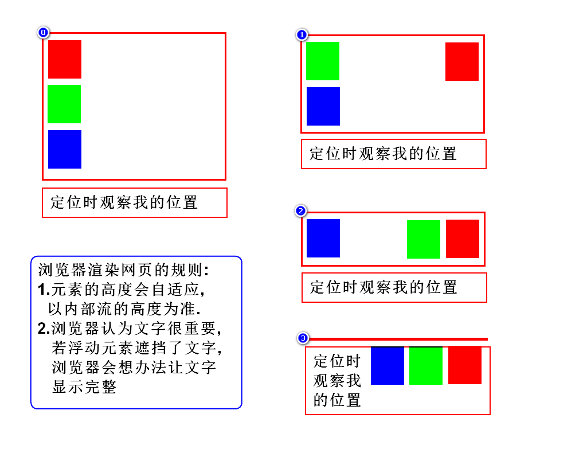
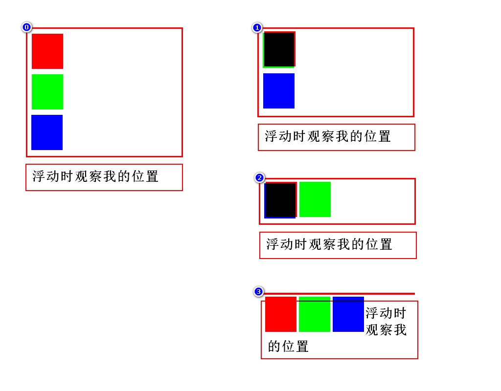
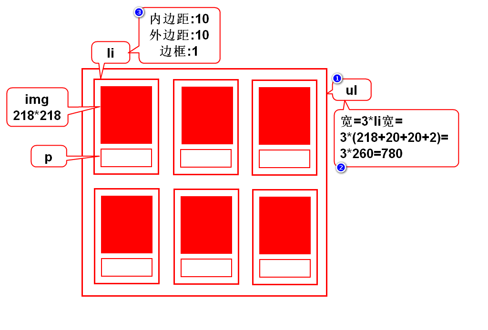
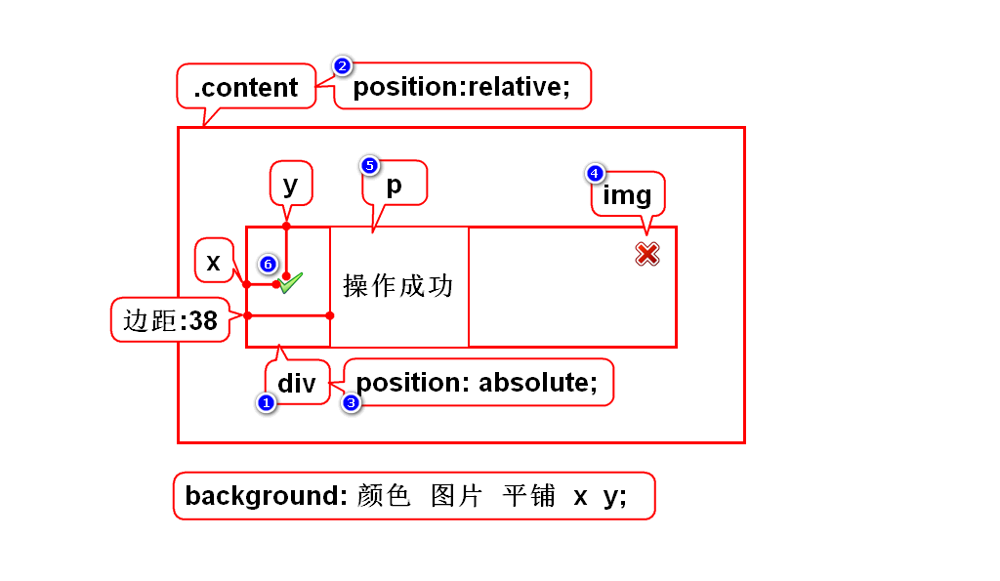

# 一.定位介绍
## 1.什么是定位
- 就是排列(摆放)元素的方式
> 通过定位可以将元素摆放到网页的任意位置

## 2.有哪些定位
### 2.1默认定位
- 默认情况下,块元素垂直排列,行内元素左右排列
- 这种默认排列的方式叫默认定位,也叫流定位
> 流:元素有序排列而形成的队伍

### 2.2特殊定位
1. 浮动定位: 可以让块元素左右排列
2. 相对定位: 让元素以自身为目标产生微小的偏移
3. 绝对定位: 让元素以父辈为目标产生较大的偏移
4. 固定定位: 让元素以窗口为目标产生巨大的偏移
> 后3种定位在逻辑上十分相似

# 二.浮动定位
## 1.介绍
- 作用: 可以让块元素左右排列
- 特点: 浮动的目标会离队(脱离流)
- 步骤: 1)目标离队; 2)弟弟前进; 3)目标到达指定位置;
- 分类: 左浮动,右浮动

## 2.右浮动
- 作用: 可以让块按照倒序左右排列

## 3.左浮动
- 作用: 可以让块按照正序左右排列

## 4.如何消除浮动影响

## 5.照片墙案例

# 三.相对、绝对、固定区别和联系
## 1.区别
- 参考的目标不同

## 2.相同点
- 设置偏移的方式相同

# 四.相对定位
- 以自身为目标产生偏移,通常偏移量很小
- 目标不离队(不脱离流)
- position: relative;
> 特点: 偏移量小,元素不离队

# 五.绝对定位
- 以带有position属性的父辈为目标产生偏移
- 若父辈都有position则以就近的父辈为目标
- 若父辈都没有position则以body为目标
- 目标离队(脱离流)
- position: absolute;
> 注意:你想以谁为目标,就在谁上面加position

# 六.固定定位
- 以浏览器窗口为目标产生偏移
- 目标离队(脱离流)
- position: fixed;
> 注意:你想将元素挂在窗口上不动时用固定定位

# 七.归纳(选择定位的建议)
1. 固定定位: 看是否需要将元素挂在窗口上不动
2. 浮动定位: 看是否要将块元素左右排列
3. 相对定位: 看是否偏移量很小,是否元素不释放位置
4. 绝对定位: 超过15秒没想出来基本就是绝对定位

# 八.管理员列表-5
