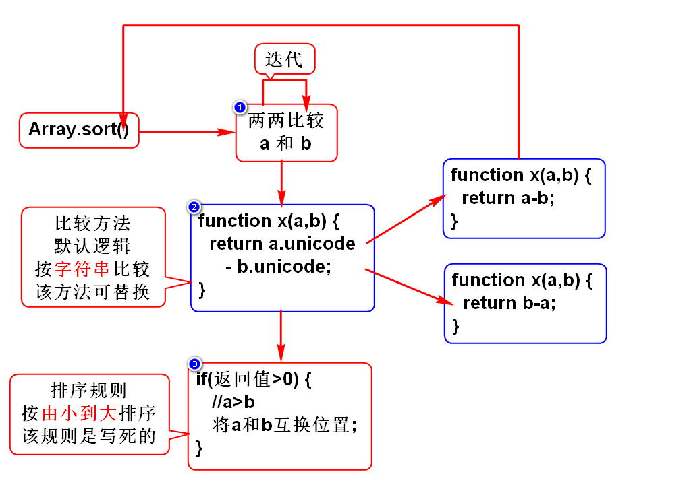
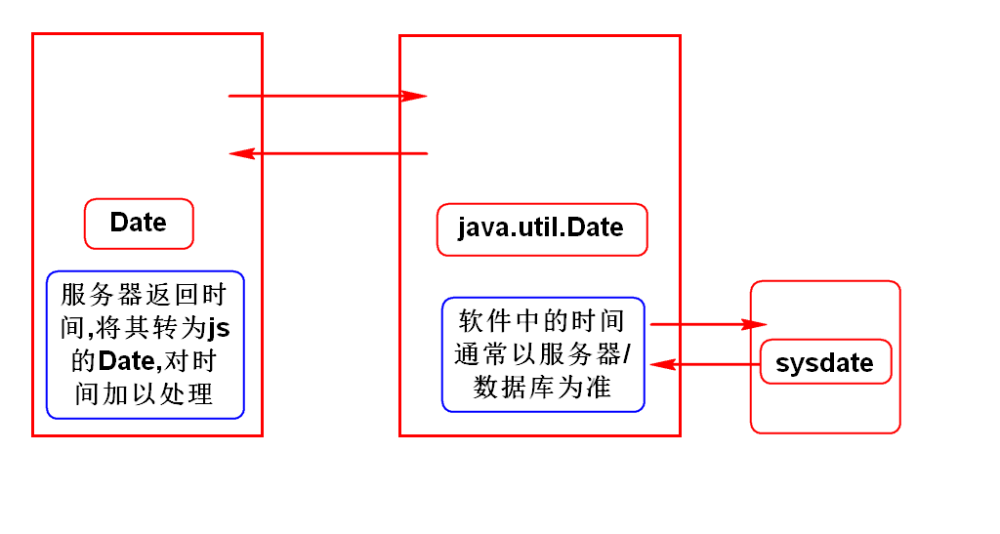

# 一.String(手册)
- 和Java差不多

# 二.Number(*)
- toFixed(n)

# 三.数组(*)
- 如何创建数组
- 数组倒转方法
- 数组排序方法(*)

# 四.Math(手册)
- 和Java差不多

# 五.Date
1. 如何创建日期对象
2. 如何格式化日期对象
3. 如何读写时间分量

# 六.RegExp(***)
## 1.正则对象
- 如何创建正则对象
- test() ***
- exec()

## 2.字符串支持正则的方法(手册)
- replace()
- match()
- search()

# 七.Function对象(*)
- arguments *
- eval *